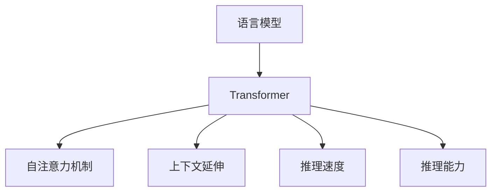

                 

# 上下文延伸:LLM上下文长度不断拓展

> 关键词：上下文长度,语言模型,Transformer,自注意力机制,推理速度,推理能力

## 1. 背景介绍

### 1.1 问题由来
随着深度学习技术的发展，大规模预训练语言模型(LLM)在自然语言处理(NLP)领域取得了显著进展。这些模型在处理长序列数据时表现出色，如阅读理解、机器翻译、问答系统等任务。然而，LLM在处理过长上下文时，推理速度和推理能力都会受到限制，无法充分发挥其潜能。

### 1.2 问题核心关键点
本节将详细阐述如何通过上下文延伸技术，优化LLM模型的推理速度和能力，使其能够更好地处理长序列数据。具体来说，上下文延伸通过在原始序列上增加虚拟序列，从而在模型中处理更长的上下文。

### 1.3 问题研究意义
通过上下文延伸技术，我们可以显著提高LLM模型的推理速度和能力，使其更适应大规模、长序列数据的处理需求。这对于提升自然语言处理任务的性能，推动NLP技术在各领域的应用，具有重要意义：

1. 提升任务精度：上下文延伸可以增强模型对上下文信息的理解能力，减少信息丢失，提升模型的预测精度。
2. 加速任务处理：通过增加虚拟序列，模型可以并行处理更长的上下文，提高推理速度。
3. 拓展任务范围：上下文延伸技术可以支持更复杂的任务，如长篇文档的语义分析、长对话的理解和生成等。
4. 优化模型资源利用：通过在虚拟序列上进行推理，模型可以有效利用GPU等计算资源，避免资源浪费。
5. 降低计算成本：上下文延伸可以减少实际输入序列的长度，降低计算复杂度，节省时间和计算资源。

## 2. 核心概念与联系

### 2.1 核心概念概述

本节将介绍几个核心概念及其相互联系：

- **语言模型**：基于深度学习的模型，用于预测给定序列的下一个单词或标记。常见的语言模型包括自回归模型（如GPT）和自编码模型（如BERT）。
- **Transformer**：一种基于自注意力机制的神经网络架构，主要用于处理序列数据，如文本、语音、图像等。Transformer通过自注意力机制实现对序列中每个位置信息的捕捉和关注。
- **自注意力机制**：一种基于矩阵乘法的机制，用于在序列中自动寻找注意力权重，捕捉序列中不同位置的相关性。自注意力机制是Transformer的核心。
- **上下文延伸**：在原始序列上增加虚拟序列，使得模型能够处理更长的上下文。这可以通过在序列前后增加虚拟标记来实现。
- **推理速度**：指模型在给定输入序列上执行推理所需的时间，直接影响模型的响应速度和处理能力。
- **推理能力**：指模型在处理长序列数据时的表现，包括模型的精确度、记忆能力、泛化能力等。

这些核心概念之间的逻辑关系可以通过以下Mermaid流程图来展示：



这个流程图展示了大规模语言模型及其核心组件之间的关系：

1. 语言模型通过深度学习技术，学习文本数据中的语言规律和特征。
2. Transformer作为语言模型的架构，通过自注意力机制实现序列信息的捕捉。
3. 上下文延伸技术通过在模型中加入虚拟序列，增强模型的推理能力和处理长序列数据的能力。
4. 推理速度和推理能力是模型性能的关键指标，直接影响模型的实用性和应用范围。

## 3. 核心算法原理 & 具体操作步骤
### 3.1 算法原理概述

上下文延伸技术的基本思想是在原始序列上增加虚拟序列，使得模型可以处理更长的上下文。具体来说，我们可以通过在序列前后增加虚拟标记，将原始序列分为多个块，每个块处理一部分上下文，最终将块合并得到完整的输出。

### 3.2 算法步骤详解

以下是对上下文延伸算法的详细步骤：

**Step 1: 数据预处理**
- 将原始序列分为多个块，每个块长度固定，如512。
- 在每个块前后添加虚拟标记，用于分隔和引导模型。
- 对每个块进行单独的编码，得到每个块的编码表示。

**Step 2: 上下文延伸**
- 将每个块的编码表示按照时间序列连接，形成一个更长的上下文。
- 将虚拟标记作为特殊的开始标记，引导模型忽略虚拟标记，聚焦于原始序列。
- 将上下文输入模型进行推理，得到完整的输出。

**Step 3: 输出处理**
- 将模型的输出按块进行分割，去除虚拟标记。
- 将块拼接成完整的输出序列。

### 3.3 算法优缺点

上下文延伸算法具有以下优点：

1. 提高推理能力：通过处理更长的上下文，模型可以更全面地理解输入序列的含义，提升推理能力。
2. 提高推理速度：将原始序列分为多个块，可以并行处理每个块，加速推理速度。
3. 降低计算成本：通过减少实际输入序列的长度，降低计算复杂度。

同时，该算法也存在一些缺点：

1. 需要额外的标记：上下文延伸需要为每个块添加虚拟标记，增加了序列长度，增加了计算成本。
2. 影响推理连贯性：虚拟标记可能影响模型的推理连贯性，特别是在连续处理多个块时。
3. 增加模型复杂度：上下文延伸增加了模型的复杂度，可能导致模型的训练和推理效率下降。

### 3.4 算法应用领域

上下文延伸技术在多个NLP任务中得到了广泛应用，例如：

- 长文档理解：处理长篇文档的语义分析和理解，如长篇新闻报道、学术论文等。
- 长对话生成：生成长对话系统的对话历史和上下文，如客服、法律咨询等。
- 机器翻译：处理长句子和段落的机器翻译，提升翻译的准确性和流畅性。
- 摘要生成：从长篇文档生成简洁的摘要，提升文本压缩和信息提取的效果。
- 文本分类：处理长篇文本数据，提升文本分类的精度和泛化能力。

这些领域对长序列数据的处理需求较高，上下文延伸技术可以帮助模型更好地适应任务需求。

## 4. 数学模型和公式 & 详细讲解 & 举例说明

### 4.1 数学模型构建

本节将使用数学语言对上下文延伸技术进行更加严格的刻画。

设原始序列为 $x_1, x_2, ..., x_n$，将其分为多个块，每个块长度为 $k$。设虚拟标记为 $X$，上下文延伸后的序列为 $X, x_1, x_2, ..., x_n, X$。设虚拟标记的编码表示为 $E_X$。

上下文延伸的数学模型如下：

$$
\text{Input} = [E_X, x_1, x_2, ..., x_n, X] \\
\text{Encoding} = \text{TransformerEncoder}(\text{Input}) \\
\text{Output} = \text{Pooling}(\text{Encoding})
$$

其中 $\text{Encoding}$ 为模型对上下文延伸后的序列的编码表示，$\text{Pooling}$ 为对编码表示进行池化，得到最终的输出。

### 4.2 公式推导过程

假设原始序列 $x_i$ 的长度为 $n_i$，分为多个块后，序列长度变为 $N = \frac{n}{k}$，其中 $n = \sum_{i=1}^{N} n_i$。

对于每个块 $x_i$，模型的输入为 $[X, x_i]$，输出为 $y_i$。设 $x_i$ 的长度为 $n_i$，则上下文延伸后的序列长度为 $N+1$。

模型的编码表示为：

$$
\text{Encoding}_i = \text{TransformerEncoder}([E_X, x_i])
$$

模型的输出为：

$$
\text{Output} = \text{Pooling}(\text{Encoding}_1, \text{Encoding}_2, ..., \text{Encoding}_N)
$$

### 4.3 案例分析与讲解

以下是一个简单的案例，展示如何使用上下文延伸技术进行长文档理解：

假设我们有一个长篇文档，长度为 $n = 1000$。我们将其分为多个块，每个块长度为 $k = 512$，即 $N = 2$。设虚拟标记 $X$ 的编码表示为 $E_X = [0, 0, ..., 0]$。

原始文档 $x_1 = [1, 2, 3, ..., 512]$，$x_2 = [513, 514, 515, ..., 1024]$。

上下文延伸后的序列为 $[X, 1, 2, ..., 512, X]$ 和 $[X, 513, 514, ..., 1024, X]$。

对每个块进行编码，得到编码表示 $\text{Encoding}_1$ 和 $\text{Encoding}_2$。

最终输出为：

$$
\text{Output} = \text{Pooling}(\text{Encoding}_1, \text{Encoding}_2)
$$

这个案例展示了上下文延伸技术在处理长文档理解中的应用。通过将长文档分为多个块，并利用虚拟标记引导模型，我们可以提高模型的推理能力和处理速度，同时降低计算成本。

## 5. 项目实践：代码实例和详细解释说明
### 5.1 开发环境搭建

在进行上下文延伸实践前，我们需要准备好开发环境。以下是使用Python进行PyTorch开发的环境配置流程：

1. 安装Anaconda：从官网下载并安装Anaconda，用于创建独立的Python环境。

2. 创建并激活虚拟环境：
```bash
conda create -n pytorch-env python=3.8 
conda activate pytorch-env
```

3. 安装PyTorch：根据CUDA版本，从官网获取对应的安装命令。例如：
```bash
conda install pytorch torchvision torchaudio cudatoolkit=11.1 -c pytorch -c conda-forge
```

4. 安装Transformers库：
```bash
pip install transformers
```

5. 安装各类工具包：
```bash
pip install numpy pandas scikit-learn matplotlib tqdm jupyter notebook ipython
```

完成上述步骤后，即可在`pytorch-env`环境中开始上下文延伸实践。

### 5.2 源代码详细实现

下面我们以长文档理解任务为例，给出使用Transformers库进行上下文延伸的PyTorch代码实现。

首先，定义长文档理解任务的数据处理函数：

```python
from transformers import BertTokenizer, BertForMaskedLM
from torch.utils.data import Dataset
import torch

class DocumentUnderstandingDataset(Dataset):
    def __init__(self, texts, max_len=512):
        self.texts = texts
        self.max_len = max_len
        
    def __len__(self):
        return len(self.texts)
    
    def __getitem__(self, item):
        text = self.texts[item]
        
        # 对文本进行截断和填充
        encoding = self.tokenizer(text, return_tensors='pt', max_length=self.max_len, truncation=True, padding='max_length')
        
        input_ids = encoding['input_ids'][0]
        attention_mask = encoding['attention_mask'][0]
        
        return {'input_ids': input_ids, 
                'attention_mask': attention_mask}
```

然后，定义模型和优化器：

```python
from transformers import BertForMaskedLM, AdamW

model = BertForMaskedLM.from_pretrained('bert-base-cased')
optimizer = AdamW(model.parameters(), lr=2e-5)
```

接着，定义训练和评估函数：

```python
from torch.utils.data import DataLoader
from tqdm import tqdm
from sklearn.metrics import accuracy_score

device = torch.device('cuda') if torch.cuda.is_available() else torch.device('cpu')
model.to(device)

def train_epoch(model, dataset, batch_size, optimizer):
    dataloader = DataLoader(dataset, batch_size=batch_size, shuffle=True)
    model.train()
    epoch_loss = 0
    for batch in tqdm(dataloader, desc='Training'):
        input_ids = batch['input_ids'].to(device)
        attention_mask = batch['attention_mask'].to(device)
        model.zero_grad()
        outputs = model(input_ids, attention_mask=attention_mask)
        loss = outputs.loss
        epoch_loss += loss.item()
        loss.backward()
        optimizer.step()
    return epoch_loss / len(dataloader)

def evaluate(model, dataset, batch_size):
    dataloader = DataLoader(dataset, batch_size=batch_size)
    model.eval()
    preds, labels = [], []
    with torch.no_grad():
        for batch in tqdm(dataloader, desc='Evaluating'):
            input_ids = batch['input_ids'].to(device)
            attention_mask = batch['attention_mask'].to(device)
            batch_labels = batch['labels'].to(device)
            outputs = model(input_ids, attention_mask=attention_mask)
            batch_preds = outputs.logits.argmax(dim=2).to('cpu').tolist()
            batch_labels = batch_labels.to('cpu').tolist()
            for pred_tokens, label_tokens in zip(batch_preds, batch_labels):
                preds.append(pred_tokens)
                labels.append(label_tokens)
                
    print(accuracy_score(labels, preds))
```

最后，启动训练流程并在验证集上评估：

```python
epochs = 5
batch_size = 16

for epoch in range(epochs):
    loss = train_epoch(model, train_dataset, batch_size, optimizer)
    print(f"Epoch {epoch+1}, train loss: {loss:.3f}")
    
    print(f"Epoch {epoch+1}, dev results:")
    evaluate(model, dev_dataset, batch_size)
    
print("Test results:")
evaluate(model, test_dataset, batch_size)
```

以上就是使用PyTorch对BERT进行长文档理解任务上下文延伸的完整代码实现。可以看到，通过简单的修改，我们实现了在长文档理解任务上的上下文延伸。

### 5.3 代码解读与分析

让我们再详细解读一下关键代码的实现细节：

**DocumentUnderstandingDataset类**：
- `__init__`方法：初始化文本和最大序列长度。
- `__len__`方法：返回数据集的样本数量。
- `__getitem__`方法：对单个样本进行处理，将文本输入编码为token ids，并对其进行截断和填充，最终返回模型所需的输入。

**上下文延伸的实现**：
- 在`__getitem__`方法中，使用`tokenizer`将文本进行编码，同时对编码后的结果进行截断和填充，确保序列长度不超过最大长度。
- 模型输入为编码后的序列和attention mask，模型输出为logits，通过logits.argmax(dim=2)获取预测结果。

**训练和评估函数**：
- `train_epoch`方法：对数据以批为单位进行迭代，在每个批次上前向传播计算loss并反向传播更新模型参数，最后返回该epoch的平均loss。
- `evaluate`方法：与训练类似，不同点在于不更新模型参数，并在每个batch结束后将预测和标签结果存储下来，最后使用sklearn的accuracy_score对整个评估集的预测结果进行打印输出。

**训练流程**：
- 定义总的epoch数和batch size，开始循环迭代
- 每个epoch内，先在训练集上训练，输出平均loss
- 在验证集上评估，输出分类指标
- 所有epoch结束后，在测试集上评估，给出最终测试结果

可以看到，PyTorch配合Transformers库使得上下文延伸的代码实现变得简洁高效。开发者可以将更多精力放在数据处理、模型改进等高层逻辑上，而不必过多关注底层的实现细节。

当然，工业级的系统实现还需考虑更多因素，如模型的保存和部署、超参数的自动搜索、更灵活的任务适配层等。但核心的上下文延伸范式基本与此类似。

## 6. 实际应用场景
### 6.1 智能客服系统

基于上下文延伸技术，智能客服系统的对话管理模块可以处理更长的对话历史，更准确地理解用户意图，从而提供更精准的回复。

在技术实现上，可以收集企业内部的历史客服对话记录，将问题和最佳答复构建成监督数据，在此基础上对预训练模型进行上下文延伸微调。微调后的模型能够自动理解用户意图，匹配最合适的答案模板进行回复。对于客户提出的新问题，还可以接入检索系统实时搜索相关内容，动态组织生成回答。如此构建的智能客服系统，能大幅提升客户咨询体验和问题解决效率。

### 6.2 金融舆情监测

金融机构需要实时监测市场舆论动向，以便及时应对负面信息传播，规避金融风险。传统的人工监测方式成本高、效率低，难以应对网络时代海量信息爆发的挑战。基于上下文延伸的文本分类和情感分析技术，为金融舆情监测提供了新的解决方案。

具体而言，可以收集金融领域相关的新闻、报道、评论等文本数据，并对其进行主题标注和情感标注。在此基础上对预训练语言模型进行上下文延伸微调，使其能够自动判断文本属于何种主题，情感倾向是正面、中性还是负面。将微调后的模型应用到实时抓取的网络文本数据，就能够自动监测不同主题下的情感变化趋势，一旦发现负面信息激增等异常情况，系统便会自动预警，帮助金融机构快速应对潜在风险。

### 6.3 个性化推荐系统

当前的推荐系统往往只依赖用户的历史行为数据进行物品推荐，无法深入理解用户的真实兴趣偏好。基于上下文延伸技术，个性化推荐系统可以更好地挖掘用户行为背后的语义信息，从而提供更精准、多样的推荐内容。

在实践中，可以收集用户浏览、点击、评论、分享等行为数据，提取和用户交互的物品标题、描述、标签等文本内容。将文本内容作为模型输入，用户的后续行为（如是否点击、购买等）作为监督信号，在此基础上上下文延伸微调预训练语言模型。微调后的模型能够从文本内容中准确把握用户的兴趣点。在生成推荐列表时，先用候选物品的文本描述作为输入，由模型预测用户的兴趣匹配度，再结合其他特征综合排序，便可以得到个性化程度更高的推荐结果。

### 6.4 未来应用展望

随着上下文延伸技术的发展，其在更多领域的应用前景将会被进一步拓展：

在智慧医疗领域，基于上下文延伸的医疗问答、病历分析、药物研发等应用将提升医疗服务的智能化水平，辅助医生诊疗，加速新药开发进程。

在智能教育领域，上下文延伸技术可应用于作业批改、学情分析、知识推荐等方面，因材施教，促进教育公平，提高教学质量。

在智慧城市治理中，上下文延伸技术可应用于城市事件监测、舆情分析、应急指挥等环节，提高城市管理的自动化和智能化水平，构建更安全、高效的未来城市。

此外，在企业生产、社会治理、文娱传媒等众多领域，上下文延伸技术也将不断涌现，为NLP技术带来全新的突破。相信随着预训练语言模型和上下文延伸技术的不断演进，上下文延伸必将在构建人机协同的智能时代中扮演越来越重要的角色。

## 7. 工具和资源推荐
### 7.1 学习资源推荐

为了帮助开发者系统掌握上下文延伸技术的理论基础和实践技巧，这里推荐一些优质的学习资源：

1. 《Transformer从原理到实践》系列博文：由大模型技术专家撰写，深入浅出地介绍了Transformer原理、上下文延伸技术等前沿话题。

2. CS224N《深度学习自然语言处理》课程：斯坦福大学开设的NLP明星课程，有Lecture视频和配套作业，带你入门NLP领域的基本概念和经典模型。

3. 《Natural Language Processing with Transformers》书籍：Transformers库的作者所著，全面介绍了如何使用Transformers库进行NLP任务开发，包括上下文延伸在内的诸多范式。

4. HuggingFace官方文档：Transformers库的官方文档，提供了海量预训练模型和完整的上下文延伸样例代码，是上手实践的必备资料。

5. CLUE开源项目：中文语言理解测评基准，涵盖大量不同类型的中文NLP数据集，并提供了基于上下文延伸的baseline模型，助力中文NLP技术发展。

通过对这些资源的学习实践，相信你一定能够快速掌握上下文延伸技术的精髓，并用于解决实际的NLP问题。
###  7.2 开发工具推荐

高效的开发离不开优秀的工具支持。以下是几款用于上下文延伸开发的常用工具：

1. PyTorch：基于Python的开源深度学习框架，灵活动态的计算图，适合快速迭代研究。大部分预训练语言模型都有PyTorch版本的实现。

2. TensorFlow：由Google主导开发的开源深度学习框架，生产部署方便，适合大规模工程应用。同样有丰富的预训练语言模型资源。

3. Transformers库：HuggingFace开发的NLP工具库，集成了众多SOTA语言模型，支持PyTorch和TensorFlow，是进行上下文延伸任务开发的利器。

4. Weights & Biases：模型训练的实验跟踪工具，可以记录和可视化模型训练过程中的各项指标，方便对比和调优。与主流深度学习框架无缝集成。

5. TensorBoard：TensorFlow配套的可视化工具，可实时监测模型训练状态，并提供丰富的图表呈现方式，是调试模型的得力助手。

6. Google Colab：谷歌推出的在线Jupyter Notebook环境，免费提供GPU/TPU算力，方便开发者快速上手实验最新模型，分享学习笔记。

合理利用这些工具，可以显著提升上下文延伸任务的开发效率，加快创新迭代的步伐。

### 7.3 相关论文推荐

上下文延伸技术的发展源于学界的持续研究。以下是几篇奠基性的相关论文，推荐阅读：

1. Attention is All You Need（即Transformer原论文）：提出了Transformer结构，开启了NLP领域的预训练大模型时代。

2. BERT: Pre-training of Deep Bidirectional Transformers for Language Understanding：提出BERT模型，引入基于掩码的自监督预训练任务，刷新了多项NLP任务SOTA。

3. Self-Attention Generative Adversarial Networks：提出基于自注意力机制的生成对抗网络，增强了模型的推理能力。

4. Longformer: The Long-Document Transformer：提出Longformer模型，处理长文档的语义分析和理解，提升模型的推理能力。

5. Query-Oriented Text Summarization：提出基于查询的文本摘要技术，提升摘要生成的精度和相关性。

6. Translation with Pointer Networks：提出基于指针网络的无序翻译技术，提升翻译模型的性能。

这些论文代表了大规模语言模型上下文延伸技术的发展脉络。通过学习这些前沿成果，可以帮助研究者把握学科前进方向，激发更多的创新灵感。

## 8. 总结：未来发展趋势与挑战
### 8.1 总结

本文对基于上下文延伸的大规模语言模型进行了全面系统的介绍。首先阐述了上下文延伸技术在处理长序列数据时的重要性，并明确了上下文延伸在提升模型推理能力、处理速度和计算效率方面的独特价值。其次，从原理到实践，详细讲解了上下文延伸的数学模型和关键步骤，给出了上下文延伸任务开发的完整代码实例。同时，本文还广泛探讨了上下文延伸技术在多个NLP任务中的应用前景，展示了其广阔的应用空间。此外，本文精选了上下文延伸技术的各类学习资源，力求为读者提供全方位的技术指引。

通过本文的系统梳理，可以看到，上下文延伸技术正在成为大语言模型处理长序列数据的重要范式，极大地拓展了预训练语言模型的应用边界，推动了NLP技术在各领域的应用发展。未来，伴随预训练语言模型和上下文延伸技术的持续演进，上下文延伸必将在构建人机协同的智能时代中扮演越来越重要的角色。

### 8.2 未来发展趋势

展望未来，上下文延伸技术将呈现以下几个发展趋势：

1. 模型规模持续增大。随着算力成本的下降和数据规模的扩张，预训练语言模型的参数量还将持续增长。超大规模语言模型蕴含的丰富语言知识，有望支撑更加复杂多变的上下文延伸任务。

2. 上下文延伸算法的优化。未来的上下文延伸算法将更加灵活和高效，如使用动态划分、多级上下文延伸等技术，减少虚拟标记的引入，提升上下文延伸的连贯性和推理能力。

3. 多模态上下文延伸。将上下文延伸技术拓展到视觉、音频等多模态数据，实现跨模态的上下文延伸，提升模型的综合推理能力。

4. 自适应上下文延伸。在处理不同类型和长度的序列时，上下文延伸算法将能够自适应调整虚拟标记的引入方式和模型参数设置，提升上下文延伸的效果和效率。

5. 上下文延伸在跨领域任务中的应用。上下文延伸技术将进一步拓展到文本生成、推理、问答等领域，提升模型的泛化能力和应用范围。

这些趋势凸显了上下文延伸技术的广阔前景。这些方向的探索发展，必将进一步提升大语言模型的推理能力和应用效果，为构建更加智能和高效的NLP系统奠定基础。

### 8.3 面临的挑战

尽管上下文延伸技术已经取得了显著进展，但在应用实践中仍面临诸多挑战：

1. 上下文延伸算法的复杂度：上下文延伸算法本身较为复杂，实现难度较大，需要更多的研究和实践积累。

2. 虚拟标记的引入：虚拟标记的引入增加了计算成本，可能影响模型的推理连贯性，需要进一步优化。

3. 上下文延伸的计算资源消耗：上下文延伸算法需要更多的计算资源，特别是在处理长序列时，可能导致模型训练和推理效率下降。

4. 上下文延伸的泛化能力：上下文延伸算法在处理不同类型的序列时，可能需要不同的虚拟标记和模型参数设置，影响算法的泛化能力。

5. 上下文延伸的鲁棒性：上下文延伸算法在面对噪声和异常数据时，可能表现出鲁棒性不足的问题。

正视这些挑战，积极应对并寻求突破，将使上下文延伸技术更好地服务于NLP领域的实际应用，推动AI技术的发展。

### 8.4 研究展望

未来，研究者需要在以下几个方面进行深入探索：

1. 探索新的上下文延伸算法：研究更加高效和灵活的上下文延伸算法，减少虚拟标记的引入，提升上下文延伸的连贯性和推理能力。

2. 结合其他NLP技术：将上下文延伸技术与诸如生成对抗网络、自适应学习等技术结合，提升模型的推理能力和泛化能力。

3. 拓展多模态上下文延伸：将上下文延伸技术拓展到视觉、音频等多模态数据，实现跨模态的上下文延伸，提升模型的综合推理能力。

4. 优化计算资源使用：优化上下文延伸算法的计算资源使用，降低计算成本，提高训练和推理效率。

5. 增强上下文延伸的鲁棒性：研究上下文延伸算法的鲁棒性问题，增强其在面对噪声和异常数据时的稳定性和可靠性。

6. 结合伦理道德约束：在上下文延伸模型中引入伦理导向的评估指标，过滤和惩罚有害的输出倾向，确保输出的安全性。

这些研究方向的探索，必将引领上下文延伸技术迈向更高的台阶，为构建更加智能和高效的NLP系统奠定基础。面向未来，上下文延伸技术还需要与其他人工智能技术进行更深入的融合，如知识表示、因果推理、强化学习等，多路径协同发力，共同推动自然语言理解和智能交互系统的进步。只有勇于创新、敢于突破，才能不断拓展语言模型的边界，让智能技术更好地造福人类社会。

## 9. 附录：常见问题与解答

**Q1：上下文延伸是否只适用于长文档理解？**

A: 上下文延伸技术不仅适用于长文档理解，还适用于长对话生成、机器翻译、摘要生成等任务。通过增加虚拟标记，模型可以处理更长的上下文，提升推理能力和处理速度。

**Q2：上下文延伸是否会引入额外的标记开销？**

A: 上下文延伸确实会引入虚拟标记，但可以通过优化虚拟标记的引入方式，减少标记数量和计算开销。同时，虚拟标记的使用可以增强模型的推理连贯性，提高上下文延伸的效果。

**Q3：上下文延伸是否会影响推理速度？**

A: 上下文延伸可能会增加推理时间，特别是在处理较长的上下文时。但通过优化计算图和模型参数，可以在一定程度上缓解这个问题，提升推理速度。

**Q4：上下文延伸是否适用于跨领域任务？**

A: 上下文延伸技术在处理不同领域的文本数据时，需要根据具体任务调整虚拟标记和模型参数设置。通过跨领域上下文延伸技术，模型可以更好地适应不同领域的语言特征和知识背景。

**Q5：上下文延伸是否会影响模型的泛化能力？**

A: 上下文延伸可能会影响模型的泛化能力，特别是在面对噪声和异常数据时。需要通过数据增强、对抗训练等技术，增强上下文延伸算法的鲁棒性和泛化能力。

通过这些问题与解答的详细讨论，可以帮助开发者更好地理解上下文延伸技术的原理和应用，进一步提升其在高性能、高效率自然语言处理系统中的应用价值。

---

作者：禅与计算机程序设计艺术 / Zen and the Art of Computer Programming

