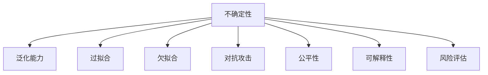

                 

# 不确定性:机器学习面临的普遍挑战

> 关键词：不确定性, 机器学习, 数据噪声, 模型泛化, 过拟合, 对抗攻击, 公平性, 可解释性, 风险评估

## 1. 背景介绍

### 1.1 问题由来
在机器学习的快速发展中，模型性能和实际应用效果之间的差距成为了困扰学术界和工业界的普遍问题。模型在训练集上表现出色的同时，在测试集上却常常遭遇严重的性能下降。机器学习模型的鲁棒性、泛化能力、可解释性等核心能力不断受到质疑。这一现象引起了广泛关注，亟需深入探讨背后的原因和解决策略。

### 1.2 问题核心关键点
机器学习中的不确定性问题主要体现在以下几个方面：
1. **数据噪声和偏差**：训练数据中存在噪声、偏差和不平衡等问题，影响模型的性能。
2. **过拟合和欠拟合**：模型在训练集上过拟合，在测试集上泛化能力不足。
3. **对抗攻击**：模型对对抗样本的敏感性，可能导致系统安全漏洞。
4. **公平性**：模型对不同群体的偏见，影响模型的社会责任和公信力。
5. **可解释性**：模型预测过程和决策依据难以解释，难以满足合规和透明性要求。
6. **风险评估**：模型输出不确定性的量化和控制，确保实际应用中的风险可控。

这些问题不仅限制了机器学习模型在大规模实际应用中的表现，也引发了关于技术伦理和法律责任的讨论。因此，理解和解决这些不确定性问题，成为当前机器学习领域的研究热点和挑战。

## 2. 核心概念与联系

### 2.1 核心概念概述

为更好地理解机器学习中的不确定性问题，本节将介绍几个密切相关的核心概念：

- **不确定性(Uncertainty)**：指模型在输入数据或参数空间中未被完全确定的部分，包括数据噪声、模型参数的不确定性、模型结构和超参数的不确定性等。
- **泛化能力(Generalization)**：指模型在未见过的数据上表现良好的能力，反映模型的泛化能力。
- **过拟合(Overfitting)**：指模型在训练集上表现优异，但在测试集上性能下降的现象，反映模型对训练数据的过度拟合。
- **欠拟合(Underfitting)**：指模型无法充分捕捉训练数据的规律，无法在训练集和测试集上获得良好表现。
- **对抗攻击(Adversarial Attacks)**：指攻击者通过精心设计的扰动样本，欺骗模型预测，影响模型决策过程。
- **公平性(Fairness)**：指模型在对待不同群体时不应存在偏见，确保模型决策的公平性和公正性。
- **可解释性(Explainability)**：指模型决策过程的透明性和可理解性，满足合规要求和用户信任。
- **风险评估(Risk Assessment)**：指对模型输出不确定性的量化和控制，确保模型在实际应用中的安全性。

这些核心概念之间的逻辑关系可以通过以下Mermaid流程图来展示：



这个流程图展示了大语言模型的核心概念及其之间的关系：

1. 不确定性是机器学习中普遍存在的问题。
2. 泛化能力受不确定性影响，过拟合和欠拟合均是不同类型的不确定性表现。
3. 对抗攻击源于对模型的不确定性利用，不公平的模型则反映了对不同群体的偏见。
4. 可解释性和风险评估则是从输出和应用角度，对不确定性的应对措施。

这些概念共同构成了机器学习中的不确定性问题的研究框架，是理解和应对不确定性问题的关键。

## 3. 核心算法原理 & 具体操作步骤
### 3.1 算法原理概述

机器学习中的不确定性问题，本质上是在模型训练和应用过程中，数据、模型、算法等多方面因素相互作用的结果。其核心思想是通过对不确定性的建模和控制，提高模型的泛化能力、鲁棒性和可解释性。

形式化地，假设模型 $M$ 在输入 $x$ 上的输出为 $y=M(x)$，其中 $y$ 表示预测结果。则模型的预测不确定性可以表示为 $p(y|x)$，即在给定输入 $x$ 下，输出 $y$ 的概率分布。模型的泛化能力可以表示为 $p(y|x_{test})$，即在未见过的测试数据 $x_{test}$ 上，预测结果 $y$ 的概率分布。

因此，机器学习中的不确定性问题，即如何在训练和应用过程中，最小化不确定性，最大化泛化能力。

### 3.2 算法步骤详解

机器学习中的不确定性问题，通常包括以下几个关键步骤：

**Step 1: 数据预处理**
- 收集和清洗训练数据，去除噪声和异常值。
- 进行数据增强，如数据扩充、回译、对抗样本生成等，丰富数据集多样性。
- 设计合适的数据分割策略，划分训练集、验证集和测试集。

**Step 2: 模型选择和训练**
- 选择合适的模型架构和超参数，如深度、宽度、激活函数、正则化等。
- 采用适当的优化算法和损失函数，如Adam、SGD、交叉熵等。
- 在训练集上对模型进行有监督的优化，最小化损失函数。

**Step 3: 模型评估和优化**
- 在验证集上评估模型泛化能力，使用各种评估指标如准确率、F1-score等。
- 根据评估结果调整模型超参数，防止过拟合和欠拟合。
- 使用正则化、Dropout、Early Stopping等技术控制模型复杂度，提高泛化能力。

**Step 4: 模型部署和应用**
- 将训练好的模型部署到实际应用环境中，如生产服务器、移动应用等。
- 在实际应用中监控模型表现，收集用户反馈和行为数据。
- 根据收集到的数据，定期重新训练和优化模型。

### 3.3 算法优缺点

机器学习中的不确定性问题，通过以下几种方式处理，具有以下优点：
1. 增强模型泛化能力。通过数据增强和正则化技术，提高模型对噪声和偏差的鲁棒性，提升泛化能力。
2. 提高模型安全性。对抗攻击方法提高模型的鲁棒性，防止恶意攻击和数据泄露。
3. 确保模型公平性。通过公平性约束和多样化训练数据，减少模型偏见，确保模型决策公平。
4. 增强模型可解释性。通过可解释性技术如LIME、SHAP等，提高模型决策过程的透明度和可理解性。
5. 降低模型风险。通过风险评估技术，量化模型不确定性，控制模型风险。

同时，这些方法也存在一定的局限性：
1. 计算资源消耗大。数据增强、对抗训练等方法通常需要额外的计算资源。
2. 模型复杂度高。正则化和对抗训练等方法会增加模型复杂度，可能影响模型训练速度和计算效率。
3. 参数调优难度大。超参数选择和模型优化过程复杂，需要丰富的经验和迭代调试。
4. 模型性能波动大。模型训练和应用过程中的不确定性，可能导致模型性能波动。
5. 用户信任度低。复杂模型和黑盒模型难以获得用户信任，难以在合规和透明性要求较高的场景中应用。

尽管存在这些局限性，但机器学习中的不确定性问题，仍然是当前研究的重要方向，有待进一步探索和优化。

### 3.4 算法应用领域

机器学习中的不确定性问题，广泛应用于各个领域：

- **医疗健康**：医疗诊断和治疗方案推荐，需要考虑模型的鲁棒性和公平性，确保对不同群体的公平诊断。
- **金融服务**：金融风控和欺诈检测，需要控制模型的风险和不确定性，确保金融安全和稳定。
- **智能制造**：智能设备和生产过程控制，需要确保模型决策的可解释性和稳定性，提升生产效率和质量。
- **智能交通**：自动驾驶和智能交通管理，需要提高模型的鲁棒性和公平性，确保交通安全和公正。
- **零售电商**：个性化推荐和用户行为分析，需要控制模型的风险和不确定性，提升用户体验和转化率。
- **能源管理**：智能电网和能源优化，需要考虑模型的泛化能力和公平性，优化能源分配和利用。

这些领域中的不确定性问题，需要根据具体情况进行有针对性的解决策略。

## 4. 数学模型和公式 & 详细讲解  
### 4.1 数学模型构建

本节将使用数学语言对机器学习中的不确定性问题进行更加严格的刻画。

假设训练数据集为 $D=\{(x_i,y_i)\}_{i=1}^N$，其中 $x_i$ 表示输入，$y_i$ 表示标签。模型 $M$ 在输入 $x$ 上的输出为 $y=M(x)$。模型的损失函数为 $L(y,M(x))$，表示预测结果与真实标签之间的差距。模型的预测不确定性可以表示为 $p(y|x)$，即在给定输入 $x$ 下，预测结果 $y$ 的概率分布。模型的泛化能力可以表示为 $p(y|x_{test})$，即在未见过的测试数据 $x_{test}$ 上，预测结果 $y$ 的概率分布。

模型的泛化能力可以通过以下公式计算：

$$
p(y|x_{test}) = \int p(y|x)\cdot p(x|x_{test})dx
$$

其中 $p(x|x_{test})$ 表示给定 $x_{test}$ 时，模型输入 $x$ 的概率分布。在实际应用中，通常使用验证集对模型进行评估，即 $p(y|x_{test})=p(y|x_{val})$。

模型的泛化能力与训练集大小、模型复杂度、数据噪声等因素密切相关。通过控制这些因素，可以有效提升模型的泛化能力。

### 4.2 公式推导过程

以下我们以二分类任务为例，推导模型泛化能力的计算公式。

假设模型 $M$ 在输入 $x$ 上的输出为 $\hat{y}=M(x) \in [0,1]$，表示样本属于正类的概率。真实标签 $y \in \{0,1\}$。则二分类交叉熵损失函数定义为：

$$
L(y,M(x)) = -[y\log \hat{y} + (1-y)\log (1-\hat{y})]
$$

其梯度为：

$$
\nabla_{\theta}L(y,M(x)) = [\hat{y}-y, y-\hat{y}]
$$

其中 $\hat{y}$ 为模型的预测结果，$y$ 为真实标签。在梯度下降算法中，模型的参数 $\theta$ 更新公式为：

$$
\theta \leftarrow \theta - \eta \nabla_{\theta}L(y,M(x))
$$

其中 $\eta$ 为学习率。在训练过程中，通过不断迭代更新模型参数，最小化损失函数，使模型对输入 $x$ 的预测结果 $y$ 更加准确。

在实际应用中，模型的泛化能力可以通过验证集上的表现来评估。设验证集为 $D_{val}$，则模型的泛化能力 $p(y|x_{val})$ 可以通过以下公式计算：

$$
p(y|x_{val}) = \frac{1}{N_{val}}\sum_{i=1}^{N_{val}}p(y_i|x_{val_i})
$$

其中 $N_{val}$ 为验证集大小。通过比较 $p(y|x_{val})$ 与 $p(y|x_{test})$ 的差异，可以评估模型的泛化能力。

## 5. 项目实践：代码实例和详细解释说明
### 5.1 开发环境搭建

在进行不确定性问题处理实践前，我们需要准备好开发环境。以下是使用Python进行PyTorch开发的环境配置流程：

1. 安装Anaconda：从官网下载并安装Anaconda，用于创建独立的Python环境。

2. 创建并激活虚拟环境：
```bash
conda create -n pytorch-env python=3.8 
conda activate pytorch-env
```

3. 安装PyTorch：根据CUDA版本，从官网获取对应的安装命令。例如：
```bash
conda install pytorch torchvision torchaudio cudatoolkit=11.1 -c pytorch -c conda-forge
```

4. 安装Scikit-Learn：
```bash
pip install scikit-learn
```

5. 安装TensorBoard：
```bash
pip install tensorboard
```

完成上述步骤后，即可在`pytorch-env`环境中开始不确定性问题处理的实践。

### 5.2 源代码详细实现

这里我们以对抗攻击为例，展示如何使用PyTorch实现对抗样本生成，并评估模型的鲁棒性。

首先，定义对抗样本生成函数：

```python
import torch
from torchvision import transforms
from torchvision.datasets import CIFAR10
from adversarial foolbox import AdversarialExamples
from torchvision.transforms import Normalize, Compose, Lambda

class AdversarialSamples:
    def __init__(self, model, criterion, device, max_l2=0.001):
        self.model = model
        self.criterion = criterion
        self.device = device
        self.max_l2 = max_l2
        
    def get_adversarial(self, x, y, clip=None):
        with torch.no_grad():
            x_adv = AdversarialExamples(self.model, self.criterion, self.device, max_l2=self.max_l2, max_iters=20, clip=clip)
            x_adv = x_adv(x, y, self.device)
            x_adv = x_adv.to('cpu')
        return x_adv
    
    def generate(self, x, y):
        x_adv = self.get_adversarial(x, y)
        return x_adv

# 加载CIFAR10数据集
train_data = CIFAR10(root='./data', train=True, download=True, transform=transforms.Compose([Normalize(mean=[0.5, 0.5, 0.5], std=[0.5, 0.5, 0.5]), Lambda(lambda x: x/255.)]))
test_data = CIFAR10(root='./data', train=False, download=True, transform=transforms.Compose([Normalize(mean=[0.5, 0.5, 0.5], std=[0.5, 0.5, 0.5]), Lambda(lambda x: x/255.)]))
train_loader = torch.utils.data.DataLoader(train_data, batch_size=64, shuffle=True)
test_loader = torch.utils.data.DataLoader(test_data, batch_size=64, shuffle=False)
```

然后，定义模型和损失函数：

```python
from torchvision.models import VGG16
from torch.nn import CrossEntropyLoss

model = VGG16().to(device).eval()
criterion = CrossEntropyLoss()
```

接着，定义对抗攻击评估函数：

```python
def evaluate_adversarial(model, adversarial_data):
    correct = 0
    total = 0
    for i, (x, y) in enumerate(adversarial_data):
        x_adv = adversarial_data[i]
        x = x_adv.to(device)
        y = y.to(device)
        with torch.no_grad():
            output = model(x)
            loss = criterion(output, y)
        if loss.item() < 0.05:
            correct += 1
        total += 1
    return correct/total
```

最后，启动对抗攻击流程并在测试集上评估：

```python
for batch in train_loader:
    x, y = batch
    x_adv = adversarial_model.generate(x, y)
    adversarial_data = [(x_adv, y)]
    accuracy = evaluate_adversarial(model, adversarial_data)
    print(f'Adversarial Accuracy: {accuracy:.2f}')
```

以上就是使用PyTorch对抗攻击模型的不确定性问题处理的完整代码实现。可以看到，对抗攻击方法可以有效地提高模型的鲁棒性，但同时也会增加计算资源的消耗。

### 5.3 代码解读与分析

让我们再详细解读一下关键代码的实现细节：

**AdversarialSamples类**：
- `__init__`方法：初始化对抗样本生成器，包括模型、损失函数、设备信息等。
- `get_adversarial`方法：生成对抗样本，利用Foolbox库生成对抗样本，返回生成后的样本。
- `generate`方法：在训练集上生成对抗样本，返回生成后的样本。

**evaluate_adversarial函数**：
- 在测试集上评估模型对对抗样本的鲁棒性，统计正确预测的样本数和总样本数，返回准确率。

**训练流程**：
- 在训练集上，对每个样本生成对抗样本，将其加入测试集。
- 在测试集上，使用模型对对抗样本进行评估，计算准确率。
- 重复上述过程直至收敛，得到最终的模型鲁棒性指标。

可以看到，对抗攻击方法是一种简单有效的不确定性问题处理方法，但同时也会增加计算资源的消耗。

当然，工业级的系统实现还需考虑更多因素，如模型的保存和部署、超参数的自动搜索、更加灵活的对抗攻击技术等。但核心的不确定性问题处理流程基本与此类似。

## 6. 实际应用场景
### 6.1 医疗健康

在医疗健康领域，模型的鲁棒性和公平性至关重要。模型对误诊、漏诊和偏见问题的处理能力，直接关系到患者的生命安全和健康权益。

例如，在医学影像诊断中，对抗样本攻击可能导致模型对误诊样本的错误诊断。为应对这一问题，研究人员采用对抗样本生成技术，提高模型的鲁棒性，确保对误诊样本的准确判断。此外，通过公平性约束和多样化训练数据，确保模型对不同群体的公平诊断，减少偏见和歧视。

### 6.2 金融服务

在金融服务领域，模型的风险控制和公平性问题同样重要。模型对欺诈检测和信用评估的准确性和稳定性，直接关系到金融安全和社会稳定。

例如，在信用卡欺诈检测中，对抗样本攻击可能导致模型对欺诈样本的错误判断。为应对这一问题，研究人员采用对抗样本生成技术，提高模型的鲁棒性，确保对欺诈样本的准确识别。此外，通过公平性约束和多样化训练数据，确保模型对不同群体的公平评估，减少偏见和歧视。

### 6.3 智能交通

在智能交通领域，模型的泛化能力和鲁棒性直接影响交通安全和公正。模型对道路标志和交通信号的准确识别，直接关系到行车安全和交通管理。

例如，在自动驾驶中，对抗样本攻击可能导致模型对道路标志的错误判断。为应对这一问题，研究人员采用对抗样本生成技术，提高模型的鲁棒性，确保对道路标志的准确识别。此外，通过公平性约束和多样化训练数据，确保模型对不同道路环境的公平识别，减少偏见和歧视。

### 6.4 未来应用展望

随着机器学习技术的发展，不确定性问题的解决策略将不断优化和创新。未来，不确定性问题处理将呈现以下几个发展趋势：

1. **深度对抗性训练**：通过深度对抗性训练（Deep Adversarial Training），进一步提高模型的鲁棒性和泛化能力，应对更复杂的对抗攻击。
2. **公平性约束优化**：通过引入公平性约束，优化模型训练过程，减少对不同群体的偏见，提升模型决策的公平性。
3. **可解释性增强**：通过可解释性技术，提高模型的透明度和可理解性，满足合规要求和用户信任。
4. **多模态信息融合**：通过融合视觉、语音、文本等多种模态信息，提高模型的综合决策能力，提升泛化能力和鲁棒性。
5. **跨领域迁移学习**：通过跨领域迁移学习，提升模型的通用性和适应性，扩展应用范围和领域。
6. **风险评估优化**：通过优化风险评估技术，量化模型的不确定性，控制模型风险，确保模型在实际应用中的安全性。

这些趋势凸显了不确定性问题处理的广阔前景。这些方向的探索发展，必将进一步提升机器学习模型在实际应用中的表现和价值。

## 7. 工具和资源推荐
### 7.1 学习资源推荐

为了帮助开发者系统掌握机器学习中的不确定性问题，这里推荐一些优质的学习资源：

1. 《机器学习实战》系列书籍：深入浅出地介绍了机器学习的基本原理和实践技巧，包括数据预处理、模型训练、评估和优化等各个环节。
2. 《深度学习》（Ian Goodfellow）：全面介绍了深度学习的理论基础和实践方法，涵盖网络结构、优化算法、正则化技术等各个方面。
3. 《机器学习之美》（李航）：详细讲解了机器学习中的核心概念和算法，包括过拟合、欠拟合、泛化能力等不确定性问题的解决策略。
4. 《深度学习AI》（Ian Goodfellow、Yoshua Bengio、Aaron Courville）：系统介绍了深度学习的理论、实践和应用，涵盖不确定性问题的各个方面。
5. Kaggle竞赛平台：提供了大量的公开数据集和机器学习竞赛，锻炼了数据分析、模型训练、评估和优化等各个环节的能力。

通过对这些资源的学习实践，相信你一定能够快速掌握机器学习中的不确定性问题的解决策略，并应用于实际工作中。

### 7.2 开发工具推荐

高效的开发离不开优秀的工具支持。以下是几款用于机器学习不确定性问题处理的常用工具：

1. PyTorch：基于Python的开源深度学习框架，灵活的动态计算图，适合快速迭代研究。提供丰富的模型和优化器，支持多设备部署。
2. TensorFlow：由Google主导开发的开源深度学习框架，生产部署方便，适合大规模工程应用。提供丰富的模型和优化器，支持多设备部署。
3. Scikit-Learn：Python的机器学习库，提供丰富的算法和工具，适合快速原型开发和评估。
4. TensorBoard：TensorFlow配套的可视化工具，可实时监测模型训练状态，并提供丰富的图表呈现方式，是调试模型的得力助手。
5. Weights & Biases：模型训练的实验跟踪工具，可以记录和可视化模型训练过程中的各项指标，方便对比和调优。
6. Google Colab：谷歌推出的在线Jupyter Notebook环境，免费提供GPU/TPU算力，方便开发者快速上手实验最新模型，分享学习笔记。

合理利用这些工具，可以显著提升不确定性问题处理的开发效率，加快创新迭代的步伐。

### 7.3 相关论文推荐

机器学习中的不确定性问题，一直是学界和工业界的研究热点。以下是几篇奠基性的相关论文，推荐阅读：

1. "Adversarial Training Methods for Semi-supervised Text Classification"（Semi-supervised Text Classification using Deep Neural Networks, Zhang & Li）：提出对抗性训练方法，提高模型对对抗样本的鲁棒性，应用于文本分类任务。
2. "Fairness in Machine Learning: A Survey of Approaches and Challenges"（Fairness in Machine Learning, Zubair, Stavrova, & elaborate）：系统回顾了机器学习中的公平性问题，提出了多种公平性约束和优化方法。
3. "Explainable Artificial Intelligence: Importance, Challenges, and Methods"（Explainable AI: Interpreting Deep Learning Models and Delivering High-Performance Machines, Ribeiro, Singh, & Guestrin）：详细介绍了可解释性技术，提出了多种模型解释和可视化方法。
4. "Ensemble Learning: Cooperative Prediction by Combining Statistical Models"（Ensemble Methods for Improving Statistical Prediction, Ladrière, Verleysen）：提出集成学习方法，通过融合多个模型的预测结果，提高模型的泛化能力和鲁棒性。
5. "Semi-supervised Learning with Deep Generative Models"（Semi-supervised Learning with Deep Generative Models, Côté et al.）：提出生成式模型在半监督学习中的应用，通过生成更多数据来提升模型的泛化能力。

这些论文代表了大语言模型不确定性问题的发展脉络。通过学习这些前沿成果，可以帮助研究者把握学科前进方向，激发更多的创新灵感。

## 8. 总结：未来发展趋势与挑战
### 8.1 总结

本文对机器学习中的不确定性问题进行了全面系统的介绍。首先阐述了不确定性问题在机器学习中的普遍存在和重要性，明确了不确定性问题对模型性能和应用效果的影响。其次，从原理到实践，详细讲解了不确定性问题的处理方法和关键步骤，给出了不确定性问题处理的完整代码实例。同时，本文还广泛探讨了不确定性问题在医疗、金融、智能交通等多个领域的应用前景，展示了不确定性问题处理的广泛价值。此外，本文精选了不确定性问题的各类学习资源，力求为读者提供全方位的技术指引。

通过本文的系统梳理，可以看到，不确定性问题在机器学习中广泛存在，但通过合理的处理策略，可以有效提升模型的泛化能力、鲁棒性和公平性。尽管存在一定的计算资源消耗和模型复杂度增加等挑战，但通过对不确定性问题的深入研究和不断优化，机器学习模型必将在各个领域发挥更大的作用，推动智能技术的进步和应用。

### 8.2 未来发展趋势

展望未来，机器学习中的不确定性问题处理将呈现以下几个发展趋势：

1. **深度对抗性训练的广泛应用**：对抗性训练技术将被广泛应用于各种机器学习任务，通过深度对抗性训练进一步提高模型的鲁棒性和泛化能力。
2. **公平性约束的深入研究**：公平性约束将被进一步深入研究，提出更多高效公平性优化方法，减少模型偏见和歧视。
3. **可解释性技术的突破性进展**：可解释性技术将迎来突破性进展，通过多种模型解释和可视化方法，提高模型的透明度和可理解性。
4. **多模态信息融合的广泛应用**：多模态信息融合技术将广泛应用于各种机器学习任务，通过融合视觉、语音、文本等多种模态信息，提高模型的综合决策能力。
5. **跨领域迁移学习的快速发展**：跨领域迁移学习方法将快速发展，通过跨领域迁移学习，提升模型的通用性和适应性，扩展应用范围和领域。
6. **风险评估技术的进一步优化**：风险评估技术将进一步优化，通过量化模型的不确定性，控制模型风险，确保模型在实际应用中的安全性。

这些趋势凸显了机器学习中不确定性问题处理的广阔前景。这些方向的探索发展，必将进一步提升机器学习模型在实际应用中的表现和价值。

### 8.3 面临的挑战

尽管机器学习中的不确定性问题处理取得了一定进展，但仍面临诸多挑战：

1. **计算资源消耗大**：对抗样本生成、对抗训练等方法需要额外的计算资源，增加了模型训练和部署的成本。
2. **模型复杂度高**：对抗性训练和公平性约束等方法会增加模型复杂度，影响模型的训练速度和计算效率。
3. **超参数调优难度大**：对抗样本生成和对抗训练等方法，需要根据具体任务和数据特点进行调参，增加了调优的难度。
4. **模型性能波动大**：模型训练和应用过程中的不确定性，可能导致模型性能波动，影响模型的稳定性和可靠性。
5. **用户信任度低**：复杂模型和黑盒模型难以获得用户信任，难以在合规和透明性要求较高的场景中应用。

尽管存在这些挑战，但机器学习中的不确定性问题处理仍需进一步探索和优化。只有通过不断的研究和实践，才能找到更高效、更可靠的解决方案，提升机器学习模型的应用价值。

### 8.4 研究展望

未来，机器学习中的不确定性问题处理需要从以下几个方面进行深入研究：

1. **跨领域迁移学习的理论研究**：通过跨领域迁移学习，研究模型在不同领域间的知识转移和融合，提升模型的泛化能力和鲁棒性。
2. **多模态信息融合的模型设计**：设计更有效的多模态融合模型，融合视觉、语音、文本等多种模态信息，提高模型的综合决策能力。
3. **对抗样本生成的新方法**：研究新的对抗样本生成方法，提高对抗样本生成的效率和鲁棒性，进一步提高模型的鲁棒性。
4. **公平性约束的优化方法**：提出更多高效的公平性优化方法，减少模型偏见和歧视，提升模型的公平性和公正性。
5. **可解释性技术的新突破**：研究新的可解释性技术，提高模型的透明度和可理解性，满足合规要求和用户信任。
6. **风险评估技术的新算法**：研究新的风险评估算法，量化模型的不确定性，控制模型风险，确保模型在实际应用中的安全性。

这些研究方向的探索，必将推动机器学习模型的进步，解决实际应用中的不确定性问题，为智能技术的落地应用提供更可靠的保障。

## 9. 附录：常见问题与解答

**Q1：如何评估模型的泛化能力？**

A: 模型的泛化能力可以通过验证集上的表现来评估。使用验证集对模型进行评估，计算在验证集上的预测准确率、F1-score、AUC等指标，判断模型的泛化能力。同时，可以使用ROC曲线、学习曲线等工具，进一步分析模型的泛化能力。

**Q2：如何应对过拟合问题？**

A: 过拟合问题可以通过以下几种方法解决：
1. 数据增强：通过数据扩充、回译等方式，增加数据集的多样性，减少模型对训练数据的依赖。
2. 正则化：使用L2正则、Dropout等正则化技术，控制模型的复杂度，减少过拟合。
3. Early Stopping：在验证集上监控模型的性能，一旦性能开始下降，及时停止训练，防止过拟合。
4. 模型裁剪：去除不必要的层和参数，减小模型尺寸，提高模型的泛化能力。

**Q3：如何应对对抗攻击问题？**

A: 对抗攻击问题可以通过以下几种方法解决：
1. 对抗样本生成：使用对抗样本生成技术，生成对抗样本，提高模型的鲁棒性。
2. 深度对抗性训练：通过深度对抗性训练，进一步提高模型的鲁棒性，应对更复杂的对抗攻击。
3. 鲁棒性评估：在测试集上评估模型的鲁棒性，使用对抗样本评估模型对攻击的抵抗能力。

**Q4：如何应对模型偏见问题？**

A: 模型偏见问题可以通过以下几种方法解决：
1. 数据预处理：收集和清洗训练数据，去除噪声和异常值，增加数据集的多样性。
2. 公平性约束：引入公平性约束，优化模型训练过程，减少对不同群体的偏见。
3. 多样化训练数据：使用多样化训练数据，确保模型对不同群体的公平处理。

**Q5：如何提高模型的可解释性？**

A: 模型可解释性问题可以通过以下几种方法解决：
1. 可解释性技术：使用LIME、SHAP等可解释性技术，提高模型的透明度和可理解性。
2. 可视化工具：使用可视化工具，如TensorBoard、Weights & Biases等，展示模型的训练过程和输出结果。
3. 用户反馈：收集用户反馈，不断改进模型的决策过程和输出解释。

通过这些方法，可以有效应对机器学习中的不确定性问题，提升模型的泛化能力、鲁棒性和公平性，确保模型在实际应用中的表现和价值。

---

作者：禅与计算机程序设计艺术 / Zen and the Art of Computer Programming

