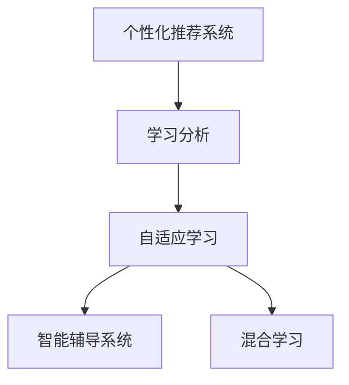

                 

# 个性化学习：人类计算如何改变教育

## 1. 背景介绍

在现代社会，教育已经变得越来越个性化和多样化了。传统的教学模式，往往以“一刀切”的方式，传授知识，强调标准答案，而忽略了学生的个体差异和兴趣。随着计算机和人工智能技术的进步，个性化学习成为了可能。通过数据分析、算法优化和智能推荐，教育系统能够为每个学生提供量身定制的学习计划，显著提升学习效率和成效。

本文将系统介绍个性化学习的核心概念、技术原理和应用实践，探讨人类计算如何通过算法和数据，为学生提供更加精准和高效的学习体验。

## 2. 核心概念与联系

### 2.1 核心概念概述

个性化学习是指通过数据驱动、算法优化和智能推荐，为每个学生量身定制学习计划，提升学习效果的一种教育模式。其主要包含以下几个核心概念：

- **个性化推荐系统**：利用机器学习算法，分析学生的学习行为和偏好，推荐个性化的学习内容。
- **学习分析**：通过收集和分析学生的学习数据，了解其学习进度和效果，进行持续优化。
- **自适应学习**：根据学生的学习状态和表现，动态调整学习内容和节奏，提供个性化的学习体验。
- **智能辅导系统**：利用自然语言处理和机器学习技术，提供个性化的辅导和反馈，帮助学生解决学习难题。
- **混合学习**：结合线上和线下教学模式，提供更加灵活、多样化的学习路径。

这些概念之间存在紧密的联系，相互支持和补充。通过数据驱动，推荐系统能够为学生提供定制化的学习内容；通过学习分析，系统能够持续优化学习计划；自适应学习则根据学生的实时表现调整教学策略；智能辅导系统提供个性化的指导；混合学习则拓展了学习的时间和空间。

### 2.2 核心概念原理和架构的 Mermaid 流程图



这个流程图展示了个性化学习系统的主要组件及其交互关系：推荐系统收集学生数据，并分析其学习行为；学习分析模块根据数据反馈优化学习计划；自适应学习根据学生表现动态调整内容；智能辅导系统提供个性化的指导；混合学习则提供灵活的学习路径。

## 3. 核心算法原理 & 具体操作步骤

### 3.1 算法原理概述

个性化学习的核心算法原理主要包括推荐系统、学习分析、自适应学习等。这些算法通过数据驱动，利用机器学习模型和统计分析方法，为每个学生提供个性化的学习方案。

个性化推荐系统通常基于协同过滤、内容过滤或混合过滤算法，根据学生的历史学习行为和偏好，推荐相关的学习资源。学习分析则通过时间序列分析、聚类分析和分类算法，识别学生的学习模式和进度，优化学习计划。自适应学习则结合个性化推荐和实时反馈，动态调整学习内容和节奏，提供个性化的学习体验。

### 3.2 算法步骤详解

个性化学习的算法步骤大致可以分为以下几个环节：

1. **数据收集**：收集学生的学习行为数据，包括学习时间、完成作业情况、测试成绩等。
2. **特征提取**：将学生的行为数据转化为特征向量，供机器学习算法使用。
3. **模型训练**：利用收集到的数据训练推荐算法、学习分析模型和自适应学习模型。
4. **个性化推荐**：根据训练好的模型，推荐个性化的学习内容。
5. **学习分析**：分析学生的学习效果和进度，优化学习计划。
6. **自适应调整**：根据学生的实时表现，动态调整学习内容和节奏。
7. **智能辅导**：提供个性化的指导和反馈，帮助学生解决学习难题。
8. **混合学习**：结合线上和线下学习资源，提供灵活的学习路径。

### 3.3 算法优缺点

个性化学习的算法具有以下优点：

- **提升学习效果**：通过个性化推荐和自适应学习，学生能够获得更加匹配自己学习需求的内容和节奏，提升学习效果。
- **提高学习动力**：根据学生的学习偏好和进度，推荐感兴趣的内容，激发学生的学习热情。
- **减少教师负担**：自动化的学习分析和智能辅导系统，减少了教师的工作量，使他们能够更多地关注于教学策略和个性化指导。

同时，个性化学习也存在一些缺点：

- **数据隐私问题**：学习数据的收集和分析，可能会涉及学生的隐私问题，需要严格的数据保护措施。
- **算法复杂性**：个性化算法需要复杂的机器学习模型和数据分析技术，对技术要求较高。
- **资源依赖性**：个性化学习依赖于大量的数据和计算资源，对于技术和经济条件较差的学校和地区，可能难以普及。
- **模型偏见**：个性化算法可能存在偏见，推荐内容不够多样化，影响学生的全面发展。

### 3.4 算法应用领域

个性化学习在多个教育领域中都有广泛的应用：

- **K-12教育**：根据学生的学科兴趣和能力，推荐个性化的学习资源和练习题。
- **高等教育**：为大学生提供个性化的课程推荐和学习路径，提升学习效果和毕业率。
- **职业教育**：根据学员的职业目标和需求，推荐相关的培训课程和资源。
- **远程教育**：利用个性化学习技术，为在线学习者提供更加灵活和个性化的学习体验。
- **终身学习**：为终身学习者提供持续的个性化学习资源和支持。

## 4. 数学模型和公式 & 详细讲解 & 举例说明

### 4.1 数学模型构建

个性化学习的数学模型主要包含以下几个部分：

1. **学生特征表示**：将学生的行为数据转化为向量形式，供算法使用。
2. **推荐系统模型**：如协同过滤、基于内容的推荐算法。
3. **学习分析模型**：如时间序列分析、聚类分析和分类算法。
4. **自适应学习模型**：如基于规则的自适应学习算法。
5. **智能辅导模型**：如自然语言处理和机器学习算法。

### 4.2 公式推导过程

以协同过滤推荐算法为例，其基本公式为：

$$
\hat{r}_{ui} = e^{W^T \cdot [u; i]}
$$

其中，$u$ 表示用户，$i$ 表示物品，$W$ 是权重向量。该公式表示用户 $u$ 对物品 $i$ 的预测评分。

### 4.3 案例分析与讲解

假设某学生正在学习数学，根据其历史学习行为和兴趣，推荐系统可以推荐相关的学习资源。例如，如果该学生在某次考试中数学成绩较低，推荐系统可以推荐一些难度适中且覆盖相似知识点的练习题。

## 5. 项目实践：代码实例和详细解释说明

### 5.1 开发环境搭建

为了进行个性化学习的项目实践，首先需要搭建好开发环境。以下是一个基于Python的开发环境搭建流程：

1. **安装Python**：从官网下载安装Python 3.8及以上版本，并配置环境变量。
2. **安装Jupyter Notebook**：通过pip安装Jupyter Notebook，用于编写和运行代码。
3. **安装推荐系统库**：安装PyTorch、Scikit-learn等机器学习库，用于推荐系统开发。
4. **安装数据处理库**：安装Pandas、NumPy等数据处理库，用于数据收集和处理。

### 5.2 源代码详细实现

下面是一个基于协同过滤算法的推荐系统示例代码：

```python
import pandas as pd
from scipy.sparse import csr_matrix

# 加载数据
data = pd.read_csv('data.csv')

# 数据预处理
user_item_matrix = csr_matrix(data)

# 构建推荐算法
from sklearn.metrics.pairwise import cosine_similarity

def collaborative_filtering(user_item_matrix):
    similarity_matrix = cosine_similarity(user_item_matrix)
    return similarity_matrix

# 推荐系统测试
user_id = 1
user_matrix = collaborative_filtering(user_item_matrix).getrow(user_id)
similarity_matrix = collaborative_filtering(user_item_matrix).getcol(user_id)
top_5_items = user_matrix * similarity_matrix.T.argsort()[-5:][::-1]

# 输出推荐结果
print(top_5_items)
```

### 5.3 代码解读与分析

**数据加载和预处理**：首先使用Pandas加载数据，并将其转换为稀疏矩阵形式，以减少计算量和存储空间。

**协同过滤算法实现**：利用Scikit-learn的cosine_similarity函数，计算用户与物品之间的相似度，构建推荐矩阵。

**推荐系统测试**：选取一个用户，计算其与其他物品的相似度，并选取相似度最高的5个物品作为推荐结果。

### 5.4 运行结果展示

运行上述代码后，会输出该用户推荐的5个物品。这可以帮助教师或家长了解该学生的兴趣点，并推荐相应的学习资源。

## 6. 实际应用场景

### 6.1 智能辅导系统

智能辅导系统是个性化学习的重要组成部分。利用自然语言处理和机器学习技术，智能辅导系统可以提供个性化的指导和反馈，帮助学生解决学习难题。例如，对于一道数学难题，系统可以通过分析学生的作答过程，提供针对性的提示和解释。

### 6.2 个性化课程推荐

基于学生的学习进度和偏好，个性化课程推荐系统可以为学生推荐适合的课程和教材。例如，对于一门难度较高的课程，系统可以推荐难度适中且与该课程相关的其他课程，帮助学生循序渐进地学习。

### 6.3 学习数据分析

学习数据分析是了解学生学习效果和进度的重要手段。通过收集学生的学习行为数据，学习分析系统可以生成学习报告，帮助教师和学生了解学习进度，发现问题并进行调整。

### 6.4 未来应用展望

未来，个性化学习将继续在教育领域中发挥重要作用。随着技术的不断进步，个性化学习将变得更加智能化和多样化，为学生提供更加灵活和高效的学习体验。

- **更智能的推荐系统**：利用深度学习算法和大规模语料，推荐系统将更加精准和多样。
- **多模态学习**：结合图像、视频和文本等多模态数据，提供更加丰富的学习体验。
- **自适应学习**：利用人工智能算法，实现更加动态和灵活的学习路径。
- **智能辅导**：利用自然语言生成和情感分析技术，提供更自然和个性化的指导和反馈。
- **混合学习**：结合线上和线下学习资源，提供更加灵活和多样化的学习路径。

## 7. 工具和资源推荐

### 7.1 学习资源推荐

为了帮助开发者系统掌握个性化学习的核心技术，以下是一些优质的学习资源：

1. **Coursera个性化学习课程**：由斯坦福大学提供的课程，涵盖个性化学习的基本概念和技术。
2. **Kaggle推荐系统竞赛**：通过参与比赛，学习推荐算法的实际应用。
3. **TensorFlow官方文档**：介绍TensorFlow在推荐系统中的使用，提供了丰富的代码和教程。
4. **Scikit-learn官方文档**：介绍Scikit-learn在推荐系统中的应用，提供了详细的算法和代码。
5. **Python数据科学手册**：一本系统介绍Python数据科学技术的书籍，包括推荐系统的实现。

### 7.2 开发工具推荐

为了进行个性化学习的项目开发，以下推荐一些常用的开发工具：

1. **Jupyter Notebook**：用于编写和运行代码，支持代码块的重复使用和分享。
2. **TensorFlow**：用于实现复杂的深度学习模型和算法。
3. **PyTorch**：用于实现高效的深度学习模型和算法。
4. **Scikit-learn**：用于实现常用的机器学习算法和模型。
5. **Pandas**：用于数据处理和分析，方便数据收集和处理。

### 7.3 相关论文推荐

个性化学习的快速发展得益于众多学者的持续研究。以下是几篇奠基性的相关论文，推荐阅读：

1. **《推荐系统实用手册》**：介绍推荐系统的发展历程和技术实现，提供了丰富的案例和代码。
2. **《自适应学习系统综述》**：系统介绍自适应学习的基本概念和技术，涵盖了多种自适应学习算法。
3. **《基于深度学习的个性化学习研究》**：利用深度学习技术，探讨个性化学习的实现方法和效果。
4. **《混合学习系统的设计》**：介绍混合学习系统的架构和实现，提供了多种混合学习策略。

## 8. 总结：未来发展趋势与挑战

### 8.1 研究成果总结

本文系统介绍了个性化学习的基本概念、技术原理和应用实践，探讨了人类计算如何通过算法和数据，为学生提供更加精准和高效的学习体验。从数据收集和特征提取，到模型训练和智能推荐，各个环节都需要精心设计和优化。通过不断迭代和改进，个性化学习将逐步成为教育领域的重要手段。

### 8.2 未来发展趋势

未来，个性化学习将继续在教育领域中发挥重要作用，其发展趋势如下：

- **更智能的推荐算法**：利用深度学习和大规模语料，推荐系统将更加精准和多样。
- **多模态学习**：结合图像、视频和文本等多模态数据，提供更加丰富的学习体验。
- **自适应学习**：利用人工智能算法，实现更加动态和灵活的学习路径。
- **智能辅导**：利用自然语言生成和情感分析技术，提供更自然和个性化的指导和反馈。
- **混合学习**：结合线上和线下学习资源，提供更加灵活和多样化的学习路径。

### 8.3 面临的挑战

尽管个性化学习已经取得显著进展，但在推广和应用过程中仍面临诸多挑战：

- **数据隐私问题**：学习数据的收集和分析，可能会涉及学生的隐私问题，需要严格的数据保护措施。
- **算法复杂性**：个性化算法需要复杂的机器学习模型和数据分析技术，对技术要求较高。
- **资源依赖性**：个性化学习依赖于大量的数据和计算资源，对于技术和经济条件较差的学校和地区，可能难以普及。
- **模型偏见**：个性化算法可能存在偏见，推荐内容不够多样化，影响学生的全面发展。

### 8.4 研究展望

未来，个性化学习需要在以下几个方面进行进一步研究：

- **数据隐私保护**：采用差分隐私等技术，保护学生数据隐私。
- **算法优化**：利用更高效的算法和模型，降低计算资源需求，提高推荐精度。
- **多样化内容推荐**：通过引入更多维度和类型的数据，丰富推荐内容，避免单一和偏颇。
- **跨平台整合**：实现线上和线下学习的无缝整合，提供更加灵活和多样化的学习路径。
- **人机协作**：结合教师的指导和反馈，提供更个性化的学习建议和支持。

通过不断的技术改进和应用实践，个性化学习将逐步成为教育领域的重要手段，为学生提供更加精准和高效的学习体验。未来，个性化学习必将在推动教育公平和效率提升方面发挥更大的作用。

## 9. 附录：常见问题与解答

**Q1：如何选择合适的推荐算法？**

A: 选择合适的推荐算法需要考虑以下几个因素：

- **数据类型**：根据数据的类型（如用户-物品评分、用户行为等）选择适合的算法。
- **数据量**：对于大规模数据，可以考虑分布式计算或高性能计算方法。
- **推荐效果**：通过实验对比不同算法的效果，选择最适合的算法。

**Q2：如何优化推荐系统的性能？**

A: 优化推荐系统的性能可以从以下几个方面入手：

- **数据预处理**：进行数据清洗和特征工程，提高数据质量。
- **算法选择**：选择合适的推荐算法，根据数据类型和规模进行优化。
- **模型训练**：采用有效的模型训练策略，如交叉验证、超参数调优等。
- **实时更新**：根据用户行为实时更新推荐结果，保持推荐的实时性和准确性。

**Q3：如何保护学生数据隐私？**

A: 保护学生数据隐私可以从以下几个方面入手：

- **数据匿名化**：对数据进行匿名化处理，避免个人信息泄露。
- **差分隐私**：采用差分隐私技术，保护用户隐私。
- **访问控制**：严格控制数据的访问权限，确保数据安全。
- **透明度**：明确告知学生数据的使用方式和目的，获得学生和家长的同意。

**Q4：如何评估个性化学习的效果？**

A: 评估个性化学习的效果可以从以下几个方面入手：

- **学习成效**：通过对比学生的学习效果和进步，评估个性化学习的效果。
- **学习满意度**：通过调查问卷等方式，了解学生对个性化学习的满意度和反馈。
- **教师评价**：通过教师的评价和反馈，了解个性化学习的效果和改进方向。

通过不断优化和改进，个性化学习将逐步成为教育领域的重要手段，为学生提供更加精准和高效的学习体验。未来，个性化学习必将在推动教育公平和效率提升方面发挥更大的作用。

---

作者：禅与计算机程序设计艺术 / Zen and the Art of Computer Programming

