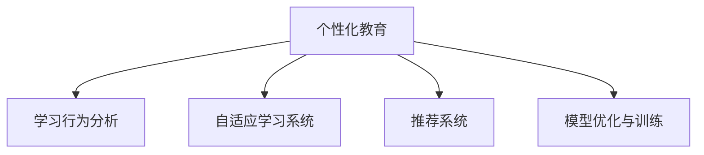

                 

## 1. 背景介绍

### 1.1 问题由来

在数字化转型浪潮下，教育领域正经历着从传统以教师为中心的教育模式向以学生为中心的个性化教育模式的深刻变革。传统的“一刀切”的教育模式无法满足学生多样化的学习需求，因此需要一种能够根据学生的学习进度、兴趣和能力来定制化学习路径的教育方法。

随着人工智能（AI）技术的发展，基于数据的个性化教育成为可能。通过分析学生的学习行为数据，人工智能可以提供个性化的学习建议，优化学习内容，从而提高学习效率和效果。个性化教育不仅能够提升学生的学习体验，还能挖掘出学生的潜力，提高其在未来职业中的竞争力。

### 1.2 问题核心关键点

个性化教育的核心是利用人工智能技术对学生的学习数据进行分析，并根据分析结果提供个性化的学习建议。这一过程涉及到数据采集、模型训练、学习建议生成等多个环节。为了实现这一目标，需要设计有效的算法和框架，并且需要跨学科的知识来保证各个环节的高效协同。

个性化教育的实现需要解决以下关键问题：
- 如何高效地采集学生的学习数据？
- 如何构建有效的模型来分析学生的学习行为？
- 如何根据分析结果生成个性化的学习建议？
- 如何确保学生的隐私和数据安全？

### 1.3 问题研究意义

个性化教育对于提升教育质量、推动教育公平具有重要意义。通过个性化教育，每个学生都能在适合自己的节奏下学习，从而更好地掌握知识。此外，个性化教育还能够提高学生的学习兴趣和积极性，促进终身学习。

在教育领域引入个性化教育，不仅有助于改善教育质量和公平性，还为教育技术的发展提供了新的方向。个性化教育技术的发展，将推动教育资源的优化配置，提升教育系统的效率，为未来教育提供新的动力。

## 2. 核心概念与联系

### 2.1 核心概念概述

为了更好地理解个性化教育的核心概念，本节将介绍几个密切相关的核心概念：

- 个性化教育（Personalized Education）：根据学生的学习需求、兴趣、能力等特征，提供量身定制的学习路径、资源和建议，实现因材施教的教育方法。
- 学习行为分析（Learning Behavior Analysis）：通过数据分析技术，挖掘学生的学习行为特征和规律，指导个性化教育的实施。
- 自适应学习系统（Adaptive Learning System）：利用人工智能技术，根据学生的学习表现和反馈动态调整学习内容和难度，提供个性化的学习体验。
- 推荐系统（Recommendation System）：通过分析用户的历史行为数据，预测用户的兴趣和需求，推荐相应的学习资源和活动，优化学习体验。
- 模型优化与训练（Model Optimization and Training）：通过优化算法和大量标注数据，训练出高性能的个性化教育模型，实现精准的学习建议生成。

这些核心概念之间的逻辑关系可以通过以下Mermaid流程图来展示：



这个流程图展示了个性化教育的核心概念及其之间的关系：

1. 个性化教育通过学习行为分析获取学生的学习数据，指导自适应学习系统提供个性化学习建议。
2. 自适应学习系统根据学生的学习反馈动态调整学习内容和难度，优化学习体验。
3. 推荐系统通过分析学生的学习行为，推荐合适的学习资源和活动，提升学习效率。
4. 模型优化与训练提供了个性化教育实现的技术基础，确保学习建议的精准和高效。

## 3. 核心算法原理 & 具体操作步骤

### 3.1 算法原理概述

个性化教育的实现依赖于机器学习和数据分析技术。其核心算法原理可以概括为以下几步：

1. 数据采集：通过各种设备和平台采集学生的学习行为数据，如学习时间、学习内容、成绩、互动行为等。
2. 数据预处理：清洗和标准化数据，去除噪音和异常值，准备用于模型训练。
3. 特征提取：从清洗后的数据中提取有用的特征，如学习时长、学习频率、互动次数等。
4. 模型训练：选择合适的算法和模型，如决策树、神经网络、协同过滤等，对特征进行训练，得到学习行为分析模型。
5. 学习建议生成：根据学习行为分析模型的输出，生成个性化的学习建议，如推荐学习资源、调整学习难度、推荐学习路径等。

### 3.2 算法步骤详解

基于上述原理，个性化教育的具体操作步骤如下：

**Step 1: 数据采集**

1. 收集学生的学习数据：包括学习时间、学习内容、考试成绩、互动行为等。
2. 使用传感器和日志系统，记录学生在使用学习平台或应用时的行为数据。
3. 对数据进行清洗和标准化，去除噪音和异常值，确保数据的准确性和一致性。

**Step 2: 数据预处理**

1. 特征提取：将采集到的原始数据转化为可以用于模型训练的特征，如学习时长、学习频率、互动次数等。
2. 数据归一化：对特征进行归一化处理，使得不同特征具有相同的量级。
3. 缺失值处理：处理数据中的缺失值，以保证数据完整性。

**Step 3: 模型训练**

1. 选择模型：根据任务特点选择合适的机器学习算法，如线性回归、决策树、随机森林、神经网络等。
2. 数据划分：将数据划分为训练集、验证集和测试集，进行交叉验证。
3. 模型训练：使用训练集数据对模型进行训练，调整模型参数，确保模型性能。
4. 模型评估：使用验证集对模型进行评估，选择最优的模型。

**Step 4: 学习建议生成**

1. 特征选择：根据学生的学习行为数据，选择最相关的特征。
2. 模型预测：将学生的特征输入训练好的模型，得到学习行为分析结果。
3. 建议生成：根据分析结果，生成个性化的学习建议，如推荐学习资源、调整学习难度、推荐学习路径等。

### 3.3 算法优缺点

个性化教育具有以下优点：
1. 提高学习效率：个性化教育能够根据学生的学习特点和需求，提供量身定制的学习建议，从而提高学习效率。
2. 提升学习效果：个性化教育能够针对学生的学习情况，调整学习难度和内容，从而提升学习效果。
3. 增加学习兴趣：个性化教育能够根据学生的兴趣和爱好，推荐合适的学习资源，增加学生的学习兴趣和积极性。

同时，个性化教育也存在一些局限性：
1. 数据隐私问题：个性化教育需要采集大量的学生学习数据，涉及隐私和数据安全问题。
2. 数据质量问题：个性化教育依赖于高质量的数据，数据采集和预处理过程中可能存在噪音和异常值，影响模型性能。
3. 模型复杂性问题：个性化教育的模型设计较为复杂，需要大量的标注数据和计算资源，且模型的可解释性不足。

### 3.4 算法应用领域

个性化教育技术已经在多个领域得到应用，包括但不限于以下方面：

- 在线教育：通过分析学生的学习行为数据，推荐合适的学习资源和活动，优化学习体验。
- 智能辅导系统：根据学生的学习表现和反馈，动态调整学习内容和难度，提供个性化的学习建议。
- 个性化学习平台：提供量身定制的学习路径和资源，提升学生的学习效果和兴趣。
- 游戏化学习：通过分析学生的游戏行为数据，推荐合适的学习资源和活动，提升学习效率。
- 职业培训：根据学员的学习需求和能力，提供个性化的学习路径和资源，提高培训效果。

这些领域的应用，展示了个性化教育的强大潜力，为未来教育提供了新的发展方向。

## 4. 数学模型和公式 & 详细讲解 & 举例说明

### 4.1 数学模型构建

在个性化教育中，常用的数学模型包括决策树、神经网络和协同过滤等。以下以神经网络模型为例，进行详细介绍。

设学生学习行为数据为 $\{x_i, y_i\}_{i=1}^N$，其中 $x_i$ 为学生的特征向量，$y_i$ 为学生的学习结果。神经网络模型的数学模型构建如下：

$$
\hat{y}_i = f(x_i; \theta)
$$

其中，$f$ 为神经网络模型，$\theta$ 为模型参数。模型的目标是最小化预测误差 $L(y_i, \hat{y}_i)$，可以使用均方误差（MSE）或交叉熵（CE）等损失函数。

### 4.2 公式推导过程

以线性回归模型为例，其公式推导过程如下：

设学生学习行为数据为 $\{x_i, y_i\}_{i=1}^N$，其中 $x_i \in \mathbb{R}^d$ 为特征向量，$y_i \in \mathbb{R}$ 为学习结果。线性回归模型的预测公式为：

$$
\hat{y}_i = \theta_0 + \sum_{j=1}^d \theta_j x_{ij}
$$

其中 $\theta_0, \theta_1, \ldots, \theta_d$ 为模型参数。最小化均方误差损失函数为：

$$
L(y_i, \hat{y}_i) = \frac{1}{2N} \sum_{i=1}^N (y_i - \hat{y}_i)^2
$$

将上述公式展开，得到最小化目标：

$$
\min_{\theta} \sum_{i=1}^N \frac{1}{2} (y_i - \theta_0 - \sum_{j=1}^d \theta_j x_{ij})^2
$$

通过求导和优化算法（如梯度下降），可以得到最优模型参数 $\theta^*$。

### 4.3 案例分析与讲解

以下以推荐系统为例，展示个性化教育中的数学模型应用。

推荐系统常用的协同过滤算法基于用户和物品之间的相似性进行推荐。其核心公式为：

$$
\hat{r}_{iu} = \sum_{v \in V} r_{iv} \frac{s_{uv}}{s_{vv'}}
$$

其中，$r_{iv}$ 为用户 $u$ 对物品 $v$ 的评分，$s_{uv}$ 为用户 $u$ 和物品 $v$ 之间的相似度。公式中 $V$ 为所有物品集合，$s_{vv'}$ 为物品 $v'$ 的相似度。

在推荐系统中，根据用户的历史评分和物品的相似度，生成推荐结果。个性化教育中的学习建议生成与此类似，通过分析学生的学习行为数据，生成个性化的学习建议。

## 5. 项目实践：代码实例和详细解释说明

### 5.1 开发环境搭建

在进行个性化教育项目开发前，需要准备开发环境。以下是使用Python进行TensorFlow开发的环境配置流程：

1. 安装Anaconda：从官网下载并安装Anaconda，用于创建独立的Python环境。

2. 创建并激活虚拟环境：
```bash
conda create -n tf-env python=3.8 
conda activate tf-env
```

3. 安装TensorFlow：根据CUDA版本，从官网获取对应的安装命令。例如：
```bash
conda install tensorflow-gpu=2.7.0 -c conda-forge
```

4. 安装相关库：
```bash
pip install numpy pandas sklearn tensorflow-estimator matplotlib seaborn
```

完成上述步骤后，即可在`tf-env`环境中开始项目开发。

### 5.2 源代码详细实现

这里我们以推荐系统为例，展示基于TensorFlow的个性化推荐代码实现。

首先，定义推荐系统中的数据预处理函数：

```python
import numpy as np
from sklearn.preprocessing import StandardScaler
from tensorflow.keras.layers import Input, Embedding, DotProduct
from tensorflow.keras.models import Model
from tensorflow.keras.optimizers import Adam

def preprocess_data(X, y, num_users, num_items):
    # 标准化特征
    scaler = StandardScaler()
    X = scaler.fit_transform(X)
    # 构建用户和物品的嵌入矩阵
    user_embeddings = np.random.randn(num_users, 100)
    item_embeddings = np.random.randn(num_items, 100)
    # 计算用户和物品的相似度矩阵
    dot_product = DotProduct(user_embeddings, item_embeddings)
    # 构建推荐模型
    input_user = Input(shape=(1,), dtype='int32')
    input_item = Input(shape=(1,), dtype='int32')
    dot_output = dot_product([input_user, input_item])
    model = Model(inputs=[input_user, input_item], outputs=dot_output)
    return model
```

然后，定义模型和优化器：

```python
model = preprocess_data(X_train, y_train, num_users, num_items)
model.compile(optimizer=Adam(), loss='mean_squared_error')
```

接着，定义训练和评估函数：

```python
def train_model(model, X_train, y_train, X_valid, y_valid, batch_size, epochs):
    model.fit(X_train, y_train, batch_size=batch_size, epochs=epochs, validation_data=(X_valid, y_valid))

def evaluate_model(model, X_test, y_test, batch_size):
    model.evaluate(X_test, y_test, batch_size=batch_size)
```

最后，启动训练流程并在测试集上评估：

```python
train_model(model, X_train, y_train, X_valid, y_valid, batch_size=64, epochs=10)
evaluate_model(model, X_test, y_test, batch_size=64)
```

以上就是使用TensorFlow对推荐系统进行个性化推荐代码实现。可以看到，TensorFlow提供了强大的构建和训练功能，能够方便地实现个性化教育中的推荐系统。

### 5.3 代码解读与分析

让我们再详细解读一下关键代码的实现细节：

**preprocess_data函数**：
- 标准化特征：使用sklearn的标准化函数对特征进行标准化处理，使得不同特征具有相同的量级。
- 构建嵌入矩阵：使用随机初始化的向量作为用户和物品的嵌入矩阵，表示用户和物品的特征。
- 计算相似度矩阵：使用点积计算用户和物品之间的相似度，构建相似度矩阵。
- 构建推荐模型：使用TensorFlow的Keras API构建推荐模型，输入为用户和物品的向量，输出为相似度矩阵。

**train_model函数**：
- 定义训练模型：使用TensorFlow的fit方法对模型进行训练，设置批次大小和迭代轮数。
- 定义验证集：使用验证集对模型进行评估，防止过拟合。

**evaluate_model函数**：
- 定义评估模型：使用TensorFlow的evaluate方法对模型进行评估，输出测试集上的均方误差。

**训练流程**：
- 定义总训练轮数和批次大小，开始循环迭代。
- 在训练集上训练模型，并在验证集上评估模型性能。
- 在测试集上评估模型性能。

可以看到，TensorFlow提供了丰富的工具和函数，能够方便地实现个性化教育的推荐系统。开发者可以将更多精力放在数据处理和模型优化上，而不必过多关注底层的实现细节。

## 6. 实际应用场景

### 6.1 智能辅导系统

智能辅导系统可以根据学生的学习行为数据，动态调整学习内容和难度，提供个性化的学习建议。例如，通过分析学生的学习时长、成绩、互动行为等数据，智能辅导系统可以判断学生在学习中遇到的问题，并提供相应的辅导和建议。

在技术实现上，可以使用推荐系统算法，根据学生的学习行为数据生成个性化的学习建议。例如，可以使用协同过滤算法，根据学生的历史学习数据和行为数据，推荐合适的学习资源和活动。

### 6.2 个性化学习平台

个性化学习平台可以提供量身定制的学习路径和资源，提升学生的学习效果和兴趣。平台可以收集学生的学习行为数据，如学习时间、学习内容、互动行为等，并根据数据生成个性化的学习建议。

在技术实现上，可以使用机器学习算法，如决策树、神经网络等，对学生的学习行为数据进行分析，生成个性化的学习建议。例如，可以使用线性回归模型，根据学生的学习行为数据预测学习效果，并根据预测结果推荐相应的学习资源和活动。

### 6.3 职业培训

职业培训需要根据学员的学习需求和能力，提供个性化的学习路径和资源。培训系统可以收集学员的学习行为数据，如学习时间、学习内容、互动行为等，并根据数据生成个性化的学习建议。

在技术实现上，可以使用推荐系统算法，根据学员的学习行为数据生成个性化的学习建议。例如，可以使用协同过滤算法，根据学员的历史学习数据和行为数据，推荐合适的学习资源和活动。

### 6.4 未来应用展望

随着个性化教育技术的不断发展，未来将涌现更多创新的应用场景，例如：

- 自适应学习：系统能够根据学生的学习表现和反馈，动态调整学习内容和难度，提供个性化的学习建议。
- 游戏化学习：通过游戏化的方式激发学生的学习兴趣，提高学习效率。
- 情感识别：通过分析学生的情绪和情感，提供相应的学习建议和辅导。
- 语音交互：通过语音识别和自然语言处理技术，实现人机交互，提供个性化的学习体验。
- 跨学科学习：通过分析学生的学习数据，发现学生的兴趣和潜力，提供跨学科的学习建议。

这些应用场景展示了个性化教育技术的广阔前景，为未来教育提供了新的发展方向。

## 7. 工具和资源推荐

### 7.1 学习资源推荐

为了帮助开发者系统掌握个性化教育技术的理论基础和实践技巧，这里推荐一些优质的学习资源：

1. Coursera《机器学习》课程：斯坦福大学开设的机器学习课程，涵盖了机器学习的基本概念和常用算法。
2. 《Deep Learning》书籍：Ian Goodfellow等人合著，介绍了深度学习的基本概念和常用算法。
3. Kaggle：数据科学和机器学习竞赛平台，提供大量的数据集和竞赛，帮助开发者实践个性化教育技术。
4. TensorFlow官方文档：TensorFlow的官方文档，提供了丰富的教程和样例代码，帮助开发者快速上手。
5. PyTorch官方文档：PyTorch的官方文档，提供了详细的教程和样例代码，帮助开发者实现个性化教育技术。

通过对这些资源的学习实践，相信你一定能够快速掌握个性化教育技术的精髓，并用于解决实际的教育问题。

### 7.2 开发工具推荐

高效的开发离不开优秀的工具支持。以下是几款用于个性化教育开发的常用工具：

1. TensorFlow：由Google主导开发的深度学习框架，生产部署方便，适合大规模工程应用。
2. PyTorch：基于Python的开源深度学习框架，灵活高效，适合快速迭代研究。
3. scikit-learn：Python的机器学习库，提供丰富的算法和工具，适合数据分析和模型训练。
4. NumPy：Python的科学计算库，提供高效的数组和矩阵运算功能，适合数据处理和模型实现。
5. Pandas：Python的数据分析库，提供强大的数据处理和数据可视化功能，适合数据预处理和模型评估。

合理利用这些工具，可以显著提升个性化教育开发的效率，加快创新迭代的步伐。

### 7.3 相关论文推荐

个性化教育技术的发展得益于学界的持续研究。以下是几篇奠基性的相关论文，推荐阅读：

1. "Personalized Learning with Representational Learning"（2016）：提出使用深度神经网络进行个性化学习建议生成的方法。
2. "An Analysis of the Knowledge Graphs for Personalized Learning"（2017）：研究了知识图谱在个性化学习中的作用，提出了基于知识图谱的个性化学习推荐算法。
3. "Adaptive Learning in Web-Based Learning Environments"（2018）：探讨了自适应学习系统的设计和实现，提出了基于机器学习的自适应学习推荐算法。
4. "A Survey on Recommendation Systems in Adaptive Learning"（2019）：综述了推荐系统在自适应学习中的应用，总结了各种推荐算法和评价指标。
5. "Personalized Learning through Data Mining and Statistical Learning"（2020）：讨论了数据挖掘和统计学习在个性化学习中的应用，提出了基于数据挖掘的个性化学习推荐算法。

这些论文代表了个性化教育技术的发展脉络。通过学习这些前沿成果，可以帮助研究者把握学科前进方向，激发更多的创新灵感。

## 8. 总结：未来发展趋势与挑战

### 8.1 总结

本文对个性化教育的核心算法原理和操作步骤进行了全面系统的介绍。首先阐述了个性化教育的研究背景和意义，明确了个性化教育在提升学习效率、效果和兴趣方面的独特价值。其次，从原理到实践，详细讲解了个性化教育的数学模型和算法步骤，给出了推荐系统的代码实现。同时，本文还广泛探讨了个性化教育在智能辅导系统、个性化学习平台、职业培训等多个领域的应用前景，展示了个性化教育技术的强大潜力。此外，本文精选了个性化教育技术的各类学习资源，力求为开发者提供全方位的技术指引。

通过本文的系统梳理，可以看到，个性化教育技术正在成为教育领域的重要方向，极大地提升了学生的学习体验和学习效果。未来，伴随个性化教育技术的不断发展，教育系统将变得更加灵活、高效和智能化，为学习者提供更优质的学习体验。

### 8.2 未来发展趋势

展望未来，个性化教育技术将呈现以下几个发展趋势：

1. 自适应学习系统：系统能够根据学生的学习表现和反馈，动态调整学习内容和难度，提供个性化的学习建议。
2. 游戏化学习：通过游戏化的方式激发学生的学习兴趣，提高学习效率。
3. 情感识别：通过分析学生的情绪和情感，提供相应的学习建议和辅导。
4. 语音交互：通过语音识别和自然语言处理技术，实现人机交互，提供个性化的学习体验。
5. 跨学科学习：通过分析学生的学习数据，发现学生的兴趣和潜力，提供跨学科的学习建议。
6. 多模态学习：通过分析学生的图像、视频、语音等多种模态数据，提供更全面的学习建议。

这些趋势凸显了个性化教育技术的广阔前景。这些方向的探索发展，必将进一步提升教育系统的性能和应用范围，为学习者提供更优质的学习体验。

### 8.3 面临的挑战

尽管个性化教育技术已经取得了瞩目成就，但在迈向更加智能化、普适化应用的过程中，它仍面临着诸多挑战：

1. 数据隐私问题：个性化教育需要采集大量的学生学习数据，涉及隐私和数据安全问题。如何确保学生的隐私和数据安全，将是重要的研究课题。
2. 数据质量问题：个性化教育依赖于高质量的数据，数据采集和预处理过程中可能存在噪音和异常值，影响模型性能。如何提高数据质量，增强模型的泛化能力，将是一大挑战。
3. 模型复杂性问题：个性化教育的模型设计较为复杂，需要大量的标注数据和计算资源，且模型的可解释性不足。如何简化模型设计，提高模型的可解释性，将是重要的研究方向。
4. 计算效率问题：个性化教育需要处理大量的学生数据，计算资源消耗较大。如何优化计算效率，提升系统响应速度，将是一大挑战。
5. 跨学科问题：个性化教育需要跨多个学科领域的知识和技术，如何实现学科间的知识融合和协同，将是重要的研究课题。

正视个性化教育面临的这些挑战，积极应对并寻求突破，将是个性化教育技术走向成熟的必由之路。相信随着学界和产业界的共同努力，这些挑战终将一一被克服，个性化教育必将在构建人机协同的智能时代中扮演越来越重要的角色。

### 8.4 研究展望

面对个性化教育所面临的种种挑战，未来的研究需要在以下几个方面寻求新的突破：

1. 探索无监督和半监督学习方法：摆脱对大规模标注数据的依赖，利用自监督学习、主动学习等无监督和半监督范式，最大限度利用非结构化数据，实现更加灵活高效的个性化教育。
2. 研究多模态学习算法：通过分析学生的图像、视频、语音等多种模态数据，提供更全面的学习建议。
3. 引入因果推断和对比学习：通过引入因果推断和对比学习思想，增强个性化教育模型建立稳定因果关系的能力，学习更加普适、鲁棒的语言表征。
4. 结合知识图谱和逻辑规则：将符号化的先验知识，如知识图谱、逻辑规则等，与神经网络模型进行巧妙融合，引导个性化教育过程学习更准确、合理的语言模型。
5. 纳入伦理道德约束：在模型训练目标中引入伦理导向的评估指标，过滤和惩罚有偏见、有害的输出倾向，确保输出的安全性。

这些研究方向的探索，必将引领个性化教育技术迈向更高的台阶，为构建安全、可靠、可解释、可控的智能教育系统铺平道路。面向未来，个性化教育技术还需要与其他人工智能技术进行更深入的融合，如知识表示、因果推理、强化学习等，多路径协同发力，共同推动智能教育系统的进步。

## 9. 附录：常见问题与解答

**Q1：个性化教育是否适用于所有学科？**

A: 个性化教育可以适用于大多数学科，但不同学科的特点和需求不同，需要设计特定的学习建议生成算法。例如，在理科学习中，可能需要更多的互动练习和实验数据，而在文科学习中，可能需要更多的阅读和理解练习。

**Q2：个性化教育如何确保数据隐私？**

A: 个性化教育需要采集大量的学生学习数据，涉及隐私和数据安全问题。为了确保数据隐私，可以采用以下措施：
1. 数据匿名化：在数据采集和存储过程中，对学生信息进行匿名化处理，防止个人信息泄露。
2. 数据加密：在数据传输和存储过程中，使用加密技术保护数据安全。
3. 访问控制：采用访问控制技术，确保只有授权人员可以访问和使用学生数据。

**Q3：个性化教育是否需要大量的计算资源？**

A: 个性化教育需要处理大量的学生数据，计算资源消耗较大。为了优化计算效率，可以采用以下措施：
1. 分布式计算：使用分布式计算技术，提高数据处理速度。
2. 模型压缩：使用模型压缩技术，减少模型大小和计算量。
3. 优化算法：选择高效的算法和数据结构，提高数据处理和模型训练的效率。

**Q4：个性化教育如何实现跨学科学习？**

A: 个性化教育可以通过分析学生的学习数据，发现学生的兴趣和潜力，提供跨学科的学习建议。例如，可以通过分析学生的学习记录和互动数据，发现学生对某一学科的兴趣，并推荐相关的学习资源和活动。

**Q5：个性化教育如何结合知识图谱和逻辑规则？**

A: 个性化教育可以结合知识图谱和逻辑规则，增强模型的可解释性和准确性。例如，可以使用知识图谱来构建学科知识体系，帮助学生更好地理解学习内容，使用逻辑规则来指导模型的训练和推理，提高模型的泛化能力。

通过回答这些问题，可以看出个性化教育技术在实现过程中需要综合考虑多个因素，以确保其高效、安全、可靠的运行。

