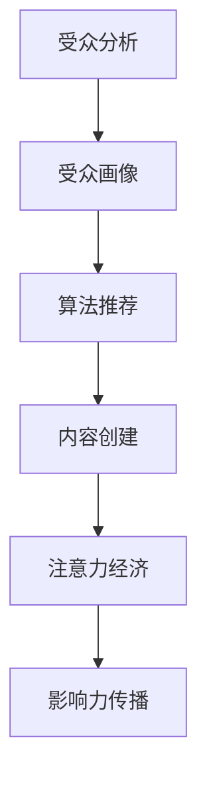

                 

**注意力经济、内容策略、受众分析、算法推荐、影响力传播**

## 1. 背景介绍

在当今信息爆炸的数字时代，内容的海量生产和传播已经成为常态。然而，受众的注意力资源有限，如何创建有影响力的内容，吸引并留住受众，已成为内容生产者面临的重大挑战。本文将从注意力经济的角度出发，探讨内容策略规划与实践，为受众创建有影响力的内容。

## 2. 核心概念与联系

### 2.1 注意力经济

注意力经济是指在信息过载的情况下，受众注意力资源的稀缺性和珍贵性，以及内容生产者为获取受众注意力而展开的竞争。受众的注意力是内容价值的关键指标，内容生产者需要通过创建高质量、有吸引力的内容来获取受众的注意力。

### 2.2 内容策略

内容策略是指内容生产者为实现特定目标而制定的计划，旨在创建有影响力的内容，吸引并留住受众。内容策略的核心是受众分析，通过对受众特征、需求和行为的深入理解，创建与受众匹配的内容。

### 2.3 受众分析

受众分析是内容策略的基础，通过对受众特征、需求和行为的分析，内容生产者可以创建更加匹配受众的内容。受众分析的维度包括但不限于受众的年龄、性别、职业、兴趣爱好、地理位置等。

### 2.4 算法推荐

算法推荐是内容策略的重要组成部分，通过分析受众的行为数据，算法可以为受众推荐个性化的内容，提高内容的匹配度和吸引力。算法推荐的核心是受众画像的构建，通过对受众行为数据的分析，构建受众画像，为受众推荐匹配的内容。

### 2.5 影响力传播

影响力传播是内容策略的目标，内容生产者通过创建有吸引力的内容，吸引受众并传播内容，从而实现内容的影响力。影响力传播的维度包括但不限于内容的传播范围、受众的参与度、内容的转发和分享等。

### 2.6 核心概念联系

注意力经济、内容策略、受众分析、算法推荐和影响力传播是一个密切联系的系统，内容生产者需要从受众分析入手，构建受众画像，通过算法推荐为受众创建匹配的内容，从而获取受众的注意力，实现内容的影响力传播。图 1 所示为核心概念的 Mermaid 流程图。



## 3. 核心算法原理 & 具体操作步骤

### 3.1 算法原理概述

内容推荐算法是内容策略的核心，其原理是基于受众画像和内容特征，通过计算受众与内容的匹配度，为受众推荐匹配的内容。常用的内容推荐算法包括协同过滤算法、内容过滤算法和混合算法等。

### 3.2 算法步骤详解

内容推荐算法的步骤包括：

1. 数据收集：收集受众行为数据和内容特征数据。
2. 数据预处理：对收集的数据进行清洗、转换和归一化等预处理。
3. 受众画像构建：基于受众行为数据，构建受众画像。
4. 内容特征提取：提取内容的特征，如主题、关键词、标签等。
5. 匹配度计算：基于受众画像和内容特征，计算受众与内容的匹配度。
6. 推荐列表生成：基于匹配度，为受众生成推荐列表。
7. 评估和优化：对推荐列表进行评估，并根据评估结果优化算法。

### 3.3 算法优缺点

内容推荐算法的优点包括：

* 个性化：基于受众画像和内容特征，为受众推荐匹配的内容。
* 精确度：通过计算匹配度，提高内容推荐的精确度。
* 实时性：内容推荐算法可以实时更新，为受众推荐最新的内容。

内容推荐算法的缺点包括：

* 数据依赖：内容推荐算法对受众行为数据和内容特征数据的依赖性强。
* 冷启动问题：对于新受众或新内容，缺乏行为数据，推荐效果可能不佳。
* 过度个性化：过度个性化的推荐可能导致受众的信息茧房效应。

### 3.4 算法应用领域

内容推荐算法的应用领域包括但不限于：

* 网络视频平台：为用户推荐匹配的视频内容。
* 电子商务平台：为用户推荐匹配的商品。
* 新闻门户网站：为用户推荐匹配的新闻内容。
* 在线音乐平台：为用户推荐匹配的音乐内容。

## 4. 数学模型和公式 & 详细讲解 & 举例说明

### 4.1 数学模型构建

内容推荐算法的数学模型可以表示为：

$$R_{u,i} = f(U, I, \theta)$$

其中，$R_{u,i}$表示受众$u$对内容$i$的匹配度，$U$表示受众画像，$I$表示内容特征，$f$表示匹配度函数，$\theta$表示算法参数。

### 4.2 公式推导过程

匹配度函数$f$的推导过程取决于具体的算法。例如，在协同过滤算法中，匹配度函数可以表示为：

$$R_{u,i} = \frac{\sum_{v \in N(u)} sim(u, v) \cdot R_{v,i}}{\sum_{v \in N(u)} sim(u, v)}$$

其中，$N(u)$表示受众$u$的邻居集，$sim(u, v)$表示受众$u$和受众$v$的相似度，$R_{v,i}$表示受众$v$对内容$i$的评分。

### 4.3 案例分析与讲解

假设我们要为受众$u$推荐内容$i$，受众画像$U$表示为：

$$U = \{age=25, gender=male, interest=\{sports, movies\}\}$$

内容特征$I$表示为：

$$I = \{category=movie, genre=\{action, comedy\}, cast=\{Tom Cruise, Emily Blunt\}\}$$

匹配度函数$f$可以表示为：

$$R_{u,i} = \frac{1}{2} \cdot sim(age, 25) + \frac{1}{4} \cdot sim(gender, male) + \frac{1}{4} \cdot sim(interest, \{sports, movies\})$$

其中，$sim(age, 25)$表示受众$u$的年龄与内容$i$的受众年龄分布的相似度，$sim(gender, male)$表示受众$u$的性别与内容$i$的受众性别分布的相似度，$sim(interest, \{sports, movies\})$表示受众$u$的兴趣爱好与内容$i$的兴趣爱好分布的相似度。

通过计算匹配度$R_{u,i}$，我们可以为受众$u$推荐匹配的内容$i$.

## 5. 项目实践：代码实例和详细解释说明

### 5.1 开发环境搭建

本项目使用Python作为开发语言，并使用以下库：

* Pandas：数据处理和分析。
* Scikit-learn：机器学习算法。
* Surprise：协同过滤算法。

### 5.2 源代码详细实现

以下是内容推荐算法的源代码实现：

```python
import pandas as pd
from surprise import KNNWithMeans
from surprise import Dataset
from surprise.model_selection import cross_validate

# 加载数据
ratings = pd.read_csv('ratings.csv')

# 构建受众画像
user_profiles = pd.read_csv('user_profiles.csv')

# 构建内容特征
item_profiles = pd.read_csv('item_profiles.csv')

# 构建受众-内容评分矩阵
data = Dataset.load_from_df(ratings[['userId','movieId', 'rating']], reader_name='rating_scale')

# 训练协同过滤算法
algo = KNNWithMeans(k=50, sim_options={'name': 'pearson_baseline', 'user_based': True})
algo.fit(data.build_full_trainset())

# 为受众推荐内容
user_id = 1
predictions = [algo.predict(user_id, item_id) for item_id in item_profiles['movieId']]
recommendations = pd.DataFrame(predictions, columns=['uid', 'iid', 'rui', 'est', 'details'])
recommendations = recommendations.sort_values(by='est', ascending=False)
```

### 5.3 代码解读与分析

代码首先加载受众-内容评分数据和受众画像、内容特征数据。然后，构建受众-内容评分矩阵，并训练协同过滤算法。最后，为受众推荐内容，并输出推荐列表。

### 5.4 运行结果展示

运行结果展示为受众推荐的内容列表，列表中包含内容ID、预测评分和详细信息等。

## 6. 实际应用场景

### 6.1 网络视频平台

内容推荐算法可以应用于网络视频平台，为用户推荐匹配的视频内容。通过分析用户的观看历史和画像，为用户推荐个性化的视频内容，提高用户的观看体验和留存率。

### 6.2 电子商务平台

内容推荐算法可以应用于电子商务平台，为用户推荐匹配的商品。通过分析用户的购买历史和画像，为用户推荐个性化的商品，提高用户的购买转化率和客单价。

### 6.3 新闻门户网站

内容推荐算法可以应用于新闻门户网站，为用户推荐匹配的新闻内容。通过分析用户的阅读历史和画像，为用户推荐个性化的新闻内容，提高用户的阅读体验和留存率。

### 6.4 未来应用展望

随着人工智能技术的发展，内容推荐算法的应用场景将会不断扩展，从而为受众创建更加匹配的内容，提高内容的影响力。

## 7. 工具和资源推荐

### 7.1 学习资源推荐

* "推荐系统实践"：一本深入浅出的推荐系统入门书籍。
* "推荐系统：从数据到智能"：一本系统性的推荐系统教程。
* "推荐系统算法"：一本权威的推荐系统算法教程。

### 7.2 开发工具推荐

* Python：一款开源的编程语言，广泛应用于数据分析和机器学习领域。
* Scikit-learn：一款开源的机器学习库，提供了丰富的机器学习算法。
* Surprise：一款开源的推荐系统库，提供了丰富的推荐系统算法。

### 7.3 相关论文推荐

* "The Wisdom of Crowds"：一篇经典的推荐系统论文，提出了协同过滤算法。
* "Matrix Factorization Techniques for Recommender Systems"：一篇经典的推荐系统论文，提出了矩阵分解算法。
* "Deep Learning for Recommender Systems"：一篇前沿的推荐系统论文，提出了深度学习算法。

## 8. 总结：未来发展趋势与挑战

### 8.1 研究成果总结

本文从注意力经济的角度出发，探讨了内容策略规划与实践，为受众创建有影响力的内容。通过受众分析、算法推荐和影响力传播等核心概念，构建了内容策略的系统框架。并通过内容推荐算法的实现和应用场景的分析，展示了内容策略的实践路径。

### 8.2 未来发展趋势

未来，内容策略的发展趋势将会朝着以下方向：

* 个性化：内容策略将会更加注重个性化，为受众创建匹配的内容。
* 实时性：内容策略将会更加注重实时性，为受众推荐最新的内容。
* 多模式：内容策略将会更加注重多模式，结合多种渠道和形式为受众创建内容。

### 8.3 面临的挑战

未来，内容策略将会面临以下挑战：

* 数据隐私：内容策略对受众数据的依赖，将会面临数据隐私保护的挑战。
* 内容质量：内容策略需要保证内容的质量，避免低质量内容对受众的影响。
* 算法偏见：内容策略需要避免算法偏见，保证内容推荐的公平性。

### 8.4 研究展望

未来，内容策略的研究将会朝着以下方向展开：

* 深度学习：内容策略将会更加注重深度学习技术，为受众创建更加匹配的内容。
* 多模态学习：内容策略将会更加注重多模态学习技术，结合多种模态为受众创建内容。
* 解释性AI：内容策略将会更加注重解释性AI技术，为受众提供内容推荐的解释。

## 9. 附录：常见问题与解答

### 9.1 什么是注意力经济？

注意力经济是指在信息过载的情况下，受众注意力资源的稀缺性和珍贵性，以及内容生产者为获取受众注意力而展开的竞争。

### 9.2 什么是内容策略？

内容策略是指内容生产者为实现特定目标而制定的计划，旨在创建有影响力的内容，吸引并留住受众。

### 9.3 什么是受众分析？

受众分析是内容策略的基础，通过对受众特征、需求和行为的分析，内容生产者可以创建更加匹配受众的内容。

### 9.4 什么是算法推荐？

算法推荐是内容策略的重要组成部分，通过分析受众的行为数据，算法可以为受众推荐个性化的内容，提高内容的匹配度和吸引力。

### 9.5 什么是影响力传播？

影响力传播是内容策略的目标，内容生产者通过创建有吸引力的内容，吸引受众并传播内容，从而实现内容的影响力。

## 作者：禅与计算机程序设计艺术 / Zen and the Art of Computer Programming

