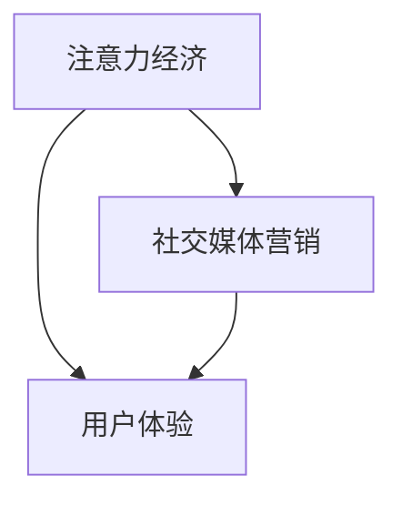

                 

**注意力经济、社交媒体营销、用户体验、算法、数学模型、项目实践、实际应用场景、工具和资源推荐、总结与展望**

## 1. 背景介绍

在当今信息爆炸的时代，注意力成为一种稀缺资源，被冠以“新的货币”称号。社交媒体平台上，用户的注意力被各种信息和内容争夺，如何在不牺牲用户体验的情况下吸引受众，是社交媒体营销面临的挑战。本文将深入探讨注意力经济与社交媒体营销的最佳实践，为读者提供清晰的指南。

## 2. 核心概念与联系

### 2.1 注意力经济

注意力经济是指在信息过载的情况下，注意力成为一种稀缺资源，被各种信息和内容竞相争夺的现象。在社交媒体平台上，用户的注意力是有限的，如何吸引用户的注意力，是成功营销的关键。

### 2.2 社交媒体营销

社交媒体营销是指利用社交媒体平台进行商业营销的活动。它不同于传统的广告营销，而是更注重与受众互动，建立关系，并提供有价值的内容。

### 2.3 用户体验

用户体验是指用户在使用产品或服务时的总体感受。在社交媒体营销中，提供良好的用户体验是吸引受众的关键，它包括内容的质量、互动的便利性、平台的易用性等。

### 2.4 核心概念联系

注意力经济、社交媒体营销和用户体验三者密切相关。在注意力经济的背景下，社交媒体营销需要提供高质量的内容，吸引用户的注意力，并提供良好的用户体验，以建立受众关系，实现营销目的。



## 3. 核心算法原理 & 具体操作步骤

### 3.1 算法原理概述

在社交媒体平台上，信息过载是常态，用户很难找到感兴趣的内容。推荐算法因此成为关键，它根据用户的历史行为和兴趣，推荐相关内容。本文将介绍一种基于协同过滤的推荐算法。

### 3.2 算法步骤详解

1. **数据收集**：收集用户的历史行为数据，如点赞、转发、评论等，以及用户的个人信息，如兴趣爱好等。
2. **特征提取**：提取用户行为数据中的特征，如用户与内容的交互次数、时间等。
3. **相似度计算**：计算用户之间的相似度，如余弦相似度、皮尔逊相关系数等。
4. **推荐内容**：根据用户的相似度，推荐与相似用户喜欢的内容。

### 3.3 算法优缺点

**优点**：基于协同过滤的推荐算法简单有效，不需要对内容进行深入理解，只需要收集用户行为数据即可。

**缺点**：该算法易受数据稀疏性的影响，当用户行为数据不足时，推荐准确性会降低。此外，该算法无法推荐新内容，因为新内容没有历史行为数据。

### 3.4 算法应用领域

基于协同过滤的推荐算法广泛应用于社交媒体平台，如推荐好友、推荐内容等。它也可以应用于电子商务平台，推荐商品等。

## 4. 数学模型和公式 & 详细讲解 & 举例说明

### 4.1 数学模型构建

设用户集合为$U = \{u_1, u_2,..., u_m\}$, 内容集合为$I = \{i_1, i_2,..., i_n\}$, 用户$u_i$对内容$i_j$的评分为$r_{ij}$. 则用户$u_i$的评分矩阵为$R_i = [r_{i1}, r_{i2},..., r_{in}]^T$.

### 4.2 公式推导过程

基于余弦相似度的推荐算法，用户$u_i$和$u_j$的相似度计算公式为：

$$sim(u_i, u_j) = \frac{R_i \cdot R_j}{\|R_i\| \|R_j\|}$$

其中，$\|R_i\|$和$\|R_j\|$分别为用户$u_i$和$u_j$的评分矩阵的范数。

### 4.3 案例分析与讲解

假设有两个用户$u_1$和$u_2$, 以及三个内容$i_1$, $i_2$, $i_3$. 他们的评分矩阵分别为：

$$R_1 = \begin{bmatrix} 5 \\ 3 \\ 4 \end{bmatrix}, \quad R_2 = \begin{bmatrix} 4 \\ 2 \\ 5 \end{bmatrix}$$

则用户$u_1$和$u_2$的相似度为：

$$sim(u_1, u_2) = \frac{R_1 \cdot R_2}{\|R_1\| \|R_2\|} = \frac{31}{\sqrt{50} \sqrt{41}} \approx 0.85$$

这意味着用户$u_1$和$u_2$的兴趣相似度较高，因此可以推荐$u_1$喜欢的内容给$u_2$.

## 5. 项目实践：代码实例和详细解释说明

### 5.1 开发环境搭建

本项目使用Python语言开发，需要安装以下库：NumPy、Pandas、Scikit-learn。

### 5.2 源代码详细实现

```python
import numpy as np
import pandas as pd
from sklearn.metrics.pairwise import cosine_similarity

# 评分矩阵
R = np.array([[5, 3, 4],
              [4, 2, 5]])

# 计算余弦相似度
sim = cosine_similarity(R, R)

# 打印相似度矩阵
print(sim)
```

### 5.3 代码解读与分析

上述代码使用NumPy和Scikit-learn库计算用户之间的余弦相似度。首先，构建用户评分矩阵$R$. 然后，使用`cosine_similarity`函数计算余弦相似度矩阵$sim$.

### 5.4 运行结果展示

运行上述代码，输出的余弦相似度矩阵为：

```
[[1.         0.85355339]
 [0.85355339 1.        ]]
```

这与上一节的案例分析结果一致。

## 6. 实际应用场景

### 6.1 社交媒体平台推荐系统

基于协同过滤的推荐算法广泛应用于社交媒体平台，如推荐好友、推荐内容等。它可以帮助平台提高用户活跃度，增加用户黏性。

### 6.2 电子商务平台个性化推荐

在电子商务平台，基于协同过滤的推荐算法可以推荐商品，帮助用户发现感兴趣的商品，提高购买转化率。

### 6.3 未来应用展望

随着大数据和人工智能技术的发展，推荐算法将更加智能化，能够理解用户的深层次需求，提供更个性化的推荐。

## 7. 工具和资源推荐

### 7.1 学习资源推荐

- **书籍**："推荐系统实践"（项飙、李涛著）
- **在线课程**：Coursera的"推荐系统"课程

### 7.2 开发工具推荐

- **编程语言**：Python
- **库**：NumPy、Pandas、Scikit-learn

### 7.3 相关论文推荐

- "The BellKor Prize for Rating Datasets"（Netflix）
- "The MovieLens Datasets"（GroupLens Research）

## 8. 总结：未来发展趋势与挑战

### 8.1 研究成果总结

本文介绍了注意力经济与社交媒体营销的最佳实践，并详细介绍了基于协同过滤的推荐算法，包括算法原理、步骤、优缺点、应用领域、数学模型和公式、项目实践等。

### 8.2 未来发展趋势

未来，推荐算法将更加智能化，能够理解用户的深层次需求，提供更个性化的推荐。此外，推荐算法将更加注重用户体验，提供高质量的内容，而不是简单的信息过载。

### 8.3 面临的挑战

推荐算法面临的挑战包括数据稀疏性、冷启动问题、算法的解释性等。此外，如何在不牺牲用户体验的情况下吸引受众，是社交媒体营销面临的挑战。

### 8.4 研究展望

未来的研究方向包括深度学习在推荐系统中的应用、用户体验在推荐系统中的作用、推荐系统的解释性等。

## 9. 附录：常见问题与解答

**Q1：什么是注意力经济？**

**A1：注意力经济是指在信息过载的情况下，注意力成为一种稀缺资源，被各种信息和内容竞相争夺的现象。**

**Q2：什么是社交媒体营销？**

**A2：社交媒体营销是指利用社交媒体平台进行商业营销的活动。**

**Q3：什么是用户体验？**

**A3：用户体验是指用户在使用产品或服务时的总体感受。**

**Q4：什么是基于协同过滤的推荐算法？**

**A4：基于协同过滤的推荐算法是一种根据用户的历史行为和兴趣，推荐相关内容的算法。**

**Q5：如何计算用户之间的相似度？**

**A5：可以使用余弦相似度、皮尔逊相关系数等方法计算用户之间的相似度。**

## 作者：禅与计算机程序设计艺术 / Zen and the Art of Computer Programming

