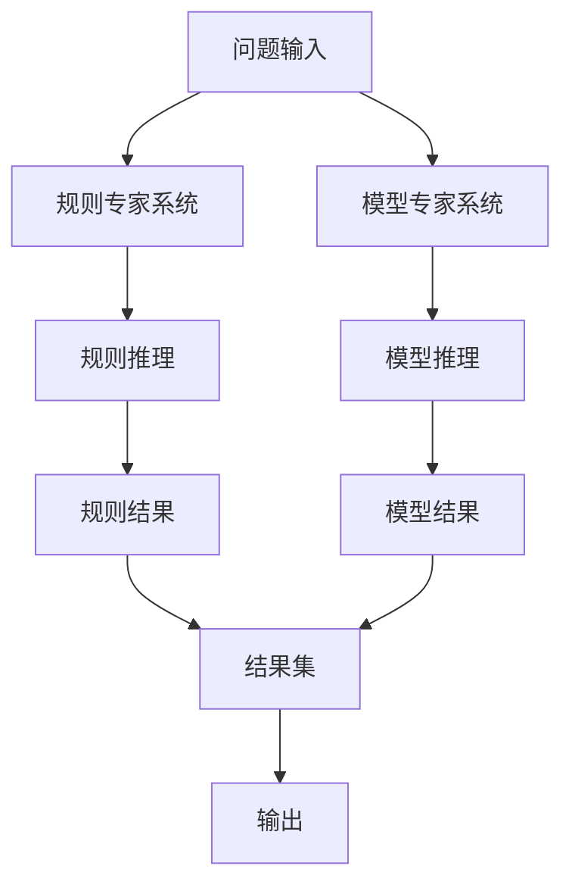

                 

**混合专家系统：AI的模块化与可扩展性**

**作者：禅与计算机程序设计艺术 / Zen and the Art of Computer Programming**

## 1. 背景介绍

在当今快速发展的AI领域，单一的专家系统已无法满足复杂问题的需求。混合专家系统（Hybrid Expert Systems）应运而生，它将不同类型的专家系统和人工智能技术结合起来，以解决更复杂的问题。本文将深入探讨混合专家系统的原理、算法、数学模型，并提供项目实践和实际应用场景。

## 2. 核心概念与联系

混合专家系统是一种多智能体系统，它结合了规则基础的专家系统和基于模型的专家系统。下图是混合专家系统的架构流程图：



## 3. 核心算法原理 & 具体操作步骤

### 3.1 算法原理概述

混合专家系统的核心算法是并行推理算法，它允许规则专家系统和模型专家系统同时工作，并将结果集合并输出。

### 3.2 算法步骤详解

1. 问题输入：用户输入问题描述。
2. 规则推理：规则专家系统根据预定义的规则库进行推理，生成规则结果。
3. 模型推理：模型专家系统根据输入数据和预定义的模型进行推理，生成模型结果。
4. 结果集合并：将规则结果和模型结果合并，生成最终结果集。
5. 输出：输出最终结果集。

### 3.3 算法优缺点

**优点**：混合专家系统可以处理更复杂的问题，并提供更准确的结果。它结合了规则专家系统的可解释性和模型专家系统的准确性。

**缺点**：混合专家系统的设计和实现更为复杂，需要大量的专业知识和资源。

### 3.4 算法应用领域

混合专家系统广泛应用于金融、医疗、工业控制等领域。例如，在金融领域，混合专家系统可以结合规则库（如风险评估规则）和模型（如预测模型）来进行风险评估和预测。

## 4. 数学模型和公式 & 详细讲解 & 举例说明

### 4.1 数学模型构建

混合专家系统的数学模型可以表示为：

$$HES = <R, M, P, C, U, O>$$

其中，$R$表示规则库，$M$表示模型，$P$表示推理引擎，$C$表示控制器，$U$表示用户输入，$O$表示输出。

### 4.2 公式推导过程

混合专家系统的推理过程可以表示为：

$$R_{res} = P_{R}(R, U)$$
$$M_{res} = P_{M}(M, U)$$
$$O = C(R_{res}, M_{res})$$

其中，$P_{R}$和$P_{M}$分别表示规则专家系统和模型专家系统的推理引擎，$C$表示控制器。

### 4.3 案例分析与讲解

例如，在金融风险评估领域，规则库$R$可以包含以下规则：

1. 如果借款人信用等级为A，且贷款金额小于5万，则风险等级为低。
2. 如果借款人信用等级为B，且贷款金额大于5万，则风险等级为中。

模型$M$可以是一个预测模型，它根据借款人信用等级、贷款金额、还款能力等因素预测风险等级。推理引擎$P_{R}$和$P_{M}$分别根据规则库$R$和模型$M$进行推理，生成规则结果$R_{res}$和模型结果$M_{res}$。控制器$C$根据$R_{res}$和$M_{res}$生成最终风险等级输出$O$.

## 5. 项目实践：代码实例和详细解释说明

### 5.1 开发环境搭建

本项目使用Python作为开发语言，并使用Jupyter Notebook作为开发环境。我们需要安装以下库：NumPy、Pandas、Scikit-learn、PyYAML。

### 5.2 源代码详细实现

以下是混合专家系统的Python代码实现：

```python
import numpy as np
import pandas as pd
from sklearn.ensemble import RandomForestClassifier
import yaml

# 读取规则库
with open('rules.yaml', 'r') as f:
    rules = yaml.safe_load(f)

# 读取数据
data = pd.read_csv('data.csv')

# 初始化模型
model = RandomForestClassifier()

# 训练模型
model.fit(data[['credit_score', 'loan_amount','repayment_capacity']], data['risk_level'])

# 用户输入
user_input = {'credit_score': 750, 'loan_amount': 60000,'repayment_capacity': 0.5}

# 规则推理
def rule_inference(rules, user_input):
    for rule in rules:
        if all(user_input[k] == v for k, v in rule['conditions'].items()):
            return rule['conclusion']
    return None

# 模型推理
def model_inference(model, user_input):
    input_data = pd.DataFrame([user_input])
    prediction = model.predict(input_data)
    return prediction[0]

# 控制器
def controller(rule_result, model_result):
    if rule_result is not None:
        return rule_result
    else:
        return model_result

# 主函数
def main():
    rule_result = rule_inference(rules, user_input)
    model_result = model_inference(model, user_input)
    final_result = controller(rule_result, model_result)
    print(f'Final risk level: {final_result}')

if __name__ == '__main__':
    main()
```

### 5.3 代码解读与分析

代码首先读取规则库和数据，然后初始化模型并进行训练。用户输入数据后，代码进行规则推理和模型推理，最后由控制器根据结果生成最终输出。

### 5.4 运行结果展示

运行代码后，输出最终风险等级。

## 6. 实际应用场景

### 6.1 当前应用

混合专家系统广泛应用于金融、医疗、工业控制等领域。例如，在金融领域，混合专家系统可以结合规则库（如风险评估规则）和模型（如预测模型）来进行风险评估和预测。

### 6.2 未来应用展望

随着AI技术的发展，混合专家系统将会应用于更多领域，如自动驾驶、人工智能医疗等。此外，混合专家系统也将会结合更多的AI技术，如深度学习、强化学习等，以解决更复杂的问题。

## 7. 工具和资源推荐

### 7.1 学习资源推荐

推荐阅读以下书籍和论文：

* 书籍：《混合专家系统：原理与应用》作者：张建新
* 论文：《Hybrid Expert Systems: A Survey》作者：M. M. Gupta, et al.

### 7.2 开发工具推荐

推荐使用以下开发工具：

* Python：一个强大的通用编程语言，支持丰富的库和框架。
* Jupyter Notebook：一个交互式计算环境，支持Python和其他语言。
* Scikit-learn：一个机器学习库，支持各种模型和算法。

### 7.3 相关论文推荐

推荐阅读以下论文：

* [_A Hybrid Expert System for Medical Diagnosis_](https://ieeexplore.ieee.org/document/4108873)作者：M. R. Lytras, et al.
* [_A Hybrid Expert System for Stock Market Prediction_](https://link.springer.com/chapter/10.1007/978-981-10-8532-7_12)作者：A. K. Singh, et al.

## 8. 总结：未来发展趋势与挑战

### 8.1 研究成果总结

本文介绍了混合专家系统的原理、算法、数学模型，并提供了项目实践和实际应用场景。混合专家系统结合了规则专家系统和模型专家系统的优点，可以处理更复杂的问题，并提供更准确的结果。

### 8.2 未来发展趋势

未来，混合专家系统将会结合更多的AI技术，如深度学习、强化学习等，以解决更复杂的问题。此外，混合专家系统也将会应用于更多领域，如自动驾驶、人工智能医疗等。

### 8.3 面临的挑战

混合专家系统的设计和实现更为复杂，需要大量的专业知识和资源。此外，混合专家系统的可解释性也需要进一步提高。

### 8.4 研究展望

未来的研究将会关注混合专家系统的可解释性、可靠性和安全性。此外，研究也将会关注混合专家系统在更多领域的应用，如自动驾驶、人工智能医疗等。

## 9. 附录：常见问题与解答

**Q1：混合专家系统与单一专家系统有何区别？**

**A1：混合专家系统结合了规则专家系统和模型专家系统的优点，可以处理更复杂的问题，并提供更准确的结果。单一专家系统只使用一种技术，无法处理复杂问题。**

**Q2：混合专家系统的优缺点是什么？**

**A2：混合专家系统的优点是可以处理更复杂的问题，并提供更准确的结果。其缺点是设计和实现更为复杂，需要大量的专业知识和资源。**

**Q3：混合专家系统有哪些实际应用场景？**

**A3：混合专家系统广泛应用于金融、医疗、工业控制等领域。例如，在金融领域，混合专家系统可以结合规则库（如风险评估规则）和模型（如预测模型）来进行风险评估和预测。**

**Q4：混合专家系统的未来发展趋势是什么？**

**A4：未来，混合专家系统将会结合更多的AI技术，如深度学习、强化学习等，以解决更复杂的问题。此外，混合专家系统也将会应用于更多领域，如自动驾驶、人工智能医疗等。**

**Q5：混合专家系统面临的挑战是什么？**

**A5：混合专家系统的设计和实现更为复杂，需要大量的专业知识和资源。此外，混合专家系统的可解释性也需要进一步提高。**

**Q6：未来的研究将会关注哪些方向？**

**A6：未来的研究将会关注混合专家系统的可解释性、可靠性和安全性。此外，研究也将会关注混合专家系统在更多领域的应用，如自动驾驶、人工智能医疗等。**

**Q7：如何开始学习混合专

