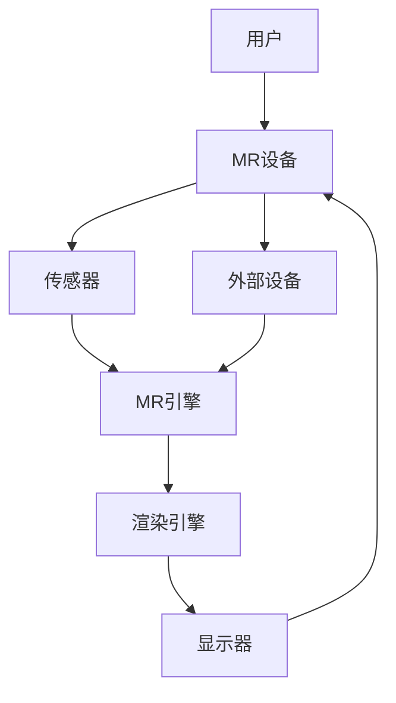

                 

**混合现实（MR）开发：创造新的交互模式**

**作者：禅与计算机程序设计艺术 / Zen and the Art of Computer Programming**

## 1. 背景介绍

混合现实（Mixed Reality, MR）是一种技术，它将虚拟现实（Virtual Reality, VR）和增强现实（Augmented Reality, AR）结合起来，创造出一种全新的交互模式。MR允许用户在真实世界和虚拟世界之间无缝切换，从而提供更丰富、更互动的体验。本文将深入探讨MR开发的核心概念、算法原理、数学模型，并提供实践项目和工具推荐。

## 2. 核心概念与联系

### 2.1 MR、VR和AR的区别


如上图所示，VR完全沉浸用户于虚拟世界，AR则在真实世界中叠加虚拟元素，而MR则结合了二者，允许虚拟元素与真实世界互动。

### 2.2 MR系统架构



上图展示了MR系统的架构，其中MR引擎是核心组件，负责处理传感器数据、跟踪用户位置、渲染虚拟元素等任务。

## 3. 核心算法原理 & 具体操作步骤

### 3.1 算法原理概述

MR算法的核心是实现虚拟元素与真实世界的互动。这涉及到几何建模、光线追踪、物理引擎等技术。

### 3.2 算法步骤详解

1. **几何建模**：使用3D建模技术创建虚拟元素。
2. **传感器数据处理**：使用传感器（如摄像头、IMU）获取真实世界的信息。
3. **跟踪用户位置**：使用SLAM（Simultaneous Localization and Mapping）算法跟踪用户在真实世界中的位置。
4. **光线追踪**：计算虚拟元素在真实世界中的渲染效果。
5. **物理引擎**：模拟虚拟元素与真实世界的物理互动。

### 3.3 算法优缺点

**优点**：MR算法允许创造出更丰富、更互动的体验。

**缺点**：MR算法计算量大，对硬件要求高，且实时性要求高。

### 3.4 算法应用领域

MR算法在游戏、教育、医疗、工业等领域都有广泛应用。

## 4. 数学模型和公式 & 详细讲解 & 举例说明

### 4.1 数学模型构建

MR算法的数学模型主要涉及几何学、光学和物理模型。

### 4.2 公式推导过程

**几何学模型**：使用3D坐标系描述虚拟元素和真实世界。

**光学模型**：使用光线追踪算法计算虚拟元素在真实世界中的渲染效果。光线追踪的数学模型如下：

$$L(p) = \int_{\Omega}f(p, \omega)L(p, \omega)(\omega \cdot n)d\omega$$

其中，$L(p)$是点$p$的亮度，$f(p, \omega)$是BRDF（反射率分布函数），$L(p, \omega)$是入射光线的亮度，$\omega$是入射光线的方向，$n$是表面法线。

**物理模型**：使用物理引擎模拟虚拟元素与真实世界的物理互动。物理模型的数学模型如下：

$$\frac{d^2\mathbf{x}}{dt^2} = \mathbf{F}(\mathbf{x}, \mathbf{v}, t)$$

其中，$\mathbf{x}$是物体的位置，$\mathbf{v}$是物体的速度，$\mathbf{F}$是作用在物体上的力。

### 4.3 案例分析与讲解

例如，在一个MR游戏中，玩家需要在真实世界中寻找并收集虚拟元素。玩家的位置使用SLAM算法跟踪，虚拟元素使用光线追踪渲染，并使用物理引擎模拟虚拟元素与真实世界的互动。

## 5. 项目实践：代码实例和详细解释说明

### 5.1 开发环境搭建

MR开发通常需要Unity、Unreal Engine等游戏引擎，以及MR设备的SDK。

### 5.2 源代码详细实现

以下是一个简单的MR项目的代码实现：

```csharp
using UnityEngine;
using UnityEngine.XR;

public class MRObject : MonoBehaviour
{
    public GameObject virtualObject;
    private Vector3 objectPosition;

    void Update()
    {
        // 获取用户位置
        Vector3 userPosition = InputTracking.GetLocalPosition(XRNode.Head);

        // 计算虚拟元素位置
        objectPosition = userPosition + new Vector3(0, 0.5f, -1);

        // 设置虚拟元素位置
        virtualObject.transform.position = objectPosition;
    }
}
```

### 5.3 代码解读与分析

上述代码使用Unity实现了一个简单的MR项目。它获取用户的位置，并根据用户位置计算虚拟元素的位置。

### 5.4 运行结果展示

当用户移动时，虚拟元素会跟随用户移动，从而实现MR效果。

## 6. 实际应用场景

### 6.1 当前应用

MR当前已应用于游戏、教育、医疗、工业等领域。

### 6.2 未来应用展望

MR的未来应用包括远程协作、虚拟会议、数字化家庭等。

## 7. 工具和资源推荐

### 7.1 学习资源推荐

- 书籍：《混合现实：技术、应用和未来》作者：斯蒂文·霍克
- 课程：Coursera上的“Virtual and Augmented Reality: An Introduction”

### 7.2 开发工具推荐

- Unity
- Unreal Engine
- Microsoft Mixed Reality Toolkit

### 7.3 相关论文推荐

- “Mixed Reality: A Survey”作者：M. Billinghurst, A. Kato, R. LaViola Jr.
- “A Survey of Augmented Reality: Technology and Applications”作者：S. Azuma

## 8. 总结：未来发展趋势与挑战

### 8.1 研究成果总结

本文介绍了MR的核心概念、算法原理、数学模型，并提供了实践项目和工具推荐。

### 8.2 未来发展趋势

MR的未来发展趋势包括更小巧、更便宜的MR设备，更先进的MR算法，以及更广泛的MR应用。

### 8.3 面临的挑战

MR面临的挑战包括计算量大、对硬件要求高、实时性要求高等。

### 8.4 研究展望

未来的研究方向包括更先进的MR算法、更广泛的MR应用、更便宜的MR设备等。

## 9. 附录：常见问题与解答

**Q：MR与VR、AR的区别是什么？**

**A：MR结合了VR和AR，允许虚拟元素与真实世界互动。**

**Q：MR算法的核心是什么？**

**A：MR算法的核心是实现虚拟元素与真实世界的互动。**

**Q：MR的未来应用是什么？**

**A：MR的未来应用包括远程协作、虚拟会议、数字化家庭等。**

**作者：禅与计算机程序设计艺术 / Zen and the Art of Computer Programming**

