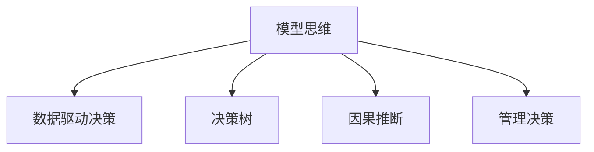

                 

# 丰富模型思维:增强管理者洞悉力

> 关键词：模型思维, 管理者, 决策支持, 数据驱动, 洞悉力, 人工智能, 决策树, 因果推断, 管理决策

## 1. 背景介绍

在信息爆炸的今天，管理者面临的环境日益复杂，决策难度不断增加。如何更高效、更准确地做出决策，成为了管理者急需解决的问题。人工智能和大数据技术的快速发展，为解决这一问题提供了新的工具和方法。本文将探讨如何利用模型思维，提升管理者的洞悉力，使决策更加科学和准确。

### 1.1 问题由来

随着企业规模的不断扩大，管理决策变得更加复杂和多样。传统上，管理者依靠经验直觉和直觉判断进行决策，这往往导致决策结果的偏差。特别是在不确定性较高的情境下，决策的科学性和准确性难以保证。人工智能和大数据技术的崛起，为管理者提供了更科学、更系统的决策工具。

### 1.2 问题核心关键点

模型思维是现代管理决策中不可或缺的工具。它利用统计学、数据科学、机器学习等技术，通过对数据进行建模和分析，辅助管理者做出更加准确、高效的决策。

模型思维的核心在于：
- **数据驱动**：通过收集和分析大量的数据，发现数据背后的规律和趋势，从而做出数据驱动的决策。
- **科学化**：模型思维强调决策的科学性和严谨性，避免主观判断带来的偏差。
- **系统化**：模型思维采用系统化的方法，从数据收集、模型建立、结果验证等各个环节进行全面考虑，提升决策的完整性和稳定性。

## 2. 核心概念与联系

### 2.1 核心概念概述

为了更好地理解模型思维及其在管理决策中的应用，本节将介绍几个密切相关的核心概念：

- **模型思维**：利用数据建模和分析，辅助管理者做出科学决策的思维模式。
- **数据驱动决策**：以数据分析和模型预测结果为基础，做出决策的决策方式。
- **决策树**：一种基于树形结构的分类和回归模型，通过特征选择和分裂来优化模型。
- **因果推断**：通过分析变量之间的关系，判断因果关系的推断方法。
- **管理决策**：管理者基于环境、资源、组织目标等因素，选择最优决策的过程。

这些概念之间的逻辑关系可以通过以下Mermaid流程图来展示：



这个流程图展示了几大核心概念之间的联系：

1. **模型思维**是贯穿整个决策过程的核心。
2. **数据驱动决策**和**管理决策**分别体现了决策的科学化和系统化。
3. **决策树**和**因果推断**是模型思维中常用的两种方法，用于帮助管理者进行分析和预测。

## 3. 核心算法原理 & 具体操作步骤
### 3.1 算法原理概述

基于模型思维的管理决策过程，本质上是通过构建和分析数据模型，辅助管理者进行决策。这一过程包括数据收集、模型建立、结果分析等多个环节。

具体而言，步骤如下：
1. **数据收集**：从多个渠道收集相关数据，确保数据的多样性和完备性。
2. **模型建立**：选择合适的模型，如决策树、因果推断模型等，对数据进行建模。
3. **模型训练**：使用历史数据对模型进行训练，确保模型能够准确预测未来结果。
4. **结果验证**：对模型预测结果进行验证，确保模型预测的准确性和可靠性。
5. **决策应用**：将模型预测结果应用于实际决策中，进行决策分析。

### 3.2 算法步骤详解

基于模型思维的管理决策，一般包括以下几个关键步骤：

**Step 1: 数据收集和预处理**
- 确定需要收集的数据类型和来源，确保数据的全面性和真实性。
- 对数据进行清洗和预处理，去除噪音和异常值，确保数据的质量。

**Step 2: 模型选择和建立**
- 根据决策问题的类型，选择合适的模型，如决策树、回归模型、聚类模型等。
- 对模型进行参数调优和训练，确保模型能够准确预测结果。

**Step 3: 结果分析和验证**
- 对模型预测结果进行分析和验证，确保模型的准确性和可靠性。
- 使用交叉验证等方法，评估模型的泛化能力和稳定性。

**Step 4: 决策应用和反馈**
- 将模型预测结果应用于实际决策中，进行决策分析。
- 收集决策结果的反馈数据，用于模型优化和改进。

### 3.3 算法优缺点

基于模型思维的管理决策具有以下优点：
1. **数据驱动**：利用数据进行决策，减少主观判断的偏差。
2. **科学化**：通过建模和分析，提升决策的科学性和严谨性。
3. **系统化**：从数据收集到决策应用的全面考虑，提高决策的系统性。
4. **自动化**：使用模型自动预测，提高决策效率。

同时，该方法也存在一定的局限性：
1. **数据质量依赖**：模型预测的准确性很大程度上取决于数据的质量，数据收集和处理过程中的噪音和误差可能导致预测偏差。
2. **模型假设限制**：模型的预测结果依赖于模型的假设和数据特征，如果模型假设不成立，可能导致预测结果的不准确。
3. **结果解释困难**：模型预测结果往往难以解释，特别是复杂的非线性模型，可能给决策者带来困惑。
4. **过拟合风险**：模型在训练数据上的表现可能优于在新数据上的表现，导致过拟合风险。

尽管存在这些局限性，但就目前而言，基于模型思维的管理决策方法仍是大规模数据时代的重要决策工具。未来相关研究的重点在于如何进一步提高数据质量，优化模型假设，提高模型的可解释性和泛化能力，同时兼顾自动化和人类决策的有机结合。

### 3.4 算法应用领域

基于模型思维的管理决策方法，已经在企业管理、金融投资、市场分析等多个领域得到了广泛的应用，涵盖了从战略规划到日常运营的各个方面。

例如，在企业管理中，通过数据分析和模型预测，可以帮助企业制定更合理的战略规划、优化资源配置、提升运营效率。在金融投资中，利用模型预测市场趋势，可以辅助投资决策，规避风险，提高投资收益。在市场分析中，通过数据分析和模型预测，可以了解市场需求和趋势，制定更有效的市场策略。

此外，模型思维还被广泛应用于产品开发、客户关系管理、风险控制等多个领域，为企业的决策提供了科学和系统的支持。

## 4. 数学模型和公式 & 详细讲解  
### 4.1 数学模型构建

本节将使用数学语言对基于模型思维的管理决策过程进行更加严格的刻画。

设决策问题为 $P$，相关数据为 $D$，目标为 $Y$。定义模型 $M$ 为：

$$
M(D) = f(\theta, D)
$$

其中，$\theta$ 为模型参数，$f(\cdot)$ 为模型函数，$D$ 为输入数据。

决策过程可以表示为：

$$
Y = M(D)
$$

模型的目标是最小化预测误差，即：

$$
\min_{\theta} \mathbb{E}[(Y - M(D))^2]
$$

通过最小化预测误差，模型可以尽可能准确地预测决策结果。

### 4.2 公式推导过程

以决策树为例，推导其预测过程。设决策树模型为 $T$，叶节点为 $N$，特征为 $X$，决策规则为 $R$。

首先，根据数据集 $D$，对数据进行划分，得到各个叶节点 $N_i$，其预测结果为 $Y_i$。根据决策规则 $R$，对输入数据 $X$ 进行分类，得到预测结果 $Y$。

假设预测结果与真实结果的误差为 $E$，则决策树模型的预测误差可以表示为：

$$
E = \sum_{i=1}^N \sum_{j=1}^M |Y_i - Y_j|^2
$$

其中，$M$ 为样本总数。

通过最小化预测误差，得到最优的决策树模型 $T^*$。

### 4.3 案例分析与讲解

以一家电商企业的销售预测为例，展示如何利用模型思维进行决策。

假设该企业有历史销售数据 $D = \{(x_i, y_i)\}_{i=1}^N$，其中 $x_i$ 为时间、价格、广告投放等特征，$y_i$ 为实际销售量。

首先，对数据进行预处理和清洗，确保数据质量。然后，使用决策树模型对数据进行建模，得到预测结果 $y = M(D)$。

通过验证数据集上的预测误差，可以评估模型的准确性。在实际决策中，根据模型预测结果 $y$，结合其他因素（如市场趋势、竞争对手动态等），进行销售预测和决策分析。

## 5. 项目实践：代码实例和详细解释说明
### 5.1 开发环境搭建

在进行模型思维的实践前，我们需要准备好开发环境。以下是使用Python进行Scikit-Learn开发的环境配置流程：

1. 安装Anaconda：从官网下载并安装Anaconda，用于创建独立的Python环境。

2. 创建并激活虚拟环境：
```bash
conda create -n sklearn-env python=3.8 
conda activate sklearn-env
```

3. 安装Scikit-Learn：
```bash
conda install scikit-learn
```

4. 安装各类工具包：
```bash
pip install numpy pandas scikit-learn matplotlib tqdm jupyter notebook ipython
```

完成上述步骤后，即可在`sklearn-env`环境中开始模型思维的实践。

### 5.2 源代码详细实现

下面我们以电商企业的销售预测为例，给出使用Scikit-Learn对决策树模型进行实践的代码实现。

首先，定义数据处理函数：

```python
from sklearn.model_selection import train_test_split
from sklearn.metrics import mean_squared_error

def preprocess_data(data):
    # 数据清洗和预处理
    # ...
    # 特征工程
    # ...
    return X_train, X_test, y_train, y_test

# 数据预处理
X_train, X_test, y_train, y_test = preprocess_data(data)
```

然后，定义模型和评估函数：

```python
from sklearn.tree import DecisionTreeRegressor
from sklearn.ensemble import RandomForestRegressor

model = DecisionTreeRegressor()

def train_model(model, X_train, y_train):
    model.fit(X_train, y_train)

def evaluate_model(model, X_test, y_test):
    y_pred = model.predict(X_test)
    mse = mean_squared_error(y_test, y_pred)
    return mse

# 训练模型
train_model(model, X_train, y_train)

# 评估模型
mse = evaluate_model(model, X_test, y_test)
print(f"模型MSE: {mse:.2f}")
```

最后，启动模型训练和评估：

```python
# 训练模型
train_model(model, X_train, y_train)

# 评估模型
mse = evaluate_model(model, X_test, y_test)
print(f"模型MSE: {mse:.2f}")
```

以上就是使用Scikit-Learn对决策树模型进行销售预测的完整代码实现。可以看到，Scikit-Learn封装了决策树模型的训练和评估过程，使得模型思维的实践变得简洁高效。

### 5.3 代码解读与分析

让我们再详细解读一下关键代码的实现细节：

**preprocess_data函数**：
- 定义数据清洗和预处理函数，对原始数据进行去噪、归一化、特征工程等操作，确保数据质量。

**train_model和evaluate_model函数**：
- 定义模型训练和评估函数，使用决策树模型对数据进行建模和预测。
- 在训练模型时，使用决策树回归器对数据进行拟合。
- 在评估模型时，使用均方误差(MSE)作为评估指标，衡量预测结果与真实结果的误差。

**模型训练和评估**：
- 在训练模型时，将训练数据集 $X_{train}$ 和 $y_{train}$ 作为输入，使用 `model.fit()` 方法进行训练。
- 在评估模型时，将测试数据集 $X_{test}$ 和 $y_{test}$ 作为输入，使用 `model.predict()` 方法进行预测，并计算预测结果与真实结果的均方误差。

可以看到，Scikit-Learn使得模型思维的实践变得简单易行，开发者可以将更多精力放在数据处理、模型改进等高层逻辑上，而不必过多关注底层的实现细节。

当然，工业级的系统实现还需考虑更多因素，如模型的保存和部署、超参数的自动搜索、更灵活的任务适配层等。但核心的模型思维基本与此类似。

## 6. 实际应用场景
### 6.1 企业管理

基于模型思维的管理决策方法，在企业管理中有着广泛的应用。例如：

- **战略规划**：通过数据分析和模型预测，帮助企业制定更合理的战略规划，优化资源配置。
- **运营优化**：利用模型预测生产需求、库存水平等，优化生产流程和库存管理。
- **风险控制**：通过预测市场风险和业务风险，制定风险管理策略，规避风险。

### 6.2 金融投资

在金融投资领域，模型思维也有着重要的应用。例如：

- **市场分析**：利用模型预测市场趋势和波动，制定投资策略，规避风险。
- **资产配置**：通过数据分析和模型预测，优化资产配置，提高投资收益。
- **风险管理**：通过模型预测市场风险和信用风险，制定风险管理策略，保障投资安全。

### 6.3 市场分析

市场分析也是模型思维的重要应用领域。例如：

- **市场趋势预测**：利用模型预测市场趋势和变化，制定营销策略。
- **竞争分析**：通过数据分析和模型预测，了解竞争对手的市场表现，制定竞争策略。
- **客户需求分析**：通过模型预测客户需求和行为，制定客户服务策略。

## 7. 工具和资源推荐
### 7.1 学习资源推荐

为了帮助开发者系统掌握模型思维的理论基础和实践技巧，这里推荐一些优质的学习资源：

1. 《Python数据科学手册》：详细介绍了Python在数据科学和机器学习中的应用，包括数据清洗、模型训练、结果分析等。

2. 《统计学习方法》：介绍了统计学习的基本概念和常用模型，适合初学者学习。

3. 《机器学习实战》：通过大量实战案例，帮助读者掌握机器学习模型的构建和应用。

4. Coursera《数据科学导论》课程：由Johns Hopkins大学开设，介绍了数据科学的基本方法和工具，适合非专业人士学习。

5. Kaggle：数据科学竞赛平台，提供大量数据集和模型比赛，有助于实战练习。

通过对这些资源的学习实践，相信你一定能够快速掌握模型思维的精髓，并用于解决实际的决策问题。

### 7.2 开发工具推荐

高效的开发离不开优秀的工具支持。以下是几款用于模型思维开发的常用工具：

1. Python：作为数据科学和机器学习的主流语言，Python拥有丰富的第三方库和框架，适合快速迭代研究。

2. R：适合统计分析和模型训练，特别是在线性模型和因果推断方面有优势。

3. Scikit-Learn：开源的机器学习库，封装了多种常用的模型和算法，适合初学者使用。

4. TensorFlow和PyTorch：深度学习框架，适合复杂模型的训练和推理。

5. Weights & Biases：模型训练的实验跟踪工具，可以记录和可视化模型训练过程中的各项指标，方便对比和调优。

6. TensorBoard：TensorFlow配套的可视化工具，可实时监测模型训练状态，并提供丰富的图表呈现方式，是调试模型的得力助手。

合理利用这些工具，可以显著提升模型思维的开发效率，加快创新迭代的步伐。

### 7.3 相关论文推荐

模型思维的发展源于学界的持续研究。以下是几篇奠基性的相关论文，推荐阅读：

1. 《决策树算法》：介绍了决策树算法的基本原理和实现方法，是机器学习领域的经典教材。

2. 《因果推断方法》：介绍了因果推断的基本概念和常用方法，适合进阶学习。

3. 《模型思维在企业中的应用》：介绍了模型思维在企业管理中的具体应用，提供了丰富的案例和实践经验。

4. 《统计学习方法》：介绍统计学习的基本概念和常用模型，适合初学者学习。

5. 《机器学习实战》：通过大量实战案例，帮助读者掌握机器学习模型的构建和应用。

这些论文代表了大模型思维的发展脉络。通过学习这些前沿成果，可以帮助研究者把握学科前进方向，激发更多的创新灵感。

## 8. 总结：未来发展趋势与挑战
### 8.1 总结

本文对基于模型思维的管理决策方法进行了全面系统的介绍。首先阐述了模型思维在管理决策中的重要性，明确了模型思维在提升决策准确性和效率方面的独特价值。其次，从原理到实践，详细讲解了模型思维的数学原理和关键步骤，给出了模型思维任务开发的完整代码实例。同时，本文还广泛探讨了模型思维方法在企业管理、金融投资、市场分析等多个领域的应用前景，展示了模型思维的巨大潜力。此外，本文精选了模型思维技术的各类学习资源，力求为读者提供全方位的技术指引。

通过本文的系统梳理，可以看到，基于模型思维的管理决策方法正在成为企业管理决策的重要工具，极大地提升了决策的科学性和准确性。未来，伴随模型思维技术的不断演进，相信企业决策将更加科学、高效和全面。

### 8.2 未来发展趋势

展望未来，模型思维在管理决策中的应用将呈现以下几个发展趋势：

1. **数据集成**：数据驱动决策的前提是数据的全面性和真实性。未来将更加注重跨部门、跨平台的数据集成，确保数据的完整性和一致性。

2. **模型优化**：模型思维的应用离不开高质量的模型。未来将进一步优化模型结构，引入更多高级算法，提高模型的精度和泛化能力。

3. **实时决策**：模型思维的应用场景将进一步扩展到实时决策中，特别是在金融交易、市场分析等高时效性领域。

4. **人机协同**：模型思维的应用离不开人的参与和监督。未来将更多地探索人机协同的决策模式，提高决策的灵活性和智能性。

5. **智能决策**：随着人工智能技术的发展，未来的决策模型将更加智能化，能够自动学习、自动优化，甚至具有一定的自主决策能力。

以上趋势凸显了模型思维在管理决策中的广泛应用前景，这些方向的探索发展，必将进一步提升企业决策的科学性和准确性。

### 8.3 面临的挑战

尽管模型思维在管理决策中的应用前景广阔，但在实际应用中也面临着诸多挑战：

1. **数据质量**：模型预测的准确性很大程度上取决于数据的质量，数据清洗和预处理过程中的噪音和误差可能导致预测偏差。

2. **模型假设**：模型的预测结果依赖于模型的假设和数据特征，如果模型假设不成立，可能导致预测结果的不准确。

3. **结果解释**：模型预测结果往往难以解释，特别是复杂的非线性模型，可能给决策者带来困惑。

4. **过拟合风险**：模型在训练数据上的表现可能优于在新数据上的表现，导致过拟合风险。

5. **资源消耗**：模型训练和推理需要大量计算资源，可能对企业的计算能力带来压力。

6. **伦理问题**：数据隐私和模型伦理问题是模型思维应用的重要挑战，需要确保数据的合法使用和模型的公平性。

这些挑战凸显了模型思维在实际应用中的复杂性，需要进一步探索和解决。

### 8.4 研究展望

面对模型思维面临的种种挑战，未来的研究需要在以下几个方面寻求新的突破：

1. **数据融合技术**：探索跨平台、跨部门的数据融合技术，提高数据的全面性和真实性。

2. **模型可解释性**：开发可解释性更强的模型，使得决策者能够理解模型的内部机制和预测逻辑。

3. **模型自动化**：探索自动化决策技术，提高模型的实时性和智能性。

4. **模型伦理约束**：引入伦理约束机制，确保模型的公平性和公正性，避免数据滥用和模型歧视。

这些研究方向的探索，必将引领模型思维技术迈向更高的台阶，为构建科学、高效、智能的管理决策系统铺平道路。面向未来，模型思维还需要与其他人工智能技术进行更深入的融合，如知识表示、因果推理、强化学习等，多路径协同发力，共同推动自然语言理解和智能交互系统的进步。只有勇于创新、敢于突破，才能不断拓展模型思维的边界，让智能技术更好地造福人类社会。

## 9. 附录：常见问题与解答

**Q1：模型思维是否适用于所有管理决策？**

A: 模型思维在大多数管理决策中都能取得不错的效果，特别是在数据量较大的决策场景中。但对于一些特定领域的决策，如战略规划、组织变革等，可能需要结合经验和专业知识进行综合考虑。

**Q2：如何选择合适的模型？**

A: 根据决策问题的特点选择合适的模型。例如，分类问题可以使用决策树、支持向量机等模型，回归问题可以使用线性回归、决策树回归等模型。在选择模型时，还需要考虑模型的复杂度、可解释性、预测精度等因素。

**Q3：模型训练过程中需要注意哪些问题？**

A: 模型训练过程中需要注意以下几个问题：
1. 数据质量：确保数据的全面性和真实性，避免噪音和异常值。
2. 模型假设：确保模型的假设和数据特征一致，避免模型预测的不准确。
3. 过拟合：使用正则化、交叉验证等方法，避免过拟合风险。

**Q4：模型思维在实际应用中需要注意哪些问题？**

A: 模型思维在实际应用中需要注意以下几个问题：
1. 数据集成：确保数据的全面性和真实性，避免数据分割导致的偏差。
2. 结果解释：提高模型的可解释性，使得决策者能够理解模型的内部机制和预测逻辑。
3. 模型优化：不断优化模型结构和算法，提高模型的精度和泛化能力。
4. 资源消耗：合理配置计算资源，避免计算资源的浪费。

这些问题是模型思维应用中的常见问题，需要管理者在实际应用中加以注意和解决。

---

作者：禅与计算机程序设计艺术 / Zen and the Art of Computer Programming

