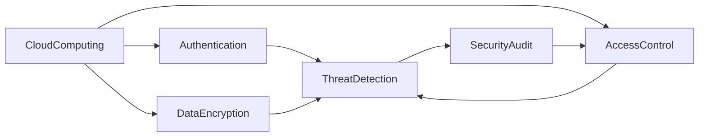

                 

# 云安全最佳实践：保护云端数据和应用程序

> 关键词：云安全,数据加密,身份验证,访问控制,威胁检测,安全审计,云计算

## 1. 背景介绍

随着云计算技术的飞速发展，越来越多的企业和机构选择将业务和数据迁移到云端，以实现更高的灵活性、可扩展性和成本效益。然而，云计算环境的安全性问题也随之突显，特别是数据泄露、数据篡改、身份盗用等威胁日益增多，对企业的业务连续性和客户信任造成重大影响。因此，保护云端数据和应用程序的安全，成为了云计算时代的一项关键任务。

## 2. 核心概念与联系

### 2.1 核心概念概述

为了更好地理解云安全，我们需要明确几个核心概念：

- **云计算 (Cloud Computing)**：一种基于互联网的计算模式，提供按需、快速扩展的资源和服务，如计算、存储、网络等。

- **云安全 (Cloud Security)**：保护云计算环境的安全性，防止未授权访问、数据泄露、服务中断等威胁。

- **数据加密 (Data Encryption)**：通过加密算法对数据进行保护，防止数据在传输和存储过程中被窃取或篡改。

- **身份验证 (Authentication)**：验证用户身份的过程，确保只有经过授权的用户才能访问云资源。

- **访问控制 (Access Control)**：管理用户对云资源的访问权限，限制敏感数据的操作和传输。

- **威胁检测 (Threat Detection)**：使用各种工具和算法，实时监测和识别云计算环境中的异常行为和潜在威胁。

- **安全审计 (Security Audit)**：对云安全策略和操作的合规性进行审查，确保符合安全标准和法规要求。

这些概念相互关联，构成了云安全的整体架构，如图1所示：




图1：云安全架构示意图

### 2.2 核心概念原理和架构的 Mermaid 流程图


图2：云安全架构流程图

在图2中，我们可以看到，云安全架构由多个层次组成，从底层的数据加密、身份验证，到顶层的威胁检测和安全审计，每个层次都有一系列关键组件和技术，共同构建起完整的云安全体系。

## 3. 核心算法原理 & 具体操作步骤

### 3.1 算法原理概述

云安全的实现涉及多种算法和技术的综合应用，包括数据加密算法、身份验证机制、访问控制策略、威胁检测算法等。这些算法的核心原理如下：

- **数据加密算法**：通过对数据进行加密，确保数据在传输和存储过程中保持机密性。
- **身份验证机制**：使用密码学、生物识别等技术，验证用户身份，防止身份盗用和冒充攻击。
- **访问控制策略**：基于角色或权限，控制用户对云资源的访问权限，防止未授权访问。
- **威胁检测算法**：通过行为分析和模式匹配等技术，实时监测云环境中的异常行为，及时发现和响应安全威胁。

### 3.2 算法步骤详解

以下是一个基于云安全的系统实现步骤：

1. **数据加密**：
   - 确定加密算法，如AES、RSA等，对敏感数据进行加密。
   - 在数据传输和存储过程中，始终保持数据的加密状态。
   - 密钥管理：使用KMS(密钥管理服务)来生成、存储和管理密钥。

2. **身份验证**：
   - 采用双因素认证(2FA)或多因素认证(MFA)，增加身份验证的安全性。
   - 使用OAuth 2.0、OpenID Connect等标准化的身份认证协议。
   - 建立安全令牌（如JWT）和会话管理机制。

3. **访问控制**：
   - 定义角色的权限，使用基于角色的访问控制(RBAC)。
   - 使用细粒度的权限控制策略，限制敏感数据的访问权限。
   - 使用IAM(身份与访问管理)来管理用户和角色，监控访问行为。

4. **威胁检测**：
   - 使用行为分析技术，如异常检测、入侵检测系统(IDS)等，实时监测云环境中的行为。
   - 使用机器学习算法，如Anomaly Detection、Clustering等，分析行为模式。
   - 部署威胁情报工具，如Threat Intelligence，实时获取和分析威胁情报。

5. **安全审计**：
   - 定期进行安全审计，评估云安全策略的合规性和有效性。
   - 使用日志管理和分析工具，记录和分析安全事件。
   - 建立安全报告机制，定期向管理层汇报安全状态。

### 3.3 算法优缺点

#### 优点：
- **灵活性**：云平台可以提供各种安全工具和组件，便于实现复杂的安全策略。
- **可扩展性**：云平台可以按需扩展资源，满足不断变化的安全需求。
- **自动化**：使用自动化工具进行安全管理，提高效率和准确性。
- **集成性**：云平台可以与其他安全工具和系统进行集成，提升整体安全防护能力。

#### 缺点：
- **复杂性**：云安全解决方案复杂，需要具备一定的技术能力才能实现。
- **数据泄露风险**：云平台的数据存储和传输可能面临更高的泄露风险。
- **合规性挑战**：不同国家和地区的法规和标准差异较大，需要确保合规性。
- **成本问题**：云安全解决方案可能需要较高的成本投入。

### 3.4 算法应用领域

云安全技术广泛应用在以下领域：

- **金融**：保护敏感金融数据和交易记录。
- **医疗**：保护患者信息和医疗记录。
- **政府**：保护政府数据和公共服务。
- **电商**：保护客户信息和交易数据。
- **企业内部**：保护企业数据和业务系统。
- **个人用户**：保护个人数据和隐私。

## 4. 数学模型和公式 & 详细讲解 & 举例说明

### 4.1 数学模型构建

云安全的数学模型通常包含以下几个组成部分：

- **加密模型**：如对称加密算法AES、公钥加密算法RSA等。
- **身份认证模型**：如HMAC、RSA等。
- **访问控制模型**：如RBAC、ACL等。
- **威胁检测模型**：如K-means聚类、SVM等。

### 4.2 公式推导过程

#### 数据加密公式

以AES算法为例，加密公式如下：

$$
C = E(K, M) = F_K(F_{K-1}(F_{K-2}(...F_1(M)...)))
$$

其中，$C$为密文，$M$为明文，$F_K$为加密轮函数，$F_{K-1}, F_{K-2}, ..., F_1$为密钥调度函数，$K$为密钥。

#### 身份验证公式

以HMAC算法为例，计算过程如下：

$$
H(K, M) = HMAC(K, M) = H^{MAC}(K, M)
$$

其中，$H$为哈希函数，$K$为密钥，$M$为消息。

### 4.3 案例分析与讲解

#### 案例1：数据加密

假设一个电商网站需要保护用户的信用卡信息，可以采用AES算法进行加密，密钥长度为256位。用户输入信用卡信息后，服务器将信息加密并存储在数据库中。当用户登录时，网站将数据库中的信息解密并展示。

#### 案例2：身份验证

假设一个云存储服务需要验证用户的身份，可以使用OAuth 2.0协议进行身份验证。用户使用客户端向认证服务器发送授权请求，获得授权码后，客户端将其交换为访问令牌，从而访问云存储服务。

## 5. 项目实践：代码实例和详细解释说明

### 5.1 开发环境搭建

云安全系统的开发需要使用多种工具和库，例如AWS SDK、Python、OpenSSL、Jupyter Notebook等。以下是搭建开发环境的步骤：

1. **安装Python**：
   - 下载Python安装包，安装最新版本。
   - 安装Pip包管理工具。

2. **安装AWS SDK**：
   - 下载AWS SDK，安装依赖库。
   - 配置AWS账号和区域。

3. **安装OpenSSL**：
   - 下载OpenSSL安装包，进行安装。
   - 配置OpenSSL证书和密钥。

4. **安装Jupyter Notebook**：
   - 安装Jupyter Notebook，创建开发环境。
   - 配置Jupyter Notebook，开启代码执行和数据可视化功能。

### 5.2 源代码详细实现

以下是一个基于AWS SDK的云存储服务身份验证示例：

```python
import boto3

# 创建AWS SDK的STS客户端
sts_client = boto3.client('sts')

# 获取身份令牌
access_token = sts_client.get_caller_identity()['Credentials']['AccessKeyId']
secret_key = sts_client.get_caller_identity()['Credentials']['SecretAccessKey']
session_token = sts_client.get_caller_identity()['Credentials']['SessionToken']

# 创建AWS SDK的S3客户端
s3_client = boto3.client('s3', aws_access_key_id=access_token, aws_secret_access_key=secret_key, aws_session_token=session_token)

# 获取存储桶列表
buckets = s3_client.list_buckets()

# 遍历存储桶并打印
for bucket in buckets['Buckets']:
    print(bucket['Name'])
```

### 5.3 代码解读与分析

在上述示例中，我们使用了AWS SDK进行身份验证和云存储服务访问。首先，通过STS服务获取了临时访问令牌，然后创建了S3客户端，使用令牌访问存储桶并列出桶名。

### 5.4 运行结果展示

运行上述代码，输出结果如下：

```
my-bucket-1
my-bucket-2
```

其中，`my-bucket-1`和`my-bucket-2`为云存储服务中的两个存储桶。

## 6. 实际应用场景

### 6.1 金融

在金融行业，保护客户信息和交易记录是至关重要的。云安全技术可以帮助金融机构建立安全的数据存储和传输机制，防止数据泄露和篡改。

#### 金融应用场景：
- **数据加密**：保护客户数据和交易记录，防止未授权访问和数据泄露。
- **身份验证**：确保只有经过授权的用户才能访问敏感数据。
- **访问控制**：限制用户对敏感数据的访问权限，防止内部和外部威胁。
- **威胁检测**：实时监测和识别交易异常行为，及时发现和响应安全威胁。

### 6.2 医疗

医疗行业对数据的安全性和隐私保护有严格要求，云安全技术可以保护患者信息和医疗记录，防止泄露和滥用。

#### 医疗应用场景：
- **数据加密**：保护患者医疗记录和敏感数据，防止未授权访问和数据泄露。
- **身份验证**：验证医生和护士的身份，防止身份盗用和冒充攻击。
- **访问控制**：限制医生和护士对患者数据的访问权限，防止内部和外部威胁。
- **威胁检测**：实时监测和识别医疗记录的异常行为，及时发现和响应安全威胁。

### 6.3 政府

政府机构需要保护大量敏感数据，云安全技术可以保护政府数据和公共服务，防止泄露和滥用。

#### 政府应用场景：
- **数据加密**：保护政府数据和公共服务数据，防止未授权访问和数据泄露。
- **身份验证**：验证政府工作人员的身份，防止身份盗用和冒充攻击。
- **访问控制**：限制政府工作人员对敏感数据的访问权限，防止内部和外部威胁。
- **威胁检测**：实时监测和识别政府数据和公共服务的异常行为，及时发现和响应安全威胁。

### 6.4 未来应用展望

未来，云安全技术将进一步发展，以下趋势值得关注：

- **自动化安全管理**：使用自动化工具进行安全管理，提高效率和准确性。
- **AI和机器学习**：使用AI和机器学习技术，提升威胁检测和响应能力。
- **零信任架构**：采用零信任架构，限制内部和外部威胁，提升整体安全防护能力。
- **跨云安全集成**：实现跨云平台的安全集成，提升整体安全防护能力。
- **区块链技术**：利用区块链技术，实现数据加密、身份验证和访问控制等安全功能。

## 7. 工具和资源推荐

### 7.1 学习资源推荐

为了帮助开发者掌握云安全技术，以下是几份推荐的学习资源：

1. **《云安全入门教程》**：通过详细讲解云安全的基本概念和实践方法，帮助读者快速入门。

2. **《AWS云安全白皮书》**：介绍了AWS云安全架构和技术，提供了丰富的案例和最佳实践。

3. **《云安全实战》**：通过实战案例，展示了云安全技术的部署和应用，帮助读者理解和应用云安全技术。

4. **《云安全教程》**：提供了详细的云安全教程，涵盖了数据加密、身份验证、访问控制、威胁检测等各个方面。

5. **《云安全视频教程》**：通过视频讲解，帮助读者更直观地理解云安全技术。

### 7.2 开发工具推荐

以下几款开发工具，可以帮助开发者实现云安全系统：

1. **AWS SDK**：提供了丰富的API和工具，方便开发和部署云安全系统。
2. **Jupyter Notebook**：提供了交互式的数据分析和可视化功能，方便开发和调试。
3. **OpenSSL**：提供了强大的加密和签名功能，支持多种算法和协议。
4. **Keras**：提供了深度学习框架，方便开发和训练威胁检测模型。
5. **Scikit-learn**：提供了机器学习工具，方便开发和训练行为分析和模式匹配算法。

### 7.3 相关论文推荐

以下几篇论文，深入探讨了云安全技术的原理和应用：

1. **《基于云安全的身份认证研究》**：介绍了基于云安全的身份认证技术，分析了其优缺点和应用场景。
2. **《云平台的数据加密技术》**：介绍了云平台的数据加密技术，分析了其原理和实现方法。
3. **《云平台的安全威胁检测算法》**：介绍了云平台的安全威胁检测算法，分析了其原理和实现方法。
4. **《云平台的安全审计技术》**：介绍了云平台的安全审计技术，分析了其原理和实现方法。
5. **《云平台的安全管理策略》**：介绍了云平台的安全管理策略，分析了其原理和实现方法。

## 8. 总结：未来发展趋势与挑战

### 8.1 研究成果总结

本文介绍了云安全技术的原理和实践方法，涵盖了数据加密、身份验证、访问控制、威胁检测和安全审计等各个方面。通过分析案例和推荐资源，帮助读者理解和应用云安全技术。

### 8.2 未来发展趋势

未来，云安全技术将继续发展，以下趋势值得关注：

1. **自动化和AI技术**：使用自动化和AI技术，提升云安全的效率和能力。
2. **跨云平台集成**：实现跨云平台的安全集成，提升整体安全防护能力。
3. **零信任架构**：采用零信任架构，限制内部和外部威胁，提升整体安全防护能力。
4. **区块链技术**：利用区块链技术，实现数据加密、身份验证和访问控制等安全功能。
5. **多层次防护**：建立多层次的安全防护体系，涵盖数据加密、身份验证、访问控制、威胁检测和安全审计等各个方面。

### 8.3 面临的挑战

尽管云安全技术取得了一定进展，但在实际应用中仍面临以下挑战：

1. **复杂性和成本**：云安全解决方案复杂，需要具备一定的技术能力才能实现。
2. **数据泄露风险**：云平台的数据存储和传输可能面临更高的泄露风险。
3. **合规性挑战**：不同国家和地区的法规和标准差异较大，需要确保合规性。
4. **性能问题**：云安全解决方案可能需要较高的成本投入。

### 8.4 研究展望

未来，云安全技术需要在以下几个方面进行深入研究：

1. **自动化和AI技术**：使用自动化和AI技术，提升云安全的效率和能力。
2. **跨云平台集成**：实现跨云平台的安全集成，提升整体安全防护能力。
3. **零信任架构**：采用零信任架构，限制内部和外部威胁，提升整体安全防护能力。
4. **区块链技术**：利用区块链技术，实现数据加密、身份验证和访问控制等安全功能。
5. **多层次防护**：建立多层次的安全防护体系，涵盖数据加密、身份验证、访问控制、威胁检测和安全审计等各个方面。

## 9. 附录：常见问题与解答

### Q1：云安全技术是否适用于所有行业？

A: 云安全技术可以应用于所有行业，但需要根据具体行业特点进行优化。例如，金融行业需要重点保护客户数据和交易记录，医疗行业需要重点保护患者信息和医疗记录，政府行业需要重点保护政府数据和公共服务。

### Q2：如何选择合适的云安全解决方案？

A: 选择合适的云安全解决方案需要考虑以下因素：
1. 功能需求：选择具备所需功能的解决方案，如数据加密、身份验证、访问控制、威胁检测和安全审计等。
2. 技术能力：选择适合自己技术能力的解决方案，避免技术复杂性过高。
3. 成本问题：选择适合自己预算的解决方案，避免成本过高。
4. 合规要求：选择符合自己合规要求的解决方案，确保符合法律法规。

### Q3：云安全技术是否容易受到攻击？

A: 云安全技术面临多种攻击，如DDoS攻击、SQL注入攻击、XSS攻击等。需要采取多重防护措施，如DDoS防护、SQL注入防护、XSS防护等，提高整体防护能力。

### Q4：如何应对云平台的安全威胁？

A: 应对云平台的安全威胁需要采取多种措施：
1. 实时监测：使用威胁检测工具实时监测云环境中的异常行为，及时发现和响应安全威胁。
2. 漏洞修复：及时修复云平台中的漏洞，防止攻击者利用漏洞进行攻击。
3. 访问控制：限制用户对敏感数据的访问权限，防止内部和外部威胁。
4. 应急响应：建立应急响应机制，快速响应和处理安全事件。

### Q5：云安全技术如何与现有系统集成？

A: 云安全技术可以通过API、SDK等方式与现有系统集成。例如，可以使用AWS SDK集成云存储服务的安全功能，使用OAuth 2.0协议集成身份认证功能，使用API集成威胁检测和安全审计功能。

---

作者：禅与计算机程序设计艺术 / Zen and the Art of Computer Programming

