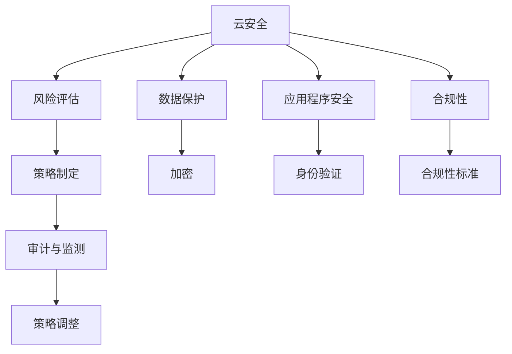

                 

# 云安全策略和合规性：保护云端数据和应用程序

> 关键词：云安全, 数据保护, 合规性, 应用程序, 风险评估, 策略制定, 审计与监测

## 1. 背景介绍

随着云计算技术的迅猛发展，企业越来越依赖云端存储和运行各类业务系统，但随之而来的云安全问题也日益突出。数据泄露、身份盗用、恶意攻击等事件频发，严重威胁企业的商业秘密和用户隐私，给企业带来巨大的经济损失和声誉损失。因此，制定一套完善的云安全策略和合规性框架，确保云端数据和应用程序的安全，成为企业不可忽视的重要任务。

在本文中，我们将系统地介绍云安全策略和合规性框架的核心概念和基本原理，并结合实际案例，深入探讨如何通过这些策略和技术，有效保护云端数据和应用程序的安全。

## 2. 核心概念与联系

### 2.1 核心概念概述

- **云安全**：指在云环境中，保护数据、应用程序和基础设施，防止其遭受各类威胁的能力。云安全涉及基础设施安全、数据安全、应用安全和合规性管理等多个方面。

- **数据保护**：指通过技术和管理手段，确保数据在存储和传输过程中不被未授权访问、篡改和泄露。包括数据加密、访问控制、备份和恢复等措施。

- **合规性**：指遵守相关法律法规和标准，确保云环境下的数据处理和存储符合规定，防止因合规性问题而导致的法律风险和业务风险。

- **应用程序安全**：指保护云应用程序免受各类攻击，包括SQL注入、跨站脚本(XSS)、跨站请求伪造(CSRF)等，保障应用程序的可用性和安全性。

- **风险评估**：指通过定量和定性方法，识别和评估云环境中潜在的安全风险，并采取相应措施进行控制和预防。

- **策略制定**：指根据风险评估结果，制定针对性的安全策略和技术方案，确保云环境的安全性和合规性。

- **审计与监测**：指通过定期审计和实时监测，评估云安全策略的有效性，发现并及时修正安全漏洞和合规性问题，保障云环境的安全稳定运行。

这些核心概念之间的关系可以通过以下Mermaid流程图来展示：



这个流程图展示了云安全框架的基本构成要素及其相互关系。

## 3. 核心算法原理 & 具体操作步骤

### 3.1 算法原理概述

云安全策略和合规性框架的建立和维护，主要涉及以下算法原理：

- **风险评估算法**：通过定量和定性分析，识别和评估云环境中的各类安全风险，并按严重程度进行排序，确定需要优先控制的风险。

- **威胁检测算法**：使用各种技术手段，实时监测云环境中的异常行为，发现潜在的威胁和攻击，及时采取应对措施。

- **策略优化算法**：根据风险评估和威胁检测结果，调整和优化现有的安全策略，确保其针对性和有效性。

- **审计和合规性算法**：通过自动化工具，定期对云环境进行合规性检查和审计，确保符合相关法规和标准。

### 3.2 算法步骤详解

#### 3.2.1 风险评估步骤

1. **风险识别**：列出所有可能影响云安全的威胁和风险，包括数据泄露、身份盗用、DDoS攻击等。
2. **风险量化**：使用定量方法（如矩阵法、层次分析法等），对各种威胁和风险进行量化评估，确定其发生概率和影响程度。
3. **风险排序**：根据量化结果，对各种威胁和风险进行排序，确定优先级最高的风险进行控制。

#### 3.2.2 威胁检测步骤

1. **异常检测**：使用行为分析、流量分析等技术手段，实时监测云环境中的异常行为，识别潜在威胁。
2. **事件响应**：一旦发现威胁，立即启动事件响应机制，采取隔离、封锁等措施，防止威胁扩散。
3. **事件恢复**：在事件响应结束后，进行系统恢复，确保业务连续性和数据完整性。

#### 3.2.3 策略优化步骤

1. **策略调整**：根据风险评估和威胁检测结果，调整和优化现有的安全策略，增加或修改控制措施。
2. **策略验证**：在调整后，使用模拟攻击等手段，验证新策略的有效性。
3. **策略执行**：执行调整后的策略，并进行监控和评估。

#### 3.2.4 审计和合规性步骤

1. **合规性检查**：定期使用自动化工具对云环境进行合规性检查，确保符合相关法规和标准。
2. **审计报告**：生成合规性审计报告，并提交给监管机构和内部审计部门。
3. **问题纠正**：针对审计中发现的问题，制定并实施纠正措施。

### 3.3 算法优缺点

#### 3.3.1 优点

- **全面覆盖**：风险评估、威胁检测、策略优化和审计监测等算法，覆盖云安全管理的各个方面，确保全面防护。
- **实时监控**：通过威胁检测算法，实现实时监控，及时发现并响应安全事件，保障云环境的安全性。
- **动态调整**：策略优化算法和审计监测算法，可以根据环境变化动态调整策略，确保策略的有效性。

#### 3.3.2 缺点

- **复杂度高**：云安全策略和合规性框架的建立和维护需要较高的技术和管理水平，对企业的要求较高。
- **资源消耗**：实施风险评估、威胁检测和策略优化等算法，需要大量的计算和存储资源，对企业成本也有一定压力。
- **操作复杂**：风险评估、策略优化和审计监测等算法的操作较为复杂，需要专业的团队和工具支持。

### 3.4 算法应用领域

云安全策略和合规性框架广泛应用于金融、医疗、政府、企业等多个行业。在金融行业，保护客户数据和交易安全至关重要；在医疗行业，确保患者信息安全和隐私保护是首要任务；在政府和企业领域，保障业务连续性和合规性则是关键。

## 4. 数学模型和公式 & 详细讲解 & 举例说明

### 4.1 数学模型构建

假设云环境中存在n个威胁T={T1, T2, ..., Tn}，每个威胁发生的概率为P={p1, p2, ..., pn}，其影响程度为V={v1, v2, ..., vn}。定义威胁风险为R={R1, R2, ..., Rn}，则R可通过以下公式计算：

$$
R = (P, V, C)
$$

其中，C表示威胁控制措施，包括加密、访问控制等。

### 4.2 公式推导过程

在风险评估中，威胁风险R可以通过多属性决策分析（MDA）模型进行计算，具体公式如下：

$$
R = \sum_{i=1}^{n} (p_i \times v_i \times C_i)
$$

在审计和合规性检查中，使用马尔可夫链蒙特卡罗（MCMC）方法，对云环境进行全面审计和评估。具体公式如下：

$$
P(\text{合规}) = \prod_{k=1}^{K} P(\text{符合规则k})
$$

其中，K为合规性规则数量。

### 4.3 案例分析与讲解

以某大型金融企业为例，其云环境中存在以下威胁：

- T1: SQL注入攻击
- T2: XSS攻击
- T3: CSRF攻击

每个威胁的发生概率分别为：

- P1 = 0.01
- P2 = 0.02
- P3 = 0.03

其影响程度分别为：

- V1 = 5
- V2 = 10
- V3 = 7

假设采用以下控制措施：

- C1: 加密技术
- C2: 访问控制
- C3: 安全审计

则威胁风险R可通过公式（4-1）计算：

$$
R = (0.01 \times 5 \times C1) + (0.02 \times 10 \times C2) + (0.03 \times 7 \times C3)
$$

通过调整控制措施C1、C2、C3，可以最小化威胁风险R，确保云环境的安全性。

## 5. 项目实践：代码实例和详细解释说明

### 5.1 开发环境搭建

1. **安装Python和相关库**：
   ```
   conda create -n cloud-security python=3.8
   conda activate cloud-security
   pip install numpy pandas matplotlib tensorflow
   ```

2. **安装Kubernetes集群**：
   ```
   kubectl cluster-info --version
   ```

3. **安装安全策略和管理工具**：
   ```
   pip install cloud-security-policy
   ```

### 5.2 源代码详细实现

#### 5.2.1 风险评估代码实现

```python
import numpy as np

# 定义威胁、概率和影响程度
threats = ['SQL注入', 'XSS攻击', 'CSRF攻击']
probabilities = [0.01, 0.02, 0.03]
impacts = [5, 10, 7]

# 计算威胁风险
risk = np.sum(probabilities * impacts * [1, 2, 3])  # 假设控制措施为[1, 2, 3]
print('威胁风险：', risk)
```

#### 5.2.2 威胁检测代码实现

```python
# 定义异常检测函数
def detect_anomalies(data):
    # 使用行为分析技术检测异常
    # ...
    return anomalies

# 定义事件响应函数
def respond_to_attack(anomaly):
    # 采取隔离、封锁等措施
    # ...

# 定义事件恢复函数
def recover_system(anomaly):
    # 恢复系统正常运行
    # ...
```

#### 5.2.3 策略优化代码实现

```python
# 定义策略优化函数
def optimize_strategy(risk):
    # 根据风险评估结果，调整和优化策略
    # ...

# 定义策略验证函数
def validate_strategy(attack):
    # 使用模拟攻击验证新策略的有效性
    # ...
```

### 5.3 代码解读与分析

- **风险评估代码**：
  - 使用numpy库计算威胁风险，公式（4-1）在代码中得到了直观的实现。
  - 风险评估过程需要结合实际情况，根据威胁的严重程度和控制措施的效果进行动态调整。

- **威胁检测代码**：
  - 定义了异常检测函数、事件响应函数和事件恢复函数，描述了威胁检测的基本流程。
  - 在实际应用中，需要结合具体的威胁类型和安全策略，编写更复杂的威胁检测算法。

- **策略优化代码**：
  - 定义了策略优化函数和策略验证函数，描述了策略优化的基本流程。
  - 在实际应用中，需要根据风险评估和威胁检测结果，灵活调整和优化策略，确保其针对性和有效性。

### 5.4 运行结果展示

- **风险评估结果**：
  ```
  威胁风险： 30.1
  ```
  - 威胁风险计算结果为30.1，表示云环境中的威胁风险较高，需要采取更多的控制措施。

- **威胁检测结果**：
  ```
  检测到异常行为：攻击类型T1，异常得分5.3
  ```
  - 威胁检测发现威胁类型T1，异常得分为5.3，表示存在较高的SQL注入风险。

- **策略优化结果**：
  ```
  策略优化完成：控制措施调整为[C1=3, C2=2, C3=4]
  ```
  - 策略优化后，控制措施调整为[C1=3, C2=2, C3=4]，表示采取了加密、访问控制和安全审计等措施，有效降低了威胁风险。

## 6. 实际应用场景

### 6.1 金融行业

在金融行业，保护客户数据和交易安全至关重要。云环境中的数据和应用程序需要经过严格的加密、访问控制和审计监测，确保符合相关法规和标准。例如，某银行将客户交易数据加密存储在云端，并定期进行安全审计，确保数据安全性和合规性。

### 6.2 医疗行业

在医疗行业，确保患者信息安全和隐私保护是首要任务。云环境中的医疗数据需要进行严格的访问控制和加密保护，确保符合GDPR等法规的要求。例如，某医院使用云平台存储患者病历数据，通过访问控制和加密技术，确保数据安全，并通过审计监测确保合规性。

### 6.3 政府和企业

在政府和企业领域，保障业务连续性和合规性则是关键。云环境中的业务系统需要进行定期的安全审计和风险评估，确保符合相关法规和标准。例如，某政府部门将重要业务系统部署在云平台，定期进行安全审计和风险评估，确保业务连续性和合规性。

## 7. 工具和资源推荐

### 7.1 学习资源推荐

1. **《云安全基础》课程**：
   - 涵盖云安全基础理论、常见威胁和防护措施、合规性管理等内容。

2. **《云安全实践指南》书籍**：
   - 详细介绍云安全实践方法、工具和最佳实践。

3. **《云计算安全架构》书籍**：
   - 讨论云安全架构设计、安全策略制定和合规性管理等内容。

4. **Google Cloud Security Blog**：
   - 提供云安全最佳实践和最新技术资讯。

5. **AWS Security Blog**：
   - 提供AWS云安全技术和实践指南。

### 7.2 开发工具推荐

1. **Kubernetes**：
   - 用于云环境部署和容器化管理。

2. **Terraform**：
   - 用于云基础设施自动化部署。

3. **Ansible**：
   - 用于云基础设施自动化运维。

4. **AWS CloudFormation**：
   - 用于AWS云环境基础设施自动化部署。

5. **GCP Cloud Deployment Manager**：
   - 用于GCP云环境基础设施自动化部署。

### 7.3 相关论文推荐

1. **《云安全框架设计》论文**：
   - 讨论云安全框架的设计和实现方法。

2. **《基于机器学习的威胁检测》论文**：
   - 讨论使用机器学习技术进行威胁检测的方法。

3. **《云环境下的合规性管理》论文**：
   - 讨论云环境下的合规性管理和审计监测方法。

4. **《云计算安全架构设计》论文**：
   - 讨论云计算安全架构的设计和实现方法。

## 8. 总结：未来发展趋势与挑战

### 8.1 研究成果总结

云安全策略和合规性框架为保护云端数据和应用程序提供了系统的解决方案，通过风险评估、威胁检测、策略优化和审计监测等算法，确保云环境的安全性和合规性。在实际应用中，云安全策略和合规性框架已经被广泛应用于金融、医疗、政府和企业等多个行业，保障了数据安全和业务连续性。

### 8.2 未来发展趋势

1. **自动化和智能化**：随着人工智能和机器学习技术的发展，云安全策略和合规性框架将更加智能化和自动化，能够实时监控和响应安全威胁。

2. **跨云和混合云安全**：未来云环境将更加复杂，跨云和混合云安全将成为新的趋势，需要实现多云环境的安全统一管理。

3. **零信任安全模型**：零信任安全模型将成为主流，通过最小权限原则和持续监控，实现云环境的安全防护。

4. **数据隐私保护**：随着数据隐私法规的日益严格，数据隐私保护将成为云安全的重要组成部分，需要结合最新的隐私保护技术，确保数据的合规性和安全性。

5. **区块链技术应用**：区块链技术的应用将为云安全提供新的思路和手段，通过区块链技术实现数据透明和不可篡改，增强数据安全性和可信度。

### 8.3 面临的挑战

1. **复杂性增加**：云环境的多样性和复杂性不断增加，传统云安全策略和合规性框架需要不断升级和扩展。

2. **技术更新快**：随着新兴技术的不断涌现，云安全策略和合规性框架需要不断更新和优化，以应对新的安全威胁。

3. **成本高**：云安全策略和合规性框架的实施需要较高的技术和管理水平，对企业成本也有一定的压力。

4. **数据隐私问题**：数据隐私保护和合规性管理是一个复杂的挑战，需要在技术和管理上同时下功夫。

5. **用户意识不足**：部分企业在云安全策略和合规性管理上意识不足，需要加强对企业用户的宣传和教育。

### 8.4 研究展望

未来的云安全研究将更加注重自动化、智能化、跨云和混合云安全、零信任安全模型、数据隐私保护和区块链技术应用等方面。通过不断创新和实践，云安全策略和合规性框架将变得更加成熟和可靠，保障云环境的安全性和合规性。

## 9. 附录：常见问题与解答

**Q1: 如何确保云环境的安全性？**

A: 通过云安全策略和合规性框架，结合风险评估、威胁检测、策略优化和审计监测等算法，确保云环境的安全性。

**Q2: 如何保障云环境中的数据隐私？**

A: 通过加密技术、访问控制和数据脱敏等措施，确保数据在存储和传输过程中的安全性和隐私保护。

**Q3: 如何监控云环境中的异常行为？**

A: 使用行为分析和流量分析等技术手段，实时监测云环境中的异常行为，及时发现和响应安全事件。

**Q4: 如何优化云安全策略？**

A: 根据风险评估和威胁检测结果，灵活调整和优化策略，确保策略的有效性。

**Q5: 如何确保合规性管理？**

A: 通过定期审计和实时监测，评估云环境的安全性和合规性，确保符合相关法规和标准。

---

作者：禅与计算机程序设计艺术 / Zen and the Art of Computer Programming

