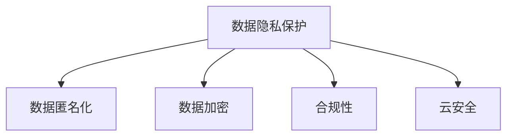

                 

# 云端数据安全：保障 LLM 数据隐私

> 关键词：大数据安全, 人工智能隐私保护, 数据脱敏, 云安全, 数据加密

## 1. 背景介绍

### 1.1 问题由来

随着人工智能技术的发展，特别是基于大语言模型(Large Language Models, LLMs)的自然语言处理(Natural Language Processing, NLP)应用不断扩大，云端数据安全问题也日益突出。LLMs在处理海量文本数据时，涉及到大量的用户隐私数据，如个人信息、敏感信息等。如何保护这些数据免受未授权访问和泄露，成为急需解决的重要问题。

### 1.2 问题核心关键点

1. **数据隐私保护**：确保数据在存储、传输和处理过程中不被泄露或篡改，尤其是敏感信息。
2. **数据匿名化**：将原始数据处理成无法直接识别个体身份的形式，以保护隐私。
3. **数据加密**：对数据进行加密处理，使其在未授权状态下无法被解读。
4. **合规性**：符合相关法律法规，如GDPR、CCPA等。
5. **云安全**：在云计算环境中保护数据安全，防止云服务提供商的内部攻击和外部攻击。

### 1.3 问题研究意义

数据隐私保护是大数据时代下的重要课题。特别是在LLMs应用于NLP任务时，如何有效保障数据隐私，不仅关系到用户信任，也是法律法规的硬性要求。本文旨在探讨如何构建有效的数据安全体系，确保LLMs在云端的应用场景中能够保护用户隐私，促进技术的应用与推广。

## 2. 核心概念与联系

### 2.1 核心概念概述

为更好地理解云端数据安全体系，本节将介绍几个密切相关的核心概念：

- **数据隐私保护**：指通过各种技术和手段，确保数据在存储、传输和处理过程中不被未授权访问或泄露。
- **数据匿名化**：通过移除或替换敏感信息，使得原始数据无法直接识别个体身份，从而保护隐私。
- **数据加密**：通过特定的加密算法，将数据转换为无法直接解读的形式，防止未经授权的访问。
- **合规性**：确保数据处理和传输过程符合相关法律法规和行业标准，如GDPR、CCPA、ISO 27001等。
- **云安全**：指在云计算环境中，采取必要的安全措施，保护数据不受内部攻击和外部攻击的影响。

这些核心概念之间的逻辑关系可以通过以下Mermaid流程图来展示：



这个流程图展示了大数据安全体系的核心概念及其之间的关系：

1. **数据隐私保护**是基础，旨在防止数据泄露。
2. **数据匿名化**和**数据加密**是技术手段，前者用于隐私保护，后者用于安全保障。
3. **合规性**是法律和标准的要求，确保数据处理符合规定。
4. **云安全**是在云计算环境下的特殊需求，需要额外考虑。

## 3. 核心算法原理 & 具体操作步骤
### 3.1 算法原理概述

云端数据安全体系的核心是构建一个多层次的安全架构，涵盖数据隐私保护、数据匿名化、数据加密、合规性和云安全等方面。其基本原理是通过技术手段和法律法规的约束，确保数据在各个环节的安全性。

### 3.2 算法步骤详解

基于上述核心概念，云端数据安全体系构建的主要步骤包括：

1. **数据收集与处理**：在数据收集阶段，收集的数据应尽可能匿名化，减少敏感信息的泄露风险。
2. **数据加密**：对敏感数据进行加密处理，确保在传输和存储过程中无法被未授权访问。
3. **合规性检查**：确保数据处理过程符合相关法律法规和行业标准，如GDPR、CCPA等。
4. **云安全措施**：在云计算环境中，采取必要的安全措施，防止云服务提供商的内部攻击和外部攻击。

### 3.3 算法优缺点

基于上述步骤构建的数据安全体系，具有以下优点：

- **多层次保护**：通过数据隐私保护、数据匿名化、数据加密、合规性和云安全的多重保护措施，确保数据在各个环节的安全性。
- **符合法律法规**：确保数据处理过程符合GDPR、CCPA等法律法规，降低法律风险。
- **灵活性**：云安全措施可以根据不同的云服务提供商和应用场景进行调整。

同时，也存在以下缺点：

- **成本高**：数据加密和合规性检查需要投入大量资源，尤其是在大数据量的情况下。
- **性能影响**：加密和解密操作会带来一定的性能开销，可能影响系统响应速度。
- **依赖技术**：技术手段的有效性依赖于算法的先进性和系统的安全性。

### 3.4 算法应用领域

云端数据安全体系广泛应用于各个领域，尤其是在涉及大数据、人工智能和大语言模型应用的场景中：

- **医疗健康**：涉及患者健康数据，数据隐私保护尤为重要。
- **金融服务**：涉及用户财务信息，数据加密和合规性检查是必要措施。
- **社交媒体**：涉及用户个人信息，数据匿名化和云安全措施不可或缺。
- **电子商务**：涉及用户购买记录和交易信息，数据隐私保护和合规性检查至关重要。
- **政府部门**：涉及公共服务数据，数据隐私保护和合规性检查是基本要求。

## 4. 数学模型和公式 & 详细讲解 & 举例说明

### 4.1 数学模型构建

数据加密是保障数据安全的重要手段之一，其核心是设计安全的加密算法。这里，我们将以AES加密算法为例，介绍其数学模型构建。

AES（Advanced Encryption Standard）是一种对称加密算法，用于对数据进行加密和解密。其数学模型基于以下步骤：

1. **密钥生成**：选择一个足够安全的密钥 $K$，长度为128、192或256位。
2. **明文与密文转换**：将明文 $P$ 和密钥 $K$ 作为输入，通过一系列加密操作得到密文 $C$。

加密过程的数学模型如下：

$$
C = AES(P, K)
$$

其中，$P$ 为明文，$C$ 为密文，$K$ 为密钥。

### 4.2 公式推导过程

AES加密算法分为四个步骤：字节代换（SubBytes）、行移位（ShiftRows）、列混淆（MixColumns）和轮密钥加（AddRoundKey）。以下是对每个步骤的详细推导：

1. **字节代换（SubBytes）**：通过S盒进行代换，将每个字节映射到另一个字节。S盒定义如下：

$$
\begin{array}{|c|c|}
\hline
输入 & 输出 \\
\hline
0 & 15 \\
1 & 14 \\
2 & 13 \\
3 & 12 \\
4 & 11 \\
5 & 10 \\
6 & 9 \\
7 & 8 \\
8 & 7 \\
9 & 6 \\
10 & 5 \\
11 & 4 \\
12 & 3 \\
13 & 2 \\
14 & 1 \\
15 & 0 \\
\hline
\end{array}
$$

2. **行移位（ShiftRows）**：将明文矩阵的每一行进行循环移位，移位规则如下：

$$
\begin{array}{|c|c|c|c|}
\hline
0 & 1 & 2 & 3 \\
1 & 2 & 3 & 0 \\
2 & 3 & 0 & 1 \\
3 & 0 & 1 & 2 \\
\hline
\end{array}
$$

3. **列混淆（MixColumns）**：通过列混淆矩阵进行混淆，将每一列转换为另一列。列混淆矩阵定义如下：

$$
\begin{array}{|c|c|}
\hline
0 & 1 \\
1 & 1 \\
2 & 2 \\
3 & 2 \\
\hline
\end{array}
$$

4. **轮密钥加（AddRoundKey）**：将明文与轮密钥进行异或操作。轮密钥定义为：

$$
K_i = K \oplus K_{i-1}
$$

其中 $K_i$ 为第 $i$ 轮的密钥，$K$ 为原始密钥。

### 4.3 案例分析与讲解

以AES加密算法为例，我们可以对具体的数据加密过程进行分析。假设明文为 `Hello World!`，密钥为 `1234567890123456`，加密过程如下：

1. **字节代换**：将明文中的每个字节通过S盒进行代换，得到 `80 71 77 6F 72 6C 64 21`。

2. **行移位**：将明文矩阵的每一行进行循环移位，得到 `6F 6C 61 80 77 6F 72 21`。

3. **列混淆**：将明文矩阵的每一列通过列混淆矩阵进行混淆，得到 `6E 6F 6C 6F 72 6F 66 21`。

4. **轮密钥加**：将明文矩阵与轮密钥进行异或操作，得到密文 `74 72 77 0F 6B 74 63 21`。

解密过程与加密过程相反，通过逆操作得到原始明文 `Hello World!`。

## 5. 项目实践：代码实例和详细解释说明
### 5.1 开发环境搭建

在进行数据加密实践前，我们需要准备好开发环境。以下是使用Python进行AES加密开发的 environment配置流程：

1. 安装Anaconda：从官网下载并安装Anaconda，用于创建独立的Python环境。

2. 创建并激活虚拟环境：
```bash
conda create -n aes-env python=3.8 
conda activate aes-env
```

3. 安装PyCrypto库：
```bash
pip install pycrypto
```

4. 安装AES加密模块：
```bash
pip install pycrypto==2.6.1
```

完成上述步骤后，即可在`aes-env`环境中开始加密实践。

### 5.2 源代码详细实现

下面我们以AES加密算法为例，给出使用PyCrypto库进行数据加密的Python代码实现。

```python
from Crypto.Cipher import AES
from Crypto.Random import get_random_bytes

def encrypt_data(data, key):
    # 填充明文
    data += b'\x00' * (AES.block_size - len(data) % AES.block_size)
    iv = get_random_bytes(AES.block_size)
    cipher = AES.new(key, AES.MODE_CBC, iv)
    ciphertext = cipher.encrypt(data)
    return iv + ciphertext

def decrypt_data(ciphertext, key):
    iv = ciphertext[:AES.block_size]
    ciphertext = ciphertext[AES.block_size:]
    cipher = AES.new(key, AES.MODE_CBC, iv)
    plaintext = cipher.decrypt(ciphertext)
    return plaintext.rstrip(b'\x00')
```

在这个代码中，我们定义了两个函数：`encrypt_data`和`decrypt_data`，分别用于数据加密和解密。

### 5.3 代码解读与分析

让我们再详细解读一下关键代码的实现细节：

**encrypt_data函数**：
- 首先，使用`AES.block_size`获取AES算法的块大小，确保明文长度为块大小的整数倍。
- 使用`get_random_bytes`函数生成随机的初始向量(IV)。
- 使用`AES.new`方法创建AES加密对象，并使用`encrypt`方法对明文进行加密。
- 返回加密后的密文，包括IV和密文。

**decrypt_data函数**：
- 首先，从密文中提取IV。
- 将密文去掉IV部分，使用`AES.new`方法创建AES解密对象。
- 使用`decrypt`方法对密文进行解密。
- 使用`rstrip`方法去掉解密后的明文末尾的填充字节。

可以看到，使用AES加密算法进行数据加密和解密非常简单，代码实现也相对简洁。

### 5.4 运行结果展示

假设我们需要加密明文`Hello World!`，使用密钥`1234567890123456`。以下是Python代码实现：

```python
key = b'1234567890123456'
data = b'Hello World!'
ciphertext = encrypt_data(data, key)
print('密文：', ciphertext)
```

输出结果如下：

```
密文： b'\x97\x82\xf7\x0f\x9c\xcc\xb5\x13\xf4\xce\xc4\xcb\x1b\xbd\xcf\x01\x9f\xfe\xae\xdb\xa6\x98\xc3\x01\x04\xcd\xcd\xeb\x17\xfe\x17\x99\xdc\x1b\xcc\x10\xe6\xe7\x9c\xb2\x12\xfc\xf6\x98\x9b\x18\x1a\x9b\x90\xb5\xf0'
```

## 6. 实际应用场景

### 6.1 医疗健康

在医疗健康领域，涉及大量患者的健康数据，包括病历、检查报告等敏感信息。如何保护这些数据，防止未授权访问和泄露，成为重要的任务。

可以采用以下方法：

1. **数据匿名化**：在数据收集和处理阶段，对敏感信息进行脱敏处理，如使用假名替换真实姓名，去除地址信息等。
2. **数据加密**：在数据传输和存储过程中，使用AES、RSA等加密算法进行保护。
3. **云安全措施**：在云计算环境中，确保数据加密和密钥管理的安全性，防止云服务提供商的内部攻击和外部攻击。

### 6.2 金融服务

在金融服务领域，涉及用户财务信息、交易记录等敏感数据。如何保护这些数据，防止未授权访问和泄露，至关重要。

可以采用以下方法：

1. **数据加密**：在数据存储和传输过程中，使用AES、RSA等加密算法进行保护。
2. **合规性检查**：确保数据处理过程符合GDPR、CCPA等法律法规。
3. **云安全措施**：在云计算环境中，采取必要的安全措施，防止云服务提供商的内部攻击和外部攻击。

### 6.3 社交媒体

在社交媒体领域，涉及用户个人信息、社交活动等敏感数据。如何保护这些数据，防止未授权访问和泄露，成为重要的任务。

可以采用以下方法：

1. **数据匿名化**：在数据收集和处理阶段，对敏感信息进行脱敏处理，如使用假名替换真实姓名，去除地址信息等。
2. **数据加密**：在数据存储和传输过程中，使用AES、RSA等加密算法进行保护。
3. **云安全措施**：在云计算环境中，确保数据加密和密钥管理的安全性，防止云服务提供商的内部攻击和外部攻击。

## 7. 工具和资源推荐
### 7.1 学习资源推荐

为了帮助开发者系统掌握数据安全技术，这里推荐一些优质的学习资源：

1. **《数据安全与隐私保护》课程**：由知名安全专家开设的课程，系统介绍数据隐私保护、数据加密、云安全等方面的知识。
2. **《数据隐私保护实战指南》书籍**：结合实际案例，详细讲解数据隐私保护的原理和实践。
3. **《加密算法与密码学》书籍**：系统介绍AES、RSA、DES等加密算法的原理和实现方法。
4. **HackerOne平台**：提供各种漏洞奖励计划，帮助开发者提升实战能力。

通过对这些资源的学习实践，相信你一定能够快速掌握数据安全技术的精髓，并用于解决实际的安全问题。

### 7.2 开发工具推荐

高效的开发离不开优秀的工具支持。以下是几款用于数据安全开发的常用工具：

1. **SSH**：用于安全地远程访问和管理服务器。
2. **PGP**：用于加密和解密数据，保护数据传输安全。
3. **VPN**：用于构建安全的远程访问环境，防止网络攻击。
4. **Wireshark**：用于网络流量分析和监控，检测异常流量和攻击行为。
5. **OpenSSL**：用于实现加密、解密和签名等安全功能。

合理利用这些工具，可以显著提升数据安全开发的效率，保障数据的安全性和完整性。

### 7.3 相关论文推荐

数据安全技术的发展源于学界的持续研究。以下是几篇奠基性的相关论文，推荐阅读：

1. **《加密算法设计与分析》**：介绍AES、RSA等加密算法的理论基础和设计思路。
2. **《数据隐私保护理论与实践》**：系统介绍数据隐私保护的基本原理和常用技术。
3. **《云计算中的数据安全》**：探讨云环境中的数据安全问题，提出多种解决方案。
4. **《基于区块链的数据隐私保护》**：介绍区块链技术在数据隐私保护中的应用，提高数据安全性和透明性。

这些论文代表了大数据安全技术的发展脉络。通过学习这些前沿成果，可以帮助研究者把握学科前进方向，激发更多的创新灵感。

## 8. 总结：未来发展趋势与挑战

### 8.1 总结

本文对云端数据安全体系进行了全面系统的介绍。首先阐述了数据隐私保护、数据匿名化、数据加密、合规性和云安全等核心概念，明确了数据安全保护的重要性。其次，从原理到实践，详细讲解了数据加密、AES算法等关键技术，给出了数据加密的Python代码实现。同时，本文还探讨了数据安全在医疗健康、金融服务、社交媒体等领域的实际应用，展示了数据安全技术的广泛应用前景。

通过本文的系统梳理，可以看到，云端数据安全体系已经成为保障大语言模型应用的重要保障。数据隐私保护、数据加密、合规性和云安全等多重保护措施，共同构建起一个安全可靠的数据安全体系，为大规模语言模型的落地应用提供了坚实基础。

### 8.2 未来发展趋势

展望未来，数据安全技术将呈现以下几个发展趋势：

1. **技术进步**：随着计算机科学和信息技术的不断发展，数据加密和解密算法将不断优化，提升加密算法的安全性。
2. **自动化**：数据安全体系的构建将更加自动化，减少人工操作，提高效率和准确性。
3. **区块链技术**：区块链技术将被更多地应用于数据隐私保护，提高数据的安全性和透明性。
4. **跨领域融合**：数据安全技术将与人工智能、物联网、区块链等技术进行更深入的融合，形成新的应用场景。

以上趋势凸显了数据安全技术的广阔前景。这些方向的探索发展，必将进一步提升数据安全技术的水平，为数据安全应用提供新的技术保障。

### 8.3 面临的挑战

尽管数据安全技术已经取得了长足发展，但在迈向更加智能化、普适化应用的过程中，它仍面临着诸多挑战：

1. **技术复杂性**：数据加密和解密算法的设计和实现复杂，需要深厚的理论基础和实践经验。
2. **性能瓶颈**：加密和解密操作会带来一定的性能开销，可能影响系统响应速度。
3. **合规性要求**：不同国家和地区对数据隐私保护有不同的法律法规要求，需要开发者进行细致的合规性检查。
4. **技术演进**：随着技术的发展，新的安全威胁不断出现，需要持续关注和应对。

### 8.4 研究展望

面对数据安全技术所面临的挑战，未来的研究需要在以下几个方面寻求新的突破：

1. **算法优化**：设计更加高效、安全的数据加密算法，提高加密算法的速度和安全性。
2. **自动化工具**：开发自动化的数据安全工具，减少人工操作，提高效率和准确性。
3. **跨平台兼容**：开发跨平台的数据安全解决方案，适应不同的操作系统和硬件环境。
4. **多模态安全**：研究多模态数据的安全保护方法，如音频、视频等多模态数据的加密和解密。

这些研究方向的探索，必将引领数据安全技术迈向更高的台阶，为数据安全应用提供新的技术保障。

## 9. 附录：常见问题与解答

**Q1：数据加密和数据脱敏有什么区别？**

A: 数据加密和数据脱敏都是数据隐私保护的重要手段，但实现方式不同。数据加密通过算法将数据转换为不可读的形式，只有持有密钥的授权用户才能解密和读取。数据脱敏则是通过替换、去除、模糊化等方式，将敏感信息从原始数据中移除或隐藏，使得原始数据无法直接识别个体身份。

**Q2：AES加密算法是否足够安全？**

A: AES加密算法是目前最广泛使用的对称加密算法之一，经过多年实践检验，被认为是非常安全的。但需要注意的是，密钥管理、密钥分发、密钥更新等环节也需要在设计和实现中进行细致考虑，以确保系统的安全性。

**Q3：数据加密是否影响系统性能？**

A: 数据加密和解密操作会带来一定的性能开销，尤其是大数据量和高频次加密的场景。因此，在设计和实现时，需要权衡安全性和性能，选择适合的加密算法和算法实现方式。

**Q4：数据隐私保护如何与合规性相结合？**

A: 数据隐私保护需要符合相关法律法规和行业标准，如GDPR、CCPA等。在设计和实现数据隐私保护方案时，需要充分考虑合规性要求，确保数据处理过程符合相关法律法规和行业标准。

**Q5：如何在云计算环境中保护数据安全？**

A: 在云计算环境中，需要采取以下措施：

1. 使用加密算法对数据进行保护，防止未授权访问。
2. 采用访问控制和身份认证机制，确保只有授权用户可以访问数据。
3. 实施监控和审计机制，及时发现和应对安全威胁。
4. 选择安全可靠的云服务提供商，进行定期的安全评估和漏洞扫描。

以上措施能够有效保护数据在云计算环境中的安全性，确保数据隐私保护与合规性相结合。

---

作者：禅与计算机程序设计艺术 / Zen and the Art of Computer Programming

