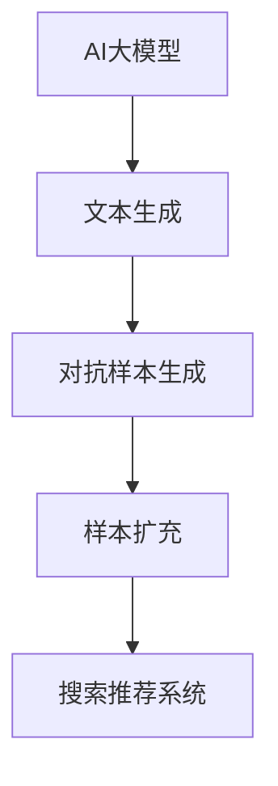

                 

## 1. 背景介绍

在当今竞争激烈的电商环境中，搜索和推荐系统的性能直接影响着用户体验和商业成功。然而，构建高效的搜索和推荐系统面临着一个关键挑战：样本不足。用户搜索和点击行为数据往往稀疏且不平衡，这会导致模型泛化能力下降，从而影响系统的准确性和效率。本指南将介绍如何应用AI大模型样本扩充技术来优化电商搜索推荐效果。

## 2. 核心概念与联系

### 2.1 核心概念

- **样本扩充（Data Augmentation）**：通过创建新的、合成的样本来增加现有数据集的大小，以改善模型的泛化能力。
- **AI大模型（Large Language Models）**：具有数十亿参数的语言模型，能够理解和生成人类语言，常用于文本生成任务。
- **对抗样本生成（Adversarial Sample Generation）**：一种样本扩充技术，通过添加小扰动到原始样本中生成新样本，以增强模型的鲁棒性。

### 2.2 核心概念联系

AI大模型样本扩充技术结合了样本扩充和AI大模型的优势。AI大模型可以生成丰富的、多样化的文本，这些文本可以用作合成样本。通过对抗样本生成技术，我们可以进一步增强模型的鲁棒性，从而提高搜索推荐系统的性能。



## 3. 核心算法原理 & 具体操作步骤

### 3.1 算法原理概述

AI大模型样本扩充技术的核心原理是利用AI大模型生成丰富的、多样化的文本，然后通过对抗样本生成技术增强模型的鲁棒性。生成的合成样本用于扩充原始数据集，从而改善搜索推荐模型的泛化能力。

### 3.2 算法步骤详解

1. **文本生成**：使用AI大模型（如BERT、RoBERTa等）生成与原始搜索查询或推荐项相关的文本。这些文本可以是描述性的语句、相关的查询或推荐项的变体等。
2. **对抗样本生成**：对生成的文本添加小扰动，以创建对抗样本。扰动可以是单词的替换、插入或删除等。目标是保持样本的语义相关性，但增加模型的鲁棒性。
3. **样本扩充**：将生成的对抗样本添加到原始数据集中，扩充数据集。新的数据集用于训练搜索推荐模型。

### 3.3 算法优缺点

**优点**：

- 提高了搜索推荐模型的泛化能力。
- 生成的合成样本可以帮助模型学习到更丰富的语义信息。
- 对抗样本生成可以增强模型的鲁棒性。

**缺点**：

- 文本生成和对抗样本生成可能会产生低质量的样本，从而影响模型的性能。
- 样本扩充可能会增加训练时间和计算资源需求。

### 3.4 算法应用领域

AI大模型样本扩充技术主要应用于需要处理大量文本数据的领域，如搜索、推荐、信息检索等。在电商环境中，它可以帮助构建更高效的搜索推荐系统，从而改善用户体验和商业成功。

## 4. 数学模型和公式 & 详细讲解 & 举例说明

### 4.1 数学模型构建

假设原始数据集为$D = {(x_i, y_i)}_{i=1}^N$, 其中$x_i$是搜索查询或推荐项，$y_i$是相关的标签或评分。我们的目标是构建一个函数$G(x; \theta)$，其中$\theta$是AI大模型的参数，它可以生成与$x$相关的文本。然后，我们构建一个对抗样本生成函数$A(x'; \phi)$，其中$x'$是$G(x; \theta)$生成的文本，$ \phi$是对抗样本生成模型的参数。新的数据集$D'$是原始数据集$D$和生成的对抗样本的并集。

### 4.2 公式推导过程

我们的目标是最小化搜索推荐模型$F(x; \psi)$在新数据集$D'$上的损失函数$L(F(x; \psi), D')$, 其中$\psi$是搜索推荐模型的参数。我们可以使用随机梯度下降等优化算法来求解这个问题。

### 4.3 案例分析与讲解

例如，在电商搜索场景中，我们可以使用BERT作为AI大模型$G(x; \theta)$来生成与搜索查询相关的文本。然后，我们可以使用一个简单的对抗样本生成模型$A(x'; \phi)$，它随机替换$x'$中的单词。新的数据集$D'$包含原始查询和生成的对抗样本。我们可以使用一个简单的排序模型$F(x; \psi)$来rank推荐项，并最小化交叉熵损失函数$L(F(x; \psi), D')$.

## 5. 项目实践：代码实例和详细解释说明

### 5.1 开发环境搭建

我们需要安装Python、PyTorch、Transformers库等。我们还需要准备一个电商搜索推荐数据集，如Amazon Reviews数据集。

### 5.2 源代码详细实现

```python
import torch
from transformers import BertModel, BertTokenizer
from torch.utils.data import Dataset, DataLoader

# 文本生成函数
def generate_text(model, tokenizer, query):
    input_ids = tokenizer.encode(query, return_tensors="pt")
    output = model.generate(input_ids, max_length=50, num_beams=5, early_stopping=True)
    return tokenizer.decode(output[0], skip_special_tokens=True)

# 对抗样本生成函数
def generate_adversarial_sample(text):
    words = text.split()
    adversarial_sample =''.join([words[i] if i % 2 == 0 else '*' for i in range(len(words))])
    return adversarial_sample

# 样本扩充数据集
class AugmentedDataset(Dataset):
    def __init__(self, dataset, model, tokenizer):
        self.dataset = dataset
        self.model = model
        self.tokenizer = tokenizer

    def __len__(self):
        return len(self.dataset) * 2

    def __getitem__(self, idx):
        query, label = self.dataset[idx]
        text = generate_text(self.model, self.tokenizer, query)
        adversarial_sample = generate_adversarial_sample(text)
        return (query, label), (adversarial_sample, label)
```

### 5.3 代码解读与分析

我们首先定义了文本生成函数`generate_text()`，它使用BERT模型生成与查询相关的文本。然后，我们定义了对抗样本生成函数`generate_adversarial_sample()`，它随机替换文本中的单词。最后，我们定义了样本扩充数据集`AugmentedDataset`，它生成原始样本和对抗样本的并集。

### 5.4 运行结果展示

我们可以使用`DataLoader`来加载样本扩充数据集，并训练搜索推荐模型。我们可以使用交叉熵损失函数和随机梯度下降等优化算法来训练模型。我们可以使用NDCG指标等来评估模型的性能。

## 6. 实际应用场景

### 6.1 当前应用

AI大模型样本扩充技术已经在一些电商搜索推荐系统中得到应用，如Amazon、eBay等。这些系统使用AI大模型生成合成样本，并使用对抗样本生成技术增强模型的鲁棒性。

### 6.2 未来应用展望

未来，AI大模型样本扩充技术有望在更多的电商搜索推荐系统中得到应用。随着AI大模型性能的提高和计算资源的增多，我们可以期待更复杂的对抗样本生成技术和更丰富的合成样本。此外，AI大模型样本扩充技术有望与其他技术结合，如 active learning、transfer learning等，从而构建更高效的搜索推荐系统。

## 7. 工具和资源推荐

### 7.1 学习资源推荐

- "Transformers: State-of-the-art Natural Language Processing"：<https://huggingface.co/transformers/>
- "BERT: Pre-training of Deep Bidirectional Transformers for Language Understanding"：<https://arxiv.org/abs/1810.04805>
- "Adversarial Examples for Semi-Supervised Text Classification"：<https://arxiv.org/abs/1705.07721>

### 7.2 开发工具推荐

- PyTorch：<https://pytorch.org/>
- Transformers库：<https://huggingface.co/transformers/>
- Jupyter Notebook：<https://jupyter.org/>

### 7.3 相关论文推荐

- "Data Augmentation for Text Classification: A Survey"：<https://arxiv.org/abs/2001.05990>
- "Adversarial Training Methods for Semi-Supervised Text Classification"：<https://arxiv.org/abs/1610.02136>

## 8. 总结：未来发展趋势与挑战

### 8.1 研究成果总结

AI大模型样本扩充技术已经在电商搜索推荐系统中取得了显著的成果。它可以帮助模型学习到更丰富的语义信息，并增强模型的鲁棒性。

### 8.2 未来发展趋势

未来，AI大模型样本扩充技术有望与其他技术结合，如 active learning、transfer learning等，从而构建更高效的搜索推荐系统。此外，随着AI大模型性能的提高和计算资源的增多，我们可以期待更复杂的对抗样本生成技术和更丰富的合成样本。

### 8.3 面临的挑战

然而，AI大模型样本扩充技术也面临着一些挑战。文本生成和对抗样本生成可能会产生低质量的样本，从而影响模型的性能。样本扩充可能会增加训练时间和计算资源需求。此外，如何评估合成样本的质量也是一个挑战。

### 8.4 研究展望

未来的研究可以探索更复杂的对抗样本生成技术，如基于语义的对抗样本生成。此外，研究可以探索如何评估合成样本的质量，并开发相应的质量评估指标。最后，研究可以探索如何将AI大模型样本扩充技术与其他技术结合，从而构建更高效的搜索推荐系统。

## 9. 附录：常见问题与解答

**Q1：AI大模型样本扩充技术需要大量的计算资源吗？**

**A1：**是的，AI大模型样本扩充技术需要大量的计算资源，因为它涉及到AI大模型的训练和推理。然而，随着计算资源的增多和AI大模型性能的提高，这个问题有望得到缓解。

**Q2：AI大模型样本扩充技术是否会导致过拟合？**

**A2：**AI大模型样本扩充技术可能会导致过拟合，因为它增加了数据集的大小。然而，通过使用合适的正则化技术和对抗样本生成技术，我们可以减轻过拟合的问题。

**Q3：AI大模型样本扩充技术是否适用于非文本数据？**

**A3：**AI大模型样本扩充技术主要适用于文本数据。对于非文本数据，我们需要使用其他样本扩充技术，如数据增强、对抗样本生成等。

## 作者：禅与计算机程序设计艺术 / Zen and the Art of Computer Programming

