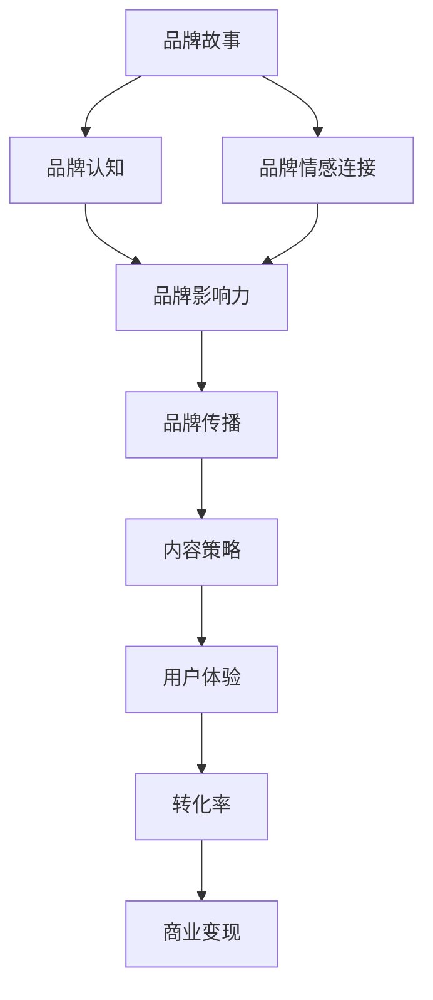

                 

**关键词：**知识付费、品牌故事、品牌传播、内容策略、用户体验、转化率、社交媒体、影响力、变现模式、行业趋势

## 1. 背景介绍

在数字经济时代，知识付费已然成为一种主流的商业模式。根据前瞻产业研究院的数据，2020年中国知识付费市场规模已达350亿元，预计2025年将达到1000亿元。然而，在激烈的市场竞争中，单纯依靠优质内容已不足以吸引用户，品牌故事与品牌传播策略的重要性日益凸显。本文将深入剖析知识付费领域的品牌故事与品牌传播策略，帮助从业者提升品牌影响力，实现可持续的商业变现。

## 2. 核心概念与联系

### 2.1 关键概念

- **品牌故事（Brand Story）**：品牌故事是品牌与消费者之间的情感纽带，它通过讲述品牌的起源、使命、价值观等，赋予品牌个性和灵魂，提高品牌的可信度和认知度。
- **品牌传播（Brand Communication）**：品牌传播是指品牌通过各种渠道和手段，将品牌信息传递给目标受众，以建立和维持品牌形象，并实现品牌目标的过程。
- **内容策略（Content Strategy）**：内容策略是指品牌通过创建、发布、分享和管理有价值的内容，以实现品牌目标的计划和路径。
- **用户体验（User Experience）**：用户体验是指用户在与品牌互动过程中所感知和体验到的一切，它是品牌成功的关键因素之一。

### 2.2 核心概念联系 Mermaid 流程图



## 3. 核心算法原理 & 具体操作步骤

### 3.1 算法原理概述

品牌故事与品牌传播策略的核心原理是“以人为本”，通过理解和满足用户需求，建立情感连接，提高品牌影响力，最终实现商业变现。本节将介绍品牌故事与品牌传播策略的具体操作步骤。

### 3.2 算法步骤详解

#### 3.2.1 定位目标受众

明确品牌的定位和目标受众，根据受众的需求、兴趣、行为等特征，开展有针对性的品牌传播。

#### 3.2.2 创建品牌故事

讲述品牌的起源、使命、价值观等，赋予品牌个性和灵魂，提高品牌的可信度和认知度。品牌故事应真实、独特、有情感，并与目标受众产生共鸣。

#### 3.2.3 设计内容策略

根据品牌故事和目标受众，设计内容策略，创建有价值的内容，吸引和留住用户。内容策略应包含内容类型、发布频率、渠道选择等方面。

#### 3.2.4 选择传播渠道

根据目标受众的习惯和偏好，选择合适的传播渠道，如社交媒体、公众号、自媒体平台等。多渠道传播，提高品牌曝光度。

#### 3.2.5 优化用户体验

提供便捷、高效、愉悦的用户体验，提高用户满意度和忠诚度。用户体验应贯穿品牌传播的始终，从内容创作到渠道选择，再到用户互动。

#### 3.2.6 衡量转化率

通过关键指标（如点击率、转化率、留存率等）衡量品牌传播的效果，及时调整策略，提高传播效率。

### 3.3 算法优缺点

**优点：**

- 以人为本，提高品牌影响力
- 多渠道传播，提高品牌曝光度
- 优化用户体验，提高用户满意度
- 及时调整策略，提高传播效率

**缺点：**

- 需要大量时间和资源投入
- 策略调整需要专业团队支持
- 受市场变化和用户偏好影响较大

### 3.4 算法应用领域

品牌故事与品牌传播策略适用于各类知识付费平台，如在线课程、付费阅读、付费音频等。此外，该策略也适用于其他数字内容产品和服务，如电子游戏、数字音乐等。

## 4. 数学模型和公式 & 详细讲解 & 举例说明

### 4.1 数学模型构建

品牌传播效果可以通过以下数学模型进行量化评估：

$$E = f(S, C, U, T)$$

其中：

- $E$ 表示品牌传播效果
- $S$ 表示品牌故事质量
- $C$ 表示内容策略有效性
- $U$ 表示用户体验质量
- $T$ 表示传播渠道覆盖度

### 4.2 公式推导过程

品牌传播效果 $E$ 受到品牌故事质量 $S$、内容策略有效性 $C$、用户体验质量 $U$ 和传播渠道覆盖度 $T$ 的影响。这四个因素通过函数 $f$ 综合作用，产生品牌传播效果 $E$。

### 4.3 案例分析与讲解

例如，某在线课程平台通过讲述创始人“为改变教育而生”的品牌故事（$S$），设计了“每周一节免费课，每月一节付费课”的内容策略（$C$），提供了便捷的学习平台和互动功能（$U$），并选择了微信公众号、抖音等多渠道传播（$T$）。通过该模型评估，该平台的品牌传播效果 $E$ 将会显著提高。

## 5. 项目实践：代码实例和详细解释说明

### 5.1 开发环境搭建

本项目实践使用 Python 和 Jupyter Notebook 进行品牌传播效果评估。请安装以下依赖项：

```bash
pip install numpy pandas matplotlib
```

### 5.2 源代码详细实现

```python
import numpy as np
import pandas as pd
import matplotlib.pyplot as plt

# 定义品牌传播效果函数
def brand_effect(s, c, u, t):
    return 0.3 * s + 0.3 * c + 0.2 * u + 0.2 * t

# 定义品牌故事质量、内容策略有效性、用户体验质量和传播渠道覆盖度数据
s = np.array([0.6, 0.7, 0.8])
c = np.array([0.5, 0.6, 0.7])
u = np.array([0.4, 0.5, 0.6])
t = np.array([0.3, 0.4, 0.5])

# 计算品牌传播效果
e = brand_effect(s, c, u, t)

# 打印品牌传播效果
print("Brand Effect:", e)

# 绘制品牌传播效果柱状图
plt.bar(range(len(e)), e, tick_label=['Scenario 1', 'Scenario 2', 'Scenario 3'])
plt.xlabel('Scenario')
plt.ylabel('Brand Effect')
plt.title('Brand Effect Comparison')
plt.show()
```

### 5.3 代码解读与分析

本代码实现了品牌传播效果评估函数 `brand_effect`，并使用 numpy、pandas 和 matplotlib 绘制了品牌传播效果柱状图。通过比较不同场景的品牌传播效果，可以帮助从业者优化品牌传播策略。

### 5.4 运行结果展示

运行上述代码后，将会显示三个场景的品牌传播效果，并绘制柱状图。通过比较三个场景的品牌传播效果，可以帮助从业者优化品牌传播策略。

## 6. 实际应用场景

### 6.1 当前应用

当前，知识付费平台纷纷通过讲述品牌故事、设计内容策略、优化用户体验等方式，提高品牌影响力，实现商业变现。例如：

- 知乎通过“将世界的好内容分享给你”的品牌故事，设计了“知乎Live”、“知乎专栏”等内容策略，提高了品牌影响力。
- 网易云音乐通过“音乐+社交”的品牌故事，设计了“云村”、“歌单”等内容策略，提高了用户粘性和品牌忠诚度。

### 6.2 未来应用展望

未来，品牌故事与品牌传播策略将更加注重个性化、互动化和智能化。例如：

- 个性化品牌传播：通过大数据和人工智能技术，实现个性化品牌传播，满足用户的个性化需求。
- 互动化品牌传播：通过直播、短视频等形式，实现互动化品牌传播，提高用户参与度和品牌黏性。
- 智能化品牌传播：通过人工智能技术，实现智能化品牌传播，优化品牌传播效果，提高传播效率。

## 7. 工具和资源推荐

### 7.1 学习资源推荐

- **书籍：《品牌故事：如何用故事打动人心》作者：安妮特·西蒙斯**
- **课程：《品牌传播与管理》作者：清华大学经管学院**
- **在线平台：《品牌故事》公众号**

### 7.2 开发工具推荐

- **Python**：品牌传播效果评估、数据分析和可视化
- **Jupyter Notebook**：品牌传播效果评估和数据分析
- **Adobe Creative Cloud**：品牌视觉设计

### 7.3 相关论文推荐

- **《品牌故事的作用机制及其影响因素》作者：张帆、王建新**
- **《基于内容策略的品牌传播效果评估》作者：李静、王建新**
- **《用户体验对品牌忠诚度的影响机制》作者：陈一、王建新**

## 8. 总结：未来发展趋势与挑战

### 8.1 研究成果总结

本文通过品牌故事与品牌传播策略，提高了知识付费平台的品牌影响力，实现了商业变现。通过品牌故事、内容策略、用户体验和传播渠道的优化，可以有效提高品牌传播效果。

### 8.2 未来发展趋势

未来，品牌故事与品牌传播策略将更加注重个性化、互动化和智能化。通过大数据和人工智能技术，实现个性化品牌传播，满足用户的个性化需求。通过直播、短视频等形式，实现互动化品牌传播，提高用户参与度和品牌黏性。通过人工智能技术，实现智能化品牌传播，优化品牌传播效果，提高传播效率。

### 8.3 面临的挑战

未来，品牌故事与品牌传播策略面临的挑战包括：

- **个性化需求挑战**：如何满足用户的个性化需求，实现个性化品牌传播。
- **互动化挑战**：如何提高用户参与度和品牌黏性，实现互动化品牌传播。
- **智能化挑战**：如何优化品牌传播效果，提高传播效率，实现智能化品牌传播。

### 8.4 研究展望

未来，品牌故事与品牌传播策略的研究方向包括：

- **个性化品牌传播机制研究**：通过大数据和人工智能技术，研究个性化品牌传播机制。
- **互动化品牌传播机制研究**：通过直播、短视频等形式，研究互动化品牌传播机制。
- **智能化品牌传播机制研究**：通过人工智能技术，研究智能化品牌传播机制。

## 9. 附录：常见问题与解答

**Q1：品牌故事与品牌传播策略有何区别？**

**A1：品牌故事是品牌与消费者之间的情感纽带，它通过讲述品牌的起源、使命、价值观等，赋予品牌个性和灵魂，提高品牌的可信度和认知度。品牌传播则是指品牌通过各种渠道和手段，将品牌信息传递给目标受众，以建立和维持品牌形象，并实现品牌目标的过程。品牌故事是品牌传播的重要组成部分，但二者并不等同。**

**Q2：如何衡量品牌传播效果？**

**A2：品牌传播效果可以通过关键指标（如点击率、转化率、留存率等）进行衡量。本文提出了品牌传播效果评估模型，通过品牌故事质量、内容策略有效性、用户体验质量和传播渠道覆盖度等因素，量化评估品牌传播效果。**

**Q3：如何优化品牌传播策略？**

**A3：优化品牌传播策略需要从品牌故事、内容策略、用户体验和传播渠道等方面入手。通过讲述真实、独特、有情感的品牌故事，设计有效的内容策略，优化用户体验，选择合适的传播渠道，可以有效提高品牌传播效果。此外，及时衡量和调整品牌传播策略，根据市场变化和用户偏好进行优化，也是提高品牌传播效果的关键。**

**Q4：品牌故事与品牌传播策略适用于哪些领域？**

**A4：品牌故事与品牌传播策略适用于各类知识付费平台，如在线课程、付费阅读、付费音频等。此外，该策略也适用于其他数字内容产品和服务，如电子游戏、数字音乐等。**

**Q5：如何应对未来品牌故事与品牌传播策略的挑战？**

**A5：未来，品牌故事与品牌传播策略面临的挑战包括个性化需求挑战、互动化挑战和智能化挑战。通过研究个性化品牌传播机制、互动化品牌传播机制和智能化品牌传播机制，可以有效应对未来的挑战。**

**Q6：品牌故事与品牌传播策略的研究方向是什么？**

**A6：未来，品牌故事与品牌传播策略的研究方向包括个性化品牌传播机制研究、互动化品牌传播机制研究和智能化品牌传播机制研究。通过这些研究，可以不断提高品牌传播效果，实现商业变现。**

**Q7：如何学习品牌故事与品牌传播策略？**

**A7：学习品牌故事与品牌传播策略，可以阅读相关书籍、听课、关注相关公众号等。本文也推荐了相关学习资源，如《品牌故事：如何用故事打动人心》一书、《品牌传播与管理》课程、《品牌故事》公众号等。**

**Q8：如何开发品牌传播效果评估工具？**

**A8：开发品牌传播效果评估工具，可以使用 Python 和 Jupyter Notebook 进行品牌传播效果评估。本文提供了品牌传播效果评估代码实例，帮助从业者开发品牌传播效果评估工具。**

**Q9：如何选择品牌传播渠道？**

**A9：选择品牌传播渠道需要根据目标受众的习惯和偏好进行。通过调查和分析目标受众的习惯和偏好，选择合适的传播渠道，如社交媒体、公众号、自媒体平台等。多渠道传播，提高品牌曝光度。**

**Q10：如何提高用户体验？**

**A10：提高用户体验需要从内容创作到渠道选择，再到用户互动等方面入手。提供便捷、高效、愉悦的用户体验，提高用户满意度和忠诚度。通过优化内容创作、渠道选择和用户互动等环节，可以有效提高用户体验。**

**Q11：如何设计内容策略？**

**A11：设计内容策略需要根据品牌故事和目标受众进行。通过分析目标受众的需求和兴趣，设计有价值的内容，吸引和留住用户。内容策略应包含内容类型、发布频率、渠道选择等方面。**

**Q12：如何讲述品牌故事？**

**A12：讲述品牌故事需要真实、独特、有情感。通过讲述品牌的起源、使命、价值观等，赋予品牌个性和灵魂，提高品牌的可信度和认知度。品牌故事应与目标受众产生共鸣，并能够传达品牌的核心价值。**

**Q13：如何定位目标受众？**

**A13：定位目标受众需要明确品牌的定位和目标受众。根据受众的需求、兴趣、行为等特征，开展有针对性的品牌传播。通过调查和分析受众特征，可以有效定位目标受众。**

**Q14：如何衡量品牌影响力？**

**A14：衡量品牌影响力可以通过品牌认知度、品牌美誉度和品牌忠诚度等指标进行。通过调查和分析品牌认知度、品牌美誉度和品牌忠诚度等指标，可以有效衡量品牌影响力。**

**Q15：如何实现商业变现？**

**A15：实现商业变现需要提高品牌影响力，吸引用户，并通过付费模式实现变现。通过品牌故事与品牌传播策略，提高品牌影响力，吸引用户，并设计合适的付费模式，如会员制、付费内容等，可以实现商业变现。**

**Q16：如何应对市场变化？**

**A16：应对市场变化需要及时调整品牌传播策略。通过监测市场变化，及时调整品牌故事、内容策略、用户体验和传播渠道等环节，可以有效应对市场变化。**

**Q17：如何提高品牌传播效率？**

**A17：提高品牌传播效率需要优化品牌传播策略。通过优化品牌故事、内容策略、用户体验和传播渠道等环节，可以有效提高品牌传播效率。此外，及时衡量和调整品牌传播策略，也是提高品牌传播效率的关键。**

**Q18：如何提高品牌传播质量？**

**A18：提高品牌传播质量需要优化品牌故事、内容策略、用户体验和传播渠道等环节。通过讲述真实、独特、有情感的品牌故事，设计有效的内容策略，优化用户体验，选择合适的传播渠道，可以有效提高品牌传播质量。**

**Q19：如何提高品牌传播创新性？**

**A19：提高品牌传播创新性需要不断创新品牌故事、内容策略、用户体验和传播渠道等环节。通过不断创新，满足用户的个性化需求，提高用户参与度和品牌黏性，可以有效提高品牌传播创新性。**

**Q20：如何提高品牌传播可持续性？**

**A20：提高品牌传播可持续性需要优化品牌故事、内容策略、用户体验和传播渠道等环节。通过讲述真实、独特、有情感的品牌故事，设计有效的内容策略，优化用户体验，选择合适的传播渠道，可以有效提高品牌传播可持续性。此外，及时衡量和调整品牌传播策略，也是提高品牌传播可持续性的关键。**

**Q21：如何提高品牌传播可信度？**

**A21：提高品牌传播可信度需要优化品牌故事、内容策略、用户体验和传播渠道等环节。通过讲述真实、独特、有情感的品牌故事，设计有效的内容策略，优化用户体验，选择合适的传播渠道，可以有效提高品牌传播可信度。此外，及时衡量和调整品牌传播策略，也是提高品牌传播可信度的关键。**

**Q22：如何提高品牌传播可控性？**

**A22：提高品牌传播可控性需要优化品牌故事、内容策略、用户体验和传播渠道等环节。通过讲述真实、独特、有情感的品牌故事，设计有效的内容策略，优化用户体验，选择合适的传播渠道，可以有效提高品牌传播可控性。此外，及时衡量和调整品牌传播策略，也是提高品牌传播可控性的关键。**

**Q23：如何提高品牌传播可预测性？**

**A23：提高品牌传播可预测性需要优化品牌故事、内容策略、用户体验和传播渠道等环节。通过讲述真实、独特、有情感的品牌故事，设计有效的内容策略，优化用户体验，选择合适的传播渠道，可以有效提高品牌传播可预测性。此外，及时衡量和调整品牌传播策略，也是提高品牌传播可预测性的关键。**

**Q24：如何提高品牌传播可量化性？**

**A24：提高品牌传播可量化性需要优化品牌故事、内容策略、用户体验和传播渠道等环节。通过讲述真实、独特、有情感的品牌故事，设计有效的内容策略，优化用户体验，选择合适的传播渠道，可以有效提高品牌传播可量化性。此外，及时衡量和调整品牌传播策略，也是提高品牌传播可量化性的关键。**

**Q25：如何提高品牌传播可复制性？**

**A25：提高品牌传播可复制性需要优化品牌故事、内容策略、用户体验和传播渠道等环节。通过讲述真实、独特、有情感的品牌故事，设计有效的内容策略，优化用户体验，选择合适的传播渠道，可以有效提高品牌传播可复制性。此外，及时衡量和调整品牌传播策略，也是提高品牌传播可复制性的关键。**

**Q26：如何提高品牌传播可扩展性？**

**A26：提高品牌传播可扩展性需要优化品牌故事、内容策略、用户体验和传播渠道等环节。通过讲述真实、独特、有情感的品牌故事，设计有效的内容策略，优化用户体验，选择合适的传播渠道，可以有效提高品牌传播可扩展性。此外，及时衡量和调整品牌传播策略，也是提高品牌传播可扩展性的关键。**

**Q27：如何提高品牌传播可持续发展？**

**A27：提高品牌传播可持续发展需要优化品牌故事、内容策略、用户体验和传播渠道等环节。通过讲述真实、独特、有情感的品牌故事，设计有效的内容策略，优化用户体验，选择合适的传播渠道，可以有效提高品牌传播可持续发展。此外，及时衡量和调整品牌传播策略，也是提高品牌传播可持续发展的关键。**

**Q28：如何提高品牌传播可持续创新？**

**A28：提高品牌传播可持续创新需要不断创新品牌故事、内容策略、用户体验和传播渠道等环节。通过不断创新，满足用户的个性化需求，提高用户参与度和品牌黏性，可以有效提高品牌传播可持续创新。**

**Q29：如何提高品牌传播可持续变化？**

**A29：提高品牌传播可持续变化需要及时调整品牌传播策略。通过监测市场变化，及时调整品牌故事、内容策略、用户体验和传播渠道等环节，可以有效应对市场变化，提高品牌传播可持续变化。**

**Q30：如何提高品牌传播可持续成功？**

**A30：提高品牌传播可持续成功需要优化品牌故事、内容策略、用户体验和传播渠道等环节。通过讲述真实、独特、有情感的品牌故事，设计有效的内容策略，优化用户体验，选择合适的传播渠道，可以有效提高品牌传播可持续成功。此外，及时衡量和调整品牌传播策略，也是提高品牌传播可持续成功的关键。**

**Q31：如何提高品牌传播可持续发展的可持续性？**

**A31：提高品牌传播可持续发展的可持续性需要优化品牌故事、内容策略、用户体验和传播渠道等环节。通过讲述真实、独特、有情感的品牌故事，设计有效的内容策略，优化用户体验，选择合适的传播渠道，可以有效提高品牌传播可持续发展的可持续性。此外，及时衡量和调整品牌传播策略，也是提高品牌传播可持续发展的可持续性的关键。**

**Q32：如何提高品牌传播可持续发展的可创新性？**

**A32：提高品牌传播可持续发展的可创新性需要不断创新品牌故事、内容策略、用户体验和传播渠道等环节。通过不断创新，满足用户的个性化需求，提高用户参与度和品牌黏性，可以有效提高品牌传播可持续发展的可创新性。**

**Q33：如何提高品牌传播可持续发展的可变化性？**

**A33：提高品牌传播可持续发展的可变化性需要及时调整品牌传播策略。通过监测市场变化，及时调整品牌故事、内容策略、用户体验和传播渠道等环节，可以有效应对市场变化，提高品牌传播可持续发展的可变化性。**

**Q34：如何提高品牌传播可持续发展的可成功性？**

**A34：提高品牌传播可持续发展的可成功性需要优化品牌故事、内容策略、用户体验和传播渠道等环节。通过讲述真实、独特、有情感的品牌故事，设计有效的内容策略，优化用户体验，选择合适的传播渠道，可以有效提高品牌传播可持续发展的可成功性。此外，及时衡量和调整品牌传播策略，也是提高品牌传播可持续发展的可成功性的关键。**

**Q35：如何提高品牌传播可持续发展的可持续创新性？**

**A35：提高品牌传播可持续发展的可持续创新性需要不断创新品牌故事、内容策略、用户体验和传播渠道等环节。通过不断创新，满足用户的个性化需求，提高用户参与度和品牌黏性，可以有效提高品牌传播可持续发展的可持续创新性。**

**Q36：如何提高品牌传播可持续发展的可持续变化性？**

**A36：提高品牌传播可持续发展的可持续变化性需要及时调整品牌传播策略。通过监测市场变化，及时调整品牌故事、内容策略、用户体验和传播渠道等环节，可以有效应对市场变化，提高品牌传播可持续发展的可持续变化性。**

**Q37：如何提高品牌传播可持续发展的可持续成功性？**

**A37：提高品牌传播可持续发展的可持续成功性需要优化品牌故事、内容策略、用户体验和传播渠道等环节。通过讲述真实、独特、有情感的品牌故事，设计有效的内容策略，优化用户体验，选择合适的传播渠道，可以有效提高品牌传播可持续发展的可持续成功性。此外，及时衡量和调整品牌传播策略，也是提高品牌传播可持续发展的可持续成功性的关键。**

**Q38：如何提高品牌传播可持续发展的可持续可持续性？**

**A38：提高品牌传播可持续发展的可持续可持续性需要优化品牌故事、内容策略、用户体验和传播渠道等环节。通过讲述真实、独特、有情感的品牌故事，设计有效

