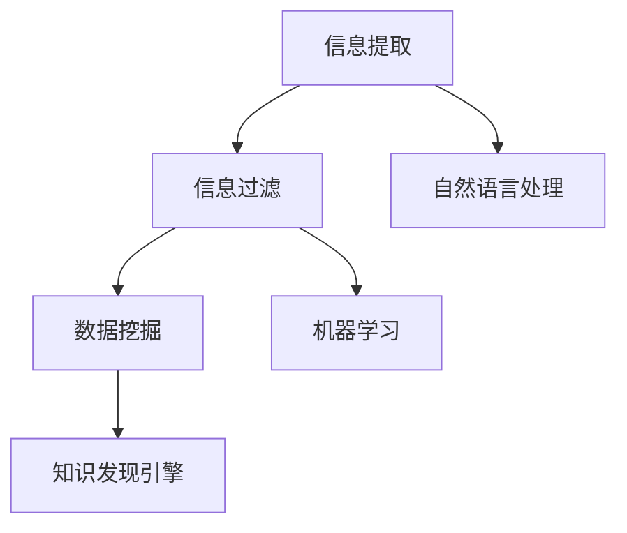

                 

**关键词：**知识发现、信息提取、自然语言处理、机器学习、人工智能、程序员技能提升、信息过滤、数据挖掘

## 1. 背景介绍

在信息爆炸的时代，程序员面临着海量的信息和数据，如何有效地发现和利用这些信息，提高自己的技能和效率，是一个亟待解决的问题。知识发现引擎（Knowledge Discovery Engine）就是一种有效的工具，它可以帮助程序员从海量数据中发现有用的信息，提高信息提取和过滤的能力，从而提升技能和效率。

## 2. 核心概念与联系

知识发现引擎是一个复杂的系统，涉及到自然语言处理、机器学习、信息检索等多个领域。其核心概念包括：

- **信息提取（Information Extraction）**：从非结构化数据中提取结构化信息的过程。
- **信息过滤（Information Filtering）**：根据用户的需求和兴趣，从海量信息中筛选出有用的信息。
- **数据挖掘（Data Mining）**：从大量数据中发现隐藏的、以前未知的模式和规律。

这些概念是相互联系的，信息提取是信息过滤的基础，信息过滤是数据挖掘的前提。知识发现引擎就是在信息提取、信息过滤和数据挖掘的基础上，结合自然语言处理和机器学习技术，实现对海量数据的自动发现和提取。



## 3. 核心算法原理 & 具体操作步骤

### 3.1 算法原理概述

知识发现引擎的核心是信息提取和信息过滤算法。信息提取通常使用基于规则的方法或机器学习方法，信息过滤通常使用过滤器模型或分类器模型。

### 3.2 算法步骤详解

1. **信息提取**：
   - **基于规则的方法**：使用预定义的规则从文本中提取信息。例如，使用正则表达式提取电子邮件地址。
   - **机器学学习方法**：使用机器学习算法，如条件随机场（CRF）或序列到序列模型（Seq2Seq），从文本中提取信息。例如，提取实体名称或关系。

2. **信息过滤**：
   - **过滤器模型**：使用用户的查询或兴趣作为过滤条件，从文档集合中筛选出符合条件的文档。
   - **分类器模型**：将文档分类为相关或不相关，并根据分类结果进行过滤。

### 3.3 算法优缺点

- **基于规则的方法**优点：简单易懂，实现容易；缺点：灵活性差，难以适应复杂的文本结构。
- **机器学习方法**优点：适应性强，可以学习复杂的文本结构；缺点：实现复杂，需要大量的标注数据。
- **过滤器模型**优点：实现简单，效率高；缺点：难以处理模糊的或复杂的查询。
- **分类器模型**优点：可以处理模糊的或复杂的查询；缺点：实现复杂，效率相对较低。

### 3.4 算法应用领域

知识发现引擎的应用领域非常广泛，包括但不限于：

- **新闻信息过滤**：帮助用户从大量新闻中筛选出感兴趣的信息。
- **社交媒体信息提取**：从社交媒体上提取有用的信息，如事件、实体、关系等。
- **客户反馈分析**：从客户反馈中提取有用的信息，帮助企业改进产品和服务。

## 4. 数学模型和公式 & 详细讲解 & 举例说明

### 4.1 数学模型构建

信息提取和信息过滤的数学模型通常是基于概率的。例如，条件随机场模型是信息提取的常用模型，公式如下：

$$P(y|x) = \frac{1}{Z(x)} \exp(\sum_{k=1}^{K}\lambda_k f_k(y_{i-k},...,y_{i+k},x))$$

其中，$y$是标注序列，$x$是输入序列，$f_k$是特征函数，$\lambda_k$是特征权重，$Z(x)$是规范化因子。

### 4.2 公式推导过程

条件随机场模型的推导过程基于最大熵原理，即模型应该最大化输入序列的条件熵。具体推导过程可以参考[条件随机场](https://en.wikipedia.org/wiki/Conditional_random_field)的维基百科页面。

### 4.3 案例分析与讲解

例如，使用条件随机场模型从文本中提取实体名称。输入序列$x$是文本，输出序列$y$是实体名称的标注。特征函数$f_k$可以是词汇特征、语法特征等。模型通过学习特征权重$\lambda_k$来适应文本结构。

## 5. 项目实践：代码实例和详细解释说明

### 5.1 开发环境搭建

知识发现引擎的开发环境需要安装Python、NLTK、Spacy、Scikit-learn等库。具体安装步骤可以参考[Python环境搭建](https://docs.python.org/3/using/unix.html#getting-started)和[Anaconda安装](https://docs.anaconda.com/anaconda/install/)。

### 5.2 源代码详细实现

以下是使用Spacy和Scikit-learn实现信息提取和信息过滤的简单示例。

**信息提取（实体名称提取）：**

```python
import spacy

nlp = spacy.load("en_core_web_sm")

def extract_entities(text):
    doc = nlp(text)
    return [(ent.text, ent.label_) for ent in doc.ents]

text = "Steve Jobs was the co-founder and CEO of Apple Inc."
print(extract_entities(text))
```

**信息过滤（文档分类）：**

```python
from sklearn.feature_extraction.text import TfidfVectorizer
from sklearn.linear_model import LogisticRegression

def train_classifier(docs, labels):
    vectorizer = TfidfVectorizer()
    features = vectorizer.fit_transform(docs)
    clf = LogisticRegression()
    clf.fit(features, labels)
    return vectorizer, clf

def predict_class(docs, vectorizer, clf):
    features = vectorizer.transform(docs)
    return clf.predict(features)

# 训练数据
docs = ["Steve Jobs was the co-founder and CEO of Apple Inc.",
        "Elon Musk is the CEO of SpaceX and Tesla."]
labels = ["Tech", "Tech"]

vectorizer, clf = train_classifier(docs, labels)

# 预测
text = "Jeff Bezos is the CEO of Amazon."
print(predict_class([text], vectorizer, clf))
```

### 5.3 代码解读与分析

**信息提取**：Spacy是一个强大的自然语言处理库，它内置了实体名称提取功能。`nlp(text)`将文本转换为Spacy的文档对象，`doc.ents`是文档中的实体列表。

**信息过滤**：TF-IDF向量化器将文本转换为特征向量，逻辑回归分类器用于文档分类。`train_classifier`函数用于训练分类器，`predict_class`函数用于预测文档类别。

### 5.4 运行结果展示

**信息提取**：输出`[('Steve Jobs', 'PERSON'), ('Apple Inc.', 'ORG')]`，表示文本中提取的实体名称和类型。

**信息过滤**：输出`['Tech']`，表示文本属于技术类别。

## 6. 实际应用场景

知识发现引擎的实际应用场景包括但不限于：

### 6.1 新闻信息过滤

程序员可以使用知识发现引擎从大量新闻中筛选出与其技能相关的信息，从而及时了解行业动态，提高技能。

### 6.2 社交媒体信息提取

程序员可以使用知识发现引擎从社交媒体上提取有用的信息，如新技术、新工具、新框架等，从而及时更新自己的技能。

### 6.3 客户反馈分析

程序员可以使用知识发现引擎从客户反馈中提取有用的信息，帮助企业改进产品和服务，从而提高客户满意度。

### 6.4 未来应用展望

随着人工智能技术的发展，知识发现引擎的应用将更加广泛。未来，知识发现引擎将能够从更复杂的数据中发现更有用的信息，帮助程序员更有效地提高技能和效率。

## 7. 工具和资源推荐

### 7.1 学习资源推荐

- **书籍**：《自然语言处理入门》《机器学习》《数据挖掘： concepts and techniques》等。
- **在线课程**：Coursera、Udacity、edX等平台上的自然语言处理、机器学习、数据挖掘课程。
- **文档**：Spacy、Scikit-learn、NLTK等库的官方文档。

### 7.2 开发工具推荐

- **IDE**：PyCharm、Visual Studio Code等。
- **库**：Spacy、NLTK、Scikit-learn、Gensim等。
- **框架**：TensorFlow、PyTorch等。

### 7.3 相关论文推荐

- **信息提取**：[Named Entity Recognition with Bidirectional LSTM-CNNs-CRF](https://arxiv.org/abs/1603.01360)
- **信息过滤**：[Deep Learning for Information Retrieval](https://arxiv.org/abs/1709.01414)
- **数据挖掘**：[Deep Learning for Data Mining](https://arxiv.org/abs/1609.07959)

## 8. 总结：未来发展趋势与挑战

### 8.1 研究成果总结

知识发现引擎的研究成果包括信息提取、信息过滤和数据挖掘等技术。这些技术已经广泛应用于新闻信息过滤、社交媒体信息提取、客户反馈分析等领域。

### 8.2 未来发展趋势

未来，知识发现引擎的发展趋势包括：

- **深度学习**：深度学习技术将进一步提高信息提取和信息过滤的准确性。
- **多模式数据**：知识发现引擎将能够处理多模式数据，如文本、图像、音频等。
- **实时处理**：知识发现引擎将能够实时处理数据，从而及时发现信息。

### 8.3 面临的挑战

知识发现引擎面临的挑战包括：

- **数据质量**：数据质量的好坏直接影响信息提取和信息过滤的准确性。
- **计算资源**：知识发现引擎需要大量的计算资源，特别是在处理大规模数据时。
- **解释性**：深度学习模型缺乏解释性，这限制了知识发现引擎的应用。

### 8.4 研究展望

未来，知识发现引擎的研究将重点放在以下领域：

- **低资源语言**：开发针对低资源语言的信息提取和信息过滤技术。
- **跨语言信息提取**：开发跨语言信息提取技术，从多语言数据中提取信息。
- **可解释的深度学习**：开发可解释的深度学习模型，提高信息提取和信息过滤的可解释性。

## 9. 附录：常见问题与解答

**Q：知识发现引擎与搜索引擎有什么区别？**

A：搜索引擎是根据用户的查询从海量数据中检索信息，而知识发现引擎是自动从海量数据中发现有用的信息。搜索引擎需要用户的主动查询，而知识发现引擎可以主动发现信息。

**Q：知识发现引擎需要大量的标注数据吗？**

A：是的，知识发现引擎通常需要大量的标注数据来训练模型。例如，信息提取需要大量的实体标注数据，信息过滤需要大量的文档标注数据。

**Q：知识发现引擎可以处理非结构化数据吗？**

A：是的，知识发现引擎可以处理非结构化数据，如文本、图像、音频等。信息提取技术可以从非结构化数据中提取结构化信息，信息过滤技术可以根据结构化信息进行过滤。

**Q：知识发现引擎可以实时处理数据吗？**

A：是的，知识发现引擎可以实时处理数据。实时处理技术可以及时发现信息，从而提高信息的时效性。

**Q：知识发现引擎可以处理多模式数据吗？**

A：是的，知识发现引擎可以处理多模式数据。多模式数据处理技术可以从多模式数据中提取信息，从而提高信息的丰富性。

## 作者：禅与计算机程序设计艺术 / Zen and the Art of Computer Programming

