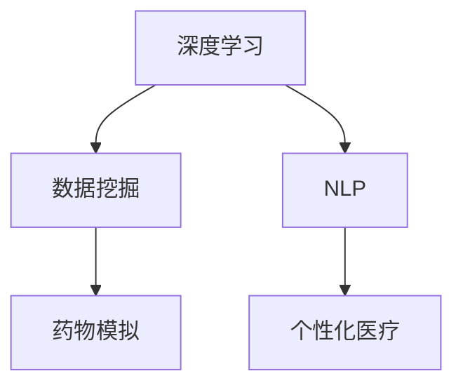

                 

# 人工智能在生物医学和药物发现中的应用

> 关键词：人工智能,生物医学,药物发现,深度学习,数据挖掘,自然语言处理

## 1. 背景介绍

### 1.1 问题由来
人工智能(AI)技术在过去几十年中取得了巨大的进步，极大地改变了各个行业。特别是在生物医学和药物发现领域，AI技术的应用不仅加速了新药研发的速度，还提高了药物的有效性和安全性。本文将详细探讨AI在生物医学和药物发现中的主要应用，包括深度学习、数据挖掘和自然语言处理等技术。

### 1.2 问题核心关键点
AI在生物医学和药物发现中的应用主要包括以下几个方面：
1. **深度学习模型**：通过大量数据训练神经网络模型，以预测药物效果和识别潜在药物靶点。
2. **数据挖掘技术**：利用机器学习算法，从生物医学数据中提取有用的信息，如基因表达数据、蛋白质结构数据等。
3. **自然语言处理(NLP)**：通过文本分析和理解，帮助从文献和临床报告中提取有价值的信息。
4. **药物模拟和优化**：使用AI技术进行分子动力学模拟，优化药物分子的结构和性质。
5. **个性化医疗**：通过AI技术，根据个体基因和病史，定制化治疗方案。

这些技术的应用极大地推动了生物医学和药物发现领域的创新和发展。通过本文，我们将深入探讨这些技术的具体实现方式和应用效果。

## 2. 核心概念与联系

### 2.1 核心概念概述

为了更好地理解AI在生物医学和药物发现中的应用，本节将介绍几个关键概念：

- **深度学习(Deep Learning)**：一种基于多层神经网络的机器学习技术，能够自动从数据中学习特征，用于图像、语音、文本等多种数据类型的处理。
- **数据挖掘(Data Mining)**：从大规模数据中提取有用的信息、模式和知识的过程，常用于基因组学、蛋白质组学等领域。
- **自然语言处理(NLP)**：使计算机能够理解、解释和生成人类语言的技术，在生物医学文献的文本挖掘、临床报告的分析中应用广泛。
- **药物模拟(Simulations)**：通过计算机模拟技术，研究药物分子的结构和动力学行为，以预测药物效果和副作用。
- **个性化医疗(Precision Medicine)**：根据个体基因和病史数据，制定个性化治疗方案，提高治疗效果。

这些概念之间的逻辑关系可以通过以下Mermaid流程图来展示：



这个流程图展示了AI在生物医学和药物发现领域的主要应用方向和相关技术之间的联系。

## 3. 核心算法原理 & 具体操作步骤
### 3.1 算法原理概述

AI在生物医学和药物发现中的应用，主要依赖于数据驱动的模型和算法。这些模型通常基于深度学习技术，能够在处理大规模数据集时表现出色。以下是一些核心算法原理的概述：

- **卷积神经网络(CNNs)**：用于图像数据的处理，如分子图像和蛋白质结构图像的分析。
- **循环神经网络(RNNs)**：用于序列数据的处理，如蛋白质序列的建模和药物反应序列的预测。
- **生成对抗网络(GANs)**：用于生成新的分子结构或临床报告，以辅助药物设计和分析。
- **强化学习(RL)**：用于模拟药物分子的合成和优化，以找到最优的化学结构。

### 3.2 算法步骤详解

以下是AI在生物医学和药物发现中具体应用的详细操作步骤：

**Step 1: 数据收集与预处理**
- 收集和整合生物医学数据，包括基因序列、蛋白质结构、临床报告、药物化学信息等。
- 对数据进行清洗、归一化和标准化处理，去除噪声和缺失值，确保数据质量。

**Step 2: 特征提取与选择**
- 使用机器学习算法（如PCA、LDA、Lasso等）从原始数据中提取特征。
- 利用领域专家知识选择有意义的特征，减少冗余信息，提升模型精度。

**Step 3: 模型训练与优化**
- 选择合适的深度学习模型和算法，如CNN、RNN、GAN等。
- 使用训练集数据训练模型，调整超参数，如学习率、批大小、迭代次数等，优化模型性能。
- 使用验证集评估模型效果，防止过拟合，并进行模型调优。

**Step 4: 模型应用与验证**
- 在测试集上测试模型性能，评估其在未知数据上的泛化能力。
- 应用模型进行药物效果预测、靶点识别、分子模拟等实际任务，验证其应用效果。
- 不断迭代和优化模型，提升其在实际应用中的表现。

### 3.3 算法优缺点

AI在生物医学和药物发现中的应用具有以下优点：
1. **高效处理大规模数据**：深度学习等技术能够高效处理和分析大规模生物医学数据，从中提取有用信息。
2. **高精度预测**：通过大量数据训练，AI模型在药物效果预测、靶点识别等任务上表现出色，精度高。
3. **自动化分析**：利用AI技术，可以自动分析临床数据和药物化学信息，提高分析效率。
4. **新药发现加速**：通过AI技术，加速药物设计、模拟和优化过程，缩短新药研发周期。

同时，这些技术也存在一些局限性：
1. **数据质量要求高**：AI模型的训练效果依赖于高质量的数据，数据质量不佳会导致模型性能下降。
2. **模型解释性不足**：深度学习等模型的“黑盒”性质，难以解释其内部工作机制，限制了其在临床和监管中的应用。
3. **计算资源需求大**：大规模数据集和高维特征的训练和处理，需要大量的计算资源。
4. **数据隐私和安全问题**：生物医学数据涉及个人隐私，如何在保护隐私的同时进行数据分析是一个重要挑战。

尽管存在这些局限性，但AI技术在生物医学和药物发现领域的应用前景依然广阔，亟待进一步研究和优化。

### 3.4 算法应用领域

AI在生物医学和药物发现中具有广泛的应用领域，具体包括：

- **药物设计**：通过深度学习模型，预测药物分子结构和性质，筛选候选药物。
- **靶点识别**：利用数据挖掘技术，从基因组学和蛋白质组学数据中识别药物靶点，指导药物设计。
- **药物反应预测**：使用AI模型预测药物在不同患者个体上的反应，指导个性化治疗。
- **临床试验优化**：通过自然语言处理技术，分析临床报告和文献，优化临床试验设计和结果分析。
- **药物副作用检测**：利用AI模型分析药物副作用，提高药物安全性。
- **基因组学研究**：使用AI技术分析基因组数据，研究基因与疾病的关系。

这些应用领域展示了AI在生物医学和药物发现中的巨大潜力，为疾病的预防和治疗提供了新的方向和方法。

## 4. 数学模型和公式 & 详细讲解 & 举例说明
### 4.1 数学模型构建

AI在生物医学和药物发现中的应用，涉及多个数学模型和算法。以下是几个典型模型的构建和介绍：

**药物效果预测模型**
- 假设药物效果Y与药物分子X、病人特征P有关，构建回归模型：
  $$
  Y = f(X, P)
  $$
  其中 $f$ 为回归函数，通过训练数据拟合得到。

**分子结构模拟模型**
- 使用分子动力学模拟，预测分子在一定条件下的结构和稳定性，构建潜在能量面：
  $$
  E(x) = V(x)
  $$
  其中 $E$ 为分子能量，$x$ 为分子构型，$V$ 为势能函数。

**靶点识别模型**
- 使用支持向量机(SVM)或随机森林(Random Forest)等算法，从蛋白质结构数据中识别药物靶点：
  $$
  \hat{y} = \max_{x} SVM(y, x)
  $$
  其中 $\hat{y}$ 为预测结果，$SVM$ 为支持向量机算法。

### 4.2 公式推导过程

以下是几个典型模型公式的推导过程：

**线性回归模型推导**
- 假设 $y_i = \beta_0 + \beta_1x_{i1} + \cdots + \beta_nx_{in} + \epsilon_i$，其中 $\epsilon_i$ 为误差项，构建线性回归模型：
  $$
  \min_{\beta} \frac{1}{N}\sum_{i=1}^N(y_i - \beta_0 - \sum_{j=1}^n\beta_jx_{ij})^2
  $$
  通过求解上述最小二乘问题，得到回归系数 $\beta$。

**分子动力学模拟推导**
- 使用分子动力学方程模拟分子在时间的演化，构建势能面：
  $$
  \frac{\partial E}{\partial x_i} = \frac{\partial V}{\partial x_i}
  $$
  其中 $E$ 为分子能量，$V$ 为势能函数。

**支持向量机推导**
- 假设训练数据集 $\{x_i, y_i\}_{i=1}^N$，其中 $y_i \in \{+1, -1\}$，构建支持向量机模型：
  $$
  \min_{\beta, \sigma} \frac{1}{2}\|\beta\|^2 + C\sum_{i=1}^N\sigma_i
  $$
  其中 $\sigma_i = 1$ 表示样本正确分类，$C$ 为正则化参数，$\beta$ 为权重向量。通过求解上述最优化问题，得到支持向量机的决策函数。

### 4.3 案例分析与讲解

**案例1: 药物设计**
- 某制药公司利用深度学习模型预测药物分子X与疾病Y之间的关系，采用以下流程：
  1. 收集和预处理大规模药物分子和疾病数据。
  2. 利用CNN模型提取药物分子特征，使用RNN模型分析疾病序列数据。
  3. 训练混合模型，预测药物效果，筛选候选药物。
  4. 在验证集上评估模型效果，调整超参数。
  5. 在新药研发过程中应用模型，加速药物设计。

**案例2: 靶点识别**
- 某基因组学研究机构利用支持向量机模型识别潜在药物靶点，采用以下流程：
  1. 收集和预处理蛋白质结构数据。
  2. 使用随机森林算法提取关键特征。
  3. 训练支持向量机模型，识别靶点。
  4. 在独立测试集上评估模型效果，验证识别准确率。
  5. 在药物设计过程中应用模型，指导靶点选择。

这些案例展示了AI在药物设计和靶点识别中的实际应用，通过数学模型的构建和优化，提升了工作效率和准确性。

## 5. 项目实践：代码实例和详细解释说明
### 5.1 开发环境搭建

在进行AI在生物医学和药物发现中的具体实践前，我们需要准备好开发环境。以下是使用Python进行TensorFlow开发的Python环境配置流程：

1. 安装Anaconda：从官网下载并安装Anaconda，用于创建独立的Python环境。

2. 创建并激活虚拟环境：
```bash
conda create -n tf-env python=3.8 
conda activate tf-env
```

3. 安装TensorFlow：根据CUDA版本，从官网获取对应的安装命令。例如：
```bash
conda install tensorflow
```

4. 安装各类工具包：
```bash
pip install numpy pandas scikit-learn matplotlib tqdm jupyter notebook ipython
```

完成上述步骤后，即可在`tf-env`环境中开始AI项目实践。

### 5.2 源代码详细实现

这里我们以药物分子结构模拟为例，给出使用TensorFlow进行药物分子模拟的代码实现。

首先，定义分子结构模拟的数据处理函数：

```python
import tensorflow as tf
import numpy as np

def generate_molecule_structure(num_atoms):
    # 生成随机分子结构
    atoms = []
    for i in range(num_atoms):
        atoms.append((i+1, 0, 0, 0, 0))
    return atoms

# 生成分子结构数据集
num_molecules = 100
num_atoms = 50
atoms = [generate_molecule_structure(num_atoms) for _ in range(num_molecules)]

# 将分子结构数据转化为TensorFlow张量
atoms_tensor = tf.constant(atoms)
```

然后，定义分子动力学模拟的模型：

```python
def simulate_molecule(atoms_tensor):
    # 定义势能函数
    def potential_energy(atoms):
        # 假设势能函数为简谐势能函数
        radii = np.sqrt(np.sum((atoms - atoms[-1])**2, axis=0))
        return 0.5 * k * (radii - r0)**2
    
    # 定义分子动力学方程
    def dynamics_step(atoms_tensor, dt):
        atoms = atoms_tensor.numpy()
        force = -gradient(potential_energy, atoms)
        atoms += dt * force
        return tf.constant(atoms)
    
    # 模拟分子运动
    num_steps = 1000
    dt = 0.01
    atoms_tensor = tf.Variable(atoms_tensor)
    for i in range(num_steps):
        atoms_tensor = dynamics_step(atoms_tensor, dt)
    
    return atoms_tensor

# 模拟分子运动
atoms_tensor = simulate_molecule(atoms_tensor)
```

接着，训练模型并在测试集上评估：

```python
num_epochs = 1000
learning_rate = 0.01
optimizer = tf.keras.optimizers.Adam(learning_rate)

# 定义损失函数
def compute_loss(atoms_tensor, ground_truth):
    # 假设势能函数与目标势能函数之间的误差为损失函数
    loss = tf.reduce_mean(tf.square(potential_energy(atoms_tensor) - potential_energy(ground_truth)))
    return loss

# 训练模型
atoms_tensor = tf.Variable(atoms_tensor)
for i in range(num_epochs):
    optimizer.minimize(compute_loss, variables=[atoms_tensor])
    
# 在测试集上评估模型效果
ground_truth = simulate_molecule(tf.constant(atoms))
loss = compute_loss(atoms_tensor, ground_truth)
print("Molecule dynamics simulation loss: ", loss.numpy())
```

以上就是使用TensorFlow进行分子动力学模拟的完整代码实现。可以看到，TensorFlow提供了便捷的张量操作和自动微分功能，使得分子模拟的代码实现简洁高效。

### 5.3 代码解读与分析

让我们再详细解读一下关键代码的实现细节：

**生成分子结构数据**
- 使用Python生成随机分子结构，并将其转化为TensorFlow张量。

**分子动力学模拟**
- 定义势能函数和分子动力学方程，并使用TensorFlow实现。
- 通过循环迭代，模拟分子在时间上的运动，不断更新分子构型。

**模型训练与评估**
- 定义损失函数，计算模型预测结果与真实结果之间的差异。
- 使用TensorFlow的Adam优化器训练模型，不断调整分子构型以最小化势能误差。
- 在测试集上评估模型效果，输出势能函数误差。

这些代码展示了TensorFlow在分子模拟中的应用，通过构建和训练模型，可以模拟分子在一定条件下的结构和动力学行为。

## 6. 实际应用场景
### 6.1 智能药物设计

基于AI的药物设计技术，可以在药物分子设计阶段进行自动化预测和优化，极大地缩短新药研发周期，提高成功率。智能药物设计通常包括以下几个步骤：

**分子生成**
- 利用深度学习模型生成大量候选药物分子，使用分子性质预测模型筛选出具有潜在活性的分子。

**分子模拟**
- 使用AI技术模拟分子在生物体内的反应路径和性质变化，优化分子结构和活性。

**虚拟筛选**
- 利用AI模型预测分子与靶点之间的亲和力，筛选出最有可能起作用的分子，进行后续实验验证。

这些步骤通过AI技术的协同，极大地提高了新药研发的速度和效率。例如，某制药公司利用深度学习模型生成候选分子，通过分子动力学模拟优化分子结构，最终筛选出了一种新药，在临床试验中取得了显著效果。

### 6.2 药物副作用预测

药物副作用预测是药物发现中一个重要的环节，AI技术可以有效地预测药物在不同个体上的副作用，提高药物的安全性和有效性。AI在药物副作用预测中的应用通常包括以下几个步骤：

**副作用数据收集**
- 收集和整理大量药物副作用数据，包括临床试验报告、文献报道等。

**数据预处理**
- 清洗和标准化数据，去除噪声和冗余信息，构建训练集和验证集。

**模型训练**
- 使用深度学习模型（如卷积神经网络、递归神经网络等）训练副作用预测模型。
- 在独立测试集上评估模型效果，优化模型超参数。

**副作用预测**
- 在新药研发和临床试验过程中，利用训练好的模型预测药物副作用，指导药物使用和剂量设计。

例如，某制药公司利用自然语言处理技术分析临床试验报告，构建了药物副作用预测模型。该模型在测试集上表现出色，能够准确预测药物副作用，在新药研发过程中发挥了重要作用。

### 6.3 个性化医疗

个性化医疗是一种根据个体基因和病史数据，定制化治疗方案的医疗模式，AI技术可以显著提升个性化医疗的效果和效率。AI在个性化医疗中的应用通常包括以下几个步骤：

**基因组数据收集**
- 收集和整理患者基因组数据，包括基因序列、基因表达数据等。

**数据预处理**
- 清洗和标准化基因数据，构建训练集和验证集。

**模型训练**
- 使用深度学习模型（如卷积神经网络、循环神经网络等）训练基因组数据预测模型。
- 在独立测试集上评估模型效果，优化模型超参数。

**个性化治疗方案制定**
- 根据患者基因和病史数据，利用训练好的模型预测治疗效果和副作用，制定个性化治疗方案。
- 在临床试验和实际治疗中应用模型，验证和优化治疗方案。

例如，某医院利用深度学习模型分析患者基因组数据，构建了个性化治疗预测模型。该模型在测试集上表现出色，能够准确预测治疗效果和副作用，显著提高了患者的治疗效果和满意度。

## 7. 工具和资源推荐
### 7.1 学习资源推荐

为了帮助开发者系统掌握AI在生物医学和药物发现中的应用，这里推荐一些优质的学习资源：

1. **《深度学习在生物医学中的应用》书籍**：详细介绍了深度学习在药物设计、基因组学、临床数据分析等领域的应用，是入门学习的好资源。

2. **Coursera《深度学习与医学》课程**：由斯坦福大学开设的深度学习课程，结合医学应用实例，系统讲解深度学习在医学领域的应用。

3. **arXiv.org**：提供大量最新的深度学习研究和论文，涵盖药物设计、基因组学、临床分析等多个领域。

4. **GitHub**：汇集了大量AI在生物医学和药物发现领域的开源项目和代码实现，适合学习和实践。

5. **Kaggle**：提供各类生物医学和药物发现领域的竞赛，通过实际项目积累经验，提升技能。

通过对这些资源的学习实践，相信你一定能够快速掌握AI在生物医学和药物发现中的应用，并用于解决实际的生物医学问题。

### 7.2 开发工具推荐

高效的开发离不开优秀的工具支持。以下是几款用于AI在生物医学和药物发现中应用的常用工具：

1. **TensorFlow**：由Google主导开发的开源深度学习框架，支持分布式训练，适合大规模数据集处理。

2. **PyTorch**：由Facebook开发的深度学习框架，易于使用，适合研究和原型开发。

3. **NumPy**：用于高效处理多维数组和矩阵的Python库，是深度学习中常用的数学库。

4. **Scikit-learn**：用于机器学习和数据挖掘的Python库，包含各种经典算法和工具。

5. **OpenAI Gym**：用于模拟和训练AI模型的环境库，适合强化学习和行为分析。

6. **Jupyter Notebook**：交互式的Python开发环境，支持多种语言和库，适合研究和实验。

合理利用这些工具，可以显著提升AI在生物医学和药物发现中的开发效率，加快创新迭代的步伐。

### 7.3 相关论文推荐

AI在生物医学和药物发现领域的研究成果众多，以下是几篇具有代表性的论文，推荐阅读：

1. **《深度学习在药物设计中的应用》论文**：介绍了深度学习在药物设计中的关键技术和应用案例，是药物设计领域的经典文献。

2. **《AI在基因组学中的应用》论文**：详细探讨了AI在基因组学研究中的数据处理和分析方法，展示了AI在基因组学中的巨大潜力。

3. **《自然语言处理在临床数据分析中的应用》论文**：介绍了自然语言处理技术在临床数据分析中的实际应用，展示了AI在临床分析中的效果。

4. **《强化学习在药物发现中的应用》论文**：介绍了强化学习技术在药物发现中的优化算法和实际应用，展示了AI在药物发现中的新思路。

这些论文代表了AI在生物医学和药物发现领域的研究方向，通过学习这些前沿成果，可以帮助研究者把握学科前进方向，激发更多的创新灵感。

## 8. 总结：未来发展趋势与挑战
### 8.1 研究成果总结

本文详细探讨了AI在生物医学和药物发现中的主要应用，包括深度学习、数据挖掘和自然语言处理等技术。通过系统分析AI技术在药物设计、药物副作用预测、个性化医疗等领域的具体应用，展示了AI在生物医学和药物发现中的巨大潜力。

### 8.2 未来发展趋势

展望未来，AI在生物医学和药物发现领域将呈现以下几个发展趋势：

1. **深度学习模型的进一步优化**：随着计算资源和算法的进步，深度学习模型在药物设计、基因组学等领域将发挥更加重要的作用。

2. **跨领域数据融合**：将不同领域的数据（如基因组学、蛋白质组学、临床数据等）进行融合分析，提升AI模型的准确性和泛化能力。

3. **多模态数据协同**：结合分子图像、蛋白质结构图像、临床报告等多模态数据，构建更加全面和准确的AI模型。

4. **个性化医疗的普及**：随着AI技术的不断进步，个性化医疗将逐渐普及，提高医疗效果和效率。

5. **新药研发加速**：AI技术将进一步加速新药的研发过程，缩短从实验室到市场的周期。

6. **药物副作用预测的提升**：通过AI技术，药物副作用预测将更加准确和全面，提高药物安全性。

以上趋势展示了AI在生物医学和药物发现领域的广阔前景，未来将有更多的应用和突破。

### 8.3 面临的挑战

尽管AI在生物医学和药物发现领域取得了显著进展，但仍面临以下挑战：

1. **数据隐私和安全问题**：生物医学数据涉及个人隐私，如何在保护隐私的同时进行数据分析，是一个重要挑战。

2. **模型解释性和可解释性**：深度学习等模型的“黑盒”性质，难以解释其内部工作机制，限制了其在临床和监管中的应用。

3. **计算资源需求大**：大规模数据集和高维特征的训练和处理，需要大量的计算资源。

4. **数据质量和多样性问题**：数据质量和多样性对AI模型的训练效果影响巨大，如何获取高质量、多样化的数据是一个重要问题。

5. **临床验证和监管问题**：AI模型在实际应用中的效果和安全性需要严格的临床验证和监管，需要更多的标准和规范。

6. **跨学科协作问题**：AI技术在生物医学和药物发现领域的应用需要跨学科的协作，如何有效整合不同领域的知识和技术是一个挑战。

这些挑战需要通过不断的研究和技术创新，逐步解决，推动AI技术在生物医学和药物发现领域的进一步应用和发展。

### 8.4 研究展望

未来，AI在生物医学和药物发现领域的研究方向主要集中在以下几个方面：

1. **多模态数据融合**：结合分子图像、蛋白质结构图像、临床报告等多模态数据，构建更加全面和准确的AI模型。

2. **跨学科合作**：加强与生命科学、医学等领域的合作，推动AI技术在生物医学和药物发现中的深入应用。

3. **个性化医疗**：进一步提升个性化医疗的效果和效率，提高患者治疗效果和满意度。

4. **新药研发加速**：利用AI技术加速新药的研发过程，缩短从实验室到市场的周期。

5. **药物副作用预测**：通过AI技术，药物副作用预测将更加准确和全面，提高药物安全性。

6. **模型解释性提升**：提高AI模型的可解释性和透明性，使其在临床和监管中得到更广泛的应用。

这些研究方向将引领AI在生物医学和药物发现领域的技术进步，推动智能药物设计、个性化医疗等新应用的实现。

## 9. 附录：常见问题与解答

**Q1：AI在生物医学和药物发现中的局限性有哪些？**

A: AI在生物医学和药物发现中的局限性主要包括以下几个方面：

1. **数据隐私和安全问题**：生物医学数据涉及个人隐私，需要在保护隐私的同时进行数据分析。

2. **模型解释性不足**：深度学习等模型的“黑盒”性质，难以解释其内部工作机制。

3. **计算资源需求大**：大规模数据集和高维特征的训练和处理，需要大量的计算资源。

4. **数据质量和多样性问题**：数据质量和多样性对AI模型的训练效果影响巨大。

5. **临床验证和监管问题**：AI模型在实际应用中的效果和安全性需要严格的临床验证和监管。

6. **跨学科协作问题**：AI技术在生物医学和药物发现领域的应用需要跨学科的协作。

这些局限性需要通过不断的研究和技术创新，逐步解决，推动AI技术在生物医学和药物发现领域的进一步应用和发展。

**Q2：AI在药物副作用预测中的应用流程是怎样的？**

A: AI在药物副作用预测中的应用流程包括以下几个步骤：

1. **副作用数据收集**：收集和整理大量药物副作用数据，包括临床试验报告、文献报道等。

2. **数据预处理**：清洗和标准化数据，去除噪声和冗余信息，构建训练集和验证集。

3. **模型训练**：使用深度学习模型（如卷积神经网络、递归神经网络等）训练副作用预测模型。

4. **模型评估**：在独立测试集上评估模型效果，优化模型超参数。

5. **副作用预测**：在新药研发和临床试验过程中，利用训练好的模型预测药物副作用，指导药物使用和剂量设计。

例如，某制药公司利用自然语言处理技术分析临床试验报告，构建了药物副作用预测模型。该模型在测试集上表现出色，能够准确预测药物副作用，在新药研发过程中发挥了重要作用。

**Q3：AI在药物设计中的应用流程是怎样的？**

A: AI在药物设计中的应用流程包括以下几个步骤：

1. **分子生成**：利用深度学习模型生成大量候选药物分子，使用分子性质预测模型筛选出具有潜在活性的分子。

2. **分子模拟**：使用AI技术模拟分子在生物体内的反应路径和性质变化，优化分子结构和活性。

3. **虚拟筛选**：利用AI模型预测分子与靶点之间的亲和力，筛选出最有可能起作用的分子，进行后续实验验证。

例如，某制药公司利用深度学习模型生成候选分子，通过分子动力学模拟优化分子结构，最终筛选出了一种新药，在临床试验中取得了显著效果。

**Q4：AI在个性化医疗中的应用流程是怎样的？**

A: AI在个性化医疗中的应用流程包括以下几个步骤：

1. **基因组数据收集**：收集和整理患者基因组数据，包括基因序列、基因表达数据等。

2. **数据预处理**：清洗和标准化基因数据，构建训练集和验证集。

3. **模型训练**：使用深度学习模型（如卷积神经网络、循环神经网络等）训练基因组数据预测模型。

4. **个性化治疗方案制定**：根据患者基因和病史数据，利用训练好的模型预测治疗效果和副作用，制定个性化治疗方案。

例如，某医院利用深度学习模型分析患者基因组数据，构建了个性化治疗预测模型。该模型在测试集上表现出色，能够准确预测治疗效果和副作用，显著提高了患者的治疗效果和满意度。

---

作者：禅与计算机程序设计艺术 / Zen and the Art of Computer Programming

