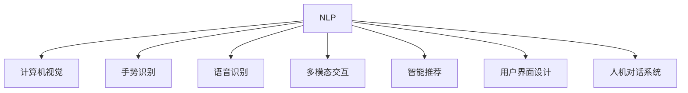

                 

# 人机交互：未来趋势与展望

## 1. 背景介绍

### 1.1 问题由来
随着人工智能技术的飞速发展，人机交互（Human-Computer Interaction, HCI）已经成为推动人类社会进步的重要驱动力。在过去几十年中，从机械交互到图形界面，从文本命令到语音识别，人机交互技术经历了几次重要变革。如今，随着深度学习、自然语言处理（Natural Language Processing, NLP）和计算机视觉等技术的突破，人机交互技术正处于又一次重要的历史转折点。

### 1.2 问题核心关键点
当前，人机交互技术正在从传统的交互方式向更加智能、自然、高效的方向发展。以下三个核心关键点反映了当前人机交互技术的研究重点：

1. **智能交互**：通过自然语言理解、情感分析、意图识别等技术，实现人与计算机更加自然、智能的交流。
2. **多模态融合**：结合视觉、听觉、触觉等多种感官信息，提供更丰富、全面的交互体验。
3. **个性化交互**：根据用户的历史行为、偏好，实现个性化、定制化的交互界面和响应策略。

### 1.3 问题研究意义
研究未来人机交互趋势，对于推动智能化人机交互系统的研发，提升用户体验，加速智能化技术的产业化进程，具有重要意义：

1. **提升用户满意度**：通过更加智能、自然的交互方式，提升用户的使用体验和效率。
2. **推动智能化技术落地**：人机交互技术是智能化技术落地的关键，其发展水平直接影响智能化应用的普及和应用深度。
3. **驱动新产业形态**：智能人机交互技术的进步将催生新的应用场景和商业模式，为经济社会发展带来新的动力。

## 2. 核心概念与联系

### 2.1 核心概念概述

为了更好地理解人机交互的未来趋势，本节将介绍几个关键概念及其之间的联系：

- **自然语言处理（NLP）**：通过深度学习模型处理自然语言的文本和语音，实现语言的理解和生成。
- **计算机视觉（CV）**：使用机器学习算法处理图像和视频，实现目标检测、图像分类、人脸识别等任务。
- **手势识别**：利用传感器和深度学习模型，实现对人体手势的准确识别和响应。
- **语音识别**：通过深度学习模型将语音转换为文本，实现语音命令的输入和输出。
- **多模态交互**：结合视觉、听觉、触觉等多种感官信息，提供更加自然和全面的交互体验。
- **智能推荐**：通过机器学习算法分析用户行为和偏好，实现个性化推荐。
- **用户界面（UI）设计**：涉及用户界面的布局、交互元素的设计，以提升用户体验和效率。
- **人机对话系统**：通过自然语言理解和生成技术，实现人与计算机的对话交互。

这些核心概念之间通过技术框架和应用场景紧密联系，共同构成人机交互技术的未来发展方向。

### 2.2 核心概念原理和架构的 Mermaid 流程图



这个流程图展示了NLP、CV、手势识别、语音识别、多模态交互、智能推荐、用户界面设计和人机对话系统这八大核心概念之间的联系，它们共同构成了人机交互技术的未来发展框架。

## 3. 核心算法原理 & 具体操作步骤
### 3.1 算法原理概述

未来的人机交互技术将以智能、多模态、个性化为特点，其核心算法原理包括：

- **自然语言理解**：利用深度学习模型（如Transformer、BERT、GPT等）处理自然语言，实现意图的理解、情感的识别和语义的解析。
- **多模态融合**：通过深度学习模型将视觉、听觉、触觉等多种信息融合，实现更加自然和全面的交互体验。
- **推荐算法**：利用机器学习算法分析用户行为和偏好，实现个性化推荐，提升用户体验和满意度。

### 3.2 算法步骤详解

下面详细介绍未来人机交互技术的关键步骤：

**Step 1: 收集和处理多模态数据**
- 收集用户的自然语言、手势、语音、图像等多模态数据。
- 对数据进行清洗、预处理和标注，构建训练集和验证集。

**Step 2: 构建深度学习模型**
- 根据应用场景，选择合适的深度学习模型（如Transformer、卷积神经网络、循环神经网络等）。
- 设计模型结构，选择合适的损失函数和优化算法。

**Step 3: 模型训练和微调**
- 使用收集的多模态数据对模型进行训练。
- 在验证集上评估模型性能，根据评估结果进行模型微调。

**Step 4: 部署和集成**
- 将训练好的模型部署到生产环境。
- 将模型与UI、对话系统等集成，实现智能化人机交互。

**Step 5: 持续学习和优化**
- 收集用户反馈数据，持续改进模型性能。
- 根据用户反馈和应用场景变化，动态调整模型参数。

### 3.3 算法优缺点

未来人机交互技术具有以下优点：

1. **智能性**：通过深度学习模型的应用，可以实现更加智能、自然的交互方式，提升用户体验。
2. **多模态融合**：结合视觉、听觉、触觉等多种信息，提供更加全面和自然的交互体验。
3. **个性化**：通过机器学习算法分析用户行为和偏好，实现个性化推荐和定制化交互。

同时，该技术也存在一定的局限性：

1. **数据依赖**：模型训练和优化依赖于大量标注数据，获取高质量数据的成本较高。
2. **计算资源需求**：深度学习模型需要大量的计算资源，可能对硬件设备提出较高要求。
3. **隐私和安全问题**：多模态数据包含大量个人隐私信息，需要严格的隐私保护措施。
4. **可解释性不足**：深度学习模型的决策过程难以解释，用户可能难以理解模型的工作原理。

尽管存在这些局限性，但未来人机交互技术仍将朝着更加智能、自然和高效的方向发展，成为推动人工智能技术落地应用的重要驱动力。

### 3.4 算法应用领域

未来人机交互技术将在多个领域得到广泛应用，包括但不限于：

- **智能客服**：利用自然语言理解和智能推荐技术，实现自动解答客户咨询，提升服务效率。
- **智能家居**：结合视觉、语音、手势等多种交互方式，实现智能控制和操作。
- **智能健康**：通过多模态数据采集和分析，提供个性化的健康管理和医疗建议。
- **智能交通**：利用计算机视觉和手势识别技术，提升驾驶安全和交通效率。
- **虚拟现实（VR）和增强现实（AR）**：结合多模态交互技术，提供沉浸式和交互式的体验。

## 4. 数学模型和公式 & 详细讲解 & 举例说明

### 4.1 数学模型构建

本节将使用数学语言对未来人机交互技术的关键模型进行介绍。

假设我们有一个包含N个样本的多模态数据集 $\{(x_i, y_i)\}_{i=1}^N$，其中 $x_i$ 表示多模态特征向量，$y_i$ 表示对应的标签。我们的目标是构建一个深度学习模型 $M_{\theta}$，使其在给定输入 $x_i$ 时，能够准确预测标签 $y_i$。模型的训练目标是最小化损失函数：

$$
\mathcal{L}(\theta) = \frac{1}{N} \sum_{i=1}^N \ell(M_{\theta}(x_i), y_i)
$$

其中 $\ell$ 为损失函数，可以是交叉熵、均方误差等。优化目标是找到最优的模型参数 $\theta$：

$$
\theta^* = \mathop{\arg\min}_{\theta} \mathcal{L}(\theta)
$$

### 4.2 公式推导过程

以自然语言理解为例，假设我们使用BERT模型进行训练，其输入为自然语言文本 $x$，输出为隐含的语义表示 $h(x)$。假设我们有一个二分类任务，其标签为 $y \in \{0, 1\}$。我们希望构建一个逻辑回归模型 $M_{\theta}(x)$，输出概率 $p$：

$$
M_{\theta}(x) = \sigma(\theta^T h(x))
$$

其中 $\sigma$ 为Sigmoid函数，$\theta$ 为模型参数。根据二分类任务，我们的损失函数为交叉熵损失：

$$
\ell(M_{\theta}(x), y) = -[y\log p + (1-y)\log (1-p)]
$$

将其代入经验风险公式，得：

$$
\mathcal{L}(\theta) = -\frac{1}{N} \sum_{i=1}^N [y_i\log M_{\theta}(x_i)+(1-y_i)\log(1-M_{\theta}(x_i))]
$$

根据链式法则，损失函数对参数 $\theta$ 的梯度为：

$$
\frac{\partial \mathcal{L}(\theta)}{\partial \theta} = -\frac{1}{N}\sum_{i=1}^N \left(\frac{y_i}{p_i} - \frac{1-y_i}{1-p_i}\right) \frac{\partial p_i}{\partial \theta}
$$

其中 $p_i = \sigma(\theta^T h(x_i))$，$\frac{\partial p_i}{\partial \theta}$ 为模型输出对参数的梯度。

### 4.3 案例分析与讲解

以智能客服系统为例，假设我们使用BERT模型进行微调，其输入为自然语言文本 $x$，输出为分类标签 $y$。我们的目标是在给定输入 $x$ 时，能够准确预测用户意图 $y$。我们可以将问题转化为二分类任务，其中 $y=1$ 表示用户需要帮助，$y=0$ 表示用户不需要帮助。

在微调过程中，我们可以将历史客服对话记录作为监督数据，将对话文本 $x$ 和用户反馈 $y$ 作为训练集，利用BERT模型进行训练。在训练过程中，我们可以采用交叉熵损失函数，使用Adam优化器进行模型参数更新。通过不断迭代训练，优化模型参数，使其能够更好地匹配用户意图。

在模型训练完成后，我们可以将模型部署到智能客服系统中，实现自动解答客户咨询。当系统接收到用户输入时，系统会使用微调后的BERT模型对输入文本进行语义分析，判断用户是否需要帮助，并给出相应的解答。

## 5. 项目实践：代码实例和详细解释说明
### 5.1 开发环境搭建

在进行未来人机交互技术的项目实践前，我们需要准备好开发环境。以下是使用Python进行PyTorch开发的环境配置流程：

1. 安装Anaconda：从官网下载并安装Anaconda，用于创建独立的Python环境。

2. 创建并激活虚拟环境：
```bash
conda create -n pytorch-env python=3.8 
conda activate pytorch-env
```

3. 安装PyTorch：根据CUDA版本，从官网获取对应的安装命令。例如：
```bash
conda install pytorch torchvision torchaudio cudatoolkit=11.1 -c pytorch -c conda-forge
```

4. 安装相关库：
```bash
pip install torch torchtext transformers sklearn
```

完成上述步骤后，即可在`pytorch-env`环境中开始项目实践。

### 5.2 源代码详细实现

这里我们以智能客服系统为例，给出使用PyTorch和Transformers库进行BERT微调的PyTorch代码实现。

```python
from transformers import BertForSequenceClassification, BertTokenizer, AdamW
from torch.utils.data import DataLoader
from torch.nn import CrossEntropyLoss
from sklearn.metrics import classification_report

# 构建数据集
class CustomerServiceDataset(Dataset):
    def __init__(self, texts, labels, tokenizer):
        self.texts = texts
        self.labels = labels
        self.tokenizer = tokenizer

    def __len__(self):
        return len(self.texts)

    def __getitem__(self, idx):
        text = self.texts[idx]
        label = self.labels[idx]
        
        encoding = self.tokenizer(text, return_tensors='pt', padding=True, truncation=True, max_length=512)
        input_ids = encoding['input_ids'].flatten()
        attention_mask = encoding['attention_mask'].flatten()
        return {'input_ids': input_ids, 'attention_mask': attention_mask, 'labels': label}

# 构建模型和优化器
model = BertForSequenceClassification.from_pretrained('bert-base-cased', num_labels=2)
tokenizer = BertTokenizer.from_pretrained('bert-base-cased')
optimizer = AdamW(model.parameters(), lr=2e-5)
loss_fn = CrossEntropyLoss()

# 训练模型
device = torch.device('cuda') if torch.cuda.is_available() else torch.device('cpu')
model.to(device)
model.train()

def train_epoch(model, dataset, batch_size, optimizer):
    dataloader = DataLoader(dataset, batch_size=batch_size, shuffle=True)
    epoch_loss = 0
    for batch in dataloader:
        input_ids = batch['input_ids'].to(device)
        attention_mask = batch['attention_mask'].to(device)
        labels = batch['labels'].to(device)
        model.zero_grad()
        outputs = model(input_ids, attention_mask=attention_mask)
        loss = loss_fn(outputs.logits, labels)
        epoch_loss += loss.item()
        loss.backward()
        optimizer.step()
    return epoch_loss / len(dataloader)

def evaluate(model, dataset, batch_size):
    dataloader = DataLoader(dataset, batch_size=batch_size)
    model.eval()
    preds, labels = [], []
    with torch.no_grad():
        for batch in dataloader:
            input_ids = batch['input_ids'].to(device)
            attention_mask = batch['attention_mask'].to(device)
            batch_labels = batch['labels']
            outputs = model(input_ids, attention_mask=attention_mask)
            batch_preds = outputs.logits.argmax(dim=1).to('cpu').tolist()
            batch_labels = batch_labels.to('cpu').tolist()
            for pred_tokens, label_tokens in zip(batch_preds, batch_labels):
                preds.append(pred_tokens)
                labels.append(label_tokens)

    print(classification_report(labels, preds))

# 训练模型
train_dataset = CustomerServiceDataset(train_texts, train_labels, tokenizer)
dev_dataset = CustomerServiceDataset(dev_texts, dev_labels, tokenizer)
test_dataset = CustomerServiceDataset(test_texts, test_labels, tokenizer)

epochs = 5
batch_size = 16

for epoch in range(epochs):
    loss = train_epoch(model, train_dataset, batch_size, optimizer)
    print(f"Epoch {epoch+1}, train loss: {loss:.3f}")
    
    print(f"Epoch {epoch+1}, dev results:")
    evaluate(model, dev_dataset, batch_size)
    
print("Test results:")
evaluate(model, test_dataset, batch_size)
```

### 5.3 代码解读与分析

这里我们详细解读一下代码的关键部分：

**CustomerServiceDataset类**：
- `__init__`方法：初始化文本、标签和分词器。
- `__len__`方法：返回数据集的样本数量。
- `__getitem__`方法：对单个样本进行处理，将文本输入编码为token ids，将标签转换为数字，并对其进行定长padding。

**模型训练和评估函数**：
- `train_epoch`函数：对数据以批为单位进行迭代，在每个批次上前向传播计算loss并反向传播更新模型参数，最后返回该epoch的平均loss。
- `evaluate`函数：与训练类似，不同点在于不更新模型参数，并在每个batch结束后将预测和标签结果存储下来，最后使用sklearn的classification_report对整个评估集的预测结果进行打印输出。

**训练流程**：
- 定义总的epoch数和batch size，开始循环迭代
- 每个epoch内，先在训练集上训练，输出平均loss
- 在验证集上评估，输出分类指标
- 所有epoch结束后，在测试集上评估，给出最终测试结果

可以看到，PyTorch配合Transformers库使得BERT微调的代码实现变得简洁高效。开发者可以将更多精力放在数据处理、模型改进等高层逻辑上，而不必过多关注底层的实现细节。

## 6. 实际应用场景
### 6.1 智能客服系统

基于深度学习模型的人机交互技术，可以广泛应用于智能客服系统的构建。传统客服往往需要配备大量人力，高峰期响应缓慢，且一致性和专业性难以保证。而使用深度学习模型进行自然语言理解和智能推荐技术，可以7x24小时不间断服务，快速响应客户咨询，用自然流畅的语言解答各类常见问题。

在技术实现上，可以收集企业内部的历史客服对话记录，将问题和最佳答复构建成监督数据，在此基础上对深度学习模型进行微调。微调后的模型能够自动理解用户意图，匹配最合适的答案模板进行回复。对于客户提出的新问题，还可以接入检索系统实时搜索相关内容，动态组织生成回答。如此构建的智能客服系统，能大幅提升客户咨询体验和问题解决效率。

### 6.2 智能家居

智能家居设备结合深度学习模型，可以实现语音、手势等多种交互方式，提供更加自然和个性化的使用体验。例如，通过深度学习模型对用户的语音指令进行识别，实现智能控制家电设备。或者利用摄像头和手势识别技术，让用户通过手势控制家中的灯光、温度等设备，提升生活便利性。

智能家居系统通过深度学习模型的多模态融合能力，可以实现更加自然和全面的交互体验，提升用户的满意度和舒适感。

### 6.3 智能健康

智能健康领域，深度学习模型可以用于多模态数据的分析和预测，提供个性化的健康管理和医疗建议。例如，利用计算机视觉技术对病人的影像数据进行分析和诊断，结合自然语言处理技术对病人的症状进行理解，再通过深度学习模型进行综合分析，提供个性化的治疗方案和健康建议。

智能健康系统通过深度学习模型的多模态融合和个性化推荐能力，能够更好地满足用户的多样化需求，提升医疗服务的质量和效率。

### 6.4 未来应用展望

随着深度学习模型的不断发展，未来人机交互技术将在更多领域得到应用，为传统行业带来变革性影响。

在智慧医疗领域，基于深度学习模型的人机交互技术，可以实现自动解答医疗咨询、生成医疗建议、分析医疗影像等功能，提升医疗服务的智能化水平。

在智能教育领域，深度学习模型可以用于智能推荐系统，根据学生的学习行为和偏好，推荐合适的学习内容和资源，实现个性化教学。

在智能交通领域，深度学习模型可以用于多模态数据融合和行为预测，实现智能驾驶、交通流优化等功能，提升交通效率和安全性。

在虚拟现实（VR）和增强现实（AR）领域，深度学习模型可以实现更加自然和沉浸式的交互体验，提供更加丰富和多样的应用场景。

此外，在企业生产、社会治理、文娱传媒等众多领域，基于深度学习模型的人机交互技术也将不断涌现，为NLP技术带来全新的突破。相信随着预训练模型和深度学习技术的持续演进，人机交互技术必将在更广阔的应用领域大放异彩。

## 7. 工具和资源推荐
### 7.1 学习资源推荐

为了帮助开发者系统掌握深度学习模型和未来人机交互技术，这里推荐一些优质的学习资源：

1. **Deep Learning Specialization**：由斯坦福大学Andrew Ng教授主讲的深度学习课程，涵盖了深度学习模型的理论和实践，适合初学者和进阶者。

2. **Transformers官方文档**：提供了完整的BERT、GPT等深度学习模型的实现和应用指南，是开发者学习深度学习模型的重要参考资料。

3. **NLP with Transformers**：一本深入介绍深度学习模型在自然语言处理领域应用的书籍，适合NLP领域的研究者和开发者阅读。

4. **PyTorch官方文档**：提供了PyTorch深度学习框架的详细文档和使用指南，是开发者进行深度学习模型开发的必备工具。

5. **Kaggle**：一个数据科学竞赛平台，提供大量的NLP、深度学习等领域的竞赛和数据集，适合学习者进行实践和实验。

通过对这些资源的学习实践，相信你一定能够快速掌握深度学习模型和未来人机交互技术的精髓，并用于解决实际的NLP问题。

### 7.2 开发工具推荐

高效的开发离不开优秀的工具支持。以下是几款用于深度学习模型开发和未来人机交互技术实现的常用工具：

1. **PyTorch**：基于Python的开源深度学习框架，灵活动态的计算图，适合快速迭代研究。

2. **TensorFlow**：由Google主导开发的开源深度学习框架，生产部署方便，适合大规模工程应用。

3. **Transformers**：HuggingFace开发的NLP工具库，集成了众多深度学习模型，支持PyTorch和TensorFlow，是进行深度学习模型开发的利器。

4. **Weights & Biases**：模型训练的实验跟踪工具，可以记录和可视化模型训练过程中的各项指标，方便对比和调优。

5. **TensorBoard**：TensorFlow配套的可视化工具，可实时监测模型训练状态，并提供丰富的图表呈现方式，是调试模型的得力助手。

6. **Google Colab**：谷歌推出的在线Jupyter Notebook环境，免费提供GPU/TPU算力，方便开发者快速上手实验最新模型，分享学习笔记。

合理利用这些工具，可以显著提升深度学习模型开发和未来人机交互技术的实现效率，加快创新迭代的步伐。

### 7.3 相关论文推荐

深度学习模型和未来人机交互技术的发展源于学界的持续研究。以下是几篇奠基性的相关论文，推荐阅读：

1. **Attention is All You Need**：提出了Transformer结构，开启了深度学习模型在自然语言处理领域的应用。

2. **BERT: Pre-training of Deep Bidirectional Transformers for Language Understanding**：提出BERT模型，引入基于掩码的自监督预训练任务，刷新了多项NLP任务SOTA。

3. **Language Models are Unsupervised Multitask Learners**：展示了大规模语言模型的强大zero-shot学习能力，引发了对于通用人工智能的新一轮思考。

4. **Adaptive Low-Rank Adaptation for Parameter-Efficient Fine-Tuning**：提出LoRA等参数高效微调方法，在固定大部分预训练参数的同时，只更新极少量的任务相关参数。

5. **Towards Explainable AI with Smart Human-Machine Dialogue**：研究如何通过智能人机对话系统提高深度学习模型的可解释性。

这些论文代表了大语言模型微调技术的发展脉络。通过学习这些前沿成果，可以帮助研究者把握学科前进方向，激发更多的创新灵感。

## 8. 总结：未来发展趋势与挑战
### 8.1 研究成果总结

本文对未来人机交互技术的发展趋势和挑战进行了全面系统的介绍。首先阐述了深度学习模型和未来人机交互技术的研究背景和意义，明确了其在推动智能化人机交互系统研发和提升用户体验方面的重要价值。其次，从原理到实践，详细讲解了深度学习模型和未来人机交互技术的数学原理和关键步骤，给出了深度学习模型和未来人机交互技术的完整代码实例。同时，本文还广泛探讨了深度学习模型和未来人机交互技术在智能客服、智能家居、智能健康等多个行业领域的应用前景，展示了其广阔的发展空间。最后，本文精选了深度学习模型和未来人机交互技术的学习资源、开发工具和相关论文，力求为开发者提供全方位的技术指引。

通过本文的系统梳理，可以看到，深度学习模型和未来人机交互技术正在成为推动智能化技术落地应用的重要驱动力。它们将为人工智能技术的产业化进程注入新的活力，驱动各行各业的数字化转型和升级。未来，随着深度学习模型和未来人机交互技术的持续演进，相信其将带来更多颠覆性的应用，为人类社会带来新的变革。

### 8.2 未来发展趋势

展望未来，深度学习模型和未来人机交互技术将呈现以下几个发展趋势：

1. **智能化水平的提升**：通过深度学习模型和未来人机交互技术的不断优化，人机交互将变得更加智能和自然，提升用户体验和效率。

2. **多模态融合的深入**：结合视觉、听觉、触觉等多种感官信息，提供更加丰富和多样的交互体验，提升人机交互的自然性和全面性。

3. **个性化交互的普及**：通过深度学习模型和未来人机交互技术，实现个性化推荐和定制化交互，提升用户的满意度和舒适感。

4. **计算资源的优化**：通过深度学习模型的参数高效微调和优化算法，减少计算资源消耗，提升模型的运行效率和响应速度。

5. **安全性和隐私保护**：在深度学习模型和未来人机交互技术中，加强数据隐私保护和安全性，避免数据泄露和滥用。

6. **跨领域应用的拓展**：深度学习模型和未来人机交互技术将在更多领域得到应用，如医疗、教育、交通等，为各行各业带来新的应用场景和商业模式。

7. **跨学科融合的推进**：深度学习模型和未来人机交互技术需要与其他领域的技术进行深度融合，如知识图谱、因果推理、强化学习等，实现更加全面和高效的解决方案。

这些趋势展示了深度学习模型和未来人机交互技术的未来发展方向，将为人工智能技术的落地应用带来更多新的可能。

### 8.3 面临的挑战

尽管深度学习模型和未来人机交互技术取得了显著进展，但在迈向更加智能化、普适化应用的过程中，仍然面临诸多挑战：

1. **数据依赖**：深度学习模型和未来人机交互技术依赖大量标注数据，获取高质量数据的成本较高，数据量不足将限制其应用范围和效果。

2. **计算资源需求**：深度学习模型和未来人机交互技术需要大量的计算资源，可能对硬件设备提出较高要求，计算资源的限制将影响其大规模部署和应用。

3. **隐私和安全问题**：深度学习模型和未来人机交互技术涉及大量个人隐私信息，数据泄露和滥用将带来严重后果，隐私保护和安全性的问题亟待解决。

4. **可解释性不足**：深度学习模型的决策过程难以解释，用户难以理解模型的工作原理，模型的可解释性问题亟待解决。

5. **模型鲁棒性**：深度学习模型和未来人机交互技术面对域外数据时，泛化性能往往大打折扣，模型的鲁棒性问题亟待解决。

6. **技术成熟度**：尽管深度学习模型和未来人机交互技术已取得重要进展，但其技术成熟度仍有待提升，实际应用中还存在不少技术难点和挑战。

这些挑战将推动深度学习模型和未来人机交互技术不断优化和改进，提升其性能和可靠性，为人工智能技术的落地应用提供坚实基础。

### 8.4 研究展望

面对深度学习模型和未来人机交互技术所面临的挑战，未来的研究需要在以下几个方面寻求新的突破：

1. **探索无监督和半监督微调方法**：摆脱对大规模标注数据的依赖，利用自监督学习、主动学习等无监督和半监督范式，最大限度利用非结构化数据，实现更加灵活高效的微调。

2. **研究参数高效和计算高效的微调范式**：开发更加参数高效的微调方法，在固定大部分预训练参数的同时，只更新极少量的任务相关参数。同时优化微调模型的计算图，减少前向传播和反向传播的资源消耗，实现更加轻量级、实时性的部署。

3. **融合因果和对比学习范式**：通过引入因果推断和对比学习思想，增强深度学习模型和未来人机交互技术建立稳定因果关系的能力，学习更加普适、鲁棒的语言表征，从而提升模型泛化性和抗干扰能力。

4. **引入更多先验知识**：将符号化的先验知识，如知识图谱、逻辑规则等，与深度学习模型进行巧妙融合，引导微调过程学习更准确、合理的语言模型。同时加强不同模态数据的整合，实现视觉、语音等多模态信息与文本信息的协同建模。

5. **结合因果分析和博弈论工具**：将因果分析方法引入深度学习模型和未来人机交互技术，识别出模型决策的关键特征，增强输出解释的因果性和逻辑性。借助博弈论工具刻画人机交互过程，主动探索并规避模型的脆弱点，提高系统稳定性。

6. **纳入伦理道德约束**：在深度学习模型和未来人机交互技术中引入伦理导向的评估指标，过滤和惩罚有偏见、有害的输出倾向。同时加强人工干预和审核，建立模型行为的监管机制，确保输出符合人类价值观和伦理道德。

这些研究方向的探索，将引领深度学习模型和未来人机交互技术迈向更高的台阶，为构建安全、可靠、可解释、可控的智能系统铺平道路。面向未来，深度学习模型和未来人机交互技术还需要与其他人工智能技术进行更深入的融合，如知识表示、因果推理、强化学习等，多路径协同发力，共同推动自然语言理解和智能交互系统的进步。只有勇于创新、敢于突破，才能不断拓展深度学习模型和未来人机交互技术的边界，让智能技术更好地造福人类社会。

## 9. 附录：常见问题与解答

**Q1：深度学习模型和未来人机交互技术是否适用于所有领域？**

A: 深度学习模型和未来人机交互技术在大多数领域都有应用前景，但其效果取决于数据质量和任务复杂度。对于一些特定领域的任务，如医疗、法律等，深度学习模型和未来人机交互技术可能需要进一步优化和改进，才能达到理想效果。

**Q2：如何选择适当的深度学习模型和未来人机交互技术？**

A: 选择适当的深度学习模型和未来人机交互技术需要考虑以下几个因素：

1. 任务类型：根据任务类型选择适合的深度学习模型，如文本分类、图像分类、语音识别等。
2. 数据量和质量：选择具有较好泛化能力和可解释性的深度学习模型，避免过拟合和数据泄露。
3. 计算资源：选择适合计算资源的深度学习模型，避免资源浪费和计算瓶颈。
4. 应用场景：考虑应用场景的特殊需求，选择适合的未来人机交互技术，如自然语言理解、智能推荐等。

**Q3：如何提高深度学习模型和未来人机交互技术的可解释性？**

A: 提高深度学习模型和未来人机交互技术的可解释性需要从以下几个方面入手：

1. 使用可解释性模型：选择具有可解释性特征的深度学习模型，如决策树、线性回归等。
2. 引入解释性工具：使用可视化工具（如TensorBoard、Weights & Biases等）和解释性方法（如LIME、SHAP等），帮助理解深度学习模型的决策过程。
3. 结合人类专家知识：引入领域专家的知识和经验，与深度学习模型进行协同决策，提高模型的可解释性和可靠性。

**Q4：如何优化深度学习模型和未来人机交互技术的计算资源使用？**

A: 优化深度学习模型和未来人机交互技术的计算资源使用需要从以下几个方面入手：

1. 参数高效微调：使用参数高效微调方法，只更新少量任务相关参数，减少计算资源消耗。
2. 计算图优化：优化深度学习模型的计算图，减少前向传播和反向传播的资源消耗，实现更加轻量级、实时性的部署。
3. 分布式训练：使用分布式训练技术，利用多台机器并行计算，提高训练效率和模型性能。

**Q5：如何应对深度学习模型和未来人机交互技术的隐私和安全问题？**

A: 应对深度学习模型和未来人机交互技术的隐私和安全问题需要从以下几个方面入手：

1. 数据匿名化：对用户数据进行匿名化处理，避免数据泄露和滥用。
2. 隐私保护技术：使用差分隐私、联邦学习等隐私保护技术，保护用户隐私。
3. 安全机制设计：设计安全的模型训练和部署机制，防止恶意攻击和数据泄露。

**Q6：如何确保深度学习模型和未来人机交互技术的鲁棒性？**

A: 确保深度学习模型和未来人机交互技术的鲁棒性需要从以下几个方面入手：

1. 数据增强：通过数据增强技术，丰富训练集的多样性，提高模型的泛化能力。
2. 正则化技术：使用L2正则、Dropout等正则化技术，防止模型过拟合。
3. 对抗训练：引入对抗样本，提高模型对噪声和干扰的鲁棒性。
4. 多模型集成：训练多个模型，取平均输出，抑制模型的过拟合和脆弱性。

通过以上方法，可以有效地提升深度学习模型和未来人机交互技术的鲁棒性，确保其在复杂和多变的应用场景中稳定可靠。

---

作者：禅与计算机程序设计艺术 / Zen and the Art of Computer Programming

