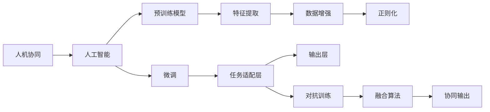

                 

# 人机协同：未来工作的核心

> 关键词：人机协同, 人工智能, 自动化, 智能系统, 工作转型, 生产力提升, 技术赋能

## 1. 背景介绍

在信息时代的浪潮下，人工智能（AI）正迅速渗透到各行各业，改变着人类的生产生活方式。特别是随着深度学习、大数据、自然语言处理等技术的不断进步，AI已经能够与人类协同工作，共同完成复杂的任务。这种人机协同的工作模式，不仅提升了工作效率和生产力，还为人类开辟了新的工作机会和职业路径。

### 1.1 问题由来

随着AI技术的快速发展，人机协同逐渐成为未来工作的核心。从简单的自动化处理到复杂的智能决策，AI在多个领域展现了其强大的应用潜力。例如，在制造业中，AI可以帮助优化生产流程，提高生产效率；在金融行业，AI可以辅助风险评估和投资决策；在医疗领域，AI可以辅助疾病诊断和个性化治疗方案制定。

然而，尽管AI技术在许多领域已经取得了显著进展，但其在实际应用中也存在一些挑战。例如，如何在确保AI输出的准确性和可靠性的同时，增强人机协同的协作性和灵活性？如何在维护AI技术发展的同时，保障数据隐私和伦理安全？如何通过技术手段提升人机协同系统的可解释性和透明度？这些问题都值得我们深入思考和探索。

### 1.2 问题核心关键点

为了有效应对上述挑战，本节将重点介绍人机协同的核心概念及其与人工智能技术的联系。通过理解这些关键概念，我们可以更好地把握人机协同的工作模式，并制定出有效的解决方案。

## 2. 核心概念与联系

### 2.1 核心概念概述

人机协同（Human-Machine Collaboration, HMC）是指在AI技术辅助下，人与机器共同完成复杂任务的过程。这种协同模式充分利用了人类在创造力、情感理解和情境感知方面的优势，以及AI在数据处理、模式识别和自动化决策方面的能力。

AI技术，特别是深度学习和大数据技术，为人机协同提供了强大的技术支撑。通过预训练模型和微调技术，AI模型可以学习大量的知识，并根据具体任务进行参数调整，从而实现高效的人机协同工作。

### 2.2 核心概念原理和架构的 Mermaid 流程图



这个流程图展示了人机协同的核心工作流程：

1. 人机协同以人工智能为支撑，通过预训练模型进行基础知识的学习。
2. 预训练模型经过微调，针对具体任务进行参数调整。
3. 微调后的模型通过特征提取和任务适配层进行任务相关知识的提取和处理。
4. 最终通过输出层生成协同结果，数据增强和对抗训练进一步提高模型的鲁棒性。
5. 融合算法将人机输出进行协同处理，确保协同结果的准确性和稳定性。

## 3. 核心算法原理 & 具体操作步骤

### 3.1 算法原理概述

人机协同的核心算法原理基于深度学习模型，特别是Transformer架构。通过预训练模型和微调技术，AI模型可以学习大量的知识，并根据具体任务进行参数调整，从而实现高效的人机协同工作。

### 3.2 算法步骤详解

#### 3.2.1 预训练阶段

1. **数据收集**：收集大规模无标签数据，作为预训练模型的训练集。
2. **模型构建**：使用深度学习框架（如TensorFlow、PyTorch等）构建预训练模型。
3. **预训练**：在预训练集上进行自监督学习任务，如掩码语言模型（MLM）、下一句预测（NSP）等。
4. **模型保存**：将预训练好的模型保存下来，以便后续微调使用。

#### 3.2.2 微调阶段

1. **模型加载**：加载预训练模型，并解冻部分或全部层。
2. **任务适配**：根据具体任务，设计任务适配层，如分类器、回归器、生成器等。
3. **数据准备**：准备标注数据集，将其划分为训练集、验证集和测试集。
4. **模型微调**：在训练集上进行微调，使用小批量梯度下降等优化算法更新模型参数。
5. **验证和测试**：在验证集上评估模型性能，并调整超参数；在测试集上测试模型效果。

### 3.3 算法优缺点

人机协同算法具有以下优点：

1. **高效性**：通过预训练和微调技术，AI模型可以快速适应新任务，提升工作效率。
2. **灵活性**：AI模型可以根据任务需求进行参数调整，具有很强的适应性。
3. **准确性**：通过微调和数据增强等技术，AI模型可以在特定任务上获得高精度输出。
4. **扩展性**：AI模型可以通过不断的微调和数据积累，不断提升性能。

同时，也存在一些缺点：

1. **依赖标注数据**：微调过程需要大量标注数据，数据收集和标注成本较高。
2. **模型复杂性**：深度学习模型较为复杂，训练和推理过程需要较高级的硬件资源。
3. **可解释性不足**：AI模型的输出缺乏可解释性，难以理解其决策过程。
4. **伦理和安全问题**：AI模型可能存在偏见，输出可能不安全，需要进行严格的数据和算法审查。

### 3.4 算法应用领域

人机协同技术已经广泛应用于多个领域，包括但不限于：

- **医疗健康**：AI辅助疾病诊断、个性化治疗方案制定等。
- **金融服务**：AI辅助风险评估、投资决策等。
- **制造业**：AI优化生产流程、提高生产效率等。
- **智能客服**：AI辅助客户服务、智能推荐等。
- **自动驾驶**：AI辅助车辆控制、路径规划等。

这些应用领域展示了人机协同技术的强大潜力和广泛适用性，为各行各业带来了新的发展机遇。

## 4. 数学模型和公式 & 详细讲解 & 举例说明

### 4.1 数学模型构建

在人机协同中，常见的数学模型包括监督学习模型和强化学习模型。

#### 监督学习模型

1. **模型定义**：$M_{\theta}(x)$：输入为$x$，输出为$y$的模型。
2. **损失函数**：$L(M_{\theta}, D)$：用于衡量模型预测输出与真实标签之间的差异。
3. **优化目标**：$\theta = \mathop{\arg\min}_{\theta} L(M_{\theta}, D)$：最小化经验风险，即在训练集$D$上优化模型参数$\theta$。

#### 强化学习模型

1. **状态-行动-奖励**：$(s, a, r)$：状态$s$、行动$a$和奖励$r$。
2. **策略**：$\pi(a|s)$：在状态$s$下采取行动$a$的概率分布。
3. **价值函数**：$V(s)$：在状态$s$下的长期累积奖励。
4. **优化目标**：最大化期望累积奖励：$\max_{\pi} \mathbb{E}[R]$。

### 4.2 公式推导过程

以监督学习模型为例，推导损失函数和优化目标：

1. **交叉熵损失函数**：
$$L(M_{\theta}, D) = -\frac{1}{N} \sum_{i=1}^N [y_i\log M_{\theta}(x_i) + (1-y_i)\log(1-M_{\theta}(x_i))]$$

2. **梯度下降更新规则**：
$$\theta \leftarrow \theta - \eta \nabla_{\theta}L(M_{\theta}, D)$$

其中，$\eta$为学习率，$\nabla_{\theta}L(M_{\theta}, D)$为损失函数对模型参数$\theta$的梯度。

### 4.3 案例分析与讲解

以智能客服系统为例，展示人机协同的具体应用过程：

1. **数据收集**：收集历史客服对话记录。
2. **预训练模型**：使用BERT等预训练模型进行语言理解。
3. **微调模型**：在客户咨询上下文和历史对话记录上微调BERT模型。
4. **任务适配**：设计意图识别和响应生成任务适配层。
5. **模型评估**：在测试集上评估模型效果。
6. **系统部署**：将微调后的模型集成到智能客服系统中，实现自动响应客户咨询。

## 5. 项目实践：代码实例和详细解释说明

### 5.1 开发环境搭建

1. **环境准备**：安装Python、TensorFlow等深度学习框架，安装BERT预训练模型。
2. **数据准备**：准备历史客服对话记录，划分为训练集、验证集和测试集。
3. **模型加载**：加载BERT预训练模型，解冻顶层部分层。
4. **任务适配**：设计意图识别和响应生成任务适配层。

### 5.2 源代码详细实现

以意图识别为例，展示代码实现过程：

```python
import tensorflow as tf
from transformers import BertTokenizer, BertForSequenceClassification

# 加载模型和分词器
model = BertForSequenceClassification.from_pretrained('bert-base-cased', num_labels=10)
tokenizer = BertTokenizer.from_pretrained('bert-base-cased')

# 数据预处理
def preprocess(text):
    tokens = tokenizer.encode(text, add_special_tokens=True)
    return tokens, 1 if tokens[0] == tokenizer.cls_token_id else 0

# 模型训练
model.compile(optimizer=tf.keras.optimizers.Adam(learning_rate=2e-5),
              loss=tf.keras.losses.SparseCategoricalCrossentropy(from_logits=True),
              metrics=[tf.keras.metrics.SparseCategoricalAccuracy()])

# 训练过程
model.fit(train_data, epochs=5, validation_data=val_data)
```

### 5.3 代码解读与分析

- **模型加载**：使用`BertForSequenceClassification`类加载BERT模型，指定标签数为10。
- **数据预处理**：定义预处理函数，将输入文本转换为分词器表示的ID，并标注意图标签。
- **模型编译**：设置优化器、损失函数和评估指标。
- **模型训练**：使用`fit`方法进行模型训练，设置训练轮数为5。

## 6. 实际应用场景

### 6.1 智能客服系统

智能客服系统是人机协同技术的重要应用之一。传统的客服系统依赖于大量人力，高峰期响应慢，且一致性和专业性难以保证。使用预训练模型和微调技术，智能客服系统可以7x24小时不间断服务，快速响应客户咨询，用自然流畅的语言解答各类常见问题。

### 6.2 金融舆情监测

金融机构需要实时监测市场舆论动向，以便及时应对负面信息传播，规避金融风险。传统的人工监测方式成本高、效率低，难以应对网络时代海量信息爆发的挑战。基于人机协同的文本分类和情感分析技术，金融舆情监测系统能够自动判断文本属于何种主题，情感倾向是正面、中性还是负面。将系统接入实时抓取的网络文本数据，自动监测不同主题下的情感变化趋势，一旦发现负面信息激增等异常情况，系统便会自动预警，帮助金融机构快速应对潜在风险。

### 6.3 个性化推荐系统

当前的推荐系统往往只依赖用户的历史行为数据进行物品推荐，无法深入理解用户的真实兴趣偏好。基于人机协同的推荐系统可以更好地挖掘用户行为背后的语义信息，从而提供更精准、多样的推荐内容。通过微调预训练模型，推荐系统能够从文本内容中准确把握用户的兴趣点，生成个性化的推荐列表。

### 6.4 未来应用展望

伴随预训练模型和微调方法的持续演进，人机协同技术将在更多领域得到应用，为传统行业带来变革性影响。

- **智慧医疗**：AI辅助疾病诊断、个性化治疗方案制定等。
- **智能教育**：AI辅助作业批改、学情分析、知识推荐等。
- **智慧城市治理**：AI辅助城市事件监测、舆情分析、应急指挥等环节，提高城市管理的自动化和智能化水平。
- **自动驾驶**：AI辅助车辆控制、路径规划等。

## 7. 工具和资源推荐

### 7.1 学习资源推荐

1. **Coursera《深度学习专项课程》**：由深度学习领域的专家开设的课程，涵盖深度学习基础和应用，适合初学者学习。
2. **Kaggle竞赛平台**：参与Kaggle竞赛，通过实际项目积累实践经验。
3. **OpenAI的AI训练营**：提供AI技术和应用的培训资源，提升AI应用能力。
4. **HuggingFace官方文档**：提供预训练模型的详细介绍和微调示例，适合深入学习。
5. **IBM Watson**：提供AI应用场景的实战案例和资源，助力AI技术落地应用。

### 7.2 开发工具推荐

1. **TensorFlow**：开源深度学习框架，支持大规模分布式训练，适合工业应用。
2. **PyTorch**：灵活易用的深度学习框架，支持动态图和静态图，适合科研和学术应用。
3. **Keras**：高层次的深度学习框架，适合快速原型设计和实验。
4. **Jupyter Notebook**：交互式笔记本环境，方便数据探索和模型调试。
5. **AWS SageMaker**：云端机器学习平台，支持模型部署和自动化调参。

### 7.3 相关论文推荐

1. **Attention is All You Need**：Transformer架构的原论文，奠定深度学习模型在NLP领域的基础。
2. **BERT: Pre-training of Deep Bidirectional Transformers for Language Understanding**：提出BERT模型，引入掩码语言模型预训练任务，刷新多项NLP任务SOTA。
3. **AdaLoRA: Adaptive Low-Rank Adaptation for Parameter-Efficient Fine-Tuning**：提出自适应低秩适应的微调方法，在参数效率和精度之间取得了新的平衡。
4. **Prompt-based Learning**：引入基于连续型Prompt的微调范式，为如何充分利用预训练知识提供了新的思路。
5. **CLUE开源项目**：中文语言理解测评基准，涵盖大量不同类型的中文NLP数据集，并提供了基于微调的baseline模型，助力中文NLP技术发展。

## 8. 总结：未来发展趋势与挑战

### 8.1 研究成果总结

人机协同技术已经成为未来工作的核心，广泛应用于金融、医疗、智能客服等多个领域。基于深度学习模型的预训练和微调技术，使得AI模型能够高效地与人类协同工作，提升工作效率和生产力。

### 8.2 未来发展趋势

未来，人机协同技术将在以下几个方面取得突破：

1. **模型规模持续增大**：伴随算力成本的下降和数据规模的扩张，预训练模型和微调模型的参数量将持续增长。超大规模语言模型蕴含的丰富语言知识，将支撑更加复杂多变的任务。
2. **技术应用场景多样化**：人机协同技术将拓展到更多领域，如智慧医疗、智慧教育、智慧城市等，为各行各业带来新的发展机遇。
3. **数据隐私和伦理安全**：伴随数据量的增加，数据隐私和伦理安全问题将得到更多关注。如何在保护隐私的同时，提高AI系统的可信度和透明性，将是未来的一个重要研究方向。

### 8.3 面临的挑战

尽管人机协同技术已经取得了显著进展，但在其发展过程中也面临诸多挑战：

1. **数据标注成本**：大规模标注数据的收集和标注成本较高，数据隐私和伦理安全问题值得关注。
2. **模型复杂性**：深度学习模型的训练和推理过程复杂，需要高性能硬件资源支持。
3. **可解释性不足**：AI系统的输出缺乏可解释性，难以理解其决策过程。
4. **伦理和安全问题**：AI系统可能存在偏见和有害输出，需要进行严格的数据和算法审查。

### 8.4 研究展望

未来，人机协同技术需要在以下几个方面进行深入研究：

1. **无监督和半监督学习**：摆脱对大规模标注数据的依赖，利用自监督学习、主动学习等方法，提高数据利用效率。
2. **参数高效和计算高效微调**：开发更参数高效和计算高效的微调方法，在保证性能的同时，提高资源利用效率。
3. **模型解释性**：提高AI系统的可解释性，增强用户信任和系统的透明性。
4. **伦理和隐私保护**：加强数据隐私保护，确保AI系统输出的合法性和安全性。

通过在这些领域的持续研究，人机协同技术将不断提升其应用效果和可靠性，为各行各业带来更多的创新和变革。

## 9. 附录：常见问题与解答

### 9.1 问题1：人机协同技术是否适用于所有行业？

答：人机协同技术虽然已经在多个领域取得显著成效，但并非所有行业都适用。例如，对于需要高精度和高可靠性任务的领域，如医疗、金融等，需要更多基于人类经验和专业知识的参与。

### 9.2 问题2：人机协同技术是否会取代人类工作？

答：人机协同技术不会取代人类工作，而是与人类协作，共同完成复杂任务。AI系统可以处理重复性和高强度的任务，而人类则可以处理创造性、情境感知和情感理解等复杂任务。

### 9.3 问题3：如何提高人机协同系统的可靠性？

答：提高人机协同系统的可靠性需要从多个方面入手，包括数据质量、模型训练、算法优化等。同时，引入人工干预和监督机制，确保系统输出的正确性和可信度。

### 9.4 问题4：人机协同技术如何应对伦理和隐私问题？

答：人机协同技术需要在数据收集、存储和处理过程中，严格遵循数据隐私和伦理安全要求。通过匿名化、差分隐私等技术，保护用户数据隐私。同时，引入伦理审查机制，确保系统输出的合法性和公正性。

### 9.5 问题5：未来人机协同技术的发展方向是什么？

答：未来人机协同技术的发展方向包括：1）拓展应用领域，如智慧医疗、智慧教育等；2）提高模型解释性和透明性，增强用户信任；3）加强数据隐私和伦理安全保护；4）开发更加高效和灵活的微调方法。

---

作者：禅与计算机程序设计艺术 / Zen and the Art of Computer Programming

