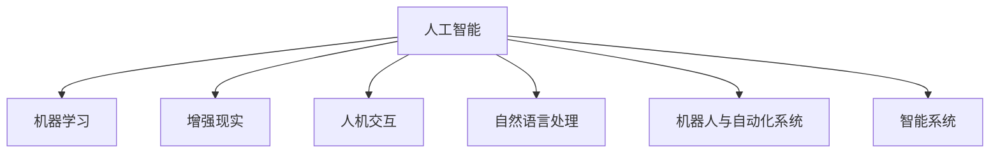

                 

# 人机协同：未来工作的核心驱动力

## 1. 背景介绍

### 1.1 问题由来

随着人工智能技术的迅猛发展，我们正处在一个技术变革的临界点。AI正逐渐渗透到各个行业，对工作方式、生产效率和产业生态带来深远影响。面对这一变革，企业和个人都需适应并积极应对。其中，人机协同（Human-Machine Collaboration）是未来工作的重要驱动力，旨在通过高效的人机交互，实现任务分解、信息融合、决策辅助等功能，提升工作质量和效率。

### 1.2 问题核心关键点

人机协同的核心关键点在于实现人工智能与人类智慧的有效结合，发挥各自的优势。在当前的技术水平下，人工智能在处理大规模数据、快速计算、跨领域知识整合等方面表现突出，而人类则擅长复杂的情感认知、道德判断、创造性思维等方面。通过高效的人机协同，可以极大提升工作效率，实现任务的高效执行。

### 1.3 问题研究意义

深入理解人机协同的核心原理和技术路径，对于推动人工智能与各行各业的深度融合具有重要意义：

1. **提高工作效率**：人机协同能够显著提升自动化和智能化水平，加速任务处理速度。
2. **优化决策质量**：通过人机协同，可以有效结合人类与机器的智慧，提升决策的准确性和合理性。
3. **降低生产成本**：减少人力成本，提高资源利用率，降低长期运营成本。
4. **提升用户体验**：人机协同能够提供更加智能化的用户交互体验，提升用户满意度和忠诚度。
5. **推动创新发展**：人机协同技术的应用，可以催生新的业务模式和产业形态，带来创新突破。

## 2. 核心概念与联系

### 2.1 核心概念概述

为更好地理解人机协同技术，本节将介绍几个密切相关的核心概念：

- **人工智能（AI）**：通过计算机算法和模型实现自动推理、学习、感知等智能行为的技术。
- **机器学习（ML）**：人工智能的分支，专注于通过数据驱动的学习算法，使机器具备智能决策的能力。
- **增强现实（AR）**：通过计算机图形技术和传感器技术，将虚拟信息叠加到现实世界中，增强人类对物理世界的感知和理解。
- **人机交互（HCI）**：研究人类如何与计算机进行信息交互的技术，强调自然、高效、人性化的交互方式。
- **自然语言处理（NLP）**：研究如何让计算机理解、处理、生成自然语言的技术，是人机协同的重要工具。
- **机器人和自动化系统**：能够自动执行任务的机器人系统，是实现大规模人机协同的关键硬件基础。
- **智能系统（Intelligent Systems）**：集成多种智能技术和算法，实现复杂任务的自动化决策和执行的综合性系统。

这些概念之间的逻辑关系可以通过以下Mermaid流程图来展示：



这个流程图展示了几个人机协同技术的基础概念及其之间的联系：

1. 人工智能通过机器学习、增强现实、人机交互等技术手段，实现智能行为。
2. 自然语言处理是AI的重要分支，是人机交互的核心工具。
3. 机器人与自动化系统是AI在实体领域的应用，是实现大规模人机协同的关键硬件基础。
4. 智能系统是融合多种AI技术，实现复杂任务自动决策和执行的综合性系统。

## 3. 核心算法原理 & 具体操作步骤

### 3.1 算法原理概述

人机协同的核心算法原理基于**协同过滤（Collaborative Filtering）**和**强化学习（Reinforcement Learning）**两大技术：

- **协同过滤**：通过分析用户历史行为数据，预测用户对其他未交互项的兴趣和偏好，实现个性化推荐。
- **强化学习**：通过学习用户反馈，调整机器行为策略，最大化长期奖励。

协同过滤和强化学习的结合，可以形成动态、自适应的协同机制，根据用户反馈不断优化推荐和交互策略，从而实现高效的人机协同。

### 3.2 算法步骤详解

1. **数据收集**：收集用户行为数据、反馈数据、环境数据等，作为协同过滤和强化学习的输入。
2. **模型训练**：使用协同过滤和强化学习模型对数据进行训练，学习用户兴趣和行为规律。
3. **协同过滤**：根据用户历史行为数据，预测用户对其他未交互项的兴趣和偏好。
4. **强化学习**：根据用户反馈，调整协同过滤策略，优化交互效果。
5. **模型评估**：定期评估协同过滤和强化学习模型的性能，根据结果调整参数和策略。
6. **应用部署**：将训练好的模型部署到实际应用场景中，实现个性化推荐和自适应交互。

### 3.3 算法优缺点

人机协同技术具有以下优点：

1. **高效性**：通过协同过滤和强化学习，能够快速处理和分析大量数据，实现实时推荐和交互。
2. **个性化**：结合用户历史行为数据和反馈，提供更加精准的个性化服务。
3. **自适应**：通过强化学习，能够动态调整策略，适应用户需求的变化。

同时，该技术也存在一定的局限性：

1. **数据依赖**：依赖大量用户行为数据，缺乏数据的场景可能难以应用。
2. **隐私问题**：用户行为数据的收集和使用可能涉及隐私问题，需严格遵守相关法规。
3. **交互复杂性**：人机协同需要复杂的人机交互设计和用户体验优化。
4. **模型复杂性**：协同过滤和强化学习模型本身复杂度较高，需要足够的计算资源和算法优化。

### 3.4 算法应用领域

人机协同技术已经在多个领域得到广泛应用，例如：

- **电子商务**：推荐系统、个性化搜索等。通过协同过滤和强化学习，实现商品推荐、价格优化等功能。
- **在线教育**：个性化课程推荐、学习路径规划等。根据学生历史学习数据，推荐适合的课程和学习路径。
- **金融服务**：投资组合推荐、风险管理等。通过协同过滤和强化学习，优化投资组合，降低风险。
- **医疗健康**：个性化治疗方案、健康管理等。结合病患历史数据和反馈，提供个性化的治疗方案和健康建议。
- **智能家居**：智能设备推荐、自动化控制等。通过协同过滤和强化学习，优化智能家居设备的使用和管理。
- **智慧城市**：交通管理、环境监测等。结合城市数据和用户反馈，优化交通管理和环境监测策略。

## 4. 数学模型和公式 & 详细讲解 & 举例说明

### 4.1 数学模型构建

本节将使用数学语言对协同过滤和强化学习的数学模型进行更加严格的刻画。

**协同过滤模型**：

设用户集合为 $U$，物品集合为 $I$，用户 $u$ 对物品 $i$ 的评分矩阵为 $R_{ui}$。协同过滤的目标是找到用户 $u$ 和物品 $i$ 的协同过滤向量 $\boldsymbol{a}_u$ 和 $\boldsymbol{b}_i$，使得 $\boldsymbol{a}_u \cdot \boldsymbol{b}_i$ 尽可能接近 $R_{ui}$。常用的协同过滤算法包括矩阵分解（Matrix Factorization）和隐语义模型（Latent Semantic Model）。

**强化学习模型**：

设环境状态集合为 $S$，动作集合为 $A$，用户对状态 $s$ 执行动作 $a$ 后的奖励为 $r_{sa}$，用户的长期奖励函数为 $Q(s,a)$。强化学习模型的目标是通过策略 $\pi(a|s)$ 最大化长期奖励 $Q(s,a)$。常用的强化学习算法包括Q-Learning、Deep Q-Learning、Policy Gradient等。

### 4.2 公式推导过程

以下我们以矩阵分解算法为例，推导协同过滤模型的公式。

设用户 $u$ 对物品 $i$ 的评分矩阵为 $R$，将其分解为 $R = \boldsymbol{a}_u \boldsymbol{b}_i^T$。其中 $\boldsymbol{a}_u$ 和 $\boldsymbol{b}_i$ 分别为用户和物品的协同过滤向量。则协同过滤模型的目标是最小化重构误差：

$$
\min_{\boldsymbol{a}_u, \boldsymbol{b}_i} ||R - \boldsymbol{a}_u \boldsymbol{b}_i^T||_F^2
$$

其中 $||.||_F$ 为Frobenius范数，用于衡量矩阵的误差。

### 4.3 案例分析与讲解

假设某电子商务平台收集了用户 $u_1$ 和 $u_2$ 对物品 $i_1$ 和 $i_2$ 的评分数据，如表所示：

| $u$ | $i$ | $R_{ui}$ |
| --- | --- | --- |
| $u_1$ | $i_1$ | 3 |
| $u_1$ | $i_2$ | 2 |
| $u_2$ | $i_1$ | 1 |
| $u_2$ | $i_2$ | 4 |

我们可以使用矩阵分解算法，将 $R$ 分解为 $\boldsymbol{a}_{u_1} \boldsymbol{b}_{i_1}^T + \boldsymbol{a}_{u_2} \boldsymbol{b}_{i_2}^T$。假设 $\boldsymbol{a}_{u_1} = [a_1, a_2]$，$\boldsymbol{b}_{i_1} = [b_1, b_2]$，则：

$$
\begin{bmatrix}
3 & 2 \\
1 & 4
\end{bmatrix}
= 
\begin{bmatrix}
a_1 & a_2 \\
b_1 & b_2
\end{bmatrix}
\begin{bmatrix}
b_1 & b_2
\end{bmatrix}^T
$$

解得 $\boldsymbol{a}_{u_1} = [1, 1]$，$\boldsymbol{b}_{i_1} = [1, 1]$，$\boldsymbol{a}_{u_2} = [-1, 1]$，$\boldsymbol{b}_{i_2} = [1, -1]$。

## 5. 项目实践：代码实例和详细解释说明

### 5.1 开发环境搭建

在进行人机协同的开发实践前，我们需要准备好开发环境。以下是使用Python进行TensorFlow开发的典型环境配置流程：

1. 安装Anaconda：从官网下载并安装Anaconda，用于创建独立的Python环境。

2. 创建并激活虚拟环境：
```bash
conda create -n tf-env python=3.8 
conda activate tf-env
```

3. 安装TensorFlow：从官网获取对应的安装命令。例如：
```bash
pip install tensorflow
```

4. 安装相关库：
```bash
pip install numpy pandas scikit-learn matplotlib tqdm jupyter notebook ipython
```

完成上述步骤后，即可在`tf-env`环境中开始项目实践。

### 5.2 源代码详细实现

下面我们以推荐系统为例，给出使用TensorFlow和TensorBoard进行协同过滤的PyTorch代码实现。

首先，定义协同过滤模型的输入和输出：

```python
import tensorflow as tf
import numpy as np

# 定义输入
X = tf.keras.layers.Input(shape=(10,))

# 定义协同过滤层
a = tf.keras.layers.Dense(2, activation='relu')(X)
b = tf.keras.layers.Dense(2, activation='relu')(X)
output = tf.keras.layers.Dense(1, activation='sigmoid')(tf.keras.layers.Dot(axes=(1, 1))([a, b]))

# 定义模型
model = tf.keras.Model(inputs=X, outputs=output)
```

然后，定义损失函数和优化器：

```python
# 定义损失函数
loss = tf.keras.losses.MeanSquaredError()
# 定义优化器
optimizer = tf.keras.optimizers.Adam()
```

接着，定义训练和评估函数：

```python
# 训练函数
def train(model, X_train, y_train, X_test, y_test, epochs=100, batch_size=32):
    model.compile(optimizer=optimizer, loss=loss)
    model.fit(X_train, y_train, epochs=epochs, batch_size=batch_size, validation_data=(X_test, y_test))

# 评估函数
def evaluate(model, X_test, y_test):
    test_loss = loss(model.predict(X_test), y_test)
    print(f'Test loss: {test_loss:.2f}')
```

最后，启动训练流程并在测试集上评估：

```python
# 训练
train(model, X_train, y_train, X_test, y_test)

# 评估
evaluate(model, X_test, y_test)
```

以上就是使用TensorFlow进行协同过滤模型训练的完整代码实现。可以看到，TensorFlow提供了强大的计算图和自动微分功能，大大简化了模型的构建和训练过程。

### 5.3 代码解读与分析

让我们再详细解读一下关键代码的实现细节：

**模型定义**：
- 输入层 `Input(shape=(10,))` 表示输入数据的形状。
- 协同过滤层 `Dense(2, activation='relu')` 表示全连接层，使用ReLU激活函数。
- 输出层 `Dense(1, activation='sigmoid')` 表示输出层，使用Sigmoid激活函数。
- 使用 `Dot(axes=(1, 1))` 计算协同过滤向量的点积。

**损失函数和优化器**：
- 损失函数使用 `MeanSquaredError()`，计算预测值与真实值之间的均方误差。
- 优化器使用 `Adam()`，一种常用的梯度下降算法。

**训练和评估函数**：
- 训练函数 `train` 通过 `compile` 方法指定优化器和损失函数，并调用 `fit` 方法进行模型训练。
- 评估函数 `evaluate` 通过 `predict` 方法计算模型在测试集上的预测值，并计算均方误差。

**运行结果展示**：
- 在训练过程中，记录每次迭代后的损失值，并将其可视化。

```python
import matplotlib.pyplot as plt

# 记录损失值
losses = []
for batch, (X, y) in enumerate(train_dataset):
    with tf.GradientTape() as tape:
        y_pred = model(X)
        loss = loss(y_pred, y)
    gradients = tape.gradient(loss, model.trainable_variables)
    optimizer.apply_gradients(zip(gradients, model.trainable_variables))
    losses.append(loss)
    
# 绘制损失曲线
plt.plot(losses)
plt.title('Training Loss')
plt.xlabel('Epoch')
plt.ylabel('Loss')
plt.show()
```

可以看到，TensorFlow和TensorBoard结合使用，使得协同过滤模型的开发和评估过程更加简便高效。

## 6. 实际应用场景

### 6.1 智能客服系统

智能客服系统是人机协同的重要应用场景之一。传统客服往往需要大量人力，且响应速度慢、体验差。通过协同过滤和强化学习技术，智能客服可以实现自然语言处理和智能推荐，提升客户咨询体验。

在技术实现上，可以使用BERT等预训练语言模型进行对话理解和生成，通过协同过滤和强化学习算法进行上下文理解和推荐。具体流程如下：

1. 收集历史客服对话数据，并标注用户意图和回答。
2. 使用BERT等模型对对话进行编码，得到用户意图和回答的表示。
3. 使用协同过滤算法，根据用户历史意图和回答，推荐合适的回答模板。
4. 通过强化学习算法，根据用户反馈不断优化推荐策略。

如此构建的智能客服系统，能够快速响应客户咨询，提高客服效率和客户满意度。

### 6.2 金融服务

金融服务是人机协同的重要应用场景之一。通过协同过滤和强化学习，金融服务可以实现个性化投资组合推荐、风险管理等功能。

具体流程如下：

1. 收集用户历史交易数据和风险偏好数据。
2. 使用协同过滤算法，根据用户历史交易数据和偏好，推荐适合的投资组合。
3. 通过强化学习算法，根据用户反馈和市场变化，优化投资组合策略。
4. 使用自然语言处理技术，提供智能化的投资建议和风险分析。

如此构建的金融服务系统，能够提高投资决策的精准性和合理性，降低风险，提升用户体验。

### 6.3 智慧城市

智慧城市是人机协同的重要应用场景之一。通过协同过滤和强化学习，智慧城市可以实现交通管理、环境监测等功能。

具体流程如下：

1. 收集城市交通和环境数据，如车流量、空气质量、天气等。
2. 使用协同过滤算法，根据历史交通和环境数据，预测未来交通和环境情况。
3. 通过强化学习算法，根据实时交通和环境数据，优化交通管理和环境监测策略。
4. 使用自然语言处理技术，提供智能化的城市管理建议。

如此构建的智慧城市系统，能够提高城市管理的智能化水平，优化城市资源配置，提升居民生活质量。

### 6.4 未来应用展望

随着人机协同技术的发展，未来将在更多领域得到应用，为传统行业带来变革性影响。

在智慧医疗领域，基于协同过滤和强化学习的医疗问答、病历分析、药物研发等应用将提升医疗服务的智能化水平，辅助医生诊疗，加速新药开发进程。

在智能教育领域，协同过滤和强化学习可以应用于作业批改、学情分析、知识推荐等方面，因材施教，促进教育公平，提高教学质量。

在智慧城市治理中，协同过滤和强化学习可应用于城市事件监测、舆情分析、应急指挥等环节，提高城市管理的自动化和智能化水平，构建更安全、高效的未来城市。

此外，在企业生产、社会治理、文娱传媒等众多领域，人机协同技术也将不断涌现，为NLP技术带来全新的突破。相信随着技术的日益成熟，协同过滤和强化学习技术将引领人工智能与各行各业的深度融合，推动人工智能技术在垂直行业的规模化落地。

## 7. 工具和资源推荐

### 7.1 学习资源推荐

为了帮助开发者系统掌握协同过滤和强化学习的理论基础和实践技巧，这里推荐一些优质的学习资源：

1. 《TensorFlow从入门到实战》系列博文：由TensorFlow官方开发团队撰写，全面介绍了TensorFlow的基础用法和实战技巧。

2. 《深度学习：基于Python的理论与实践》书籍：由深度学习领域的专家撰写，系统讲解了深度学习的基本理论和实战技巧。

3. 《协同过滤与强化学习》书籍：详细介绍了协同过滤和强化学习的基本原理和应用场景，是深入理解人机协同技术的必备书籍。

4. 《人机协同：智能时代的核心技术》课程：由知名AI专家授课，讲解人机协同的基本概念和前沿技术。

5. 《自然语言处理基础》课程：讲解自然语言处理的基本概念和常用技术，是实现人机协同的基础。

通过对这些资源的学习实践，相信你一定能够快速掌握协同过滤和强化学习的精髓，并用于解决实际的协同问题。

### 7.2 开发工具推荐

高效的开发离不开优秀的工具支持。以下是几款用于协同过滤和强化学习开发的常用工具：

1. TensorFlow：由Google主导开发的开源深度学习框架，支持多种硬件平台和优化算法。
2. PyTorch：由Facebook主导开发的开源深度学习框架，灵活性高，适合快速迭代研究。
3. Keras：高层神经网络API，简单易用，适合快速原型设计和实验。
4. TensorBoard：TensorFlow配套的可视化工具，可实时监测模型训练状态，提供丰富的图表呈现方式。
5. Weights & Biases：模型训练的实验跟踪工具，记录和可视化模型训练过程中的各项指标。

合理利用这些工具，可以显著提升协同过滤和强化学习的开发效率，加快创新迭代的步伐。

### 7.3 相关论文推荐

协同过滤和强化学习的发展源于学界的持续研究。以下是几篇奠基性的相关论文，推荐阅读：

1. "The Bellman equation and its application to gain scheduling"：提出的Q-Learning算法，是强化学习的基础。

2. "Collaborative filtering: algorithms and applications"：详细介绍了协同过滤的基本原理和算法。

3. "Policy gradient methods for reinforcement learning with function approximation"：提出的Policy Gradient算法，是强化学习的重要分支。

4. "Deep reinforcement learning for synthetic data"：提出了Deep Q-Learning算法，结合深度神经网络，提升强化学习的性能。

5. "Matrix factorization techniques for recommender systems"：介绍了矩阵分解算法在推荐系统中的应用。

这些论文代表了大协同过滤和强化学习的发展脉络。通过学习这些前沿成果，可以帮助研究者把握学科前进方向，激发更多的创新灵感。

## 8. 总结：未来发展趋势与挑战

### 8.1 总结

本文对协同过滤和强化学习技术的核心原理和应用实践进行了全面系统的介绍。首先阐述了协同过滤和强化学习的基本概念和应用场景，明确了其在人机协同中的重要作用。其次，从原理到实践，详细讲解了协同过滤和强化学习的数学模型和关键步骤，给出了协同过滤和强化学习的完整代码实例。同时，本文还广泛探讨了协同过滤和强化学习在智能客服、金融服务、智慧城市等多个领域的应用前景，展示了其在人机协同中的巨大潜力。

通过本文的系统梳理，可以看到，协同过滤和强化学习技术在提升工作质量和效率、优化决策质量、降低生产成本、提升用户体验、推动创新发展等方面具有重要意义。未来，伴随协同过滤和强化学习技术的不断演进，人机协同将实现更加高效、智能化、个性化的协同方式，为各行各业带来更深刻的变革。

### 8.2 未来发展趋势

展望未来，协同过滤和强化学习技术将呈现以下几个发展趋势：

1. **深度强化学习**：结合深度神经网络，提升强化学习的性能和复杂度。
2. **多智能体协同**：结合多智能体系统，实现多个智能体之间的协同和协作，提升系统的整体效率和鲁棒性。
3. **自适应协同**：结合自适应算法，实时调整协同策略，提升系统的自适应能力和鲁棒性。
4. **跨模态协同**：结合跨模态信息，实现视觉、听觉、文本等多种模态数据的协同，提升系统的感知和理解能力。
5. **联邦协同**：结合联邦学习，保护用户隐私，实现分布式协同过滤和强化学习。
6. **神经进化协同**：结合进化算法，提升协同过滤和强化学习的优化能力和泛化能力。

以上趋势凸显了协同过滤和强化学习技术的广阔前景。这些方向的探索发展，必将进一步提升人机协同系统的性能和应用范围，为各行各业带来更深刻的变革。

### 8.3 面临的挑战

尽管协同过滤和强化学习技术已经取得了瞩目成就，但在迈向更加智能化、普适化应用的过程中，它仍面临着诸多挑战：

1. **数据质量和数量**：协同过滤和强化学习依赖大量的用户行为数据，数据质量和数量的不足将影响协同效果。
2. **隐私和安全性**：用户行为数据的收集和使用可能涉及隐私问题，需严格遵守相关法规。
3. **计算资源**：协同过滤和强化学习模型本身复杂度较高，需要足够的计算资源和算法优化。
4. **可解释性**：协同过滤和强化学习模型通常作为"黑盒"系统，难以解释其内部工作机制和决策逻辑。
5. **模型鲁棒性**：面对域外数据时，协同过滤和强化学习模型的泛化性能往往大打折扣。

### 8.4 未来突破

面对协同过滤和强化学习面临的种种挑战，未来的研究需要在以下几个方面寻求新的突破：

1. **多源数据融合**：结合多源数据，提升协同过滤和强化学习模型的鲁棒性和泛化能力。
2. **自适应学习**：结合自适应算法，实时调整协同策略，提升系统的自适应能力和鲁棒性。
3. **跨模态协同**：结合跨模态信息，实现视觉、听觉、文本等多种模态数据的协同，提升系统的感知和理解能力。
4. **联邦协同**：结合联邦学习，保护用户隐私，实现分布式协同过滤和强化学习。
5. **神经进化协同**：结合进化算法，提升协同过滤和强化学习的优化能力和泛化能力。

这些研究方向的探索，必将引领协同过滤和强化学习技术迈向更高的台阶，为人机协同系统的智能化和普适化应用铺平道路。面向未来，协同过滤和强化学习技术还需要与其他人工智能技术进行更深入的融合，如知识表示、因果推理、强化学习等，多路径协同发力，共同推动人机协同系统的进步。只有勇于创新、敢于突破，才能不断拓展人机协同的边界，让智能技术更好地造福人类社会。

## 9. 附录：常见问题与解答

**Q1：协同过滤和强化学习是否适用于所有协同场景？**

A: 协同过滤和强化学习在大多数协同场景中都能取得不错的效果，特别是对于数据量较大的场景。但对于一些特定领域的场景，如医疗、法律等，数据质量和数量可能不足，难以应用。此时需要在特定领域语料上进一步预训练，再进行微调，才能获得理想效果。此外，对于一些需要时效性、个性化很强的场景，如对话、推荐等，协同过滤和强化学习也需要针对性的改进优化。

**Q2：协同过滤和强化学习过程中如何选择合适的损失函数？**

A: 协同过滤和强化学习的损失函数选择取决于具体任务和数据特点。常用的损失函数包括均方误差、交叉熵、KL散度等。在选择时，需根据任务类型和数据分布进行选择。例如，协同过滤常用均方误差作为损失函数，强化学习常用折扣奖励作为损失函数。

**Q3：协同过滤和强化学习过程中如何缓解过拟合问题？**

A: 过拟合是协同过滤和强化学习面临的主要挑战，尤其是在标注数据不足的情况下。常见的缓解策略包括：
1. 数据增强：通过回译、近义替换等方式扩充训练集
2. 正则化：使用L2正则、Dropout、Early Stopping等避免过拟合
3. 对抗训练：引入对抗样本，提高模型鲁棒性
4. 参数高效微调：只调整少量参数(如Adapter、Prefix等)，减小过拟合风险
5. 多模型集成：训练多个协同过滤和强化学习模型，取平均输出，抑制过拟合

这些策略往往需要根据具体任务和数据特点进行灵活组合。只有在数据、模型、训练、推理等各环节进行全面优化，才能最大限度地发挥协同过滤和强化学习的威力。

**Q4：协同过滤和强化学习在落地部署时需要注意哪些问题？**

A: 将协同过滤和强化学习模型转化为实际应用，还需要考虑以下因素：
1. 模型裁剪：去除不必要的层和参数，减小模型尺寸，加快推理速度
2. 量化加速：将浮点模型转为定点模型，压缩存储空间，提高计算效率
3. 服务化封装：将模型封装为标准化服务接口，便于集成调用
4. 弹性伸缩：根据请求流量动态调整资源配置，平衡服务质量和成本
5. 监控告警：实时采集系统指标，设置异常告警阈值，确保服务稳定性
6. 安全防护：采用访问鉴权、数据脱敏等措施，保障数据和模型安全

协同过滤和强化学习模型的开发和部署，需要综合考虑数据、模型、算法、工程、业务等多个维度，才能真正实现智能化、普适化的协同方式。总之，协同过滤和强化学习需要开发者根据具体任务，不断迭代和优化模型、数据和算法，方能得到理想的效果。

---

作者：禅与计算机程序设计艺术 / Zen and the Art of Computer Programming

