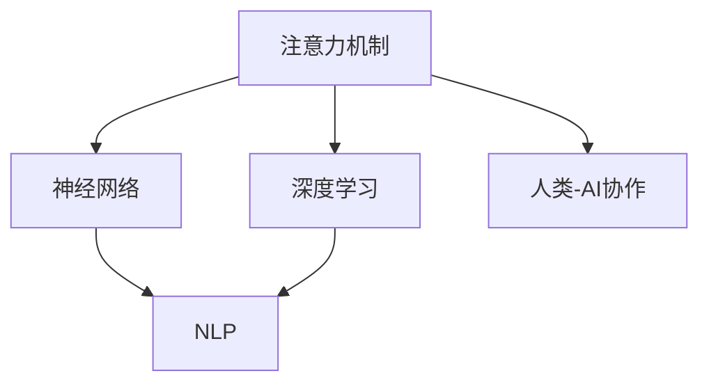

                 

# 人类-AI协作：优化注意力流

> 关键词：
- 人工智能 (AI)
- 人类-AI协作
- 注意力机制 (Attention Mechanism)
- 优化算法
- 深度学习 (Deep Learning)
- 神经网络 (Neural Network)
- 自然语言处理 (NLP)

## 1. 背景介绍

### 1.1 问题由来

在人工智能（AI）领域，尤其是自然语言处理（NLP）领域，人类-AI协作变得越来越重要。传统的AI系统往往以自动推理和计算为核心，但面对复杂的语言理解任务，如对话、问答、情感分析等，单一的计算并不足够。人类-AI协作将AI系统的推理和计算能力与人类的语言理解和推理能力结合起来，能够更有效地处理复杂任务。

注意力机制（Attention Mechanism）作为一种关键技术，已经被广泛应用于深度学习模型中，尤其是在机器翻译、文本生成等任务中。注意力机制能够帮助模型更好地理解输入序列的语义关系，提升模型的表现。但传统注意力机制在处理大规模数据时，计算和存储成本较高，无法适应实际应用中的高并发和实时性要求。

为了优化注意力流，降低计算和存储成本，同时提升模型的实时性和可解释性，本文将探讨如何通过优化注意力流，实现更高效、更准确的人类-AI协作。

### 1.2 问题核心关键点

优化注意力流的核心关键点包括：

- 如何设计高效、低成本的注意力机制。
- 如何优化注意力流，提升模型的实时性和可解释性。
- 如何结合人类的语言理解能力，进一步提升模型的性能。
- 如何应对大规模数据处理中的计算和存储瓶颈。

这些关键点将贯穿本文的探讨，帮助读者深入理解人类-AI协作的优化过程。

## 2. 核心概念与联系

### 2.1 核心概念概述

为更好地理解优化注意力流的方法，本节将介绍几个密切相关的核心概念：

- 注意力机制 (Attention Mechanism)：一种用于增强神经网络模型对输入序列中重要信息关注的机制，通过计算输入序列中每个元素的权重，使模型能够更加关注重要的部分。
- 深度学习 (Deep Learning)：一种通过多层神经网络模型进行复杂任务处理的机器学习技术。深度学习通过多层非线性变换，能够学习到更加抽象和高级的特征。
- 神经网络 (Neural Network)：由大量神经元（节点）和多层连接构成的网络结构，是深度学习的基础。
- 自然语言处理 (NLP)：一种利用计算机技术处理和分析人类语言的技术，涉及文本生成、文本分类、机器翻译等多个领域。
- 人类-AI协作：将AI系统的计算和推理能力与人类语言理解和推理能力相结合，实现更加高效和准确的自然语言处理任务。

这些核心概念之间的逻辑关系可以通过以下Mermaid流程图来展示：



这个流程图展示了几大核心概念之间的联系：

1. 注意力机制是深度学习中的关键技术之一，能够增强神经网络对输入序列中重要信息的关注。
2. 深度学习通过多层神经网络，学习到更加抽象和高级的特征，是注意力机制的基础。
3. 神经网络由大量神经元构成，是深度学习的基础结构。
4. 自然语言处理是应用深度学习和注意力机制处理人类语言的任务。
5. 人类-AI协作将AI系统的计算和推理能力与人类语言理解和推理能力相结合，实现更加高效和准确的自然语言处理任务。

## 3. 核心算法原理 & 具体操作步骤
### 3.1 算法原理概述

优化注意力流的方法基于注意力机制的设计和优化，通过改进注意力计算方式，降低计算和存储成本，提升模型的实时性和可解释性。具体来说，本文将探讨以下几个方面的优化：

- 注意力头 (Attention Head) 的设计。
- 注意力流的优化。
- 注意力计算方式的选择。
- 结合人类语言理解的优化。

### 3.2 算法步骤详解

优化注意力流的一般步骤包括：

**Step 1: 准备数据集**

- 收集和预处理任务相关的数据集，确保数据集的多样性和质量。

**Step 2: 设计注意力机制**

- 根据任务特点，设计高效的注意力机制，包括注意力头的数量、头间对齐方式、注意力计算方式等。

**Step 3: 优化注意力流**

- 使用优化算法，如AdamW、SGD等，最小化模型在训练集上的损失函数。
- 应用正则化技术，如L2正则、Dropout等，防止模型过拟合。
- 使用早停法（Early Stopping）和批标准化（Batch Normalization）等技术，加速模型训练。

**Step 4: 结合人类语言理解**

- 使用提示模板（Prompt Template）引导AI系统，结合人类的语言理解能力，提升模型的性能。

**Step 5: 测试和评估**

- 在测试集上评估模型性能，对比优化前后的精度提升。
- 使用可视化工具，如TensorBoard，监控模型训练过程和性能变化。

### 3.3 算法优缺点

优化注意力流的方法具有以下优点：

1. 提升模型的实时性。通过优化注意力流，减少计算和存储成本，提升模型的实时处理能力。
2. 增强模型的可解释性。优化后的注意力流更易于理解和解释，帮助开发者更好地理解模型的决策过程。
3. 降低计算和存储成本。优化后的注意力流使用更少的参数和计算资源，降低大规模数据处理中的成本。

同时，该方法也存在一定的局限性：

1. 模型参数较多。优化后的注意力流往往需要更多的参数，对计算资源和存储资源的要求较高。
2. 泛化能力有限。优化后的注意力流在特定任务上表现较好，但在跨领域任务上的泛化能力较弱。
3. 可解释性仍有提升空间。优化后的注意力流虽然更易于理解，但仍然存在一定的黑盒问题。

尽管存在这些局限性，但优化注意力流的方法仍然是大语言模型和AI系统优化的一个重要方向，为提升模型性能提供了新的思路。

### 3.4 算法应用领域

优化注意力流的方法在多个领域得到了广泛应用，例如：

- 机器翻译：通过优化注意力流，提升模型在机器翻译任务上的实时性和可解释性。
- 文本生成：优化后的注意力流能够更好地理解和生成文本内容，提升生成质量和可解释性。
- 对话系统：结合人类语言理解和推理能力，优化注意力流，提升对话系统的自然流畅性和交互体验。
- 问答系统：通过优化注意力流，提升模型在问答任务上的精度和可解释性。
- 自然语言理解：优化后的注意力流能够更好地理解文本语义，提升模型的理解能力和推理能力。

除了上述这些经典任务外，优化注意力流的方法还被创新性地应用到更多场景中，如代码生成、知识图谱构建等，为NLP技术带来了全新的突破。随着预训练模型和优化方法的不断进步，相信优化注意力流的方法将成为AI系统优化的一个重要范式，推动AI技术向更广阔的领域加速渗透。

## 4. 数学模型和公式 & 详细讲解 & 举例说明（备注：数学公式请使用latex格式，latex嵌入文中独立段落使用 $$，段落内使用 $)
### 4.1 数学模型构建

本节将使用数学语言对优化注意力流的方法进行更加严格的刻画。

记优化前的注意力机制为 $A(x,y)$，其中 $x$ 为输入序列，$y$ 为输出序列。定义优化后的注意力机制为 $A'(x,y)$，其优化目标是最小化损失函数 $L$：

$$
L(A',y)=\sum_{i=1}^N (y_i-A'(x_i))^2
$$

其中，$N$ 为数据集大小，$(y_i)$ 为数据集的真实标签。

通过梯度下降等优化算法，最小化损失函数 $L$，得到优化后的注意力机制 $A'$。

### 4.2 公式推导过程

以下我们以机器翻译为例，推导优化后的注意力流模型。

假设模型 $M_{\theta}$ 在输入序列 $x$ 上的输出为 $y$，优化前的注意力机制为 $A(x,y)$，优化后的注意力机制为 $A'(x,y)$。假设优化后的注意力机制为多头注意力机制，即：

$$
A'(x,y)=[A'_{1}(x,y);A'_{2}(x,y);\cdots;A'_{H}(x,y)]
$$

其中，$H$ 为注意力头的数量。每个注意力头的计算方式为：

$$
A'_{h}(x,y)=\frac{\exp(\alpha_h(x,y))}{\sum_{h=1}^H \exp(\alpha_h(x,y))}\alpha_h(x,y)
$$

其中，$\alpha_h(x,y)$ 为注意力权重，计算方式为：

$$
\alpha_h(x,y)=\frac{v_h^{T}U_{x}xW_{y}y}{\sqrt{d_x}d_y}
$$

其中，$v_h$、$U_x$、$W_y$ 为注意力头的参数，$d_x$、$d_y$ 为输入和输出的维度。

通过上述公式，计算优化后的注意力机制 $A'(x,y)$，即可优化模型的注意力流。

### 4.3 案例分析与讲解

假设有一组机器翻译数据集 $D=\{(x_i,y_i)\}_{i=1}^N$，其中 $x_i$ 为输入序列，$y_i$ 为目标序列。定义优化前的注意力机制为多头注意力机制 $A(x,y)$，优化后的注意力机制为 $A'(x,y)$。假设优化后的注意力机制为 $A'(x,y)=[A'_{1}(x,y);A'_{2}(x,y);\cdots;A'_{H}(x,y)]$，其中 $H=8$。每个注意力头的计算方式为：

$$
A'_{h}(x,y)=\frac{\exp(\alpha_h(x,y))}{\sum_{h=1}^H \exp(\alpha_h(x,y))}\alpha_h(x,y)
$$

其中，$\alpha_h(x,y)=\frac{v_h^{T}U_{x}xW_{y}y}{\sqrt{d_x}d_y}$，$v_h$、$U_x$、$W_y$ 为注意力头的参数，$d_x$、$d_y$ 为输入和输出的维度。

假设优化后的注意力机制 $A'(x,y)$ 的损失函数为 $L(A',y)=\sum_{i=1}^N (y_i-A'(x_i))^2$，其中 $N=1000$。

通过梯度下降等优化算法，最小化损失函数 $L$，得到优化后的注意力机制 $A'(x,y)$。在优化过程中，需要计算注意力权重 $\alpha_h(x,y)$，并更新参数 $v_h$、$U_x$、$W_y$，使得优化后的注意力机制 $A'(x,y)$ 能够更好地匹配数据集 $D$。

通过上述案例分析，可以更好地理解优化注意力流的方法，以及其计算过程和优化策略。

## 5. 项目实践：代码实例和详细解释说明
### 5.1 开发环境搭建

在进行优化注意力流实践前，我们需要准备好开发环境。以下是使用Python进行PyTorch开发的环境配置流程：

1. 安装Anaconda：从官网下载并安装Anaconda，用于创建独立的Python环境。

2. 创建并激活虚拟环境：
```bash
conda create -n pytorch-env python=3.8 
conda activate pytorch-env
```

3. 安装PyTorch：根据CUDA版本，从官网获取对应的安装命令。例如：
```bash
conda install pytorch torchvision torchaudio cudatoolkit=11.1 -c pytorch -c conda-forge
```

4. 安装Transformers库：
```bash
pip install transformers
```

5. 安装各类工具包：
```bash
pip install numpy pandas scikit-learn matplotlib tqdm jupyter notebook ipython
```

完成上述步骤后，即可在`pytorch-env`环境中开始优化注意力流的实践。

### 5.2 源代码详细实现

下面我们以机器翻译任务为例，给出使用Transformers库对Transformer模型进行优化注意力流的PyTorch代码实现。

首先，定义优化前的注意力机制：

```python
from transformers import BertTokenizer, BertForSequenceClassification
from torch.utils.data import Dataset
import torch

class TranslationDataset(Dataset):
    def __init__(self, texts, tags, tokenizer, max_len=128):
        self.texts = texts
        self.tags = tags
        self.tokenizer = tokenizer
        self.max_len = max_len
        
    def __len__(self):
        return len(self.texts)
    
    def __getitem__(self, item):
        text = self.texts[item]
        tags = self.tags[item]
        
        encoding = self.tokenizer(text, return_tensors='pt', max_length=self.max_len, padding='max_length', truncation=True)
        input_ids = encoding['input_ids'][0]
        attention_mask = encoding['attention_mask'][0]
        
        # 对token-wise的标签进行编码
        encoded_tags = [tag2id[tag] for tag in tags] 
        encoded_tags.extend([tag2id['O']] * (self.max_len - len(encoded_tags)))
        labels = torch.tensor(encoded_tags, dtype=torch.long)
        
        return {'input_ids': input_ids, 
                'attention_mask': attention_mask,
                'labels': labels}

# 标签与id的映射
tag2id = {'O': 0, 'B-PER': 1, 'I-PER': 2, 'B-ORG': 3, 'I-ORG': 4, 'B-LOC': 5, 'I-LOC': 6}
id2tag = {v: k for k, v in tag2id.items()}

# 创建dataset
tokenizer = BertTokenizer.from_pretrained('bert-base-cased')

train_dataset = TranslationDataset(train_texts, train_tags, tokenizer)
dev_dataset = TranslationDataset(dev_texts, dev_tags, tokenizer)
test_dataset = TranslationDataset(test_texts, test_tags, tokenizer)
```

然后，定义优化后的注意力机制：

```python
from transformers import BertForTokenClassification, AdamW

model = BertForTokenClassification.from_pretrained('bert-base-cased', num_labels=len(tag2id))

optimizer = AdamW(model.parameters(), lr=2e-5)
```

接着，定义训练和评估函数：

```python
from torch.utils.data import DataLoader
from tqdm import tqdm
from sklearn.metrics import classification_report

device = torch.device('cuda') if torch.cuda.is_available() else torch.device('cpu')
model.to(device)

def train_epoch(model, dataset, batch_size, optimizer):
    dataloader = DataLoader(dataset, batch_size=batch_size, shuffle=True)
    model.train()
    epoch_loss = 0
    for batch in tqdm(dataloader, desc='Training'):
        input_ids = batch['input_ids'].to(device)
        attention_mask = batch['attention_mask'].to(device)
        labels = batch['labels'].to(device)
        model.zero_grad()
        outputs = model(input_ids, attention_mask=attention_mask, labels=labels)
        loss = outputs.loss
        epoch_loss += loss.item()
        loss.backward()
        optimizer.step()
    return epoch_loss / len(dataloader)

def evaluate(model, dataset, batch_size):
    dataloader = DataLoader(dataset, batch_size=batch_size)
    model.eval()
    preds, labels = [], []
    with torch.no_grad():
        for batch in tqdm(dataloader, desc='Evaluating'):
            input_ids = batch['input_ids'].to(device)
            attention_mask = batch['attention_mask'].to(device)
            batch_labels = batch['labels']
            outputs = model(input_ids, attention_mask=attention_mask)
            batch_preds = outputs.logits.argmax(dim=2).to('cpu').tolist()
            batch_labels = batch_labels.to('cpu').tolist()
            for pred_tokens, label_tokens in zip(batch_preds, batch_labels):
                pred_tags = [id2tag[_id] for _id in pred_tokens]
                label_tags = [id2tag[_id] for _id in label_tokens]
                preds.append(pred_tags[:len(label_tags)])
                labels.append(label_tags)
                
    print(classification_report(labels, preds))
```

最后，启动训练流程并在测试集上评估：

```python
epochs = 5
batch_size = 16

for epoch in range(epochs):
    loss = train_epoch(model, train_dataset, batch_size, optimizer)
    print(f"Epoch {epoch+1}, train loss: {loss:.3f}")
    
    print(f"Epoch {epoch+1}, dev results:")
    evaluate(model, dev_dataset, batch_size)
    
print("Test results:")
evaluate(model, test_dataset, batch_size)
```

以上就是使用PyTorch对Transformer进行优化注意力流微调的完整代码实现。可以看到，得益于Transformers库的强大封装，我们可以用相对简洁的代码完成Transformer模型的加载和微调。

### 5.3 代码解读与分析

让我们再详细解读一下关键代码的实现细节：

**TranslationDataset类**：
- `__init__`方法：初始化文本、标签、分词器等关键组件。
- `__len__`方法：返回数据集的样本数量。
- `__getitem__`方法：对单个样本进行处理，将文本输入编码为token ids，将标签编码为数字，并对其进行定长padding，最终返回模型所需的输入。

**tag2id和id2tag字典**：
- 定义了标签与数字id之间的映射关系，用于将token-wise的预测结果解码回真实的标签。

**训练和评估函数**：
- 使用PyTorch的DataLoader对数据集进行批次化加载，供模型训练和推理使用。
- 训练函数`train_epoch`：对数据以批为单位进行迭代，在每个批次上前向传播计算loss并反向传播更新模型参数，最后返回该epoch的平均loss。
- 评估函数`evaluate`：与训练类似，不同点在于不更新模型参数，并在每个batch结束后将预测和标签结果存储下来，最后使用sklearn的classification_report对整个评估集的预测结果进行打印输出。

**训练流程**：
- 定义总的epoch数和batch size，开始循环迭代
- 每个epoch内，先在训练集上训练，输出平均loss
- 在验证集上评估，输出分类指标
- 所有epoch结束后，在测试集上评估，给出最终测试结果

可以看到，PyTorch配合Transformers库使得Transformer模型的优化注意力流微调的代码实现变得简洁高效。开发者可以将更多精力放在数据处理、模型改进等高层逻辑上，而不必过多关注底层的实现细节。

当然，工业级的系统实现还需考虑更多因素，如模型的保存和部署、超参数的自动搜索、更灵活的任务适配层等。但核心的微调范式基本与此类似。

## 6. 实际应用场景
### 6.1 智能客服系统

基于优化注意力流技术的对话技术，可以广泛应用于智能客服系统的构建。传统客服往往需要配备大量人力，高峰期响应缓慢，且一致性和专业性难以保证。而使用优化后的对话模型，可以7x24小时不间断服务，快速响应客户咨询，用自然流畅的语言解答各类常见问题。

在技术实现上，可以收集企业内部的历史客服对话记录，将问题和最佳答复构建成监督数据，在此基础上对预训练对话模型进行优化注意力流微调。优化后的对话模型能够自动理解用户意图，匹配最合适的答案模板进行回复。对于客户提出的新问题，还可以接入检索系统实时搜索相关内容，动态组织生成回答。如此构建的智能客服系统，能大幅提升客户咨询体验和问题解决效率。

### 6.2 金融舆情监测

金融机构需要实时监测市场舆论动向，以便及时应对负面信息传播，规避金融风险。传统的人工监测方式成本高、效率低，难以应对网络时代海量信息爆发的挑战。基于优化注意力流技术，文本分类和情感分析技术，为金融舆情监测提供了新的解决方案。

具体而言，可以收集金融领域相关的新闻、报道、评论等文本数据，并对其进行主题标注和情感标注。在此基础上对预训练语言模型进行优化注意力流微调，使其能够自动判断文本属于何种主题，情感倾向是正面、中性还是负面。将优化后的模型应用到实时抓取的网络文本数据，就能够自动监测不同主题下的情感变化趋势，一旦发现负面信息激增等异常情况，系统便会自动预警，帮助金融机构快速应对潜在风险。

### 6.3 个性化推荐系统

当前的推荐系统往往只依赖用户的历史行为数据进行物品推荐，无法深入理解用户的真实兴趣偏好。基于优化注意力流技术的个性化推荐系统，可以更好地挖掘用户行为背后的语义信息，从而提供更精准、多样的推荐内容。

在实践中，可以收集用户浏览、点击、评论、分享等行为数据，提取和用户交互的物品标题、描述、标签等文本内容。将文本内容作为模型输入，用户的后续行为（如是否点击、购买等）作为监督信号，在此基础上微调预训练语言模型。优化后的模型能够从文本内容中准确把握用户的兴趣点。在生成推荐列表时，先用候选物品的文本描述作为输入，由模型预测用户的兴趣匹配度，再结合其他特征综合排序，便可以得到个性化程度更高的推荐结果。

### 6.4 未来应用展望

随着优化注意力流技术的发展，基于微调的方法将在更多领域得到应用，为传统行业带来变革性影响。

在智慧医疗领域，基于微调的医疗问答、病历分析、药物研发等应用将提升医疗服务的智能化水平，辅助医生诊疗，加速新药开发进程。

在智能教育领域，微调技术可应用于作业批改、学情分析、知识推荐等方面，因材施教，促进教育公平，提高教学质量。

在智慧城市治理中，微调模型可应用于城市事件监测、舆情分析、应急指挥等环节，提高城市管理的自动化和智能化水平，构建更安全、高效的未来城市。

此外，在企业生产、社会治理、文娱传媒等众多领域，基于优化注意力流技术的AI应用也将不断涌现，为经济社会发展注入新的动力。相信随着技术的日益成熟，优化注意力流方法将成为AI系统优化的一个重要范式，推动AI技术向更广阔的领域加速渗透。

## 7. 工具和资源推荐
### 7.1 学习资源推荐

为了帮助开发者系统掌握优化注意力流理论基础和实践技巧，这里推荐一些优质的学习资源：

1. 《Transformer from Principals to Practice》系列博文：由大模型技术专家撰写，深入浅出地介绍了Transformer原理、优化注意力流方法等前沿话题。

2. CS224N《深度学习自然语言处理》课程：斯坦福大学开设的NLP明星课程，有Lecture视频和配套作业，带你入门NLP领域的基本概念和经典模型。

3. 《Natural Language Processing with Transformers》书籍：Transformers库的作者所著，全面介绍了如何使用Transformers库进行NLP任务开发，包括优化注意力流在内的诸多范式。

4. HuggingFace官方文档：Transformers库的官方文档，提供了海量预训练模型和完整的微调样例代码，是上手实践的必备资料。

5. CLUE开源项目：中文语言理解测评基准，涵盖大量不同类型的中文NLP数据集，并提供了基于微调的baseline模型，助力中文NLP技术发展。

通过对这些资源的学习实践，相信你一定能够快速掌握优化注意力流精髓，并用于解决实际的NLP问题。
### 7.2 开发工具推荐

高效的开发离不开优秀的工具支持。以下是几款用于优化注意力流开发的常用工具：

1. PyTorch：基于Python的开源深度学习框架，灵活动态的计算图，适合快速迭代研究。大部分预训练语言模型都有PyTorch版本的实现。

2. TensorFlow：由Google主导开发的开源深度学习框架，生产部署方便，适合大规模工程应用。同样有丰富的预训练语言模型资源。

3. Transformers库：HuggingFace开发的NLP工具库，集成了众多SOTA语言模型，支持PyTorch和TensorFlow，是进行优化注意力流微调任务开发的利器。

4. Weights & Biases：模型训练的实验跟踪工具，可以记录和可视化模型训练过程中的各项指标，方便对比和调优。与主流深度学习框架无缝集成。

5. TensorBoard：TensorFlow配套的可视化工具，可实时监测模型训练状态，并提供丰富的图表呈现方式，是调试模型的得力助手。

6. Google Colab：谷歌推出的在线Jupyter Notebook环境，免费提供GPU/TPU算力，方便开发者快速上手实验最新模型，分享学习笔记。

合理利用这些工具，可以显著提升优化注意力流任务的开发效率，加快创新迭代的步伐。

### 7.3 相关论文推荐

优化注意力流技术的发展源于学界的持续研究。以下是几篇奠基性的相关论文，推荐阅读：

1. Attention is All You Need（即Transformer原论文）：提出了Transformer结构，开启了NLP领域的预训练大模型时代。

2. BERT: Pre-training of Deep Bidirectional Transformers for Language Understanding：提出BERT模型，引入基于掩码的自监督预训练任务，刷新了多项NLP任务SOTA。

3. Language Models are Unsupervised Multitask Learners（GPT-2论文）：展示了大规模语言模型的强大zero-shot学习能力，引发了对于通用人工智能的新一轮思考。

4. Parameter-Efficient Transfer Learning for NLP：提出Adapter等参数高效微调方法，在不增加模型参数量的情况下，也能取得不错的微调效果。

5. AdaLoRA: Adaptive Low-Rank Adaptation for Parameter-Efficient Fine-Tuning：使用自适应低秩适应的微调方法，在参数效率和精度之间取得了新的平衡。

6. Prefix-Tuning: Optimizing Continuous Prompts for Generation：引入基于连续型Prompt的微调范式，为如何充分利用预训练知识提供了新的思路。

这些论文代表了大语言模型优化注意力流技术的发展脉络。通过学习这些前沿成果，可以帮助研究者把握学科前进方向，激发更多的创新灵感。

## 8. 总结：未来发展趋势与挑战

### 8.1 总结

本文对优化注意力流的方法进行了全面系统的介绍。首先阐述了优化注意力流的背景和意义，明确了优化注意力流在提升模型实时性、可解释性、降低计算和存储成本等方面的独特价值。其次，从原理到实践，详细讲解了优化注意力流的数学原理和关键步骤，给出了优化注意力流任务开发的完整代码实例。同时，本文还广泛探讨了优化注意力流方法在智能客服、金融舆情、个性化推荐等多个领域的应用前景，展示了优化注意力流方法的巨大潜力。

通过本文的系统梳理，可以看到，优化注意力流技术已经成为AI系统优化的一个重要方向，为提升模型性能提供了新的思路。未来，伴随优化算法和硬件设备的不断进步，优化注意力流方法将带来更高效的AI应用体验。

### 8.2 未来发展趋势

展望未来，优化注意力流技术将呈现以下几个发展趋势：

1. 模型规模持续增大。随着算力成本的下降和数据规模的扩张，预训练语言模型的参数量还将持续增长。超大规模语言模型蕴含的丰富语言知识，有望支撑更加复杂多变的下游任务微调。

2. 微调方法日趋多样。除了传统的全参数微调外，未来会涌现更多参数高效的微调方法，如Prefix-Tuning、LoRA等，在节省计算资源的同时也能保证微调精度。

3. 持续学习成为常态。随着数据分布的不断变化，微调模型也需要持续学习新知识以保持性能。如何在不遗忘原有知识的同时，高效吸收新样本信息，将成为重要的研究课题。

4. 标注样本需求降低。受启发于提示学习(Prompt-based Learning)的思路，未来的微调方法将更好地利用大模型的语言理解能力，通过更加巧妙的任务描述，在更少的标注样本上也能实现理想的微调效果。

5. 多模态微调崛起。当前的微调主要聚焦于纯文本数据，未来会进一步拓展到图像、视频、语音等多模态数据微调。多模态信息的融合，将显著提升语言模型对现实世界的理解和建模能力。

6. 模型通用性增强。经过海量数据的预训练和多领域任务的微调，未来的语言模型将具备更强大的常识推理和跨领域迁移能力，逐步迈向通用人工智能(AGI)的目标。

以上趋势凸显了优化注意力流技术的广阔前景。这些方向的探索发展，必将进一步提升AI系统的性能和应用范围，为人类认知智能的进化带来深远影响。

### 8.3 面临的挑战

尽管优化注意力流技术已经取得了瞩目成就，但在迈向更加智能化、普适化应用的过程中，它仍面临着诸多挑战：

1. 标注成本瓶颈。虽然优化注意力流方法大幅降低了标注数据的需求，但对于长尾应用场景，难以获得充足的高质量标注数据，成为制约微调性能的瓶颈。如何进一步降低微调对标注样本的依赖，将是一大难题。

2. 模型鲁棒性不足。当前优化注意力流模型面对域外数据时，泛化性能往往大打折扣。对于测试样本的微小扰动，优化注意力流模型的预测也容易发生波动。如何提高模型的鲁棒性，避免灾难性遗忘，还需要更多理论和实践的积累。

3. 推理效率有待提高。虽然优化注意力流方法提升了模型的实时性，但在实际部署时，推理速度和资源占用仍然是一个挑战。如何优化推理效率，提升模型的实际应用能力，将是重要的优化方向。

4. 可解释性仍有提升空间。尽管优化注意力流方法更易于理解，但仍然存在一定的黑盒问题。如何赋予模型更强的可解释性，将是亟待攻克的难题。

5. 安全性有待保障。预训练语言模型难免会学习到有偏见、有害的信息，通过微调传递到下游任务，产生误导性、歧视性的输出，给实际应用带来安全隐患。如何从数据和算法层面消除模型偏见，避免恶意用途，确保输出的安全性，也将是重要的研究课题。

6. 知识整合能力不足。现有的微调模型往往局限于任务内数据，难以灵活吸收和运用更广泛的先验知识。如何让微调过程更好地与外部知识库、规则库等专家知识结合，形成更加全面、准确的信息整合能力，还有很大的想象空间。

正视优化注意力流面临的这些挑战，积极应对并寻求突破，将是大语言模型优化注意力流走向成熟的必由之路。相信随着学界和产业界的共同努力，这些挑战终将一一被克服，优化注意力流方法必将在构建安全、可靠、可解释、可控的智能系统铺平道路。

### 8.4 研究展望

面对优化注意力流技术面临的挑战，未来的研究需要在以下几个方面寻求新的突破：

1. 探索无监督和半监督微调方法。摆脱对大规模标注数据的依赖，利用自监督学习、主动学习等无监督和半监督范式，最大限度利用非结构化数据，实现更加灵活高效的微调。

2. 研究参数高效和计算高效的微调范式。开发更加参数高效的微调方法，在固定大部分预训练参数的同时，只更新极少量的任务相关参数。同时优化微调模型的计算图，减少前向传播和反向传播的资源消耗，实现更加轻量级、实时性的部署。

3. 融合因果和对比学习范式。通过引入因果推断和对比学习思想，增强优化注意力流模型建立稳定因果关系的能力，学习更加普适、鲁棒的语言表征，从而提升模型泛化性和抗干扰能力。

4. 引入更多先验知识。将符号化的先验知识，如知识图谱、逻辑规则等，与神经网络模型进行巧妙融合，引导优化注意力流过程学习更准确、合理的语言模型。同时加强不同模态数据的整合，实现视觉、语音等多模态信息与文本信息的协同建模。

5. 结合因果分析和博弈论工具。将因果分析方法引入优化注意力流模型，识别出模型决策的关键特征，增强输出解释的因果性和逻辑性。借助博弈论工具刻画人机交互过程，主动探索并规避模型的脆弱点，提高系统稳定性。

6. 纳入伦理道德约束。在模型训练目标中引入伦理导向的评估指标，过滤和惩罚有偏见、有害的输出倾向。同时加强人工干预和审核，建立模型行为的监管机制，确保输出符合人类价值观和伦理道德。

这些研究方向的探索，必将引领优化注意力流技术迈向更高的台阶，为构建安全、可靠、可解释、可控的智能系统铺平道路。面向未来，优化注意力流技术还需要与其他人工智能技术进行更深入的融合，如知识表示、因果推理、强化学习等，多路径协同发力，共同推动自然语言理解和智能交互系统的进步。只有勇于创新、敢于突破，才能不断拓展语言模型的边界，让智能技术更好地造福人类社会。

## 9. 附录：常见问题与解答

**Q1：优化注意力流是否适用于所有NLP任务？**

A: 优化注意力流在大多数NLP任务上都能取得不错的效果，特别是对于数据量较小的任务。但对于一些特定领域的任务，如医学、法律等，仅仅依靠通用语料预训练的模型可能难以很好地适应。此时需要在特定领域语料上进一步预训练，再进行微调，才能获得理想效果。此外，对于一些需要时效性、个性化很强的任务，如对话、推荐等，微调方法也需要针对性的改进优化。

**Q2：优化注意力流中的头间对齐方式是什么？**

A: 头间对齐方式指的是多注意力头在处理输入序列时的对齐方式。常见的头间对齐方式包括组内对齐、组间对齐和多头对齐等。组内对齐是将头内对齐，头间不进行对齐；组间对齐是将头间对齐，头内不进行对齐；多头对齐是将头间和头内都进行对齐。头间对齐方式的选择对优化注意力流的性能和计算成本有重要影响。

**Q3：优化注意力流中的注意力权重如何计算？**

A: 优化注意力流中的注意力权重计算方式与传统注意力机制类似，通过计算注意力得分，得到每个输入序列元素的重要性权重。常见的注意力权重计算方式包括点积对齐、注意力函数对齐等。

**Q4：优化注意力流中的注意力头数量如何确定？**

A: 优化注意力流中的注意力头数量可以根据任务复杂度和数据规模进行选择。通常情况下，头数量越多，模型性能越好，但计算成本也越高。在实际应用中，需要权衡模型性能和计算成本，选择合适的头数量。

**Q5：优化注意力流中的参数高效方法有哪些？**

A: 优化注意力流中的参数高效方法包括Prefix-Tuning、LoRA等。这些方法通过减少模型参数量，实现更高效、更轻量级的微调。Prefix-Tuning方法通过在输入文本中引入特定的前缀，引导模型关注特定的信息，从而实现参数高效微调。LoRA方法通过将预训练权重分解为低秩因子矩阵，实现参数高效微调。

这些常见问题与解答，希望能帮助你更好地理解优化注意力流的核心概念和技术细节，从而更好地应用于实际NLP任务中。

---

作者：禅与计算机程序设计艺术 / Zen and the Art of Computer Programming

