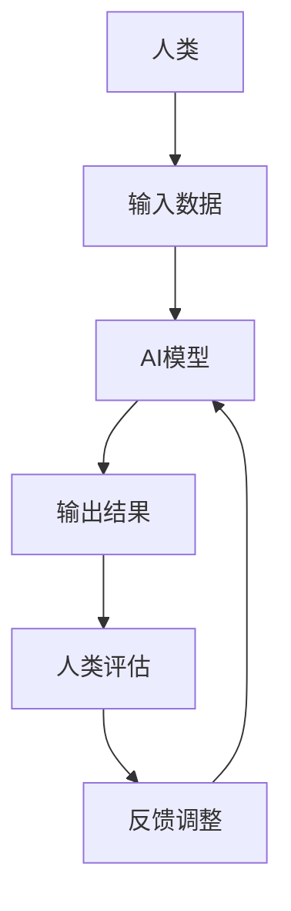

                 

**关键词：**人类计算、人工智能、算法正义、可解释性、公平性、隐私保护、数字鸿沟

## 1. 背景介绍

在当今数字化的世界里，人工智能（AI）和人类计算（Human-in-the-Loop）技术已经渗透到我们的日常生活中，从医疗保健到金融服务，再到娱乐和交通。然而，随着这些技术的发展，我们也面临着一系列挑战，包括算法偏见、隐私保护、数字鸿沟等。本文将探讨如何利用人类计算的力量，造福人类，并解决这些挑战。

## 2. 核心概念与联系

### 2.1 人类计算与人工智能

人类计算是指将人类专业知识和判断与自动化系统结合的过程。它不同于完全自动化的系统，而是将人类置于决策循环的中心。人类计算可以与人工智能（AI）结合，形成人工智能辅助决策系统（AIAD），从而实现最佳的结果。



### 2.2 算法正义与可解释性

算法正义是指确保算法决策公平、无偏见，并尊重个人隐私。可解释性是指能够理解和解释算法决策的能力。这两个概念是人类计算的关键组成部分，有助于建立信任，并帮助人类理解和控制决策过程。

## 3. 核心算法原理 & 具体操作步骤

### 3.1 算法原理概述

人类计算算法的核心原理是将人类专业知识与机器学习模型结合，形成一个反馈循环。人类提供输入数据，机器学习模型生成输出结果，人类评估结果并提供反馈，从而调整模型。

### 3.2 算法步骤详解

1. **数据收集与预处理：**收集相关数据，并进行预处理，如清洗、标准化等。
2. **模型训练：**使用收集的数据训练机器学习模型。
3. **人类输入：**人类提供输入数据，如特定情况的描述。
4. **模型输出：**模型根据输入数据生成输出结果，如决策建议。
5. **人类评估：**人类评估模型输出，并提供反馈。
6. **模型调整：**根据人类反馈调整模型，并重复步骤3-6。

### 3.3 算法优缺点

**优点：**人类计算可以结合人类专业知识和机器学习模型的优势，提高决策的准确性和公平性。它还可以帮助解释模型决策，建立信任。

**缺点：**人类计算需要大量的人力资源，可能会导致成本高昂。此外，人类判断可能会受到偏见和情感因素的影响。

### 3.4 算法应用领域

人类计算可以应用于各种领域，包括医疗保健（如诊断和治疗决策）、金融服务（如信贷决策）、司法系统（如预测再犯罪风险）等。

## 4. 数学模型和公式 & 详细讲解 & 举例说明

### 4.1 数学模型构建

人类计算的数学模型可以表示为一个反馈控制系统。让$u(k)$表示人类输入，$y(k)$表示模型输出，$e(k)$表示人类反馈，$r(k)$表示期望输出。则模型可以表示为：

$$y(k) = f(u(k), \theta)$$

其中$f(\cdot)$是模型函数，$theta$是模型参数。

### 4.2 公式推导过程

人类反馈可以表示为：

$$e(k) = r(k) - y(k)$$

模型参数可以通过最小化误差平方和来调整：

$$\theta_{opt} = argmin_{\theta} \sum_{k=1}^{N} e^2(k)$$

### 4.3 案例分析与讲解

例如，在医疗保健领域，人类计算可以用于帮助医生诊断疾病。医生输入患者的症状和检查结果，模型输出可能的疾病列表。医生评估结果，并提供反馈。模型根据反馈调整，以改进未来的诊断。

## 5. 项目实践：代码实例和详细解释说明

### 5.1 开发环境搭建

本项目使用Python作为编程语言，并使用Scikit-learn库进行机器学习模型的训练。此外，还需要一个用户界面，以便人类输入和评估结果。

### 5.2 源代码详细实现

以下是模型训练和人类计算循环的伪代码：

```python
# 导入库
import numpy as np
from sklearn.ensemble import RandomForestClassifier

# 准备数据
X_train, y_train = load_data()

# 训练模型
model = RandomForestClassifier()
model.fit(X_train, y_train)

# 人类计算循环
while True:
    # 人类输入
    X_user = get_user_input()

    # 模型输出
    y_pred = model.predict(X_user)

    # 人类评估
    feedback = get_user_feedback(y_pred)

    # 模型调整
    if feedback == 'incorrect':
        model.partial_fit(X_user, [not y_pred])
```

### 5.3 代码解读与分析

代码首先导入库，并准备数据。然后，它训练一个随机森林分类器模型。之后，它进入人类计算循环。在每次循环中，它获取人类输入，模型输出，人类评估，并根据反馈调整模型。

### 5.4 运行结果展示

人类计算循环会持续运行，直到模型的准确性达到预定义的阈值。每次循环，模型的准确性都会有所提高。

## 6. 实际应用场景

### 6.1 当前应用

人类计算已经在各种领域得到应用，包括医疗保健、金融服务、司法系统等。例如，在医疗保健领域，人类计算可以帮助医生诊断疾病，并提供个性化治疗建议。

### 6.2 未来应用展望

未来，人类计算有望在更多领域得到应用，包括自动驾驶、人工智能助手等。它还可以帮助解决算法偏见和隐私保护等挑战。

## 7. 工具和资源推荐

### 7.1 学习资源推荐

- "Human-in-the-Loop Machine Learning" by Kate Crawford and Trevor Paglen
- "Weapons of Math Destruction" by Cathy O'Neil

### 7.2 开发工具推荐

- Scikit-learn：一个强大的机器学习库。
- TensorFlow：一个深度学习库。
- Flask：一个用于构建用户界面的Web框架。

### 7.3 相关论文推荐

- "Human-in-the-Loop Machine Learning" by Kate Crawford and Trevor Paglen
- "Accountable AI" by Timnit Gebru et al.

## 8. 总结：未来发展趋势与挑战

### 8.1 研究成果总结

人类计算是一种有前途的技术，可以结合人类专业知识和机器学习模型的优势，提高决策的准确性和公平性。它还可以帮助解释模型决策，建立信任。

### 8.2 未来发展趋势

未来，人类计算有望在更多领域得到应用，并帮助解决算法偏见和隐私保护等挑战。此外，它还可以与其他技术结合，如区块链，以提供更安全和可信的决策。

### 8.3 面临的挑战

人类计算面临的挑战包括高成本、人类判断可能受到偏见和情感因素的影响等。

### 8.4 研究展望

未来的研究可以探索如何降低人类计算的成本，如何减少人类判断的偏见，以及如何与其他技术结合以提供更安全和可信的决策。

## 9. 附录：常见问题与解答

**Q：人类计算是否会取代人类工作？**

**A：**不，人类计算的目的是结合人类专业知识和机器学习模型的优势，而不是取代人类工作。它旨在帮助人类做出更好的决策。

**Q：人类计算是否会导致算法偏见？**

**A：**人类计算可以帮助减少算法偏见。通过人类评估和反馈，模型可以调整以减少偏见。

**Q：人类计算是否会侵犯隐私？**

**A：**人类计算需要处理敏感数据，因此隐私保护是一个关键问题。可以使用匿名化技术和其他隐私保护措施来解决这个问题。

## 作者：禅与计算机程序设计艺术 / Zen and the Art of Computer Programming

