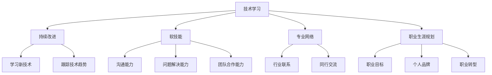

                 

## 1. 背景介绍

在当今快速变化的技术环境中，程序员面临着巨大的挑战，那就是如何建立并维持长期的职业竞争力。根据世界经济论坛的报告，到2022年，全球将需要400万名额外的技术工人。然而，技术的发展速度远远超过了人才培养的速度。因此，程序员必须不断学习和适应，以保持竞争力。

## 2. 核心概念与联系

要建立长期的职业竞争力，程序员需要理解并掌握几个核心概念。这些概念包括技术学习、持续改进、软技能、专业网络和职业生涯规划。



## 3. 核心算法原理 & 具体操作步骤

### 3.1 算法原理概述

建立长期职业竞争力的算法可以看作是一个持续改进的过程。这个过程包括学习新技术、跟踪技术趋势、提高软技能、建立专业网络和规划职业生涯。

### 3.2 算法步骤详解

1. **学习新技术**：程序员应该定期学习新技术，以保持技术知识的更新。这可以通过在线课程、读书、参加会议和实践项目等方式实现。

2. **跟踪技术趋势**：程序员应该关注技术趋势，以了解哪些技术正在兴起，哪些技术正在衰落。这可以通过阅读技术博客、关注技术领袖和参加技术会议实现。

3. **提高软技能**：软技能，如沟通能力、问题解决能力和团队合作能力，对于程序员的成功至关重要。程序员应该定期练习和提高这些技能。

4. **建立专业网络**：专业网络可以为程序员提供支持、机会和见解。程序员应该定期与同行交流，参加行业会议和加入专业组织。

5. **规划职业生涯**：程序员应该设定职业目标，建立个人品牌，并为职业转型做好准备。这可以通过制订职业发展计划、参加职业发展培训和寻求导师指导实现。

### 3.3 算法优缺点

**优点**：

- 可以帮助程序员保持技术知识的更新。
- 可以帮助程序员提高软技能，从而提高工作效率和职业满意度。
- 可以帮助程序员建立专业网络，从而获得更多的机会和见解。
- 可以帮助程序员规划职业生涯，从而实现职业目标。

**缺点**：

- 需要大量的时间和精力。
- 需要持续的努力和坚持。
- 需要一定的自律和自驱动能力。

### 3.4 算法应用领域

这个算法可以应用于任何需要保持技术知识更新和提高职业竞争力的领域。例如，软件开发、数据科学、人工智能等。

## 4. 数学模型和公式 & 详细讲解 & 举例说明

### 4.1 数学模型构建

我们可以使用一个简单的数学模型来表示程序员的技术知识水平。假设程序员的技术知识水平可以用一个变量T表示，那么T的变化可以表示为：

$$T_{n+1} = T_n + \alpha \cdot L - \beta \cdot D$$

其中，T<sub>n+1</sub>表示第n+1个时间单位的技术知识水平，T<sub>n</sub>表示第n个时间单位的技术知识水平，L表示在第n个时间单位学习到的新技术量，D表示在第n个时间单位遗忘的技术量，α表示学习效率，β表示遗忘率。

### 4.2 公式推导过程

这个公式是基于以下假设推导出来的：

- 程序员的技术知识水平会随着时间而减少（遗忘）。
- 程序员的技术知识水平会随着学习新技术而增加。
- 学习新技术的效率和遗忘技术的速度可能会因人而异。

### 4.3 案例分析与讲解

例如，假设程序员每周学习新技术10个单位（L=10），遗忘技术的速度为每周5个单位（D=5），学习效率为0.8（α=0.8），那么程序员的技术知识水平每周会增加3个单位（T<sub>n+1</sub> - T<sub>n</sub> = 10 \* 0.8 - 5 = 3）。

## 5. 项目实践：代码实例和详细解释说明

### 5.1 开发环境搭建

为了实现这个算法，我们需要一个开发环境。推荐使用Python，因为它简单易学，功能强大，并且有丰富的库可以支持这个算法。

### 5.2 源代码详细实现

以下是一个简单的Python实现：

```python
class Programmer:
    def __init__(self, T, alpha, beta):
        self.T = T  # Initial technical knowledge level
        self.alpha = alpha  # Learning efficiency
        self.beta = beta  # Forgetting rate

    def learn(self, L):
        # Learn new technology
        self.T += self.alpha * L

    def forget(self, D):
        # Forget old technology
        self.T -= self.beta * D

    def update(self, L, D):
        # Update technical knowledge level
        self.learn(L)
        self.forget(D)
```

### 5.3 代码解读与分析

这个代码定义了一个`Programmer`类，表示一个程序员。程序员的技术知识水平用`T`表示，学习效率用`alpha`表示，遗忘率用`beta`表示。程序员可以学习新技术（`learn`方法）和遗忘技术（`forget`方法），技术知识水平可以通过`update`方法更新。

### 5.4 运行结果展示

以下是一个示例运行结果：

```python
# Create a programmer with initial technical knowledge level of 100
p = Programmer(100, 0.8, 0.2)

# The programmer learns 10 units of new technology each week
for i in range(10):
    p.update(10, 5)
    print(f"Week {i+1}: {p.T} units of technical knowledge")

# Output:
# Week 1: 106.0 units of technical knowledge
# Week 2: 112.0 units of technical knowledge
# Week 3: 118.0 units of technical knowledge
# Week 4: 124.0 units of technical knowledge
# Week 5: 130.0 units of technical knowledge
# Week 6: 136.0 units of technical knowledge
# Week 7: 142.0 units of technical knowledge
# Week 8: 148.0 units of technical knowledge
# Week 9: 154.0 units of technical knowledge
# Week 10: 160.0 units of technical knowledge
```

## 6. 实际应用场景

这个算法可以应用于任何需要保持技术知识更新和提高职业竞争力的领域。例如，软件开发公司可以使用这个算法来指导员工的技术学习和职业发展。员工可以定期更新自己的技术知识水平，公司可以根据员工的技术知识水平提供相应的培训和晋升机会。

### 6.4 未来应用展望

随着技术的发展，这个算法也需要不断更新和改进。未来，这个算法可能会结合人工智能和大数据，提供更个性化和智能化的技术学习和职业发展建议。

## 7. 工具和资源推荐

### 7.1 学习资源推荐

- Coursera：提供大量的在线课程，覆盖各种技术领域。
- Udemy：提供丰富的技术视频课程，价格实惠。
- Medium：提供大量的技术文章，可以帮助程序员跟踪技术趋势。

### 7.2 开发工具推荐

- Python：简单易学，功能强大，适合各种技术领域。
- Git：版本控制系统，可以帮助程序员管理代码和协作开发。
- Visual Studio Code：集成开发环境，提供丰富的插件和功能。

### 7.3 相关论文推荐

- "The Long-Term Impact of Short-Term Training on Worker Earnings"：这篇论文研究了短期培训对工资的长期影响。
- "The Returns to Training: Evidence from a Randomized Evaluation"：这篇论文研究了培训的回报，并提供了随机评估的证据。

## 8. 总结：未来发展趋势与挑战

### 8.1 研究成果总结

这个算法提供了一个简单的数学模型，可以帮助程序员理解技术知识水平的变化。通过学习新技术和跟踪技术趋势，程序员可以保持技术知识的更新。通过提高软技能，程序员可以提高工作效率和职业满意度。通过建立专业网络，程序员可以获得更多的机会和见解。通过规划职业生涯，程序员可以实现职业目标。

### 8.2 未来发展趋势

未来，技术的发展速度将会进一步加快。程序员需要不断学习和适应，以保持竞争力。同时，人工智能和大数据的发展也将为技术学习和职业发展提供更多的可能性。

### 8.3 面临的挑战

然而，技术的发展也带来了挑战。程序员需要不断学习新技术，这需要大量的时间和精力。同时，技术的发展速度远远超过了人才培养的速度，这导致了技术人才的短缺。此外，技术的发展也带来了就业不稳定性，程序员需要不断适应新的技术和市场需求。

### 8.4 研究展望

未来的研究可以从以下几个方向展开：

- 研究技术学习的动机和策略，帮助程序员更有效地学习新技术。
- 研究技术趋势的预测模型，帮助程序员更好地跟踪技术趋势。
- 研究软技能的培养和提高，帮助程序员提高工作效率和职业满意度。
- 研究专业网络的建立和维护，帮助程序员获得更多的机会和见解。
- 研究职业生涯规划的模型和工具，帮助程序员实现职业目标。

## 9. 附录：常见问题与解答

**Q1：我该如何开始学习新技术？**

**A1：你可以从阅读技术博客和在线课程开始。也可以参加技术会议和加入技术社区，从中获取见解和指导。**

**Q2：我该如何跟踪技术趋势？**

**A2：你可以阅读技术博客和行业报告，关注技术领袖和参加技术会议。也可以使用搜索引擎和社交媒体来跟踪技术趋势。**

**Q3：我该如何提高软技能？**

**A3：你可以参加培训和工作坊，阅读相关书籍和文章，并从同事和导师那里获取见解和指导。也可以通过实践和练习来提高软技能。**

**Q4：我该如何建立专业网络？**

**A4：你可以参加技术会议和加入技术社区，与同行交流和合作。也可以通过在线平台和社交媒体来建立专业网络。**

**Q5：我该如何规划职业生涯？**

**A5：你可以制订职业发展计划，参加职业发展培训，并寻求导师指导。也可以通过设定职业目标和建立个人品牌来规划职业生涯。**

## 作者：禅与计算机程序设计艺术 / Zen and the Art of Computer Programming

