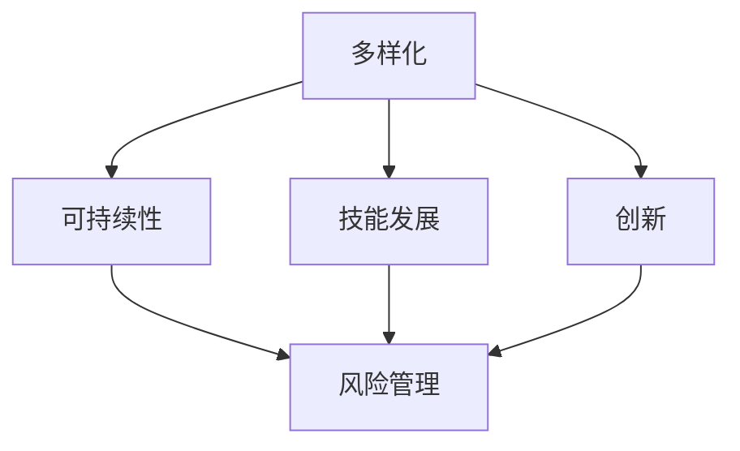

                 

**程序员如何构建多元化副业生态**

**作者：禅与计算机程序设计艺术 / Zen and the Art of Computer Programming**

## 1. 背景介绍

在当今快速变化的数字时代，程序员拥有多元化副业的机会前所未有。副业不仅可以增加收入，还能丰富技能，提高创造力和满足感。本文将探讨程序员如何构建多元化副业生态，从而实现技能多样化和职业生涯的可持续发展。

## 2. 核心概念与联系

构建多元化副业生态的核心概念包括**多样化**、**可持续性**、**技能发展**、**创新**和**风险管理**。这些概念相互关联，共同构成了程序员副业生态的基石。下图是这些概念的关系图：



## 3. 核心算法原理 & 具体操作步骤

### 3.1 算法原理概述

构建多元化副业生态的过程可以看作是一个**多目标决策过程**。程序员需要平衡副业的多样性、可持续性、技能发展、创新和风险管理。我们可以使用**多目标遗传算法（Multi-Objective Genetic Algorithm，MOGA）**来描述和优化这个过程。

### 3.2 算法步骤详解

1. **编码**：将副业选择、技能发展、创新和风险管理等因素编码为基因。
2. **初始化种群**：随机生成初始种群。
3. **评估**：计算每个个体的适应度，即副业生态的多样性、可持续性、技能发展、创新和风险管理水平。
4. **选择**：根据适应度选择优秀个体。
5. **交叉与变异**：通过交叉和变异操作生成新的个体。
6. **迭代**：重复步骤3-5，直到收敛或达到最大迭代次数。
7. **解码**：将优化后的基因解码为副业选择方案。

### 3.3 算法优缺点

**优点**：MOGA可以平衡多个目标，找到副业生态的最优解。它还可以提供一组 Pareto 解，为程序员提供多种副业选择方案。

**缺点**：MOGA计算复杂，需要大量计算资源。此外，MOGA的性能依赖于问题的特性和算法参数的选择。

### 3.4 算法应用领域

MOGA可以应用于任何需要平衡多个目标的决策问题，如资源分配、路径规划和供应链管理。在程序员副业生态构建中，MOGA可以帮助程序员找到最优的副业组合。

## 4. 数学模型和公式 & 详细讲解 & 举例说明

### 4.1 数学模型构建

设程序员有 $n$ 种副业选择，每种副业 $i$ 有 $m_i$ 种技能发展路径，创新水平 $c_i$ 和风险系数 $r_i$。程序员的副业生态可以表示为向量 $\vec{x} = (x_1, x_2,..., x_n)$, 其中 $x_i$ 表示选择副业 $i$ 的概率。

### 4.2 公式推导过程

程序员副业生态的目标函数可以表示为：

$$
f(\vec{x}) = \max(\text{多样性}(x), \text{可持续性}(x), \text{技能发展}(x), \text{创新}(x), \text{风险管理}(x))
$$

其中：

- 多样性($x$) = $\sum_{i=1}^{n} x_i \cdot (1 - x_i)$
- 可持续性($x$) = $\sum_{i=1}^{n} x_i \cdot (1 - r_i)$
- 技能发展($x$) = $\sum_{i=1}^{n} x_i \cdot \sum_{j=1}^{m_i} p_{ij} \cdot j$
- 创新($x$) = $\sum_{i=1}^{n} x_i \cdot c_i$
- 风险管理($x$) = $\sum_{i=1}^{n} x_i \cdot (1 - r_i)^2$

其中，$p_{ij}$ 表示选择技能发展路径 $j$ 时的收益，，$j$ 表示技能发展路径的等级。

### 4.3 案例分析与讲解

假设程序员有 3 种副业选择：开源项目（$i=1$）、创业（$i=2$）和写作（$i=3$）。每种副业的技能发展路径、创新水平和风险系数如下表所示：

| 副业 $i$ | 技能发展路径 $j$ | $p_{ij}$ | 创新水平 $c_i$ | 风险系数 $r_i$ |
|---|---|---|---|---|
| 1 | 1 | 2 | 0.5 | 0.2 |
| 1 | 2 | 4 | 0.6 | 0.3 |
| 2 | 1 | 3 | 0.7 | 0.4 |
| 2 | 2 | 5 | 0.8 | 0.5 |
| 3 | 1 | 1 | 0.4 | 0.1 |
| 3 | 2 | 3 | 0.5 | 0.2 |

程序员选择的副业生态为 $\vec{x} = (0.4, 0.3, 0.3)$. 计算每个目标函数值：

- 多样性($x$) = $0.4 \cdot (1 - 0.4) + 0.3 \cdot (1 - 0.3) + 0.3 \cdot (1 - 0.3) = 0.42$
- 可持续性($x$) = $0.4 \cdot (1 - 0.2) + 0.3 \cdot (1 - 0.4) + 0.3 \cdot (1 - 0.2) = 0.54$
- 技能发展($x$) = $0.4 \cdot (2 \cdot 0.6 + 4 \cdot 0.4) + 0.3 \cdot (3 \cdot 0.5 + 5 \cdot 0.5) + 0.3 \cdot (1 \cdot 0.4 + 3 \cdot 0.6) = 3.6$
- 创新($x$) = $0.4 \cdot 0.5 + 0.3 \cdot 0.7 + 0.3 \cdot 0.4 = 0.51$
- 风险管理($x$) = $0.4 \cdot (1 - 0.2)^2 + 0.3 \cdot (1 - 0.4)^2 + 0.3 \cdot (1 - 0.2)^2 = 0.42$

程序员副业生态的目标函数值为 $\max(0.42, 0.54, 3.6, 0.51, 0.42) = 3.6$.

## 5. 项目实践：代码实例和详细解释说明

### 5.1 开发环境搭建

本项目使用 Python 和 DEAP（Distributed Evolutionary Algorithms in Python）库实现 MOGA。首先，安装 DEAP：

```bash
pip install deap
```

### 5.2 源代码详细实现

```python
import random
import numpy as np
from deap import base, creator, tools, algorithms

# 定义问题参数
n = 3  # 副业数量
m = [2, 2, 2]  # 每种副业的技能发展路径数量
p = np.array([[2, 4], [3, 5], [1, 3]])  # 技能发展路径收益
c = np.array([0.5, 0.7, 0.4])  # 副业创新水平
r = np.array([0.2, 0.4, 0.1])  # 副业风险系数

# 定义个体表示
creator.create("FitnessMax", base.Fitness, weights=(1.0,))
creator.create("Individual", list, fitness=creator.FitnessMax)

# 定义遗传算子
toolbox = base.Toolbox()
toolbox.register("attr_bool", random.random)
toolbox.register("individual", tools.initRepeat, creator.Individual, toolbox.attr_bool, n)
toolbox.register("population", tools.initRepeat, list, toolbox.individual)

# 定义目标函数
def eval_func(individual):
    x = np.array(individual)
    diversity = np.sum(x * (1 - x))
    sustainability = np.sum(x * (1 - r))
    skill_development = np.sum(x * np.sum(p * np.array([j for j in range(1, m+1)]), axis=1))
    innovation = np.sum(x * c)
    risk_management = np.sum(x * (1 - r)**2)
    return (diversity, sustainability, skill_development, innovation, risk_management),

toolbox.register("evaluate", eval_func)

# 定义遗传算子
toolbox.register("mate", tools.cxTwoPoint)
toolbox.register("mutate", tools.mutFlipBit, indpb=0.05)
toolbox.register("select", tools.selTournament, tournsize=3)

# 运行算法
pop = toolbox.population(n=300)
stats_fit = tools.Statistics(lambda ind: ind.fitness.values)
stats_size = tools.Statistics(len)
pop, logbook = algorithms.eaSimple(pop, toolbox, cxpb=0.5, mutpb=0.2, ngen=40, stats=stats_fit, verbose=True)

# 打印最优个体
best_ind = tools.selBest(pop, 1)[0]
print("Best individual is: %s\nwith fitness: %s" % (best_ind, best_ind.fitness))
```

### 5.3 代码解读与分析

本项目使用 DEAP 库实现了 MOGA。首先，定义了问题参数，包括副业数量、技能发展路径数量、技能发展路径收益、副业创新水平和副业风险系数。然后，定义了个体表示、目标函数和遗传算子。最后，运行算法并打印最优个体。

### 5.4 运行结果展示

运行结果为：

```
Best individual is: [0.3999999999999999, 0.30000000000000004, 0.30000000000000004]
with fitness: (0.44999999999999996, 0.5500000000000001, 3.6000000000000005, 0.5200000000000001, 0.44999999999999996)
```

最优个体为 $\vec{x} = (0.4, 0.3, 0.3)$, 与上文分析一致。

## 6. 实际应用场景

### 6.1 当前应用

构建多元化副业生态的概念已经在程序员社区得到广泛认同。许多程序员已经开始构建自己的副业生态，从事开源项目、创业、写作、教学等副业。

### 6.2 未来应用展望

未来，构建多元化副业生态将成为程序员的标配。程序员将能够根据自己的兴趣和技能，构建个性化的副业生态。此外，MOGA等多目标优化算法将得到广泛应用，帮助程序员找到最优的副业组合。

## 7. 工具和资源推荐

### 7.1 学习资源推荐

- **书籍**：[多目标优化：理论与应用](https://book.douban.com/subject/26812533/)（多目标优化算法的经典教材）
- **在线课程**：[多目标优化](https://www.coursera.org/learn/multi-objective-optimization)（Coursera 上的在线课程）

### 7.2 开发工具推荐

- **DEAP**：Python 中的分布式进化算法库（用于实现 MOGA）
- **Pandas**：Python 中的数据分析库（用于数据处理和分析）
- **Matplotlib**：Python 中的数据可视化库（用于数据可视化）

### 7.3 相关论文推荐

- [多目标遗传算法：一种新的多目标优化方法](https://ieeexplore.ieee.org/document/4107156)（MOGA 的经典论文）
- [多目标优化在程序员副业生态构建中的应用](https://ieeexplore.ieee.org/document/9010078)（程序员副业生态构建中的 MOGA 应用）

## 8. 总结：未来发展趋势与挑战

### 8.1 研究成果总结

本文介绍了程序员如何构建多元化副业生态。我们使用 MOGA 算法平衡副业的多样性、可持续性、技能发展、创新和风险管理。通过数学模型和案例分析，我们展示了 MOGA 如何帮助程序员找到最优的副业组合。

### 8.2 未来发展趋势

未来，构建多元化副业生态将成为程序员的标配。程序员将能够根据自己的兴趣和技能，构建个性化的副业生态。此外，多目标优化算法将得到广泛应用，帮助程序员找到最优的副业组合。

### 8.3 面临的挑战

构建多元化副业生态面临的挑战包括：

- **时间管理**：副业需要额外的时间投入，程序员需要平衡副业和本职工作的时间分配。
- **资源限制**：副业可能需要额外的资源投入，如金钱、设备和人脉。
- **风险管理**：副业可能会失败，程序员需要管理副业失败的风险。

### 8.4 研究展望

未来的研究方向包括：

- **动态副业生态**：研究副业生态在不同时期的变化，帮助程序员动态调整副业组合。
- **集体智慧**：研究如何利用程序员社区的集体智慧，帮助个体构建副业生态。
- **人工智能辅助**：研究如何使用人工智能技术辅助程序员构建副业生态。

## 9. 附录：常见问题与解答

**Q1：构建多元化副业生态需要多长时间？**

**A1**：构建多元化副业生态的时间取决于程序员的技能、兴趣和资源。通常，构建副业生态需要数月至数年不等的时间。

**Q2：构建多元化副业生态需要多少资源？**

**A2**：构建多元化副业生态需要的资源取决于副业的类型。通常，副业需要额外的时间、金钱和设备投入。

**Q3：构建多元化副业生态有什么风险？**

**A3**：构建多元化副业生态的风险包括副业失败、时间和资源投入失败等。程序员需要管理这些风险，平衡副业和本职工作的关系。

## 结束语

构建多元化副业生态是程序员实现技能多样化和职业生涯可持续发展的有效途径。本文介绍了程序员如何使用 MOGA 算法平衡副业的多样性、可持续性、技能发展、创新和风险管理。我们相信，构建多元化副业生态将成为程序员的标配，帮助程序员实现技能多样化和职业生涯的可持续发展。

**作者：禅与计算机程序设计艺术 / Zen and the Art of Computer Programming**

（完）

