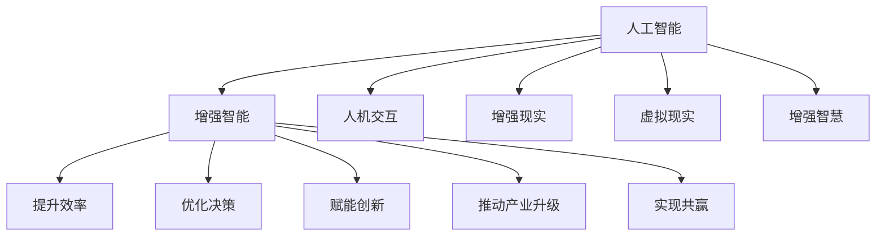

                 

## 1. 背景介绍

### 1.1 问题由来
随着人工智能技术的不断进步，人类与人工智能的协作模式也在逐渐演变。早期的AI往往被视为独立于人类智慧的工具，主要用于自动化执行简单任务，但随着深度学习等先进技术的应用，AI开始在解决复杂问题上展现出越来越大的潜力。

当前，AI的应用已经深入到各行各业，从医疗、金融到教育、制造业，AI正在帮助人类提升工作效率，改善生活质量。然而，AI的迅速发展也带来了新的挑战，包括数据隐私、伦理道德、公平性、安全性等问题。人类与AI的协作必须建立在和谐共存的基础上，才能实现共赢。

### 1.2 问题核心关键点
人类-AI协作的核心在于如何利用AI的优势，同时保留人类智慧的特点，实现二者的优势互补。具体来说，包括以下几个关键点：

1. **数据处理与决策支持**：AI能够处理大规模数据集，从中提取有价值的信息，支持人类做出更科学的决策。
2. **自动化与智能化**：AI可以自动化执行重复性高的任务，将人类从繁琐劳动中解放出来，专注于更具创造性的工作。
3. **实时反馈与优化**：AI能够实时分析运行数据，提供反馈和建议，帮助人类不断优化工作流程。
4. **跨领域协作**：AI的通用性使得它可以在多个领域与人类协作，解决复杂的多学科问题。
5. **人机交互**：通过自然语言处理、机器视觉等技术，AI能够更好地理解和响应人类的需求。

### 1.3 问题研究意义
研究人类-AI协作模式，对于推动人工智能技术的落地应用，提升各行各业的生产效率和决策质量，具有重要意义：

1. **提升效率**：通过AI的自动化和智能化能力，大幅提升工作效率，降低人为错误。
2. **优化决策**：利用AI的数据处理和分析能力，提供科学的决策支持，提高决策的准确性和及时性。
3. **赋能创新**：AI可以辅助人类进行创新思考，提供新视角和新方法，推动技术进步和业务创新。
4. **推动产业升级**：通过AI的广泛应用，促进各行各业的数字化转型，提升产业竞争力。
5. **实现共赢**：在人类与AI协作中实现共赢，共同应对社会、经济、环境等挑战。

## 2. 核心概念与联系

### 2.1 核心概念概述

为更好地理解人类-AI协作的原理和实践，本节将介绍几个关键概念：

- **人工智能(AI)**：指通过模拟人类智能行为，使计算机能够执行智能任务的技术。包括机器学习、深度学习、自然语言处理、计算机视觉等子领域。
- **增强智能(Enhanced Intelligence)**：指通过与AI的协作，增强人类智慧和能力的实践。增强智能不仅仅是AI技术的应用，更强调了人与AI之间的协同作用。
- **人机交互(Human-Machine Interaction, HMI)**：指人类与AI系统之间的信息交换方式，包括语音交互、文本输入、图形界面等。
- **增强现实(Augmented Reality, AR)**：通过AR技术，在人类视觉和听觉中融合数字信息，增强现实世界的体验。
- **虚拟现实(Virtual Reality, VR)**：通过VR技术，创建完全由计算机生成的模拟环境，使人类可以沉浸其中。
- **增强智慧(Enhanced Wisdom)**：指通过AI的辅助，增强人类的智慧和决策能力，使其在处理复杂问题时更具洞察力和判断力。

这些概念之间的联系可以通过以下Mermaid流程图来展示：



这个流程图展示了一些关键概念及其之间的逻辑关系：

1. 人工智能是增强智能的基础，通过AI技术实现对人类智慧的增强。
2. 人机交互、增强现实、虚拟现实等技术，为增强智能提供了更丰富的交互手段和应用场景。
3. 增强智能通过提升效率、优化决策、赋能创新、推动产业升级、实现共赢等方式，对各行各业产生了深远影响。

## 3. 核心算法原理 & 具体操作步骤
### 3.1 算法原理概述

人类-AI协作的核心算法原理可以归纳为以下几个方面：

1. **数据预处理**：将原始数据转化为AI可处理的格式，包括数据清洗、归一化、特征工程等步骤。
2. **模型训练**：使用AI算法（如深度学习、强化学习、自然语言处理等）训练模型，使其能够对输入数据进行分析和预测。
3. **模型评估与优化**：通过评估模型在测试集上的表现，不断调整模型参数，提高模型性能。
4. **交互界面设计**：设计用户友好的交互界面，使得人类可以方便地与AI系统进行交互。
5. **反馈与学习**：根据用户反馈，不断优化AI系统的行为，提升用户体验和系统性能。

### 3.2 算法步骤详解

基于人类-AI协作的核心算法原理，具体的实施步骤包括以下几个关键环节：

**Step 1: 数据准备**
- 收集与任务相关的数据集，进行数据清洗和预处理。
- 将数据集分为训练集、验证集和测试集。
- 进行特征工程，提取对任务有帮助的特征。

**Step 2: 模型选择与训练**
- 选择合适的AI算法，构建模型架构。
- 在训练集上进行模型训练，不断调整模型参数，提高模型性能。
- 在验证集上评估模型性能，防止过拟合。

**Step 3: 交互界面设计**
- 设计简洁、直观的用户界面，使得用户可以方便地输入数据、查看输出结果。
- 使用自然语言处理技术，使得用户可以以自然语言与AI系统进行交互。
- 设计多模态交互方式，如语音、图像、手势等，提升用户体验。

**Step 4: 模型部署与评估**
- 将训练好的模型部署到实际应用中。
- 在实际应用场景中收集用户反馈，评估模型性能。
- 根据反馈结果，不断优化模型和交互界面。

**Step 5: 持续改进与学习**
- 根据新数据和新需求，持续更新和改进AI模型。
- 通过强化学习等技术，使得AI系统能够从用户行为中学习，不断优化行为策略。

### 3.3 算法优缺点

人类-AI协作的算法具有以下优点：
1. **提升效率**：AI可以处理大规模数据，快速提供决策支持，大幅提升工作效率。
2. **优化决策**：AI通过数据驱动的分析，提供科学的决策建议，减少人为错误。
3. **赋能创新**：AI辅助人类进行创新思考，提供新视角和新方法，推动技术进步。
4. **推动产业升级**：AI的广泛应用，促进各行各业的数字化转型，提升产业竞争力。

同时，该算法也存在一些局限性：
1. **数据隐私问题**：大规模数据处理可能导致隐私泄露，需要采取严格的隐私保护措施。
2. **伦理道德问题**：AI的决策可能存在偏见，需要建立完善的伦理道德框架。
3. **技术复杂性**：AI系统的构建和维护需要高水平的技术支持，对人员和资源要求较高。
4. **交互障碍**：人机交互界面设计复杂，需要考虑用户的多样性和个性化需求。

尽管存在这些局限性，但人类-AI协作仍然是大数据时代的重要趋势，未来有广阔的发展前景。

### 3.4 算法应用领域

人类-AI协作的算法在多个领域都有广泛的应用：

1. **医疗**：通过AI辅助诊断、病历分析、药物研发等，提升医疗服务的智能化水平，辅助医生诊疗，加速新药开发进程。
2. **金融**：利用AI进行风险评估、市场预测、自动化交易等，提高金融决策的准确性和及时性。
3. **教育**：通过AI进行个性化推荐、学情分析、作业批改等，因材施教，促进教育公平，提高教学质量。
4. **制造业**：通过AI进行质量控制、设备维护、供应链管理等，提升生产效率和产品质量。
5. **城市治理**：利用AI进行城市事件监测、舆情分析、应急指挥等，提高城市管理的自动化和智能化水平。
6. **交通**：通过AI进行交通流量分析、智能调度、自动驾驶等，提高交通系统的效率和安全性。

## 4. 数学模型和公式 & 详细讲解  
### 4.1 数学模型构建

人类-AI协作的数学模型可以构建为以下形式：

设输入数据为 $X$，目标变量为 $Y$，AI模型为 $f$，则目标函数为：

$$
\min_{f} \mathbb{E}[L(f(X),Y)]
$$

其中 $L$ 为损失函数，用于衡量模型预测与真实值之间的差异。常见的损失函数包括均方误差、交叉熵等。

### 4.2 公式推导过程

以线性回归模型为例，推导损失函数及梯度计算过程。

假设输入数据 $X$ 为 $n$ 个样本，每个样本有 $d$ 个特征。线性回归模型的目标为：

$$
Y = X \cdot \theta + b
$$

其中 $\theta$ 为模型的权重向量，$b$ 为偏置项。

定义均方误差损失函数为：

$$
L(Y,\hat{Y}) = \frac{1}{n} \sum_{i=1}^n (Y_i - \hat{Y}_i)^2
$$

其中 $\hat{Y} = X \cdot \theta + b$。

根据链式法则，对模型参数 $\theta$ 和 $b$ 的梯度计算如下：

$$
\frac{\partial L}{\partial \theta} = \frac{2}{n} X^T (Y - \hat{Y})
$$

$$
\frac{\partial L}{\partial b} = \frac{2}{n} \sum_{i=1}^n (Y_i - \hat{Y}_i)
$$

将梯度代入优化算法，如梯度下降，更新模型参数。

### 4.3 案例分析与讲解

考虑一个股票价格预测的问题，目标变量 $Y$ 为股票的收盘价，输入数据 $X$ 包括历史价格、成交量、市场指数等特征。

构建线性回归模型 $f$，使用均方误差作为损失函数，进行模型训练。训练集为历史数据，验证集和测试集为未来数据。

在模型训练过程中，使用梯度下降算法，不断调整模型参数，使得模型预测值与真实值之间的误差最小化。在测试集上评估模型性能，不断调整模型结构和参数，直到达到满意的预测效果。

## 5. 项目实践：代码实例和详细解释说明
### 5.1 开发环境搭建

在进行人类-AI协作项目实践前，我们需要准备好开发环境。以下是使用Python进行PyTorch开发的环境配置流程：

1. 安装Anaconda：从官网下载并安装Anaconda，用于创建独立的Python环境。

2. 创建并激活虚拟环境：
```bash
conda create -n ai-env python=3.8 
conda activate ai-env
```

3. 安装PyTorch：根据CUDA版本，从官网获取对应的安装命令。例如：
```bash
conda install pytorch torchvision torchaudio cudatoolkit=11.1 -c pytorch -c conda-forge
```

4. 安装各类工具包：
```bash
pip install numpy pandas scikit-learn matplotlib tqdm jupyter notebook ipython
```

完成上述步骤后，即可在`ai-env`环境中开始人类-AI协作的实践。

### 5.2 源代码详细实现

下面以股票价格预测为例，给出使用PyTorch进行线性回归模型的PyTorch代码实现。

首先，定义线性回归模型类：

```python
import torch
import torch.nn as nn
import torch.optim as optim

class LinearRegression(nn.Module):
    def __init__(self, input_size, output_size):
        super(LinearRegression, self).__init__()
        self.linear = nn.Linear(input_size, output_size)
        
    def forward(self, x):
        y_pred = self.linear(x)
        return y_pred

# 模型参数初始化
model = LinearRegression(input_size=3, output_size=1)
criterion = nn.MSELoss()
optimizer = optim.SGD(model.parameters(), lr=0.01)
```

然后，定义数据处理函数：

```python
def load_data(file_path):
    data = pd.read_csv(file_path)
    X = data.drop(['price'], axis=1).values
    Y = data[['price']].values
    return X, Y

# 加载数据
X_train, Y_train = load_data('train.csv')
X_test, Y_test = load_data('test.csv')

# 标准化数据
scaler = StandardScaler()
X_train = scaler.fit_transform(X_train)
X_test = scaler.transform(X_test)
```

接着，定义训练和评估函数：

```python
def train_epoch(model, criterion, optimizer, X_train, Y_train, n_epochs):
    for epoch in range(n_epochs):
        optimizer.zero_grad()
        y_pred = model(X_train)
        loss = criterion(y_pred, Y_train)
        loss.backward()
        optimizer.step()
        print(f'Epoch {epoch+1}, loss: {loss.item()}')

def evaluate(model, criterion, X_test, Y_test):
    with torch.no_grad():
        y_pred = model(X_test)
        loss = criterion(y_pred, Y_test)
    print(f'Test loss: {loss.item()}')

# 训练模型
train_epoch(model, criterion, optimizer, X_train, Y_train, n_epochs=100)

# 评估模型
evaluate(model, criterion, X_test, Y_test)
```

最后，启动训练流程并在测试集上评估：

```python
n_epochs = 100

# 训练模型
train_epoch(model, criterion, optimizer, X_train, Y_train, n_epochs=n_epochs)

# 评估模型
evaluate(model, criterion, X_test, Y_test)
```

以上就是使用PyTorch进行线性回归模型训练的完整代码实现。可以看到，得益于PyTorch的强大封装，我们能够快速搭建和训练模型，并对其性能进行评估。

### 5.3 代码解读与分析

让我们再详细解读一下关键代码的实现细节：

**LinearRegression类**：
- `__init__`方法：初始化线性回归模型，定义一个线性层。
- `forward`方法：前向传播，计算模型输出。

**load_data函数**：
- 加载数据集，提取输入特征和目标变量。
- 标准化数据，使其符合模型训练的要求。

**train_epoch函数**：
- 在每个epoch内，使用梯度下降算法更新模型参数。
- 计算损失函数，输出当前epoch的损失值。

**evaluate函数**：
- 在测试集上评估模型性能，输出测试损失值。

**训练流程**：
- 定义训练轮数和超参数。
- 在训练集上进行模型训练。
- 在测试集上评估模型性能。

通过上述步骤，我们可以清晰地看到人类-AI协作在实际项目中的实现流程。开发环境、数据处理、模型构建、训练评估等各个环节，都是基于人类-AI协作的算法原理，体现了其核心思想的实现过程。

## 6. 实际应用场景
### 6.1 智能医疗

人类-AI协作在智能医疗领域的应用具有重要意义。当前医疗系统面临着数据量大、疾病种类繁多、诊断复杂等问题。通过AI的辅助，可以显著提升医疗服务的智能化水平，辅助医生进行诊断和治疗。

具体而言，可以构建医疗影像识别、病历分析、药物研发等模型，使用AI进行图像分割、疾病分类、药物筛选等工作。在实际应用中，可以通过多模态数据融合，结合医生的经验和临床知识，提供科学的诊断建议和治疗方案。

### 6.2 金融风险管理

金融领域对风险管理的需求日益增长，传统的规则引擎和统计模型已无法满足需求。通过AI的深度学习和强化学习技术，可以构建智能风险管理系统，实时监测市场变化，预测金融风险，提供决策支持。

具体来说，可以构建基于深度学习的股票预测模型、基于强化学习的量化交易策略等，使用AI进行市场分析、风险评估、交易决策等工作。在实际应用中，可以结合历史数据和实时数据，不断优化模型，提升预测准确性和策略效果。

### 6.3 智能制造

智能制造是制造业未来的发展方向，通过AI的辅助，可以实现生产过程的自动化和智能化，提高生产效率和产品质量。

具体而言，可以构建质量控制、设备维护、供应链管理等模型，使用AI进行过程监控、故障预测、优化调度等工作。在实际应用中，可以通过多模态数据融合，结合生产线的实际情况，提供实时化的生产决策支持。

### 6.4 未来应用展望

随着人类-AI协作的不断深入，未来AI将会在更多领域发挥重要作用，带来更深远的影响：

1. **智能城市**：利用AI进行城市事件监测、舆情分析、应急指挥等，提高城市管理的自动化和智能化水平，构建更安全、高效的城市环境。
2. **智能交通**：通过AI进行交通流量分析、智能调度、自动驾驶等，提高交通系统的效率和安全性。
3. **智能教育**：利用AI进行个性化推荐、学情分析、作业批改等，因材施教，促进教育公平，提高教学质量。
4. **智能客服**：通过AI进行自然语言处理、对话生成等，提升客户服务的智能化水平，提高客户满意度。
5. **智能设计**：利用AI进行产品设计、模拟仿真等，提升设计效率和设计质量。

## 7. 工具和资源推荐
### 7.1 学习资源推荐

为了帮助开发者系统掌握人类-AI协作的理论基础和实践技巧，这里推荐一些优质的学习资源：

1. **《深度学习》系列书籍**：由深度学习领域的专家编写，系统介绍了深度学习的原理和应用，适合初学者和进阶者。
2. **CS231n《计算机视觉》课程**：斯坦福大学开设的计算机视觉课程，内容全面，涵盖了从图像处理到深度学习的各个方面。
3. **自然语言处理（NLP）在线课程**：Coursera、edX等平台上的NLP相关课程，涵盖NLP的各个方面，包括文本处理、语言模型、机器翻译等。
4. **Kaggle竞赛平台**：Kaggle提供了大量的数据集和竞赛项目，可以帮助开发者锻炼数据处理和模型构建能力。
5. **Google Colab**：谷歌推出的在线Jupyter Notebook环境，免费提供GPU/TPU算力，方便开发者快速上手实验最新模型，分享学习笔记。

通过对这些资源的学习实践，相信你一定能够快速掌握人类-AI协作的精髓，并用于解决实际的AI应用问题。

### 7.2 开发工具推荐

高效的开发离不开优秀的工具支持。以下是几款用于人类-AI协作开发的常用工具：

1. **PyTorch**：基于Python的开源深度学习框架，灵活动态的计算图，适合快速迭代研究。大部分预训练语言模型都有PyTorch版本的实现。
2. **TensorFlow**：由Google主导开发的开源深度学习框架，生产部署方便，适合大规模工程应用。同样有丰富的预训练语言模型资源。
3. **Jupyter Notebook**：基于Web的交互式编程环境，支持多语言编程，方便开发和协作。
4. **Git**：版本控制系统，方便团队协作和代码管理。
5. **Scikit-learn**：Python数据科学库，提供了丰富的机器学习算法和工具。
6. **PyTorch Lightning**：基于PyTorch的分布式训练框架，支持多种硬件加速，适合大规模模型训练。

合理利用这些工具，可以显著提升人类-AI协作任务的开发效率，加快创新迭代的步伐。

### 7.3 相关论文推荐

人类-AI协作的研究源于学界的持续研究。以下是几篇奠基性的相关论文，推荐阅读：

1. **《深度学习》**：Goodfellow等人所著，系统介绍了深度学习的原理和应用，是深度学习领域的经典之作。
2. **《计算机视觉：模型、学习和推理》**：Russell等人所著，涵盖了计算机视觉的各个方面，包括图像处理、特征提取、目标检测等。
3. **《自然语言处理综论》**：Jurafsky等人所著，系统介绍了自然语言处理的各个方面，包括语言模型、机器翻译、情感分析等。
4. **《强化学习：算法、代币与架构》**：Sutton等人所著，介绍了强化学习的基本概念和应用，是强化学习领域的经典之作。
5. **《深度学习与人类智慧的融合》**：由Hu等人所著，讨论了深度学习与人类智慧融合的多个方面，包括数据预处理、模型构建、交互界面设计等。

这些论文代表了大数据时代人工智能的研究进展，通过学习这些前沿成果，可以帮助研究者把握学科前进方向，激发更多的创新灵感。

## 8. 总结：未来发展趋势与挑战

### 8.1 总结

本文对人类-AI协作模式进行了全面系统的介绍。首先阐述了人类-AI协作的研究背景和意义，明确了协作在提升人类智慧和AI能力方面的独特价值。其次，从原理到实践，详细讲解了人类-AI协作的算法原理和关键步骤，给出了人类-AI协作任务开发的完整代码实例。同时，本文还广泛探讨了协作在智能医疗、金融风险管理、智能制造等多个领域的应用前景，展示了协作范式的巨大潜力。此外，本文精选了协作技术的各类学习资源，力求为读者提供全方位的技术指引。

通过本文的系统梳理，可以看到，人类-AI协作是未来人工智能技术发展的重要方向。在协作中实现优势互补，可以大幅提升生产效率、优化决策、赋能创新，推动各行各业向智能化、数字化方向发展。未来，伴随协作技术的不断演进，人工智能必将在更多领域发挥重要作用，深刻影响人类的生产生活方式。

### 8.2 未来发展趋势

展望未来，人类-AI协作技术将呈现以下几个发展趋势：

1. **多模态融合**：AI与人类智慧的协作将更加灵活多样，能够融合视觉、听觉、触觉等多种感官信息，提供更加丰富、全面的用户体验。
2. **自适应学习**：AI能够根据用户的反馈和行为，不断优化自身行为策略，提升用户满意度。
3. **知识增强**：AI能够与知识图谱、专家系统等结合，提高系统的知识表达和推理能力，提供更科学、合理的决策支持。
4. **跨领域协作**：AI能够跨越不同领域，与人类共同解决复杂的多学科问题，提供综合性的解决方案。
5. **实时性增强**：AI系统将更加实时化，能够即时响应用户需求，提供即时的决策支持和反馈。

以上趋势凸显了人类-AI协作技术的广阔前景。这些方向的探索发展，必将进一步提升协作系统的性能和应用范围，为人类认知智能的进化带来深远影响。

### 8.3 面临的挑战

尽管人类-AI协作技术已经取得了瞩目成就，但在迈向更加智能化、普适化应用的过程中，它仍面临诸多挑战：

1. **数据隐私**：大规模数据处理可能导致隐私泄露，需要采取严格的隐私保护措施。
2. **伦理道德**：AI的决策可能存在偏见，需要建立完善的伦理道德框架。
3. **技术复杂性**：AI系统的构建和维护需要高水平的技术支持，对人员和资源要求较高。
4. **交互障碍**：人机交互界面设计复杂，需要考虑用户的多样性和个性化需求。
5. **安全性**：AI系统可能存在漏洞，需要建立完善的防护机制，确保系统安全。

正视协作面临的这些挑战，积极应对并寻求突破，将是大数据时代人工智能技术发展的必由之路。相信随着学界和产业界的共同努力，这些挑战终将一一被克服，人类-AI协作必将在构建人机协同的智能时代中扮演越来越重要的角色。

### 8.4 研究展望

面对人类-AI协作所面临的种种挑战，未来的研究需要在以下几个方面寻求新的突破：

1. **隐私保护**：开发隐私保护技术，确保数据处理的匿名性和安全性。
2. **伦理道德**：建立完善的伦理道德框架，确保AI系统的公平性、透明性和安全性。
3. **人机交互**：设计更加友好、灵活的人机交互界面，提升用户体验。
4. **安全性**：开发安全性技术，确保AI系统的稳定性和鲁棒性。
5. **跨领域协作**：开发跨领域协作技术，促进不同领域知识的融合和应用。
6. **实时性**：优化AI系统的计算图和算法，提升系统的实时响应能力。

这些研究方向的探索，必将引领人类-AI协作技术迈向更高的台阶，为构建安全、可靠、可解释、可控的智能系统铺平道路。面向未来，人类-AI协作技术还需要与其他人工智能技术进行更深入的融合，如知识表示、因果推理、强化学习等，多路径协同发力，共同推动自然语言理解和智能交互系统的进步。只有勇于创新、敢于突破，才能不断拓展AI技术的边界，让智能技术更好地造福人类社会。

## 9. 附录：常见问题与解答

**Q1：人类-AI协作与传统人工智能技术有何区别？**

A: 人类-AI协作与传统人工智能技术的主要区别在于其协作机制和应用场景。传统AI主要通过单独训练和推理的方式，提供单一的任务结果，缺乏与人类智慧的深度融合。而人类-AI协作则强调人机协同，通过AI的辅助，增强人类智慧和能力，提升系统的复杂性和智能化水平。

**Q2：人类-AI协作的难点在哪里？**

A: 人类-AI协作的难点主要在于以下几个方面：
1. **数据隐私**：大规模数据处理可能导致隐私泄露，需要采取严格的隐私保护措施。
2. **伦理道德**：AI的决策可能存在偏见，需要建立完善的伦理道德框架。
3. **技术复杂性**：AI系统的构建和维护需要高水平的技术支持，对人员和资源要求较高。
4. **交互障碍**：人机交互界面设计复杂，需要考虑用户的多样性和个性化需求。
5. **安全性**：AI系统可能存在漏洞，需要建立完善的防护机制，确保系统安全。

**Q3：如何提高人类-AI协作系统的性能？**

A: 提高人类-AI协作系统的性能，可以从以下几个方面入手：
1. **数据质量**：提高数据的质量和多样性，确保训练数据的代表性和可靠性。
2. **模型选择**：选择合适的AI模型，结合任务特点进行优化设计。
3. **交互界面**：设计简洁、直观的用户界面，提升用户操作体验。
4. **持续优化**：根据用户反馈和业务需求，不断优化模型和系统，提高用户体验和系统性能。
5. **多模态融合**：融合多种感官信息，提供更加丰富、全面的用户体验。

通过以上措施，可以显著提升人类-AI协作系统的性能和用户体验，推动AI技术在更多领域的落地应用。

**Q4：人类-AI协作的未来发展方向是什么？**

A: 人类-AI协作的未来发展方向主要包括以下几个方面：
1. **多模态融合**：AI与人类智慧的协作将更加灵活多样，能够融合视觉、听觉、触觉等多种感官信息，提供更加丰富、全面的用户体验。
2. **自适应学习**：AI能够根据用户的反馈和行为，不断优化自身行为策略，提升用户满意度。
3. **知识增强**：AI能够与知识图谱、专家系统等结合，提高系统的知识表达和推理能力，提供更科学、合理的决策支持。
4. **跨领域协作**：AI能够跨越不同领域，与人类共同解决复杂的多学科问题，提供综合性的解决方案。
5. **实时性增强**：AI系统将更加实时化，能够即时响应用户需求，提供即时的决策支持和反馈。

通过这些方向的探索发展，人类-AI协作必将在更多领域发挥重要作用，深刻影响人类的生产生活方式。

---

作者：禅与计算机程序设计艺术 / Zen and the Art of Computer Programming

