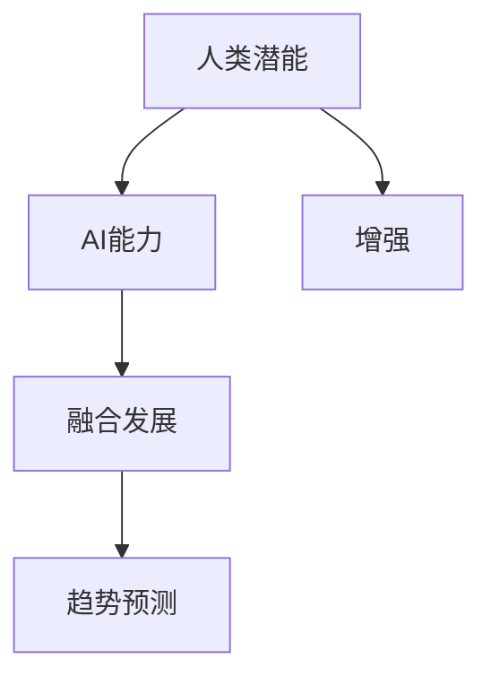

                 

# 人类-AI协作：增强人类潜能与AI能力的融合发展趋势预测分析挑战预测

> 关键词：人类-AI协作,增强人类潜能,融合发展,预测分析,挑战预测

## 1. 背景介绍

在21世纪的技术浪潮中，人工智能(AI)已经成为推动科技进步和社会发展的关键力量。AI技术正在深刻改变我们的工作方式、生活方式以及社会互动模式。然而，尽管AI的潜力巨大，它仍然存在许多局限性，无法完全替代人类的智慧和经验。因此，人类-AI协作成为了未来发展的核心趋势。本文旨在探讨人类-AI协作的增强人类潜能与AI能力融合发展的趋势，并预测未来面临的主要挑战。

### 1.1 人类-AI协作的兴起

人类-AI协作是指人类与AI系统通过信息共享、协同工作、共同决策等方式实现互助共赢。这一合作模式在各行各业得到了广泛应用，尤其是在医疗、金融、教育、制造等领域，AI系统的辅助使得人类能够更高效、更精准地完成任务，同时也极大地提升了AI系统自身的智能化水平。

### 1.2 增强人类潜能

AI的崛起并非意味着取代人类，而是通过与人类协作，共同提升工作和学习效率，增强人类在处理复杂任务、创新思维等方面的潜能。AI可以处理海量数据、快速计算、提供个性化建议，但最终决策和创新仍然需要人类的智慧和情感。

## 2. 核心概念与联系

### 2.1 核心概念概述

为更好地理解人类-AI协作的未来趋势，本节将介绍几个密切相关的核心概念：

- **人类潜能**：指人类在智慧、情感、创造力等方面的天然能力，通过与AI协作，这些潜能可以得到进一步的开发和提升。
- **AI能力**：指AI在数据分析、逻辑推理、模式识别等方面的能力，通过与人类协作，AI能够从人类的经验和知识中学习，提升其智能化水平。
- **增强**：指通过协作，AI和人类各自的能力得到提升和增强，实现1+1>2的效果。
- **融合发展**：指人类与AI在协作过程中，通过信息共享、知识交流等方式，实现相互融合，共同进步。
- **趋势预测**：指基于现有数据和技术，对未来发展的方向和可能的挑战进行分析和预测。

这些概念之间的逻辑关系可以通过以下Mermaid流程图来展示：



这个流程图展示了一些关键概念之间的关系：

1. 人类潜能与AI能力通过协作得到增强。
2. 增强后的能力和潜能通过融合发展，实现共同进步。
3. 融合发展的趋势可以通过趋势预测进行分析预测。

## 3. 核心算法原理 & 具体操作步骤
### 3.1 算法原理概述

人类-AI协作的增强与融合发展趋势预测分析，本质上是一个数据驱动的机器学习过程。其核心思想是：通过收集和分析当前人类-AI协作的数据，预测未来合作的发展趋势和可能面临的挑战。

具体而言，可以构建一个多维度的人类-AI协作数据集，包含人类任务完成情况、AI系统表现、任务复杂度、协作方式等。通过这些数据，利用机器学习模型（如回归模型、分类模型、时序模型等）对未来趋势进行预测。

### 3.2 算法步骤详解

人类-AI协作的增强与融合发展趋势预测分析一般包括以下几个关键步骤：

**Step 1: 数据收集与处理**
- 收集当前人类-AI协作的各类数据，如任务完成时间、错误率、用户满意度等。
- 对数据进行清洗和标准化处理，去除异常值和缺失值。

**Step 2: 特征工程**
- 对数据集进行特征提取和特征选择，保留对未来趋势有较强预测能力的特征。
- 可以引入一些高级特征工程技术，如基于自然语言处理(NLP)的文本特征提取，基于图像处理的视觉特征提取等。

**Step 3: 模型选择与训练**
- 选择合适的机器学习模型进行训练，如线性回归、支持向量机(SVM)、决策树、随机森林等。
- 使用训练数据对模型进行训练，并进行交叉验证和调参。

**Step 4: 模型评估与优化**
- 在测试集上评估模型预测性能，使用均方误差(MSE)、平均绝对误差(MAE)、R²等指标评估预测准确度。
- 根据评估结果，调整模型参数和特征选择策略，优化模型性能。

**Step 5: 趋势预测与挑战分析**
- 使用优化后的模型对未来人类-AI协作趋势进行预测。
- 对预测结果进行分析，识别出未来可能面临的挑战，并提出相应的应对策略。

### 3.3 算法优缺点

人类-AI协作的趋势预测分析具有以下优点：
1. 数据驱动：基于实际数据进行分析和预测，结果更具可信度。
2. 动态更新：随着数据集的更新，模型可以不断学习和优化，预测结果更加准确。
3. 预测多样：可以根据不同的应用场景和需求，选择不同类型的模型进行预测。

同时，该方法也存在一定的局限性：
1. 数据依赖：模型预测结果的质量很大程度上依赖于数据的质量和代表性。
2. 假设局限：现有模型往往基于一些假设，可能无法全面覆盖实际应用的复杂性。
3. 解释性不足：机器学习模型的内部机制和决策过程难以解释，难以进行详细的因果分析。
4. 数据隐私：在数据收集和处理过程中，需要确保数据隐私和安全，防止数据泄露和滥用。

尽管存在这些局限性，但就目前而言，基于数据驱动的机器学习模型是预测人类-AI协作趋势的可行方法。未来相关研究的重点在于如何进一步提高模型的预测准确性，增强模型的可解释性，以及保护数据隐私。

### 3.4 算法应用领域

人类-AI协作的趋势预测分析已在多个领域得到应用，例如：

- **医疗**：预测未来疾病诊断和治疗方案的发展趋势，为医疗从业人员提供参考。
- **金融**：预测股票市场和投资组合的未来表现，为投资者提供决策支持。
- **教育**：预测未来教育模式和技术的发展方向，为教育工作者和学生提供指导。
- **制造业**：预测生产线上的自动化和智能化的发展趋势，提升生产效率和产品质量。
- **环境保护**：预测未来环境保护技术的发展趋势，为环境政策制定者提供科学依据。

这些领域的应用展示了人类-AI协作的广阔前景，也为未来其他领域的趋势预测提供了参考。

## 4. 数学模型和公式 & 详细讲解 & 举例说明

### 4.1 数学模型构建

本节将使用数学语言对人类-AI协作趋势预测分析的数学模型进行严格刻画。

假设人类-AI协作的数据集为 $\mathcal{D}=\{(x_i,y_i)\}_{i=1}^N$，其中 $x_i$ 为输入特征， $y_i$ 为输出目标。目标是构建一个回归模型 $f(x;\theta)$，最小化预测值与真实值之间的误差：

$$
\min_{\theta} \sum_{i=1}^N (y_i - f(x_i;\theta))^2
$$

其中 $\theta$ 为模型参数，如回归系数、决策树节点权重等。

### 4.2 公式推导过程

以下我们以线性回归模型为例，推导其最小二乘法的解析解：

假设模型为线性回归模型 $f(x;\theta)=\theta_0 + \sum_{i=1}^d \theta_i x_{i,j}$，其中 $x_{i,j}$ 为输入特征的第 $j$ 个维度。

则预测误差为：

$$
\epsilon_i = y_i - \theta_0 - \sum_{i=1}^d \theta_i x_{i,j}
$$

最小二乘法的目标是最小化误差平方和：

$$
\min_{\theta} \sum_{i=1}^N \epsilon_i^2
$$

对误差平方和求导，得到：

$$
\frac{\partial}{\partial \theta_k} \sum_{i=1}^N \epsilon_i^2 = -2\sum_{i=1}^N \epsilon_i x_{i,k}
$$

令导数为零，解得：

$$
\hat{\theta}_k = \frac{\sum_{i=1}^N x_{i,k} y_i}{\sum_{i=1}^N x_{i,k}^2}
$$

这是一个最小二乘法的解析解，可以高效计算出回归模型的参数。

### 4.3 案例分析与讲解

假设我们有一个在线教育平台的数据集，包含学生完成某门课程所需的时间、学习风格、学习内容等特征，以及课程通过率等目标。我们可以构建一个线性回归模型，预测未来学生完成课程的平均时间。

具体步骤如下：
1. 收集平台数据，并进行数据清洗和标准化处理。
2. 对特征进行工程处理，如提取文本特征、计算课程难度等。
3. 使用上述推导的线性回归模型进行训练，并对模型进行交叉验证和调参。
4. 使用优化后的模型对未来学生完成课程的平均时间进行预测，并分析预测结果。

通过这个案例，可以看到，机器学习模型在处理人类-AI协作数据时，可以提供科学合理的趋势预测，为教育工作者和学生提供有价值的参考。

## 5. 项目实践：代码实例和详细解释说明
### 5.1 开发环境搭建

在进行趋势预测分析前，我们需要准备好开发环境。以下是使用Python进行机器学习开发的常见环境配置流程：

1. 安装Anaconda：从官网下载并安装Anaconda，用于创建独立的Python环境。

2. 创建并激活虚拟环境：
```bash
conda create -n ml-env python=3.8 
conda activate ml-env
```

3. 安装必要的库：
```bash
pip install pandas numpy scikit-learn matplotlib seaborn scikit-learn tqdm
```

4. 安装机器学习框架：
```bash
pip install scikit-learn
```

完成上述步骤后，即可在`ml-env`环境中开始趋势预测实践。

### 5.2 源代码详细实现

这里我们以线性回归模型为例，给出使用Scikit-learn进行趋势预测的Python代码实现。

```python
import pandas as pd
from sklearn.linear_model import LinearRegression
from sklearn.model_selection import train_test_split
from sklearn.metrics import mean_squared_error

# 加载数据集
data = pd.read_csv('collaboration_data.csv')

# 数据预处理
X = data[['feature1', 'feature2', 'feature3']]  # 输入特征
y = data['target']  # 输出目标

# 分割数据集
X_train, X_test, y_train, y_test = train_test_split(X, y, test_size=0.2, random_state=42)

# 构建线性回归模型
model = LinearRegression()

# 训练模型
model.fit(X_train, y_train)

# 预测测试集结果
y_pred = model.predict(X_test)

# 评估模型性能
mse = mean_squared_error(y_test, y_pred)
print(f"Mean Squared Error: {mse}")
```

以上代码实现了对线性回归模型的训练、预测和评估。在实际应用中，可以进一步引入交叉验证、正则化、特征选择等技术，提升模型的预测能力。

### 5.3 代码解读与分析

让我们再详细解读一下关键代码的实现细节：

**数据加载和预处理**：
- 使用Pandas库读取数据集，并进行特征选择和数据标准化。
- 使用Scikit-learn库分割数据集，将数据分为训练集和测试集。

**模型训练和预测**：
- 使用LinearRegression模型进行训练，并使用测试集进行预测。
- 计算预测结果与真实结果之间的均方误差，评估模型性能。

**模型评估**：
- 使用均方误差(MSE)评估模型预测的准确性。
- 通过交叉验证等技术，进一步提升模型性能。

可以看到，Scikit-learn库提供了丰富的机器学习工具，可以快速构建和评估线性回归模型。开发者可以在此基础上，根据具体任务的特点，添加更多的模型和算法，进行更深入的分析和优化。

## 6. 实际应用场景
### 6.1 医疗诊断

在医疗领域，AI系统已经广泛应用于疾病诊断和预测。人类-AI协作的趋势预测分析，可以预测未来疾病的诊断和治疗方案的发展趋势，为医生和患者提供参考。

具体而言，可以收集患者的历史病历、基因信息、治疗效果等数据，构建回归模型，预测未来疾病的发生率和治疗效果。例如，在预测某种癌症的复发概率时，模型可以根据患者的基因型、治疗方案、生活方式等特征，提供科学的预测结果，帮助医生制定更加个性化的治疗方案。

### 6.2 金融投资

在金融领域，AI系统被广泛应用于股票市场分析和投资组合优化。人类-AI协作的趋势预测分析，可以预测未来股票市场和投资组合的表现，为投资者提供决策支持。

具体而言，可以收集历史股票价格、经济指标、公司财务数据等，构建回归模型，预测未来股票的市场表现和投资组合的收益。例如，在预测某公司股票的涨跌趋势时，模型可以根据公司的财务状况、行业竞争情况、宏观经济指标等特征，提供科学的预测结果，帮助投资者制定更加合理的投资策略。

### 6.3 教育评估

在教育领域，AI系统被广泛应用于学生的学习评估和个性化推荐。人类-AI协作的趋势预测分析，可以预测未来教育模式和技术的发展趋势，为教育工作者和学生提供指导。

具体而言，可以收集学生的学习数据、教师的教学数据、课程内容等，构建回归模型，预测未来学生的学习效果和课程的受欢迎程度。例如，在预测某门课程的通过率时，模型可以根据学生的学习风格、课程难度、教师教学质量等特征，提供科学的预测结果，帮助教育工作者改进课程设计和教学方法。

### 6.4 环境保护

在环境保护领域，AI系统被广泛应用于污染监测和资源管理。人类-AI协作的趋势预测分析，可以预测未来环境保护技术的发展趋势，为环境保护政策制定者提供科学依据。

具体而言，可以收集环境污染数据、气象数据、地理信息等，构建回归模型，预测未来环境污染的程度和趋势。例如，在预测某地区空气质量的改善趋势时，模型可以根据历史污染数据、气象条件、人类活动等特征，提供科学的预测结果，帮助环境保护政策制定者制定更加有效的环境保护措施。

## 7. 工具和资源推荐
### 7.1 学习资源推荐

为了帮助开发者系统掌握人类-AI协作趋势预测分析的理论基础和实践技巧，这里推荐一些优质的学习资源：

1. 《机器学习实战》：由Peter Harrington所著，介绍了机器学习的基本概念、算法和实现方法，适合初学者入门。
2. 《深度学习》：由Ian Goodfellow、Yoshua Bengio和Aaron Courville所著，介绍了深度学习的理论基础和实现方法，是深度学习领域的经典教材。
3. 《Python机器学习》：由Sebastian Raschka所著，介绍了Python在机器学习中的各种应用，适合Python开发者学习。
4. Kaggle平台：提供了大量的数据集和机器学习竞赛，是学习机器学习的实践平台。
5. Coursera平台：提供了许多优秀的机器学习课程，包括斯坦福大学的《机器学习》课程和UCLA的《机器学习基础》课程。

通过对这些资源的学习实践，相信你一定能够快速掌握人类-AI协作趋势预测分析的精髓，并用于解决实际的NLP问题。

### 7.2 开发工具推荐

高效的开发离不开优秀的工具支持。以下是几款用于机器学习开发的常用工具：

1. Python：机器学习领域的主流语言，灵活高效，支持各种第三方库和框架。
2. Jupyter Notebook：交互式编程环境，支持代码块、可视化展示，适合机器学习项目开发。
3. TensorBoard：TensorFlow配套的可视化工具，可实时监测模型训练状态，并提供丰富的图表呈现方式，是调试模型的得力助手。
4. Weights & Biases：模型训练的实验跟踪工具，可以记录和可视化模型训练过程中的各项指标，方便对比和调优。
5. Scikit-learn：Python中最流行的机器学习库之一，提供了丰富的模型和算法，适合快速搭建机器学习模型。

合理利用这些工具，可以显著提升机器学习项目的开发效率，加快创新迭代的步伐。

### 7.3 相关论文推荐

人类-AI协作趋势预测分析的兴起源于学界的持续研究。以下是几篇奠基性的相关论文，推荐阅读：

1. 《A Survey of Recent Developments in Human-AI Collaboration》：综述了人类-AI协作领域的最新研究成果和应用案例。
2. 《Human-AI Collaboration: A Review of State-of-the-Art》：介绍了人类-AI协作领域的经典算法和技术。
3. 《Predictive Analytics for Human-AI Collaboration》：讨论了机器学习在人类-AI协作中的潜在应用和挑战。
4. 《Enhancing Human-AI Collaboration through Predictive Analytics》：探讨了如何通过机器学习提高人类-AI协作的效果和效率。
5. 《Human-AI Collaboration in Healthcare: A Review》：介绍了AI在医疗领域与人类协作的最新进展和趋势。

这些论文代表了大规模协作分析的研究方向，为未来研究提供了重要的参考。

## 8. 总结：未来发展趋势与挑战
### 8.1 研究成果总结

本文对人类-AI协作趋势预测分析进行了全面系统的介绍。首先阐述了人类-AI协作的兴起和增强人类潜能的重要性，明确了趋势预测在提升协作效果中的独特价值。其次，从原理到实践，详细讲解了趋势预测的数学模型和关键步骤，给出了机器学习模型的代码实例。同时，本文还广泛探讨了趋势预测在医疗、金融、教育、环境保护等多个领域的应用前景，展示了人类-AI协作的广阔前景。

通过本文的系统梳理，可以看到，人类-AI协作趋势预测分析正在成为AI应用的重要方向，极大地拓展了AI系统的应用边界，提升了协作效果和效率。未来，伴随AI技术的发展和数据的积累，趋势预测分析将更加精确和高效，为人类-AI协作带来更多创新和突破。

### 8.2 未来发展趋势

展望未来，人类-AI协作趋势预测分析将呈现以下几个发展趋势：

1. 数据质量提升：随着数据采集和处理技术的进步，未来趋势预测分析的数据质量将进一步提升，预测结果更加准确。
2. 模型多样性增加：未来将涌现更多类型的机器学习模型，如深度学习、强化学习、迁移学习等，提升预测能力。
3. 实时性增强：随着计算资源的提升和算法优化，未来趋势预测分析可以实现实时预测，更好地服务现实应用。
4. 跨领域融合：未来将实现跨领域的融合预测，如将金融、医疗、教育等多个领域的数据进行联合分析，提供更加全面的趋势预测。
5. 增强可解释性：未来趋势预测分析将更加注重模型的可解释性，提供详细的因果分析和决策依据，增强可信度。

以上趋势凸显了人类-AI协作趋势预测分析的发展潜力，为未来研究提供了重要的指引。

### 8.3 面临的挑战

尽管人类-AI协作趋势预测分析取得了诸多进展，但在迈向更加智能化、普适化应用的过程中，它仍面临诸多挑战：

1. 数据依赖：预测结果的质量很大程度上依赖于数据的质量和代表性，如何获取高质量、大规模的数据，是一个重要问题。
2. 模型假设：现有模型往往基于一些假设，可能无法全面覆盖实际应用的复杂性，如何设计更加灵活的模型，是一个重要挑战。
3. 解释性不足：机器学习模型的内部机制和决策过程难以解释，难以进行详细的因果分析，如何提高模型的可解释性，是一个重要课题。
4. 数据隐私：在数据收集和处理过程中，需要确保数据隐私和安全，防止数据泄露和滥用，如何保护数据隐私，是一个重要问题。

这些挑战凸显了未来研究的重点和方向，需要持续努力和探索。

### 8.4 研究展望

面对人类-AI协作趋势预测分析面临的挑战，未来的研究需要在以下几个方面寻求新的突破：

1. 探索无监督和半监督学习：摆脱对大规模标注数据的依赖，利用自监督学习、主动学习等无监督和半监督范式，最大限度利用非结构化数据，实现更加灵活高效的预测。
2. 研究增强可解释性技术：引入因果推断和对比学习思想，增强模型决策的因果性和逻辑性，提供详细的因果分析和决策依据。
3. 开发跨领域融合模型：实现跨领域的联合分析，提升预测能力和泛化能力，提供更加全面的趋势预测。
4. 引入更多先验知识：将符号化的先验知识，如知识图谱、逻辑规则等，与神经网络模型进行巧妙融合，引导预测过程学习更准确、合理的趋势。
5. 加强数据隐私保护：采用差分隐私、联邦学习等技术，保护数据隐私和安全，确保数据使用的合法性和道德性。

这些研究方向将推动人类-AI协作趋势预测分析的不断发展，为构建智能、高效、可信的AI系统铺平道路。面向未来，人类-AI协作趋势预测分析还需要与其他AI技术进行更深入的融合，共同推动人工智能技术的发展和应用。

## 9. 附录：常见问题与解答

**Q1：人类-AI协作趋势预测分析是否可以用于所有领域？**

A: 人类-AI协作趋势预测分析可以用于多个领域，但需要根据具体领域的特点进行适应性调整。例如，在医疗领域，需要引入医学知识和先验经验，在金融领域，需要引入市场和经济的模型和指标。

**Q2：预测模型如何选择和优化？**

A: 预测模型的选择和优化需要考虑多个因素，如数据的特性、预测目标、算法复杂度等。一般建议先尝试简单的线性回归模型，如果效果不理想，再尝试更复杂的模型，如决策树、随机森林、神经网络等。模型优化可以通过交叉验证、正则化、特征选择等技术实现。

**Q3：预测结果如何解释和应用？**

A: 预测结果的解释可以通过可视化工具和因果推断方法实现。例如，可以使用散点图、曲线图等展示预测结果和真实结果的对比，使用因果推断模型解释预测的因果机制。预测结果的应用需要结合具体领域的需求，如医疗诊断需要提供明确的诊断建议，金融投资需要提供具体的投资策略等。

**Q4：预测模型在实际应用中如何部署和维护？**

A: 预测模型的部署需要考虑模型的推理速度、资源占用、接口设计等因素。可以使用容器化技术（如Docker）进行模型部署，确保模型在不同环境中的稳定运行。模型维护需要定期更新模型参数和数据，进行模型性能评估和调优。

通过本文的系统梳理，可以看到，人类-AI协作趋势预测分析正在成为AI应用的重要方向，为人类-AI协作带来更多创新和突破。相信随着技术的发展和数据的积累，趋势预测分析将更加精确和高效，为人类-AI协作带来更多价值和可能。

---

作者：禅与计算机程序设计艺术 / Zen and the Art of Computer Programming

