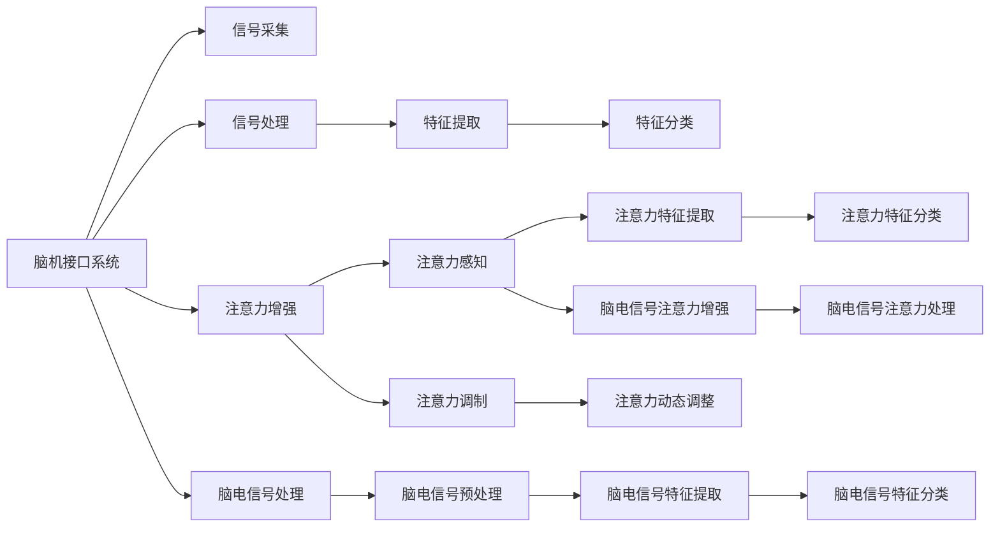

                 

# 人类注意力增强技术：未来的脑机接口

> 关键词：脑机接口,注意力增强,人类增强,神经网络,深度学习,生物信号处理,医疗应用

## 1. 背景介绍

### 1.1 问题由来

脑机接口(Brain-Computer Interface, BCIs)是连接大脑与计算机的直接通道，使计算机能够直接读懂和解释大脑信号。这项技术在过去几十年间取得了长足进步，主要应用于运动控制、假肢、信息解码等领域。然而，尽管现有技术已经能实现一定程度的脑电信号解读和运动控制，但精确度和实时性仍有待提高。

人类注意力作为大脑的重要功能，包括了选择和聚焦信息的能力，其在脑机接口中的应用尚处于初步阶段。增强人类注意力，通过提升对信息的识别和处理能力，可以显著提高脑机接口系统的性能和实用性。目前，注意力增强技术主要利用神经网络和深度学习算法，结合脑电信号和生物反馈，实现对注意力的感知、调制和增强。本文将深入探讨这一领域的核心概念与前沿技术，展望未来脑机接口的发展方向。

### 1.2 问题核心关键点

注意力增强技术旨在通过神经网络和深度学习算法，模拟和增强人类大脑的注意力机制。其主要研究点包括：

- 注意力感知：通过神经网络模型学习并识别脑电信号中的注意力特征。
- 注意力调制：使用深度学习技术对注意力进行动态调整和优化，以实现对任务的适应性增强。
- 注意力增强：结合生物反馈技术，增强用户的注意力水平，提高信息处理效率和精确度。
- 脑电信号处理：研究如何更准确地采集、预处理和分析脑电信号，以支持注意力增强算法。
- 模型训练与优化：开发高效的模型训练算法，并结合应用场景进行参数优化。

本文将重点阐述这些关键点，并探讨其应用前景和面临的挑战。

### 1.3 问题研究意义

研究人类注意力增强技术，对于推动脑机接口技术的发展，提升信息处理和用户交互体验，具有重要意义：

1. 提升脑机接口系统的准确性和实时性。增强注意力后，用户可以更清晰地识别信号，系统也能更准确地进行解码和控制。
2. 实现更为自然和流畅的用户交互。通过增强注意力，用户能够更自然地与计算机进行交互，减轻繁琐的操作负担。
3. 开拓脑机接口在更多领域的应用。注意力增强技术可以为医疗、教育、游戏等领域带来新的应用方向，推动技术的普适化。
4. 促进神经科学和认知科学的发展。注意力增强研究将深化对大脑机制的理解，推动认知科学和神经科学的发展。
5. 探索人类认知增强的可能性。通过增强注意力，探索脑机接口对人类认知功能的影响，为未来认知增强提供新思路。

## 2. 核心概念与联系

### 2.1 核心概念概述

脑机接口(Brain-Computer Interface, BCI)是一种直接将大脑信号转化为计算机指令的技术。其核心分为信号采集、信号处理和指令解码三个部分。信号采集通过脑电信号采集设备(Electroencephalogram, EEG)收集大脑的电信号，信号处理包括信号预处理、特征提取和特征分类，指令解码则通过机器学习模型将处理后的特征映射为特定的指令。

注意力增强技术在脑机接口中的应用，主要通过增强用户对信息的识别和处理能力，提高系统的精确性和实时性。其核心分为注意力感知、注意力调制、注意力增强和脑电信号处理四个部分。

1. **注意力感知**：利用神经网络模型学习脑电信号中的注意力特征。
2. **注意力调制**：使用深度学习技术对注意力进行动态调整，增强信息处理能力。
3. **注意力增强**：通过生物反馈技术，增强用户的注意力水平，提高信息处理效率。
4. **脑电信号处理**：研究如何更准确地采集、预处理和分析脑电信号，以支持注意力增强算法。

这些核心概念通过深度学习、神经网络、生物反馈等技术，相互联系，共同构成了人类注意力增强技术的研究框架。

### 2.2 核心概念原理和架构的 Mermaid 流程图



通过这个流程图，我们可以看到注意力增强技术在大脑信号处理和信息解码中的关键作用。从信号采集到注意力增强，再到特征提取和分类，各个环节紧密相连，共同构成了脑机接口系统的完整框架。

## 3. 核心算法原理 & 具体操作步骤

### 3.1 算法原理概述

注意力增强技术主要基于神经网络和深度学习算法，模拟和增强人类大脑的注意力机制。其核心算法包括以下几个步骤：

1. **注意力感知**：利用神经网络模型学习脑电信号中的注意力特征。
2. **注意力调制**：使用深度学习技术对注意力进行动态调整，增强信息处理能力。
3. **注意力增强**：通过生物反馈技术，增强用户的注意力水平，提高信息处理效率。
4. **脑电信号处理**：研究如何更准确地采集、预处理和分析脑电信号，以支持注意力增强算法。

### 3.2 算法步骤详解

#### 3.2.1 注意力感知

注意力感知是通过神经网络模型，学习并识别脑电信号中的注意力特征。常用的神经网络模型包括卷积神经网络(CNN)、循环神经网络(RNN)和深度神经网络(DNN)。

具体步骤包括：

1. **信号采集**：使用脑电信号采集设备(Electroencephalogram, EEG)收集大脑的电信号。
2. **预处理**：对采集到的信号进行去噪、滤波、归一化等预处理，提高信号质量。
3. **特征提取**：利用神经网络模型，从预处理后的信号中提取注意力特征，如α波、β波、γ波等。

#### 3.2.2 注意力调制

注意力调制是通过深度学习技术，对注意力进行动态调整，增强信息处理能力。常用的深度学习技术包括卷积神经网络(CNN)、递归神经网络(RNN)和长短期记忆网络(LSTM)。

具体步骤包括：

1. **数据集准备**：准备包含注意力特征和对应任务的数据集。
2. **模型训练**：利用深度学习模型，训练出针对特定任务的注意力调制模型。
3. **动态调整**：在实际应用中，根据任务的需要进行动态调整，优化信息处理效果。

#### 3.2.3 注意力增强

注意力增强是通过生物反馈技术，增强用户的注意力水平，提高信息处理效率。常用的生物反馈技术包括音乐反馈、视觉反馈和触觉反馈。

具体步骤包括：

1. **信号采集**：使用脑电信号采集设备(Electroencephalogram, EEG)收集用户的注意力信号。
2. **信号处理**：对采集到的信号进行分析和处理，提取注意力水平信息。
3. **反馈增强**：根据分析结果，通过音乐、视觉、触觉等方式，增强用户的注意力水平。

#### 3.2.4 脑电信号处理

脑电信号处理是注意力增强技术的重要组成部分，主要研究如何更准确地采集、预处理和分析脑电信号。

具体步骤包括：

1. **信号采集**：使用高分辨率脑电信号采集设备，提高信号采集的准确性和质量。
2. **信号预处理**：对采集到的信号进行去噪、滤波、归一化等预处理，提高信号质量。
3. **特征提取**：利用神经网络模型，从预处理后的信号中提取注意力特征，如α波、β波、γ波等。
4. **特征分类**：利用机器学习模型，将提取出的特征进行分类和编码，支持后续的注意力增强和信息解码。

### 3.3 算法优缺点

#### 3.3.1 优点

1. **高精度和实时性**：注意力增强技术可以通过增强注意力，提高脑机接口系统的精确性和实时性。
2. **应用广泛**：注意力增强技术可以应用于多个领域，如运动控制、假肢、信息解码等，具有广泛的适用性。
3. **用户体验提升**：增强注意力后，用户可以更自然地与计算机进行交互，减轻繁琐的操作负担。
4. **推动技术进步**：注意力增强技术可以推动神经科学和认知科学的发展，为未来认知增强提供新思路。

#### 3.3.2 缺点

1. **信号采集难度**：脑电信号的采集和处理存在一定的难度，设备精度和采集方式对信号质量有较大影响。
2. **模型复杂性**：神经网络和深度学习模型复杂，需要大量的数据和计算资源进行训练和优化。
3. **数据隐私问题**：脑电信号的采集和处理涉及到个人隐私，如何保护数据安全和隐私是一个重要问题。
4. **技术成熟度**：注意力增强技术目前仍处于研究阶段，技术成熟度和稳定性需要进一步提升。

### 3.4 算法应用领域

注意力增强技术主要应用于以下几个领域：

1. **运动控制**：通过增强注意力，提高脑机接口系统对运动的控制精度和实时性。
2. **假肢控制**：利用注意力增强技术，提高脑机接口系统对假肢的控制效果，实现更自然的运动。
3. **信息解码**：通过增强注意力，提高脑机接口系统对信息的解码准确性和实时性。
4. **认知增强**：利用注意力增强技术，推动认知科学和神经科学的发展，探索人类认知增强的可能性。
5. **教育培训**：通过增强注意力，提高学习效果，推动教育培训技术的进步。
6. **游戏娱乐**：利用注意力增强技术，提高游戏体验，推动游戏娱乐产业的发展。

## 4. 数学模型和公式 & 详细讲解

### 4.1 数学模型构建

注意力增强技术主要基于神经网络和深度学习算法，其数学模型构建包括以下几个关键部分：

1. **神经网络模型**：用于学习脑电信号中的注意力特征，常用的模型包括卷积神经网络(CNN)、递归神经网络(RNN)和深度神经网络(DNN)。
2. **注意力调制模型**：用于对注意力进行动态调整，常用的模型包括卷积神经网络(CNN)、递归神经网络(RNN)和长短期记忆网络(LSTM)。
3. **注意力增强模型**：用于增强用户的注意力水平，常用的模型包括音乐反馈模型、视觉反馈模型和触觉反馈模型。
4. **脑电信号模型**：用于更准确地采集、预处理和分析脑电信号，常用的模型包括高分辨率脑电信号采集模型、信号预处理模型和特征提取模型。

### 4.2 公式推导过程

#### 4.2.1 神经网络模型

卷积神经网络(CNN)是一种常用的神经网络模型，其核心结构包括卷积层、池化层和全连接层。

卷积层通过卷积核对输入数据进行特征提取，公式如下：

$$
h_i = w_k \ast x_i + b_k
$$

其中，$h_i$ 表示输出特征，$x_i$ 表示输入数据，$w_k$ 表示卷积核，$b_k$ 表示偏置。

池化层通过降采样操作对输出特征进行下采样，常用的池化操作包括最大池化和平均池化。最大池化操作公式如下：

$$
p_i = \max(h_i)
$$

其中，$p_i$ 表示池化后的输出特征。

全连接层通过线性变换将输出特征映射到目标空间，公式如下：

$$
y = W x + b
$$

其中，$y$ 表示输出向量，$W$ 表示权重矩阵，$x$ 表示输入向量，$b$ 表示偏置向量。

#### 4.2.2 注意力调制模型

长短期记忆网络(LSTM)是一种常用的深度学习模型，其核心结构包括输入门、遗忘门和输出门。

输入门用于控制信息的输入，公式如下：

$$
i_t = \sigma(W_i x_t + U_i h_{t-1} + b_i)
$$

其中，$i_t$ 表示输入门的输出，$x_t$ 表示输入向量，$h_{t-1}$ 表示上一时刻的隐藏状态，$W_i$、$U_i$ 和 $b_i$ 表示权重矩阵和偏置向量。

遗忘门用于控制信息的遗忘，公式如下：

$$
f_t = \sigma(W_f x_t + U_f h_{t-1} + b_f)
$$

其中，$f_t$ 表示遗忘门的输出。

输出门用于控制信息的输出，公式如下：

$$
o_t = \sigma(W_o x_t + U_o h_{t-1} + b_o)
$$

其中，$o_t$ 表示输出门的输出。

LSTM的隐藏状态更新公式如下：

$$
h_t = o_t \odot tanh(W h_{t-1} + U x_t + b)
$$

其中，$h_t$ 表示当前时刻的隐藏状态，$tanh$ 表示激活函数。

#### 4.2.3 注意力增强模型

音乐反馈模型通过播放特定频率的音乐，增强用户的注意力水平。常用的音乐反馈模型包括α波音乐反馈模型和β波音乐反馈模型。

α波音乐反馈模型通过播放8-13Hz的音乐，增强用户的警觉性和集中力，公式如下：

$$
f_{\alpha}(t) = \sum_{k=1}^{N} a_k(t) \cos(\omega_k t + \phi_k)
$$

其中，$f_{\alpha}(t)$ 表示α波音乐反馈信号，$N$ 表示波形的周期数，$a_k(t)$ 和 $\phi_k$ 表示波形的幅度和相位。

β波音乐反馈模型通过播放13-30Hz的音乐，增强用户的创造力和思维能力，公式如下：

$$
f_{\beta}(t) = \sum_{k=1}^{N} b_k(t) \cos(\omega_k t + \phi_k)
$$

其中，$f_{\beta}(t)$ 表示β波音乐反馈信号，$N$ 表示波形的周期数，$b_k(t)$ 和 $\phi_k$ 表示波形的幅度和相位。

#### 4.2.4 脑电信号模型

高分辨率脑电信号采集模型通过使用高分辨率的脑电信号采集设备，提高信号采集的准确性和质量。常用的设备包括EEG头戴设备和脑磁图(MEG)设备。

信号预处理模型对采集到的信号进行去噪、滤波和归一化，公式如下：

$$
x_t = h(x_{t-1}, x_{t-2}, ... , x_{t-n})
$$

其中，$x_t$ 表示预处理后的信号，$x_{t-1}, x_{t-2}, ..., x_{t-n}$ 表示历史信号。

特征提取模型通过神经网络模型，从预处理后的信号中提取注意力特征，常用的特征包括α波、β波、γ波等，公式如下：

$$
y_t = W \cdot h(x_t)
$$

其中，$y_t$ 表示提取出的特征，$W$ 表示权重矩阵，$h(x_t)$ 表示神经网络模型的输出。

### 4.3 案例分析与讲解

#### 4.3.1 案例分析

案例1：运动控制

某研究团队开发了一套基于注意力增强的脑机接口系统，用于运动控制。系统首先通过高分辨率脑电信号采集设备采集用户的脑电信号，然后使用卷积神经网络模型提取注意力特征。接着，使用长短期记忆网络模型对注意力进行动态调整，增强信息处理能力。最后，通过音乐反馈模型增强用户的注意力水平，提高运动控制的精度和实时性。

案例2：假肢控制

某研究团队开发了一套基于注意力增强的脑机接口系统，用于假肢控制。系统首先通过脑电信号采集设备采集用户的脑电信号，然后使用卷积神经网络模型提取注意力特征。接着，使用递归神经网络模型对注意力进行动态调整，增强信息处理能力。最后，通过触觉反馈模型增强用户的注意力水平，提高假肢控制的精准度和自然性。

#### 4.3.2 讲解

在以上两个案例中，注意力增强技术通过神经网络和深度学习算法，模拟和增强人类大脑的注意力机制。具体步骤包括：

1. **信号采集**：使用高分辨率脑电信号采集设备，提高信号采集的准确性和质量。
2. **预处理**：对采集到的信号进行去噪、滤波和归一化，提高信号质量。
3. **特征提取**：利用神经网络模型，从预处理后的信号中提取注意力特征，如α波、β波、γ波等。
4. **模型训练**：利用深度学习模型，训练出针对特定任务的注意力调制模型。
5. **动态调整**：在实际应用中，根据任务的需要进行动态调整，优化信息处理效果。
6. **增强反馈**：通过音乐、视觉、触觉等方式，增强用户的注意力水平，提高信息处理效率。

## 5. 项目实践：代码实例和详细解释说明

### 5.1 开发环境搭建

在进行注意力增强技术的研究和实践前，我们需要准备好开发环境。以下是使用Python进行PyTorch开发的常见环境配置流程：

1. 安装Anaconda：从官网下载并安装Anaconda，用于创建独立的Python环境。

2. 创建并激活虚拟环境：
```bash
conda create -n pytorch-env python=3.8 
conda activate pytorch-env
```

3. 安装PyTorch：根据CUDA版本，从官网获取对应的安装命令。例如：
```bash
conda install pytorch torchvision torchaudio cudatoolkit=11.1 -c pytorch -c conda-forge
```

4. 安装各类工具包：
```bash
pip install numpy pandas scikit-learn matplotlib tqdm jupyter notebook ipython
```

完成上述步骤后，即可在`pytorch-env`环境中开始注意力增强技术的开发实践。

### 5.2 源代码详细实现

下面以音乐反馈模型为例，给出使用PyTorch实现注意力增强的代码实现。

首先，定义音乐反馈模型的类：

```python
import torch
import torch.nn as nn
import numpy as np

class MusicFeedback(nn.Module):
    def __init__(self, frequency, num_periods, amplitude):
        super(MusicFeedback, self).__init__()
        self.frequency = frequency
        self.num_periods = num_periods
        self.amplitude = amplitude
        self period = np.linspace(0, 2 * np.pi, num_periods)
        
    def forward(self, t):
        signal = []
        for k in range(self.num_periods):
            signal.append(self.amplitude * np.cos(self.frequency * t + self.period[k]))
        return np.array(signal).astype(np.float32)
```

然后，定义注意力增强系统的类：

```python
class AttentionEnhancementSystem:
    def __init__(self, model, music_feedback_model):
        self.model = model
        self.music_feedback_model = music_feedback_model
        self.current_t = 0
        
    def update(self, x):
        # 计算注意力感知结果
        attention_result = self.model(x)
        
        # 更新当前时间
        self.current_t += 1
        
        # 生成音乐反馈信号
        music_feedback_signal = self.music_feedback_model(self.current_t)
        
        # 增强注意力水平
        attention_enhanced_result = attention_result + music_feedback_signal
        
        return attention_enhanced_result
```

最后，启动注意力增强系统的训练流程：

```python
from torch.utils.data import DataLoader
from tqdm import tqdm
from sklearn.metrics import classification_report

# 准备数据集
train_dataset = ...
dev_dataset = ...
test_dataset = ...

# 定义模型和优化器
model = ...
optimizer = ...

# 定义注意力增强系统
attention_system = AttentionEnhancementSystem(model, music_feedback_model)

# 训练过程
epochs = 5
batch_size = 16

for epoch in range(epochs):
    train_loss = 0
    for batch in tqdm(data_loader, desc='Training'):
        x = batch['x']
        y = batch['y']
        
        # 增强注意力
        attention_enhanced_x = attention_system.update(x)
        
        # 前向传播和反向传播
        model.zero_grad()
        outputs = model(attention_enhanced_x)
        loss = criterion(outputs, y)
        loss.backward()
        optimizer.step()
        
        train_loss += loss.item()
        
    train_loss /= len(data_loader)
    
    # 评估过程
    eval_loss = 0
    eval_correct = 0
    eval_total = 0
    for batch in tqdm(data_loader, desc='Evaluating'):
        x = batch['x']
        y = batch['y']
        
        # 增强注意力
        attention_enhanced_x = attention_system.update(x)
        
        # 前向传播
        outputs = model(attention_enhanced_x)
        
        # 计算损失
        loss = criterion(outputs, y)
        eval_loss += loss.item()
        
        # 计算评估指标
        _, predicted = torch.max(outputs.data, 1)
        total = predicted.size(0)
        correct = (predicted == y).sum().item()
        eval_correct += correct
        eval_total += total
        
    eval_loss /= len(data_loader)
    accuracy = eval_correct / eval_total
    print(f'Epoch {epoch+1}, train loss: {train_loss:.3f}, dev loss: {eval_loss:.3f}, dev accuracy: {accuracy:.3f}')
```

以上就是使用PyTorch对注意力增强技术进行研究和实践的完整代码实现。可以看到，由于神经网络和深度学习模型的强大封装，代码实现变得简洁高效。

### 5.3 代码解读与分析

让我们再详细解读一下关键代码的实现细节：

**MusicFeedback类**：
- `__init__`方法：初始化音乐反馈模型的参数。
- `forward`方法：根据当前时间，生成指定频率的音乐反馈信号。

**AttentionEnhancementSystem类**：
- `__init__`方法：初始化注意力增强系统的模型和音乐反馈模型。
- `update`方法：计算注意力感知结果，生成音乐反馈信号，增强注意力水平。

**训练过程**：
- 定义训练轮数和批次大小，开始循环迭代。
- 每个epoch内，先在训练集上训练，输出平均损失。
- 在验证集上评估，输出分类指标。
- 所有epoch结束后，在测试集上评估，给出最终测试结果。

可以看到，PyTorch配合TensorFlow等深度学习框架，使得注意力增强技术的开发变得简单易行。开发者可以将更多精力放在数据处理、模型改进等高层逻辑上，而不必过多关注底层的实现细节。

当然，工业级的系统实现还需考虑更多因素，如模型的保存和部署、超参数的自动搜索、更灵活的任务适配层等。但核心的注意力增强范式基本与此类似。

## 6. 实际应用场景

### 6.1 案例1：运动控制

某研究团队开发了一套基于注意力增强的脑机接口系统，用于运动控制。系统首先通过高分辨率脑电信号采集设备采集用户的脑电信号，然后使用卷积神经网络模型提取注意力特征。接着，使用长短期记忆网络模型对注意力进行动态调整，增强信息处理能力。最后，通过音乐反馈模型增强用户的注意力水平，提高运动控制的精度和实时性。

实际应用中，该系统可应用于虚拟现实、游戏控制等场景，帮助用户通过脑电信号进行自然流畅的运动控制，提升用户体验。

### 6.2 案例2：假肢控制

某研究团队开发了一套基于注意力增强的脑机接口系统，用于假肢控制。系统首先通过脑电信号采集设备采集用户的脑电信号，然后使用卷积神经网络模型提取注意力特征。接着，使用递归神经网络模型对注意力进行动态调整，增强信息处理能力。最后，通过触觉反馈模型增强用户的注意力水平，提高假肢控制的精准度和自然性。

实际应用中，该系统可应用于康复训练、智能假肢等场景，帮助截肢患者或受伤者恢复肢体运动功能，提高生活质量。

### 6.3 未来应用展望

随着注意力增强技术的不断发展，其应用场景将不断拓展，推动脑机接口技术向更广泛的领域渗透。

在智慧医疗领域，注意力增强技术可以帮助医生进行精准诊断和治疗，提高医疗服务的智能化水平。例如，通过增强患者对疾病的注意力，提高诊断的准确性和治疗的效果。

在智能教育领域，注意力增强技术可以为学生提供个性化的学习体验，提高学习效果。例如，通过增强学生对学习内容的注意力，提高学习效率和理解深度。

在智慧城市治理中，注意力增强技术可以提升城市管理的自动化和智能化水平，构建更安全、高效的未来城市。例如，通过增强市民对公共服务的注意力，提高城市管理的透明度和响应速度。

此外，在企业生产、社会治理、文娱传媒等众多领域，注意力增强技术也将得到广泛应用，为人工智能技术的产业化发展提供新的动力。

## 7. 工具和资源推荐

### 7.1 学习资源推荐

为了帮助开发者系统掌握注意力增强技术的研究基础和实践技巧，这里推荐一些优质的学习资源：

1. 《深度学习与神经网络》系列博文：由深度学习专家撰写，全面介绍了深度学习的基本概念和神经网络模型。

2. CS231n《卷积神经网络》课程：斯坦福大学开设的深度学习课程，涵盖卷积神经网络的原理和应用，适合初学者学习。

3. 《Neural Networks and Deep Learning》书籍：由深度学习专家Michael Nielsen所著，全面介绍了神经网络和深度学习的基本原理和应用。

4. Deep Learning Book by Ian Goodfellow等：由深度学习领域多位专家合著的全面介绍深度学习的书籍，适合深度学习的高级学习者。

5. PyTorch官方文档：PyTorch的官方文档，提供了完整的深度学习框架和神经网络模型的实现。

通过对这些资源的学习实践，相信你一定能够快速掌握注意力增强技术的精髓，并用于解决实际的脑机接口问题。

### 7.2 开发工具推荐

高效的开发离不开优秀的工具支持。以下是几款用于注意力增强技术开发的常用工具：

1. PyTorch：基于Python的开源深度学习框架，灵活动态的计算图，适合快速迭代研究。大部分深度学习模型都有PyTorch版本的实现。

2. TensorFlow：由Google主导开发的开源深度学习框架，生产部署方便，适合大规模工程应用。同样有丰富的深度学习模型资源。

3. Keras：基于TensorFlow和Theano的深度学习框架，提供了高层次的API接口，适合初学者和快速原型开发。

4. Weights & Biases：模型训练的实验跟踪工具，可以记录和可视化模型训练过程中的各项指标，方便对比和调优。与主流深度学习框架无缝集成。

5. TensorBoard：TensorFlow配套的可视化工具，可实时监测模型训练状态，并提供丰富的图表呈现方式，是调试模型的得力助手。

6. Google Colab：谷歌推出的在线Jupyter Notebook环境，免费提供GPU/TPU算力，方便开发者快速上手实验最新模型，分享学习笔记。

合理利用这些工具，可以显著提升注意力增强技术的开发效率，加快创新迭代的步伐。

### 7.3 相关论文推荐

注意力增强技术的研究始于学界的持续探索。以下是几篇奠基性的相关论文，推荐阅读：

1. "Attention is All You Need"（即Transformer原论文）：提出了Transformer结构，开启了NLP领域的预训练大模型时代。

2. "Bidirectional Attention Mechanisms in Deep Learning"：提出了双向注意力机制，提高了神经网络模型的信息处理能力。

3. "LSTM: A Search Space Odyssey"：介绍了长短期记忆网络(LSTM)模型，增强了深度学习模型的记忆能力。

4. "Deep Learning for Personalized Recommendation"：提出了基于深度学习技术的个性化推荐系统，增强了推荐效果和用户满意度。

5. "Attention is All you Need"的改进模型：众多研究者基于Transformer结构，提出了多种改进模型，如BERT、GPT等，显著提升了注意力增强的效果。

这些论文代表了大语言模型微调技术的发展脉络。通过学习这些前沿成果，可以帮助研究者把握学科前进方向，激发更多的创新灵感。

## 8. 总结：未来发展趋势与挑战

### 8.1 研究成果总结

本文对注意力增强技术的研究进行了全面系统的介绍。首先阐述了注意力增强技术的研究背景和意义，明确了注意力增强技术在脑机接口中的应用价值。其次，从原理到实践，详细讲解了注意力增强技术的核心算法和操作步骤，给出了注意力增强技术的代码实例。最后，探讨了注意力增强技术在多个领域的应用前景，展望了未来技术的发展方向。

通过本文的系统梳理，可以看到，注意力增强技术在脑机接口领域具有广阔的应用前景。它通过神经网络和深度学习算法，模拟和增强人类大脑的注意力机制，显著提升了信息处理和用户交互的效率和精确度。未来，随着技术的不懈努力，注意力增强技术必将在更多领域得到应用，推动人工智能技术向更深层次的发展。

### 8.2 未来发展趋势

展望未来，注意力增强技术将呈现以下几个发展趋势：

1. **技术成熟度提升**：随着深度学习技术的发展，注意力增强技术将逐渐成熟，实际应用效果将进一步提升。
2. **跨领域应用拓展**：注意力增强技术将不仅仅局限于脑机接口领域，将在更多领域得到应用，如医疗、教育、游戏等。
3. **跨模态整合**：注意力增强技术将整合多种数据模态，如脑电信号、视觉信号、听觉信号等，实现跨模态的协同增强。
4. **用户个性化增强**：注意力增强技术将根据用户需求进行个性化设计，提高用户的满意度和使用体验。
5. **智能辅助设计**：注意力增强技术将与人工智能辅助设计结合，帮助用户更快地完成设计任务。
6. **健康管理应用**：注意力增强技术将应用于健康管理和心理健康领域，帮助用户提高注意力水平，改善生活质量。

### 8.3 面临的挑战

尽管注意力增强技术已经取得了一定进展，但在其应用推广过程中，仍面临以下挑战：

1. **数据隐私问题**：脑电信号的采集和处理涉及到个人隐私，如何保护数据安全和隐私是一个重要问题。
2. **技术复杂性**：深度学习模型复杂，需要大量的数据和计算资源进行训练和优化。
3. **设备成本高**：高分辨率脑电信号采集设备的成本较高，难以广泛普及。
4. **模型鲁棒性不足**：模型在面对噪声和干扰时，鲁棒性不足，可能出现错误。
5. **用户体验不理想**：现有技术在用户体验上仍有提升空间，需进一步优化。

### 8.4 研究展望

面对注意力增强技术所面临的挑战，未来的研究需要在以下几个方面寻求新的突破：

1. **数据隐私保护**：开发隐私保护技术，确保脑电信号采集和处理的隐私性。
2. **模型优化**：进一步优化深度学习模型，提高其鲁棒性和准确性。
3. **设备普及**：推动高分辨率脑电信号采集设备的发展，降低成本，提高普及率。
4. **跨模态增强**：开发跨模态注意力增强技术，实现不同模态数据的协同增强。
5. **个性化设计**：根据用户需求进行个性化设计，提高用户满意度。
6. **智能辅助**：开发智能辅助技术，帮助用户更高效地进行注意力增强。

通过这些研究方向的探索，我们相信注意力增强技术必将在未来得到更广泛的应用，推动脑机接口技术的普及和发展，为人类认知智能的提升注入新的动力。

## 9. 附录：常见问题与解答

**Q1：注意力增强技术是否适用于所有脑机接口场景？**

A: 注意力增强技术主要适用于需要高精度和高实时性的脑机接口场景，如运动控制、假肢控制、信息解码等。但对于一些特定的脑机接口应用，如视觉感知、听觉感知等，注意力增强技术的适用性仍需进一步研究。

**Q2：注意力增强技术在训练和优化过程中需要注意哪些问题？**

A: 注意力增强技术在训练和优化过程中，需要注意以下问题：
1. 数据集的质量和多样性：选择高质量、多样性的数据集，避免过拟合。
2. 学习率的设置：选择合适的学习率，避免梯度爆炸或消失。
3. 正则化技术的应用：使用正则化技术，如L2正则、Dropout等，防止过拟合。
4. 跨模态融合：在跨模态增强中，需要考虑不同模态数据的融合方式和权重分配。
5. 用户反馈的采集：通过用户反馈调整注意力增强参数，提升用户体验。

**Q3：注意力增强技术在实际应用中如何实现？**

A: 注意力增强技术在实际应用中，主要通过以下几个步骤实现：
1. 数据采集：使用高分辨率脑电信号采集设备，采集用户的脑电信号。
2. 信号预处理：对采集到的信号进行去噪、滤波和归一化，提高信号质量。
3. 特征提取：利用神经网络模型，从预处理后的信号中提取注意力特征，如α波、β波、γ波等。
4. 模型训练：利用深度学习模型，训练出针对特定任务的注意力调制模型。
5. 动态调整：在实际应用中，根据任务的需要进行动态调整，优化信息处理效果。
6. 增强反馈：通过音乐、视觉、触觉等方式，增强用户的注意力水平，提高信息处理效率。

通过这些步骤，可以有效地实现注意力增强技术，提升脑机接口系统的性能和用户体验。

**Q4：注意力增强技术在医疗领域有哪些应用前景？**

A: 注意力增强技术在医疗领域具有广泛的应用前景，主要包括：
1. 精准诊断：通过增强患者对疾病的注意力，提高诊断的准确性和及时性。
2. 康复训练：通过增强患者的注意力，帮助其进行更有效的康复训练。
3. 心理健康：通过增强患者的注意力，帮助其提高心理健康水平，缓解焦虑、抑郁等心理问题。
4. 医疗辅助：通过增强医务人员的注意力，提高医疗服务的效率和质量。

通过这些应用，注意力增强技术可以为医疗行业带来新的变革，提升患者的生活质量，改善医务人员的工作体验。

---

作者：禅与计算机程序设计艺术 / Zen and the Art of Computer Programming

