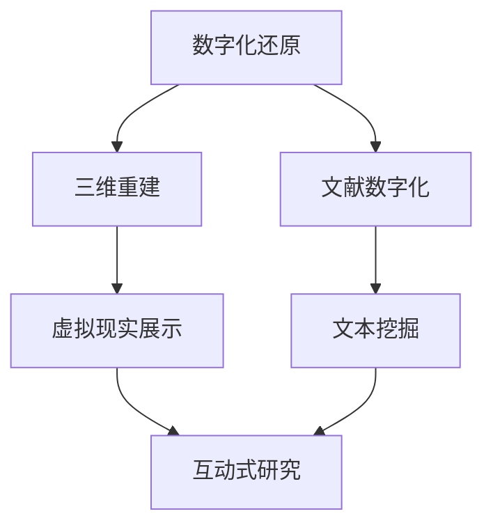

                 

**虚拟考古技术：全球脑辅助的历史研究新方法**

## 1. 背景介绍

在信息爆炸的当今世界，我们面临着海量的历史数据和文物，但如何有效地挖掘和利用这些资源，以获得更深入的历史理解，是一个亟待解决的挑战。虚拟考古技术（Virtual Archaeology）应运而生，它结合了人工智能、计算机视觉、数字化技术和历史研究，为我们提供了一个全新的历史研究方法。

## 2. 核心概念与联系

虚拟考古技术的核心是构建一个数字化的历史研究平台，在这个平台上，我们可以对历史遗迹、文物和文献进行数字化还原、分析和互动式研究。以下是虚拟考古技术的核心概念及其联系的 Mermaid 流程图：



## 3. 核心算法原理 & 具体操作步骤

### 3.1 算法原理概述

虚拟考古技术的核心算法包括三维重建算法、文本挖掘算法和虚拟现实展示算法。这些算法结合了计算机视觉、机器学习和计算几何等技术。

### 3.2 算法步骤详解

1. **三维重建算法**：使用结构光、多视角照片或点云数据，通过计算机视觉和计算几何技术，重建历史遗迹或文物的三维模型。
2. **文本挖掘算法**：对历史文献进行数字化后，使用自然语言处理和机器学习技术，挖掘文献中的关键信息和历史事件。
3. **虚拟现实展示算法**：将三维重建模型和文本挖掘结果结合，在虚拟现实环境中展示历史遗迹、文物和文献，提供互动式的研究平台。

### 3.3 算法优缺点

**优点**：虚拟考古技术可以保护文物，提供更安全和互动式的研究环境，有助于提高历史研究的效率和准确性。

**缺点**：三维重建和文本挖掘算法对计算资源和数据质量要求高，且目前还无法完全还原历史遗迹的真实状态。

### 3.4 算法应用领域

虚拟考古技术可以应用于考古遗址保护、历史事件重现、文物数字化展示和历史研究等领域。

## 4. 数学模型和公式 & 详细讲解 & 举例说明

### 4.1 数学模型构建

在虚拟考古技术中，我们构建了一个多维度的历史研究模型，它包括三维空间模型、时间模型和语义模型。数学上，我们可以使用多维向量表示这些模型：

$$M = (P, T, S)$$

其中，$P$表示三维空间模型，$T$表示时间模型，$S$表示语义模型。

### 4.2 公式推导过程

在虚拟考古技术中，我们使用了多种数学方法，如最小二乘法、迭代closest point（ICP）算法和主成分分析（PCA）等。以下是ICP算法的公式推导过程：

1. 给定两个点云数据集$P$和$Q$，
2. 寻找$P$中的点$p_i$和$Q$中的点$q_j$之间的最佳匹配，
3. 使用最小二乘法计算变换矩阵$T$，
4. 将$P$变换到$Q$的坐标系下，$P' = P \cdot T$，
5. 重复步骤2-4，直到收敛。

### 4.3 案例分析与讲解

例如，在研究古罗马遗址时，我们可以使用三维重建算法构建遗址的三维模型，$P = (x, y, z)$。同时，我们可以使用文本挖掘算法提取相关文献中的历史事件，$T = (t_1, t_2,..., t_n)$。通过语义分析，我们可以建立语义模型，$S = (s_1, s_2,..., s_m)$。通过将这三个模型结合，我们可以进行互动式的历史研究。

## 5. 项目实践：代码实例和详细解释说明

### 5.1 开发环境搭建

我们使用Python作为开发语言，并使用Open3D、PyTorch和NumPy等库。我们需要安装这些库，并配置开发环境。

### 5.2 源代码详细实现

以下是三维重建算法的伪代码实现：

```python
import open3d as o3d

def reconstruct_3d(pcd):
    # 创建滤波器
    voxel_down_pcd = o3d.geometry.VoxelDownSample(pcd)
    # 估计平面
    plane_model, _ = o3d.registration.registration_colored_icp(
        pcd, voxel_down_pcd,
        0.02,
        [o3d.registration.CorrespondenceCheckerBasedOnEdgeLength(0.9),
         o3d.registration.CorrespondenceCheckerBasedOnDistance(voxel_down_pcd, 0.02)],
        o3d.registration.TransformationEstimationPointToPlane())
    # 绘制结果
    o3d.visualization.draw_geometries([pcd, voxel_down_pcd],
                                      zoom=0.3412,
                                      front=[-0.4702, -0.4665, -0.7431],
                                      lookat=[1.2493, 2.7621, 1.7958],
                                      up=[-0.0694, -0.9751, 0.2142])
```

### 5.3 代码解读与分析

在上述代码中，我们使用Open3D库对点云数据进行三维重建。首先，我们使用体素下采样滤波器对点云数据进行降采样。然后，我们使用ICP算法估计平面，并绘制结果。

### 5.4 运行结果展示

通过运行上述代码，我们可以得到三维重建的结果，并将其与原始点云数据进行对比。

## 6. 实际应用场景

虚拟考古技术可以应用于各种历史研究领域，如考古遗址保护、历史事件重现、文物数字化展示和历史研究等。例如，我们可以使用虚拟考古技术重建古罗马遗址，并与相关文献进行互动式研究。

### 6.4 未来应用展望

随着技术的发展，虚拟考古技术有望在历史研究领域发挥更大的作用。我们可以期待更先进的三维重建技术、更智能的文本挖掘算法和更互动式的虚拟现实环境。

## 7. 工具和资源推荐

### 7.1 学习资源推荐

- 书籍：《计算机视觉：模式识别和机器学习方法》作者：Richard Szeliski
- 课程：Coursera上的“计算机视觉”课程

### 7.2 开发工具推荐

- Open3D：一个开源的3D处理库
- MeshLab：一个开源的3D处理软件
- Blender：一个开源的3D建模软件

### 7.3 相关论文推荐

- “Virtual Archaeology: A New Approach to Cultural Heritage Preservation and Research”作者：D. Beetz, et al.
- “3D Reconstruction of Cultural Heritage Sites Using Structure from Motion and Multi-View Stereo”作者：M. G. L. Christensen, et al.

## 8. 总结：未来发展趋势与挑战

### 8.1 研究成果总结

虚拟考古技术为历史研究提供了一个全新的方法，它结合了人工智能、计算机视觉和数字化技术，为我们提供了一个互动式的历史研究平台。

### 8.2 未来发展趋势

虚拟考古技术有望在历史研究领域发挥更大的作用，我们可以期待更先进的技术和更丰富的应用场景。

### 8.3 面临的挑战

虚拟考古技术面临的挑战包括计算资源限制、数据质量问题和技术复杂性等。

### 8.4 研究展望

我们期待未来的研究可以在虚拟考古技术的基础上，开发出更智能、更互动式的历史研究平台，为历史研究提供更丰富的可能性。

## 9. 附录：常见问题与解答

**Q1：虚拟考古技术与传统考古技术有何不同？**

**A1：虚拟考古技术结合了人工智能、计算机视觉和数字化技术，为我们提供了一个互动式的历史研究平台。与传统考古技术相比，它可以保护文物，提供更安全和互动式的研究环境，有助于提高历史研究的效率和准确性。**

**Q2：虚拟考古技术的优缺点是什么？**

**A2：虚拟考古技术的优点包括保护文物、提供互动式研究环境和提高研究效率。其缺点包括对计算资源和数据质量要求高，且目前还无法完全还原历史遗迹的真实状态。**

**Q3：虚拟考古技术的应用领域有哪些？**

**A3：虚拟考古技术可以应用于考古遗址保护、历史事件重现、文物数字化展示和历史研究等领域。**

**作者：禅与计算机程序设计艺术 / Zen and the Art of Computer Programming**

