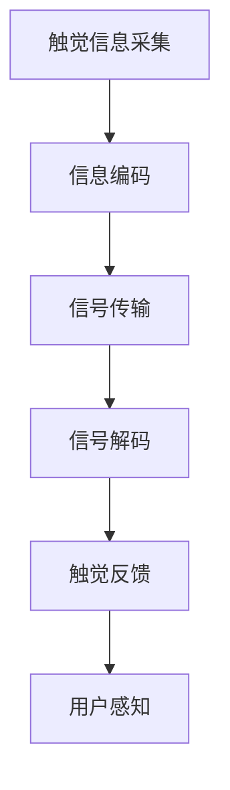

                 

**虚拟触觉语言：AI创造的新型沟通方式**

**作者：禅与计算机程序设计艺术 / Zen and the Art of Computer Programming**

## 1. 背景介绍

在人工智能（AI）飞速发展的今天，我们正在见证一种全新的沟通方式的诞生：虚拟触觉语言。这种语言通过模拟人类触觉感知，为人机交互带来了革命性的变化。本文将深入探讨虚拟触觉语言的核心概念、算法原理、数学模型，并提供项目实践和实际应用场景，最后展望其未来发展趋势。

## 2. 核心概念与联系

虚拟触觉语言（V Tactile Language, VTL）是一种基于触觉反馈的沟通方式，它通过模拟人类皮肤感知压力、温度、振动等触觉信息，为用户提供更自然、更直观的交互体验。VTL的核心是将触觉信息编码为数字信号，并通过专用设备（如触觉反馈套件）传递给用户。

以下是VTL的核心概念及其联系的Mermaid流程图：



## 3. 核心算法原理 & 具体操作步骤

### 3.1 算法原理概述

VTL的核心算法是触觉信息的编码和解码过程。编码算法将触觉信息转换为数字信号，解码算法则将数字信号还原为触觉信息，并控制触觉反馈设备输出相应的触觉刺激。

### 3.2 算法步骤详解

1. **信息采集**：使用压力传感器、温度传感器等设备采集触觉信息。
2. **信息编码**：将采集到的触觉信息转换为数字信号。常用的编码方法包括PWM（Pulse Width Modulation）编码和力-频编码。
3. **信号传输**：将编码后的数字信号通过有线或无线方式传输给触觉反馈设备。
4. **信号解码**：触觉反馈设备接收数字信号，并将其还原为触觉信息。
5. **触觉反馈**：触觉反馈设备根据解码后的触觉信息输出相应的触觉刺激，如压力、温度、振动等。

### 3.3 算法优缺点

**优点**：VTL提供了更自然、更直观的交互体验，有助于改善人机交互的效率和舒适度。

**缺点**：VTL技术仍处于起步阶段，存在设备成本高、触觉反馈精度有待提高等挑战。

### 3.4 算法应用领域

VTL的应用领域包括虚拟现实（VR）、增强现实（AR）、远程医疗、远程教育等需要高度互动的场景。

## 4. 数学模型和公式 & 详细讲解 & 举例说明

### 4.1 数学模型构建

VTL的数学模型基于人体皮肤的触觉感知特性。触觉感知可以表示为一个函数：

$$S = f(P, T, V,...)$$

其中，$S$表示触觉感知强度，$P$表示压力，$T$表示温度，$V$表示振动等。

### 4.2 公式推导过程

假设触觉感知强度与压力、温度、振动等因素的关系可以表示为：

$$S = k_1 \cdot P + k_2 \cdot T + k_3 \cdot V +...$$

其中，$k_1, k_2, k_3,...$是各因素对触觉感知强度的影响系数。

### 4.3 案例分析与讲解

例如，在VR游戏中，玩家需要感知到敌人攻击的压力。假设压力传感器采集到的压力信号为$P = 5N$，则触觉感知强度为：

$$S = k_1 \cdot 5N = 5k_1$$

其中，$k_1$是压力对触觉感知强度的影响系数。通过调节$k_1$的值，可以改变玩家感知到的压力强度。

## 5. 项目实践：代码实例和详细解释说明

### 5.1 开发环境搭建

本项目使用Arduino IDE和触觉反馈套件（如Force Myo Armband）进行开发。首先，安装Arduino IDE并配置好开发环境。

### 5.2 源代码详细实现

以下是一个简单的VTL编码和解码算法的Arduino代码示例：

```cpp
// VTL编码和解码算法示例
const int pressureSensorPin = A0;  // 压力传感器接口
const int motorPin = 9;           // 电机接口

void setup() {
  pinMode(motorPin, OUTPUT);
}

void loop() {
  int pressure = analogRead(pressureSensorPin);  // 读取压力信号
  int motorSpeed = map(pressure, 0, 1023, 0, 255);  // 将压力信号映射到电机速度范围

  analogWrite(motorPin, motorSpeed);  // 控制电机速度
}
```

### 5.3 代码解读与分析

该代码示例读取压力传感器的信号，并将其映射到电机速度范围，从而实现了简单的VTL编码和解码过程。

### 5.4 运行结果展示

当压力传感器检测到压力时，电机的转速会随之变化，模拟触觉反馈。

## 6. 实际应用场景

### 6.1 当前应用

VTL当前已应用于VR/AR设备、远程医疗设备、智能家居等领域，为用户提供更直观、更自然的交互体验。

### 6.2 未来应用展望

未来，VTL有望应用于更多需要高度互动的场景，如远程教育、远程会议等。此外，VTL还将与其他感官反馈技术（如听觉、视觉）结合，为用户提供更全面的沉浸式体验。

## 7. 工具和资源推荐

### 7.1 学习资源推荐

- [Vibrotactile Displays: A Survey](https://ieeexplore.ieee.org/document/4487718)
- [Haptic Interfaces: A Survey](https://ieeexplore.ieee.org/document/4106512)

### 7.2 开发工具推荐

- Arduino IDE：<https://www.arduino.cc/en/main/software>
- Processing：<https://processing.org/>
- Unity：<https://unity.com/>

### 7.3 相关论文推荐

- [A Survey of Haptic Interfaces and Their Applications](https://ieeexplore.ieee.org/document/4106512)
- [Vibrotactile Displays: A Survey](https://ieeexplore.ieee.org/document/4487718)

## 8. 总结：未来发展趋势与挑战

### 8.1 研究成果总结

本文介绍了虚拟触觉语言的核心概念、算法原理、数学模型，并提供了项目实践和实际应用场景。

### 8.2 未来发展趋势

VTL技术有望在未来几年内得到快速发展，并应用于更多需要高度互动的场景。

### 8.3 面临的挑战

VTL技术仍面临设备成本高、触觉反馈精度有待提高等挑战。此外，VTL与其他感官反馈技术的集成也需要进一步研究。

### 8.4 研究展望

未来的研究方向包括触觉信息编码和解码算法的优化、触觉反馈设备的创新、VTL与其他感官反馈技术的集成等。

## 9. 附录：常见问题与解答

**Q：VTL与其他触觉反馈技术有何不同？**

**A**：VTL是一种基于数字信号的触觉反馈技术，它通过模拟人类皮肤感知压力、温度、振动等触觉信息，为用户提供更自然、更直观的交互体验。与其他触觉反馈技术相比，VTL具有更高的精确度和更丰富的表现力。

**Q：VTL的应用前景如何？**

**A**：VTL的应用前景非常广阔。随着VR/AR技术的发展，VTL有望应用于更多需要高度互动的场景，如远程教育、远程会议等。此外，VTL还将与其他感官反馈技术结合，为用户提供更全面的沉浸式体验。

**Q：VTL技术面临哪些挑战？**

**A**：VTL技术仍面临设备成本高、触觉反馈精度有待提高等挑战。此外，VTL与其他感官反馈技术的集成也需要进一步研究。

**作者署名：作者：禅与计算机程序设计艺术 / Zen and the Art of Computer Programming**

