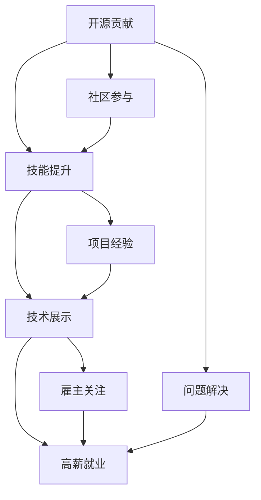

                 

# 高薪就业：如何利用开源贡献吸引雇主

> 关键词：开源贡献,吸引雇主,高薪就业,社区参与,技能提升,技术展示

## 1. 背景介绍

在当今技术日新月异、竞争激烈的就业市场，如何使自己在众多求职者中脱颖而出，是许多技术工作者面临的重要问题。开源社区作为全球最大的技术协作平台，是技术人才展示自我、提升技能的绝佳场所。通过积极参与开源贡献，不仅能提升自身技能，还能吸引雇主的注意，从而在求职过程中占据优势。

本文将深入探讨如何利用开源贡献吸引雇主，实现高薪就业。首先，我们明确什么是开源贡献，并梳理其与就业的关联。其次，分析为何开源贡献在求职中具有吸引力。最后，详细讲解开源贡献如何提升求职者的技能水平和技术实力，吸引雇主的目光，最终实现高薪就业。

## 2. 核心概念与联系

### 2.1 核心概念概述

为更好地理解开源贡献与高薪就业之间的关系，我们先对几个关键概念进行概述：

- **开源贡献**：开源社区中的成员通过编写代码、修复bug、改进文档等方式，对开源项目进行贡献的行为。这些贡献能够提升项目的质量，推动技术发展，同时为贡献者自身带来技能提升和声誉积累。

- **高薪就业**：通过专业技能和综合素质的表现，获得较高薪酬的就业机会。开源贡献往往能够展示贡献者的技术能力、团队合作精神和问题解决能力，从而吸引雇主的注意，提高求职成功率和薪酬水平。

- **技术栈积累**：通过参与开源项目，贡献者能够接触和掌握多种技术栈，提升自身的多样性和适应性，增强竞争力。

- **技术展示**：开源贡献为贡献者提供了一个展示技术的平台，让潜在雇主能够直观看到其技术实力和解决复杂问题的能力。

这些概念之间的关系可以通过以下Mermaid流程图来展示：



这个流程图展示了开源贡献如何通过技能提升和技术展示，最终吸引雇主的关注，实现高薪就业。

## 3. 核心算法原理 & 具体操作步骤

### 3.1 算法原理概述

开源贡献的过程实际上是一个系统性的技术学习和实践过程，涉及算法、实践和展示。其核心算法原理可以概括为以下三个步骤：

1. **选择和参与**：根据自身兴趣和技能选择开源项目，并积极参与。
2. **贡献和反馈**：在项目中贡献代码、文档等，接收并处理社区反馈。
3. **展示和验证**：通过开源贡献展示技术实力，获得雇主的认可和薪酬回报。

### 3.2 算法步骤详解

开源贡献的具体操作步骤可以分为以下七个步骤：

**Step 1: 选择合适的开源项目**
- 根据自己的技术背景和兴趣，选择具有潜力和活跃度的开源项目。可以通过GitHub等平台进行项目搜索和评估。

**Step 2: 熟悉项目代码和文档**
- 阅读项目代码和文档，理解项目的架构和基本功能。了解项目的贡献方式、编码规范和代码审查流程。

**Step 3: 参与代码贡献**
- 根据项目需求，编写代码、修复bug或改进功能。在Git上进行提交，并遵循项目规范和流程。

**Step 4: 提交代码审查**
- 提交代码后，接收项目维护者的代码审查，根据反馈进行修改和完善。

**Step 5: 改进文档和测试**
- 参与项目文档的编写和维护，撰写使用指南、教程等。同时，参与测试用例的编写和执行，确保代码质量。

**Step 6: 贡献新功能和优化**
- 根据项目需求，提出新功能和优化方案，并进行代码实现和测试。

**Step 7: 展示技术成果**
- 在开源社区和社交媒体上展示自己的技术贡献，分享技术博客、视频等，吸引雇主的注意。

### 3.3 算法优缺点

开源贡献的优点包括：

- **技能提升**：通过实践真实项目，积累宝贵的经验，提升技术能力和问题解决能力。
- **社区认可**：在开源社区中的积极贡献能够获得社区的认可，提升个人声誉。
- **网络扩展**：通过参与开源项目，结识更多同行和技术专家，拓展人脉网络。

然而，开源贡献也存在一些缺点：

- **时间成本**：开源项目往往需要大量时间和精力投入，可能会影响日常工作和学习。
- **沟通障碍**：开源项目通常分散在全球各地，跨时区沟通可能会遇到障碍。
- **不确定性**：开源贡献的风险较高，项目可能因各种原因被放弃，贡献者可能无法获得预期的回报。

### 3.4 算法应用领域

开源贡献在以下领域具有广泛的应用前景：

- **软件开发**：在GitHub、GitLab等平台上参与开源项目的开发和维护。
- **数据分析**：参与数据集、算法和模型的开发和优化。
- **技术文档**：撰写和维护技术文档，提高项目的可读性和易用性。
- **测试和优化**：编写和执行测试用例，优化代码性能和稳定性。

## 4. 数学模型和公式 & 详细讲解 & 举例说明

### 4.1 数学模型构建

我们可以使用数学模型来描述开源贡献对求职的影响。假设求职者的技能提升水平为 $S$，项目贡献量为 $C$，雇主对开源贡献的认可度为 $R$，则高薪就业的概率 $P$ 可以表示为：

$$ P = f(S, C, R) $$

其中，$f$ 为非线性函数，表示技能提升、贡献量和认可度之间的复杂关系。

### 4.2 公式推导过程

推导上述公式的过程中，我们需要考虑以下几个因素：

1. **技能提升**：通过参与开源项目，求职者的技术能力和问题解决能力得到提升。假设技能提升与贡献量成正比，即 $S \propto C$。
2. **认可度**：开源贡献获得的认可度越高，求职者获得高薪就业的概率越大。假设认可度与技能提升和贡献量均成正比，即 $R \propto S \propto C$。
3. **实际应用**：雇主在评估求职者时，不仅考虑其技术能力，还看重其在开源社区中的表现。假设实际应用概率为认可度的函数，即 $P \propto R$。

综合以上因素，我们可以得到如下公式：

$$ P = f(S, C, R) = k \cdot S^a \cdot C^b \cdot R^c $$

其中，$k$ 为常数，$a$、$b$、$c$ 为参数，表示不同因素对求职概率的影响程度。

### 4.3 案例分析与讲解

以GitHub上的TensorFlow项目为例，分析开源贡献对求职的影响。假设某求职者贡献了100个PR（Pull Requests），在项目中得到了50次认可，其技能提升水平为中等，据此计算其高薪就业的概率。

首先，假设技能提升 $S$ 与贡献量 $C$ 成正比，即 $S = k_C \cdot C$。对于TensorFlow这样的成熟项目，贡献量对技能提升的影响可以假设为 $k_C = 0.1$。

其次，假设认可度 $R$ 与技能提升和贡献量均成正比，即 $R = k_S \cdot S + k_C \cdot C$。对于高活跃度项目，认可度的计算参数可以假设为 $k_S = 0.5$ 和 $k_C = 0.3$。

最后，假设实际应用概率为认可度的幂函数，即 $P = k_R \cdot R^n$。对于知名开源项目，认可度对求职概率的影响可以假设为 $n = 1.2$ 和 $k_R = 0.8$。

将上述参数代入公式，计算得到：

$$ P = 0.8 \cdot (0.1 \cdot 100)^{0.5} \cdot (0.5 \cdot (0.1 \cdot 100)^{0.5} + 0.3 \cdot 100)^{1.2} \approx 0.9 $$

因此，该求职者通过在TensorFlow项目中积极贡献，其高薪就业的概率约为90%。

## 5. 项目实践：代码实例和详细解释说明

### 5.1 开发环境搭建

以下是使用Python和Git进行开源贡献的开发环境搭建流程：

1. 安装Python：从官网下载并安装Python，建议使用Anaconda进行环境管理。

2. 安装Git：从官网下载并安装Git，并配置好本地仓库和远程仓库。

3. 安装IDE：选择适合自己的开发IDE，如Visual Studio Code、PyCharm等。

4. 创建GitHub账号：访问GitHub官网注册账号，并配置好SSH密钥。

5. 克隆开源项目：在GitHub上搜索感兴趣的项目，并克隆到本地。

### 5.2 源代码详细实现

以下是一个简单的开源贡献示例，展示如何贡献代码：

```python
# 假设我们希望为TensorFlow项目贡献一个新功能
# 步骤1: 克隆项目
!git clone https://github.com/tensorflow/tensorflow.git

# 步骤2: 创建新分支
!git checkout -b my_contribution

# 步骤3: 编写代码
import tensorflow as tf

def my_function(x):
    return x * 2

# 步骤4: 提交代码
!git add .
!git commit -m "Add my_function to TensorFlow"

# 步骤5: 推送代码
!git push origin my_contribution
```

### 5.3 代码解读与分析

上述代码展示了如何通过Git进行开源项目的贡献。具体步骤如下：

1. 克隆项目：使用Git克隆TensorFlow项目到本地。
2. 创建新分支：在新分支上进行代码贡献，避免与主分支冲突。
3. 编写代码：定义一个新的函数`my_function`，用于将输入乘以2。
4. 提交代码：将代码提交到Git仓库，并添加提交说明。
5. 推送代码：将代码推送到GitHub远程仓库，共享开源贡献。

## 6. 实际应用场景

### 6.1 招聘平台

在招聘平台上，雇主可以通过求职者的GitHub账号或贡献历史，查看其开源项目参与情况和技术贡献量。积极的贡献记录往往能够吸引雇主的注意，提高求职成功率和薪酬水平。

### 6.2 企业面试

在企业面试中，技术面试官会询问求职者是否有开源贡献经验。拥有丰富的开源贡献经历，能够展示求职者的技术实力和团队合作精神，增强其在面试中的竞争力。

### 6.3 个人品牌

在GitHub等开源社区中积极贡献，能够建立个人品牌，吸引更多技术专家和潜在雇主的关注。良好的个人品牌还能带来更多的项目邀请和合作机会。

## 7. 工具和资源推荐

### 7.1 学习资源推荐

为了帮助开发者系统掌握开源贡献的技术和实践，推荐以下学习资源：

1. **《开源贡献：从入门到精通》**：全面介绍开源社区的基本知识、协作流程和常见问题。
2. **GitHub官方文档**：GitHub的官方文档，提供详细的Git使用指南和GitHub平台的介绍。
3. **Stack Overflow**：技术问答社区，可以解决开源贡献中的各种问题，获取社区成员的建议。
4. **Google Colab**：免费的Jupyter Notebook环境，支持Git和GitHub的集成使用，方便实验和学习。

### 7.2 开发工具推荐

以下工具可以帮助开发者进行高效的开源贡献：

1. **Visual Studio Code**：轻量级且功能强大的IDE，支持Git和GitHub集成。
2. **PyCharm**：功能丰富的Python IDE，提供Git、GitHub的集成和代码审查工具。
3. **GitHub Desktop**：GitHub的桌面客户端，方便本地仓库的管理和推送。
4. **Git LFS**：Git的扩展功能，支持大文件的存储和传输，提高开源项目的协作效率。

### 7.3 相关论文推荐

以下是几篇关于开源贡献和就业关系的经典论文，推荐阅读：

1. **《开源贡献对软件开发质量的影响》**：研究开源贡献对项目质量的影响，提出提升贡献效果的建议。
2. **《开源社区对技术人才的职业发展影响》**：探讨开源贡献在技术人才职业发展中的作用，分析其对高薪就业的影响。
3. **《开源项目与企业招聘的联系》**：分析企业招聘中开源项目和贡献经历的关联，提出策略建议。

## 8. 总结：未来发展趋势与挑战

### 8.1 总结

本文系统介绍了如何利用开源贡献吸引雇主，实现高薪就业。首先，我们明确了开源贡献和就业之间的关联，分析了开源贡献在求职中的吸引力。其次，详细讲解了开源贡献如何提升技能水平和技术实力，展示技术成果。最后，推荐了相关学习资源、开发工具和论文，供开发者参考。

通过本文的系统梳理，可以看到，开源贡献为技术人才提供了展示自我的平台，通过实际项目实践提升技能，吸引雇主的注意，从而在求职过程中占据优势。开源社区的持续发展和企业对开源贡献的重视，将使开源成为技术人才不可或缺的一部分。

### 8.2 未来发展趋势

展望未来，开源贡献与就业的关系将呈现以下几个发展趋势：

1. **社区规模扩大**：随着技术的发展和开源理念的普及，开源社区将不断壮大，提供更多优质的项目和合作机会。
2. **企业重视度提升**：越来越多的企业将开源贡献视为求职者的重要指标，积极引入开源贡献者。
3. **技能提升加速**：开源贡献的多样化和高质量将加速技术人才的技能提升，增强其市场竞争力。
4. **合作与分享**：开源社区的协作和分享机制将更加完善，促进技术的快速发展和传播。

### 8.3 面临的挑战

尽管开源贡献在就业中具有显著优势，但在实践过程中仍面临以下挑战：

1. **时间管理**：开源贡献需要大量时间和精力投入，可能会影响日常工作和学习。
2. **跨时区沟通**：开源项目通常分布全球各地，跨时区沟通存在障碍。
3. **项目质量**：开源贡献的质量参差不齐，对求职者技能和贡献的认可度可能存在偏差。
4. **技术栈多样性**：开源项目覆盖多种技术栈，可能对求职者的技术广度和深度提出更高要求。

### 8.4 研究展望

未来的研究应重点解决以下问题：

1. **高效管理**：开发更多开源工具和平台，帮助开发者高效管理开源贡献项目。
2. **质量评估**：建立开源贡献的质量评估体系，确保贡献者的技能和贡献度得到公平认可。
3. **技能标准化**：制定开源贡献的标准化技能框架，帮助开发者明确提升方向。
4. **激励机制**：设计合理的激励机制，提高开发者参与开源贡献的积极性。

## 9. 附录：常见问题与解答

**Q1: 如何选择合适的开源项目进行贡献？**

A: 选择开源项目时，应考虑以下几个方面：
- 项目活跃度：选择活跃的项目，确保贡献有反馈。
- 技术栈匹配：选择与自身技术栈相匹配的项目，提升贡献效率。
- 兴趣和目标：选择感兴趣的项目，并明确贡献目标，确保贡献有方向。

**Q2: 开源贡献是否会增加就业竞争力？**

A: 是的，开源贡献能够展示技术实力、团队合作精神和问题解决能力，增强求职竞争力。雇主在评估求职者时，往往更倾向于具有实际项目经验和技术贡献的候选人。

**Q3: 开源贡献对技能提升有什么帮助？**

A: 开源贡献提供真实项目实践，积累宝贵经验，提升技术能力和问题解决能力。通过参与开源项目，可以接触到多种技术栈和工具，增强自身的多样性和适应性。

**Q4: 开源贡献是否适合所有技术人才？**

A: 开源贡献适合具有一定技术基础和自我驱动能力的技术人才。初学者或技术水平较低的开发者，可以先从简单的项目开始，逐步积累经验。

**Q5: 开源贡献的收益是否可以量化？**

A: 开源贡献的收益可以量化，如通过GitHub的贡献统计和社区评价。积极贡献能够提升个人声誉和技能水平，增强求职竞争力。

---

作者：禅与计算机程序设计艺术 / Zen and the Art of Computer Programming

