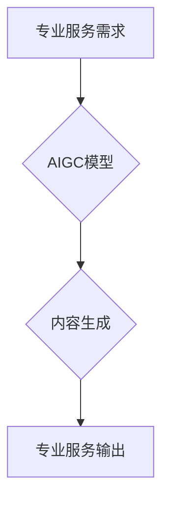

                 

## AIGC重塑专业服务行业

> 关键词：AIGC, 专业服务, 自动化, 智能化, 效率提升, 人工智能, 知识工作者

## 1. 背景介绍

随着人工智能技术的飞速发展，特别是生成式人工智能（AIGC）的兴起，专业服务行业正在经历一场深刻的变革。AIGC能够自动生成高质量的文本、图像、音频等内容，为专业服务提供商带来了前所未有的机遇。

传统专业服务行业，例如法律、会计、咨询、医疗等，通常依赖于人类专家进行知识工作。这些工作通常需要大量的专业知识、经验和时间，效率相对较低，成本也较高。AIGC的出现，能够有效地自动化和智能化这些工作流程，提高效率，降低成本，并释放专业人员更多的时间和精力，专注于更复杂、更具创造性的工作。

## 2. 核心概念与联系

### 2.1 AIGC 简介

AIGC是指利用人工智能技术，自动生成各种类型内容的系统。它基于深度学习算法，能够学习和理解人类语言、图像、音频等多种数据模式，并生成符合特定格式和风格的新内容。

### 2.2 专业服务行业概述

专业服务行业是指提供专业知识、技能和服务的行业，例如法律、会计、咨询、医疗、教育等。这些行业通常需要高度的专业知识、经验和技能，并依赖于人类专家的判断和决策。

### 2.3 AIGC与专业服务行业的融合

AIGC能够通过以下方式与专业服务行业融合：

* **自动化重复性任务:** AIGC可以自动完成许多重复性、规则性的工作，例如合同审查、财务报表分析、客户服务回复等，释放专业人员的时间和精力，让他们专注于更复杂、更具创造性的工作。
* **智能化知识处理:** AIGC可以帮助专业人员快速获取和处理大量信息，例如法律法规、市场数据、客户案例等，提高工作效率和决策准确性。
* **个性化服务体验:** AIGC可以根据客户的需求，生成个性化的服务内容，例如法律咨询、财务规划、医疗诊断等，提升客户体验。

**Mermaid 流程图**



## 3. 核心算法原理 & 具体操作步骤

### 3.1 算法原理概述

AIGC的核心算法主要包括：

* **自然语言处理 (NLP):** 用于理解和生成人类语言的算法，例如文本分类、情感分析、机器翻译等。
* **深度学习 (DL):** 用于训练模型，学习数据模式的算法，例如卷积神经网络 (CNN)、循环神经网络 (RNN) 等。
* **生成模型:** 用于生成新内容的算法，例如变分自编码器 (VAE)、生成对抗网络 (GAN) 等。

### 3.2 算法步骤详解

AIGC的具体操作步骤如下：

1. **数据收集和预处理:** 收集相关数据，例如文本、图像、音频等，并进行清洗、格式化、标注等预处理工作。
2. **模型训练:** 使用深度学习算法，训练AIGC模型，使其能够理解和生成目标内容类型。
3. **内容生成:** 根据用户需求，输入相应的提示或参数，让AIGC模型生成新的内容。
4. **内容评估和优化:** 对生成的內容进行评估，例如准确性、流畅度、原创性等，并根据评估结果进行模型优化。

### 3.3 算法优缺点

**优点:**

* **自动化:** 可以自动完成许多重复性、规则性的工作，提高效率。
* **智能化:** 可以根据数据模式，生成符合特定格式和风格的新内容。
* **个性化:** 可以根据用户需求，生成个性化的服务内容。

**缺点:**

* **数据依赖:** AIGC模型的性能取决于训练数据的质量和数量。
* **伦理问题:** AIGC生成的內容可能存在版权问题、偏见问题等伦理问题。
* **解释性问题:** AIGC模型的决策过程通常是黑盒，难以解释其生成内容的原理。

### 3.4 算法应用领域

AIGC算法在专业服务行业有着广泛的应用领域，例如：

* **法律服务:** 合同审查、法律文件生成、法律风险评估等。
* **会计服务:** 财务报表分析、税务申报、审计等。
* **咨询服务:** 市场调研、商业计划书撰写、战略咨询等。
* **医疗服务:** 医疗诊断辅助、病历摘要、药物信息查询等。

## 4. 数学模型和公式 & 详细讲解 & 举例说明

### 4.1 数学模型构建

AIGC模型通常基于深度学习算法，例如Transformer模型。Transformer模型的核心是注意力机制，它能够学习文本中不同词语之间的关系，并赋予每个词语不同的权重。

**注意力机制公式:**

$$
Attention(Q, K, V) = softmax(\frac{QK^T}{\sqrt{d_k}})V
$$

其中：

* $Q$：查询矩阵
* $K$：键矩阵
* $V$：值矩阵
* $d_k$：键向量的维度
* $softmax$：softmax函数

### 4.2 公式推导过程

注意力机制的公式通过计算查询向量与键向量的点积，并使用softmax函数归一化，得到每个键向量对应的权重。然后，将这些权重与值向量相乘，得到最终的输出。

### 4.3 案例分析与讲解

例如，在机器翻译任务中，查询向量可以是源语言的词向量，键向量和值向量可以是目标语言的词向量。通过注意力机制，模型可以学习源语言和目标语言之间的对应关系，并生成更准确的翻译结果。

## 5. 项目实践：代码实例和详细解释说明

### 5.1 开发环境搭建

AIGC项目开发环境通常需要以下软件：

* Python 3.x
* TensorFlow 或 PyTorch 深度学习框架
* Jupyter Notebook 或 VS Code 代码编辑器
* CUDA 和 cuDNN GPU加速库

### 5.2 源代码详细实现

以下是一个简单的AIGC文本生成代码示例，使用GPT-2模型：

```python
from transformers import pipeline

generator = pipeline('text-generation', model='gpt2')

text = "The quick brown fox jumps over the"
output = generator(text, max_length=50, num_return_sequences=3)

for sequence in output:
    print(sequence['generated_text'])
```

### 5.3 代码解读与分析

* `pipeline('text-generation', model='gpt2')`：使用HuggingFace Transformers库加载预训练的GPT-2模型，并创建文本生成管道。
* `generator(text, max_length=50, num_return_sequences=3)`：使用管道生成文本，输入文本为"The quick brown fox jumps over the"，最大长度为50个词，生成3个不同的文本序列。
* `print(sequence['generated_text'])`：打印生成的文本序列。

### 5.4 运行结果展示

运行该代码，可以生成以下类似的文本序列：

```
The quick brown fox jumps over the lazy dog.
The quick brown fox jumps over the fence.
The quick brown fox jumps over the moon.
```

## 6. 实际应用场景

### 6.1 法律服务

* **合同审查:** AIGC可以自动审查合同条款，识别潜在风险和违规内容，提高效率和准确性。
* **法律文件生成:** AIGC可以根据用户需求，自动生成法律文件，例如诉状、合同、法律意见书等，节省律师的时间和精力。
* **法律风险评估:** AIGC可以分析法律法规和案例数据，评估特定事件或交易的法律风险，帮助企业规避法律风险。

### 6.2 会计服务

* **财务报表分析:** AIGC可以自动分析财务报表数据，识别财务指标的趋势和异常，帮助会计师进行更深入的分析和判断。
* **税务申报:** AIGC可以根据用户的财务数据，自动生成税务申报表，提高申报效率和准确性。
* **审计:** AIGC可以辅助审计师进行审计工作，例如自动识别异常交易、分析财务数据等，提高审计效率和质量。

### 6.3 咨询服务

* **市场调研:** AIGC可以分析市场数据和用户评论，识别市场趋势和客户需求，帮助企业制定更有效的市场策略。
* **商业计划书撰写:** AIGC可以根据用户的业务需求，自动生成商业计划书，帮助企业融资和发展。
* **战略咨询:** AIGC可以分析企业内部数据和外部环境信息，为企业提供战略决策建议。

### 6.4 未来应用展望

随着AIGC技术的不断发展，其在专业服务行业的应用场景将更加广泛和深入。例如：

* **个性化服务:** AIGC可以根据用户的具体需求，提供个性化的专业服务，例如定制化的法律咨询、财务规划、医疗诊断等。
* **跨语言服务:** AIGC可以支持多语言服务，帮助跨国企业和个人进行更便捷的沟通和合作。
* **协同工作:** AIGC可以与人类专家协同工作，帮助专家更高效地完成工作，例如法律团队可以利用AIGC自动完成合同审查，专注于更复杂的法律问题。

## 7. 工具和资源推荐

### 7.1 学习资源推荐

* **书籍:**
    * 《深度学习》 by Ian Goodfellow, Yoshua Bengio, and Aaron Courville
    * 《自然语言处理》 by Dan Jurafsky and James H. Martin
* **在线课程:**
    * Coursera: Deep Learning Specialization
    * edX: Artificial Intelligence
* **博客和网站:**
    * Towards Data Science
    * Machine Learning Mastery

### 7.2 开发工具推荐

* **Python:** 
    * TensorFlow
    * PyTorch
    * HuggingFace Transformers
* **Jupyter Notebook:** 
    * VS Code

### 7.3 相关论文推荐

* **Attention Is All You Need:** https://arxiv.org/abs/1706.03762
* **BERT: Pre-training of Deep Bidirectional Transformers for Language Understanding:** https://arxiv.org/abs/1810.04805
* **GPT-3: Language Models are Few-Shot Learners:** https://arxiv.org/abs/2005.14165

## 8. 总结：未来发展趋势与挑战

### 8.1 研究成果总结

AIGC技术在专业服务行业取得了显著的成果，例如自动化重复性任务、智能化知识处理、个性化服务体验等。

### 8.2 未来发展趋势

* **更强大的模型:** 未来AIGC模型将更加强大，能够处理更复杂的任务，生成更高质量的内容。
* **更广泛的应用场景:** AIGC将应用于更多专业服务领域，例如教育、金融、医疗等。
* **更智能化的交互:** AIGC将与人类专家进行更智能化的交互，例如对话式AIGC、协同工作等。

### 8.3 面临的挑战

* **数据质量:** AIGC模型的性能取决于训练数据的质量和数量，高质量数据的获取和标注仍然是一个挑战。
* **伦理问题:** AIGC生成的內容可能存在版权问题、偏见问题等伦理问题，需要制定相应的规范和制度。
* **解释性问题:** AIGC模型的决策过程通常是黑盒，难以解释其生成内容的原理，需要研究更可解释的AIGC模型。

### 8.4 研究展望

未来AIGC研究将重点关注以下几个方面:

* **提高模型的泛化能力:** 使模型能够适应不同的应用场景和数据类型。
* **增强模型的安全性:** 确保AIGC模型的安全性和可靠性，防止其被恶意利用。
* **研究更可解释的AIGC模型:** 使模型的决策过程更加透明，更容易被理解和信任。


## 9. 附录：常见问题与解答

**Q1: AIGC是否会取代人类专家？**

A1: AIGC能够自动化许多重复性、规则性的工作，但它并不能完全取代人类专家。人类专家仍然需要负责更复杂、更具创造性的工作，例如解决复杂问题、进行战略决策、提供情感支持等。

**Q2: 如何确保AIGC生成的內容的准确性和可靠性？**

A2: 确保AIGC生成的內容的准确性和可靠性需要从多个方面入手，例如：

* 使用高质量的训练数据
* 采用有效的模型训练方法
* 对生成的內容进行严格的评估和验证
* 建立相应的规范和制度，规范AIGC的应用

**Q3: AIGC的伦理问题有哪些？**

A3: AIGC的伦理问题主要包括：

* **版权问题:** AIGC生成的內容是否侵犯了原作者的版权？
* **偏见问题:** AIGC模型是否会学习到数据中的偏见，从而生成带有偏见的內容？
* **透明度问题:** AIGC模型的决策过程是否透明可解释？

**Q4: 如何学习AIGC相关知识？**

A4: 可以通过以下途径学习AIGC相关知识：

* 阅读相关书籍和论文
* 参加在线课程和培训
* 关注相关博客和网站
* 参与开源项目和社区讨论

作者：禅与计算机程序设计艺术 / Zen and the Art of Computer Programming 


<end_of_turn>

