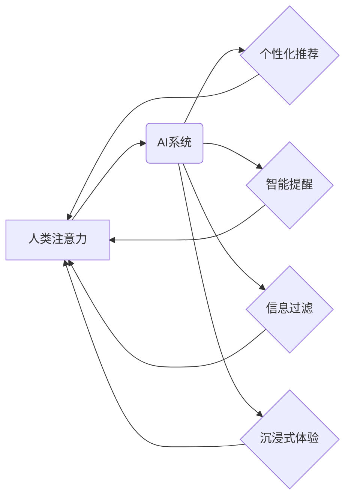

                 

## 关键词：人工智能、注意力流、认知科学、深度学习、注意力机制、工作效率、生活方式、注意力管理策略、技术应用

## 1. 背景介绍

在当今信息爆炸的时代，人类面临着前所未有的注意力挑战。来自社交媒体、电子邮件、新闻推送等各种渠道的信息轰炸，使得我们难以集中精力完成任务，保持专注力。同时，人工智能（AI）技术的飞速发展，也带来了新的机遇和挑战。AI系统能够自动学习和处理海量数据，并通过个性化推荐、智能提醒等方式影响我们的注意力流向。

如何理解和管理人类注意力流，在AI时代显得尤为重要。一方面，我们需要了解AI如何影响我们的注意力，并采取措施保护我们的认知健康。另一方面，我们也可以利用AI技术开发新的工具和策略，帮助人们更好地管理注意力，提高工作效率和生活质量。

## 2. 核心概念与联系

### 2.1 人类注意力流

注意力流是指人类对信息进行选择性感知和处理的过程。它是一个动态的、多层次的系统，受多种因素影响，包括认知能力、情绪状态、环境刺激等。

**注意力流的三个关键要素：**

* **选择性:** 人类只能同时关注有限的信息，需要选择性地过滤和处理信息。
* **动态性:** 注意力流并非静态的，它会随着时间和环境的变化而不断变化。
* **层次性:** 注意力流可以分为不同的层次，例如，感知层、认知层、情感层等。

### 2.2 AI与注意力流的交互

AI系统可以通过多种方式影响人类注意力流：

* **个性化推荐:** AI算法可以根据用户的历史行为和偏好，推荐个性化的内容，吸引用户的注意力。
* **智能提醒:** AI系统可以根据用户的日程安排和任务清单，发送智能提醒，引导用户的注意力。
* **信息过滤:** AI算法可以过滤掉无关的信息，帮助用户集中注意力。
* **沉浸式体验:** AI技术可以创造沉浸式的虚拟现实或增强现实体验，吸引用户的注意力。

**AI与注意力流的交互关系：**



## 3. 核心算法原理 & 具体操作步骤

### 3.1 算法原理概述

注意力机制是深度学习领域的重要发展，它能够模拟人类的注意力机制，帮助模型更好地理解和处理信息。注意力机制的核心思想是，在处理信息时，模型应该关注与当前任务最相关的部分，而忽略无关的部分。

**注意力机制的三个关键要素：**

* **查询 (Query):** 表示模型当前需要关注的信息。
* **键 (Key):** 表示输入序列中每个元素的信息表示。
* **值 (Value):** 表示输入序列中每个元素的实际内容。

注意力机制通过计算查询与键之间的相似度，来确定模型应该关注哪些值。

### 3.2 算法步骤详解

1. **输入数据:** 将输入序列转换为一系列向量表示。
2. **计算查询、键和值:** 对每个输入向量进行线性变换，得到查询、键和值向量。
3. **计算注意力权重:** 计算查询向量与每个键向量的相似度，得到注意力权重。
4. **加权求和:** 根据注意力权重，对值向量进行加权求和，得到最终的输出向量。

### 3.3 算法优缺点

**优点:**

* **提高模型的表达能力:** 注意力机制能够帮助模型更好地理解和处理长序列数据。
* **提高模型的鲁棒性:** 注意力机制能够帮助模型忽略无关信息，提高对噪声的鲁棒性。
* **可解释性增强:** 注意力权重可以直观地反映模型关注哪些信息，提高模型的可解释性。

**缺点:**

* **计算复杂度高:** 注意力机制的计算复杂度较高，尤其是在处理长序列数据时。
* **参数量大:** 注意力机制需要更多的参数，这可能会导致模型训练时间更长。

### 3.4 算法应用领域

注意力机制在自然语言处理、计算机视觉、语音识别等领域都有广泛的应用。

* **机器翻译:** 注意力机制可以帮助模型更好地理解句子结构和语义，提高翻译质量。
* **文本摘要:** 注意力机制可以帮助模型识别重要信息，生成高质量的文本摘要。
* **图像识别:** 注意力机制可以帮助模型关注图像中的关键区域，提高识别准确率。

## 4. 数学模型和公式 & 详细讲解 & 举例说明

### 4.1 数学模型构建

注意力机制的数学模型可以表示为以下公式：

$$
\text{Attention}(Q, K, V) = \text{softmax}\left(\frac{Q K^T}{\sqrt{d_k}}\right) V
$$

其中：

* $Q$：查询向量
* $K$：键向量
* $V$：值向量
* $d_k$：键向量的维度
* $\text{softmax}$：softmax函数，用于将注意力权重归一化

### 4.2 公式推导过程

1. **计算查询与键之间的相似度:**

$$
\text{score}(Q, K) = \frac{Q K^T}{\sqrt{d_k}}
$$

2. **应用softmax函数归一化:**

$$
\text{attention}(Q, K) = \text{softmax}(\text{score}(Q, K))
$$

3. **加权求和:**

$$
\text{Attention}(Q, K, V) = \text{attention}(Q, K) V
$$

### 4.3 案例分析与讲解

假设我们有一个句子：“我爱吃苹果”，我们想要用注意力机制来理解这个句子的语义。

* $Q$：查询向量表示“我爱吃”
* $K$：键向量表示每个单词的语义信息
* $V$：值向量表示每个单词的实际内容

注意力机制会计算查询向量与每个键向量的相似度，并得到一个注意力权重向量。这个权重向量会指示模型应该关注哪些单词，例如，“苹果”这个单词的注意力权重会比较高。

## 5. 项目实践：代码实例和详细解释说明

### 5.1 开发环境搭建

* Python 3.7+
* TensorFlow 2.0+
* PyTorch 1.0+

### 5.2 源代码详细实现

```python
import tensorflow as tf

# 定义查询、键和值向量
query = tf.constant([[1, 2, 3], [4, 5, 6]])
key = tf.constant([[7, 8, 9], [10, 11, 12]])
value = tf.constant([[13, 14, 15], [16, 17, 18]])

# 计算注意力权重
attention_weights = tf.matmul(query, key, transpose_b=True) / tf.math.sqrt(key.shape[-1])
attention_weights = tf.nn.softmax(attention_weights, axis=-1)

# 加权求和
output = tf.matmul(attention_weights, value)

# 打印输出
print(output)
```

### 5.3 代码解读与分析

* 代码首先定义了查询、键和值向量。
* 然后，使用矩阵乘法计算查询向量与键向量的相似度。
* 使用softmax函数将相似度转换为注意力权重。
* 最后，使用注意力权重对值向量进行加权求和，得到最终的输出向量。

### 5.4 运行结果展示

运行上述代码，会输出一个注意力权重矩阵和一个输出向量。注意力权重矩阵可以直观地反映模型关注哪些信息，输出向量则表示模型对输入序列的理解。

## 6. 实际应用场景

### 6.1 工作场景

* **提高工作效率:** 利用AI工具自动过滤无关信息，帮助用户集中注意力完成重要任务。
* **增强学习效果:** 使用AI辅助学习平台，个性化推荐学习内容，提高学习效率。
* **改善团队协作:** AI工具可以帮助团队成员更好地沟通和协作，提高工作效率。

### 6.2 生活场景

* **减少信息过载:** AI可以帮助用户过滤掉无关信息，减少信息过载带来的压力。
* **提升专注力:** AI工具可以帮助用户设定专注时间，并提醒用户保持专注。
* **改善睡眠质量:** AI可以分析用户的睡眠数据，并提供个性化的睡眠建议。

### 6.4 未来应用展望

* **个性化注意力管理:** AI可以根据用户的认知特点和需求，提供个性化的注意力管理策略。
* **沉浸式学习体验:** AI可以创造沉浸式的虚拟现实或增强现实学习环境，提高学习兴趣和效果。
* **增强人机交互:** AI可以更好地理解人类的注意力流向，从而提供更自然、更人性化的交互体验。

## 7. 工具和资源推荐

### 7.1 学习资源推荐

* **书籍:**
    * 《深度学习》
    * 《Attention Is All You Need》
* **在线课程:**
    * Coursera: 深度学习
    * Udacity: 自然语言处理

### 7.2 开发工具推荐

* **TensorFlow:** 开源深度学习框架
* **PyTorch:** 开源深度学习框架
* **Keras:** 高级深度学习API

### 7.3 相关论文推荐

* 《Attention Is All You Need》
* 《BERT: Pre-training of Deep Bidirectional Transformers for Language Understanding》
* 《Transformer-XL: Attentive Language Models Beyond a Fixed-Length Context》

## 8. 总结：未来发展趋势与挑战

### 8.1 研究成果总结

近年来，注意力机制在人工智能领域取得了显著的进展，并在自然语言处理、计算机视觉等领域取得了突破性成果。

### 8.2 未来发展趋势

* **更强大的注意力机制:** 研究人员将继续探索更强大的注意力机制，例如，自注意力机制、多头注意力机制等。
* **注意力机制的泛化:** 将注意力机制应用到更多领域，例如，时间序列分析、推荐系统等。
* **注意力机制的可解释性:** 研究人员将致力于提高注意力机制的可解释性，帮助人们更好地理解模型的决策过程。

### 8.3 面临的挑战

* **计算复杂度:** 注意力机制的计算复杂度较高，在处理大规模数据时会面临挑战。
* **参数量:** 注意力机制需要更多的参数，这可能会导致模型训练时间更长。
* **数据依赖性:** 注意力机制的性能依赖于训练数据的质量，缺乏高质量数据的训练可能会导致模型性能下降。

### 8.4 研究展望

未来，注意力机制将继续是人工智能领域的重要研究方向。随着研究的深入，我们相信注意力机制将为我们带来更多惊喜，帮助我们更好地理解和利用人工智能技术。

## 9. 附录：常见问题与解答

**Q1: 注意力机制与深度学习的关系是什么？**

**A1:** 注意力机制是深度学习领域的重要发展，它能够模拟人类的注意力机制，帮助模型更好地理解和处理信息。

**Q2: 注意力机制有哪些应用场景？**

**A2:** 注意力机制在自然语言处理、计算机视觉、语音识别等领域都有广泛的应用。

**Q3: 注意力机制的优缺点是什么？**

**A3:** 注意力机制的优点是提高模型的表达能力、鲁棒性和可解释性。缺点是计算复杂度高、参数量大。


作者：禅与计算机程序设计艺术 / Zen and the Art of Computer Programming 
<end_of_turn>

