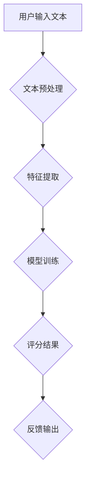

                 

## AI写作评分：自动化教育评估

> 关键词：人工智能、写作评分、自动化评估、自然语言处理、机器学习、教育技术、文本分析、质量评估

## 1. 背景介绍

随着教育技术的快速发展，自动化评估逐渐成为教育领域的重要趋势。传统的教师评分方式存在着主观性强、效率低、难以量化等问题。而人工智能（AI）技术的进步为自动化评估提供了新的可能性。AI写作评分系统利用自然语言处理（NLP）和机器学习（ML）技术，能够自动分析和评估学生的写作水平，为教师提供更客观、更精准的反馈。

近年来，AI写作评分系统在教育领域得到了广泛应用，例如：

* **自动批改作业：** AI系统可以自动批改学生的作文、论文等，节省教师的时间和精力。
* **个性化学习：** AI系统可以根据学生的写作水平提供个性化的学习建议和练习，帮助学生提高写作能力。
* **写作能力诊断：** AI系统可以分析学生的写作特点，诊断学生的写作能力强弱，为教师提供学生学习情况的参考。

## 2. 核心概念与联系

AI写作评分系统的核心概念包括：自然语言处理、机器学习、文本分析、写作评价标准等。

**2.1 自然语言处理（NLP）**

NLP是人工智能的一个分支，致力于使计算机能够理解、处理和生成人类语言。在AI写作评分系统中，NLP技术用于对学生的文本进行分析，提取语法结构、词汇特征、语义信息等。

**2.2 机器学习（ML）**

ML是人工智能的另一个重要分支，它通过算法训练模型，使模型能够从数据中学习规律，并对新的数据进行预测或分类。在AI写作评分系统中，ML算法用于训练模型，学习不同写作水平的文本特征，并根据这些特征对学生的文本进行评分。

**2.3 文本分析**

文本分析是指对文本进行自动分析，提取文本中的有用信息。在AI写作评分系统中，文本分析技术用于分析学生的文本，提取语法结构、词汇特征、语义信息等，为机器学习模型提供输入数据。

**2.4 写作评价标准**

写作评价标准是指用于评估学生的写作水平的标准。常见的写作评价标准包括语法准确性、词汇丰富度、结构清晰度、逻辑严密性、内容深度等。

**2.5 系统架构**



## 3. 核心算法原理 & 具体操作步骤

### 3.1 算法原理概述

AI写作评分系统常用的算法包括：

* **支持向量机（SVM）:** SVM是一种监督学习算法，可以将文本数据映射到高维空间，找到最佳的分隔超平面，用于分类和回归。
* **随机森林（RF）:** RF是一种集成学习算法，通过构建多个决策树，并对它们的预测结果进行投票，提高预测精度。
* **深度学习（DL）:** DL是一种基于多层神经网络的算法，能够学习文本数据的复杂特征，并进行更精准的评分。

### 3.2 算法步骤详解

以深度学习算法为例，AI写作评分系统的具体操作步骤如下：

1. **数据收集和预处理:** 收集大量高质量的文本数据，并进行预处理，例如去除停用词、标点符号等，将文本转换为数字向量。
2. **模型构建:** 选择合适的深度学习模型，例如循环神经网络（RNN）或Transformer，并根据任务需求进行参数设置。
3. **模型训练:** 使用训练数据训练模型，调整模型参数，使模型能够准确地预测文本的写作水平。
4. **模型评估:** 使用测试数据评估模型的性能，例如准确率、召回率、F1-score等。
5. **模型部署:** 将训练好的模型部署到实际应用环境中，用于对学生的文本进行评分。

### 3.3 算法优缺点

**优点:**

* **高精度:** 深度学习算法能够学习文本数据的复杂特征，提高评分精度。
* **自动化:** AI写作评分系统能够自动批改作业，节省教师的时间和精力。
* **个性化:** AI系统可以根据学生的写作水平提供个性化的学习建议和练习。

**缺点:**

* **数据依赖:** 深度学习算法需要大量高质量的训练数据，否则模型性能会下降。
* **黑盒效应:** 深度学习模型的内部机制复杂，难以解释模型的评分结果。
* **伦理问题:** AI写作评分系统可能会存在偏见问题，需要进行充分的伦理评估。

### 3.4 算法应用领域

AI写作评分系统在教育领域之外，还可应用于其他领域，例如：

* **内容审核:** 自动检测网络上的垃圾信息、虚假信息等。
* **机器翻译:** 自动翻译文本，提高翻译效率。
* **聊天机器人:** 提高聊天机器人的对话质量。

## 4. 数学模型和公式 & 详细讲解 & 举例说明

### 4.1 数学模型构建

深度学习模型中常用的数学模型包括：

* **循环神经网络（RNN）:** RNN能够处理序列数据，例如文本，并学习文本中的上下文信息。

* **Transformer:** Transformer是一种更先进的序列模型，能够更有效地处理长文本序列。

### 4.2 公式推导过程

RNN模型的输出结果可以通过以下公式计算：

$$h_t = f(W_{xh}x_t + W_{hh}h_{t-1} + b_h)$$

其中：

* $h_t$ 是时间步t的隐藏状态。
* $x_t$ 是时间步t的输入。
* $W_{xh}$ 和 $W_{hh}$ 是权重矩阵。
* $b_h$ 是偏置项。
* $f$ 是激活函数。

### 4.3 案例分析与讲解

假设我们训练一个RNN模型用于评分学生的作文，模型的输入是作文的文本序列，输出是作文的评分。

训练过程中，模型会学习到不同写作水平的文本特征，例如语法错误、词汇丰富度、句子结构等。

当模型遇到新的作文时，它会根据学习到的特征对作文进行评分。

## 5. 项目实践：代码实例和详细解释说明

### 5.1 开发环境搭建

* Python 3.x
* TensorFlow 或 PyTorch
* NLTK 或 SpaCy

### 5.2 源代码详细实现

```python
import tensorflow as tf

# 定义模型结构
model = tf.keras.Sequential([
    tf.keras.layers.Embedding(input_dim=vocab_size, output_dim=embedding_dim),
    tf.keras.layers.LSTM(units=128),
    tf.keras.layers.Dense(units=1, activation='sigmoid')
])

# 编译模型
model.compile(optimizer='adam', loss='binary_crossentropy', metrics=['accuracy'])

# 训练模型
model.fit(x_train, y_train, epochs=10)

# 评估模型
loss, accuracy = model.evaluate(x_test, y_test)
print('Loss:', loss)
print('Accuracy:', accuracy)
```

### 5.3 代码解读与分析

* **Embedding层:** 将文本单词转换为稠密的向量表示。
* **LSTM层:** 学习文本序列中的上下文信息。
* **Dense层:** 输出评分结果。
* **编译模型:** 选择优化器、损失函数和评价指标。
* **训练模型:** 使用训练数据训练模型。
* **评估模型:** 使用测试数据评估模型的性能。

### 5.4 运行结果展示

训练完成后，可以将模型应用于新的文本数据，并获得评分结果。

## 6. 实际应用场景

AI写作评分系统在教育领域有多种实际应用场景：

* **自动批改作业:** AI系统可以自动批改学生的作文、论文等，节省教师的时间和精力，并提供个性化的反馈。
* **写作能力诊断:** AI系统可以分析学生的写作特点，诊断学生的写作能力强弱，为教师提供学生学习情况的参考。
* **个性化学习:** AI系统可以根据学生的写作水平提供个性化的学习建议和练习，帮助学生提高写作能力。

## 7. 工具和资源推荐

### 7.1 学习资源推荐

* **斯坦福大学自然语言处理课程:** https://web.stanford.edu/class/cs224n/
* **DeepLearning.AI 自然语言处理课程:** https://www.deeplearning.ai/courses/natural-language-processing-specialization/

### 7.2 开发工具推荐

* **TensorFlow:** https://www.tensorflow.org/
* **PyTorch:** https://pytorch.org/
* **NLTK:** https://www.nltk.org/
* **SpaCy:** https://spacy.io/

### 7.3 相关论文推荐

* **BERT: Pre-training of Deep Bidirectional Transformers for Language Understanding:** https://arxiv.org/abs/1810.04805
* **GPT-3: Language Models are Few-Shot Learners:** https://arxiv.org/abs/2005.14165

## 8. 总结：未来发展趋势与挑战

### 8.1 研究成果总结

AI写作评分系统在近年来取得了显著的进展，能够自动分析和评估学生的写作水平，为教育教学提供新的可能性。

### 8.2 未来发展趋势

* **更精准的评分:** 通过更先进的深度学习算法和更大的训练数据集，提高AI写作评分系统的评分精度。
* **更个性化的反馈:** 基于学生的写作特点和学习目标，提供更个性化的学习建议和练习。
* **更全面的评估:** 不仅评估学生的语法和词汇水平，还评估学生的逻辑思维、批判性思维等能力。

### 8.3 面临的挑战

* **数据偏差:** 训练数据可能存在偏差，导致AI写作评分系统产生不公平的评分结果。
* **黑盒效应:** 深度学习模型的内部机制复杂，难以解释模型的评分结果，这可能会导致教师和学生对评分结果的信任度降低。
* **伦理问题:** AI写作评分系统可能会被用于监控和控制学生的写作行为，需要进行充分的伦理评估。

### 8.4 研究展望

未来，AI写作评分系统将朝着更精准、更个性化、更全面的方向发展，并与其他教育技术融合，为教育教学提供更丰富的服务。


## 9. 附录：常见问题与解答

**Q1: AI写作评分系统是否可以完全替代教师的评分？**

A1: 目前，AI写作评分系统仍然无法完全替代教师的评分。AI系统可以提供客观、量化的评分结果，但教师的评分更注重学生的理解、表达和创造力等方面。

**Q2: AI写作评分系统的数据来源是什么？**

A2: AI写作评分系统的训练数据通常来自公开的文本数据集，例如维基百科、书籍、新闻等。

**Q3: 如何解决AI写作评分系统的数据偏差问题？**

A3: 可以通过收集更丰富、更均衡的数据集，并使用算法进行数据清洗和去偏，来解决数据偏差问题。

**Q4: 如何提高AI写作评分系统的评分精度？**

A4: 可以通过使用更先进的深度学习算法、增加训练数据量、并进行模型调优等方法来提高评分精度。

**Q5: AI写作评分系统有哪些伦理问题？**

A5: AI写作评分系统可能会被用于监控和控制学生的写作行为，需要进行充分的伦理评估，确保其公平、公正、透明。


作者：禅与计算机程序设计艺术 / Zen and the Art of Computer Programming 
<end_of_turn>

