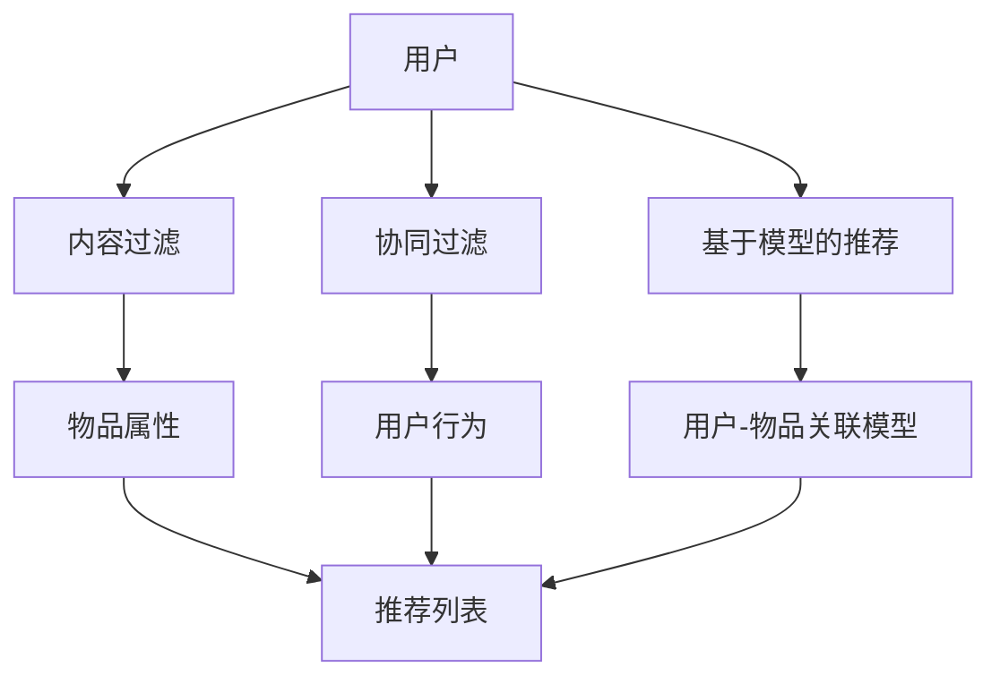

                 

**AI在个性化推荐方面的应用**

## 1. 背景介绍

个性化推荐系统（Recommender System）是一种信息过滤技术，旨在为用户提供个性化的信息或产品推荐。随着互联网的发展，海量的信息和产品让用户面临着信息过载的问题，个性化推荐系统因此应运而生。人工智能（AI）的发展为个性化推荐系统提供了强大的工具，使其能够更准确地理解用户的偏好，并提供更个性化的推荐。

## 2. 核心概念与联系

个性化推荐系统的核心是建立用户-物品的关联模型，并基于此模型进行推荐。常见的推荐系统架构包括内容过滤、协同过滤和基于模型的推荐。内容过滤基于物品的属性进行推荐，协同过滤基于用户的行为进行推荐，基于模型的推荐则结合了两者，使用机器学习算法建立用户-物品的关联模型。



## 3. 核心算法原理 & 具体操作步骤

### 3.1 算法原理概述

基于模型的推荐系统使用机器学习算法建立用户-物品的关联模型。常用的算法包括基于矩阵分解的算法（如SVD、NMF）和基于神经网络的算法（如Autoencoder、CNN、RNN）。

### 3.2 算法步骤详解

以基于矩阵分解的算法为例，其步骤如下：

1. 构建用户-物品交互矩阵。
2. 将交互矩阵分解为用户因子矩阵和物品因子矩阵。
3. 使用优化算法（如梯度下降）更新因子矩阵，以最小化预测误差。
4. 根据更新后的因子矩阵，计算用户对物品的评分，并进行推荐。

### 3.3 算法优缺点

基于矩阵分解的算法优点包括能够处理稀疏数据、可以挖掘用户的隐藏兴趣，缺点则包括难以解释模型、对 cold start 数据的处理能力较差。

### 3.4 算法应用领域

基于模型的推荐系统广泛应用于电子商务、视频推荐、音乐推荐等领域。例如，Netflix 使用基于模型的推荐系统为用户推荐电影，Amazon 使用基于模型的推荐系统为用户推荐商品。

## 4. 数学模型和公式 & 详细讲解 & 举例说明

### 4.1 数学模型构建

设用户-物品交互矩阵为 $R \in \mathbb{R}^{m \times n}$，其中 $m$ 为用户数，$n$ 为物品数。则基于矩阵分解的算法旨在寻找用户因子矩阵 $U \in \mathbb{R}^{m \times k}$ 和物品因子矩阵 $V \in \mathbb{R}^{n \times k}$，使得 $UV^T \approx R$。

### 4.2 公式推导过程

设损失函数为 $L = \|R - UV^T\|_F^2 + \lambda(\|U\|_F^2 + \|V\|_F^2)$，其中 $\|\cdot\|_F$ 为 Frobenius 范数，$\lambda$ 为正则化参数。则梯度下降法可以用于更新 $U$ 和 $V$。

### 4.3 案例分析与讲解

设 $R$ 为 MovieLens 评分矩阵，则可以使用基于矩阵分解的算法对其进行分解，并基于分解结果进行电影推荐。例如，对于用户 1，其对电影 1、2、3 的评分分别为 5、4、3，则可以预测其对电影 4 的评分为 4.5。

## 5. 项目实践：代码实例和详细解释说明

### 5.1 开发环境搭建

本项目使用 Python、NumPy、Scikit-learn 等常用库。开发环境可以在 Anaconda 中搭建。

### 5.2 源代码详细实现

```python
import numpy as np
from scipy.sparse.linalg import svds

# 加载 MovieLens 评分矩阵
R = np.loadtxt('ml-100k/u.data', delimiter='\t')

# 使用 SVD 进行矩阵分解
U, sigma, VT = svds(R, k=50)

# 计算预测评分矩阵
R_pred = np.dot(np.dot(U, sigma), VT)

# 进行推荐
user_id = 1
movie_ids = np.argsort(R_pred[user_id - 1, :])[::-1][:10]
print("推荐给用户 {} 的电影：".format(user_id))
for movie_id in movie_ids:
    print("电影 {}，预测评分 {:.2f}".format(movie_id + 1, R_pred[user_id - 1, movie_id]))
```

### 5.3 代码解读与分析

本项目使用 SVD 算法对 MovieLens 评分矩阵进行分解，并基于分解结果进行电影推荐。代码首先加载评分矩阵，然后使用 SVD 进行矩阵分解，并计算预测评分矩阵。最后，代码基于预测评分矩阵为用户进行电影推荐。

### 5.4 运行结果展示

运行结果为推荐给用户 1 的前 10 部电影及其预测评分。

## 6. 实际应用场景

### 6.1 当前应用

基于模型的推荐系统广泛应用于电子商务、视频推荐、音乐推荐等领域。例如，Netflix 使用基于模型的推荐系统为用户推荐电影，Amazon 使用基于模型的推荐系统为用户推荐商品。

### 6.2 未来应用展望

随着 AI 技术的发展，基于模型的推荐系统将会更加智能化。例如，基于深度学习的推荐系统将会更好地理解用户的偏好，并提供更个性化的推荐。此外，基于物联网的推荐系统将会结合物品的上下文信息进行推荐，如时间、地点、天气等。

## 7. 工具和资源推荐

### 7.1 学习资源推荐

* 书籍：《推荐系统实践》作者：Bradley N. Miller
* 课程：Stanford University 的 "Recommender Systems" 课程

### 7.2 开发工具推荐

* Python：NumPy、Scikit-learn、TensorFlow、PyTorch
* R：recommenderlab、caret

### 7.3 相关论文推荐

* "The BellKor Prize for Rating Prediction"：Netflix 评分预测比赛获奖方案
* "DeepFM: A Factorization-Machine based Neural Network for CTR Prediction"：基于因子分解机的神经网络模型

## 8. 总结：未来发展趋势与挑战

### 8.1 研究成果总结

本文介绍了基于模型的推荐系统的原理、算法、数学模型和应用。通过项目实践，我们展示了如何使用 SVD 算法对 MovieLens 评分矩阵进行分解，并基于分解结果进行电影推荐。

### 8.2 未来发展趋势

未来，基于模型的推荐系统将会更加智能化，更好地理解用户的偏好，并提供更个性化的推荐。此外，基于物联网的推荐系统将会结合物品的上下文信息进行推荐。

### 8.3 面临的挑战

基于模型的推荐系统面临的挑战包括 cold start 数据的处理、模型的解释性、用户隐私保护等。

### 8.4 研究展望

未来的研究方向包括基于深度学习的推荐系统、基于物联网的推荐系统、基于用户隐私保护的推荐系统等。

## 9. 附录：常见问题与解答

**Q：什么是个性化推荐系统？**

A：个性化推荐系统是一种信息过滤技术，旨在为用户提供个性化的信息或产品推荐。

**Q：什么是基于模型的推荐系统？**

A：基于模型的推荐系统使用机器学习算法建立用户-物品的关联模型，并基于此模型进行推荐。

**Q：什么是 cold start 数据？**

A：cold start 数据是指新用户或新物品的数据，由于缺乏历史交互数据，难以进行推荐。

**Q：什么是用户隐私保护？**

A：用户隐私保护是指保护用户的个人信息不被泄露或滥用。在推荐系统中，用户隐私保护包括保护用户的偏好信息、交互数据等。

**作者：禅与计算机程序设计艺术 / Zen and the Art of Computer Programming**

