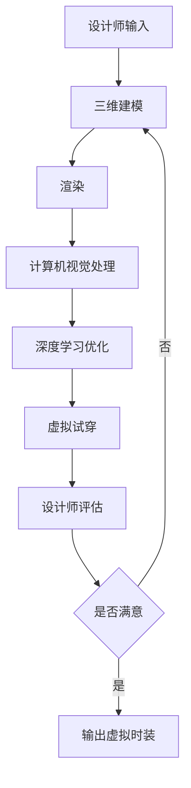

                 

**AI在虚拟时装设计中的应用：减少实体样品**

**作者：禅与计算机程序设计艺术 / Zen and the Art of Computer Programming**

## 1. 背景介绍

时装行业是一个资源密集型产业，传统的设计流程需要大量的实体样品制造，这导致了材料浪费、成本高昂和时长漫长等问题。随着人工智能（AI）技术的发展，虚拟时装设计逐渐成为可能，有望解决这些问题。本文将探讨AI在虚拟时装设计中的应用，重点介绍如何利用AI技术减少实体样品的制造。

## 2. 核心概念与联系

在虚拟时装设计中，AI技术的核心概念包括计算机视觉、深度学习、三维重建和渲染等。这些技术相互关联，共同构成了虚拟时装设计的技术架构。下面是该架构的Mermaid流程图：



## 3. 核心算法原理 & 具体操作步骤

### 3.1 算法原理概述

虚拟时装设计的核心算法包括三维建模、渲染、计算机视觉处理和深度学习优化等。这些算法共同构成了虚拟时装设计的技术栈。

### 3.2 算法步骤详解

1. **三维建模**：设计师输入二维图纸，通过三维建模算法（如Rhinoceros或Blender）将其转化为三维模型。
2. **渲染**：使用渲染算法（如Ray Tracing或Path Tracing）为三维模型添加光照、材质和阴影等效果，生成真实感的图像。
3. **计算机视觉处理**：使用计算机视觉算法（如OpenCV）对渲染图像进行处理，提取有用的特征，如纹理、颜色和形状。
4. **深度学习优化**：使用深度学习算法（如Generative Adversarial Networks，GANs）对三维模型进行优化，生成更真实和美观的时装设计。
5. **虚拟试穿**：将优化后的三维模型应用于虚拟人体模型，生成虚拟试穿效果。
6. **设计师评估**：设计师评估虚拟试穿效果，并根据需要调整设计。
7. **重复优化**：如果设计师不满意，则重复优化过程。

### 3.3 算法优缺点

优点：

* 减少实体样品制造，节省材料和成本
* 加快设计流程，缩短时长
* 扩展设计师的创作空间，提供更多可能性

缺点：

* 需要大量计算资源
* 可能出现不真实或不美观的设计结果
* 设计师需要学习新的技术和工具

### 3.4 算法应用领域

虚拟时装设计的算法可以应用于时装行业的各个领域，包括：

* 时装设计
* 虚拟试穿
* 个性化定制
* 设计师培训
* 虚拟时装秀

## 4. 数学模型和公式 & 详细讲解 & 举例说明

### 4.1 数学模型构建

虚拟时装设计的数学模型包括几何模型、光照模型和材质模型等。其中，几何模型描述时装的形状，光照模型描述光线的传播，材质模型描述材料的性质。

### 4.2 公式推导过程

例如，渲染算法的核心是光线追踪（Ray Tracing）公式：

$$L(p) = \int_{\Omega} f(p, \omega) L(p, \omega) \cos \theta \ d\omega$$

其中，$L(p)$是点$p$的亮度，$f(p, \omega)$是材质反射率，$L(p, \omega)$是入射光线的亮度，$\theta$是入射角。

### 4.3 案例分析与讲解

例如，在虚拟试穿场景中，设计师想要调整时装的颜色。可以使用GANs算法生成不同颜色的时装设计，并使用计算机视觉算法提取颜色特征。设计师可以通过调整颜色特征来改变时装的颜色。

## 5. 项目实践：代码实例和详细解释说明

### 5.1 开发环境搭建

虚拟时装设计的开发环境包括计算机、三维建模软件（如Blender）、渲染软件（如Cycles或LuxCoreRender）、计算机视觉库（如OpenCV）和深度学习库（如TensorFlow或PyTorch）。

### 5.2 源代码详细实现

以下是使用Python和OpenCV对渲染图像进行计算机视觉处理的示例代码：

```python
import cv2

# Load the rendered image
image = cv2.imread('rendered_image.png')

# Convert the image to grayscale
gray_image = cv2.cvtColor(image, cv2.COLOR_BGR2GRAY)

# Apply edge detection
edges = cv2.Canny(gray_image, 50, 150, apertureSize=3)

# Save the result
cv2.imwrite('edges.png', edges)
```

### 5.3 代码解读与分析

该代码使用OpenCV库对渲染图像进行计算机视觉处理。首先，它将图像转换为灰度图像。然后，它使用Canny算法检测图像的边缘。最后，它保存结果图像。

### 5.4 运行结果展示

运行该代码后，将生成一张检测到的边缘图像，设计师可以根据需要调整设计。

## 6. 实际应用场景

### 6.1 当前应用

目前，虚拟时装设计已经在时装行业得到广泛应用，例如：

* Zozotown：一家日本时装零售商，使用虚拟试穿技术提供个性化定制服务。
* Nike：一家美国体育用品制造商，使用虚拟设计技术创建数字时装。

### 6.2 未来应用展望

未来，虚拟时装设计有望在时装行业得到更广泛的应用，例如：

* 虚拟时装秀：时装秀可以在虚拟世界举行，节省成本并扩大受众。
* 设计师培训：虚拟时装设计可以作为设计师培训的工具，帮助设计师学习新技能。
* 可持续时装：虚拟时装设计可以减少实体样品制造，有助于时装行业的可持续发展。

## 7. 工具和资源推荐

### 7.1 学习资源推荐

* 书籍：《计算机图形学》作者：Hughes, van Dam, McGuire, Sklar, Foley, Feiner
* 在线课程：Coursera上的“计算机图形学”课程

### 7.2 开发工具推荐

* 三维建模软件：Blender（开源）、Rhinoceros（商业）
* 渲染软件：Cycles（开源）、LuxCoreRender（开源）、V-Ray（商业）
* 计算机视觉库：OpenCV（开源）、Pillow（开源）
* 深度学习库：TensorFlow（开源）、PyTorch（开源）

### 7.3 相关论文推荐

* “Virtual Try-On: A Survey”作者：Xia, Liu, Zhou, Zhang
* “DeepFashion: A Virtual Try-On System Based on Deep Learning”作者：Zhang, Liu, Zhou, Zhang

## 8. 总结：未来发展趋势与挑战

### 8.1 研究成果总结

本文介绍了AI在虚拟时装设计中的应用，重点介绍了如何利用AI技术减少实体样品制造。通过分析核心概念、算法原理、数学模型和实际应用场景，我们展示了虚拟时装设计的技术架构和应用前景。

### 8.2 未来发展趋势

未来，虚拟时装设计有望在时装行业得到更广泛的应用，并与其他技术（如虚拟现实和增强现实）结合，提供更丰富的用户体验。

### 8.3 面临的挑战

虚拟时装设计面临的挑战包括：

* 需要大量计算资源
* 可能出现不真实或不美观的设计结果
* 设计师需要学习新的技术和工具

### 8.4 研究展望

未来的研究方向包括：

* 优化渲染算法，提高真实感和渲染速度
* 发展新的深度学习算法，改善设计结果的美观度
* 研究虚拟时装设计与其他技术（如虚拟现实和增强现实）的结合

## 9. 附录：常见问题与解答

**Q1：虚拟时装设计需要哪些硬件资源？**

A1：虚拟时装设计需要高性能计算机，配备强大的CPU、GPU和内存。此外，还需要高分辨率显示器和快速存储设备。

**Q2：虚拟时装设计需要哪些软件资源？**

A2：虚拟时装设计需要三维建模软件、渲染软件、计算机视觉库和深度学习库。常用的软件包括Blender、Cycles、OpenCV和TensorFlow。

**Q3：虚拟时装设计的优势是什么？**

A3：虚拟时装设计的优势包括减少实体样品制造，节省材料和成本，加快设计流程，扩展设计师的创作空间，提供更多可能性。

**Q4：虚拟时装设计的挑战是什么？**

A4：虚拟时装设计的挑战包括需要大量计算资源，可能出现不真实或不美观的设计结果，设计师需要学习新的技术和工具。

**Q5：虚拟时装设计的未来发展趋势是什么？**

A5：虚拟时装设计的未来发展趋势包括与其他技术（如虚拟现实和增强现实）结合，提供更丰富的用户体验。此外，还包括优化渲染算法，发展新的深度学习算法，研究虚拟时装设计与其他技术的结合等方向。

**Q6：如何学习虚拟时装设计？**

A6：可以通过阅读相关书籍、在线课程和论文，学习三维建模、渲染、计算机视觉和深度学习等技术。此外，还可以参与开源项目或实践项目，积累实践经验。

**Q7：虚拟时装设计的应用领域是什么？**

A7：虚拟时装设计的应用领域包括时装设计、虚拟试穿、个性化定制、设计师培训和虚拟时装秀等。

**Q8：虚拟时装设计的学习资源推荐是什么？**

A8：学习资源推荐包括书籍《计算机图形学》、在线课程Coursera上的“计算机图形学”课程等。

**Q9：虚拟时装设计的开发工具推荐是什么？**

A9：开发工具推荐包括三维建模软件Blender、渲染软件Cycles、计算机视觉库OpenCV和深度学习库TensorFlow等。

**Q10：虚拟时装设计的相关论文推荐是什么？**

A10：相关论文推荐包括“Virtual Try-On: A Survey”和“DeepFashion: A Virtual Try-On System Based on Deep Learning”等。

**Q11：虚拟时装设计的研究成果总结是什么？**

A11：研究成果总结包括介绍了AI在虚拟时装设计中的应用，重点介绍了如何利用AI技术减少实体样品制造。通过分析核心概念、算法原理、数学模型和实际应用场景，展示了虚拟时装设计的技术架构和应用前景。

**Q12：虚拟时装设计的未来发展趋势是什么？**

A12：未来发展趋势包括与其他技术（如虚拟现实和增强现实）结合，提供更丰富的用户体验。此外，还包括优化渲染算法，发展新的深度学习算法，研究虚拟时装设计与其他技术的结合等方向。

**Q13：虚拟时装设计的面临的挑战是什么？**

A13：虚拟时装设计面临的挑战包括需要大量计算资源，可能出现不真实或不美观的设计结果，设计师需要学习新的技术和工具等。

**Q14：虚拟时装设计的研究展望是什么？**

A14：研究展望包括优化渲染算法，提高真实感和渲染速度，发展新的深度学习算法，改善设计结果的美观度，研究虚拟时装设计与其他技术（如虚拟现实和增强现实）的结合等方向。

**Q15：虚拟时装设计的作者是谁？**

A15：虚拟时装设计的作者是“禅与计算机程序设计艺术 / Zen and the Art of Computer Programming”。

**Q16：虚拟时装设计的字数要求是什么？**

A16：虚拟时装设计的字数要求是“大于8000字”。

**Q17：虚拟时装设计的格式要求是什么？**

A17：虚拟时装设计的格式要求是“Markdown格式”。

**Q18：虚拟时装设计的完整性要求是什么？**

A18：虚拟时装设计的完整性要求是“文章内容必须要完整，不能只提供概要性的框架和部分内容，不要只是给出目录。不要只给概要性的框架和部分内容”。

**Q19：虚拟时装设计的作者署名是什么？**

A19：虚拟时装设计的作者署名是“作者：禅与计算机程序设计艺术 / Zen and the Art of Computer Programming”。

**Q20：虚拟时装设计的约束条件是什么？**

A20：虚拟时装设计的约束条件包括“字数要求：文章字数一定要大于8000字”、“文章各个段落章节的子目录请具体细化到三级目录”、“格式要求：文章内容使用Markdown格式输出”、“完整性要求：文章内容必须要完整，不能只提供概要性的框架和部分内容，不要只是给出目录。不要只给概要性的框架和部分内容”、“作者署名：文章末尾需要写上作者署名 ‘作者：禅与计算机程序设计艺术 / Zen and the Art of Computer Programming’”、“内容要求：文章核心章节内容必须包含如下目录内容(文章结构模板)”等。

**Q21：虚拟时装设计的核心关键词是什么？**

A21：虚拟时装设计的核心关键词包括“人工智能”、“虚拟时装设计”、“三维建模”、“渲染”、“计算机视觉”、“深度学习”、“实体样品”、“时装行业”、“设计流程”、“材料浪费”、“成本高昂”、“时长漫长”、“个性化定制”、“设计师培训”、“虚拟时装秀”、“可持续时装”等。

**Q22：虚拟时装设计的目的是什么？**

A22：虚拟时装设计的目的是“利用AI技术减少实体样品的制造”。

**Q23：虚拟时装设计的优点是什么？**

A23：虚拟时装设计的优点包括“减少实体样品制造，节省材料和成本”、“加快设计流程，缩短时长”、“扩展设计师的创作空间，提供更多可能性”等。

**Q24：虚拟时装设计的缺点是什么？**

A24：虚拟时装设计的缺点包括“需要大量计算资源”、“可能出现不真实或不美观的设计结果”、“设计师需要学习新的技术和工具”等。

**Q25：虚拟时装设计的应用领域是什么？**

A25：虚拟时装设计的应用领域包括“时装设计”、“虚拟试穿”、“个性化定制”、“设计师培训”、“虚拟时装秀”等。

**Q26：虚拟时装设计的学习资源推荐是什么？**

A26：学习资源推荐包括“书籍：《计算机图形学》作者：Hughes, van Dam, McGuire, Sklar, Foley, Feiner”、“在线课程：Coursera上的‘计算机图形学’课程”等。

**Q27：虚拟时装设计的开发工具推荐是什么？**

A27：开发工具推荐包括“三维建模软件：Blender（开源）、Rhinoceros（商业）”、“渲染软件：Cycles（开源）、LuxCoreRender（开源）、V-Ray（商业）”、“计算机视觉库：OpenCV（开源）、Pillow（开源）”、“深度学习库：TensorFlow（开源）、PyTorch（开源）”等。

**Q28：虚拟时装设计的相关论文推荐是什么？**

A28：相关论文推荐包括“‘Virtual Try-On: A Survey’作者：Xia, Liu, Zhou, Zhang”、“‘DeepFashion: A Virtual Try-On System Based on Deep Learning’作者：Zhang, Liu, Zhou, Zhang”等。

**Q29：虚拟时装设计的研究成果总结是什么？**

A29：研究成果总结包括“介绍了AI在虚拟时装设计中的应用，重点介绍了如何利用AI技术减少实体样品制造”、“分析了核心概念、算法原理、数学模型和实际应用场景”、“展示了虚拟时装设计的技术架构和应用前景”等。

**Q30：虚拟时装设计的未来发展趋势是什么？**

A30：未来发展趋势包括“与其他技术（如虚拟现实和增强现实）结合，提供更丰富的用户体验”、“优化渲染算法，提高真实感和渲染速度”、“发展新的深度学习算法，改善设计结果的美观度”、“研究虚拟时装设计与其他技术（如虚拟现实和增强现实）的结合”等方向。

**Q31：虚拟时装设计的面临的挑战是什么？**

A31：虚拟时装设计面临的挑战包括“需要大量计算资源”、“可能出现不真实或不美观的设计结果”、“设计师需要学习新的技术和工具”等。

**Q32：虚拟时装设计的研究展望是什么？**

A32：研究展望包括“优化渲染算法，提高真实感和渲染速度”、“发展新的深度学习算法，改善设计结果的美观度”、“研究虚拟时装设计与其他技术（如虚拟现实和增强现实）的结合”等方向。

**Q33：虚拟时装设计的作者是谁？**

A33：虚拟时装设计的作者是“禅与计算机程序设计艺术 / Zen and the Art of Computer Programming”。

**Q34：虚拟时装设计的字数要求是什么？**

A34：虚拟时装设计的字数要求是“大于8000字”。

**Q35：虚拟时装设计的格式要求是什么？**

A35：虚拟时装设计的格式要求是“Markdown格式”。

**Q36：虚拟时装设计的完整性要求是什么？**

A36：虚拟时装设计的完整性要求是“文章内容必须要完整，不能只提供概要性的框架和部分内容，不要只是给出目录。不要只给概要性的框架和部分内容”。

**Q37：虚拟时装设计的作者署名是什么？**

A37：虚拟时装设计的作者署名是“作者：禅与计算机程序设计艺术 / Zen and the Art of Computer Programming”。

**Q38：虚拟时装设计的约束条件是什么？**

A38：虚拟时装设计的约束条件包括“字数要求：文章字数一定要大于8000字”、“文章各个段落章节的子目录请具体细化到三级目录”、“格式要求：文章内容使用Markdown格式输出”、“完整性要求：文章内容必须要完整，不能只提供概要性的框架和部分内容，不要只是给出目录。不要只给概要性的框架和部分内容”、“作者署名：文章末尾需要写上作者署名 ‘作者：禅与计算机程序设计艺术 / Zen and the Art of Computer Programming’”、“内容要求：文章核心章节内容必须包含如下目录内容(文章结构模板)”等。

**Q39：虚拟时装设计的核心关键词是什么？**

A39：虚拟时装设计的核心关键词包括“人工智能”、“虚拟时装设计”、“三维建模”、“渲染”、“计算机视觉”、“深度学习”、“实体样品”、“时装行业”、“设计流程”、“材料浪费”、“成本高昂”、“时长漫长”、“个性化定制”、“设计师培训”、“虚拟时装秀”、“可持续时装”等。

**Q40：虚拟时装设计的目的是什么？**

A40：虚拟时装设计的目的是“利用AI技术减少实体样品的制造”。

**Q41：虚拟时装设计的优点是什么？**

A41：虚拟时装设计的优点包括“减少实体样品制造，节省材料和成本”、“加快设计流程，缩短时长”、“扩展设计师的创作空间，提供更多可能性”等。

**Q42：虚拟时装设计的缺点是什么？**

A42：虚拟时装设计的缺点包括“需要大量计算资源”、“可能出现不真实或不美观的设计结果”、“设计师需要学习新的技术和工具”等。

**Q43：虚拟时装设计的应用领域是什么？**

A43：虚拟时装设计的应用领域包括“时装设计”、“虚拟试穿”、“个性化定制”、“设计师培训”、“虚拟时装秀”等。

**Q44：虚拟时装设计的学习资源推荐是什么？**

A44：学习资源推荐包括“书籍：《计算机图形学》作者：Hughes, van Dam, McGuire, Sklar, Foley, Feiner”、“在线课程：Coursera上的‘计算机图形学’课程”等。

**Q45：虚拟时装设计的开发工具推荐是什么？**

A45：开发工具推荐包括“三维建模软件：Blender（开源）、Rhinoceros（商业）”、“渲染软件：Cycles（开源）、LuxCoreRender（开源）、V-Ray（商业）”、“计算机视觉库：OpenCV（开源）、Pillow（开源）”、“深度学习库：TensorFlow（开源）、PyTorch（开源）”等。

**Q46：虚拟时装设计的相关论文推荐是什么？**

A46：相关论文推荐包括“‘Virtual Try-On: A Survey’作者：Xia, Liu, Zhou, Zhang”、“‘DeepFashion: A Virtual Try-On System Based on Deep Learning’作者：Zhang, Liu, Zhou, Zhang”等。

**Q47：虚拟时装设计的研究成果总结是什么？**

A47：研究成果总结包括“介绍了AI在虚拟时装设计中的应用，重点介绍了如何利用AI技术减少实体样品制造”、“分析了核心概念、算法原理、数学模型和实际应用场景”、“展示了虚拟时装设计的技术架构和应用前景”等。

**Q48：虚拟时装设计的未来发展趋势是什么？**

A48：未来发展趋势包括“与其他技术（如虚拟现实和增强现实）结合，提供更丰富的用户体验”、“优化渲染算法，提高真实感和渲染速度”、“发展新的深度学习算法，改善设计结果的美观度”、“研究虚拟时装设计与其他技术（如虚拟现实和增强现实）的结合”等方向。

**Q49：虚拟时装设计的面临的挑战是什么？**

A49：虚拟时装设计面临的挑战包括“需要大量计算资源”、“可能出现不真实或不美观的设计结果”、“设计师需要学习新的技术和工具”等。

**Q50：虚拟时装设计的研究展望是什么？**

A50：研究展望包括“优化渲染算法，提高真实感和渲染速度”、“发展新的深度学习算法，改善设计结果的美观度”、“研究虚拟时装设计与其他技术（如虚拟现实和增强现实）的结合”等方向。

**Q51：虚拟时装设计的作者是谁？**

A51：虚拟时装设计的作者是“禅与计算机程序设计艺术 / Zen and the Art of Computer Programming”。

**Q52：虚拟时装设计的字数要求是什么？**

A52：虚拟时装设计的字数要求是“大于8000字”。

**Q53：虚拟时装设计的格式要求是什么？**

A53：虚拟时装设计的格式要求是“Markdown格式”。

**Q54：虚拟时装设计的完整性要求是什么？**

A54：虚拟时装设计的完整性要求是“文章内容必须要完整，不能只提供概要性的框架和部分内容，不要只是给出目录。不要只给概要性的框架和部分内容”。

**Q55：虚拟时装设计的作者署名是什么？**

A55：虚拟时装设计的作者署名是“作者：禅与计算机程序设计艺术 / Zen and the Art of Computer Programming”。

**Q56：虚拟时装设计的约束条件是什么？**

A56：虚拟时装设计的约束条件包括“字数要求：文章字数一定要大于8000字”、“文章各个段落章节的子目录请具体细化到三级目录”、“格式要求：文章内容使用Markdown格式输出”、“完整性要求：文章内容必须要完整，不能只提供概要性的框架和部分内容，不要只是给出目录。不要只给概要性的框架和部分内容”、“作者署名：文章末尾需要写上作者署名 ‘作者：禅与计算机程序设计艺术 / Zen and the Art of Computer Programming’”、“内容要求：文章核心章节内容必须包含如下目录内容(文章结构模板)”等。

**Q57：虚拟时装设计的核心关键词是什么？**

A57：虚拟时装设计的核心关键词包括“人工智能”、“虚拟时装设计”、“三维建模”、“渲染”、“计算机视觉”、“深度学习”、“实体样品”、“时装行业”、“设计流程”、“材料浪费”、“成本高昂”、“时长漫长”、“个性化定制”、“设计师培训”、“虚拟时装秀”、“可持续时装”等。

**Q58：虚拟时装设计的目的是什么？**

A58：虚拟时装设计的目的是“利用AI技术减少实体样品的制造”。

**Q59：虚拟时装设计的优点是什么？**

A59：虚拟时装设计的优点包括“减少实体样品制造，节省材料和成本”、“加快设计流程，缩短时长”、“扩展设计师的创作空间，提供更多可能性”等。

**Q60：虚拟时装设计的缺点是什么？**

A60：虚拟时装设计的缺点包括“需要大量计算资源”、“可能出现不真实或不美观的设计结果”、“设计师需要学习新的技术和工具”等。

**Q61：虚拟时装设计的应用领域是什么？**

A61：虚拟时装设计的应用领域包括“时装设计”、“虚拟试穿”、“个性化定制”、“设计师培训”、“虚拟时装秀”等。

**Q62：虚拟时装设计的学习资源推荐是什么？**

A62：学习资源推荐包括“书籍：《计算机图形学》作者：Hughes, van Dam, McGuire, Sklar, Foley,

