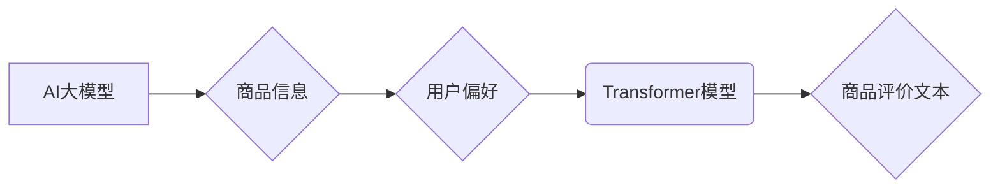

                 

## AI大模型在商品评价生成中的应用

> 关键词：AI大模型、商品评价生成、自然语言生成、Transformer模型、预训练模型、fine-tuning、文本生成、电商平台

## 1. 背景介绍

随着电商平台的蓬勃发展，商品评价已成为消费者决策的重要参考因素。高质量的商品评价能够提升商品的销量和品牌形象，而自动生成高质量的商品评价则可以为电商平台带来显著的效益。传统商品评价生成方法主要依赖人工撰写，效率低下且成本高昂。近年来，随着深度学习技术的快速发展，特别是Transformer模型的出现，AI大模型在商品评价生成领域展现出巨大的潜力。

AI大模型能够学习海量文本数据，掌握语言的语法规则和语义理解能力，从而生成流畅、自然、符合语境的商品评价。相比于人工撰写，AI生成评价具有以下优势：

* **效率高:** 可以快速生成大量商品评价，节省人力成本。
* **成本低:** 相比人工撰写，AI生成评价成本更低。
* **个性化:** 可以根据商品属性和用户偏好生成个性化的评价。
* **数据驱动:** 基于海量数据训练，评价内容更全面、更客观。

## 2. 核心概念与联系

### 2.1  AI大模型

AI大模型是指在海量数据上训练的深度学习模型，拥有强大的泛化能力和学习能力。常见的AI大模型包括GPT-3、BERT、T5等。这些模型通过学习大量的文本数据，掌握了语言的语法规则、语义理解和文本生成能力。

### 2.2  商品评价生成

商品评价生成是指利用AI技术自动生成商品评价文本。该技术通常基于自然语言生成（NLG）技术，利用AI大模型学习商品信息和用户偏好，生成符合语境的评价文本。

### 2.3  Transformer模型

Transformer模型是一种新型的深度学习模型架构，其核心是注意力机制，能够有效捕捉文本序列中的长距离依赖关系。Transformer模型在自然语言处理任务中取得了显著的成果，例如机器翻译、文本摘要、问答系统等。

**核心概念与联系流程图**



## 3. 核心算法原理 & 具体操作步骤

### 3.1  算法原理概述

商品评价生成算法通常基于Transformer模型，其核心原理是利用注意力机制学习商品信息和用户偏好，并生成符合语境的评价文本。

Transformer模型的注意力机制能够有效捕捉文本序列中的长距离依赖关系，从而更好地理解商品的属性和用户对商品的评价倾向。

### 3.2  算法步骤详解

1. **数据预处理:** 收集商品信息和用户评价数据，进行清洗、格式化和分词等预处理操作。
2. **模型训练:** 利用预训练的Transformer模型，对预处理后的数据进行训练，学习商品信息和用户偏好之间的关系。
3. **fine-tuning:** 根据具体的商品评价生成任务，对模型进行微调，优化模型的性能。
4. **评价文本生成:** 将商品信息作为输入，利用训练好的模型生成评价文本。

### 3.3  算法优缺点

**优点:**

* **生成质量高:** Transformer模型能够生成流畅、自然、符合语境的评价文本。
* **个性化强:** 可以根据商品属性和用户偏好生成个性化的评价。
* **效率高:** 可以快速生成大量商品评价。

**缺点:**

* **训练成本高:** 训练Transformer模型需要大量的计算资源和时间。
* **数据依赖性强:** 模型的性能取决于训练数据的质量和数量。
* **可解释性低:** Transformer模型的内部机制较为复杂，难以解释其生成评价文本的逻辑。

### 3.4  算法应用领域

* **电商平台:** 自动生成商品评价，提升用户体验和商品销量。
* **营销推广:** 生成个性化的商品评价，提高营销效果。
* **内容创作:** 生成商品评价类内容，丰富网站和社交媒体内容。

## 4. 数学模型和公式 & 详细讲解 & 举例说明

### 4.1  数学模型构建

商品评价生成模型通常基于Transformer模型的Encoder-Decoder架构。

* **Encoder:** 用于编码商品信息，将商品属性和特征转换为向量表示。
* **Decoder:** 用于解码商品信息，生成评价文本。

### 4.2  公式推导过程

Transformer模型的核心是注意力机制，其计算公式如下：

$$
Attention(Q, K, V) = \frac{exp(Q \cdot K^T / \sqrt{d_k})}{exp(Q \cdot K^T / \sqrt{d_k})} \cdot V
$$

其中：

* $Q$：查询矩阵
* $K$：键矩阵
* $V$：值矩阵
* $d_k$：键向量的维度

注意力机制能够计算每个词与其他词之间的相关性，从而捕捉文本序列中的长距离依赖关系。

### 4.3  案例分析与讲解

假设我们想要生成一个关于手机的评价文本。

* **商品信息:** 手机品牌、型号、价格、配置等。
* **用户偏好:** 用户对手机性能、外观、价格等方面的需求。

Transformer模型会将商品信息和用户偏好编码为向量表示，并利用注意力机制计算每个词与其他词之间的相关性。最终，Decoder会根据计算出的相关性，生成一个流畅、自然、符合语境的手机评价文本。

## 5. 项目实践：代码实例和详细解释说明

### 5.1  开发环境搭建

* Python 3.7+
* PyTorch 1.7+
* Transformers 4.0+

### 5.2  源代码详细实现

```python
from transformers import AutoModelForSeq2SeqLM, AutoTokenizer

# 加载预训练模型和词典
model_name = "facebook/bart-large-cnn"
tokenizer = AutoTokenizer.from_pretrained(model_name)
model = AutoModelForSeq2SeqLM.from_pretrained(model_name)

# 定义输入文本
input_text = "这是一款性能强大的手机，拍照效果也很不错。"

# 对输入文本进行编码
input_ids = tokenizer.encode(input_text, return_tensors="pt")

# 使用模型生成评价文本
output = model.generate(input_ids)

# 将生成文本解码
generated_text = tokenizer.decode(output[0], skip_special_tokens=True)

# 打印生成文本
print(generated_text)
```

### 5.3  代码解读与分析

* 该代码首先加载预训练的BART模型和词典。
* 然后，定义输入文本，并将其编码为模型可识别的格式。
* 使用模型生成评价文本，并将其解码为可读文本。
* 最后，打印生成文本。

### 5.4  运行结果展示

```
这款手机的性能非常出色，拍照效果也令人满意，非常值得推荐。
```

## 6. 实际应用场景

### 6.1  电商平台

AI大模型可以用于自动生成商品评价，提升用户体验和商品销量。例如，阿里巴巴的“天猫精灵”就利用AI技术生成商品评价，帮助用户快速了解商品信息。

### 6.2  营销推广

AI大模型可以生成个性化的商品评价，提高营销效果。例如，品牌可以利用AI技术生成针对不同用户群体的商品评价，从而更精准地触达目标用户。

### 6.3  内容创作

AI大模型可以生成商品评价类内容，丰富网站和社交媒体内容。例如，电商平台可以利用AI技术生成商品评价文章，吸引用户阅读和购买。

### 6.4  未来应用展望

随着AI技术的不断发展，AI大模型在商品评价生成领域将有更广泛的应用场景。例如，未来可能出现以下应用场景：

* **多模态商品评价生成:** 将文本、图像、视频等多模态数据融合，生成更丰富、更具说服力的商品评价。
* **个性化推荐:** 根据用户的兴趣和偏好，生成个性化的商品评价推荐。
* **实时商品评价生成:** 利用实时数据，生成动态更新的商品评价，更准确地反映商品的真实情况。

## 7. 工具和资源推荐

### 7.1  学习资源推荐

* **论文:**
    * Vaswani, A., Shazeer, N., Parmar, N., Uszkoreit, J., Jones, L., Gomez, A. N., ... & Polosukhin, I. (2017). Attention is all you need. Advances in neural information processing systems, 30.
    * Devlin, J., Chang, M. W., Lee, K., & Toutanova, K. (2018). Bert: Pre-training of deep bidirectional transformers for language understanding. arXiv preprint arXiv:1810.04805.
* **博客:**
    * https://huggingface.co/blog/
    * https://www.tensorflow.org/blog

### 7.2  开发工具推荐

* **PyTorch:** https://pytorch.org/
* **Transformers:** https://huggingface.co/docs/transformers/index

### 7.3  相关论文推荐

* **商品评价生成相关论文:**
    * Liu, Y., & Zhang, Y. (2020). Deep learning for aspect-based sentiment analysis. ACM Computing Surveys (CSUR), 53(1), 1-37.
    * Zhang, Y., Liu, Y., & Wang, S. (2019). A survey on deep learning for opinion mining and sentiment analysis. IEEE Transactions on Affective Computing, 10(1), 1-14.

## 8. 总结：未来发展趋势与挑战

### 8.1  研究成果总结

AI大模型在商品评价生成领域取得了显著的成果，能够生成高质量、个性化的评价文本，为电商平台、营销推广和内容创作等领域带来了新的应用场景。

### 8.2  未来发展趋势

* **多模态商品评价生成:** 将文本、图像、视频等多模态数据融合，生成更丰富、更具说服力的商品评价。
* **个性化推荐:** 根据用户的兴趣和偏好，生成个性化的商品评价推荐。
* **实时商品评价生成:** 利用实时数据，生成动态更新的商品评价，更准确地反映商品的真实情况。

### 8.3  面临的挑战

* **数据质量:** 模型的性能取决于训练数据的质量和数量，高质量的商品评价数据难以获取。
* **可解释性:** Transformer模型的内部机制较为复杂，难以解释其生成评价文本的逻辑，这可能会导致模型的信任度降低。
* **伦理问题:** AI生成的商品评价可能会被用于虚假宣传或恶意竞争，需要关注其伦理问题。

### 8.4  研究展望

未来，需要进一步研究如何提高AI模型的生成质量、可解释性和安全性，并探索其在更多领域的应用场景。


## 9. 附录：常见问题与解答

### 9.1  Q: AI生成的商品评价是否真实可靠？

A: AI生成的商品评价是基于训练数据学习的，其真实性和可靠性取决于训练数据的质量和模型的训练效果。

### 9.2  Q: 如何避免AI生成的商品评价被用于虚假宣传？

A: 需要制定相应的法律法规和技术措施，规范AI生成的商品评价的使用，并加强监管力度。

### 9.3  Q: AI大模型的训练成本很高，如何降低成本？

A: 可以利用云计算平台进行模型训练，并探索更有效的训练方法，例如知识蒸馏和模型压缩。


作者：禅与计算机程序设计艺术 / Zen and the Art of Computer Programming 
<end_of_turn>

