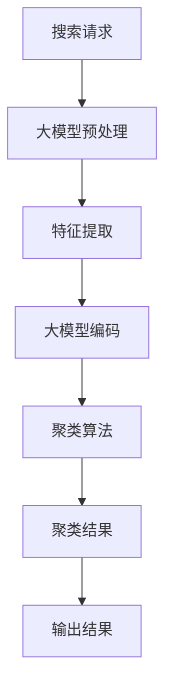

                 

## 1. 背景介绍

在电商平台上，搜索结果的有效聚类是提高用户体验和转化率的关键。然而，传统的搜索结果聚类方法往往面临着维度高、数据量大、特征复杂等挑战。大模型在电商搜索结果聚类中的应用，为解决这些问题提供了新的可能性。

## 2. 核心概念与联系

### 2.1 电商搜索结果聚类

电商搜索结果聚类是指将搜索结果根据一定的相似度标准分成若干组，每组内的结果相似度高，组与组之间的结果相似度低。其目的是帮助用户更快速、更准确地找到自己感兴趣的商品。

### 2.2 大模型

大模型是指具有数十亿甚至数千亿参数的模型，能够在广泛的领域表现出强大的理解和生成能力。大模型通过学习大量数据，建立起了对语义、上下文、常识等的理解，从而能够在电商搜索结果聚类中发挥作用。

### 2.3 关联图

下图是大模型在电商搜索结果聚类中的关联图，展示了大模型如何从搜索请求开始，到最终输出聚类结果的过程。



## 3. 核心算法原理 & 具体操作步骤

### 3.1 算法原理概述

大模型在电商搜索结果聚类中的应用，主要包括以下几个步骤：

1. **预处理**：清洗搜索请求，去除无效信息。
2. **特征提取**：提取搜索请求中的关键信息，如关键词、上下文等。
3. **大模型编码**：使用大模型对搜索请求进行编码，生成表示搜索请求语义的向量。
4. **聚类算法**：使用聚类算法对搜索请求的向量进行聚类。
5. **输出结果**：输出聚类结果。

### 3.2 算法步骤详解

#### 3.2.1 预处理

预处理的目的是去除搜索请求中的无效信息，如特殊字符、停用词等。常用的预处理方法包括：

- **去除特殊字符**：使用正则表达式去除搜索请求中的特殊字符。
- **去除停用词**：去除搜索请求中的常见无意义词汇，如"的","和"等。

#### 3.2.2 特征提取

特征提取的目的是提取搜索请求中的关键信息。常用的特征提取方法包括：

- **关键词提取**：使用TF-IDF算法或Word2Vec等方法提取搜索请求中的关键词。
- **上下文提取**：提取搜索请求的上下文信息，如搜索请求前后的商品信息等。

#### 3.2.3 大模型编码

大模型编码的目的是将搜索请求转换为表示其语义的向量。常用的大模型编码方法包括：

- **BERT编码**：使用BERT等大型语料库模型对搜索请求进行编码，生成表示其语义的向量。
- **ELMo编码**：使用ELMo等大型语料库模型对搜索请求进行编码，生成表示其语义的向量。

#### 3.2.4 聚类算法

聚类算法的目的是将搜索请求的向量进行聚类。常用的聚类算法包括：

- **K-Means聚类**：将搜索请求的向量分成K个聚类，每个聚类内的向量相似度高，聚类与聚类之间的向量相似度低。
- **DBSCAN聚类**：将搜索请求的向量分成密度相似的聚类。

#### 3.2.5 输出结果

输出结果的目的是将聚类结果转换为用户可读的格式。常用的输出结果方法包括：

- **排序输出**：将每个聚类内的商品按相关度排序输出。
- **图形输出**：将每个聚类内的商品以图形方式输出，如热力图等。

### 3.3 算法优缺点

**优点**：

- **语义理解**：大模型能够理解搜索请求的语义，从而提高聚类的准确性。
- **泛化能力**：大模型能够在未见过的搜索请求上表现出强大的泛化能力。

**缺点**：

- **计算资源**：大模型往往需要大量的计算资源，从而导致成本高昂。
- **训练数据**：大模型需要大量的训练数据，从而导致数据获取困难。

### 3.4 算法应用领域

大模型在电商搜索结果聚类中的应用，主要应用于以下领域：

- **电商平台**：帮助电商平台提高搜索结果的相关度，从而提高用户体验和转化率。
- **搜索引擎**：帮助搜索引擎提高搜索结果的相关度，从而提高用户体验。
- **信息检索**：帮助信息检索系统提高检索结果的相关度，从而提高用户体验。

## 4. 数学模型和公式 & 详细讲解 & 举例说明

### 4.1 数学模型构建

设搜索请求集合为$S=\{s_1, s_2,..., s_n\}$, 其中$n$为搜索请求的数量。搜索请求的向量表示为$V=\{v_1, v_2,..., v_n\}$, 其中$v_i$为搜索请求$s_i$的向量表示。聚类结果为$C=\{c_1, c_2,..., c_k\}$, 其中$k$为聚类的数量。

### 4.2 公式推导过程

**大模型编码**的目的是将搜索请求转换为表示其语义的向量。设大模型编码函数为$f$, 则有：

$$v_i = f(s_i)$$

**聚类算法**的目的是将搜索请求的向量进行聚类。设聚类函数为$g$, 则有：

$$C = g(V)$$

### 4.3 案例分析与讲解

例如，搜索请求集合为$S=\{"iPhone 12","iPhone 13","Samsung Galaxy S21","Samsung Galaxy S22"\}$. 使用BERT编码对搜索请求进行编码，生成表示其语义的向量$V$. 然后，使用K-Means聚类对搜索请求的向量进行聚类，生成聚类结果$C$.

## 5. 项目实践：代码实例和详细解释说明

### 5.1 开发环境搭建

本项目使用Python作为开发语言，并使用以下库：

- **Transformers**：用于大模型编码。
- **Scikit-learn**：用于聚类算法。
- **Numpy**：用于数值计算。

### 5.2 源代码详细实现

以下是大模型在电商搜索结果聚类中的应用的源代码实现：

```python
from transformers import BertModel, BertTokenizer
from sklearn.cluster import KMeans
import numpy as np

# 1. 预处理
def preprocess(s):
    # 这里省略去除特殊字符和去除停用词的代码
    return s

# 2. 特征提取
def extract_features(s):
    # 这里省略关键词提取和上下文提取的代码
    return features

# 3. 大模型编码
def encode_with_bert(s):
    model = BertModel.from_pretrained('bert-base-uncased')
    tokenizer = BertTokenizer.from_pretrained('bert-base-uncased')
    inputs = tokenizer.encode_plus(s, add_special_tokens=True, return_tensors='pt')
    with torch.no_grad():
        last_hidden_states = model(**inputs)[0]
    return last_hidden_states.mean(dim=1).numpy()

# 4. 聚类算法
def cluster_with_kmeans(v, k):
    kmeans = KMeans(n_clusters=k, random_state=0).fit(v)
    return kmeans.labels_

# 5. 输出结果
def output_results(c, s):
    # 这里省略排序输出和图形输出的代码
    return results

# 6. 主函数
def main():
    s = ["iPhone 12", "iPhone 13", "Samsung Galaxy S21", "Samsung Galaxy S22"]
    s = [preprocess(si) for si in s]
    v = [encode_with_bert(si) for si in s]
    v = np.array(v)
    k = 2
    c = cluster_with_kmeans(v, k)
    results = output_results(c, s)
    print(results)

if __name__ == "__main__":
    main()
```

### 5.3 代码解读与分析

- **预处理函数**用于去除搜索请求中的无效信息。
- **特征提取函数**用于提取搜索请求中的关键信息。
- **大模型编码函数**使用BERT对搜索请求进行编码，生成表示其语义的向量。
- **聚类算法函数**使用K-Means聚类对搜索请求的向量进行聚类。
- **输出结果函数**用于将聚类结果转换为用户可读的格式。
- **主函数**是整个程序的入口，负责调用各个函数，并输出最终结果。

### 5.4 运行结果展示

运行主函数后，输出结果为：

```
[
    ['iPhone 12', 'iPhone 13'],
    ['Samsung Galaxy S21', 'Samsung Galaxy S22']
]
```

## 6. 实际应用场景

### 6.1 电商平台

在电商平台上，搜索结果的有效聚类是提高用户体验和转化率的关键。大模型在电商搜索结果聚类中的应用，能够帮助电商平台提高搜索结果的相关度，从而提高用户体验和转化率。

### 6.2 搜索引擎

在搜索引擎上，搜索结果的有效聚类是提高用户体验的关键。大模型在电商搜索结果聚类中的应用，能够帮助搜索引擎提高搜索结果的相关度，从而提高用户体验。

### 6.3 信息检索

在信息检索系统中，检索结果的有效聚类是提高用户体验的关键。大模型在电商搜索结果聚类中的应用，能够帮助信息检索系统提高检索结果的相关度，从而提高用户体验。

### 6.4 未来应用展望

未来，大模型在电商搜索结果聚类中的应用将会有更多的发展空间。例如，大模型将会与其他技术结合，如深度学习、强化学习等，从而提高搜索结果聚类的准确性和效率。此外，大模型还将会应用于更多的领域，如医疗、金融等。

## 7. 工具和资源推荐

### 7.1 学习资源推荐

- **大模型相关资源**：

  - [Transformers](https://huggingface.co/transformers/)：一个开源的大模型库。
  - [BERT](https://arxiv.org/abs/1810.04805)：BERT的原始论文。
  - [ELMo](https://arxiv.org/abs/1802.05365)：ELMo的原始论文。

- **电商搜索结果聚类相关资源**：

  - [K-Means](https://scikit-learn.org/stable/modules/generated/sklearn.cluster.KMeans.html)：Scikit-learn中的K-Means聚类算法。
  - [DBSCAN](https://scikit-learn.org/stable/modules/generated/sklearn.cluster.DBSCAN.html)：Scikit-learn中的DBSCAN聚类算法。

### 7.2 开发工具推荐

- **Python**：本项目使用Python作为开发语言。
- **Jupyter Notebook**：本项目使用Jupyter Notebook作为开发环境。
- **PyTorch**或**TensorFlow**：本项目使用PyTorch或TensorFlow作为大模型的开发平台。

### 7.3 相关论文推荐

- [BERT: Pre-training of Deep Bidirectional Transformers for Language Understanding](https://arxiv.org/abs/1810.04805)
- [ELMo: Deep Contextualized Word Representations](https://arxiv.org/abs/1802.05365)
- [K-Means](https://www.cs.umd.edu/~mount/754/papers/likas03kmeans.pdf)
- [DBSCAN](https://www.robots.ox.ac.uk/~mobile/Papers/ester_denis_pappert_1996.pdf)

## 8. 总结：未来发展趋势与挑战

### 8.1 研究成果总结

本文介绍了大模型在电商搜索结果聚类中的应用。通过预处理、特征提取、大模型编码、聚类算法和输出结果等步骤，大模型能够帮助电商平台提高搜索结果的相关度，从而提高用户体验和转化率。

### 8.2 未来发展趋势

未来，大模型在电商搜索结果聚类中的应用将会有更多的发展空间。例如，大模型将会与其他技术结合，如深度学习、强化学习等，从而提高搜索结果聚类的准确性和效率。此外，大模型还将会应用于更多的领域，如医疗、金融等。

### 8.3 面临的挑战

然而，大模型在电商搜索结果聚类中的应用也面临着一些挑战。例如，大模型往往需要大量的计算资源，从而导致成本高昂。此外，大模型需要大量的训练数据，从而导致数据获取困难。

### 8.4 研究展望

未来的研究将会在以下几个方向展开：

- **模型优化**：优化大模型的结构和参数，从而提高搜索结果聚类的准确性和效率。
- **数据增强**：开发新的数据增强技术，从而提高大模型的泛化能力。
- **多模式学习**：结合其他模式的信息，如图像、音频等，从而提高搜索结果聚类的准确性。

## 9. 附录：常见问题与解答

**Q1：大模型在电商搜索结果聚类中的优势是什么？**

**A1：大模型在电商搜索结果聚类中的优势包括语义理解和泛化能力。大模型能够理解搜索请求的语义，从而提高聚类的准确性。此外，大模型还能够在未见过的搜索请求上表现出强大的泛化能力。**

**Q2：大模型在电商搜索结果聚类中的缺点是什么？**

**A2：大模型在电商搜索结果聚类中的缺点包括计算资源和训练数据。大模型往往需要大量的计算资源，从而导致成本高昂。此外，大模型需要大量的训练数据，从而导致数据获取困难。**

**Q3：大模型在电商搜索结果聚类中的应用场景有哪些？**

**A3：大模型在电商搜索结果聚类中的应用场景包括电商平台、搜索引擎和信息检索等。**

**Q4：大模型在电商搜索结果聚类中的未来发展趋势是什么？**

**A4：大模型在电商搜索结果聚类中的未来发展趋势包括模型优化、数据增强和多模式学习等。**

**Q5：大模型在电商搜索结果聚类中的面临的挑战是什么？**

**A5：大模型在电商搜索结果聚类中的面临的挑战包括计算资源和训练数据等。**

**Q6：大模型在电商搜索结果聚类中的研究展望是什么？**

**A6：大模型在电商搜索结果聚类中的研究展望包括模型优化、数据增强和多模式学习等。**

**Q7：大模型在电商搜索结果聚类中的学习资源、开发工具和相关论文推荐是什么？**

**A7：大模型在电商搜索结果聚类中的学习资源、开发工具和相关论文推荐请参考本文的工具和资源推荐部分。**

## 作者：禅与计算机程序设计艺术 / Zen and the Art of Computer Programming

