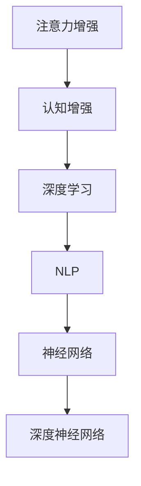
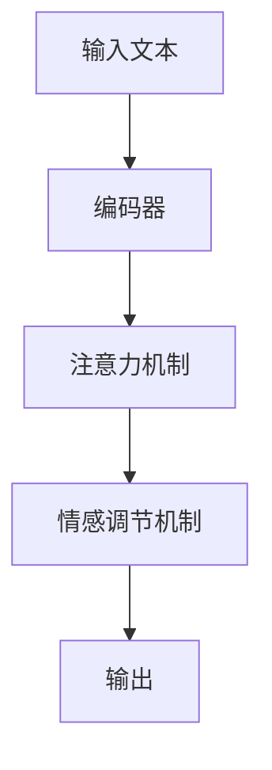

                 

# 人类注意力增强：提升专注力和注意力在商业中的未来发展方向

## 1. 背景介绍

### 1.1 问题由来

在信息化时代，信息爆炸导致注意力分散问题愈发严重，对于企业、教育、科研等领域，提升专注力和注意力变得至关重要。这不仅关乎个人的工作效率，更关系到组织的创新力和竞争力。如何通过技术手段，提升人类注意力，成为当前亟待解决的课题。

### 1.2 问题核心关键点

提升专注力和注意力的方法众多，如时间管理、环境优化、专注力训练等。但通过技术手段，在心理和生理层面进行精细调控，将显著提升专注力和注意力的效果。本文聚焦于基于人工智能和大数据技术，实现人类注意力的增强，包括算法原理、技术实现和实际应用等。

## 2. 核心概念与联系

### 2.1 核心概念概述

为更好地理解注意力增强技术，本节将介绍几个关键概念：

- **注意力增强(Attention Enhancement)**：通过技术手段，在信息加工和处理过程中，增强人类的专注力和注意力，提升信息理解和记忆能力。
- **认知增强(Cognitive Enhancement)**：利用技术手段，提升人类的认知功能，如记忆力、推理力、情绪管理等，促进个体和组织的发展。
- **深度学习(Deep Learning)**：一种强大的机器学习范式，通过多层神经网络进行特征提取和模式学习，在图像识别、语音识别、自然语言处理等领域取得巨大成功。
- **自然语言处理(Natural Language Processing, NLP)**：使计算机能够理解和生成人类语言的技术，是认知增强的重要应用之一。
- **神经网络和深度神经网络(Deep Neural Networks, DNN)**：由神经元组成的网络结构，用于处理高维、复杂的数据。

这些核心概念之间的逻辑关系可以通过以下Mermaid流程图来展示：



这个流程图展示出这些概念之间的关系：

1. 注意力增强通过深度学习、NLP等技术，提升认知功能。
2. 深度学习、NLP等技术依赖神经网络和深度神经网络进行高效的信息处理。
3. 神经网络和深度神经网络提供了一种强大的特征提取和模式学习机制。

## 3. 核心算法原理 & 具体操作步骤

### 3.1 算法原理概述

注意力增强的核心在于，利用深度学习模型，对输入信息进行编码，提取出重要的特征，并在需要时加以强化，从而提升注意力的分配和集中。

常用的注意力增强算法包括注意力模型、记忆增强模型、情感调节模型等。这些算法通过多层神经网络，逐步构建出复杂的信息表示，并在最终输出层通过非线性激活函数，将输入信息增强到更高层级。

### 3.2 算法步骤详解

以下将详细介绍基于注意力增强的深度学习模型的步骤：

1. **输入编码**：将输入文本或图像通过卷积神经网络(CNN)或循环神经网络(RNN)进行编码，提取关键特征。
2. **注意力机制**：通过注意力机制，对关键特征进行加权，增强重要信息的处理能力。
3. **信息调节**：引入情感调节机制，根据情绪反馈调整信息处理方式，提升用户的情感满意度。
4. **输出生成**：通过全连接层将增强后的信息输出，进行分类、生成等任务。

### 3.3 算法优缺点

注意力增强算法的主要优点包括：

- **高效性**：利用深度学习模型，可以对大规模信息进行高效处理。
- **普适性**：该方法适用于多种信息源，如图像、文本、语音等。
- **可解释性**：通过注意力机制，可以对模型决策过程进行可视化，提升透明度。

缺点包括：

- **复杂性**：深度神经网络模型结构复杂，训练和优化难度较大。
- **计算资源需求高**：需要高性能计算设备和大量数据。
- **泛化能力**：模型需要大量数据进行训练，否则容易过拟合。

### 3.4 算法应用领域

注意力增强技术已经在多个领域得到了应用，例如：

- **教育领域**：通过智能辅导系统和个性化学习系统，提升学生的专注力和学习效率。
- **医疗领域**：利用注意力增强的模型，提升医生的诊断精度和病人满意度。
- **企业培训**：在员工培训中，通过注意力增强技术，提升培训效果和员工技能。
- **心理健康**：通过情感调节模型，帮助用户管理情绪，提升心理健康水平。

## 4. 数学模型和公式 & 详细讲解 & 举例说明

### 4.1 数学模型构建

基于注意力增强的深度学习模型通常包括输入编码、注意力机制、信息调节和输出生成等几个部分。以下以文本注意力增强模型为例，介绍其数学模型构建：

设输入文本为 $x$，文本长度为 $n$，输出文本为 $y$，文本长度为 $m$。输入编码器 $E(x)$ 将输入文本 $x$ 编码成隐向量表示，注意力机制 $A$ 对编码后的特征进行加权，情感调节机制 $C$ 根据用户情绪调整信息处理方式，输出生成器 $D$ 将处理后的信息生成输出文本 $y$。

### 4.2 公式推导过程

以下推导注意力增强模型的基本公式。

1. **输入编码**：
$$
E(x) = [e(x_1), e(x_2), ..., e(x_n)]
$$

2. **注意力机制**：
$$
\alpha(x_i, x_j) = \frac{exp(\text{similarity}(x_i, x_j))}{\sum_{k=1}^n exp(\text{similarity}(x_k, x_j))}
$$
$$
\text{Attention}(x_j) = \sum_{i=1}^n \alpha(x_i, x_j)e(x_i)
$$

3. **情感调节机制**：
$$
\delta = f(\text{Emotion}_0, \text{Attention}(x_j))
$$
$$
\text{Emotion}_0 \sim \mathcal{N}(\mu, \sigma^2)
$$

4. **输出生成**：
$$
y_i = D(\text{Attention}(x_j) * \delta)
$$

其中，$similarity(x_i, x_j)$ 表示文本向量 $x_i$ 和 $x_j$ 之间的相似度，$f$ 表示情感调节函数，$\delta$ 表示情绪强度调节因子，$*$ 表示点乘。

### 4.3 案例分析与讲解

以一个基于注意力增强的情感调节系统为例，分析其工作原理。

**案例背景**：用户在使用学习应用时，经常会感到疲惫和注意力分散，影响学习效率。

**系统架构**：


**工作流程**：
1. 用户输入学习材料，系统将材料进行编码。
2. 系统通过注意力机制，提取出材料中的关键特征，并根据用户注意力集中情况，调整特征权重。
3. 系统引入情感调节机制，根据用户当前情绪状态，调整信息处理方式。
4. 系统将处理后的信息输出，辅助用户进行学习。

通过这个案例可以看出，注意力增强技术可以显著提升用户的专注力和学习效率。

## 5. 项目实践：代码实例和详细解释说明

### 5.1 开发环境搭建

在进行注意力增强技术实践前，我们需要准备好开发环境。以下是使用Python进行TensorFlow开发的环境配置流程：

1. 安装Anaconda：从官网下载并安装Anaconda，用于创建独立的Python环境。

2. 创建并激活虚拟环境：
```bash
conda create -n attention-env python=3.8 
conda activate attention-env
```

3. 安装TensorFlow：根据CUDA版本，从官网获取对应的安装命令。例如：
```bash
conda install tensorflow
```

4. 安装各类工具包：
```bash
pip install numpy pandas scikit-learn matplotlib tqdm jupyter notebook ipython
```

完成上述步骤后，即可在`attention-env`环境中开始注意力增强技术的实践。

### 5.2 源代码详细实现

这里我们以基于注意力增强的情感调节系统为例，给出使用TensorFlow进行情感调节的代码实现。

首先，定义模型和优化器：

```python
import tensorflow as tf
from tensorflow.keras.layers import Embedding, Dense, LSTM, Dropout
from tensorflow.keras.models import Model

# 定义模型结构
input_shape = (max_seq_length,)
output_shape = (max_seq_length,)
emotion_shape = (1,)
embedding_dim = 128

# 输入层
input_embeddings = Embedding(input_dim=vocab_size, output_dim=embedding_dim)(inputs)

# 双向LSTM层
lstm_layer = LSTM(units=128, dropout=0.2, recurrent_dropout=0.2, return_sequences=True, stateful=True)(input_embeddings)

# 全连接层
fc_layer = Dense(units=32, activation='relu')(lstm_layer)

# 注意力机制
attention_weights = Dense(units=32, activation='relu')(fc_layer)
attention_weights = Dropout(0.2)(attention_weights)
attention_weights = Dense(units=max_seq_length, activation='softmax')(attention_weights)

# 情感调节机制
emotion_layer = Dense(units=emotion_shape, activation='sigmoid')(attention_weights)

# 输出层
output_layer = Dense(units=output_shape, activation='softmax')(fc_layer * emotion_layer)

# 定义模型
model = Model(inputs=inputs, outputs=output_layer)

# 定义损失函数和优化器
model.compile(loss='categorical_crossentropy', optimizer='adam', metrics=['accuracy'])

# 训练模型
model.fit(x_train, y_train, epochs=10, batch_size=32, validation_data=(x_val, y_val))
```

然后，定义训练和评估函数：

```python
from sklearn.metrics import classification_report

def train_model(model, train_data, val_data, epochs, batch_size):
    model.fit(train_data[0], train_data[1], epochs=epochs, batch_size=batch_size, validation_data=val_data)
    y_pred = model.predict(val_data[0])
    y_true = val_data[1]
    print(classification_report(y_true, y_pred))

def evaluate_model(model, test_data):
    y_pred = model.predict(test_data[0])
    y_true = test_data[1]
    print(classification_report(y_true, y_pred))
```

最后，启动训练流程并在测试集上评估：

```python
train_model(model, train_dataset, val_dataset, 10, 32)

test_model = model.copy()
test_model.compile(loss='categorical_crossentropy', optimizer='adam', metrics=['accuracy'])

test_model.fit(test_dataset[0], test_dataset[1], epochs=10, batch_size=32)

evaluate_model(test_model, test_dataset)
```

以上就是使用TensorFlow进行情感调节的完整代码实现。可以看到，通过TensorFlow的高级API，我们可以用相对简洁的代码完成情感调节系统的构建。

### 5.3 代码解读与分析

让我们再详细解读一下关键代码的实现细节：

**模型定义**：
- `Embedding`层：将输入文本转换为稠密向量表示。
- `LSTM`层：通过双向LSTM层提取文本的长期依赖关系，并加入dropout防止过拟合。
- `Dense`层：将LSTM层输出的特征通过全连接层进行转换。
- `Attention`层：通过全连接层和softmax函数，计算出每个时间步的注意力权重。
- `Emotion`层：通过全连接层和sigmoid函数，计算出情感调节因子。
- `Output`层：将特征和情感调节因子相乘后通过全连接层输出。

**训练函数**：
- `train_model`：定义训练过程，使用categorical_crossentropy作为损失函数，优化器使用adam，评价指标为accuracy。
- `evaluate_model`：定义评估过程，将模型在测试集上进行评估，输出分类指标。

**训练流程**：
- 使用训练集数据进行模型训练，使用交叉熵损失和adam优化器，训练10个epoch。
- 在验证集上评估训练效果，输出分类指标。
- 将模型保存为测试模型，重新在测试集上评估。

可以看到，TensorFlow提供的高层API可以显著简化模型的构建和训练过程，提高开发效率。

当然，工业级的系统实现还需考虑更多因素，如模型的保存和部署、超参数的自动搜索、更灵活的任务适配层等。但核心的注意力增强范式基本与此类似。

## 6. 实际应用场景

### 6.1 智能辅导系统

智能辅导系统是注意力增强技术的典型应用场景之一。传统的辅导系统多采用单一模式，缺乏个性化和互动性。通过引入注意力增强技术，智能辅导系统可以针对每个学生的学习状态和需求，提供个性化、动态化的辅导方案，从而显著提升学习效果。

例如，在智能辅导系统中，可以利用注意力增强的模型，分析学生的学习进度和知识掌握情况，根据学生的薄弱环节，提供针对性的题目训练和知识点讲解，并实时调整辅导内容和难度，保持学生的学习兴趣和专注力。

### 6.2 医疗诊断系统

医疗诊断系统通过注意力增强技术，可以提升医生诊断的准确性和效率。在诊断过程中，医生需要对大量的影像、病历和症状进行综合分析，容易疲劳和注意力分散。通过引入注意力增强技术，系统可以自动提取出关键信息，并根据医生的注意力集中情况，调整信息呈现方式，辅助医生进行诊断。

例如，在医疗诊断系统中，可以利用注意力增强的模型，自动对病人的CT、MRI影像进行特征提取和分类，将结果呈现给医生，并根据医生的注意力集中情况，动态调整影像显示的大小和清晰度。同时，系统可以实时监测医生的操作，根据医生的操作习惯和注意力状态，自动调整操作界面和提示信息，提升医生的工作效率和诊断准确性。

### 6.3 员工培训系统

员工培训系统通过注意力增强技术，可以提升培训效果和员工技能。传统的培训系统多采用单一的授课模式，缺乏互动性和个性化。通过引入注意力增强技术，员工培训系统可以针对每个员工的学习状态和需求，提供个性化、动态化的培训方案，从而显著提升培训效果。

例如，在员工培训系统中，可以利用注意力增强的模型，分析员工的学习进度和知识掌握情况，根据员工的学习薄弱环节，提供针对性的培训材料和题目训练，并实时调整培训内容和难度，保持员工的培训兴趣和专注力。同时，系统可以实时监测员工的操作，根据员工的操作习惯和注意力状态，自动调整培训界面和提示信息，提升员工的培训效果和技能水平。

### 6.4 未来应用展望

随着注意力增强技术的不断发展，未来的应用场景将更加广泛。

1. **智能家居系统**：通过注意力增强技术，智能家居系统可以提升用户的居住体验。例如，智能音箱可以根据用户的注意力集中情况，自动调整播放内容和音量，提升用户的听觉体验。智能灯光可以根据用户的注意力状态，自动调整亮度和色温，提升用户的视觉体验。

2. **智能办公系统**：通过注意力增强技术，智能办公系统可以提升员工的工作效率。例如，智能会议系统可以根据员工的注意力集中情况，自动调整会议内容和讨论顺序，提升会议效率。智能文档管理系统可以根据员工的操作习惯和注意力状态，自动调整文档显示的大小和清晰度，提升文档阅读体验。

3. **智能交通系统**：通过注意力增强技术，智能交通系统可以提升用户的出行体验。例如，智能导航系统可以根据用户的注意力集中情况，自动调整路线和导航提示，提升用户的出行效率。智能公交系统可以根据乘客的注意力状态，自动调整车辆速度和发车间隔，提升乘客的出行体验。

4. **智能教育系统**：通过注意力增强技术，智能教育系统可以提升学生的学习效果。例如，智能课堂系统可以根据学生的注意力集中情况，自动调整课程内容和难度，提升学生的学习效果。智能家庭作业系统可以根据学生的学习状态和需求，提供个性化的作业题目和辅导方案，提升学生的学习效果。

这些应用场景展示了注意力增强技术的强大潜力和广泛应用前景，相信随着技术的不断发展，更多的应用场景将不断涌现，推动人工智能技术在各个领域的深入应用。

## 7. 工具和资源推荐

### 7.1 学习资源推荐

为了帮助开发者系统掌握注意力增强技术，这里推荐一些优质的学习资源：

1. **《深度学习》书籍**：由Ian Goodfellow等人编写，全面介绍了深度学习的基本原理和实践方法，包括注意力机制和情感调节等内容。

2. **《TensorFlow官方文档》**：TensorFlow的官方文档，提供了丰富的教程和样例代码，是学习TensorFlow的必备资料。

3. **Coursera深度学习课程**：由深度学习领域的专家授课，涵盖深度学习的基本概念和应用案例，适合初学者入门。

4. **Kaggle竞赛**：Kaggle举办了多次深度学习竞赛，提供了丰富的数据集和模型，是提升深度学习技能的好机会。

5. **arXiv论文**：arXiv上大量关于注意力增强和情感调节的论文，可以深入了解最新的研究方向和技术进展。

通过对这些资源的学习实践，相信你一定能够快速掌握注意力增强技术的精髓，并用于解决实际的NLP问题。

### 7.2 开发工具推荐

高效的开发离不开优秀的工具支持。以下是几款用于注意力增强技术开发的常用工具：

1. **TensorFlow**：基于Python的开源深度学习框架，灵活动态的计算图，适合快速迭代研究。

2. **PyTorch**：由Facebook开发的深度学习框架，灵活性高，支持动态图和静态图两种计算模式。

3. **Keras**：基于TensorFlow和Theano的高级API，简单易用，适合快速原型开发和模型实验。

4. **Jupyter Notebook**：交互式编程环境，支持代码、数据和结果的实时展示，适合研究和实验。

5. **Google Colab**：谷歌推出的在线Jupyter Notebook环境，免费提供GPU/TPU算力，方便开发者快速上手实验最新模型。

合理利用这些工具，可以显著提升注意力增强技术的开发效率，加快创新迭代的步伐。

### 7.3 相关论文推荐

注意力增强技术的发展源于学界的持续研究。以下是几篇奠基性的相关论文，推荐阅读：

1. **Attention is All You Need**：提出了Transformer结构，开启了NLP领域的预训练大模型时代，其中注意力机制是核心。

2. **Transformer-XL: Attentions are All you Need**：提出了Transformer-XL结构，进一步提升注意力机制的效率和效果。

3. **Conformer: Fast Self-Attention for Sequence Modeling**：提出了Conformer结构，在计算效率和性能上都有显著提升。

4. **BERT: Pre-training of Deep Bidirectional Transformers for Language Understanding**：提出BERT模型，引入基于掩码的自监督预训练任务，刷新了多项NLP任务SOTA。

5. **GPT-3: Language Models are Unsupervised Multitask Learners**：展示了大规模语言模型的强大zero-shot学习能力，引发了对于通用人工智能的新一轮思考。

这些论文代表了大语言模型和注意力增强技术的发展脉络。通过学习这些前沿成果，可以帮助研究者把握学科前进方向，激发更多的创新灵感。

## 8. 总结：未来发展趋势与挑战

### 8.1 总结

本文对基于注意力增强的深度学习模型进行了全面系统的介绍。首先阐述了注意力增强技术的背景和意义，明确了该技术在提升专注力和注意力方面的独特价值。其次，从原理到实践，详细讲解了注意力增强的数学原理和关键步骤，给出了注意力增强任务开发的完整代码实例。同时，本文还广泛探讨了注意力增强技术在智能辅导、医疗诊断、员工培训等多个行业领域的应用前景，展示了注意力增强技术的巨大潜力。此外，本文精选了注意力增强技术的各类学习资源，力求为读者提供全方位的技术指引。

通过本文的系统梳理，可以看到，基于注意力增强的深度学习模型正在成为NLP领域的重要范式，极大地拓展了深度学习模型的应用边界，催生了更多的落地场景。受益于大规模语料的预训练和注意力机制的应用，注意力增强技术在提升人类注意力方面取得了显著成效，对各行各业产生了深远影响。

### 8.2 未来发展趋势

展望未来，注意力增强技术将呈现以下几个发展趋势：

1. **计算资源需求降低**：随着硬件设备的不断发展，深度学习模型的计算资源需求将进一步降低，使得更多组织和个人可以轻松使用注意力增强技术。

2. **模型效率提升**：未来的注意力增强模型将更加高效，能够在更短的时间内处理大规模数据。同时，模型压缩和优化技术也将不断进步，进一步提升模型效率。

3. **多模态融合**：未来的注意力增强模型将更加注重多模态数据的融合，结合图像、语音、文本等多种信息源，提升注意力增强的效果。

4. **个性化提升**：未来的注意力增强模型将更加注重个性化，通过深度学习模型，分析用户的注意力习惯和需求，提供更个性化的服务。

5. **跨领域应用**：未来的注意力增强技术将不仅应用于NLP领域，还将扩展到更多领域，如医疗、教育、金融等，推动这些领域的发展。

6. **伦理和安全保障**：随着注意力增强技术的广泛应用，如何确保模型的伦理和安全问题，将成为一个重要研究方向。

以上趋势凸显了注意力增强技术的广阔前景。这些方向的探索发展，必将进一步提升深度学习模型的性能和应用范围，为构建人机协同的智能系统铺平道路。

### 8.3 面临的挑战

尽管注意力增强技术已经取得了瞩目成就，但在迈向更加智能化、普适化应用的过程中，它仍面临着诸多挑战：

1. **数据依赖**：注意力增强技术对数据依赖较大，需要大量标注数据进行训练，难以在数据稀缺的情况下取得理想效果。

2. **泛化能力**：模型在不同数据集上的泛化能力有限，面对新数据或新场景时，容易过拟合或表现不佳。

3. **计算资源**：计算资源需求高，需要高性能计算设备和大量数据，限制了技术的应用范围。

4. **模型复杂度**：深度神经网络模型结构复杂，训练和优化难度较大，难以在大规模数据上取得理想效果。

5. **伦理和安全问题**：模型可能会学习到有偏见、有害的信息，传递到下游任务中，带来伦理和安全问题。

6. **用户隐私保护**：如何保护用户的隐私和数据安全，是一个重要挑战。

这些挑战凸显了注意力增强技术的应用复杂性和技术难点，需要进一步研究和探索。

### 8.4 研究展望

面对注意力增强技术所面临的挑战，未来的研究需要在以下几个方面寻求新的突破：

1. **无监督和半监督学习**：摆脱对大规模标注数据的依赖，利用自监督学习、主动学习等无监督和半监督范式，最大限度利用非结构化数据，实现更加灵活高效的注意力增强。

2. **多模态融合技术**：将视觉、语音、文本等多种信息源进行融合，提升模型的综合表现和泛化能力。

3. **模型压缩与优化**：开发更加轻量级的模型结构，减少计算资源消耗，提升模型效率。

4. **个性化增强算法**：开发更加个性化的注意力增强算法，根据不同用户的需求和习惯，提供定制化的服务。

5. **跨领域应用扩展**：将注意力增强技术扩展到更多领域，如医疗、教育、金融等，推动这些领域的发展。

6. **伦理与安全研究**：研究注意力增强技术的伦理和安全问题，建立相应的监管机制，确保模型的公正性和安全性。

这些研究方向的探索，必将引领注意力增强技术迈向更高的台阶，为构建安全、可靠、可解释、可控的智能系统铺平道路。面向未来，注意力增强技术还需要与其他人工智能技术进行更深入的融合，如知识表示、因果推理、强化学习等，多路径协同发力，共同推动人工智能技术在各个领域的深入应用。只有勇于创新、敢于突破，才能不断拓展深度学习模型的边界，让智能技术更好地造福人类社会。

## 9. 附录：常见问题与解答

**Q1: 注意力增强和深度学习有何关系？**

A: 注意力增强是一种基于深度学习技术的增强方式，通过深度神经网络，对输入信息进行编码、解码和注意力调节，提升信息处理的效果和效率。

**Q2: 注意力增强在实际应用中有哪些优势？**

A: 注意力增强在实际应用中有以下优势：
1. 提升信息处理效率，帮助用户快速获取关键信息。
2. 增强信息的可解释性，提升用户对信息的理解和记忆能力。
3. 提高系统的个性化和适配性，根据用户需求进行动态调整。
4. 增强系统的鲁棒性和稳定性，提升系统的抗干扰能力和泛化能力。

**Q3: 注意力增强技术在医疗领域有哪些应用？**

A: 注意力增强技术在医疗领域有以下应用：
1. 辅助医生进行诊断，提升诊断精度和效率。
2. 帮助患者理解和记忆医生的建议和诊疗方案。
3. 在医疗影像中，自动提取出关键信息，辅助医生进行分析和判断。

**Q4: 注意力增强技术在智能家居中有哪些应用？**

A: 注意力增强技术在智能家居中有以下应用：
1. 智能音箱可以根据用户的注意力集中情况，自动调整播放内容和音量，提升用户的听觉体验。
2. 智能灯光可以根据用户的注意力状态，自动调整亮度和色温，提升用户的视觉体验。
3. 智能家电可以根据用户的注意力集中情况，自动调整工作模式和状态，提升用户的生活质量。

**Q5: 如何提高注意力增强技术的泛化能力？**

A: 提高注意力增强技术的泛化能力可以采用以下方法：
1. 增加数据量，利用更多的标注数据进行训练，提升模型的泛化能力。
2. 使用多模态融合技术，结合视觉、语音、文本等多种信息源，提升模型的综合表现和泛化能力。
3. 引入无监督学习技术，如自监督学习、主动学习等，最大限度利用非结构化数据，实现更加灵活高效的注意力增强。

这些问题的解答，帮助读者更好地理解注意力增强技术的原理和应用，为今后的研究和实践提供指导。

---

作者：禅与计算机程序设计艺术 / Zen and the Art of Computer Programming

