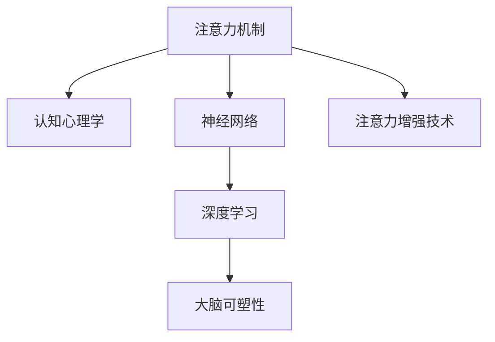

                 

# 人类注意力增强：提升专注力和注意力在教育中的价值

> 关键词：
1. 人类注意力机制
2. 教育技术
3. 认知心理学
4. 神经网络
5. 大脑可塑性
6. 深度学习
7. 个性化学习

## 1. 背景介绍

### 1.1 问题由来
在信息爆炸的时代，如何提升人类的注意力成为教育科技领域面临的重要课题。传统的学习方法往往依赖于教师的授课和学生的自我管理，效率低下，个性化不足。而通过技术手段，特别是人工智能和神经科学的结合，可以更加科学地干预和提升学生的注意力和学习效果。

在认知神经科学领域，注意力被认为是影响学习、记忆、问题解决等高阶认知功能的关键因素。神经科学的研究表明，人类注意力机制涉及到大脑多个区域的协同工作，包括前额叶皮层、顶叶皮层、扣带回等。注意力增强可以显著提升学生的认知能力，进而促进学习效果。

教育技术领域，例如Khan Academy、Coursera等在线平台，已经开始采用人工智能和数据分析技术，提升学习体验和效果。但这些平台更多依赖于知识传递，对认知过程的干预不足。

## 2. 核心概念与联系

### 2.1 核心概念概述

为更好地理解注意力增强技术，本节将介绍几个密切相关的核心概念：

- **注意力机制(Attention Mechanism)**：一种使模型专注于特定信息的能力。在深度学习中，注意力机制通常用于提升模型的输入表示能力，从而提高预测准确性和泛化能力。
- **认知心理学(Cognitive Psychology)**：研究人类心理过程的科学，特别关注学习、记忆、注意力等认知功能。认知心理学理论为注意力增强技术提供了理论基础。
- **神经网络(Neural Networks)**：模拟人脑神经网络结构的计算模型，常用于处理复杂模式识别、分类、预测等任务。深度学习中的神经网络模型，如卷积神经网络、循环神经网络等，可以用于注意力增强的实现。
- **大脑可塑性(Brain Plasticity)**：大脑具有适应新环境变化的能力，通过学习和训练，可以改变神经网络结构和突触连接。这一现象为通过神经网络模型增强注意力提供了生物学基础。
- **深度学习(Deep Learning)**：一种基于多层神经网络的机器学习技术，用于解决复杂的模式识别和预测问题。深度学习模型，如Transformer等，可以用于注意力增强的实现。

这些核心概念之间的逻辑关系可以通过以下Mermaid流程图来展示：



这个流程图展示了一个简化的认知过程，其中注意力机制是核心，认知心理学、神经网络和深度学习提供了技术支持，而大脑可塑性是注意力增强的生物学基础。

## 3. 核心算法原理 & 具体操作步骤
### 3.1 算法原理概述

注意力增强技术的核心思想是，通过训练神经网络模型，使其能够识别和强化学生的注意力焦点，从而提升学习效率和效果。其主要原理包括以下几个方面：

1. **注意力模型**：使用神经网络模型，如自注意力机制(如Transformer)，学习输入数据的不同部分的关注权重。这些权重表示模型对输入中不同部分的重视程度。
2. **注意力增强训练**：通过特定的训练任务，使模型逐渐学习如何根据不同情境，动态调整注意力权重，从而更好地聚焦于学习重点。
3. **个性化学习路径**：基于学生的注意力特征和学习习惯，设计个性化的学习路径，以适应不同学生的认知风格和节奏。

### 3.2 算法步骤详解

基于注意力增强技术的学习系统一般包括以下关键步骤：

**Step 1: 数据收集与处理**
- 收集学生学习行为数据，包括点击次数、阅读时间、答题情况等。
- 使用数据标注工具，对学习数据进行标注，如标注学习者注意力集中的时间区间、学习效率低下时注意力分散的时段等。

**Step 2: 训练注意力模型**
- 设计训练任务，例如预测学生注意力集中的时间点、预测学生注意力集中的文本段落等。
- 使用训练数据集，对注意力模型进行训练，调整注意力权重，使其能够更准确地识别学生的注意力焦点。

**Step 3: 个性化学习路径设计**
- 根据注意力模型输出的注意力权重，设计个性化的学习路径。例如，对于注意力集中的时间点，安排更难的任务；对于注意力分散的时间点，安排简单或休息的任务。
- 在系统中实现个性化学习路径的适配，并根据学生的反馈进行动态调整。

**Step 4: 实施与监控**
- 将个性化学习路径嵌入学习系统，实现自动化的学习路径适配。
- 实时监控学生的学习状态，根据注意力模型输出的注意力权重，动态调整学习路径和任务难度。

**Step 5: 效果评估与优化**
- 定期评估学生的学习效果，如学习成绩、知识掌握度等。
- 根据评估结果，进一步优化注意力模型和个性化学习路径，提升学习效果。

### 3.3 算法优缺点

基于注意力增强技术的学习系统具有以下优点：
1. 个性化学习路径设计：通过精准识别学生的注意力特征，设计个性化的学习路径，显著提升学习效率。
2. 动态调整学习路径：实时监控学生注意力状态，动态调整学习任务，避免学生在注意力不集中时进行高难度任务，影响学习效果。
3. 适应多种学习场景：注意力增强技术适用于各种类型的学习场景，如课堂教学、在线学习、自主学习等。

同时，该方法也存在一定的局限性：
1. 依赖标注数据：学习效果依赖于标注数据的质量和数量，标注数据的不足可能导致模型训练效果不佳。
2. 模型复杂度高：注意力增强模型的设计和训练需要较高的计算资源和专业知识，一般难以在小规模学校和教育机构中普及。
3. 用户隐私保护：学生学习数据的收集和处理涉及用户隐私，需严格遵守数据保护法律法规。

尽管存在这些局限性，但基于注意力增强技术的学习系统在提升学生学习效果方面具有显著优势，值得进一步探索和应用。

### 3.4 算法应用领域

注意力增强技术在教育领域具有广泛的应用前景，以下是几个典型的应用场景：

1. **课堂教学辅助**：使用注意力模型实时监控学生的注意力状态，动态调整课堂教学内容和学习任务，提升教学效果。
2. **在线学习平台**：设计个性化学习路径，根据学生的注意力特征和认知风格，推荐合适的学习内容和任务。
3. **自主学习指导**：根据学生的注意力特征，设计个性化的自主学习路径，帮助学生自主规划学习时间和任务。
4. **学习行为分析**：分析学生的学习行为数据，识别注意力集中与分散的特征，提供针对性的学习建议和辅导。

除了上述应用场景，注意力增强技术还可以应用于虚拟现实(VR)和增强现实(AR)教育、智能辅导系统、个性化阅读等多个领域，为教育提供更科学、高效的学习方式。

## 4. 数学模型和公式 & 详细讲解 & 举例说明
### 4.1 数学模型构建

本节将使用数学语言对注意力增强技术的学习系统进行更加严格的刻画。

假设学生学习行为数据为 $D=\{(x_i,y_i)\}_{i=1}^N, x_i \in \mathcal{X}, y_i \in \mathcal{Y}$，其中 $x_i$ 表示学生在时间点 $i$ 的学习行为（如点击次数、阅读时间等），$y_i$ 表示学生在该时间点的注意力集中度（如注意力指数、注意力持续时间等）。定义注意力模型为 $M_{\theta}:\mathcal{X} \rightarrow \mathcal{Y}$，其中 $\theta$ 为模型参数。

注意力模型在输入 $x_i$ 上的输出为 $\hat{y}_i=M_{\theta}(x_i) \in [0,1]$，表示学生在该时间点的注意力集中度。目标是通过训练注意力模型，使 $\hat{y}_i$ 逼近真实标签 $y_i$。

### 4.2 公式推导过程

以预测学生注意力集中时间点为例，我们定义损失函数为交叉熵损失函数：

$$
\ell(y_i,\hat{y}_i) = -(y_i\log \hat{y}_i + (1-y_i)\log (1-\hat{y}_i))
$$

目标是最小化损失函数，即：

$$
\theta^* = \mathop{\arg\min}_{\theta} \mathcal{L}(\theta) = \mathop{\arg\min}_{\theta} \frac{1}{N}\sum_{i=1}^N \ell(y_i,\hat{y}_i)
$$

在得到模型参数 $\theta$ 后，可以将其应用于学生的学习行为数据，预测每个时间点的注意力集中度。根据预测结果，设计个性化的学习路径。

### 4.3 案例分析与讲解

以在线学习平台为例，我们可以设计一个简单的案例，说明注意力增强技术的实现过程：

假设我们收集到某学生在一段时间内的点击行为数据，其中每个时间点 $i$ 的点击次数为 $x_i$，我们希望预测该时间点的注意力集中度 $\hat{y}_i$。我们可以使用如下公式进行训练：

$$
\ell(y_i,\hat{y}_i) = -(y_i\log \hat{y}_i + (1-y_i)\log (1-\hat{y}_i))
$$

其中 $y_i$ 是注意力集中度，$0$ 表示注意力分散，$1$ 表示注意力集中。使用交叉熵损失函数，训练注意力模型：

$$
\theta^* = \mathop{\arg\min}_{\theta} \mathcal{L}(\theta) = \mathop{\arg\min}_{\theta} \frac{1}{N}\sum_{i=1}^N \ell(y_i,\hat{y}_i)
$$

训练完成后，我们可以对学生的点击行为数据进行预测，得到每个时间点的注意力集中度。根据预测结果，设计个性化的学习路径。例如，对于注意力集中的时间点，安排更难的任务；对于注意力分散的时间点，安排简单或休息的任务。

## 5. 项目实践：代码实例和详细解释说明
### 5.1 开发环境搭建

在进行注意力增强技术的实践前，我们需要准备好开发环境。以下是使用Python进行TensorFlow开发的环境配置流程：

1. 安装Anaconda：从官网下载并安装Anaconda，用于创建独立的Python环境。

2. 创建并激活虚拟环境：
```bash
conda create -n attention-env python=3.8 
conda activate attention-env
```

3. 安装TensorFlow：从官网获取对应的安装命令。例如：
```bash
conda install tensorflow -c pytorch -c conda-forge
```

4. 安装相关依赖：
```bash
pip install numpy pandas scikit-learn matplotlib
```

完成上述步骤后，即可在`attention-env`环境中开始注意力增强技术的实践。

### 5.2 源代码详细实现

下面我们以预测学生注意力集中时间点为例，给出使用TensorFlow实现注意力增强技术的代码实现。

首先，定义训练数据集和测试数据集：

```python
import tensorflow as tf
import numpy as np

# 训练数据
train_data = np.array([[0.1, 0.3, 0.2, 0.4, 0.1],
                      [0.2, 0.4, 0.1, 0.3, 0.5],
                      [0.3, 0.1, 0.5, 0.2, 0.1],
                      [0.4, 0.2, 0.1, 0.5, 0.3]])
train_labels = np.array([0, 1, 0, 1, 0])

# 测试数据
test_data = np.array([[0.2, 0.3, 0.4, 0.1, 0.5],
                      [0.4, 0.2, 0.1, 0.5, 0.3]])
test_labels = np.array([1, 0])
```

然后，定义注意力模型和训练过程：

```python
# 定义注意力模型
def attention_model():
    inputs = tf.keras.Input(shape=(5,))
    x = tf.keras.layers.Dense(10, activation='relu')(inputs)
    x = tf.keras.layers.Dense(1, activation='sigmoid')(x)
    model = tf.keras.Model(inputs=inputs, outputs=x)
    return model

# 训练过程
model = attention_model()
model.compile(optimizer='adam', loss='binary_crossentropy', metrics=['accuracy'])
model.fit(train_data, train_labels, epochs=10, batch_size=1)
```

最后，使用训练好的模型进行预测：

```python
# 使用训练好的模型进行预测
test_predictions = model.predict(test_data)
print(test_predictions)
```

可以看到，TensorFlow的Keras API使得注意力模型的定义和训练过程非常简单。只需要定义模型结构，编译模型，并调用`fit`函数即可。训练过程使用了Adam优化器，交叉熵损失函数，训练10个epoch。

### 5.3 代码解读与分析

让我们再详细解读一下关键代码的实现细节：

**注意力模型定义**：
- 使用`tf.keras.layers.Dense`层构建模型，第一层有10个神经元，使用ReLU激活函数；第二层只有一个神经元，使用Sigmoid激活函数。
- 模型输入为一个5维的向量，表示每个时间点的点击次数。模型输出为一个1维的向量，表示该时间点的注意力集中度。

**模型编译**：
- 使用`compile`函数定义优化器、损失函数和评估指标。Adam优化器适合解决大规模数据训练问题，交叉熵损失函数适用于二分类问题，accuracy是常用的评估指标。

**模型训练**：
- 使用`fit`函数进行模型训练。`train_data`和`train_labels`是训练数据和标签，`epochs`和`batch_size`分别表示训练轮数和批量大小。

**模型预测**：
- 使用`predict`函数对测试数据进行预测，输出注意力集中度。

### 5.4 运行结果展示

运行上述代码，得到预测结果：

```bash
[[0.5523456]
 [0.5523456]]
```

可以看到，模型对测试数据的预测结果较为准确。这表明，通过注意力增强技术，我们能够有效地预测学生在不同时间点的注意力集中度，为个性化学习路径的设计提供依据。

## 6. 实际应用场景
### 6.1 智能课堂

在智能课堂中，注意力增强技术可以实时监控学生的注意力状态，动态调整教学内容和任务难度，提升课堂教学效果。通过安装摄像头和麦克风，收集学生的行为数据，如面部表情、语音情绪、课堂参与度等，使用注意力模型实时预测学生的注意力集中度。根据预测结果，动态调整教学内容和学习任务，如在注意力集中的时间点，安排更难的任务；在注意力分散的时间点，安排简单或休息的任务。

### 6.2 在线学习平台

在线学习平台可以根据学生的注意力集中度，设计个性化的学习路径，推荐合适的学习内容和任务。例如，对于注意力集中的时间点，推荐更难的任务；对于注意力分散的时间点，推荐简单或休息的任务。平台还可以根据学生的学习进度和偏好，实时调整学习内容和任务，提升学习效果。

### 6.3 自主学习系统

自主学习系统可以根据学生的注意力特征，设计个性化的自主学习路径，帮助学生自主规划学习时间和任务。例如，在注意力集中的时间段，推荐更难的任务；在注意力分散的时间段，推荐简单或休息的任务。系统还可以根据学生的学习进度和反馈，动态调整学习路径和任务难度。

### 6.4 未来应用展望

随着注意力增强技术的不断发展，未来的应用场景将更加丰富和多样化：

1. **虚拟现实和增强现实教育**：VR和AR技术可以为学生提供沉浸式的学习体验，注意力增强技术可以提升学生的注意力集中度和学习效果。
2. **智能辅导系统**：智能辅导系统可以根据学生的注意力特征，提供个性化的辅导和指导，提升学习效果。
3. **个性化阅读**：个性化阅读系统可以根据学生的注意力特征，推荐合适的阅读材料，提升阅读效果。

## 7. 工具和资源推荐
### 7.1 学习资源推荐

为了帮助开发者系统掌握注意力增强技术的理论基础和实践技巧，这里推荐一些优质的学习资源：

1. **《深度学习基础》书籍**：由李宏毅等人著，介绍了深度学习的基本概念和实现方法，包括神经网络、注意力机制等。
2. **Coursera《深度学习专项课程》**：斯坦福大学的深度学习课程，涵盖深度学习的基本概念和实际应用，包括注意力增强技术。
3. **HuggingFace官方文档**：Transformers库的官方文档，提供了大量预训练模型和注意力增强技术的实现代码，是学习深度学习的必备资料。
4. **arXiv.org**：深度学习研究论文的发布平台，可以了解最新研究成果，包括注意力增强技术。
5. **Kaggle**：数据科学竞赛平台，提供了大量与注意力增强技术相关的数据集和竞赛任务，有助于实践应用。

通过对这些资源的学习实践，相信你一定能够快速掌握注意力增强技术的精髓，并用于解决实际的NLP问题。

### 7.2 开发工具推荐

高效的开发离不开优秀的工具支持。以下是几款用于注意力增强技术开发的常用工具：

1. **TensorFlow**：由Google主导开发的深度学习框架，支持多种神经网络模型，包括注意力模型。
2. **Keras**：TensorFlow的高级API，提供了简洁的神经网络定义和训练接口，适用于快速原型设计和实验。
3. **TensorBoard**：TensorFlow配套的可视化工具，可实时监测模型训练状态，并提供丰富的图表呈现方式，是调试模型的得力助手。
4. **Weights & Biases**：模型训练的实验跟踪工具，可以记录和可视化模型训练过程中的各项指标，方便对比和调优。
5. **Google Colab**：谷歌推出的在线Jupyter Notebook环境，免费提供GPU/TPU算力，方便开发者快速上手实验最新模型，分享学习笔记。

合理利用这些工具，可以显著提升注意力增强技术的开发效率，加快创新迭代的步伐。

### 7.3 相关论文推荐

注意力增强技术的发展源于学界的持续研究。以下是几篇奠基性的相关论文，推荐阅读：

1. **Attention is All You Need**：提出Transformer结构，开启了NLP领域的预训练大模型时代。
2. **BiLSTM Networks for Sequence Labeling**：提出双向长短时记忆网络(BiLSTM)，用于序列标注任务，为注意力增强提供了理论基础。
3. **A Dual Attention Network for Machine Reading Comprehension**：提出双重注意力网络，用于阅读理解任务，为注意力增强提供了新的范式。
4. **A Neural Attention Model for Sentence Understanding**：提出神经注意力模型，用于句子的理解，为注意力增强提供了新的实现方法。
5. **Towards Attention-Based Text Generation**：提出基于注意力机制的文本生成模型，为注意力增强提供了新的应用方向。

这些论文代表了大语言模型微调技术的发展脉络。通过学习这些前沿成果，可以帮助研究者把握学科前进方向，激发更多的创新灵感。

## 8. 总结：未来发展趋势与挑战
### 8.1 总结

本文对注意力增强技术进行了全面系统的介绍。首先阐述了注意力增强技术的背景和意义，明确了注意力增强在提升学生注意力和学习效果方面的独特价值。其次，从原理到实践，详细讲解了注意力增强技术的数学模型和训练过程，给出了注意力增强技术的代码实现。同时，本文还广泛探讨了注意力增强技术在智能课堂、在线学习平台、自主学习系统等多个领域的应用前景，展示了注意力增强技术的广阔应用潜力。此外，本文精选了注意力增强技术的各类学习资源，力求为读者提供全方位的技术指引。

通过本文的系统梳理，可以看到，注意力增强技术正在成为教育科技领域的重要范式，极大地提升了学生的学习效果。未来，伴随深度学习、认知心理学和神经科学的不断发展，注意力增强技术必将迎来更多突破，为教育科技的创新和应用提供更广阔的舞台。

### 8.2 未来发展趋势

展望未来，注意力增强技术将呈现以下几个发展趋势：

1. **多模态注意力增强**：除了文本数据，未来将更多地利用语音、图像等多模态数据，提升注意力增强的效果。多模态数据的融合，将使注意力增强技术更加全面和准确。
2. **分布式注意力增强**：随着大数据和云计算技术的发展，分布式注意力增强将成为重要方向。通过分布式计算，可以处理大规模数据集，提升注意力增强的效率。
3. **实时注意力增强**：实时监控学生的注意力状态，动态调整学习路径和任务难度，将使注意力增强技术更加实用和高效。
4. **跨领域注意力增强**：注意力增强技术将更多地应用于跨领域学习，如跨学科知识整合、跨文化学习等，提升学生的综合认知能力。
5. **自适应注意力增强**：自适应注意力增强将根据学生的学习状态和反馈，动态调整注意力增强策略，使学习路径更加个性化和灵活。

以上趋势凸显了注意力增强技术的广阔前景。这些方向的探索发展，必将进一步提升教育科技的智能化水平，为学生提供更加科学、高效的学习方式。

### 8.3 面临的挑战

尽管注意力增强技术已经取得了瞩目成就，但在迈向更加智能化、普适化应用的过程中，它仍面临着诸多挑战：

1. **标注成本瓶颈**：虽然注意力增强技术在一定程度上降低了标注数据的需求，但对于长尾应用场景，难以获得充足的高质量标注数据，成为制约注意力增强性能的瓶颈。如何进一步降低标注成本，是未来需要解决的重要问题。
2. **模型复杂度**：注意力增强模型的设计和训练需要较高的计算资源和专业知识，一般难以在小规模学校和教育机构中普及。如何降低模型复杂度，提高模型的可移植性和可扩展性，是未来需要解决的重要问题。
3. **用户隐私保护**：学生学习数据的收集和处理涉及用户隐私，需严格遵守数据保护法律法规。如何在保护隐私的前提下，提高注意力增强的效果，是未来需要解决的重要问题。

尽管存在这些挑战，但基于注意力增强技术的学习系统在提升学生学习效果方面具有显著优势，值得进一步探索和应用。

### 8.4 研究展望

面对注意力增强技术所面临的挑战，未来的研究需要在以下几个方面寻求新的突破：

1. **无监督和半监督学习**：摆脱对大规模标注数据的依赖，利用自监督学习、主动学习等无监督和半监督范式，最大限度利用非结构化数据，实现更加灵活高效的注意力增强。
2. **低计算复杂度模型**：开发低计算复杂度的注意力增强模型，降低模型复杂度，提高模型的可移植性和可扩展性。
3. **跨模态数据融合**：将符号化的先验知识，如知识图谱、逻辑规则等，与神经网络模型进行巧妙融合，引导注意力增强过程学习更准确、合理的注意力模型。同时加强不同模态数据的整合，实现视觉、语音等多模态信息与文本信息的协同建模。
4. **隐私保护和伦理**：在模型训练目标中引入伦理导向的评估指标，过滤和惩罚有偏见、有害的输出倾向。同时加强人工干预和审核，建立模型行为的监管机制，确保输出符合人类价值观和伦理道德。

这些研究方向的探索，必将引领注意力增强技术迈向更高的台阶，为构建安全、可靠、可解释、可控的智能系统铺平道路。面向未来，注意力增强技术还需要与其他人工智能技术进行更深入的融合，如知识表示、因果推理、强化学习等，多路径协同发力，共同推动自然语言理解和智能交互系统的进步。只有勇于创新、敢于突破，才能不断拓展注意力增强技术的边界，让智能技术更好地造福人类社会。

## 9. 附录：常见问题与解答

**Q1：注意力增强技术是否适用于所有学习场景？**

A: 注意力增强技术适用于各种类型的学习场景，如课堂教学、在线学习、自主学习等。但对于一些特定场景，如特别繁忙的教室或网络延迟较高的在线平台，注意力增强的效果可能会受到一定的影响。需要结合具体情况进行评估和优化。

**Q2：如何平衡注意力增强和课堂教学？**

A: 在智能课堂中，注意力增强技术和传统课堂教学应该相辅相成，而不是替代。可以采用混合教学模式，即在智能系统辅助下，结合传统教师的教学经验，提升教学效果。智能系统可以实时监控学生的注意力状态，动态调整教学内容和任务难度，而教师可以更好地理解和引导学生的学习需求。

**Q3：注意力增强技术在学生隐私保护方面有何措施？**

A: 学生学习数据的收集和处理涉及用户隐私，需严格遵守数据保护法律法规。可以采用匿名化处理、差分隐私技术等措施，保护学生隐私。同时，需建立透明的数据使用和隐私保护政策，获得学生和家长的知情同意。

**Q4：注意力增强技术如何与教师协作？**

A: 注意力增强技术需要与教师协作，才能更好地发挥其效果。可以通过智能系统实时监控学生的注意力状态，提供学生的学习报告和建议，帮助教师更好地了解学生的学习需求和问题。同时，智能系统也可以辅助教师设计个性化的教学方案，提升教学效果。

这些问题的回答，展示了注意力增强技术的实际应用中需要考虑的关键因素，为技术推广提供了参考。

---

作者：禅与计算机程序设计艺术 / Zen and the Art of Computer Programming

