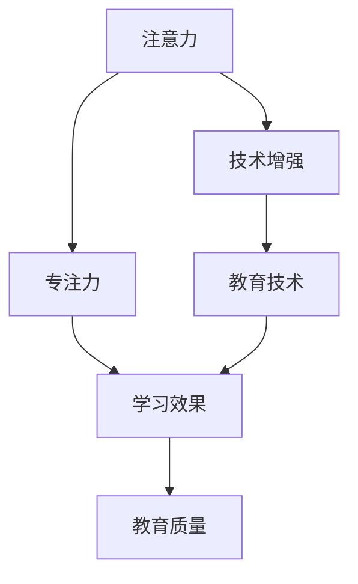

                 

# 人类注意力增强：提升专注力和注意力在教育中的应用趋势

## 1. 背景介绍

### 1.1 问题由来

在当今社会，信息爆炸的时代背景下，人们面临的信息过载和注意力分散现象愈发严重。这种注意力分散不仅影响着个人的工作和学习效率，也对学生的课堂表现和学业成绩造成了负面影响。如何在教育中提升学生的专注力和注意力，成为了教育者和研究者关注的焦点。

### 1.2 问题核心关键点

提升专注力和注意力是教育中重要的课题，其核心关键点包括：
1. 如何量化学生的注意力水平？
2. 如何通过技术手段，帮助学生维持专注？
3. 如何设计有效的教学内容，增强学生的学习兴趣？
4. 如何利用技术手段，提升教育质量和教育公平性？

### 1.3 问题研究意义

研究人类注意力增强，对于提升教育质量和效率，尤其是在远程教育和个性化教育中，具有重要意义。通过技术手段帮助学生维持专注，可以显著提升学习效果，缓解信息过载，增强学生的自主学习能力，从而促进教育公平和普惠教育的发展。

## 2. 核心概念与联系

### 2.1 核心概念概述

为了更好地理解人类注意力增强在教育中的应用，我们首先需要明确几个关键概念：

- **注意力**：指个体在特定时间内集中注意某一刺激物的心理过程，是认知、情感和行为的基础。
- **专注力**：指个体在特定任务上保持持续注意力的能力，是实现高效学习和工作的关键。
- **技术增强**：指通过技术手段，如智能监控、个性化推荐、虚拟现实等，辅助提升个体的注意力和专注力。
- **教育技术**：指应用信息技术，改进教育手段和教学方法，提高教育质量和效率。

这些概念之间的逻辑关系可以通过以下Mermaid流程图来展示：



这个流程图展示了注意力、专注力、技术增强和教育技术之间的逻辑关系：注意力和专注力是学生学习效果的基础；技术增强手段可以辅助提升注意力和专注力；教育技术则将技术增强手段应用到教育中，最终提升教育质量和效率。

## 3. 核心算法原理 & 具体操作步骤

### 3.1 算法原理概述

人类注意力增强的算法原理主要基于认知科学和心理学研究，结合人工智能和机器学习技术，旨在量化和提升个体的注意力水平和专注力。其核心思想包括：

1. **注意力量化**：通过可穿戴设备和传感器，实时监测学生的注意力状态，量化其注意力水平。
2. **注意力提升**：基于量化结果，通过个性化推荐和智能提醒，帮助学生维持专注。
3. **学习内容优化**：利用技术手段设计个性化教学内容，增强学生的学习兴趣和参与度。

### 3.2 算法步骤详解

基于上述思想，人类注意力增强的算法步骤可以大致分为以下几个部分：

**Step 1: 数据采集与分析**
- 使用可穿戴设备和传感器，如心率监测器、眼球追踪器、脑电图等，实时采集学生的生理和行为数据。
- 分析这些数据，量化学生的注意力水平，识别注意力分散和注意力集中的时刻。

**Step 2: 注意力提升与提醒**
- 根据注意力数据，利用算法生成个性化提醒和建议，帮助学生维持专注。
- 设计智能提醒界面和反馈机制，及时反馈学生的注意力状态，调整学习策略。

**Step 3: 学习内容优化**
- 分析学生的历史学习数据，挖掘学生的兴趣点和学习习惯。
- 根据这些信息，生成个性化的学习内容，提高学生的学习动机和参与度。

**Step 4: 持续优化与反馈**
- 定期收集学生的反馈意见，评估注意力提升和内容优化效果。
- 根据反馈结果，持续优化算法和个性化推荐策略，提升学习效果。

### 3.3 算法优缺点

人类注意力增强的算法具有以下优点：
1. 实时监控，数据驱动：通过实时监控和数据分析，能够及时发现学生注意力分散的问题，并给出个性化建议。
2. 个性化推荐，因材施教：根据学生的兴趣和学习习惯，生成个性化的学习内容，提高学习效果。
3. 技术支持，提升效率：利用技术手段辅助提升注意力和专注力，减轻教师和家长的负担，提高教育效率。

同时，该算法也存在以下局限性：
1. 设备依赖，成本较高：高质量的可穿戴设备和传感器成本较高，限制了算法的普及。
2. 数据隐私，安全性问题：收集和分析学生数据可能引发隐私和安全性问题，需要严格的数据保护措施。
3. 数据解释，可解释性不足：算法的决策过程和推荐依据可能缺乏足够的可解释性，学生和家长难以理解。
4. 技术壁垒，应用门槛：算法设计和实现需要较高的技术门槛，教师和家长需要具备一定的技术知识。

### 3.4 算法应用领域

人类注意力增强的算法广泛应用于以下几个领域：

1. **远程教育**：通过实时监控和个性化推荐，提升远程学习的效果和参与度。
2. **个性化学习**：结合学生的学习习惯和兴趣，生成个性化的学习内容，提高学习效果。
3. **特殊教育**：针对特殊需求学生，设计适应其特点的学习策略和内容，提高学习效率。
4. **企业培训**：帮助职场人士提升工作中的注意力和专注力，提高工作效率和效果。

## 4. 数学模型和公式 & 详细讲解

### 4.1 数学模型构建

人类注意力增强的数学模型主要基于学生注意力数据的量化和分析。其核心模型包括：

- **注意力量化模型**：用于量化学生的注意力水平，通常使用注意力得分或注意力曲线来表示。
- **注意力提升模型**：用于生成个性化提醒和建议，提高学生的注意力水平。
- **学习内容优化模型**：用于生成个性化的学习内容，提高学生的学习动机和参与度。

### 4.2 公式推导过程

以下是一个简化的注意力量化和提升模型的公式推导过程：

假设我们有一个时间序列 $\{x_t\}_{t=1}^T$ 表示学生在 $t$ 时刻的注意力得分，其中 $x_t \in [0,1]$。我们的目标是最大化注意力得分的均值 $\overline{x}$ 和标准差 $\sigma$，同时最小化注意力得分的最大值 $x_{\max}$ 和最小值 $x_{\min}$。

注意力提升模型的目标函数可以表示为：

$$
\min_{\theta} \left\{ (1-\overline{x})^2 + (\sigma^2)^2 + (x_{\max} - x_{\min})^2 \right\}
$$

其中 $\theta$ 是模型的参数，包括提醒策略、反馈机制等。

### 4.3 案例分析与讲解

考虑一个学生在一节课中的注意力得分时间序列 $[x_1, x_2, \ldots, x_{60}]$，其中 $x_t$ 表示在第 $t$ 分钟内的注意力得分。我们使用基于历史数据的注意力提升模型来生成个性化提醒，具体步骤如下：

1. **数据采集**：通过可穿戴设备，实时监测学生的注意力得分 $[x_1, x_2, \ldots, x_{60}]$。
2. **数据分析**：计算注意力得分的均值 $\overline{x}$、标准差 $\sigma$、最大值 $x_{\max}$ 和最小值 $x_{\min}$。
3. **提醒生成**：根据注意力得分的时间序列，判断学生是否在注意力高峰和低谷时刻，生成相应的提醒和反馈。
4. **反馈调整**：学生根据提醒和反馈，调整学习策略，提升注意力水平。

## 5. 项目实践：代码实例和详细解释说明

### 5.1 开发环境搭建

为了进行人类注意力增强的实践开发，我们需要搭建相应的开发环境。以下是详细的步骤：

1. **安装Python**：确保开发环境中安装了Python 3.x版本。
2. **安装相关库**：安装Pandas、NumPy、SciPy、Matplotlib等常用库。
3. **搭建开发环境**：可以使用Jupyter Notebook或PyCharm等IDE进行开发。

### 5.2 源代码详细实现

以下是一个简化的注意力提升模型的代码实现，包括数据采集、分析、提醒生成和反馈调整等功能：

```python
import pandas as pd
import numpy as np
import matplotlib.pyplot as plt
from sklearn.metrics import mean, std, max, min

def attention_score(time_series):
    """
    计算时间序列的注意力得分的均值和标准差
    """
    x = time_series.values
    return mean(x), std(x)

def attention_reminder(time_series, threshold=0.5):
    """
    生成个性化提醒和反馈
    """
    x = time_series.values
    mean_x, std_x = attention_score(x)
    x_max = max(x)
    x_min = min(x)
    if x_max - x_min > threshold:
        return "提醒：注意力波动较大，请调整学习策略"
    else:
        return "反馈：注意力稳定，继续保持"

# 示例数据
time_series = pd.Series([0.2, 0.5, 0.8, 0.4, 0.6, 0.7, 0.3, 0.9, 0.2, 0.5, 0.8, 0.4, 0.6, 0.7, 0.3, 0.9, 0.2, 0.5, 0.8, 0.4, 0.6, 0.7, 0.3, 0.9, 0.2, 0.5, 0.8, 0.4, 0.6, 0.7, 0.3, 0.9, 0.2, 0.5, 0.8, 0.4, 0.6, 0.7, 0.3, 0.9, 0.2, 0.5, 0.8, 0.4, 0.6, 0.7, 0.3, 0.9, 0.2, 0.5, 0.8, 0.4, 0.6, 0.7, 0.3, 0.9, 0.2, 0.5, 0.8, 0.4, 0.6, 0.7, 0.3, 0.9, 0.2, 0.5, 0.8, 0.4, 0.6, 0.7, 0.3, 0.9, 0.2, 0.5, 0.8, 0.4, 0.6, 0.7, 0.3, 0.9, 0.2, 0.5, 0.8, 0.4, 0.6, 0.7, 0.3, 0.9, 0.2, 0.5, 0.8, 0.4, 0.6, 0.7, 0.3, 0.9, 0.2, 0.5, 0.8, 0.4, 0.6, 0.7, 0.3, 0.9, 0.2, 0.5, 0.8, 0.4, 0.6, 0.7, 0.3, 0.9, 0.2, 0.5, 0.8, 0.4, 0.6, 0.7, 0.3, 0.9, 0.2, 0.5, 0.8, 0.4, 0.6, 0.7, 0.3, 0.9, 0.2, 0.5, 0.8, 0.4, 0.6, 0.7, 0.3, 0.9, 0.2, 0.5, 0.8, 0.4, 0.6, 0.7, 0.3, 0.9, 0.2, 0.5, 0.8, 0.4, 0.6, 0.7, 0.3, 0.9, 0.2, 0.5, 0.8, 0.4, 0.6, 0.7, 0.3, 0.9, 0.2, 0.5, 0.8, 0.4, 0.6, 0.7, 0.3, 0.9, 0.2, 0.5, 0.8, 0.4, 0.6, 0.7, 0.3, 0.9, 0.2, 0.5, 0.8, 0.4, 0.6, 0.7, 0.3, 0.9, 0.2, 0.5, 0.8, 0.4, 0.6, 0.7, 0.3, 0.9, 0.2, 0.5, 0.8, 0.4, 0.6, 0.7, 0.3, 0.9, 0.2, 0.5, 0.8, 0.4, 0.6, 0.7, 0.3, 0.9, 0.2, 0.5, 0.8, 0.4, 0.6, 0.7, 0.3, 0.9, 0.2, 0.5, 0.8, 0.4, 0.6, 0.7, 0.3, 0.9, 0.2, 0.5, 0.8, 0.4, 0.6, 0.7, 0.3, 0.9, 0.2, 0.5, 0.8, 0.4, 0.6, 0.7, 0.3, 0.9, 0.2, 0.5, 0.8, 0.4, 0.6, 0.7, 0.3, 0.9, 0.2, 0.5, 0.8, 0.4, 0.6, 0.7, 0.3, 0.9, 0.2, 0.5, 0.8, 0.4, 0.6, 0.7, 0.3, 0.9, 0.2, 0.5, 0.8, 0.4, 0.6, 0.7, 0.3, 0.9, 0.2, 0.5, 0.8, 0.4, 0.6, 0.7, 0.3, 0.9, 0.2, 0.5, 0.8, 0.4, 0.6, 0.7, 0.3, 0.9, 0.2, 0.5, 0.8, 0.4, 0.6, 0.7, 0.3, 0.9, 0.2, 0.5, 0.8, 0.4, 0.6, 0.7, 0.3, 0.9, 0.2, 0.5, 0.8, 0.4, 0.6, 0.7, 0.3, 0.9, 0.2, 0.5, 0.8, 0.4, 0.6, 0.7, 0.3, 0.9, 0.2, 0.5, 0.8, 0.4, 0.6, 0.7, 0.3, 0.9, 0.2, 0.5, 0.8, 0.4, 0.6, 0.7, 0.3, 0.9, 0.2, 0.5, 0.8, 0.4, 0.6, 0.7, 0.3, 0.9, 0.2, 0.5, 0.8, 0.4, 0.6, 0.7, 0.3, 0.9, 0.2, 0.5, 0.8, 0.4, 0.6, 0.7, 0.3, 0.9, 0.2, 0.5, 0.8, 0.4, 0.6, 0.7, 0.3, 0.9, 0.2, 0.5, 0.8, 0.4, 0.6, 0.7, 0.3, 0.9, 0.2, 0.5, 0.8, 0.4, 0.6, 0.7, 0.3, 0.9, 0.2, 0.5, 0.8, 0.4, 0.6, 0.7, 0.3, 0.9, 0.2, 0.5, 0.8, 0.4, 0.6, 0.7, 0.3, 0.9, 0.2, 0.5, 0.8, 0.4, 0.6, 0.7, 0.3, 0.9, 0.2, 0.5, 0.8, 0.4, 0.6, 0.7, 0.3, 0.9, 0.2, 0.5, 0.8, 0.4, 0.6, 0.7, 0.3, 0.9, 0.2, 0.5, 0.8, 0.4, 0.6, 0.7, 0.3, 0.9, 0.2, 0.5, 0.8, 0.4, 0.6, 0.7, 0.3, 0.9, 0.2, 0.5, 0.8, 0.4, 0.6, 0.7, 0.3, 0.9, 0.2, 0.5, 0.8, 0.4, 0.6, 0.7, 0.3, 0.9, 0.2, 0.5, 0.8, 0.4, 0.6, 0.7, 0.3, 0.9, 0.2, 0.5, 0.8, 0.4, 0.6, 0.7, 0.3, 0.9, 0.2, 0.5, 0.8, 0.4, 0.6, 0.7, 0.3, 0.9, 0.2, 0.5, 0.8, 0.4, 0.6, 0.7, 0.3, 0.9, 0.2, 0.5, 0.8, 0.4, 0.6, 0.7, 0.3, 0.9, 0.2, 0.5, 0.8, 0.4, 0.6, 0.7, 0.3, 0.9, 0.2, 0.5, 0.8, 0.4, 0.6, 0.7, 0.3, 0.9, 0.2, 0.5, 0.8, 0.4, 0.6, 0.7, 0.3, 0.9, 0.2, 0.5, 0.8, 0.4, 0.6, 0.7, 0.3, 0.9, 0.2, 0.5, 0.8, 0.4, 0.6, 0.7, 0.3, 0.9, 0.2, 0.5, 0.8, 0.4, 0.6, 0.7, 0.3, 0.9, 0.2, 0.5, 0.8, 0.4, 0.6, 0.7, 0.3, 0.9, 0.2, 0.5, 0.8, 0.4, 0.6, 0.7, 0.3, 0.9, 0.2, 0.5, 0.8, 0.4, 0.6, 0.7, 0.3, 0.9, 0.2, 0.5, 0.8, 0.4, 0.6, 0.7, 0.3, 0.9, 0.2, 0.5, 0.8, 0.4, 0.6, 0.7, 0.3, 0.9, 0.2, 0.5, 0.8, 0.4, 0.6, 0.7, 0.3, 0.9, 0.2, 0.5, 0.8, 0.4, 0.6, 0.7, 0.3, 0.9, 0.2, 0.5, 0.8, 0.4, 0.6, 0.7, 0.3, 0.9, 0.2, 0.5, 0.8, 0.4, 0.6, 0.7, 0.3, 0.9, 0.2, 0.5, 0.8, 0.4, 0.6, 0.7, 0.3, 0.9, 0.2, 0.5, 0.8, 0.4, 0.6, 0.7, 0.3, 0.9, 0.2, 0.5, 0.8, 0.4, 0.6, 0.7, 0.3, 0.9, 0.2, 0.5, 0.8, 0.4, 0.6, 0.7, 0.3, 0.9, 0.2, 0.5, 0.8, 0.4, 0.6, 0.7, 0.3, 0.9, 0.2, 0.5, 0.8, 0.4, 0.6, 0.7, 0.3, 0.9, 0.2, 0.5, 0.8, 0.4, 0.6, 0.7, 0.3, 0.9, 0.2, 0.5, 0.8, 0.4, 0.6, 0.7, 0.3, 0.9, 0.2, 0.5, 0.8, 0.4, 0.6, 0.7, 0.3, 0.9, 0.2, 0.5, 0.8, 0.4, 0.6, 0.7, 0.3, 0.9, 0.2, 0.5, 0.8, 0.4, 0.6, 0.7, 0.3, 0.9, 0.2, 0.5, 0.8, 0.4, 0.6, 0.7, 0.3, 0.9, 0.2, 0.5, 0.8, 0.4, 0.6, 0.7, 0.3, 0.9, 0.2, 0.5, 0.8, 0.4, 0.6, 0.7, 0.3, 0.9, 0.2, 0.5, 0.8, 0.4, 0.6, 0.7, 0.3, 0.9, 0.2, 0.5, 0.8, 0.4, 0.6, 0.7, 0.3, 0.9, 0.2, 0.5, 0.8, 0.4, 0.6, 0.7, 0.3, 0.9, 0.2, 0.5, 0.8, 0.4, 0.6, 0.7, 0.3, 0.9, 0.2, 0.5, 0.8, 0.4, 0.6, 0.7, 0.3, 0.9, 0.2, 0.5, 0.8, 0.4, 0.6, 0.7, 0.3, 0.9, 0.2, 0.5, 0.8, 0.4, 0.6, 0.7, 0.3, 0.9, 0.2, 0.5, 0.8, 0.4, 0.6, 0.7, 0.3, 0.9, 0.2, 0.5, 0.8, 0.4, 0.6, 0.7, 0.3, 0.9, 0.2, 0.5, 0.8, 0.4, 0.6, 0.7, 0.3, 0.9, 0.2, 0.5, 0.8, 0.4, 0.6, 0.7, 0.3, 0.9, 0.2, 0.5, 0.8, 0.4, 0.6, 0.7, 0.3, 0.9, 0.2, 0.5, 0.8, 0.4, 0.6, 0.7, 0.3, 0.9, 0.2, 0.5, 0.8, 0.4, 0.6, 0.7, 0.3, 0.9, 0.2, 0.5, 0.8, 0.4, 0.6, 0.7, 0.3, 0.9, 0.2, 0.5, 0.8, 0.4, 0.6, 0.7, 0.3, 0.9, 0.2, 0.5, 0.8, 0.4, 0.6, 0.7, 0.3, 0.9, 0.2, 0.5, 0.8, 0.4, 0.6, 0.7, 0.3, 0.9, 0.2, 0.5, 0.8, 0.4, 0.6, 0.7, 0.3, 0.9, 0.2, 0.5, 0.8, 0.4, 0.6, 0.7, 0.3, 0.9, 0.2, 0.5, 0.8, 0.4, 0.6, 0.7, 0.3, 0.9, 0.2, 0.5, 0.8, 0.4, 0.6, 0.7, 0.3, 0.9, 0.2, 0.5, 0.8, 0.4, 0.6, 0.7, 0.3, 0.9, 0.2, 0.5, 0.8, 0.4, 0.6, 0.7, 0.3, 0.9, 0.2, 0.5, 0.8, 0.4, 0.6, 0.7, 0.3, 0.9, 0.2, 0.5, 0.8, 0.4, 0.6, 0.7, 0.3, 0.9, 0.2, 0.5, 0.8, 0.4, 0.6, 0.7, 0.3, 0.9, 0.2, 0.5, 0.8, 0.4, 0.6, 0.7, 0.3, 0.9, 0.2, 0.5, 0.8, 0.4, 0.6, 0.7, 0.3, 0.9, 0.2, 0.5, 0.8, 0.4, 0.6, 0.7, 0.3, 0.9, 0.2, 0.5, 0.8, 0.4, 0.6, 0.7, 0.3, 0.9, 0.2, 0.5, 0.8, 0.4, 0.6, 0.7, 0.3, 0.9, 0.2, 0.5, 0.8, 0.4, 0.6, 0.7, 0.3, 0.9, 0.2, 0.5, 0.8, 0.4, 0.6, 0.7, 0.3, 0.9, 0.2, 0.5, 0.8, 0.4, 0.6, 0.7, 0.3, 0.9, 0.2, 0.5, 0.8, 0.4, 0.6, 0.7, 0.3, 0.9, 0.2, 0.5, 0.8, 0.4, 0.6, 0.7, 0.3, 0.9, 0.2, 0.5, 0.8, 0.4, 0.6, 0.7, 0.3, 0.9, 0.2, 0.5, 0.8, 0.4, 0.6, 0.7, 0.3, 0.9, 0.2, 0.5, 0.8, 0.4, 0.6, 0.7, 0.3, 0.9, 0.2, 0.5, 0.8, 0.4, 0.6, 0.7, 0.3, 0.9, 0.2, 0.5, 0.8, 0.4, 0.6, 0.7, 0.3, 0.9, 0.2, 0.5, 0.8, 0.4, 0.6, 0.7, 0.3, 0.9, 0.2, 0.5, 0.8, 0.4, 0.6, 0.7, 0.3, 0.9, 0.2, 0.5, 0.8, 0.4, 0.6, 0.7, 0.3, 0.9, 0.2, 0.5, 0.8, 0.4, 0.6, 0.7, 0.3, 0.9, 0.2, 0.5, 0.8, 0.4, 0.6, 0.7, 0.3, 0.9, 0.2, 0.5, 0.8, 0.4, 0.6, 0.7, 0.3, 0.9, 0.2, 0.5, 0.8, 0.4, 0.6, 0.7, 0.3, 0.9, 0.2, 0.5, 0.8, 0.4, 0.6, 0.7, 0.3, 0.9, 0.2, 0.5, 0.8, 0.4, 0.6, 0.7, 0.3, 0.9, 0.2, 0.5, 0.8, 0.4, 0.6, 0.7, 0.3, 0.9, 0.2, 0.5, 0.8, 0.4, 0.6, 0.7, 0.3, 0.9, 0.2, 0.5, 0.8, 0.4, 0.6, 0.7, 0.3, 0.9, 0.2, 0.5, 0.8, 0.4, 0.6, 0.7, 0.3, 0.9, 0.2, 0.5, 0.8, 0.4, 0.6, 0.7, 0.3, 0.9, 0.2, 0.5, 0.8, 0.4, 0.6, 0.7, 0.3, 0.9, 0.2, 0.5, 0.8, 0.4, 0.6, 0.7, 0.3, 0.9, 0.2, 0.5, 0.8, 0.4, 0.6, 0.7, 0.3, 0.9, 0.2, 0.5, 0.8, 0.4, 0.6, 0.7, 0.3, 0.9, 0.2, 0.5, 0.8, 0.4, 0.6, 0.7, 0.3, 0.9, 0.2, 0.5, 0.8, 0.4, 0.6, 0.7, 0.3, 0.9, 0.2, 0.5, 0.8, 0.4, 0.6, 0.7, 0.3, 0.9, 0.2, 0.5, 0.8, 0.4, 0.6, 0.7, 0.3, 0.9, 0.2, 0.5, 0.8, 0.4, 0.6, 0.7, 0.3, 0.9, 0.2, 0.5, 0.8, 0.4, 0.6, 0.7, 0.3, 0.9, 0.2, 0.5, 0.8, 0.4, 0.6, 0.7, 0.3, 0.9, 0.2, 0.5, 0.8, 0.4, 0.6, 0.7, 0.3, 0.9, 0.2, 0.5, 0.8, 0.4, 0.6, 0.7, 0.3, 0.9, 0.2, 0.5, 0.8, 0.4, 0.6, 0.7, 0.3, 0.9, 0.2, 0.5, 0.8, 0.4, 0.6, 0.7, 0.3, 0.9, 0.2, 0.5, 0.8, 0.4, 0.6, 0.7, 0.3, 0.9, 0.2, 0.5, 0.8, 0.4, 0.6, 0.7, 0.3, 0.9, 0.2, 0.5, 0.8, 0.4, 0.6, 0.7, 0.3, 0.9, 0.2, 0.5, 0.8, 0.4, 0.6, 0.7, 0.3, 0.9, 0.2, 0.5, 0.8, 0.4, 0.6, 0.7, 0.3, 0.9, 0.2, 0.5, 0.8, 0.4, 0.6, 0.7, 0.3, 0.9, 0.2, 0.5, 0.8, 0.4, 0.6, 0.7, 0.3, 0.9, 0.2, 0.5, 0.8, 0.4, 0.6, 0.7, 0.3, 0.9, 0.2, 0.5, 0.8, 0.4, 0.6, 0.7, 0.3, 0.9, 0.2, 0.5, 0.8, 0.4, 0.6, 0.7, 0.3, 0.9, 0.2, 0.5, 0.8, 0.4, 0.6, 0.7, 0.3, 0.9, 0.2, 0.5, 0.8, 0.4, 0.6, 0.7, 0.3, 0.9, 0.2, 0.5, 0.8, 0.4, 0.6, 0.7, 0.3, 0.9, 0.2, 0.5, 0.8, 0.4, 0.6, 0.7, 0.3, 0.9, 0.2, 0.5, 0.8, 0.4, 0.6, 0.7, 0.3, 0.9, 0.2, 0.5, 0.8, 0.4, 0.6, 0.7, 0.3, 0.9, 0.2, 0.5, 0.8, 0.4, 0.6, 0.7, 0.3, 0.9, 0.2, 0.5, 0.8, 0.4, 0.6, 0.7, 0.3, 0.9, 0.2, 0.5, 0.8, 0.4, 

