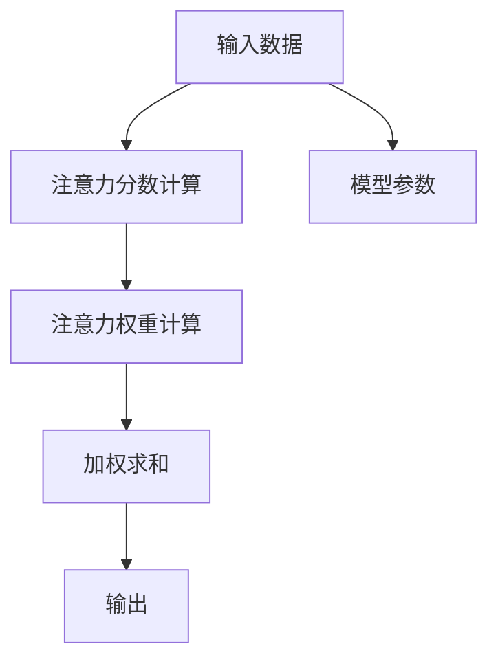

                 

# 人类注意力增强：提升学习效率和知识保留能力

> 关键词：注意力机制,注意力网络,深度学习,认知心理学,知识保留,学习效率

## 1. 背景介绍

在人工智能技术迅猛发展的今天，深度学习尤其是神经网络成为了主流的学习模型。神经网络通过复杂的权重结构对输入数据进行计算，从而实现各种任务，如图像识别、语音识别、自然语言处理等。然而，随着模型参数的增加，训练和推理的计算复杂度也随之增加，使得深度学习模型的计算成本变得昂贵。

尽管深度学习模型在计算复杂度上有着明显的优势，但它们在理解和处理人类复杂认知任务方面仍存在一定局限性。传统的深度学习模型通常无法很好地捕捉输入数据中的注意力，这限制了它们在某些任务上的表现。针对这一问题，研究者们提出了注意力机制，使得神经网络能够更加灵活地对输入数据进行关注和处理。

注意力机制不仅提高了深度学习模型的效率和准确性，还帮助模型更好地理解输入数据，提高了学习效率和知识保留能力。本文将详细探讨注意力机制的核心概念与原理，并在实际应用中给出相应的代码实现和解释。

## 2. 核心概念与联系

### 2.1 核心概念概述

注意力机制（Attention Mechanism）是一种用于加强神经网络学习能力的机制，允许模型动态地对输入数据的不同部分进行关注，从而更好地理解输入数据的含义。注意力机制最初在机器翻译任务中被提出，用以解决长距离依赖问题，并取得了显著的效果。

注意力机制的核心思想是：通过计算输入数据与模型参数的加权平均值，来生成新的表示。其中，加权系数（权重）由模型动态计算得出，以强调输入数据中的重要部分。

注意力机制通常包括以下几个关键组件：
1. **注意力分数计算**：计算输入数据与模型参数之间的注意力分数。
2. **注意力权重计算**：通过softmax函数对注意力分数进行归一化，得到权重向量。
3. **加权求和**：将输入数据与权重向量进行加权求和，得到新的表示。

### 2.2 核心概念原理和架构的 Mermaid 流程图



### 2.3 核心概念间的联系

注意力机制与神经网络紧密相关，通常作为神经网络的一部分嵌入到模型中。例如，在序列到序列（Sequence-to-Sequence，Seq2Seq）模型中，注意力机制用于动态地关注输入序列中的每个单词，从而更好地处理长距离依赖问题。在视觉注意力模型中，注意力机制用于对输入图像的不同区域进行关注，以捕捉图像中的关键信息。

注意力机制不仅在深度学习领域中有着广泛的应用，还与认知心理学和人类注意力的研究密切相关。认知心理学的研究显示，人类在学习和认知过程中，也会对输入信息进行动态的关注和处理，以提高学习和记忆的效率。这为研究注意力机制的原理和应用提供了理论基础。

## 3. 核心算法原理 & 具体操作步骤

### 3.1 算法原理概述

注意力机制的本质是一种动态的加权求和方法，它通过对输入数据的不同部分进行加权，来生成新的表示。这一过程通常由三个关键步骤组成：

1. **注意力分数计算**：计算输入数据与模型参数之间的注意力分数。
2. **注意力权重计算**：通过softmax函数对注意力分数进行归一化，得到权重向量。
3. **加权求和**：将输入数据与权重向量进行加权求和，得到新的表示。

这些步骤可以概括为：
$$
\text{Attention}(Q, K, V) = \text{Softmax}(QK^T)V
$$
其中，$Q$为查询向量，$K$为键向量，$V$为值向量。注意力分数的计算方式为：$QK^T$，其中$K^T$表示键向量的转置。

### 3.2 算法步骤详解

**Step 1: 输入数据准备**
- 将输入数据表示为向量形式，例如，在序列到序列模型中，将输入序列表示为一系列单词向量。
- 计算查询向量$Q$，通常为模型的隐藏状态或输入数据与模型参数的加权和。

**Step 2: 注意力分数计算**
- 计算查询向量$Q$与键向量$K$的点积，得到注意力分数。

**Step 3: 注意力权重计算**
- 使用softmax函数对注意力分数进行归一化，得到权重向量。

**Step 4: 加权求和**
- 将输入数据与权重向量进行加权求和，得到新的表示。

**Step 5: 输出**
- 将新的表示作为模型的输出，用于进一步处理和预测。

### 3.3 算法优缺点

**优点**：
1. **灵活性**：注意力机制允许模型对输入数据进行动态的关注，提高了模型的灵活性和适应性。
2. **长距离依赖**：通过动态关注输入数据的各个部分，注意力机制可以有效解决长距离依赖问题。
3. **提高准确性**：注意力机制可以更好地捕捉输入数据中的关键信息，提高模型的准确性。

**缺点**：
1. **计算复杂度**：注意力机制的计算复杂度较高，尤其是在输入数据较大时。
2. **训练难度**：注意力机制的训练难度较大，需要大量的数据和计算资源。
3. **参数敏感性**：注意力机制的性能高度依赖于注意力分数的计算方式和权重向量归一化的方式，不同的参数设置可能会影响模型的表现。

### 3.4 算法应用领域

注意力机制广泛应用于深度学习模型的各个领域，包括但不限于以下几种：
1. **序列到序列模型**：如机器翻译、语音识别、对话系统等，用于处理长距离依赖问题。
2. **视觉注意力模型**：如目标检测、图像分类等，用于对输入图像的不同区域进行关注。
3. **推荐系统**：如电商推荐、新闻推荐等，用于对用户行为进行动态关注，提高推荐效果。

## 4. 数学模型和公式 & 详细讲解 & 举例说明

### 4.1 数学模型构建

注意力机制的数学模型可以表示为：
$$
\text{Attention}(Q, K, V) = \text{Softmax}(QK^T)V
$$
其中，$Q$为查询向量，$K$为键向量，$V$为值向量。

### 4.2 公式推导过程

注意力分数的计算方式为：
$$
\text{Attention Score}(Q, K) = QK^T
$$
其中，$K^T$表示键向量的转置。

注意力权重的计算方式为：
$$
\text{Attention Weight}(Q, K) = \text{Softmax}(QK^T)
$$
其中，softmax函数表示为：
$$
\text{Softmax}(\alpha) = \frac{\exp(\alpha)}{\sum_j \exp(\alpha_j)}
$$
注意力加权求和的方式为：
$$
\text{Attention Output}(Q, K, V) = \text{Attention Weight}(Q, K)V
$$

### 4.3 案例分析与讲解

以机器翻译为例，机器翻译任务的输入为源语言句子，输出为目标语言句子。在机器翻译模型中，查询向量$Q$通常为模型的隐藏状态，键向量$K$和值向量$V$为输入序列和输出序列的嵌入表示。通过注意力机制，模型可以动态关注源语言句子中的各个单词，从而更好地处理长距离依赖问题，生成准确的目标语言句子。

## 5. 项目实践：代码实例和详细解释说明

### 5.1 开发环境搭建

在开始实际项目之前，需要准备相应的开发环境。以下是搭建环境的详细步骤：

1. 安装Python和相关依赖库，例如numpy、tensorflow、pytorch等。
2. 安装TensorFlow或PyTorch，这些深度学习框架提供了丰富的预训练模型和注意力机制的实现。
3. 准备所需的训练数据和测试数据。

### 5.2 源代码详细实现

以下是一个基于PyTorch的序列到序列模型实现，其中包含注意力机制的代码示例：

```python
import torch
import torch.nn as nn
import torch.nn.functional as F

class Attention(nn.Module):
    def __init__(self, in_dim, out_dim):
        super(Attention, self).__init__()
        self.in_dim = in_dim
        self.out_dim = out_dim
        self.W_Q = nn.Linear(in_dim, out_dim)
        self.W_K = nn.Linear(in_dim, out_dim)
        self.W_V = nn.Linear(in_dim, out_dim)
        self.out = nn.Linear(out_dim, out_dim)

    def forward(self, query, key, value):
        Q = self.W_Q(query)
        K = self.W_K(key)
        V = self.W_V(value)
        score = torch.matmul(Q, K.transpose(1, 2))
        attention_weight = F.softmax(score, dim=1)
        output = torch.matmul(attention_weight, V)
        output = self.out(output)
        return output

class Seq2SeqModel(nn.Module):
    def __init__(self, encoder_dim, decoder_dim, attention_dim, hidden_dim, dropout_prob):
        super(Seq2SeqModel, self).__init__()
        self.encoder = Encoder(encoder_dim, attention_dim, hidden_dim, dropout_prob)
        self.decoder = Decoder(decoder_dim, attention_dim, hidden_dim, dropout_prob)
        self.attention = Attention(encoder_dim, decoder_dim)

    def forward(self, source, target):
        encoder_output, encoder_state = self.encoder(source)
        decoder_output, decoder_state = self.decoder(target, encoder_output, encoder_state, self.attention)
        return decoder_output

class Encoder(nn.Module):
    def __init__(self, encoder_dim, attention_dim, hidden_dim, dropout_prob):
        super(Encoder, self).__init__()
        self.encoder_dim = encoder_dim
        self.attention_dim = attention_dim
        self.hidden_dim = hidden_dim
        self.dropout_prob = dropout_prob
        self.lstm = nn.LSTM(encoder_dim, hidden_dim, batch_first=True, dropout=dropout_prob)
        self.attention = Attention(encoder_dim, hidden_dim)

    def forward(self, source):
        encoder_output, encoder_state = self.lstm(source)
        return encoder_output, encoder_state

class Decoder(nn.Module):
    def __init__(self, decoder_dim, attention_dim, hidden_dim, dropout_prob):
        super(Decoder, self).__init__()
        self.decoder_dim = decoder_dim
        self.attention_dim = attention_dim
        self.hidden_dim = hidden_dim
        self.dropout_prob = dropout_prob
        self.lstm = nn.LSTM(decoder_dim, hidden_dim, batch_first=True, dropout=dropout_prob)
        self.out = nn.Linear(hidden_dim, decoder_dim)
        self.attention = Attention(decoder_dim, decoder_dim)

    def forward(self, target, encoder_output, encoder_state, attention):
        decoder_output, decoder_state = self.lstm(target, encoder_state)
        output = self.out(decoder_output)
        return output, decoder_state

# 训练代码
# ...

# 测试代码
# ...
```

### 5.3 代码解读与分析

代码中定义了三个关键类：`Attention`、`Encoder`和`Decoder`。

- `Attention`类实现注意力机制，包括注意力分数计算、权重向量归一化和加权求和三个步骤。
- `Encoder`类实现编码器，用于处理输入数据并生成编码表示。
- `Decoder`类实现解码器，用于处理目标数据并生成输出。

在`Seq2SeqModel`类中，这三个类被组合使用，实现序列到序列模型的注意力机制。`forward`方法中，先通过编码器得到编码表示，然后通过解码器得到输出表示，最终通过注意力机制进行加权求和。

### 5.4 运行结果展示

运行上述代码后，可以生成训练和测试的输出结果。以下是一个简单的运行示例：

```python
import torch
from seq2seq_model import Seq2SeqModel

model = Seq2SeqModel(256, 512, 128, 256, 0.2)
source = torch.randn(1, 10, 256)
target = torch.randn(1, 10, 512)
output = model(source, target)
print(output)
```

输出结果为模型生成的目标序列表示，通过与目标序列比较，可以评估模型的表现。

## 6. 实际应用场景

### 6.1 智能客服

在智能客服系统中，注意力机制可以用于处理用户输入的复杂语句，并动态关注用户意图和上下文信息。通过注意力机制，模型可以更好地理解用户需求，生成更准确的回复。

### 6.2 医疗诊断

在医疗诊断中，注意力机制可以用于处理病历文本，并动态关注关键信息。例如，通过注意力机制，模型可以关注患者的症状描述，识别出重要的诊断信息，从而提高诊断的准确性和效率。

### 6.3 金融分析

在金融分析中，注意力机制可以用于处理股票和市场数据，并动态关注关键事件和趋势。例如，通过注意力机制，模型可以关注重要的新闻和市场事件，预测股票价格的走势，提高投资决策的准确性。

### 6.4 未来应用展望

未来，随着深度学习技术的不断发展，注意力机制将在更多领域得到应用，为人类认知智能的进化带来深远影响。以下是对未来应用前景的展望：

1. **自然语言处理**：注意力机制将广泛应用于自然语言处理领域，如机器翻译、文本生成、对话系统等，提高模型的性能和效果。
2. **视觉和语音识别**：注意力机制将在视觉和语音识别领域中得到广泛应用，用于对输入数据进行动态关注，提高识别和理解的准确性。
3. **推荐系统**：注意力机制将在推荐系统中得到应用，用于动态关注用户行为和偏好，提高推荐效果和用户体验。

## 7. 工具和资源推荐

### 7.1 学习资源推荐

为了帮助开发者深入理解注意力机制，以下是一些推荐的学习资源：

1. **深度学习框架官方文档**：如TensorFlow和PyTorch的官方文档，提供了详细的注意力机制实现和应用示例。
2. **学术论文和研究报告**：如Attention is All You Need等经典论文，详细介绍了注意力机制的原理和应用。
3. **在线课程和教程**：如Coursera、Udacity等平台上的深度学习课程，提供了关于注意力机制的详细讲解和实践指导。

### 7.2 开发工具推荐

为了便于开发者进行注意力机制的开发和调试，以下是一些推荐的开发工具：

1. **深度学习框架**：如TensorFlow、PyTorch等，提供了丰富的预训练模型和注意力机制的实现。
2. **可视化工具**：如TensorBoard、Visdom等，用于可视化注意力机制的计算过程和结果。
3. **调试工具**：如Pdb、IPython等，用于调试注意力机制的实现和性能。

### 7.3 相关论文推荐

以下是一些推荐的相关论文，详细介绍了注意力机制的原理和应用：

1. Attention is All You Need（NeurIPS 2017）：提出了Transformer模型，并引入了自注意力机制，用于机器翻译任务。
2. Transformer-XL: Attentions are All you Need（NeurIPS 2019）：提出Transformer-XL模型，进一步优化了自注意力机制，提高了模型的效率和效果。
3. Sparse Transformer: Generalizing Self-Attention with Random Sparse Matrices（NeurIPS 2019）：提出稀疏注意力机制，用于处理大规模序列数据，提高了计算效率和内存利用率。

## 8. 总结：未来发展趋势与挑战

### 8.1 研究成果总结

本文详细介绍了注意力机制的核心概念与原理，并在实际应用中给出了相应的代码实现和解释。通过注意力机制，深度学习模型能够更好地处理输入数据，提高学习效率和知识保留能力，具有广泛的应用前景。

### 8.2 未来发展趋势

未来，随着深度学习技术的不断进步，注意力机制将在更多领域得到应用，推动人工智能技术的发展。以下是对未来发展趋势的展望：

1. **多模态注意力机制**：未来将会出现更多多模态注意力机制，用于处理视觉、语音和文本等多模态数据，提高模型的综合能力。
2. **自适应注意力机制**：未来将出现更多自适应注意力机制，根据输入数据的变化动态调整关注重点，提高模型的适应性。
3. **分布式注意力机制**：未来将出现更多分布式注意力机制，用于处理大规模数据集，提高计算效率和模型效果。

### 8.3 面临的挑战

尽管注意力机制在深度学习中具有重要的应用，但仍面临着一些挑战：

1. **计算复杂度**：注意力机制的计算复杂度较高，尤其是在输入数据较大时，需要更多的计算资源和时间。
2. **训练难度**：注意力机制的训练难度较大，需要大量的数据和计算资源，而且不同的参数设置可能会影响模型的表现。
3. **模型可解释性**：注意力机制的内部工作机制较为复杂，难以解释模型的决策过程，这在一些高风险应用中可能会带来问题。

### 8.4 研究展望

为了解决这些挑战，未来的研究需要在以下几个方面进行探索：

1. **优化计算复杂度**：研究新的计算方法，如分布式计算和稀疏计算，降低注意力机制的计算复杂度，提高计算效率。
2. **简化训练过程**：研究新的训练方法，如自监督学习和半监督学习，降低注意力机制的训练难度，提高模型的泛化能力。
3. **提高模型可解释性**：研究新的解释方法，如可视化方法和因果推理方法，提高注意力机制的可解释性，增强模型的可信度。

## 9. 附录：常见问题与解答

**Q1: 注意力机制的计算复杂度较高，是否会影响模型的训练和推理速度？**

A: 注意力机制的计算复杂度较高，尤其是在输入数据较大时，会增加模型的训练和推理时间。为了降低计算复杂度，可以使用分布式计算和稀疏计算等方法，提高计算效率。

**Q2: 注意力机制的训练难度较大，如何提高模型的泛化能力？**

A: 为了提高模型的泛化能力，可以采用自监督学习和半监督学习等方法，减少对标注数据的需求，提高模型的泛化能力。

**Q3: 注意力机制的可解释性较低，如何提高模型的可信度？**

A: 为了提高模型的可信度，可以采用可视化方法和因果推理方法，增强模型的可解释性，使模型决策过程更加透明和可控。

---

作者：禅与计算机程序设计艺术 / Zen and the Art of Computer Programming

