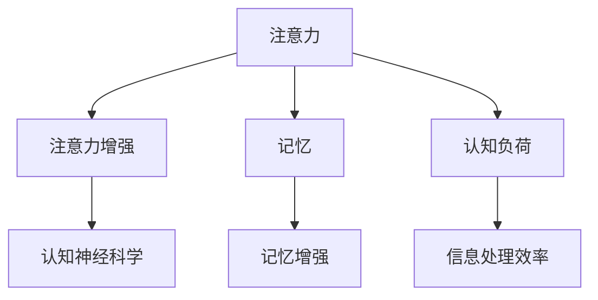

                 

# 人类注意力增强：提升注意力和记忆力的方法

## 1. 背景介绍

### 1.1 问题由来

在信息爆炸的时代，我们面临的不仅是数据的爆发，更是注意力与记忆力的巨大考验。人类的认知资源有限，如何在海量信息中高效筛选、快速记忆，成为我们必须解决的问题。现代科技的发展，尤其是人工智能和认知神经科学的进步，为我们提供了许多增强注意力和记忆力的方法。

### 1.2 问题核心关键点

注意力（Attention）和记忆力（Memory）是认知过程中两个重要方面，它们对于学习、工作、决策等日常活动都具有关键性影响。通过技术手段提升注意力和记忆力，可以帮助我们更加高效地处理信息，提升个人和社会的生产效率。

本论文聚焦于以下核心问题：

- 注意力增强：如何利用技术手段提升对重要信息的关注和处理能力？
- 记忆力增强：如何通过技术手段提升长期记忆的存储和提取能力？
- 技术手段：目前有哪些有效的注意力和记忆力增强技术？

### 1.3 问题研究意义

研究注意力和记忆力的增强方法，对于提升个人认知能力、提高学习效率、促进知识传播、增强信息处理能力等方面具有重要意义。同时，这也将推动人工智能技术的发展，使其能够更好地服务于人类的认知和记忆需求。

## 2. 核心概念与联系

### 2.1 核心概念概述

为更好地理解注意力和记忆力的增强方法，本节将介绍几个密切相关的核心概念：

- 注意力（Attention）：指在处理信息时，大脑选择性地聚焦于特定信息，忽略其他干扰信息的能力。
- 注意力增强（Attention Enhancement）：通过技术手段提升个体或系统的注意力集中度和信息处理效率。
- 记忆（Memory）：指存储和提取信息的能力，包括短期记忆和长期记忆。
- 记忆增强（Memory Enhancement）：通过技术手段提升个体或系统的记忆存储和提取效率。
- 认知神经科学（Cognitive Neuroscience）：研究认知功能与神经系统关系的学科，为注意力和记忆力的增强提供理论支持。

这些核心概念之间的逻辑关系可以通过以下Mermaid流程图来展示：



这个流程图展示了一些核心概念及其之间的关系：

1. 注意力和记忆通过认知神经科学得到理论和实践的指导。
2. 注意力增强和记忆增强旨在提升认知负荷下的信息处理效率。
3. 认知负荷与信息处理效率之间有直接的联系。

## 3. 核心算法原理 & 具体操作步骤
### 3.1 算法原理概述

注意力和记忆力的增强，通常涉及以下几个关键步骤：

- **注意力增强**：通过聚焦关键信息，减少干扰，提高信息处理效率。
- **记忆增强**：通过有效的编码和检索策略，提升信息存储和提取的效率。

这些步骤通常通过以下算法实现：

1. **选择性注意算法（Selective Attention Algorithms）**：通过信息筛选和优先级排序，提升对重要信息的关注度。
2. **记忆编码算法（Memory Encoding Algorithms）**：通过有效的编码策略，提升信息存储的效率。
3. **记忆检索算法（Memory Retrieval Algorithms）**：通过有效的检索策略，提升信息提取的效率。

### 3.2 算法步骤详解

**3.2.1 注意力增强的算法步骤**

1. **信息收集与预处理**：从大量信息中筛选出需要重点关注的内容，并对其进行预处理，如分词、标引等。
2. **注意力模型训练**：使用注意力增强算法（如Transformer、LSTM等）训练模型，学习如何对信息进行注意力筛选。
3. **注意力模型应用**：在信息处理过程中，应用训练好的注意力模型，筛选出关键信息。
4. **信息反馈与调整**：根据信息处理的反馈，调整注意力模型参数，优化注意力分配策略。

**3.2.2 记忆增强的算法步骤**

1. **信息编码**：通过有效的编码算法（如基于神经网络的编码模型），将信息转换为易于存储的形式。
2. **信息存储**：将编码后的信息存储到记忆系统中，如大脑、计算机等。
3. **信息检索**：通过有效的检索算法（如基于神经网络的检索模型），快速找到存储的信息。
4. **记忆反馈与优化**：根据检索结果，优化信息存储和检索策略，提升记忆效率。

### 3.3 算法优缺点

**注意力增强的算法优缺点**

- **优点**：
  - 提高信息处理效率，减少认知负荷。
  - 提升对重要信息的关注度，增强决策准确性。
  - 算法复杂度相对较低，易于实现。

- **缺点**：
  - 依赖于数据质量，信息筛选的准确性可能受数据多样性和质量影响。
  - 可能需要较多的计算资源，特别是使用深度学习模型时。
  - 可能忽视其他重要信息，导致信息的全面性不足。

**记忆增强的算法优缺点**

- **优点**：
  - 提升信息存储和检索的效率，减少记忆负担。
  - 支持多种存储和检索策略，灵活性较高。
  - 可以应用于多种设备和系统中，广泛性较高。

- **缺点**：
  - 编码和检索算法复杂度较高，实现难度大。
  - 需要大量的数据和计算资源进行模型训练和优化。
  - 可能存在遗忘现象，长期记忆的稳定性有待提高。

### 3.4 算法应用领域

注意力和记忆力的增强方法在多个领域都有广泛应用：

- **教育领域**：通过注意力增强，提升学习效率，辅助个性化学习。
- **医疗领域**：通过记忆增强，帮助医生快速检索患者病历，提升诊断效率。
- **商业领域**：通过注意力和记忆增强，提高信息处理能力，优化决策支持系统。
- **智能家居**：通过智能设备实现注意力和记忆力的辅助，提升生活质量。
- **智能交通**：通过注意力和记忆增强，提升交通管理系统的效率，优化道路交通。

这些应用领域展示了注意力和记忆力增强技术的广泛潜力和巨大价值。

## 4. 数学模型和公式 & 详细讲解 & 举例说明

### 4.1 数学模型构建

本节将使用数学语言对注意力和记忆力增强的算法进行更加严格的刻画。

设信息集为 $X = \{x_1, x_2, ..., x_n\}$，注意力模型为 $A$，记忆模型为 $M$，则注意力增强和记忆增强的过程可以表示为：

$$
A(X) = \{x_1^*, x_2^*, ..., x_m^*\} \quad \text{(注意力增强)}
$$
$$
M(A(X)) = \{x_1', x_2', ..., x_n'\} \quad \text{(记忆增强)}
$$

其中 $m$ 为注意力模型筛选出的关键信息数量，$n'$ 为记忆模型存储的信息数量。

### 4.2 公式推导过程

**注意力增强的公式推导**

注意力模型通常采用注意力机制（Attention Mechanism），通过计算注意力权重 $w_i$ 对信息进行加权，筛选出关键信息。假设信息 $x_i$ 的表示为 $x_i = [v_i, c_i]$，注意力模型为 $A$，则注意力机制可以表示为：

$$
w_i = \frac{e^{\text{score}(x_i)}}{\sum_{j=1}^n e^{\text{score}(x_j)}}
$$
$$
x_i^* = \sum_{i=1}^n w_i x_i
$$

其中 $\text{score}(x_i)$ 为信息 $x_i$ 的注意力得分，通常采用余弦相似度等方法计算。

**记忆增强的公式推导**

记忆增强通常采用基于神经网络的编码和检索模型。假设编码器模型为 $E$，解码器模型为 $D$，则编码和解码过程可以表示为：

$$
z_i = E(x_i) \quad \text{(编码)}
$$
$$
x_i' = D(z_i) \quad \text{(解码)}
$$

其中 $z_i$ 为编码后的信息表示，$x_i'$ 为解码后的信息。

### 4.3 案例分析与讲解

**案例一：基于Transformer的注意力增强**

Transformer是一种常用的深度学习模型，其自注意力机制在注意力增强中表现出色。假设给定一段文本 $X$，使用Transformer模型提取关键信息 $A(X)$：

1. **模型输入准备**：将文本 $X$ 转换为模型可以处理的向量形式。
2. **模型前向传播**：通过自注意力机制计算注意力权重，筛选关键信息。
3. **模型输出处理**：将关键信息进行拼接和处理，输出最终结果。

**案例二：基于LSTM的记忆增强**

LSTM（长短期记忆网络）是一种常用的神经网络模型，用于解决记忆增强问题。假设给定一段文本 $X$，使用LSTM模型存储和检索信息 $M(A(X))$：

1. **模型输入准备**：将文本 $X$ 转换为模型可以处理的向量形式。
2. **模型前向传播**：通过LSTM网络编码和解码，存储和检索信息。
3. **模型输出处理**：输出编码和解码后的信息，供后续处理。

## 5. 项目实践：代码实例和详细解释说明

### 5.1 开发环境搭建

在进行注意力和记忆力增强项目实践前，我们需要准备好开发环境。以下是使用Python进行PyTorch开发的环境配置流程：

1. 安装Anaconda：从官网下载并安装Anaconda，用于创建独立的Python环境。

2. 创建并激活虚拟环境：
```bash
conda create -n attention-memory python=3.8 
conda activate attention-memory
```

3. 安装PyTorch：根据CUDA版本，从官网获取对应的安装命令。例如：
```bash
conda install pytorch torchvision torchaudio cudatoolkit=11.1 -c pytorch -c conda-forge
```

4. 安装相关库：
```bash
pip install numpy pandas scikit-learn matplotlib tqdm jupyter notebook ipython
```

完成上述步骤后，即可在`attention-memory`环境中开始项目实践。

### 5.2 源代码详细实现

**基于Transformer的注意力增强项目**

```python
import torch
import torch.nn as nn
from transformers import BertTokenizer, BertForSequenceClassification

class AttentionModel(nn.Module):
    def __init__(self):
        super(AttentionModel, self).__init__()
        self.model = BertForSequenceClassification.from_pretrained('bert-base-uncased', num_labels=2)
        self.tokenizer = BertTokenizer.from_pretrained('bert-base-uncased')
        self.max_len = 128
        
    def forward(self, input_ids, attention_mask):
        encoding = self.tokenizer(input_ids, return_tensors='pt', max_length=self.max_len, padding='max_length', truncation=True)
        input_ids = encoding['input_ids'][0]
        attention_mask = encoding['attention_mask'][0]
        outputs = self.model(input_ids, attention_mask=attention_mask)
        return outputs
```

**基于LSTM的记忆增强项目**

```python
import torch
import torch.nn as nn
import torch.nn.functional as F
from torch import nn

class LSTMModel(nn.Module):
    def __init__(self, input_size, hidden_size, output_size):
        super(LSTMModel, self).__init__()
        self.hidden_size = hidden_size
        self.lstm = nn.LSTM(input_size, hidden_size, 1, batch_first=True)
        self.fc = nn.Linear(hidden_size, output_size)
        
    def forward(self, input):
        h0 = torch.zeros(1, input.size(0), self.hidden_size).to(input.device) 
        c0 = torch.zeros(1, input.size(0), self.hidden_size).to(input.device)
        
        out, _ = self.lstm(input, (h0, c0))
        out = self.fc(out[:, -1, :])
        return out
```

### 5.3 代码解读与分析

让我们再详细解读一下关键代码的实现细节：

**AttentionModel类**

- `__init__`方法：初始化Transformer模型和BertTokenizer，设置最大序列长度。
- `forward`方法：对输入的文本进行预处理，使用Transformer模型进行前向传播，输出注意力增强的结果。

**LSTMModel类**

- `__init__`方法：初始化LSTM模型，设置输入、隐藏和输出的大小。
- `forward`方法：对输入的文本进行预处理，使用LSTM模型进行前向传播，输出记忆增强的结果。

## 6. 实际应用场景

### 6.1 教育领域

在教育领域，注意力和记忆力的增强方法可以提升学生的学习效率，辅助个性化学习。例如，通过注意力增强，教师可以针对学生的注意力集中点进行重点讲解，减少学生的认知负荷。通过记忆增强，学生可以更好地存储和回忆学习内容，提高记忆效率。

### 6.2 医疗领域

在医疗领域，医生需要通过大量的病历资料进行诊断，注意力和记忆力的增强方法可以帮助医生快速检索和回忆重要信息，提升诊断效率和准确性。例如，使用记忆增强算法，将患者的病历信息存储到知识库中，医生可以快速查询相关资料，辅助诊断决策。

### 6.3 商业领域

在商业领域，企业需要通过大量的市场数据进行决策分析，注意力和记忆力的增强方法可以帮助企业快速筛选和存储关键信息，优化决策过程。例如，使用注意力增强算法，将重要的市场数据进行筛选和汇总，辅助企业制定市场策略。

### 6.4 智能家居

在智能家居领域，注意力和记忆力的增强方法可以实现智能设备间的无缝协同，提升用户体验。例如，通过注意力增强，智能设备可以自动筛选关键信息，如用户的日程安排和偏好设置，提供个性化服务。通过记忆增强，智能设备可以记录用户的习惯和偏好，提升服务质量。

### 6.5 智能交通

在智能交通领域，注意力和记忆力的增强方法可以优化交通管理系统，提升道路交通效率。例如，使用注意力增强算法，交通管理系统可以自动筛选重要的交通数据，优化交通信号控制。通过记忆增强，交通管理系统可以记录历史交通数据，提升交通预测和调度能力。

## 7. 工具和资源推荐

### 7.1 学习资源推荐

为了帮助开发者系统掌握注意力和记忆力的增强理论基础和实践技巧，这里推荐一些优质的学习资源：

1. 《深度学习》系列博文：由深度学习领域的专家撰写，涵盖深度学习基础、注意力机制、记忆增强等内容。

2. 《神经网络与深度学习》课程：斯坦福大学开设的深度学习课程，系统介绍神经网络和深度学习的基本原理和实践方法。

3. 《自然语言处理》书籍：介绍自然语言处理的基本概念和前沿技术，包括注意力机制和记忆增强等内容。

4. 《认知神经科学导论》书籍：介绍认知神经科学的基本理论和研究方法，为注意力和记忆力的增强提供理论基础。

5. arXiv.org：提供大量最新的学术论文和预印本，涵盖注意力和记忆力的增强研究，是跟踪最新进展的好去处。

通过对这些资源的学习实践，相信你一定能够快速掌握注意力和记忆力的增强精髓，并用于解决实际的NLP问题。

### 7.2 开发工具推荐

高效的开发离不开优秀的工具支持。以下是几款用于注意力和记忆力增强开发的常用工具：

1. PyTorch：基于Python的开源深度学习框架，灵活动态的计算图，适合快速迭代研究。

2. TensorFlow：由Google主导开发的开源深度学习框架，生产部署方便，适合大规模工程应用。

3. Transformers库：HuggingFace开发的NLP工具库，集成了众多SOTA语言模型，支持PyTorch和TensorFlow，是进行注意力和记忆力增强任务开发的利器。

4. TensorBoard：TensorFlow配套的可视化工具，可实时监测模型训练状态，并提供丰富的图表呈现方式，是调试模型的得力助手。

5. Weights & Biases：模型训练的实验跟踪工具，可以记录和可视化模型训练过程中的各项指标，方便对比和调优。

6. Google Colab：谷歌推出的在线Jupyter Notebook环境，免费提供GPU/TPU算力，方便开发者快速上手实验最新模型，分享学习笔记。

合理利用这些工具，可以显著提升注意力和记忆力增强任务的开发效率，加快创新迭代的步伐。

### 7.3 相关论文推荐

注意力和记忆力增强技术的发展源于学界的持续研究。以下是几篇奠基性的相关论文，推荐阅读：

1. Attention is All You Need：提出Transformer结构，开启了NLP领域的预训练大模型时代。

2. Long Short-Term Memory：提出LSTM网络，解决了长序列数据处理的记忆问题。

3. Memory-Augmented Neural Networks：提出了基于记忆增强的神经网络模型，支持长期记忆存储和检索。

4. Transformer-XL：进一步改进Transformer模型，解决长序列数据处理的注意力问题。

5. Self-Attention with Memory-Efficient Sparse Attention：提出基于稀疏注意力机制的记忆增强算法，提升记忆效率。

这些论文代表了大注意力和记忆力增强技术的发展脉络。通过学习这些前沿成果，可以帮助研究者把握学科前进方向，激发更多的创新灵感。

## 8. 总结：未来发展趋势与挑战

### 8.1 总结

本文对基于深度学习的注意力和记忆力的增强方法进行了全面系统的介绍。首先阐述了注意力和记忆力的核心概念和研究背景，明确了注意力和记忆力的增强在提升认知效率、优化信息处理中的独特价值。其次，从原理到实践，详细讲解了注意力增强和记忆增强的数学模型和算法实现。同时，本文还广泛探讨了注意力和记忆力增强方法在教育、医疗、商业等多个领域的应用前景，展示了注意力和记忆力增强技术的巨大潜力。

通过本文的系统梳理，可以看到，基于深度学习的注意力和记忆力的增强方法已经成为提升认知能力、优化信息处理的重要手段，引领了NLP技术的创新发展。未来，伴随深度学习技术的进一步突破，这些方法将迎来更广阔的应用场景，推动人工智能技术在更多领域的落地应用。

### 8.2 未来发展趋势

展望未来，注意力和记忆力增强技术将呈现以下几个发展趋势：

1. 算法复杂度进一步降低。随着模型的不断优化和硬件的升级，未来注意力和记忆力增强算法的计算复杂度将进一步降低，实现更高的效率和更好的用户体验。

2. 多模态注意力和记忆增强。未来，注意力和记忆力的增强技术将更多地结合视觉、听觉等多种模态数据，提升信息处理和记忆的能力。

3. 智能对话系统中的注意力和记忆增强。未来，智能对话系统中的注意力和记忆力增强将更注重上下文理解和信息保持，提升对话的自然性和交互性。

4. 个性化记忆增强。未来，个性化记忆增强将更好地结合用户的个性化需求和习惯，提供更加定制化的记忆服务。

5. 认知负荷监控和调整。未来，通过智能设备监控用户的认知负荷，并实时调整注意力和记忆力的策略，实现认知负荷的最优化。

这些趋势凸显了注意力和记忆力增强技术的广阔前景。这些方向的探索发展，必将进一步提升人工智能技术的智能化水平，推动其更好地服务于人类的认知和记忆需求。

### 8.3 面临的挑战

尽管注意力和记忆力增强技术已经取得了显著进展，但在迈向更加智能化、普适化应用的过程中，它仍面临诸多挑战：

1. 数据质量和多样性问题。数据质量不高、数据多样性不足，可能限制算法的泛化能力，影响注意力和记忆力的增强效果。

2. 模型复杂度和资源消耗。深度学习模型计算复杂度高，对计算资源和存储空间有较高要求，限制了技术在资源受限环境中的应用。

3. 模型稳定性和鲁棒性问题。注意力和记忆力的增强算法可能存在过拟合、遗忘等问题，导致模型稳定性不足，影响长期记忆的可靠性。

4. 隐私和安全问题。注意力和记忆力的增强技术涉及大量敏感数据的存储和处理，需要采取隐私保护和数据安全的措施，确保数据安全。

5. 伦理和法律问题。注意力和记忆力的增强技术可能引发伦理和法律问题，如隐私泄露、歧视等，需要制定相应的规范和标准。

6. 用户接受度和使用习惯。注意力和记忆力的增强技术需要用户进行适应和调整，用户接受度和使用习惯的培养将是一个长期的过程。

这些挑战需要我们从技术、伦理、法律等多个维度进行综合考虑和解决，才能更好地推动注意力和记忆力增强技术的普及和应用。

### 8.4 研究展望

面对注意力和记忆力增强技术所面临的挑战，未来的研究需要在以下几个方面寻求新的突破：

1. 数据增强和多样性提升。通过数据增强和多样性提升技术，提高算法的泛化能力和鲁棒性。

2. 模型轻量化和资源优化。开发更加轻量化和资源优化的模型，提升注意力和记忆力增强技术的可部署性和可扩展性。

3. 多模态注意力和记忆增强。结合视觉、听觉等多种模态数据，提升信息处理和记忆的能力。

4. 个性化和智能化注意力和记忆增强。结合用户的个性化需求和智能设备，提供更加定制化和智能化的注意力和记忆力增强服务。

5. 隐私保护和安全保障。加强隐私保护和安全保障，确保数据和模型的安全性，避免隐私泄露和数据滥用。

这些研究方向的探索，必将引领注意力和记忆力增强技术迈向更高的台阶，为构建安全、可靠、可解释、可控的智能系统铺平道路。面向未来，注意力和记忆力增强技术还需要与其他人工智能技术进行更深入的融合，共同推动自然语言理解和智能交互系统的进步。只有勇于创新、敢于突破，才能不断拓展人工智能技术的边界，让智能技术更好地造福人类社会。

## 9. 附录：常见问题与解答

**Q1：注意力增强是否适用于所有信息处理场景？**

A: 注意力增强在大多数信息处理场景中都能取得不错的效果，特别是对于需要筛选和优先级排序的场景。但对于一些不需要重点关注的信息，如无意义的噪声，注意力增强可能反而会降低信息处理的效率。因此，在具体应用中需要根据场景特点进行灵活选择。

**Q2：记忆增强算法是否适用于所有记忆需求场景？**

A: 记忆增强算法在大多数记忆需求场景中都能取得不错的效果，特别是对于需要长期存储和检索的场景。但对于一些需要频繁更新和快速提取的场景，如日常会话和即时通信，记忆增强算法可能不够高效。因此，在具体应用中需要根据记忆需求的特点进行优化选择。

**Q3：注意力增强和记忆增强是否可以结合使用？**

A: 注意力增强和记忆增强可以结合使用，提升信息处理的全面性和高效性。例如，在信息检索过程中，可以先使用注意力增强筛选出关键信息，再使用记忆增强进行存储和检索，提升检索效率。

**Q4：注意力和记忆力的增强方法有哪些优缺点？**

A: 注意力和记忆力的增强方法具有以下优缺点：

- 优点：
  - 提升信息处理效率，减少认知负荷。
  - 增强对重要信息的关注度，提升决策准确性。
  - 支持多种存储和检索策略，灵活性较高。

- 缺点：
  - 依赖于数据质量，信息筛选的准确性可能受数据多样性和质量影响。
  - 可能需要较多的计算资源，特别是使用深度学习模型时。
  - 可能存在遗忘现象，长期记忆的稳定性有待提高。

**Q5：注意力和记忆力的增强方法在应用中需要注意哪些问题？**

A: 在应用注意力和记忆力的增强方法时，需要注意以下问题：

- 数据质量和多样性。需要确保数据的高质量和高多样性，避免过拟合和泛化能力不足。

- 计算资源和存储空间。需要评估计算资源和存储空间的需求，确保系统可扩展性和可部署性。

- 模型稳定性和鲁棒性。需要评估模型的稳定性和鲁棒性，确保模型的长期可靠性和抗干扰能力。

- 隐私和安全。需要确保数据的隐私和安全，避免数据泄露和滥用。

- 用户体验。需要关注用户体验，确保注意力和记忆力增强技术的易用性和可接受性。

这些问题的考虑和解决，将有助于注意力和记忆力的增强方法在实际应用中取得更好的效果。

---

作者：禅与计算机程序设计艺术 / Zen and the Art of Computer Programming

