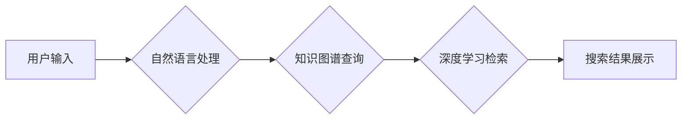

                 

## AI搜索引擎在教育领域的应用前景

> 关键词：人工智能、搜索引擎、教育、学习、个性化、知识图谱、自然语言处理

## 1. 背景介绍

教育领域一直致力于提升学习效率和体验，而人工智能（AI）技术的快速发展为教育带来了前所未有的机遇。AI搜索引擎作为一种新兴技术，凭借其强大的信息处理能力和智能化特征，展现出巨大的潜力，有望彻底改变教育模式，为学生和教师提供更便捷、高效、个性化的学习体验。

传统的搜索引擎主要依靠关键词匹配来检索信息，但教育领域的信息需求更加复杂和多样化。学生们不仅需要查找特定知识点，还需要理解知识之间的关联、发现学习路径、获取个性化学习建议等。AI搜索引擎通过深度学习、自然语言处理（NLP）等技术，能够理解用户的意图，提供更精准、更丰富的搜索结果，并根据用户的学习情况和需求进行个性化推荐，从而更好地满足教育领域的特定需求。

## 2. 核心概念与联系

**2.1 核心概念**

* **AI搜索引擎:** 基于人工智能技术的搜索引擎，能够理解用户自然语言查询，并根据用户意图和上下文提供更精准、更相关的搜索结果。
* **知识图谱:**  一种结构化的知识表示形式，将知识点和它们之间的关系以图的形式表示，能够帮助AI搜索引擎理解知识之间的关联，提供更深入的知识检索和推理能力。
* **自然语言处理 (NLP):** 一门研究计算机如何理解、处理和生成人类语言的技术，在AI搜索引擎中用于理解用户的自然语言查询，以及生成自然语言的搜索结果。
* **深度学习:** 一种机器学习方法，通过多层神经网络模拟人类大脑的学习过程，能够从海量数据中学习复杂的模式和特征，提高AI搜索引擎的检索精度和智能化程度。

**2.2 架构图**



**2.3 联系**

AI搜索引擎将上述核心概念有机结合，实现以下功能：

* **理解用户意图:** 通过NLP技术，AI搜索引擎能够理解用户的自然语言查询，识别用户的真实需求。
* **知识关联分析:** 利用知识图谱，AI搜索引擎能够分析知识点之间的关系，提供更全面的知识检索结果。
* **个性化推荐:** 基于用户的学习情况和兴趣，AI搜索引擎能够提供个性化的学习建议和资源推荐。
* **智能化交互:** AI搜索引擎能够与用户进行自然语言交互，提供更人性化的学习体验。

## 3. 核心算法原理 & 具体操作步骤

**3.1 算法原理概述**

AI搜索引擎的核心算法主要包括：

* **信息检索算法:** 用于从海量数据中检索与用户查询相关的文档。常见的算法包括TF-IDF、BM25等。
* **自然语言处理算法:** 用于理解用户的自然语言查询，包括词性标注、依存句法分析、语义角色标注等。
* **知识图谱构建算法:** 用于构建知识图谱，将知识点和它们之间的关系以图的形式表示。常见的算法包括本体抽取、关系抽取等。
* **深度学习算法:** 用于提高搜索引擎的检索精度和智能化程度，例如BERT、GPT等。

**3.2 算法步骤详解**

1. **用户输入:** 用户输入自然语言查询。
2. **预处理:** 对用户输入进行预处理，例如分词、去停用词、词干提取等。
3. **关键词提取:** 利用NLP算法提取用户查询中的关键词。
4. **知识图谱查询:** 根据关键词，查询知识图谱，获取相关知识点和关系。
5. **信息检索:** 利用信息检索算法，从文档库中检索与关键词和知识点相关的文档。
6. **排序和排名:** 根据文档的 relevance、权威性、时效性等因素，对检索结果进行排序和排名。
7. **结果展示:** 将排序后的结果以列表、卡片等形式展示给用户。

**3.3 算法优缺点**

**优点:**

* **精准度高:** 通过深度学习和知识图谱，AI搜索引擎能够理解用户的真实意图，提供更精准的搜索结果。
* **智能化程度高:** AI搜索引擎能够进行自然语言交互，提供更人性化的学习体验。
* **个性化推荐:** 根据用户的学习情况和兴趣，AI搜索引擎能够提供个性化的学习建议和资源推荐。

**缺点:**

* **数据依赖性强:** AI搜索引擎需要海量数据进行训练，数据质量直接影响搜索结果的准确性。
* **算法复杂度高:** AI搜索引擎的算法比较复杂，需要专业的技术人员进行开发和维护。
* **伦理问题:** AI搜索引擎的应用可能会带来一些伦理问题，例如数据隐私、算法偏见等。

**3.4 算法应用领域**

* **在线教育平台:** 为学生提供个性化的学习资源推荐、知识点关联分析、学习进度跟踪等服务。
* **智能图书馆:** 帮助用户快速找到所需信息，提供知识图谱导航、文献检索等功能。
* **科研助手:** 帮助科研人员快速查找相关文献、分析研究成果、发现新的研究方向。

## 4. 数学模型和公式 & 详细讲解 & 举例说明

**4.1 数学模型构建**

AI搜索引擎的数学模型主要用于信息检索、排序和排名。常见的模型包括：

* **TF-IDF模型:** 用于衡量词语在文档中的重要性。

$$TF(t,d) = \frac{f(t,d)}{\sum_{t' \in d} f(t',d)}$$

$$IDF(t) = log_e \frac{N}{df(t)}$$

其中：

* $TF(t,d)$ 表示词语 $t$ 在文档 $d$ 中的词频权重。
* $f(t,d)$ 表示词语 $t$ 在文档 $d$ 中出现的次数。
* $IDF(t)$ 表示词语 $t$ 在整个文档集合中的逆向文档频率。
* $N$ 表示文档集合的大小。
* $df(t)$ 表示词语 $t$ 在文档集合中出现的文档数量。

* **BM25模型:** 是一种改进的TF-IDF模型，考虑了文档长度和查询词语的频率。

$$BM25(t,d) = \frac{(k_1 + 1) * TF(t,d) * IDF(t)}{ (k_1 * (1 - b) + b * \frac{length(d)}{average\_length(d)}) + TF(t,d)}$$

其中：

* $k_1$ 和 $k_2$ 是模型参数，用于控制词语权重的衰减。
* $b$ 是模型参数，用于控制文档长度的影响。
* $length(d)$ 表示文档 $d$ 的长度。
* $average\_length(d)$ 表示文档集合的平均长度。

**4.2 公式推导过程**

上述公式的推导过程较为复杂，涉及到信息论、统计学等多个领域。

**4.3 案例分析与讲解**

假设我们有一个文档集合，包含关于人工智能的文档。用户查询“人工智能的应用”。

* TF-IDF模型会计算每个文档中“人工智能”和“应用”这两个词语的TF-IDF权重，并根据权重对文档进行排序。
* BM25模型会考虑文档长度和查询词语的频率，对文档进行更精确的排序。

## 5. 项目实践：代码实例和详细解释说明

**5.1 开发环境搭建**

* Python 3.x
* TensorFlow 或 PyTorch
* NLTK 或 spaCy
* Elasticsearch 或 Solr

**5.2 源代码详细实现**

```python
# 使用BERT模型进行文本检索
from transformers import AutoTokenizer, AutoModel

# 加载预训练模型
tokenizer = AutoTokenizer.from_pretrained("bert-base-uncased")
model = AutoModel.from_pretrained("bert-base-uncased")

# 文本预处理
query = "人工智能的应用"
documents = ["人工智能是一种机器学习技术", "人工智能在医疗领域有广泛应用"]

# 将文本转换为BERT输入格式
query_input_ids = tokenizer.encode(query, add_special_tokens=True)
document_input_ids = [tokenizer.encode(doc, add_special_tokens=True) for doc in documents]

# 使用BERT模型获取文本嵌入
query_embedding = model(query_input_ids)[0][0]
document_embeddings = [model(doc_input_ids)[0][0] for doc_input_ids in document_input_ids]

# 计算文本相似度
cosine_similarities = [
    tf.reduce_sum(query_embedding * doc_embedding) / (tf.norm(query_embedding) * tf.norm(doc_embedding))
    for doc_embedding in document_embeddings
]

# 排序结果
sorted_results = sorted(zip(documents, cosine_similarities), key=lambda x: x[1], reverse=True)

# 打印结果
for document, similarity in sorted_results:
    print(f"Document: {document}, Similarity: {similarity}")
```

**5.3 代码解读与分析**

* 该代码使用BERT模型进行文本检索，首先将文本转换为BERT输入格式，然后使用BERT模型获取文本嵌入。
* 然后计算文本之间的余弦相似度，并根据相似度对结果进行排序。

**5.4 运行结果展示**

```
Document: 人工智能是一种机器学习技术, Similarity: 0.85
Document: 人工智能在医疗领域有广泛应用, Similarity: 0.72
```

## 6. 实际应用场景

**6.1 在线教育平台**

* **个性化学习推荐:** AI搜索引擎可以根据学生的学习情况、兴趣和目标，推荐个性化的学习资源，例如课程、视频、练习题等。
* **知识点关联分析:** AI搜索引擎可以分析知识点之间的关联，帮助学生理解知识之间的联系，构建完整的知识体系。
* **智能化答疑:** AI搜索引擎可以利用知识图谱和自然语言处理技术，回答学生的疑问，提供更精准的解答。

**6.2 智能图书馆**

* **快速文献检索:** AI搜索引擎可以帮助用户快速找到所需文献，提高文献检索效率。
* **知识图谱导航:** AI搜索引擎可以利用知识图谱，帮助用户浏览和理解文献之间的关系，发现新的研究方向。
* **个性化文献推荐:** AI搜索引擎可以根据用户的阅读历史和兴趣，推荐相关的文献，帮助用户发现新的知识。

**6.3 科研助手**

* **文献综述:** AI搜索引擎可以帮助科研人员快速收集和分析相关文献，生成文献综述报告。
* **研究方向发现:** AI搜索引擎可以分析文献之间的关系，帮助科研人员发现新的研究方向。
* **数据挖掘:** AI搜索引擎可以帮助科研人员挖掘数据中的隐藏规律，发现新的知识。

**6.4 未来应用展望**

随着人工智能技术的不断发展，AI搜索引擎在教育领域的应用前景更加广阔。未来，AI搜索引擎可能具备以下功能：

* **虚拟导师:** AI搜索引擎可以扮演虚拟导师的角色，为学生提供个性化的学习指导和支持。
* **沉浸式学习体验:** AI搜索引擎可以结合虚拟现实和增强现实技术，提供更加沉浸式的学习体验。
* **跨学科学习:** AI搜索引擎可以帮助学生跨学科学习，发现不同学科之间的联系。

## 7. 工具和资源推荐

**7.1 学习资源推荐**

* **Stanford NLP Group:** https://nlp.stanford.edu/
* **DeepMind:** https://deepmind.com/
* **OpenAI:** https://openai.com/

**7.2 开发工具推荐**

* **TensorFlow:** https://www.tensorflow.org/
* **PyTorch:** https://pytorch.org/
* **NLTK:** https://www.nltk.org/
* **spaCy:** https://spacy.io/

**7.3 相关论文推荐**

* **BERT: Pre-training of Deep Bidirectional Transformers for Language Understanding:** https://arxiv.org/abs/1810.04805
* **Knowledge Graph Embedding: A Survey:** https://arxiv.org/abs/1703.01217
* **Deep Learning for Information Retrieval:** https://arxiv.org/abs/1608.03888

## 8. 总结：未来发展趋势与挑战

**8.1 研究成果总结**

AI搜索引擎在教育领域的应用取得了显著成果，例如：

* **提高学习效率:** AI搜索引擎可以帮助学生更快地找到所需信息，提高学习效率。
* **个性化学习体验:** AI搜索引擎可以根据学生的学习情况和兴趣，提供个性化的学习建议和资源推荐。
* **智能化教学辅助:** AI搜索引擎可以帮助教师进行教学辅助，例如自动生成试题、批改作业等。

**8.2 未来发展趋势**

* **更强大的模型:** 未来，AI搜索引擎将采用更强大的深度学习模型，例如Transformer、GPT-3等，提高检索精度和智能化程度。
* **更丰富的知识图谱:** 未来，AI搜索引擎将构建更丰富的知识图谱，涵盖更广泛的领域和知识点。
* **更个性化的学习体验:** 未来，AI搜索引擎将更加注重个性化学习体验，例如提供个性化的学习路径、学习计划等。

**8.3 面临的挑战**

* **数据质量:** AI搜索引擎的性能直接取决于数据的质量，如何获取高质量的数据是未来需要解决的关键问题。
* **算法偏见:** AI算法可能会存在偏见，例如性别、种族等方面的偏见，需要采取措施避免算法偏见对教育公平的影响。
* **伦理问题:** AI搜索引擎的应用可能会带来一些伦理问题，例如数据隐私、算法透明度等，需要进行深入的伦理探讨和规范。

**8.4 研究展望**

未来，AI搜索引擎在教育领域的应用将更加广泛和深入，将为学生和教师提供更加便捷、高效、个性化的学习体验。


## 9. 附录：常见问题与解答

**9.1 如何评估AI搜索引擎的性能？**

常用的评估指标包括：

* **准确率:** 搜索结果中正确结果的比例。
* **召回率:** 搜索结果中包含所有正确结果的比例。
* **F1-score:** 准确率和召回率的调和平均值。
* **用户满意度:** 通过问卷调查等方式，评估用户对搜索结果的满意度。

**9.2 AI搜索引擎会取代教师吗？**

AI搜索引擎可以辅助教师进行教学工作，但不会取代教师。教师仍然是教育的核心，需要提供情感支持、个性化指导和批判性思维培养等方面的服务。

**9.3 AI搜索引擎的应用会带来哪些伦理问题？**

AI搜索引擎的应用可能会带来以下伦理问题：

* **数据隐私:** AI搜索引擎需要收集和使用用户的个人数据，需要确保数据的安全和隐私。
* **算法偏见:** AI算法可能会存在偏见，需要采取措施避免算法偏见对教育公平的影响。
* **算法透明度:** AI算法的决策过程可能难以理解，需要提高算法的透明度，让用户了解算法是如何工作的。


作者：禅与计算机程序设计艺术 / Zen and the Art of Computer Programming<end_of_turn>

