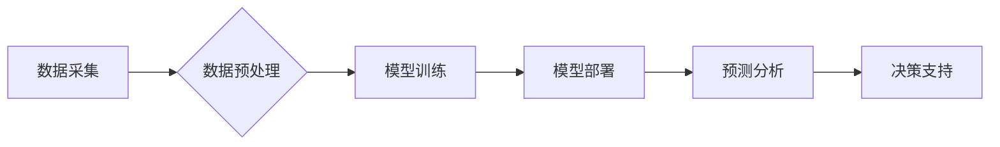

                 

## AI驱动的创新：人类计算在金融中的应用

> 关键词：人工智能、金融科技、机器学习、深度学习、风险管理、预测分析、自动化、人类计算

## 1. 背景介绍

金融行业一直是技术创新的前沿阵地，而人工智能（AI）的兴起为金融领域带来了前所未有的机遇。AI技术的快速发展，特别是机器学习和深度学习的突破，为金融机构提供了强大的工具，帮助他们提高效率、降低风险、优化决策和提升客户体验。

传统金融模式面临着诸多挑战，例如：

* **数据爆炸:** 金融数据日益庞大，传统的分析方法难以有效处理。
* **风险管理:** 金融市场波动性大，风险管理难度不断增加。
* **客户体验:** 客户对金融服务的个性化需求不断提高。
* **运营效率:** 金融机构的运营成本高，效率低下。

AI技术可以有效解决这些挑战，为金融行业带来革命性的变革。

## 2. 核心概念与联系

**2.1 人类计算与AI**

人类计算是指人类利用其认知能力和经验进行计算和分析的过程。传统金融行业主要依赖人类计算，但随着数据量的激增，人类计算的效率和准确性受到限制。AI技术可以模拟和增强人类计算能力，例如：

* **数据分析:** AI算法可以快速处理海量数据，发现隐藏的模式和趋势。
* **预测分析:** AI模型可以基于历史数据预测未来的市场走势和客户行为。
* **决策支持:** AI系统可以提供数据驱动的决策建议，帮助金融机构做出更明智的决策。

**2.2 AI在金融中的应用场景**

AI技术在金融领域的应用场景广泛，包括：

* **风险管理:** 识别和评估金融风险，例如信用风险、市场风险和操作风险。
* **欺诈检测:** 识别和预防金融欺诈行为，例如信用卡欺诈和网络钓鱼。
* **投资管理:** 建立投资组合，优化资产配置，进行量化投资。
* **客户服务:** 提供智能客服，自动处理客户咨询和投诉。
* **交易执行:** 自动执行交易指令，提高交易效率。

**2.3 AI架构**

AI在金融领域的应用通常采用以下架构：



**数据采集:** 从各种数据源收集金融数据，例如交易记录、客户信息、市场数据等。

**数据预处理:** 对收集到的数据进行清洗、转换和特征工程，使其适合模型训练。

**模型训练:** 使用机器学习或深度学习算法训练AI模型，例如回归模型、分类模型、聚类模型等。

**模型部署:** 将训练好的模型部署到生产环境中，用于预测分析和决策支持。

**预测分析:** 使用部署的模型对新的金融数据进行预测分析，例如预测客户流失、识别欺诈行为等。

**决策支持:** 将预测分析结果提供给金融机构，帮助他们做出更明智的决策。

## 3. 核心算法原理 & 具体操作步骤

**3.1 算法原理概述**

在金融领域，常用的AI算法包括：

* **线性回归:** 用于预测连续变量，例如股票价格、客户信用评分等。
* **逻辑回归:** 用于分类问题，例如识别欺诈交易、预测客户流失等。
* **支持向量机:** 用于分类和回归问题，具有较好的泛化能力。
* **决策树:** 用于分类和回归问题，易于理解和解释。
* **随机森林:** 结合多个决策树，提高预测精度。
* **神经网络:** 用于复杂模式识别，例如图像识别、语音识别等。

**3.2 算法步骤详解**

以线性回归为例，其具体操作步骤如下：

1. **数据收集和预处理:** 收集相关数据，并进行清洗、转换和特征工程。
2. **模型构建:** 使用线性回归模型，将输入特征与输出变量建立线性关系。
3. **模型训练:** 使用训练数据训练模型，调整模型参数，使模型能够准确预测输出变量。
4. **模型评估:** 使用测试数据评估模型的预测精度，例如使用均方误差（MSE）或R-squared值。
5. **模型部署:** 将训练好的模型部署到生产环境中，用于预测新的数据。

**3.3 算法优缺点**

不同算法具有不同的优缺点，需要根据具体应用场景选择合适的算法。例如：

* **线性回归:** 优点是简单易懂，计算速度快；缺点是假设数据服从线性关系，对非线性关系的拟合能力较差。
* **逻辑回归:** 优点是适用于分类问题，易于解释；缺点是假设数据服从逻辑分布，对复杂分类问题效果有限。
* **支持向量机:** 优点是具有较好的泛化能力，适用于高维数据；缺点是训练时间较长，参数选择较复杂。

**3.4 算法应用领域**

不同的AI算法在金融领域的应用领域也不尽相同。例如：

* **线性回归:** 用于预测股票价格、客户信用评分等。
* **逻辑回归:** 用于识别欺诈交易、预测客户流失等。
* **支持向量机:** 用于识别金融风险、进行信用评级等。

## 4. 数学模型和公式 & 详细讲解 & 举例说明

**4.1 数学模型构建**

在金融领域，常用的数学模型包括：

* **线性回归模型:**

$$
y = \beta_0 + \beta_1x_1 + \beta_2x_2 + ... + \beta_nx_n + \epsilon
$$

其中：

* $y$ 是预测变量
* $x_1, x_2, ..., x_n$ 是输入特征
* $\beta_0, \beta_1, ..., \beta_n$ 是模型参数
* $\epsilon$ 是误差项

* **逻辑回归模型:**

$$
P(y=1|x) = \frac{1}{1 + e^{-( \beta_0 + \beta_1x_1 + \beta_2x_2 + ... + \beta_nx_n )}}
$$

其中：

* $P(y=1|x)$ 是给定输入特征 $x$ 时，预测变量 $y$ 为 1 的概率
* $\beta_0, \beta_1, ..., \beta_n$ 是模型参数

**4.2 公式推导过程**

线性回归模型的参数可以通过最小二乘法估计，逻辑回归模型的参数可以通过最大似然估计估计。

**4.3 案例分析与讲解**

例如，可以使用线性回归模型预测股票价格。

* 输入特征：股票的历史价格、成交量、市场指数等
* 预测变量：股票未来价格

通过训练模型，可以得到股票价格的预测公式，并根据新的数据进行预测。

## 5. 项目实践：代码实例和详细解释说明

**5.1 开发环境搭建**

* Python 3.x
* Jupyter Notebook
* scikit-learn

**5.2 源代码详细实现**

```python
from sklearn.linear_model import LinearRegression
from sklearn.model_selection import train_test_split
import pandas as pd

# 加载数据
data = pd.read_csv('stock_data.csv')

# 划分训练集和测试集
X = data[['历史价格', '成交量', '市场指数']]
y = data['未来价格']
X_train, X_test, y_train, y_test = train_test_split(X, y, test_size=0.2, random_state=42)

# 创建线性回归模型
model = LinearRegression()

# 训练模型
model.fit(X_train, y_train)

# 预测测试集数据
y_pred = model.predict(X_test)

# 评估模型性能
from sklearn.metrics import mean_squared_error
mse = mean_squared_error(y_test, y_pred)
print('均方误差:', mse)
```

**5.3 代码解读与分析**

* 首先，加载股票数据并划分训练集和测试集。
* 然后，创建线性回归模型并训练模型。
* 最后，使用训练好的模型预测测试集数据，并评估模型性能。

**5.4 运行结果展示**

运行代码后，会输出模型的均方误差值，该值越小，模型的预测精度越高。

## 6. 实际应用场景

**6.1 风险管理**

AI可以帮助金融机构识别和评估各种金融风险，例如信用风险、市场风险和操作风险。例如，可以使用机器学习算法分析客户的信用历史、财务状况和行为模式，预测客户违约的可能性。

**6.2 欺诈检测**

AI可以帮助金融机构识别和预防金融欺诈行为，例如信用卡欺诈、网络钓鱼和洗钱。例如，可以使用机器学习算法分析交易数据，识别异常交易行为，并进行预警。

**6.3 投资管理**

AI可以帮助金融机构进行投资决策，例如建立投资组合、优化资产配置和进行量化投资。例如，可以使用机器学习算法分析市场数据、经济指标和公司财务数据，预测股票价格走势，并进行投资决策。

**6.4 客户服务**

AI可以帮助金融机构提供智能客服，自动处理客户咨询和投诉。例如，可以使用聊天机器人技术，帮助客户查询账户余额、办理转账业务等。

**6.5 交易执行**

AI可以帮助金融机构自动执行交易指令，提高交易效率。例如，可以使用机器学习算法分析市场数据，识别最佳交易时机，并自动执行交易指令。

**6.6 未来应用展望**

随着AI技术的不断发展，其在金融领域的应用场景将更加广泛和深入。例如：

* **个性化金融服务:** AI可以根据客户的个人需求和风险偏好，提供个性化的金融产品和服务。
* **智能风控:** AI可以帮助金融机构建立更加智能的风控模型，提高风控效率和准确性。
* **自动交易:** AI可以帮助金融机构实现更加自动化和智能的交易系统，降低交易成本和风险。
* **金融监管:** AI可以帮助监管机构进行更加高效和精准的金融监管。

## 7. 工具和资源推荐

**7.1 学习资源推荐**

* **书籍:**
    * 《深度学习》
    * 《机器学习实战》
    * 《Python机器学习》
* **在线课程:**
    * Coursera
    * edX
    * Udacity

**7.2 开发工具推荐**

* **Python:** 
    * scikit-learn
    * TensorFlow
    * PyTorch
* **Jupyter Notebook:** 用于代码编写和可视化
* **云计算平台:** AWS, Azure, GCP

**7.3 相关论文推荐**

* **深度学习在金融领域的应用:** https://arxiv.org/abs/1806.07084
* **机器学习在风险管理中的应用:** https://arxiv.org/abs/1706.02513

## 8. 总结：未来发展趋势与挑战

**8.1 研究成果总结**

AI技术在金融领域的应用取得了显著成果，例如：

* **提高了风险管理的效率和准确性**
* **降低了金融欺诈的发生率**
* **优化了投资决策**
* **提升了客户服务体验**

**8.2 未来发展趋势**

未来，AI技术在金融领域的应用将更加深入和广泛，例如：

* **更智能的风险管理系统**
* **更精准的投资策略**
* **更个性化的金融服务**
* **更安全的金融交易**

**8.3 面临的挑战**

AI技术在金融领域的应用也面临着一些挑战，例如：

* **数据安全和隐私保护**
* **算法解释性和可信度**
* **监管和合规性**
* **人才短缺**

**8.4 研究展望**

未来，需要进一步研究和解决这些挑战，推动AI技术在金融领域的健康发展。

## 9. 附录：常见问题与解答

**9.1 如何选择合适的AI算法？**

选择合适的AI算法需要根据具体应用场景和数据特点进行选择。例如，对于预测连续变量，可以使用线性回归或支持向量机；对于分类问题，可以使用逻辑回归或决策树。

**9.2 如何评估AI模型的性能？**

常用的AI模型性能评估指标包括均方误差（MSE）、R-squared值、准确率、召回率和F1-score等。

**9.3 如何解决数据安全和隐私保护问题？**

在使用AI技术处理金融数据时，需要采取相应的安全措施，例如数据加密、访问控制和匿名化处理。

**9.4 如何提高AI模型的解释性和可信度？**

可以使用可解释AI技术，例如LIME和SHAP，解释AI模型的决策过程，提高模型的可信度。


作者：禅与计算机程序设计艺术 / Zen and the Art of Computer Programming 
<end_of_turn>

