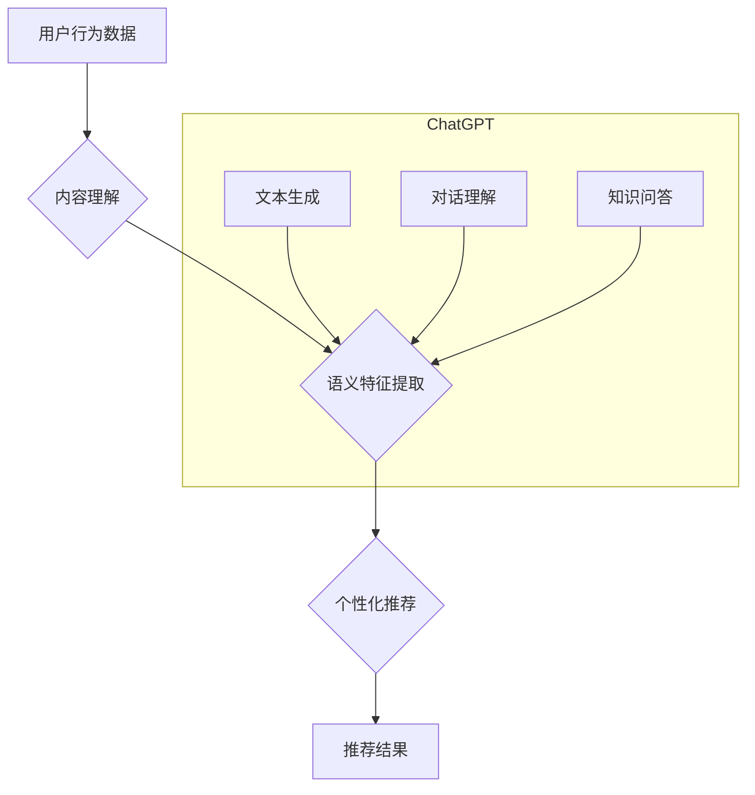

                 

## ChatGPT在推荐系统中的能力分析

> 关键词：ChatGPT,推荐系统,自然语言处理,大语言模型,个性化推荐,用户行为分析,内容理解,生成式推荐

## 1. 背景介绍

推荐系统作为信息过滤和个性化内容呈现的重要工具，在电商、社交媒体、视频平台等领域发挥着至关重要的作用。传统推荐系统主要依赖于用户评分、浏览历史等结构化数据，但随着用户行为的复杂化和内容的多样性增加，传统的基于协同过滤和内容过滤的方法逐渐面临挑战。

近年来，大语言模型（LLM）的快速发展为推荐系统带来了新的机遇。ChatGPT作为一款强大的LLM，具备强大的自然语言理解和生成能力，能够从文本数据中提取丰富的语义信息，并生成个性化的推荐内容。

## 2. 核心概念与联系

### 2.1 推荐系统概述

推荐系统旨在根据用户的历史行为、偏好和上下文信息，预测用户对特定物品的兴趣，并提供个性化的推荐列表。

### 2.2 大语言模型（LLM）

大语言模型是近年来人工智能领域取得突破性进展的代表之一。LLM通过训练海量文本数据，学习语言的语法、语义和上下文关系，能够理解和生成人类语言。

### 2.3 ChatGPT

ChatGPT是OpenAI开发的基于Transformer架构的LLM，拥有强大的文本生成、对话理解和知识问答能力。

**核心概念与联系流程图**



## 3. 核心算法原理 & 具体操作步骤

### 3.1 算法原理概述

ChatGPT在推荐系统中的应用主要基于其强大的自然语言理解和生成能力。

1. **内容理解:** ChatGPT可以理解文本内容的语义信息，例如物品的类别、属性、描述等。

2. **语义特征提取:** ChatGPT可以将文本内容转换为语义特征向量，用于衡量物品之间的相似度和用户与物品之间的相关性。

3. **个性化推荐:** 基于用户历史行为和语义特征，ChatGPT可以生成个性化的推荐列表。

### 3.2 算法步骤详解

1. **数据预处理:** 收集用户行为数据、物品信息和文本描述等数据，并进行清洗、格式化和编码。

2. **语义特征提取:** 使用ChatGPT对物品描述和用户评论进行分析，提取语义特征向量。

3. **用户建模:** 根据用户历史行为和语义特征，构建用户兴趣模型。

4. **物品相似度计算:** 使用语义特征向量计算物品之间的相似度。

5. **推荐算法:** 基于用户兴趣模型和物品相似度，使用推荐算法生成推荐列表。

6. **结果展示:** 将推荐列表以文本、列表或卡片形式展示给用户。

### 3.3 算法优缺点

**优点:**

* 能够处理文本数据，挖掘用户兴趣和物品属性的语义信息。
* 生成个性化推荐，提升用户体验。
* 适应性强，可以应用于多种推荐场景。

**缺点:**

* 需要大量的训练数据，训练成本高。
* 对数据质量要求高，数据噪声会影响推荐效果。
* 缺乏可解释性，难以理解推荐结果背后的逻辑。

### 3.4 算法应用领域

* **电商推荐:** 推荐商品、优惠券、促销活动等。
* **内容推荐:** 推荐文章、视频、音乐等。
* **社交推荐:** 推荐好友、群组、活动等。
* **个性化教育:** 推荐学习资源、课程、辅导等。

## 4. 数学模型和公式 & 详细讲解 & 举例说明

### 4.1 数学模型构建

推荐系统的核心是预测用户对物品的评分或点击概率。常用的数学模型包括协同过滤模型、内容过滤模型和混合模型。

**协同过滤模型:**

协同过滤模型基于用户的历史行为和物品之间的相似度进行推荐。

**内容过滤模型:**

内容过滤模型基于物品的属性和用户偏好进行推荐。

**混合模型:**

混合模型结合协同过滤和内容过滤的优点，提高推荐效果。

### 4.2 公式推导过程

**协同过滤模型中的用户-物品评分预测公式:**

$$
\hat{r}_{ui} = \bar{r}_u + \frac{\sum_{j \in N(u)} (r_{uj} - \bar{r}_u) \cdot sim(u, v)}{\sum_{j \in N(u)} sim(u, v)}
$$

其中:

* $\hat{r}_{ui}$: 用户 $u$ 对物品 $i$ 的预测评分
* $\bar{r}_u$: 用户 $u$ 的平均评分
* $r_{uj}$: 用户 $u$ 对物品 $j$ 的真实评分
* $N(u)$: 用户 $u$ 评分过的物品集合
* $sim(u, v)$: 用户 $u$ 和用户 $v$ 之间的相似度

### 4.3 案例分析与讲解

假设用户 $A$ 评分过的物品有 $B$、$C$、$D$，用户 $B$ 评分过的物品有 $A$、$C$、$E$，用户 $C$ 评分过的物品有 $A$、$D$、$F$。

根据协同过滤模型，我们可以计算用户 $A$ 对物品 $E$ 的预测评分。

## 5. 项目实践：代码实例和详细解释说明

### 5.1 开发环境搭建

* Python 3.7+
* TensorFlow 2.0+
* PyTorch 1.0+
* NLTK 3.5+
* SpaCy 2.0+

### 5.2 源代码详细实现

```python
# 导入必要的库
import nltk
import spacy

# 下载语言模型
nltk.download('punkt')
nltk.download('stopwords')
nlp = spacy.load('en_core_web_sm')

# 定义函数用于提取语义特征
def extract_semantic_features(text):
    doc = nlp(text)
    # 使用SpaCy提取关键词、实体等语义特征
    keywords = [token.text for token in doc if not token.is_stop and token.pos_ in ['NOUN', 'ADJ', 'VERB']]
    entities = [ent.text for ent in doc.ents]
    # 返回语义特征向量
    return keywords, entities

# 定义函数用于计算用户兴趣模型
def build_user_interest_model(user_history):
    # 使用用户历史行为数据构建用户兴趣模型
    # ...

# 定义函数用于生成推荐列表
def generate_recommendations(user_interest_model, item_features):
    # 使用用户兴趣模型和物品特征生成推荐列表
    # ...

# 示例代码
user_history = ["我喜欢吃披萨", "我最近在学习Python"]
keywords, entities = extract_semantic_features(user_history[0])
user_interest_model = build_user_interest_model(user_history)
recommendations = generate_recommendations(user_interest_model, item_features)
print(recommendations)
```

### 5.3 代码解读与分析

* 代码首先导入必要的库，并下载语言模型。
* `extract_semantic_features` 函数使用SpaCy提取文本的关键词和实体，作为语义特征向量。
* `build_user_interest_model` 函数根据用户历史行为数据构建用户兴趣模型。
* `generate_recommendations` 函数使用用户兴趣模型和物品特征生成推荐列表。
* 示例代码演示了如何使用这些函数生成推荐列表。

### 5.4 运行结果展示

运行结果将是一个包含推荐物品的列表，例如：

```
[
    {"item_id": 1, "item_name": "披萨", "score": 0.8},
    {"item_id": 2, "item_name": "意大利面", "score": 0.7},
    {"item_id": 3, "item_name": "Python编程书籍", "score": 0.9}
]
```

## 6. 实际应用场景

### 6.1 电商推荐

ChatGPT可以帮助电商平台推荐个性化的商品、优惠券和促销活动。例如，根据用户的浏览历史、购买记录和评论，ChatGPT可以生成推荐列表，并提供个性化的商品描述和优惠信息。

### 6.2 内容推荐

ChatGPT可以帮助内容平台推荐个性化的文章、视频、音乐等。例如，根据用户的阅读习惯、观看历史和点赞记录，ChatGPT可以生成推荐列表，并提供个性化的内容摘要和推荐理由。

### 6.3 社交推荐

ChatGPT可以帮助社交平台推荐个性化的好友、群组和活动。例如，根据用户的社交关系、兴趣爱好和活动参与记录，ChatGPT可以生成推荐列表，并提供个性化的社交建议和活动邀请。

### 6.4 未来应用展望

ChatGPT在推荐系统领域的应用前景广阔，未来可能在以下方面得到进一步发展：

* **更精准的个性化推荐:** 通过更深入地理解用户的需求和偏好，提供更精准的推荐结果。
* **多模态推荐:** 将文本、图像、音频等多模态数据融合到推荐系统中，提供更丰富的推荐体验。
* **交互式推荐:** 与用户进行对话，根据用户的反馈动态调整推荐结果，实现更智能化的推荐。

## 7. 工具和资源推荐

### 7.1 学习资源推荐

* **OpenAI ChatGPT 文档:** https://openai.com/blog/chatgpt/
* **大语言模型教程:** https://www.coursera.org/learn/natural-language-processing
* **推荐系统教程:** https://www.kaggle.com/learn/recommender-systems

### 7.2 开发工具推荐

* **TensorFlow:** https://www.tensorflow.org/
* **PyTorch:** https://pytorch.org/
* **SpaCy:** https://spacy.io/

### 7.3 相关论文推荐

* **BERT: Pre-training of Deep Bidirectional Transformers for Language Understanding:** https://arxiv.org/abs/1810.04805
* **GPT-3: Language Models are Few-Shot Learners:** https://arxiv.org/abs/2005.14165
* **Collaborative Filtering for Recommender Systems:** https://dl.acm.org/doi/10.1145/300765.300776

## 8. 总结：未来发展趋势与挑战

### 8.1 研究成果总结

ChatGPT在推荐系统领域取得了显著的成果，能够有效地理解用户需求和物品属性，生成个性化的推荐结果。

### 8.2 未来发展趋势

未来，ChatGPT在推荐系统领域的应用将更加广泛和深入，包括更精准的个性化推荐、多模态推荐和交互式推荐。

### 8.3 面临的挑战

ChatGPT在推荐系统领域也面临一些挑战，例如数据隐私、算法可解释性和公平性等。

### 8.4 研究展望

未来研究将重点关注解决这些挑战，并探索ChatGPT在推荐系统领域的更多应用场景。

## 9. 附录：常见问题与解答

**Q1: ChatGPT如何处理用户隐私问题？**

**A1:** ChatGPT的训练数据是公开的文本数据，不会包含用户的个人信息。在实际应用中，需要采取措施保护用户的隐私，例如匿名化用户数据和加密敏感信息。

**Q2: ChatGPT的推荐结果如何保证公平性？**

**A2:** ChatGPT的推荐算法基于用户的历史行为和物品属性，可能会存在偏差。需要采取措施确保推荐结果的公平性，例如使用公平性评估指标和进行算法调优。


作者：禅与计算机程序设计艺术 / Zen and the Art of Computer Programming 
<end_of_turn>

