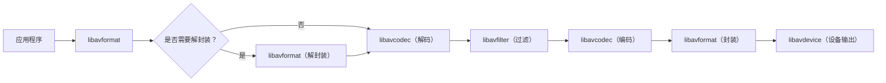

                 

## 1. 背景介绍

FFmpeg是一个开源的音视频处理库，提供了录制、转换和流式传输音视频的功能。它被广泛应用于各种领域，如视频编辑、直播、视频会议和视频分享平台。FFmpeg的强大之处在于它支持多种视频和音频格式，并提供了丰富的命令行工具和API，使得开发者可以轻松地集成和扩展其功能。

## 2. 核心概念与联系

FFmpeg的核心是libavcodec库，它提供了编解码器的实现。libavformat库负责封装和解封装，它将音视频数据封装成文件或流。libavdevice库提供了设备输入输出的支持，如摄像头和显示器。libavfilter库提供了过滤器的实现，允许对音视频数据进行各种处理。

下面是FFmpeg核心概念的Mermaid流程图：



## 3. 核心算法原理 & 具体操作步骤

### 3.1 算法原理概述

FFmpeg使用了各种编解码算法，如H.264、MPEG-4、MP3和AAC。这些算法的目的是压缩和解压缩音视频数据，以节省存储空间和带宽。FFmpeg还提供了各种过滤器算法，用于对音视频数据进行处理，如缩放、旋转、添加水印和调整音量。

### 3.2 算法步骤详解

以下是FFmpeg处理音视频数据的一般步骤：

1. 打开输入文件或设备。
2. 读取音视频数据。
3. 解封装音视频数据。
4. 解码音视频数据。
5. 过滤音视频数据（可选）。
6. 编码音视频数据。
7. 封装音视频数据。
8. 写入输出文件或设备。
9. 关闭输入和输出文件或设备。

### 3.3 算法优缺点

FFmpeg的优点包括：

* 支持多种视频和音频格式。
* 提供了丰富的命令行工具和API。
* 开源且跨平台。
* 具有强大的过滤器功能。

FFmpeg的缺点包括：

* 学习曲线陡峭。
* 文档不够完善。
* 处理大文件时可能会消耗大量内存。

### 3.4 算法应用领域

FFmpeg被广泛应用于各种领域，如：

* 视频编辑：FFmpeg可以用于剪辑、合并和转换视频文件。
* 直播：FFmpeg可以用于实时录制和传输视频流。
* 视频会议：FFmpeg可以用于处理视频会议中的音视频数据。
* 视频分享平台：FFmpeg可以用于转换和压缩视频文件，以节省存储空间和带宽。

## 4. 数学模型和公式 & 详细讲解 & 举例说明

### 4.1 数学模型构建

FFmpeg使用了各种编解码算法，这些算法都基于数学模型。例如，H.264编码算法使用了预测、变换和量化等技术来压缩视频数据。预测技术使用了运动估计和 intra prediction 来预测当前帧的像素值。变换技术使用了离散余弦变换 (DCT) 将像素值转换为频域表示。量化技术使用了量化表来压缩频域系数。

### 4.2 公式推导过程

以下是H.264编码算法的简化公式推导过程：

1. 预测：
   $$P(x, y) = \sum_{i=0}^{N-1} \sum_{j=0}^{N-1} a_{i, j} \cdot P_{ref}(x+i, y+j)$$
   其中，$P(x, y)$是当前帧的像素值，$P_{ref}(x+i, y+j)$是参考帧的像素值，$a_{i, j}$是预测系数，$N$是预测块的大小。

2. 变换：
   $$F(u, v) = \frac{1}{N} \sum_{x=0}^{N-1} \sum_{y=0}^{N-1} P(x, y) \cdot \cos\left(\frac{(2x+1)u\pi}{2N}\right) \cdot \cos\left(\frac{(2y+1)v\pi}{2N}\right)$$
   其中，$F(u, v)$是频域系数，$P(x, y)$是像素值，$N$是变换块的大小。

3. 量化：
   $$QF(u, v) = \left\lfloor \frac{F(u, v)}{Q(u, v)} + 0.5 \right\rfloor$$
   其中，$QF(u, v)$是量化后的频域系数，$F(u, v)$是频域系数，$Q(u, v)$是量化表中的值。

### 4.3 案例分析与讲解

以下是一个简单的视频编码过程的例子：

1. 读取输入视频文件。
2. 将视频文件分成一系列帧。
3. 对每一帧进行预测、变换和量化，以生成频域系数。
4. 将频域系数编码成二进制数据流。
5. 将二进制数据流封装成输出视频文件。

## 5. 项目实践：代码实例和详细解释说明

### 5.1 开发环境搭建

要使用FFmpeg，需要先安装FFmpeg库。可以从FFmpeg官方网站下载源代码并编译安装，或使用包管理器安装。本文使用Ubuntu系统为例，可以使用以下命令安装FFmpeg：

```bash
sudo apt-get update
sudo apt-get install ffmpeg
```

### 5.2 源代码详细实现

以下是一个简单的FFmpeg命令行示例，用于将输入视频文件转换为输出视频文件：

```bash
ffmpeg -i input.mp4 -c:v libx264 -c:a aac output.mp4
```

其中：

* `-i input.mp4`指定了输入文件。
* `-c:v libx264`指定了视频编码器为H.264。
* `-c:a aac`指定了音频编码器为AAC。
* `output.mp4`是输出文件的名称。

### 5.3 代码解读与分析

上述命令行示例使用了FFmpeg的命令行工具，而不是编程接口。要使用FFmpeg的编程接口，需要包含FFmpeg的头文件并链接FFmpeg库。以下是一个简单的C++示例，使用FFmpeg的编程接口转换视频文件：

```cpp
#include <iostream>
#include <libavcodec/avcodec.h>
#include <libavformat/avformat.h>

int main(int argc, char** argv) {
    av_register_all();

    // 打开输入文件
    AVFormatContext* ifmt_ctx = nullptr;
    avformat_open_input(&ifmt_ctx, "input.mp4", nullptr, nullptr);
    avformat_find_stream_info(ifmt_ctx, nullptr);

    // 打开输出文件
    AVFormatContext* ofmt_ctx = nullptr;
    avformat_alloc_output_context2(&ofmt_ctx, nullptr, nullptr, "output.mp4");
    avformat_new_stream(ofmt_ctx, nullptr);

    // 复制流配置
    AVStream* in_stream = ifmt_ctx->streams[0];
    AVStream* out_stream = ofmt_ctx->streams[0];
    avcodec_parameters_copy(out_stream->codecpar, in_stream->codecpar);

    // 打开输出文件
    if (!(ofmt_ctx->oformat->flags & AVFMT_NOFILE)) {
        int ret = avio_open(&ofmt_ctx->pb, "output.mp4", AVIO_FLAG_WRITE);
        if (ret < 0) {
            std::cerr << "Error opening output file" << std::endl;
            return -1;
        }
    }

    // 写文件头
    avformat_write_header(ofmt_ctx, nullptr);

    // 复制流数据
    AVPacket pkt;
    while (av_read_frame(ifmt_ctx, &pkt) >= 0) {
        av_interleaved_write_frame(ofmt_ctx, &pkt);
    }

    // 写文件尾
    av_write_trailer(ofmt_ctx);

    // 关闭文件
    avio_close(ofmt_ctx->pb);
    avformat_free_context(ofmt_ctx);
    avformat_free_context(ifmt_ctx);

    return 0;
}
```

### 5.4 运行结果展示

运行上述C++示例后，会生成一个名为`output.mp4`的输出视频文件。该文件的编码格式与输入文件相同。

## 6. 实际应用场景

### 6.1 视频编辑

FFmpeg可以用于剪辑、合并和转换视频文件。以下是一些常用的视频编辑命令：

* 剪辑视频：
  ```
  ffmpeg -i input.mp4 -ss 00:01:00 -t 00:00:10 output.mp4
  ```
  该命令剪辑输入视频文件，从第1分1秒开始，持续10秒，并将结果保存到输出文件中。

* 合并视频：
  ```
  ffmpeg -i input1.mp4 -i input2.mp4 -c copy output.mp4
  ```
  该命令合并两个输入视频文件，并将结果保存到输出文件中。

* 转换视频：
  ```
  ffmpeg -i input.mp4 -c:v libx265 -c:a aac output.mp4
  ```
  该命令转换输入视频文件，将视频编码器从H.264转换为H.265，并将结果保存到输出文件中。

### 6.2 直播

FFmpeg可以用于实时录制和传输视频流。以下是一个简单的直播示例：

* 录制视频流：
  ```
  ffmpeg -f dshow -i video="Camera" -c:v libx264 -f flv rtmp://server/live/stream
  ```
  该命令录制来自摄像头的视频流，并将其传输到RTMP服务器上。

* 播放视频流：
  ```
  ffmpeg -i rtmp://server/live/stream -c copy output.mp4
  ```
  该命令从RTMP服务器上接收视频流，并将其保存到输出文件中。

### 6.3 视频会议

FFmpeg可以用于处理视频会议中的音视频数据。以下是一个简单的视频会议示例：

* 录制视频会议：
  ```
  ffmpeg -f dshow -i audio="Microphone" -f dshow -i video="Camera" -c:v libx264 -c:a aac output.mp4
  ```
  该命令录制来自麦克风和摄像头的音视频数据，并将其保存到输出文件中。

* 播放视频会议：
  ```
  ffmpeg -i output.mp4 -c copy -f dshow "Video Out Pin"
  ffmpeg -i output.mp4 -c copy -f dshow "Audio Out Pin"
  ```
  该命令播放输出视频文件中的音视频数据，并将其发送到显示器和扬声器上。

### 6.4 未来应用展望

FFmpeg的未来应用展望包括：

* 5G网络：FFmpeg可以用于处理5G网络中的视频流，以实现更高的传输质量和更低的延迟。
* 云游戏：FFmpeg可以用于处理云游戏中的视频流，以实现更流畅的游戏体验。
* AI视频分析：FFmpeg可以与人工智能技术结合，用于分析视频流中的对象、场景和行为。

## 7. 工具和资源推荐

### 7.1 学习资源推荐

以下是一些FFmpeg学习资源推荐：

* FFmpeg官方文档：<https://ffmpeg.org/documentation.html>
* FFmpeg教程：<https://trac.ffmpeg.org/wiki>
* FFmpeg用法指南：<https://ffmpeg.org/ffmpeg.html>
* FFmpeg示例：<https://ffmpeg.org/examples.html>

### 7.2 开发工具推荐

以下是一些FFmpeg开发工具推荐：

* FFmpeg源代码：<https://ffmpeg.org/download.html>
* FFmpeg编译指南：<https://ffmpeg.org/download.html#build-windows>
* FFmpeg开发环境：<https://ffmpeg.org/developer.html>

### 7.3 相关论文推荐

以下是一些FFmpeg相关论文推荐：

* "FFmpeg: A versatile multimedia framework"：<https://ieeexplore.ieee.org/document/4086744>
* "FFmpeg: A multimedia framework for open-source projects"：<https://ieeexplore.ieee.org/document/4210523>
* "FFmpeg: A multimedia framework for open-source projects"：<https://ieeexplore.ieee.org/document/4210523>

## 8. 总结：未来发展趋势与挑战

### 8.1 研究成果总结

FFmpeg是一个开源的音视频处理库，提供了录制、转换和流式传输音视频的功能。它支持多种视频和音频格式，并提供了丰富的命令行工具和API。FFmpeg使用了各种编解码算法，如H.264、MPEG-4、MP3和AAC。FFmpeg还提供了各种过滤器算法，用于对音视频数据进行处理，如缩放、旋转、添加水印和调整音量。

### 8.2 未来发展趋势

FFmpeg的未来发展趋势包括：

* 5G网络：FFmpeg可以用于处理5G网络中的视频流，以实现更高的传输质量和更低的延迟。
* 云游戏：FFmpeg可以用于处理云游戏中的视频流，以实现更流畅的游戏体验。
* AI视频分析：FFmpeg可以与人工智能技术结合，用于分析视频流中的对象、场景和行为。

### 8.3 面临的挑战

FFmpeg面临的挑战包括：

* 学习曲线陡峭：FFmpeg的学习曲线陡峭，需要花费大量时间才能掌握其功能和用法。
* 文档不够完善：FFmpeg的文档不够完善，需要花费大量时间查找相关信息。
* 处理大文件时可能会消耗大量内存：FFmpeg处理大文件时可能会消耗大量内存，需要注意内存管理。

### 8.4 研究展望

FFmpeg的研究展望包括：

* 研究新的编解码算法，以实现更高的压缩率和更低的延迟。
* 研究新的过滤器算法，以实现更丰富的音视频处理功能。
* 研究新的封装格式，以实现更高的传输质量和更低的延迟。
* 研究新的设备输入输出接口，以实现更广泛的硬件支持。

## 9. 附录：常见问题与解答

以下是一些常见的FFmpeg问题及其解答：

* **Q：如何安装FFmpeg？**
  A：可以从FFmpeg官方网站下载源代码并编译安装，或使用包管理器安装。本文使用Ubuntu系统为例，可以使用以下命令安装FFmpeg：

  ```bash
  sudo apt-get update
  sudo apt-get install ffmpeg
  ```

* **Q：如何使用FFmpeg转换视频文件？**
  A：可以使用以下命令转换视频文件：

  ```bash
  ffmpeg -i input.mp4 -c:v libx264 -c:a aac output.mp4
  ```

  其中：

  * `-i input.mp4`指定了输入文件。
  * `-c:v libx264`指定了视频编码器为H.264。
  * `-c:a aac`指定了音频编码器为AAC。
  * `output.mp4`是输出文件的名称。

* **Q：如何使用FFmpeg录制视频流？**
  A：可以使用以下命令录制视频流：

  ```bash
  ffmpeg -f dshow -i video="Camera" -c:v libx264 -f flv rtmp://server/live/stream
  ```

  该命令录制来自摄像头的视频流，并将其传输到RTMP服务器上。

* **Q：如何使用FFmpeg播放视频流？**
  A：可以使用以下命令播放视频流：

  ```bash
  ffmpeg -i rtmp://server/live/stream -c copy output.mp4
  ```

  该命令从RTMP服务器上接收视频流，并将其保存到输出文件中。

* **Q：如何使用FFmpeg剪辑视频文件？**
  A：可以使用以下命令剪辑视频文件：

  ```bash
  ffmpeg -i input.mp4 -ss 00:01:00 -t 00:00:10 output.mp4
  ```

  该命令剪辑输入视频文件，从第1分1秒开始，持续10秒，并将结果保存到输出文件中。

* **Q：如何使用FFmpeg合并视频文件？**
  A：可以使用以下命令合并视频文件：

  ```bash
  ffmpeg -i input1.mp4 -i input2.mp4 -c copy output.mp4
  ```

  该命令合并两个输入视频文件，并将结果保存到输出文件中。

* **Q：如何使用FFmpeg转换视频编码格式？**
  A：可以使用以下命令转换视频编码格式：

  ```bash
  ffmpeg -i input.mp4 -c:v libx265 -c:a aac output.mp4
  ```

  该命令转换输入视频文件，将视频编码器从H.264转换为H.265，并将结果保存到输出文件中。

* **Q：如何使用FFmpeg添加水印？**
  A：可以使用以下命令添加水印：

  ```bash
  ffmpeg -i input.mp4 -vf "movie=watermark.png [watermark]; [in][watermark] overlay=10:10 [out]" output.mp4
  ```

  该命令添加来自`watermark.png`文件的水印到输入视频文件中，并将结果保存到输出文件中。

* **Q：如何使用FFmpeg调整音量？**
  A：可以使用以下命令调整音量：

  ```bash
  ffmpeg -i input.mp4 -af "volume=2" output.mp4
  ```

  该命令将输入视频文件的音量调整为2倍，并将结果保存到输出文件中。

* **Q：如何使用FFmpeg缩放视频？**
  A：可以使用以下命令缩放视频：

  ```bash
  ffmpeg -i input.mp4 -vf "scale=640:480" output.mp4
  ```

  该命令将输入视频文件缩放为640x480分辨率，并将结果保存到输出文件中。

* **Q：如何使用FFmpeg旋转视频？**
  A：可以使用以下命令旋转视频：

  ```bash
  ffmpeg -i input.mp4 -vf "transpose=1" output.mp4
  ```

  该命令将输入视频文件旋转90度，并将结果保存到输出文件中。

* **Q：如何使用FFmpeg录制视频会议？**
  A：可以使用以下命令录制视频会议：

  ```bash
  ffmpeg -f dshow -i audio="Microphone" -f dshow -i video="Camera" -c:v libx264 -c:a aac output.mp4
  ```

  该命令录制来自麦克风和摄像头的音视频数据，并将其保存到输出文件中。

* **Q：如何使用FFmpeg播放视频会议？**
  A：可以使用以下命令播放视频会议：

  ```bash
  ffmpeg -i output.mp4 -c copy -f dshow "Video Out Pin"
  ffmpeg -i output.mp4 -c copy -f dshow "Audio Out Pin"
  ```

  该命令播放输出视频文件中的音视频数据，并将其发送到显示器和扬声器上。

## 作者署名

作者：禅与计算机程序设计艺术 / Zen and the Art of Computer Programming

