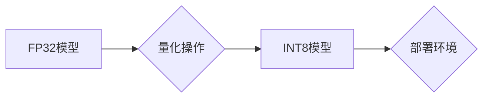

                 

## INT8量化：AI模型部署的效率之选

> 关键词：INT8量化、深度学习、模型压缩、效率优化、部署加速、神经网络、硬件加速

## 1. 背景介绍

随着深度学习技术的蓬勃发展，AI模型在各个领域取得了令人瞩目的成就。然而，随着模型规模的不断扩大，模型的计算量和内存需求也随之增加，这给模型的部署带来了巨大的挑战。如何在保证模型精度的前提下，降低模型的计算成本和内存占用，成为AI模型部署领域亟待解决的关键问题。

模型量化技术应运而生，它通过将模型参数和激活值从高精度浮点数（如FP32）转换为低精度整数（如INT8），有效地压缩模型大小，降低计算复杂度，从而提高模型的部署效率。

INT8量化作为一种主流的模型量化技术，凭借其良好的精度和效率平衡，在移动设备、嵌入式系统等资源受限的场景下得到了广泛应用。

## 2. 核心概念与联系

### 2.1 INT8量化原理

INT8量化是指将模型参数和激活值从32位浮点数（FP32）转换为8位整数（INT8）。

* **模型参数量化:** 将模型权重和偏置从FP32转换为INT8。
* **激活值量化:** 将神经网络的激活值（如ReLU、Sigmoid等）从FP32转换为INT8。

### 2.2 INT8量化架构



**流程说明:**

1. **FP32模型:** 原始的深度学习模型使用32位浮点数表示参数和激活值。
2. **量化操作:** 对模型参数和激活值进行量化操作，将它们转换为8位整数。
3. **INT8模型:** 量化后的模型，参数和激活值均使用INT8表示。
4. **部署环境:** INT8模型部署到目标设备，例如移动设备、嵌入式系统等。

### 2.3 INT8量化优势

* **模型压缩:** INT8量化可以有效地压缩模型大小，降低存储空间需求。
* **计算加速:** INT8运算速度更快，可以显著提高模型推理速度。
* **功耗降低:** INT8运算消耗更少能量，可以延长设备续航时间。

## 3. 核心算法原理 & 具体操作步骤

### 3.1 算法原理概述

INT8量化主要基于以下原理：

* **最小最大值缩放:** 将模型参数和激活值映射到INT8的范围[-128, 127]。
* **量化误差分析:** 通过分析量化误差，选择合适的量化方案，以最小化精度损失。

### 3.2 算法步骤详解

1. **数据预处理:** 对模型输入数据进行预处理，例如归一化、标准化等。
2. **模型训练:** 使用原始的FP32模型进行训练，获得模型权重和偏置。
3. **量化方案选择:** 根据模型结构和精度要求，选择合适的量化方案，例如静态量化、动态量化等。
4. **参数量化:** 将模型权重和偏置转换为INT8整数。
5. **激活值量化:** 将神经网络的激活值转换为INT8整数。
6. **模型评估:** 使用量化后的模型进行评估，分析精度损失和性能提升。
7. **模型部署:** 将量化后的INT8模型部署到目标设备。

### 3.3 算法优缺点

**优点:**

* 精度损失相对较小。
* 计算速度和功耗显著降低。
* 模型大小压缩明显。

**缺点:**

* 量化过程可能引入一些精度损失。
* 需要额外的量化步骤和资源。

### 3.4 算法应用领域

* **移动设备:** 在手机、平板电脑等移动设备上部署AI模型，例如图像识别、语音识别等。
* **嵌入式系统:** 在资源受限的嵌入式系统上部署AI模型，例如智能家居、工业自动化等。
* **边缘计算:** 在边缘节点上部署AI模型，例如视频监控、无人驾驶等。

## 4. 数学模型和公式 & 详细讲解 & 举例说明

### 4.1 数学模型构建

**量化目标:** 将FP32数据转换为INT8数据，最小化精度损失。

**量化公式:**

$$
q(x) = \text{round}\left(\frac{x - \text{min}(x)}{\text{max}(x) - \text{min}(x)} \cdot 255\right)
$$

其中:

* $x$ 是FP32数据。
* $q(x)$ 是INT8量化后的数据。
* $\text{min}(x)$ 和 $\text{max}(x)$ 分别是FP32数据范围的最小值和最大值。

### 4.2 公式推导过程

1. **数据归一化:** 将FP32数据映射到[0, 1]的范围。

$$
x' = \frac{x - \text{min}(x)}{\text{max}(x) - \text{min}(x)}
$$

2. **量化映射:** 将归一化后的数据映射到INT8的范围[-128, 127]。

$$
q(x) = \text{round}(x' \cdot 255) - 128
$$

### 4.3 案例分析与讲解

**举例:**

假设一个FP32数据为3.14，其范围为[0, 10]。

1. **数据归一化:**

$$
x' = \frac{3.14 - 0}{10 - 0} = 0.314
$$

2. **量化映射:**

$$
q(x) = \text{round}(0.314 \cdot 255) - 128 = 79 - 128 = -49
$$

因此，FP32数据3.14被量化为INT8数据-49。

## 5. 项目实践：代码实例和详细解释说明

### 5.1 开发环境搭建

* **操作系统:** Ubuntu 20.04
* **深度学习框架:** TensorFlow 2.x
* **编程语言:** Python 3.7

### 5.2 源代码详细实现

```python
import tensorflow as tf

# 定义一个简单的卷积神经网络模型
model = tf.keras.models.Sequential([
    tf.keras.layers.Conv2D(32, (3, 3), activation='relu', input_shape=(28, 28, 1)),
    tf.keras.layers.MaxPooling2D((2, 2)),
    tf.keras.layers.Flatten(),
    tf.keras.layers.Dense(10, activation='softmax')
])

# 编译模型
model.compile(optimizer='adam',
              loss='sparse_categorical_crossentropy',
              metrics=['accuracy'])

# 加载MNIST数据集
(x_train, y_train), (x_test, y_test) = tf.keras.datasets.mnist.load_data()

# 数据预处理
x_train = x_train.astype('float32') / 255.0
x_test = x_test.astype('float32') / 255.0
x_train = x_train.reshape((x_train.shape[0], 28, 28, 1))
x_test = x_test.reshape((x_test.shape[0], 28, 28, 1))

# 模型训练
model.fit(x_train, y_train, epochs=5)

# 模型量化
converter = tf.lite.TFLiteConverter.from_keras_model(model)
tflite_model = converter.convert()

# 保存量化模型
with open('quantized_model.tflite', 'wb') as f:
    f.write(tflite_model)
```

### 5.3 代码解读与分析

1. **模型定义:** 使用TensorFlow框架定义了一个简单的卷积神经网络模型。
2. **模型编译:** 使用Adam优化器、交叉熵损失函数和准确率指标编译模型。
3. **数据加载:** 加载MNIST数据集，并进行数据预处理，例如归一化和形状转换。
4. **模型训练:** 使用训练数据训练模型。
5. **模型量化:** 使用TensorFlow Lite的TFLiteConverter将模型转换为INT8量化模型。
6. **模型保存:** 将量化后的模型保存为.tflite文件。

### 5.4 运行结果展示

量化后的模型可以部署到各种资源受限的设备上，例如手机、嵌入式系统等，并实现高效的AI推理。

## 6. 实际应用场景

### 6.1 移动设备应用

INT8量化技术在移动设备上部署AI模型方面发挥着重要作用。例如，在手机相机应用中，INT8量化可以加速图像识别和人脸识别算法，提高用户体验。

### 6.2 嵌入式系统应用

在资源受限的嵌入式系统中，INT8量化可以有效地压缩模型大小，降低功耗，从而实现高效的AI推理。例如，在智能家居设备中，INT8量化可以用于语音识别、物体检测等应用。

### 6.3 边缘计算应用

边缘计算强调将计算任务部署到靠近数据源的设备上，INT8量化技术可以帮助在边缘节点上部署高效的AI模型，例如视频监控、无人驾驶等应用。

### 6.4 未来应用展望

随着人工智能技术的不断发展，INT8量化技术将在更多领域得到应用，例如：

* **工业自动化:** 在工业生产中，INT8量化可以用于机器视觉、缺陷检测等应用，提高生产效率和质量。
* **医疗诊断:** 在医疗领域，INT8量化可以用于图像分析、疾病诊断等应用，辅助医生进行更精准的诊断。
* **智慧城市:** 在智慧城市建设中，INT8量化可以用于交通管理、环境监测等应用，提高城市管理效率和居民生活质量。

## 7. 工具和资源推荐

### 7.1 学习资源推荐

* **TensorFlow Lite官方文档:** https://www.tensorflow.org/lite
* **PyTorch Mobile官方文档:** https://pytorch.org/mobile/
* **INT8量化技术博客文章:** https://towardsdatascience.com/int8-quantization-for-deep-learning-models-a-comprehensive-guide-a88920764589

### 7.2 开发工具推荐

* **TensorFlow Lite:** https://www.tensorflow.org/lite
* **PyTorch Mobile:** https://pytorch.org/mobile/
* **ONNX Runtime:** https://onnxruntime.ai/

### 7.3 相关论文推荐

* **Quantized Neural Networks: Training Neural Networks with Low Precision Activations**
* **Quantization Aware Training: A Simple Approach to Evolving Neural Networks for Efficient Integer Arithmetic**
* **Post-Training Quantization of Deep Learning Models**

## 8. 总结：未来发展趋势与挑战

### 8.1 研究成果总结

INT8量化技术在模型压缩、加速和功耗降低方面取得了显著成果，为AI模型的部署提供了有效的解决方案。

### 8.2 未来发展趋势

* **更精细的量化方案:** 研究更精细的量化方案，例如混合精度量化、动态量化等，以进一步提高精度和效率。
* **量化后训练:** 研究量化后训练的方法，以进一步优化量化后的模型性能。
* **硬件加速:** 与硬件厂商合作，开发针对INT8量化模型的专用硬件加速器，进一步提升推理速度。

### 8.3 面临的挑战

* **精度损失:** INT8量化可能会导致精度损失，需要不断探索新的量化方法和技术，以最小化精度损失。
* **模型复杂度:** 对于复杂模型，INT8量化可能带来更大的挑战，需要研究更有效的量化策略。
* **生态系统建设:** 需要进一步完善INT8量化技术的生态系统，包括工具、库和资源，以促进技术的普及和应用。

### 8.4 研究展望

未来，INT8量化技术将继续朝着更精细、更高效、更易于部署的方向发展，为人工智能技术的广泛应用提供坚实的基础。

## 9. 附录：常见问题与解答

**Q1: INT8量化会对模型精度造成多大影响？**

A1: INT8量化可能会导致一定的精度损失，但随着量化技术的不断发展，精度损失已经可以被有效控制。

**Q2: INT8量化适用于哪些类型的模型？**

A2: INT8量化适用于各种类型的深度学习模型，例如卷积神经网络、循环神经网络等。

**Q3: INT8量化有哪些不同的方法？**

A3: INT8量化方法主要包括静态量化和动态量化。

**Q4: 如何选择合适的INT8量化方案？**

A4: 选择合适的INT8量化方案需要根据模型结构、精度要求和部署环境等因素综合考虑。

**Q5: INT8量化技术有哪些未来的发展趋势？**

A5: INT8量化技术未来的发展趋势包括更精细的量化方案、量化后训练、硬件加速等。


作者：禅与计算机程序设计艺术 / Zen and the Art of Computer Programming<end_of_turn>

