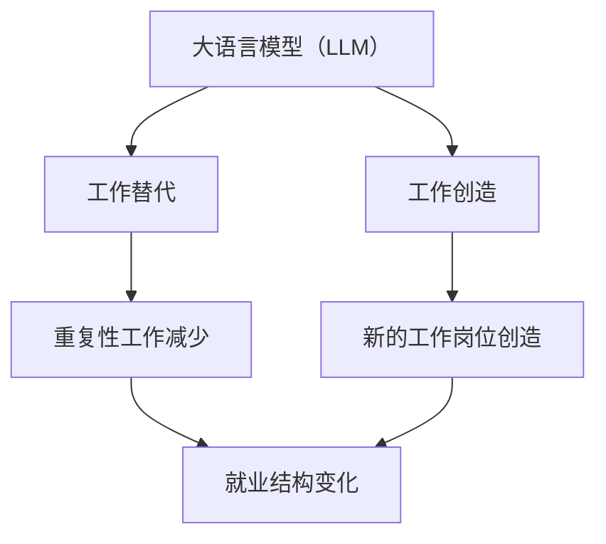

                 

**大语言模型（LLM）对就业的影响：工作替代与创造**

## 1. 背景介绍

大语言模型（LLM）是一种先进的人工智能技术，通过学习大量文本数据来理解和生成人类语言。随着LLM技术的发展，它开始在各行各业得到广泛应用，从而引发了人们对其对就业影响的关注和担忧。本文将深入探讨LLM对就业的影响，包括工作替代和创造两个方面。

## 2. 核心概念与联系

### 2.1 大语言模型（LLM）的定义

大语言模型（LLM）是一种深度学习模型，旨在理解和生成人类语言。它通过学习大量文本数据来建立语言的统计特征，从而能够生成相似的文本。

### 2.2 LLM与就业的联系

LLM的发展和应用与就业有着密切的联系。一方面，LLM可以自动完成一些重复性工作，从而替代人工劳动力。另一方面，LLM也可以创造新的工作岗位，如开发和维护LLM系统的工作。

### 2.3 LLM与就业的关系图



## 3. 核心算法原理 & 具体操作步骤

### 3.1 算法原理概述

LLM的核心算法原理是基于Transformer模型，该模型使用自注意力机制（Self-Attention）来理解和生成文本。自注意力机制允许模型在处理文本时考虑到上下文信息，从而生成更准确和连贯的文本。

### 3.2 算法步骤详解

1. **数据预处理**：收集大量文本数据，并对其进行预处理，如分词和标记化。
2. **模型训练**：使用预处理后的数据训练Transformer模型，以学习语言的统计特征。
3. **模型微调**：根据具体任务对模型进行微调，如文本生成或分类任务。
4. **模型部署**：将训练好的模型部署到生产环境中，以提供相应的服务。

### 3.3 算法优缺点

**优点**：

* 可以理解和生成人类语言，从而自动完成一些重复性工作。
* 可以创造新的工作岗位，如开发和维护LLM系统的工作。

**缺点**：

* 可能导致一些重复性工作岗位消失。
* 存在伦理和偏见问题，如模型可能生成带有偏见的文本。

### 3.4 算法应用领域

LLM的应用领域非常广泛，包括文本生成、翻译、问答系统、搜索引擎等。随着技术的发展，LLM的应用领域还在不断扩展。

## 4. 数学模型和公式 & 详细讲解 & 举例说明

### 4.1 数学模型构建

LLM的数学模型是基于Transformer模型构建的。Transformer模型使用自注意力机制来理解和生成文本。自注意力机制可以表示为：

$$Attention(Q, K, V) = softmax(\frac{QK^T}{\sqrt{d_k}})V$$

其中，$Q$, $K$, $V$分别是查询、键和值向量，$d_k$是键向量的维度。

### 4.2 公式推导过程

自注意力机制的推导过程如下：

1. 将输入文本转换为查询、键和值向量。
2. 计算查询和键向量的点积，并除以键向量的维度的平方根。
3. 使用softmax函数对上一步的结果进行缩放，得到注意力权重。
4. 使用注意力权重对值向量进行加权求和，得到最终的输出向量。

### 4.3 案例分析与讲解

例如，在文本生成任务中，模型需要预测下一个单词。模型会将前面的文本转换为查询、键和值向量，并使用自注意力机制来考虑上下文信息。然后，模型会根据注意力权重对值向量进行加权求和，得到最终的输出向量。最后，模型会选择概率最高的单词作为下一个单词的预测结果。

## 5. 项目实践：代码实例和详细解释说明

### 5.1 开发环境搭建

要开发LLM项目，需要搭建一个Python开发环境，并安装相关的库，如Transformers库。

### 5.2 源代码详细实现

以下是一个简单的LLM文本生成示例：

```python
from transformers import AutoTokenizer, AutoModelForCausalLM

tokenizer = AutoTokenizer.from_pretrained("bigscience/bloom-560m")
model = AutoModelForCausalLM.from_pretrained("bigscience/bloom-560m")

inputs = tokenizer("Hello, I'm a language model", return_tensors="pt")
outputs = model.generate(inputs["input_ids"], max_length=50)
print(tokenizer.decode(outputs[0]))
```

### 5.3 代码解读与分析

在上述代码中，我们首先加载预训练的LLM模型。然后，我们使用模型的标记器对输入文本进行编码。接着，我们使用模型的生成函数来预测下一个单词。最后，我们解码输出向量，并打印生成的文本。

### 5.4 运行结果展示

运行上述代码后，模型可能会生成以下文本：

"Hello, I'm a language model. I can understand and generate human language. I can help you with a variety of tasks, such as text generation, translation, and question answering."

## 6. 实际应用场景

### 6.1 当前应用场景

LLM当前的应用场景包括文本生成、翻译、问答系统、搜索引擎等。例如，LLM可以用于自动生成新闻标题，或帮助用户回答复杂的问题。

### 6.2 未来应用展望

随着技术的发展，LLM的应用领域还在不断扩展。未来，LLM可能会应用于更多的领域，如医疗、金融和教育等。此外，LLM还可能会与其他技术结合，如虚拟现实和增强现实，从而创造出全新的应用场景。

## 7. 工具和资源推荐

### 7.1 学习资源推荐

* "Attention is All You Need"论文：<https://arxiv.org/abs/1706.03762>
* Transformers库：<https://huggingface.co/transformers/>
* LLM的在线示例：<https://huggingface.co/spaces>

### 7.2 开发工具推荐

* Python：<https://www.python.org/>
* PyTorch：<https://pytorch.org/>
* TensorFlow：<https://www.tensorflow.org/>

### 7.3 相关论文推荐

* "Language Models are Few-Shot Learners"：<https://arxiv.org/abs/2005.14165>
* "Emergent Abilities of Large Language Models"：<https://arxiv.org/abs/2206.11763>

## 8. 总结：未来发展趋势与挑战

### 8.1 研究成果总结

LLM技术已经取得了显著的进展，并开始在各行各业得到广泛应用。然而，LLM技术仍然面临着许多挑战，如伦理和偏见问题。

### 8.2 未来发展趋势

未来，LLM技术将继续发展，并可能会与其他技术结合，如虚拟现实和增强现实。此外，LLM技术还可能会应用于更多的领域，如医疗、金融和教育等。

### 8.3 面临的挑战

LLM技术面临的挑战包括：

* **伦理和偏见问题**：LLM模型可能会生成带有偏见的文本，从而导致伦理问题。
* **计算资源问题**：LLM模型需要大量的计算资源，从而限制了其应用范围。
* **数据问题**：LLM模型需要大量的数据来进行训练，从而可能会导致数据泄露和隐私问题。

### 8.4 研究展望

未来，LLM技术的研究将会集中在以下几个方面：

* **伦理和偏见问题**：研究如何解决LLM模型的伦理和偏见问题。
* **计算资源问题**：研究如何优化LLM模型的计算资源需求。
* **数据问题**：研究如何保护LLM模型训练数据的隐私和安全。

## 9. 附录：常见问题与解答

### 9.1 LLM会取代人类工作吗？

LLM可以自动完成一些重复性工作，从而替代人工劳动力。然而，LLM也可以创造新的工作岗位，如开发和维护LLM系统的工作。因此，LLM对就业的影响是复杂的，需要综合考虑各种因素。

### 9.2 LLM的伦理和偏见问题如何解决？

解决LLM的伦理和偏见问题需要从多个角度进行研究，包括数据收集、模型训练和模型部署等各个环节。此外，还需要建立相关的标准和规范，以指导LLM的开发和应用。

### 9.3 LLM的未来发展方向是什么？

LLM的未来发展方向包括与其他技术结合，如虚拟现实和增强现实，并应用于更多的领域，如医疗、金融和教育等。此外，还需要解决LLM的伦理和偏见问题，以及计算资源和数据问题。

## 作者：禅与计算机程序设计艺术 / Zen and the Art of Computer Programming

