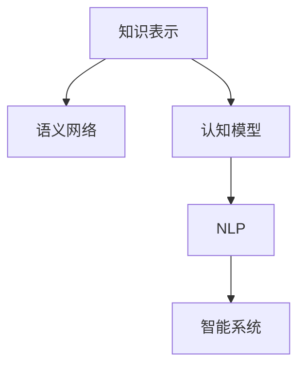

                 

# 人类的知识本质：一场永不停歇的探索之旅

> 关键词：知识表示,语义网络,认知模型,自然语言处理,NLP,智能系统,深度学习,人机交互

## 1. 背景介绍

### 1.1 问题的由来

知识是人类智慧的结晶，也是人类文明进步的重要动力。从古代的甲骨文到现代的数字化信息，知识的表达和传播方式一直在不断演变。然而，随着信息量的爆炸式增长，传统知识表示和传播的方式已无法满足日益复杂的信息处理需求。人们需要新的知识表示和获取方法，以应对这一挑战。

### 1.2 问题的核心关键点

现代知识表示的核心在于如何有效地组织、存储和检索信息。这包括两个主要问题：

1. 知识表示：如何将人类的知识形式化、数字化，以适应计算机处理？
2. 知识检索：如何高效地从庞大的知识库中检索出需要的信息？

这两个问题紧密相连，相辅相成。知识表示的质量直接决定了知识检索的效率和准确性。因此，研究高效的知识表示方法，对于提升智能系统的性能至关重要。

## 2. 核心概念与联系

### 2.1 核心概念概述

为更好地理解现代知识表示的原理和应用，本节将介绍几个密切相关的核心概念：

- 知识表示(Knowledge Representation)：指将人类知识形式化、结构化、数字化，使其能够被计算机处理的过程。常见的知识表示方法包括符号表示、向量表示、图表示等。
- 语义网络(Semantic Network)：一种基于图结构的知识表示方法，将知识表示为实体、属性和关系的组合。
- 认知模型(Cognitive Model)：模仿人脑认知过程的计算模型，用于理解、推理和生成人类语言。
- 自然语言处理(NLP)：计算机科学与语言学交叉的学科，研究如何让计算机理解和处理人类语言。
- 智能系统(Intelligent System)：基于知识和规则，能够自主学习、推理和决策的计算机系统。

这些核心概念之间的逻辑关系可以通过以下Mermaid流程图来展示：



这个流程图展示了几类知识表示方法之间的联系：

1. 知识表示是基础，将人类知识形式化。
2. 语义网络通过图结构表示知识，便于计算。
3. 认知模型模仿人脑，理解自然语言。
4. NLP研究如何让计算机处理自然语言，实现语言理解。
5. 智能系统基于NLP和认知模型，进行知识推理和决策。

这些概念共同构成了现代知识表示的理论框架，为后续的深入探讨奠定了基础。

## 3. 核心算法原理 & 具体操作步骤
### 3.1 算法原理概述

现代知识表示的核心算法包括知识表示、知识推理和知识检索。以下将逐一介绍这些核心算法的基本原理和操作步骤。

### 3.2 算法步骤详解

**Step 1: 知识表示**

知识表示是将人类知识形式化、结构化的过程。常见的知识表示方法包括符号表示和向量表示。

- **符号表示**：通过使用单词、变量、函数等符号，表达知识的形式化语言。例如，谓词逻辑就是符号表示的一种形式。
- **向量表示**：将知识表示为向量形式，便于计算机处理。常见的向量表示方法包括词嵌入、实体嵌入、关系嵌入等。

**Step 2: 知识推理**

知识推理是使用知识表示进行逻辑推理的过程，常见的知识推理方法包括逻辑推理、神经网络推理等。

- **逻辑推理**：基于谓词逻辑等形式化语言，进行推理计算。逻辑推理的方法有前向链推理、后向链推理、因果推理等。
- **神经网络推理**：使用神经网络模型进行推理计算，如注意力机制、Transformer等。

**Step 3: 知识检索**

知识检索是从知识库中查找符合条件的知识的过程，常见的知识检索方法包括基于规则的检索、基于统计的检索等。

- **基于规则的检索**：使用知识库中的规则进行检索。
- **基于统计的检索**：使用机器学习模型，学习知识库的统计规律，进行检索。

### 3.3 算法优缺点

知识表示和推理的算法具有以下优点：

- 形式化、结构化：将知识表示为符号或向量形式，便于计算机处理。
- 逻辑推理：基于形式化语言进行推理计算，具有较高的逻辑严密性。

同时，这些算法也存在以下局限性：

- 复杂度高：符号表示和逻辑推理的计算复杂度高，难以处理大规模知识库。
- 泛化能力差：基于规则的检索方法难以应对新出现的知识，缺乏泛化能力。

知识检索的算法具有以下优点：

- 高效性：基于统计的检索方法能够高效地检索知识。
- 灵活性：统计模型能够适应新出现的知识，具有一定的泛化能力。

同时，这些算法也存在以下局限性：

- 依赖数据：基于统计的检索方法依赖于训练数据，数据质量直接影响检索效果。
- 可解释性差：统计模型难以解释推理过程，缺乏透明度。

## 4. 数学模型和公式 & 详细讲解 & 举例说明

### 4.1 数学模型构建

知识表示和推理的数学模型可以简单地用符号逻辑公式表示。以下以谓词逻辑为例，介绍知识表示和推理的数学模型构建过程。

**知识表示**

谓词逻辑是一种形式化语言，用于表示知识。基本的谓词逻辑语句可以表示为：

$$ P(x_1, x_2, ..., x_n) $$

其中，$P$ 是一个谓词，$x_1, x_2, ..., x_n$ 是变量。例如，“John is a student”可以表示为：

$$ \text{isStudent}(John) $$

**知识推理**

在谓词逻辑中，推理过程可以使用规则进行表示。例如，规则 1 表示“如果John是学生，那么John属于学生群体”：

$$ \text{isStudent}(John) \rightarrow \text{isInGroup}(John, \text{students}) $$

规则 2 表示“如果John属于学生群体，那么John属于学生群体”：

$$ \text{isInGroup}(John, \text{students}) \rightarrow \text{isInGroup}(John, \text{students}) $$

根据这些规则，我们可以使用谓词逻辑推理出 John 属于学生群体。

### 4.2 公式推导过程

以下是知识表示和推理的数学模型构建过程：

1. **知识表示**

   $$ P(x_1, x_2, ..., x_n) $$

2. **知识推理**

   $$ \text{isStudent}(John) \rightarrow \text{isInGroup}(John, \text{students}) $$

   $$ \text{isInGroup}(John, \text{students}) \rightarrow \text{isInGroup}(John, \text{students}) $$

3. **推理计算**

   $$ \text{isStudent}(John) \rightarrow \text{isInGroup}(John, \text{students}) $$

4. **推理结果**

   $$ \text{isInGroup}(John, \text{students}) $$

通过以上步骤，我们可以使用谓词逻辑表示知识，并进行推理计算，得到推理结果。

### 4.3 案例分析与讲解

以医疗知识表示和推理为例，介绍知识表示和推理的应用。

**知识表示**

在医疗领域，知识可以表示为一系列的事实和规则。例如，事实 1 表示“如果患者是高血压，那么需要药物治疗”：

$$ \text{isHypertension}(patient) \rightarrow \text{needsMedication}(patient) $$

事实 2 表示“如果患者需要药物治疗，那么需要定期复查”：

$$ \text{needsMedication}(patient) \rightarrow \text{needsFollowUp}(patient) $$

**知识推理**

根据这些事实和规则，我们可以推理出，如果患者是高血压，那么需要定期复查。例如：

$$ \text{isHypertension}(patient) \rightarrow \text{needsMedication}(patient) \rightarrow \text{needsFollowUp}(patient) $$

这样，医生就可以根据病人的症状和历史数据，进行精确的诊断和治疗。

## 5. 项目实践：代码实例和详细解释说明

### 5.1 开发环境搭建

在进行知识表示和推理的实践前，我们需要准备好开发环境。以下是使用Python进行Sympy库开发的环境配置流程：

1. 安装Anaconda：从官网下载并安装Anaconda，用于创建独立的Python环境。

2. 创建并激活虚拟环境：
```bash
conda create -n sympy-env python=3.8 
conda activate sympy-env
```

3. 安装Sympy：
```bash
pip install sympy
```

4. 安装各类工具包：
```bash
pip install numpy pandas scikit-learn matplotlib tqdm jupyter notebook ipython
```

完成上述步骤后，即可在`sympy-env`环境中开始项目实践。

### 5.2 源代码详细实现

下面我们以谓词逻辑推理为例，给出使用Sympy库进行知识表示和推理的Python代码实现。

首先，定义谓词逻辑的事实和规则：

```python
from sympy import symbols, And, Or

# 定义变量
x, y, z = symbols('x y z')

# 定义事实
fact1 = And(x, y, z)
fact2 = And(y, z)

# 定义规则
rule1 = And(x, fact1)
rule2 = And(fact2, fact2)

# 定义推理
inference = And(rule1, rule2)
```

然后，进行推理计算：

```python
# 推理计算
result = inference.subs({x: True, y: True, z: True})
print(result)
```

### 5.3 代码解读与分析

让我们再详细解读一下关键代码的实现细节：

**符号表示**

- `symbols`函数：用于定义变量。

**事实表示**

- `And`函数：表示逻辑与。

**规则表示**

- `And`函数：表示逻辑与。

**推理计算**

- `subs`方法：替换变量，进行推理计算。

通过以上步骤，我们完成了使用Sympy库进行谓词逻辑推理的完整代码实现。

## 6. 实际应用场景

### 6.1 医疗知识管理

在医疗领域，知识表示和推理技术可以应用于病历管理、临床决策支持、个性化治疗等场景。

- **病历管理**：将病历数据表示为知识库，使用推理技术进行诊断和治疗。
- **临床决策支持**：利用知识库进行临床推理，辅助医生进行诊断和治疗决策。
- **个性化治疗**：根据患者的症状和历史数据，使用推理技术进行个性化治疗。

### 6.2 金融风险控制

在金融领域，知识表示和推理技术可以应用于信用评估、风险控制、投资决策等场景。

- **信用评估**：将客户数据表示为知识库，使用推理技术进行信用评估。
- **风险控制**：利用知识库进行风险推理，辅助金融机构进行风险控制。
- **投资决策**：根据市场数据和知识库，使用推理技术进行投资决策。

### 6.3 智能客服系统

在智能客服领域，知识表示和推理技术可以应用于智能问答、客户分类、情绪分析等场景。

- **智能问答**：将知识库中的问题-答案对表示为知识库，使用推理技术进行智能问答。
- **客户分类**：利用知识库进行客户分类，提高客服系统的个性化服务。
- **情绪分析**：根据客户对话，使用推理技术进行情绪分析，提高客服系统的互动质量。

### 6.4 未来应用展望

随着知识表示和推理技术的不断发展，其在更多领域得到应用，为各行各业带来变革性影响。

- **智慧医疗**：知识表示和推理技术可以应用于医疗知识管理、临床决策支持、个性化治疗等场景，提高医疗服务的智能化水平。
- **智能金融**：知识表示和推理技术可以应用于金融风险控制、信用评估、投资决策等场景，提升金融服务的智能化水平。
- **智能客服**：知识表示和推理技术可以应用于智能问答、客户分类、情绪分析等场景，提高客服系统的智能化水平。
- **智能制造**：知识表示和推理技术可以应用于智能生产、设备维护、质量控制等场景，提高制造业的智能化水平。

## 7. 工具和资源推荐

### 7.1 学习资源推荐

为了帮助开发者系统掌握知识表示和推理的理论基础和实践技巧，这里推荐一些优质的学习资源：

1. 《人工智能导论》（周志华著）：介绍人工智能的基本概念、算法和应用，包括知识表示和推理。
2. 《自然语言处理综论》（Daniel Jurafsky和James H. Martin著）：介绍自然语言处理的原理和应用，包括知识表示和推理。
3. 《逻辑推理与智能系统》（Svetlana Bayram & Jacques Pienemann著）：介绍逻辑推理的方法和应用，包括知识表示和推理。
4. 《知识表示与推理》（Leslie Gechnery 著）：全面介绍知识表示和推理的基本概念、方法和应用。
5. 《符号人工智能》（Alberto Ninio 著）：介绍符号人工智能的基本概念、算法和应用，包括知识表示和推理。

通过对这些资源的学习实践，相信你一定能够快速掌握知识表示和推理的精髓，并用于解决实际的NLP问题。

### 7.2 开发工具推荐

高效的开发离不开优秀的工具支持。以下是几款用于知识表示和推理开发的常用工具：

1. PyTorch：基于Python的开源深度学习框架，灵活动态的计算图，适合快速迭代研究。
2. TensorFlow：由Google主导开发的开源深度学习框架，生产部署方便，适合大规模工程应用。
3. Sympy：Python中的符号计算库，支持符号表示、逻辑推理等高级功能。
4. OWL：基于Web的语义网络编辑器，支持知识表示和推理。
5. RDF：基于Web的知识表示语言，支持知识存储和检索。

合理利用这些工具，可以显著提升知识表示和推理任务的开发效率，加快创新迭代的步伐。

### 7.3 相关论文推荐

知识表示和推理技术的发展源于学界的持续研究。以下是几篇奠基性的相关论文，推荐阅读：

1. First Order Logic Programming：介绍一阶逻辑程序的设计和应用，是知识表示和推理的基础。
2. Rule-Based Expert Systems：介绍基于规则的知识表示和推理方法，是专家系统的重要组成部分。
3. Semantic Networks and Knowledge Representation：介绍语义网络的知识表示方法，是知识表示的常用技术。
4. Knowledge Representation in the Semantic Web：介绍基于Web的知识表示和推理方法，是语义网的重要技术。
5. A Survey of Rule-Based Reasoning：介绍规则推理的基本概念和方法，是知识推理的重要研究方向。

这些论文代表了大知识表示和推理技术的发展脉络。通过学习这些前沿成果，可以帮助研究者把握学科前进方向，激发更多的创新灵感。

## 8. 总结：未来发展趋势与挑战

### 8.1 总结

本文对知识表示和推理的理论基础进行了全面系统的介绍。首先阐述了知识表示和推理的研究背景和意义，明确了知识表示和推理在知识库构建、信息检索、推理计算等环节的重要性。其次，从原理到实践，详细讲解了知识表示和推理的数学模型和操作步骤，给出了知识表示和推理任务开发的完整代码实例。同时，本文还广泛探讨了知识表示和推理技术在医疗、金融、智能客服等多个行业领域的应用前景，展示了知识表示和推理技术的广阔应用前景。

通过本文的系统梳理，可以看到，知识表示和推理技术正在成为NLP领域的重要范式，极大地拓展了知识的表达和处理能力，为人工智能系统提供了坚实的知识基础。未来，伴随知识表示和推理方法的持续演进，相信人工智能系统将能够更好地理解和应用人类知识，实现更高的智能水平。

### 8.2 未来发展趋势

展望未来，知识表示和推理技术将呈现以下几个发展趋势：

1. 知识图谱的崛起：知识图谱作为结构化的知识表示方法，能够更好地表达实体之间的关系。未来的知识表示和推理技术将更加注重知识图谱的应用，提升知识的表示和推理能力。
2. 自然语言推理的普及：自然语言推理能够更好地理解和推理人类语言。未来的知识表示和推理技术将更加注重自然语言推理的应用，提升知识推理的智能水平。
3. 认知模型的发展：认知模型能够更好地模仿人脑的认知过程，提升知识推理的准确性。未来的知识表示和推理技术将更加注重认知模型的发展，提升知识推理的智能水平。
4. 多模态融合：知识表示和推理技术将更加注重多模态数据的融合，提升知识推理的全面性。
5. 跨领域应用：知识表示和推理技术将更加注重跨领域应用，提升知识的通用性。

以上趋势凸显了知识表示和推理技术的广阔前景。这些方向的探索发展，必将进一步提升知识表示和推理系统的性能和应用范围，为人工智能系统提供更全面、更准确的知识基础。

### 8.3 面临的挑战

尽管知识表示和推理技术已经取得了瞩目成就，但在迈向更加智能化、普适化应用的过程中，它仍面临着诸多挑战：

1. 知识图谱构建：知识图谱的构建需要大量的人工标注，成本高且复杂。如何自动构建知识图谱，提升知识表示的准确性，是一个亟待解决的问题。
2. 推理准确性：知识推理的准确性受到知识图谱的质量和推理模型的性能影响。如何提升知识推理的准确性，是一个亟待解决的问题。
3. 推理可解释性：知识推理模型的可解释性较差，难以解释推理过程。如何提升知识推理的可解释性，是一个亟待解决的问题。
4. 知识更新：知识表示和推理技术需要不断更新知识库，以适应不断变化的环境。如何高效更新知识库，提升知识推理的实时性，是一个亟待解决的问题。
5. 跨领域应用：知识表示和推理技术在不同领域的应用，需要针对具体领域进行优化。如何提升知识推理的跨领域应用能力，是一个亟待解决的问题。

### 8.4 研究展望

面对知识表示和推理技术所面临的挑战，未来的研究需要在以下几个方面寻求新的突破：

1. 自动构建知识图谱：研究自动构建知识图谱的方法，提升知识表示的准确性。
2. 提升推理准确性：研究更高效的推理算法，提升知识推理的准确性。
3. 提升推理可解释性：研究可解释性较强的推理模型，提升知识推理的可解释性。
4. 高效更新知识库：研究高效更新知识库的方法，提升知识推理的实时性。
5. 提升跨领域应用能力：研究跨领域应用的方法，提升知识推理的通用性。

这些研究方向的探索，必将引领知识表示和推理技术迈向更高的台阶，为构建智能化的知识系统铺平道路。面向未来，知识表示和推理技术还需要与其他人工智能技术进行更深入的融合，如自然语言处理、认知模型等，协同发力，共同推动知识表示和推理系统的进步。只有勇于创新、敢于突破，才能不断拓展知识表示和推理技术的边界，让智能技术更好地服务人类。

## 9. 附录：常见问题与解答

**Q1：知识表示和推理的算法是否适用于所有领域？**

A: 知识表示和推理算法具有广泛的应用前景，但在特定领域可能需要进行优化和调整。例如，在医疗领域，需要引入医学知识图谱和医疗领域特有的推理规则，以适应该领域的知识表示和推理需求。

**Q2：如何评估知识表示和推理算法的性能？**

A: 知识表示和推理算法的性能评估可以通过以下几个指标进行：

1. 准确性：知识推理的准确性是评估的核心指标。
2. 推理效率：知识推理的效率是评估的重要指标。
3. 可解释性：知识推理的可解释性是评估的重要指标。
4. 泛化能力：知识推理的泛化能力是评估的重要指标。
5. 可扩展性：知识推理的可扩展性是评估的重要指标。

这些指标可以通过实验和测试进行评估，并根据具体应用场景进行优化。

**Q3：知识表示和推理算法的资源需求如何？**

A: 知识表示和推理算法的资源需求主要取决于知识库的大小和推理模型的复杂度。一般来说，知识库越大，推理模型的复杂度越高，所需的资源也就越多。在实际应用中，可以通过优化算法、压缩数据等方法，降低资源需求。

**Q4：知识表示和推理算法如何适应新出现的知识？**

A: 知识表示和推理算法需要定期更新知识库，以适应新出现的知识。可以通过知识获取、知识推理等方法，自动更新知识库。同时，需要引入先验知识，提升知识推理的泛化能力。

**Q5：知识表示和推理算法在实际应用中如何实现？**

A: 知识表示和推理算法的实现需要以下几个步骤：

1. 知识表示：将知识表示为符号或向量形式。
2. 知识推理：使用规则或神经网络进行推理计算。
3. 知识检索：从知识库中检索出符合条件的知识。

在实际应用中，需要根据具体需求进行优化和调整，以实现最佳效果。

---

作者：禅与计算机程序设计艺术 / Zen and the Art of Computer Programming

