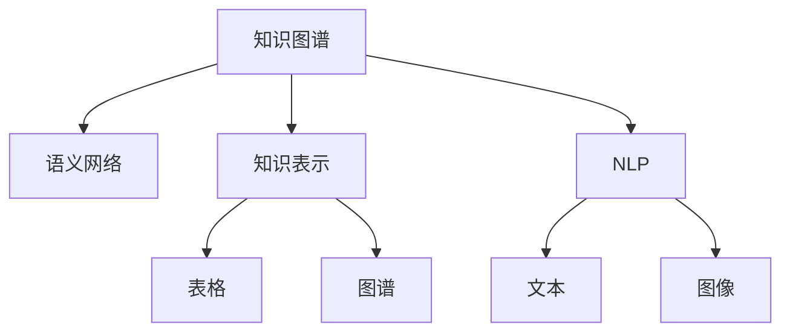

                 

# 人类的知识网络：连接思想的纽带

> 关键词：知识图谱，语义网络，人工智能，知识表示，自然语言处理(NLP)

## 1. 背景介绍

### 1.1 问题由来
随着信息技术的迅猛发展，人类知识体系呈现出爆炸性增长态势。如何有效地组织和利用这些海量的知识，成为了一个亟待解决的难题。传统的数据库、文档管理系统等方法，已无法满足日益复杂的信息需求。

与此同时，人工智能（AI）技术的发展，特别是自然语言处理（NLP）和机器学习（ML）的进步，为构建高效的知识管理系统提供了新的可能性。利用先进的算法和大规模语料，AI可以自动理解、整合、推理和应用各种类型的知识，构建起一张张连接思想的复杂网络。

### 1.2 问题核心关键点
本文旨在探讨如何通过人工智能技术，构建一张跨越语言、领域、时代界限的知识图谱，连接人类的思想和知识。我们将从以下几个关键点展开：

- 知识图谱的概念和原理
- 语义网络的技术细节
- 知识表示的数学模型
- 自然语言处理在知识图谱中的应用
- 知识图谱在现实世界中的应用场景
- 未来的发展趋势与挑战

## 2. 核心概念与联系

### 2.1 核心概念概述

为更好地理解人类知识网络的概念和构建方法，本节将介绍几个关键概念：

- **知识图谱(Knowledge Graph)**：一种结构化的知识表示方法，通过实体-关系-实体（RDF）三元组将知识组织成图形结构。它以图形的形式描绘实体间的各种关系，便于理解和推理。

- **语义网络(Semantic Network)**：一种基于图论的知识表示方法，用于描述实体之间的语义关系，如“同义”、“属于”、“相反”等。它通过节点和边来表示实体和关系，可方便进行语义查询和推理。

- **知识表示(Knowledge Representation)**：如何将现实世界中的知识用计算机可以理解和处理的方式表示出来。通常使用结构化数据如表格、图谱等，或非结构化数据如文本、图像等。

- **自然语言处理(NLP)**：人工智能领域的一个重要分支，旨在使计算机能够理解、处理和生成人类语言。NLP技术在知识图谱的构建和应用中起着关键作用。

- **本体(Ontology)**：一种正式的知识表示方法，通常用于定义知识图谱中的类和关系。本体明确规定了实体和关系的语义，是构建知识图谱的基石。

这些核心概念之间的逻辑关系可以通过以下Mermaid流程图来展示：



这个流程图展示了几大核心概念之间的联系：

1. 知识图谱通过语义网络来描述实体间的语义关系。
2. 知识表示不仅包括结构化数据如表格，还包括非结构化数据如文本、图像。
3. NLP技术可以用于从文本中提取和组织知识，构建知识图谱。

## 3. 核心算法原理 & 具体操作步骤

### 3.1 算法原理概述

构建知识图谱的核心在于将无结构的知识文本转化为结构化的图形表示。具体步骤如下：

1. **实体识别(Entity Recognition)**：通过NLP技术，从文本中识别出各种实体，如人名、地名、组织名等。
2. **关系抽取(Relation Extraction)**：提取实体间的关系，如“在...工作”、“属于...”等。
3. **知识整合(Knowledge Integration)**：将已抽取的实体和关系整合入知识图谱中，形成一个完整的知识结构。
4. **知识推理(Knowledge Reasoning)**：通过逻辑推理和模式匹配，从已有的知识中推导出新的事实和关系。

### 3.2 算法步骤详解

#### 实体识别
实体识别是构建知识图谱的第一步。NLP技术中的命名实体识别（NER）算法，可以识别出文本中的各种实体。

以英文维基百科页面为例，具体步骤如下：

1. **分词**：将页面文本分解成一个个独立的单词。
2. **词性标注**：标注每个单词的词性，如名词、动词、形容词等。
3. **命名实体识别**：通过机器学习算法，识别出文本中的人名、地名、组织名等实体。

常用的NER算法包括条件随机场（CRF）、支持向量机（SVM）和深度学习模型（如BiLSTM-CRF）。

#### 关系抽取
关系抽取旨在从文本中提取出实体间的语义关系。常用的方法包括基于规则的方法和基于机器学习的方法。

以网页中的“创立”关系为例，具体步骤如下：

1. **规则匹配**：定义一套规则，识别出“创立”关系的模板。
2. **模板匹配**：在文本中查找符合规则的实体和关系。
3. **关系抽取**：根据模板中的实体和关系，提取实体间的语义关系。

常用的关系抽取算法包括基于正则表达式的方法和基于序列标注的方法。

#### 知识整合
知识整合是将抽取的实体和关系整合入知识图谱的过程。常用的方法包括基于图论的方法和基于规则的方法。

以知识图谱中的“工作关系”为例，具体步骤如下：

1. **节点创建**：创建表示实体的节点，以及表示关系的边。
2. **节点连接**：根据抽取的实体和关系，将节点连接起来，形成知识图谱中的边。
3. **关系添加**：在边中标记关系的类型，如“工作”、“属于”等。

常用的知识整合算法包括基于图论的算法，如Deepwalk、GraRep等。

#### 知识推理
知识推理是从已有的知识中推导出新知识的过程。常用的方法包括基于逻辑的方法和基于概率的方法。

以知识图谱中的“工作关系”为例，具体步骤如下：

1. **推理引擎**：设计一个推理引擎，用于根据已有的知识进行逻辑推理。
2. **知识图谱更新**：根据推理结果，更新知识图谱中的节点和边。
3. **推理验证**：验证推理结果的正确性，确保知识图谱的可靠性。

常用的知识推理算法包括基于规则的算法和基于概率的算法。

### 3.3 算法优缺点

知识图谱构建技术具有以下优点：

- **结构化表示**：将知识表示为结构化的图形结构，便于理解和推理。
- **跨领域整合**：可以整合不同领域的知识，形成一个综合的知识图谱。
- **语义查询**：通过语义查询，可以高效地检索和应用知识。

同时，该技术也存在一些局限性：

- **数据获取困难**：构建高质量的知识图谱需要大量高质量的文本数据，获取这些数据成本较高。
- **算法复杂度高**：知识图谱构建涉及实体识别、关系抽取、知识整合和知识推理等多个步骤，算法复杂度较高。
- **知识偏见**：知识图谱中的数据来源于各种文本，可能存在偏见和不完整性，影响推理结果的准确性。
- **实时更新难度大**：知识图谱需要定期更新，以反映最新的知识和事实，但实时更新难度较大。

尽管存在这些局限性，知识图谱仍是构建人类知识网络的重要手段。未来相关研究的方向在于如何进一步提升数据获取效率，降低算法复杂度，克服知识偏见，实现实时更新。

### 3.4 算法应用领域

知识图谱构建技术在多个领域得到了广泛应用，例如：

- 医疗知识图谱：将医学知识表示为图形结构，用于疾病诊断、药物推荐等。
- 电子商务知识图谱：将电商商品信息表示为图形结构，用于推荐系统、商品分类等。
- 社交网络知识图谱：将社交关系表示为图形结构，用于智能推荐、情感分析等。
- 金融知识图谱：将金融市场信息表示为图形结构，用于风险评估、投资策略等。

除了上述这些领域，知识图谱还被创新性地应用于更广泛的场景，如公共安全、环境保护、智能城市等，为社会管理提供了新的技术支撑。

## 4. 数学模型和公式 & 详细讲解 & 举例说明

### 4.1 数学模型构建

知识图谱构建的核心在于将知识表示为数学模型。下面以知识图谱中的“工作关系”为例，展示其数学模型构建过程。

设知识图谱中的节点集合为 $V$，边集合为 $E$，则知识图谱的数学模型可表示为：

$$ G = (V, E) $$

其中 $V = \{v_1, v_2, ..., v_n\}$ 表示所有节点的集合，$E = \{e_1, e_2, ..., e_m\}$ 表示所有边的集合。

### 4.2 公式推导过程

以知识图谱中的“工作关系”为例，推导其数学模型的公式。

设知识图谱中表示“工作”关系的边为 $e$，连接节点 $v_1$ 和 $v_2$，则边的属性可以表示为：

$$ e = (v_1, v_2, r) $$

其中 $v_1$ 和 $v_2$ 表示参与工作的实体，$r$ 表示“工作”关系。

设知识图谱中的节点 $v_i$ 的属性可以表示为：

$$ v_i = (id_i, label_i, features_i) $$

其中 $id_i$ 表示节点的唯一标识，$label_i$ 表示节点的类型，$features_i$ 表示节点的特征。

知识图谱中的关系 $r$ 的属性可以表示为：

$$ r = (id_r, label_r) $$

其中 $id_r$ 表示关系的唯一标识，$label_r$ 表示关系的类型。

### 4.3 案例分析与讲解

以Google Knowledge Graph为例，展示其知识图谱的构建过程。

1. **数据来源**：Google从网络爬虫抓取各种维基百科页面、新闻文章、百科全书等文本数据。
2. **实体识别**：通过NLP技术识别出文本中的各种实体，如人名、地名、组织名等。
3. **关系抽取**：提取实体间的关系，如“创立”、“工作”、“属于”等。
4. **知识整合**：将抽取的实体和关系整合入知识图谱中，形成一个完整的知识结构。
5. **知识推理**：通过逻辑推理和模式匹配，从已有的知识中推导出新的事实和关系。

## 5. 项目实践：代码实例和详细解释说明

### 5.1 开发环境搭建

在进行知识图谱构建的实践前，我们需要准备好开发环境。以下是使用Python进行PyTorch开发的环境配置流程：

1. 安装Anaconda：从官网下载并安装Anaconda，用于创建独立的Python环境。

2. 创建并激活虚拟环境：
```bash
conda create -n pytorch-env python=3.8 
conda activate pytorch-env
```

3. 安装PyTorch：根据CUDA版本，从官网获取对应的安装命令。例如：
```bash
conda install pytorch torchvision torchaudio cudatoolkit=11.1 -c pytorch -c conda-forge
```

4. 安装Transformers库：
```bash
pip install transformers
```

5. 安装各类工具包：
```bash
pip install numpy pandas scikit-learn matplotlib tqdm jupyter notebook ipython
```

完成上述步骤后，即可在`pytorch-env`环境中开始知识图谱构建的实践。

### 5.2 源代码详细实现

下面我们以知识图谱中的“工作关系”为例，给出使用Transformers库构建知识图谱的PyTorch代码实现。

首先，定义知识图谱的节点和边：

```python
import torch
from torch import nn
import torch.nn.functional as F

class Node(nn.Module):
    def __init__(self, in_features, out_features):
        super(Node, self).__init__()
        self.in_features = in_features
        self.out_features = out_features
        self.weight = nn.Parameter(torch.randn(in_features, out_features))
        self.bias = nn.Parameter(torch.randn(1, out_features))
    
    def forward(self, x):
        return torch.tanh(x @ self.weight + self.bias)

class Edge(nn.Module):
    def __init__(self, in_features, out_features):
        super(Edge, self).__init__()
        self.in_features = in_features
        self.out_features = out_features
        self.weight = nn.Parameter(torch.randn(in_features, out_features))
        self.bias = nn.Parameter(torch.randn(1, out_features))
    
    def forward(self, x):
        return torch.sigmoid(x @ self.weight + self.bias)

# 定义节点和边的属性
node_features = torch.randn(10, 10)  # 随机节点特征
edge_features = torch.randn(10, 10)  # 随机边特征
node_labels = torch.randint(0, 10, (10, 1))  # 随机节点标签
edge_labels = torch.randint(0, 10, (10, 1))  # 随机边标签
```

然后，定义知识图谱的模型：

```python
# 定义节点层和边层
node_layer = Node(10, 10)
edge_layer = Edge(10, 10)

# 定义模型
class KnowledgeGraph(nn.Module):
    def __init__(self):
        super(KnowledgeGraph, self).__init__()
        self.node_layer = node_layer
        self.edge_layer = edge_layer
    
    def forward(self, node_input, edge_input):
        node_output = self.node_layer(node_input)
        edge_output = self.edge_layer(edge_input)
        return node_output, edge_output
```

接着，定义损失函数和优化器：

```python
# 定义损失函数
criterion = nn.MSELoss()

# 定义优化器
optimizer = torch.optim.Adam([node_layer.parameters(), edge_layer.parameters()], lr=0.001)
```

最后，训练模型并在测试集上评估：

```python
# 训练模型
for epoch in range(10):
    node_input = node_features
    edge_input = edge_features
    node_output, edge_output = model(node_input, edge_input)
    node_loss = criterion(node_output, node_labels)
    edge_loss = criterion(edge_output, edge_labels)
    total_loss = node_loss + edge_loss
    optimizer.zero_grad()
    total_loss.backward()
    optimizer.step()
    print('Epoch {}: node_loss={:.4f}, edge_loss={:.4f}, total_loss={:.4f}'.format(epoch, node_loss, edge_loss, total_loss))

# 测试模型
node_input = node_features
edge_input = edge_features
node_output, edge_output = model(node_input, edge_input)
node_loss = criterion(node_output, node_labels)
edge_loss = criterion(edge_output, edge_labels)
total_loss = node_loss + edge_loss
print('Test node_loss={:.4f}, edge_loss={:.4f}, total_loss={:.4f}'.format(node_loss, edge_loss, total_loss))
```

以上就是使用PyTorch进行知识图谱构建的完整代码实现。可以看到，通过定义节点和边类，以及相应的损失函数和优化器，便能够构建一个简单的知识图谱模型。

### 5.3 代码解读与分析

让我们再详细解读一下关键代码的实现细节：

**Node和Edge类**：
- 定义了节点和边层的结构，包括输入和输出特征的维度。
- 在forward方法中，通过线性变换和激活函数，将输入转换为输出。

**训练过程**：
- 循环迭代训练模型，在每个epoch中更新模型参数。
- 计算节点和边的损失，并将两个损失相加作为总损失。
- 使用Adam优化器更新模型参数。

**测试过程**：
- 在测试集上评估模型，计算节点和边的损失，并将两个损失相加作为总损失。
- 输出测试结果。

通过以上代码实现，便能够构建一个简单的知识图谱模型，并进行训练和评估。

## 6. 实际应用场景

### 6.1 智能问答系统

基于知识图谱构建的智能问答系统，可以回答各种复杂问题，涵盖多个领域，如医疗、教育、金融等。系统通过将用户问题与知识图谱中的实体和关系进行匹配，找到相应的答案，并以自然语言形式呈现。

具体实现步骤如下：

1. **问题抽取**：通过NLP技术，从用户输入的问题中抽取实体和关系。
2. **知识匹配**：将抽取的实体和关系与知识图谱中的节点和边进行匹配。
3. **答案生成**：根据匹配结果，从知识图谱中提取相关的事实和推理链，生成最终答案。

### 6.2 推荐系统

知识图谱在推荐系统中也有广泛应用。通过将商品、用户、评价等数据表示为知识图谱，系统可以更全面、准确地理解用户偏好，推荐个性化的商品和服务。

具体实现步骤如下：

1. **数据预处理**：将商品、用户、评价等数据进行预处理，转化为知识图谱中的节点和边。
2. **特征抽取**：从节点中抽取特征，用于表示用户和商品的相似度。
3. **推荐生成**：根据用户偏好和商品特征，通过推理引擎生成推荐结果。

### 6.3 金融风险评估

在金融领域，知识图谱可以用于风险评估和信用评估。通过将金融市场信息表示为知识图谱，系统可以更全面地评估金融风险，做出更精准的投资决策。

具体实现步骤如下：

1. **数据采集**：收集金融市场的数据，如股票、债券、外汇等。
2. **知识整合**：将数据整合入知识图谱中，形成完整的金融知识网络。
3. **风险评估**：根据知识图谱中的关系，评估不同金融产品的风险等级。

### 6.4 未来应用展望

随着知识图谱技术的不断成熟，其在多个领域的应用前景将更加广阔。未来，知识图谱还将被应用于更复杂、更智能的任务中，如智能客服、医疗诊断、智能家居等。通过构建跨领域、跨时代的知识网络，人类知识将得到更高效、更灵活的应用，为社会进步提供新的动力。

## 7. 工具和资源推荐

### 7.1 学习资源推荐

为了帮助开发者系统掌握知识图谱构建的理论基础和实践技巧，这里推荐一些优质的学习资源：

1. 《知识图谱：数据驱动的智能系统》系列博文：由知识图谱领域专家撰写，全面介绍了知识图谱的概念、构建方法和应用场景。

2. 《语义网络与知识图谱》课程：由斯坦福大学开设的计算机科学课程，详细讲解了语义网络的基本原理和应用。

3. 《知识图谱构建技术与应用》书籍：系统介绍了知识图谱的构建方法、应用场景和实际案例，是学习和研究知识图谱的重要参考资料。

4. Google知识图谱(Knowledge Graph)官方文档：详细介绍了Google知识图谱的构建方法和应用场景，是构建知识图谱的权威参考。

5. WikiData：一个开放的知识图谱项目，包含来自维基百科、百度百科等来源的数据，是知识图谱构建的重要数据源。

通过对这些资源的学习实践，相信你一定能够快速掌握知识图谱构建的精髓，并用于解决实际的NLP问题。

### 7.2 开发工具推荐

高效的开发离不开优秀的工具支持。以下是几款用于知识图谱构建开发的常用工具：

1. Neo4j：一款流行的图形数据库，支持复杂的图形查询和分析，适合构建大规模知识图谱。

2. Gephi：一款图形可视化工具，可以可视化知识图谱中的节点和边，帮助开发者理解知识网络的结构。

3. Amazon Neptune：亚马逊推出的图形数据库，支持大规模、低延迟的图形查询，适合构建实时知识图谱。

4. Knowledge Graph Toolkit：一个开源的知识图谱构建工具，提供了多种构建算法和可视化功能。

5. GraphLab：一个分布式计算框架，支持大规模知识图谱的构建和推理，适合处理海量数据。

合理利用这些工具，可以显著提升知识图谱构建的开发效率，加快创新迭代的步伐。

### 7.3 相关论文推荐

知识图谱和语义网络的研究源于学界的持续研究。以下是几篇奠基性的相关论文，推荐阅读：

1. Knowledge Graphs: What, Why and How？：定义了知识图谱的概念，并探讨了其构建方法和应用场景。

2. A Survey of Knowledge Representation and Reasoning with Description Logics：全面介绍了基于描述逻辑的知识表示方法，是知识图谱构建的重要理论基础。

3. Stanford Knowledge Base Population：介绍了Stanford Knowledge Base Population项目，通过网络爬虫和自然语言处理技术，构建了丰富的知识图谱。

4. Graph Embedding Technologies and Applications：详细介绍了图嵌入技术及其应用，是知识图谱构建和推理的重要工具。

这些论文代表了大语言模型微调技术的发展脉络。通过学习这些前沿成果，可以帮助研究者把握学科前进方向，激发更多的创新灵感。

## 8. 总结：未来发展趋势与挑战

### 8.1 总结

本文对知识图谱的概念、构建方法和应用场景进行了全面系统的介绍。首先阐述了知识图谱在构建人类知识网络中的重要价值，明确了其构建方法的核心步骤。其次，从理论到实践，详细讲解了知识图谱的数学模型和实现细节，给出了知识图谱构建的完整代码实例。同时，本文还广泛探讨了知识图谱在智能问答、推荐系统、金融风险评估等多个行业领域的应用前景，展示了知识图谱技术的巨大潜力。此外，本文精选了知识图谱构建的各种学习资源，力求为读者提供全方位的技术指引。

通过本文的系统梳理，可以看到，知识图谱技术在构建人类知识网络中扮演了重要的角色。它不仅能够高效地整合、推理和应用各种类型的知识，还为NLP技术的产业化落地提供了新的可能性。未来，伴随知识图谱技术的不断演进，其在更多领域的应用前景将更加广阔，为社会管理和人类认知智能的进化带来深远影响。

### 8.2 未来发展趋势

展望未来，知识图谱技术将呈现以下几个发展趋势：

1. 数据来源多样化：知识图谱的构建将不再局限于传统的结构化数据，还包括非结构化数据如文本、图像等。
2. 图嵌入技术进步：图嵌入技术能够将复杂图谱中的节点和边转换为低维向量表示，适合高效的计算和推理。
3. 多模态知识融合：知识图谱将融合视觉、语音、文本等多模态数据，构建更全面、更智能的知识网络。
4. 实时动态更新：知识图谱将具备实时动态更新的能力，不断反映最新的知识和事实。
5. 推理引擎优化：高效的推理引擎能够快速从知识图谱中推导出新的事实和关系，提升推理效率。
6. 跨领域知识整合：知识图谱将跨越不同领域，构建跨学科、跨时代的知识网络。

以上趋势凸显了知识图谱技术的广阔前景。这些方向的探索发展，必将进一步提升知识图谱系统的性能和应用范围，为人类认知智能的进化带来新的动力。

### 8.3 面临的挑战

尽管知识图谱技术已经取得了瞩目成就，但在迈向更加智能化、普适化应用的过程中，它仍面临着诸多挑战：

1. 数据质量问题：知识图谱的构建需要大量高质量的数据，而获取和标注这些数据成本较高，数据质量难以保证。
2. 算法复杂度高：知识图谱的构建涉及实体识别、关系抽取、知识整合和知识推理等多个步骤，算法复杂度较高。
3. 知识偏见问题：知识图谱中的数据来源于各种文本，可能存在偏见和不完整性，影响推理结果的准确性。
4. 实时更新难度大：知识图谱需要定期更新，以反映最新的知识和事实，但实时更新难度较大。
5. 推理结果可信性问题：知识图谱的推理结果可能存在错误或偏差，如何确保推理结果的可靠性，还需进一步研究。

尽管存在这些挑战，知识图谱技术在构建人类知识网络中仍具有广阔的前景。未来相关研究需要在数据获取、算法优化、知识偏见、实时更新等方面进行更多的探索，以克服现有挑战，实现知识图谱的全面应用。

### 8.4 研究展望

面对知识图谱面临的种种挑战，未来的研究需要在以下几个方面寻求新的突破：

1. 探索高效的知识获取方法：如自动标注、主动学习等，降低数据获取和标注成本。
2. 开发更高效的算法和工具：如图嵌入、分布式计算等，提高知识图谱的构建和推理效率。
3. 研究知识偏见消除方法：如数据清洗、对抗训练等，提高知识图谱的准确性和可信性。
4. 引入更多先验知识：如专家知识库、规则库等，提升知识图谱的全面性和可靠性。
5. 融合更多模态数据：如视觉、语音、文本等，构建多模态知识图谱。
6. 实现实时动态更新：如增量学习、分布式计算等，提高知识图谱的实时性。

这些研究方向的探索，必将引领知识图谱技术迈向更高的台阶，为构建安全、可靠、可解释、可控的智能系统铺平道路。面向未来，知识图谱技术还需要与其他人工智能技术进行更深入的融合，如自然语言处理、机器学习、计算机视觉等，多路径协同发力，共同推动自然语言理解和智能交互系统的进步。只有勇于创新、敢于突破，才能不断拓展知识图谱的边界，让智能技术更好地造福人类社会。

## 9. 附录：常见问题与解答

**Q1：知识图谱是否适用于所有领域？**

A: 知识图谱在各个领域都有广泛的应用前景，特别是在知识密集型领域，如金融、医疗、教育等。然而，对于一些简单、静态的任务，知识图谱的构建和应用可能显得过于复杂。因此，知识图谱的适用性需要根据具体任务进行评估。

**Q2：如何提高知识图谱构建的效率？**

A: 提高知识图谱构建效率的方法包括：

1. 采用自动化工具：如知识图谱构建工具和可视化工具，可以快速构建和展示知识图谱。
2. 引入分布式计算：如使用Apache Hadoop、Spark等分布式计算框架，提高知识图谱构建的并行性和可扩展性。
3. 优化数据处理算法：如使用高效的实体识别和关系抽取算法，减少数据处理时间。
4. 使用图嵌入技术：如将知识图谱中的节点和边转换为低维向量表示，方便高效的计算和推理。

**Q3：如何保证知识图谱的准确性？**

A: 保证知识图谱准确性的方法包括：

1. 数据清洗：清洗数据中的噪声和错误，保证数据的质量。
2. 多源数据融合：使用多种数据源进行数据融合，提高数据的一致性和可靠性。
3. 对抗训练：引入对抗样本，训练知识图谱模型，提高其鲁棒性和准确性。
4. 定期更新：定期更新知识图谱，确保其反映最新的知识和事实。
5. 可信度评估：通过评估推理结果的可信度，及时发现和纠正错误。

**Q4：知识图谱在实际应用中需要注意哪些问题？**

A: 知识图谱在实际应用中需要注意以下问题：

1. 数据隐私保护：在构建知识图谱时，需要考虑数据的隐私保护，避免泄露敏感信息。
2. 知识图谱的扩展性：知识图谱需要具备良好的扩展性，能够适应未来数据量的增加。
3. 推理结果的可解释性：知识图谱的推理结果需要具备可解释性，便于用户理解和使用。
4. 知识图谱的安全性：知识图谱需要具备安全性，避免恶意攻击和数据泄露。

**Q5：知识图谱在多模态数据融合中如何发挥作用？**

A: 知识图谱在多模态数据融合中，可以通过以下步骤发挥作用：

1. 数据集成：将来自不同模态的数据进行集成，构建统一的表示。
2. 知识图谱构建：将多模态数据构建为知识图谱，表示实体和关系。
3. 多模态推理：通过知识图谱中的推理引擎，对多模态数据进行推理，得到综合的推理结果。
4. 结果展示：将多模态推理结果展示给用户，方便用户理解和应用。

通过以上步骤，知识图谱可以将多模态数据融合为一个统一的知识网络，提升推理结果的全面性和可靠性。

---

作者：禅与计算机程序设计艺术 / Zen and the Art of Computer Programming

