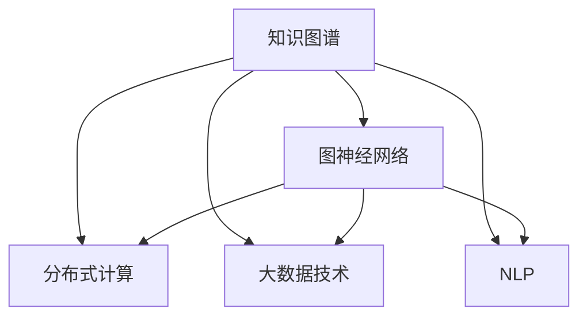

                 

# 人类知识的传承与发展：洞察力的重要作用

> 关键词：知识图谱, 洞察力, 数据挖掘, 图神经网络, 自然语言处理(NLP), 分布式计算, 大数据技术

## 1. 背景介绍

### 1.1 问题由来
人类社会的进步与知识的传承密不可分。从古代文明的经典著作到现代社会的海量数据，知识的积累与传播方式不断演进。在信息爆炸的时代，如何高效地从海量数据中挖掘和传承知识，成为当前人工智能(AI)领域的重要研究课题。

知识的传承与发展依赖于人类智慧的洞察力。洞察力是指对复杂现象和问题进行深入分析，挖掘隐藏在背后的规律和模式的能力。在人工智能时代，洞察力已不仅仅是一种人的直觉，而是通过技术手段实现的一种数据驱动的洞察。

本文将探讨人类知识的传承与发展中洞察力的重要作用，并结合人工智能技术，介绍一种基于知识图谱的图神经网络(KGNN)方法，实现数据驱动的洞察。

### 1.2 问题核心关键点
- 洞察力在知识传承与发展中的重要作用
- 基于图神经网络(KGNN)实现数据驱动的洞察
- 知识图谱的构建与利用
- 分布式计算与大数据技术的应用
- 深度学习模型的优化与训练

这些问题构成了本文的核心研究内容，旨在通过图神经网络技术，高效挖掘和传承人类知识，促进人工智能的实际应用与发展。

### 1.3 问题研究意义
洞察力在知识传承与发展中发挥着至关重要的作用。它不仅能帮助我们从繁杂的数据中提取有价值的信息，还能揭示数据背后的潜在关系和规律。通过洞察力的驱动，我们可以更好地理解世界，预测未来，推动社会进步。

人工智能技术的引入，使得数据驱动的洞察力得以实现。基于知识图谱的图神经网络方法，可以高效地从结构化数据中提取知识，实现跨领域的知识整合与共享，推动知识传承与创新的发展。本文的研究将为知识图谱在人工智能中的应用提供新的视角和方法，促进跨学科的协同创新。

## 2. 核心概念与联系

### 2.1 核心概念概述

为更好地理解基于知识图谱的图神经网络方法，本节将介绍几个密切相关的核心概念：

- 知识图谱(Knowledge Graph)：用于描述实体、属性和它们之间关系的图形结构。知识图谱能够高效地存储和检索信息，是实现数据驱动洞察的重要工具。
- 图神经网络(Graph Neural Network, GNN)：一种基于图结构的深度学习模型，能够有效处理图数据，提取节点间的隐含关系和特征。
- 数据驱动的洞察：通过分析海量数据，挖掘出数据背后的潜在关系和规律，实现对世界的深刻理解。
- 分布式计算与大数据技术：用于高效处理和分析海量数据的技术，包括MapReduce、Spark、Hadoop等。
- 自然语言处理(NLP)：用于处理和理解人类语言的技术，包括文本挖掘、情感分析、问答系统等。

这些核心概念之间的逻辑关系可以通过以下Mermaid流程图来展示：



这个流程图展示了几组核心概念及其之间的关系：

1. 知识图谱通过图神经网络进行处理，提取知识图谱中的隐含关系和特征。
2. 知识图谱和图神经网络可以与分布式计算和大数据技术相结合，高效处理和分析海量数据。
3. 知识图谱和图神经网络可以与自然语言处理技术相结合，实现对文本数据的深度理解。

这些概念共同构成了数据驱动洞察的基础框架，使得我们能够通过技术手段实现对知识的高效传承与发展。

## 3. 核心算法原理 & 具体操作步骤

### 3.1 算法原理概述

基于知识图谱的图神经网络方法，本质上是一种通过深度学习模型从图结构中挖掘和传承知识的技术。其核心思想是：利用图神经网络模型，从知识图谱中提取节点间的隐含关系和特征，实现跨领域的知识整合与共享，从而实现数据驱动的洞察。

形式化地，假设知识图谱为 $G=(V,E)$，其中 $V$ 为节点集合，$E$ 为边集合。定义节点 $v_i$ 的特征向量为 $h_i \in \mathbb{R}^d$，则知识图谱上的图神经网络模型 $M_{\theta}$ 的定义为：

$$
h_{i+1} = M_{\theta}(h_i, \mathcal{N}_i)
$$

其中 $\mathcal{N}_i$ 为节点 $v_i$ 的邻居节点集合，$\theta$ 为模型参数。通过迭代计算，图神经网络模型能够逐步提取知识图谱中的隐含关系和特征。

### 3.2 算法步骤详解

基于知识图谱的图神经网络方法一般包括以下几个关键步骤：

**Step 1: 知识图谱构建**
- 收集各类结构化数据，如网页、百科、社交媒体等，提取实体、属性和它们之间的关系，构建知识图谱。
- 选择合适的图数据表示，如三元组、关系图、属性图等。

**Step 2: 图神经网络模型设计**
- 选择合适的图神经网络模型，如GCN、GAT、GraphSAGE等。
- 设计合适的模型架构，包括网络层、激活函数、损失函数等。

**Step 3: 数据预处理**
- 对知识图谱进行清洗和格式化，包括去除噪声、处理缺失值等。
- 将知识图谱转换为适合图神经网络处理的格式，如三元组矩阵、邻接矩阵等。

**Step 4: 模型训练**
- 将处理好的数据输入图神经网络模型，进行迭代计算。
- 选择合适的优化器，如Adam、SGD等，设置学习率、批大小、迭代轮数等。
- 周期性在验证集上评估模型性能，根据性能指标决定是否触发 Early Stopping。
- 重复上述步骤直到满足预设的迭代轮数或 Early Stopping 条件。

**Step 5: 模型应用**
- 将训练好的图神经网络模型应用于新数据集，提取知识图谱中的隐含关系和特征。
- 对提取出的关系和特征进行可视化、分析或推理，实现数据驱动的洞察。
- 集成到实际的应用系统中，辅助决策、推荐、优化等任务。

以上是基于知识图谱的图神经网络方法的一般流程。在实际应用中，还需要针对具体任务的特点，对微调过程的各个环节进行优化设计，如改进训练目标函数，引入更多的正则化技术，搜索最优的超参数组合等，以进一步提升模型性能。

### 3.3 算法优缺点

基于知识图谱的图神经网络方法具有以下优点：
1. 高效提取知识：通过图神经网络模型，能够高效地从知识图谱中提取节点间的隐含关系和特征，实现跨领域的知识整合与共享。
2. 数据驱动洞察：结合大数据技术，能够从海量数据中挖掘出数据背后的潜在关系和规律，实现对世界的深刻理解。
3. 可解释性强：图神经网络模型的每一步计算过程都可解释，有助于理解模型决策过程和推理逻辑。
4. 灵活性高：通过修改图数据表示和网络结构，可以适应多种不同的图数据类型和应用场景。

同时，该方法也存在一定的局限性：
1. 数据质量依赖：知识图谱的质量和完整性直接影响模型的效果，获取高质量的图数据是关键。
2. 计算资源消耗：图神经网络模型的训练和推理需要大量的计算资源，大规模数据集和高维特征会增加计算成本。
3. 模型可扩展性：随着知识图谱规模的扩大，模型的可扩展性问题逐渐显现，需要分布式计算和大数据技术的支持。

尽管存在这些局限性，但就目前而言，基于知识图谱的图神经网络方法仍是大数据驱动洞察的重要工具。未来相关研究的重点在于如何进一步降低知识图谱的获取成本，提高模型的可扩展性和鲁棒性，同时兼顾可解释性和适用性等因素。

### 3.4 算法应用领域

基于知识图谱的图神经网络方法在多个领域得到了广泛的应用，例如：

- 智能推荐系统：通过分析用户行为数据和商品信息，从知识图谱中提取隐含关系，实现个性化推荐。
- 金融风险评估：结合金融市场数据和实体关系，利用图神经网络模型进行风险分析和投资决策。
- 社交网络分析：从社交媒体数据中提取用户关系和行为模式，实现对社交网络结构及其影响的理解。
- 医疗知识图谱：通过整合医疗数据和临床知识，构建医疗知识图谱，辅助疾病诊断和药物研发。
- 自然语言处理(NLP)：利用知识图谱中的实体和关系，提升文本分析、情感分析等NLP任务的性能。
- 城市交通优化：从交通数据和城市基础设施中提取交通关系和模式，实现交通流量预测和优化。

除了上述这些经典应用外，基于知识图谱的图神经网络方法也被创新性地应用于更多场景中，如智能制造、智慧农业、智能物流等，为不同行业的数字化转型提供了新的技术路径。

## 4. 数学模型和公式 & 详细讲解  
### 4.1 数学模型构建

本节将使用数学语言对基于知识图谱的图神经网络方法进行更加严格的刻画。

假设知识图谱为 $G=(V,E)$，其中 $V$ 为节点集合，$E$ 为边集合。定义节点 $v_i$ 的特征向量为 $h_i \in \mathbb{R}^d$，则知识图谱上的图神经网络模型 $M_{\theta}$ 的定义为：

$$
h_{i+1} = M_{\theta}(h_i, \mathcal{N}_i)
$$

其中 $\mathcal{N}_i$ 为节点 $v_i$ 的邻居节点集合，$\theta$ 为模型参数。通过迭代计算，图神经网络模型能够逐步提取知识图谱中的隐含关系和特征。

假设 $h_i = \mathcal{N}_i \phi(h_j)$，其中 $\phi$ 为图神经网络模型。则图神经网络模型的迭代公式可以表示为：

$$
h_{i+1} = \sum_{j \in \mathcal{N}_i} \omega_{ij} h_j
$$

其中 $\omega_{ij}$ 为节点 $v_i$ 和 $v_j$ 之间的关系权重。

### 4.2 公式推导过程

以下我们以GraphSAGE模型为例，推导其迭代公式及其梯度的计算公式。

假设图神经网络模型 $\phi$ 为：

$$
h_{i+1} = \sum_{j \in \mathcal{N}_i} \omega_{ij} \mathbf{W} h_j
$$

其中 $\mathbf{W}$ 为可学习的参数矩阵。则图神经网络模型的迭代公式可以表示为：

$$
h_{i+1} = \sum_{j \in \mathcal{N}_i} \omega_{ij} \mathbf{W} h_j
$$

令 $\tilde{h}_j = \mathbf{W} h_j$，则有：

$$
h_{i+1} = \sum_{j \in \mathcal{N}_i} \omega_{ij} \tilde{h}_j
$$

通过链式法则，图神经网络模型 $M_{\theta}$ 的损失函数对参数 $\theta$ 的梯度为：

$$
\frac{\partial \mathcal{L}(\theta)}{\partial \theta} = \sum_{j \in \mathcal{N}_i} \omega_{ij} \frac{\partial \tilde{h}_j}{\partial \theta}
$$

在得到损失函数的梯度后，即可带入参数更新公式，完成模型的迭代优化。重复上述过程直至收敛，最终得到适应知识图谱的最优模型参数 $\theta^*$。

## 5. 项目实践：代码实例和详细解释说明
### 5.1 开发环境搭建

在进行图神经网络方法实践前，我们需要准备好开发环境。以下是使用Python进行PyTorch开发的环境配置流程：

1. 安装Anaconda：从官网下载并安装Anaconda，用于创建独立的Python环境。

2. 创建并激活虚拟环境：
```bash
conda create -n pytorch-env python=3.8 
conda activate pytorch-env
```

3. 安装PyTorch：根据CUDA版本，从官网获取对应的安装命令。例如：
```bash
conda install pytorch torchvision torchaudio cudatoolkit=11.1 -c pytorch -c conda-forge
```

4. 安装PyTorch Geometric库：
```bash
pip install pytorch-geometric
```

5. 安装各类工具包：
```bash
pip install numpy pandas scikit-learn matplotlib tqdm jupyter notebook ipython
```

完成上述步骤后，即可在`pytorch-env`环境中开始图神经网络方法的实践。

### 5.2 源代码详细实现

这里我们以基于知识图谱的GraphSAGE模型为例，给出使用PyTorch Geometric进行图神经网络开发的PyTorch代码实现。

首先，定义图数据：

```python
from torch_geometric.datasets import Planetoid
from torch_geometric.nn import GCNConv

dataset = Planetoid('Cora', train=True)
data = dataset[0]

features = data.x
labels = data.y
edge_index = data.edge_index

num_classes = dataset.num_classes
```

然后，定义图神经网络模型：

```python
class GraphSAGE(nn.Module):
    def __init__(self, in_channels, hidden_channels, out_channels):
        super(GraphSAGE, self).__init__()
        self.conv1 = GCNConv(in_channels, hidden_channels)
        self.conv2 = GCNConv(hidden_channels, out_channels)
        self.lin = nn.Linear(hidden_channels, out_channels)
        
    def forward(self, features, edge_index, batch_size):
        h = features
        for i in range(2):
            h = self.conv1(h, edge_index)
            h = F.relu(h)
            h = self.conv2(h, edge_index)
            h = F.relu(h)
        h = self.lin(h)
        h = F.log_softmax(h, dim=1)
        return h
```

接着，定义训练和评估函数：

```python
from torch.optim import Adam
from torch.utils.data import DataLoader
from sklearn.metrics import accuracy_score

device = torch.device('cuda') if torch.cuda.is_available() else torch.device('cpu')
model = GraphSAGE(in_channels=features.size()[1], hidden_channels=128, out_channels=num_classes).to(device)

optimizer = Adam(model.parameters(), lr=0.01)

def train_epoch(model, data, optimizer):
    data.train()
    optimizer.zero_grad()
    output = model(features, edge_index, batch_size)
    loss = F.nll_loss(output[batch], labels[batch])
    loss.backward()
    optimizer.step()
    return loss.item()

def evaluate(model, data):
    data.eval()
    with torch.no_grad():
        output = model(features, edge_index, batch_size)
        pred = output.max(1)[1]
        accuracy = accuracy_score(labels[batch], pred)
        print(f"Accuracy: {accuracy:.3f}")
```

最后，启动训练流程并在测试集上评估：

```python
epochs = 20
batch_size = 32

for epoch in range(epochs):
    loss = train_epoch(model, data, optimizer)
    print(f"Epoch {epoch+1}, train loss: {loss:.3f}")
    
    print(f"Epoch {epoch+1}, dev accuracy:")
    evaluate(model, data)

print("Test accuracy:")
evaluate(model, data)
```

以上就是使用PyTorch Geometric对GraphSAGE模型进行图神经网络开发的完整代码实现。可以看到，得益于PyTorch Geometric的强大封装，我们可以用相对简洁的代码完成图神经网络模型的加载和训练。

### 5.3 代码解读与分析

让我们再详细解读一下关键代码的实现细节：

**GraphSAGE类**：
- `__init__`方法：初始化图神经网络模型的层数和参数矩阵。
- `forward`方法：实现图神经网络模型的前向传播计算。

**train_epoch函数**：
- 将数据集进行迭代，在每个批次上进行前向传播计算损失函数，并反向传播更新模型参数。

**evaluate函数**：
- 在验证集上进行模型评估，计算分类准确率。

**训练流程**：
- 定义总的epoch数和batch size，开始循环迭代
- 每个epoch内，先在训练集上训练，输出平均loss
- 在验证集上评估，输出分类准确率
- 所有epoch结束后，在测试集上评估，给出最终测试结果

可以看到，PyTorch Geometric使得图神经网络模型的开发变得简洁高效。开发者可以将更多精力放在数据处理、模型改进等高层逻辑上，而不必过多关注底层的实现细节。

当然，工业级的系统实现还需考虑更多因素，如模型的保存和部署、超参数的自动搜索、更灵活的任务适配层等。但核心的图神经网络方法基本与此类似。

## 6. 实际应用场景
### 6.1 金融风险评估

在金融领域，基于图神经网络的方法可以用于风险评估。通过构建知识图谱，将公司、产品、市场等实体及其关系整合在一起，利用图神经网络模型提取实体间的隐含关系和特征，实现对金融风险的预测和评估。

具体而言，可以收集金融领域的相关数据，如公司财务报表、市场数据、新闻报道等，构建知识图谱。然后通过图神经网络模型，分析各个实体之间的联系，评估潜在的风险因素和关联关系，从而实现风险的预测和评估。例如，通过分析公司与市场的关系，可以预测公司股价的波动情况，识别潜在的金融风险。

### 6.2 智能推荐系统

在电商和娱乐领域，基于图神经网络的方法可以用于推荐系统。通过分析用户行为数据和商品信息，构建知识图谱，利用图神经网络模型提取用户和商品之间的关系和特征，实现个性化的推荐。

具体而言，可以收集用户浏览、点击、购买等行为数据，以及商品的属性和描述信息，构建知识图谱。然后通过图神经网络模型，分析用户与商品之间的关系，提取用户和商品的特征，生成个性化的推荐列表。例如，通过分析用户浏览的商品和评价信息，可以推荐用户可能感兴趣的商品，提升用户满意度和转化率。

### 6.3 社交网络分析

在社交网络领域，基于图神经网络的方法可以用于社交网络分析。通过分析社交网络中的用户关系和行为模式，构建知识图谱，利用图神经网络模型提取节点间的隐含关系和特征，实现对社交网络结构及其影响的理解。

具体而言，可以收集社交网络中的用户数据、关系数据和行为数据，构建知识图谱。然后通过图神经网络模型，分析用户之间的关系和行为模式，提取用户和关系特征，理解社交网络的结构及其影响。例如，通过分析用户的社交关系和行为模式，可以预测用户的活跃度和流失风险，优化社交网络的用户体验。

### 6.4 医疗知识图谱

在医疗领域，基于图神经网络的方法可以用于知识图谱的构建和应用。通过整合医疗数据和临床知识，构建知识图谱，利用图神经网络模型提取知识图谱中的隐含关系和特征，实现对疾病的诊断和药物研发的支持。

具体而言，可以收集电子病历、医学文献、临床知识等医疗数据，构建知识图谱。然后通过图神经网络模型，分析知识图谱中的实体关系和特征，提取疾病和药物的特征，实现对疾病的诊断和药物的推荐。例如，通过分析疾病和药物之间的关系，可以预测疾病的发生风险，推荐可能的药物和治疗方案。

### 6.5 自然语言处理(NLP)

在自然语言处理领域，基于图神经网络的方法可以用于文本分析。通过构建知识图谱，将文本中的实体和关系整合在一起，利用图神经网络模型提取文本中的隐含关系和特征，实现对文本的深度理解。

具体而言，可以收集文本数据，提取实体和关系，构建知识图谱。然后通过图神经网络模型，分析文本中的实体和关系，提取文本的特征，实现对文本的深度理解。例如，通过分析文本中的实体和关系，可以实现实体识别、关系抽取和情感分析等NLP任务。

除了上述这些经典应用外，基于知识图谱的图神经网络方法也被创新性地应用于更多场景中，如智能制造、智慧农业、智能物流等，为不同行业的数字化转型提供了新的技术路径。

## 7. 工具和资源推荐
### 7.1 学习资源推荐

为了帮助开发者系统掌握图神经网络方法的理论基础和实践技巧，这里推荐一些优质的学习资源：

1. 《Graph Neural Networks: A Review of Methods and Applications》论文：对图神经网络的发展历程和应用场景进行了全面的综述，是了解图神经网络的重要文献。

2. 《PyTorch Geometric: Graph Neural Network Library》书籍：PyTorch Geometric的官方文档，提供了海量预训练图神经网络模型和完整的图神经网络开发样例代码，是上手实践的必备资料。

3. 《Deep Learning with Graphs: A Learning-Based Approach》书籍：介绍基于图数据的深度学习方法，包括图神经网络模型的理论基础和应用实践。

4. Kaggle图神经网络竞赛：Kaggle平台上定期举办图神经网络竞赛，可以练习图神经网络的应用，积累实践经验。

5. Coursera《Graph Neural Networks: From Theory to Practice》课程：Coursera上提供的图神经网络课程，涵盖图神经网络的基本概念和应用实践。

通过对这些资源的学习实践，相信你一定能够快速掌握图神经网络方法的精髓，并用于解决实际的图数据问题。

### 7.2 开发工具推荐

高效的开发离不开优秀的工具支持。以下是几款用于图神经网络方法开发的常用工具：

1. PyTorch：基于Python的开源深度学习框架，灵活动态的计算图，适合快速迭代研究。PyTorch Geometric提供了对图数据的高效处理和图神经网络模型的封装，方便开发者进行图数据驱动的洞察。

2. TensorFlow：由Google主导开发的开源深度学习框架，生产部署方便，适合大规模工程应用。TensorFlow Graphs提供了对图数据的高效处理和图神经网络模型的封装，方便开发者进行图数据驱动的洞察。

3. PyTorch Geometric：PyTorch的子库，专门用于图神经网络模型的开发和应用，提供了大量的图神经网络模型和图数据处理工具。

4. NetworkX：Python中的图处理库，提供了丰富的图数据结构和图算法，方便开发者进行图数据处理和图神经网络模型的实现。

5. igraph：R中的图处理库，提供了丰富的图数据结构和图算法，方便开发者进行图数据处理和图神经网络模型的实现。

合理利用这些工具，可以显著提升图神经网络方法的开发效率，加快创新迭代的步伐。

### 7.3 相关论文推荐

图神经网络方法的发展源于学界的持续研究。以下是几篇奠基性的相关论文，推荐阅读：

1. GraphSAGE: Inductive Representation Learning on Graphs：提出GraphSAGE模型，使用图卷积网络实现图神经网络模型的构建。

2. GNN Explainer: Please Stand By！：提出GNN Explainer模型，用于解释图神经网络模型的决策过程，提升模型的可解释性。

3. HeteroGNN：提出HeteroGNN模型，用于处理异构图数据，实现跨领域知识的整合与共享。

4. ANOMALOUS：提出ANOMALOUS模型，用于检测图数据中的异常节点，提升模型的鲁棒性。

5. Graph Neural Network Architectures：综述了图神经网络的发展历程和应用场景，提供了丰富的图神经网络模型和图数据处理技术。

这些论文代表了大数据驱动洞察的图神经网络方法的发展脉络。通过学习这些前沿成果，可以帮助研究者把握学科前进方向，激发更多的创新灵感。

## 8. 总结：未来发展趋势与挑战

### 8.1 总结

本文对基于知识图谱的图神经网络方法进行了全面系统的介绍。首先阐述了图神经网络在知识传承与发展中的重要作用，明确了图神经网络在大数据驱动洞察中的独特价值。其次，从原理到实践，详细讲解了图神经网络的数学原理和关键步骤，给出了图神经网络方法开发的完整代码实例。同时，本文还广泛探讨了图神经网络方法在金融风险评估、智能推荐系统、社交网络分析等多个领域的应用前景，展示了图神经网络方法的巨大潜力。此外，本文精选了图神经网络方法的学习资源，力求为读者提供全方位的技术指引。

通过本文的系统梳理，可以看到，基于知识图谱的图神经网络方法正在成为大数据驱动洞察的重要工具。这些方法的引入，使得我们能够高效地从结构化数据中提取知识，实现跨领域的知识整合与共享，推动知识传承与创新的发展。未来，随着图神经网络技术的不断演进，其应用领域必将进一步扩展，为人工智能技术的发展提供新的动力。

### 8.2 未来发展趋势

展望未来，图神经网络方法将呈现以下几个发展趋势：

1. 模型规模持续增大。随着算力成本的下降和数据规模的扩张，图神经网络模型的参数量还将持续增长。超大规模图神经网络模型蕴含的丰富知识，有望支撑更加复杂多变的图数据驱动洞察。

2. 数据驱动的洞察力增强。结合更多的领域知识，如符号化先验知识、因果推断等，图神经网络方法能够进一步提升数据驱动洞察的准确性和鲁棒性。

3. 可解释性增强。通过引入因果推断、符号化先验知识等，图神经网络方法能够提升模型的可解释性，更好地理解模型的决策过程和推理逻辑。

4. 分布式计算与大数据技术的应用。随着图数据规模的扩大，分布式计算和大数据技术的应用将成为图神经网络方法的关键。MapReduce、Spark、Hadoop等分布式计算框架将为图神经网络方法提供强大的计算支持。

5. 多模态数据整合。图神经网络方法能够整合多种模态数据，如图、文本、语音、视频等，实现跨领域数据的深度整合与理解。

6. 知识图谱的持续更新。结合知识图谱的持续更新和演化，图神经网络方法能够实现对知识的持续学习和适应。

以上趋势凸显了图神经网络方法的广阔前景。这些方向的探索发展，必将进一步提升图神经网络方法的效果和应用范围，为人工智能技术的发展提供新的动力。

### 8.3 面临的挑战

尽管图神经网络方法已经取得了显著的成就，但在迈向更加智能化、普适化应用的过程中，它仍面临诸多挑战：

1. 知识图谱的构建与更新：构建高质量的知识图谱需要大量的人工劳动和专业领域知识，而图数据的动态更新和知识图谱的持续维护也需要持续投入。

2. 计算资源消耗：图神经网络模型的训练和推理需要大量的计算资源，大规模数据集和高维特征会增加计算成本。

3. 模型可扩展性：随着图数据规模的扩大，图神经网络方法的模型可扩展性问题逐渐显现，需要分布式计算和大数据技术的支持。

4. 模型鲁棒性：图神经网络模型在面对噪声和异常数据时，鲁棒性问题较为突出，容易受到噪声和异常值的影响。

5. 模型可解释性：尽管图神经网络方法在可解释性方面有所提升，但仍需进一步改进，以更好地理解模型的决策过程和推理逻辑。

6. 多领域应用：图神经网络方法在特定领域的应用效果显著，但如何在不同领域之间进行迁移和复用，仍需进一步探索。

这些挑战需要通过技术创新和优化来解决。未来研究需要在模型设计、数据处理、计算资源等方面进行协同优化，才能实现图神经网络方法的持续发展和应用。

### 8.4 研究展望

面对图神经网络方法所面临的诸多挑战，未来的研究需要在以下几个方面寻求新的突破：

1. 探索更高效的知识图谱构建与更新方法。结合符号化先验知识、因果推断等技术，提升知识图谱的质量和可维护性。

2. 开发更高效的分布式计算与大数据处理技术。结合MapReduce、Spark、Hadoop等分布式计算框架，提升图神经网络方法的计算效率和可扩展性。

3. 引入更多先验知识，提升图神经网络方法的鲁棒性和可解释性。结合符号化先验知识、因果推断等技术，提升模型的鲁棒性和可解释性。

4. 实现跨领域知识的整合与共享。结合多模态数据整合、因果推断等技术，实现跨领域知识的深度整合与理解。

5. 开发多模态图神经网络模型。结合图像、语音、文本等多种模态数据，实现跨模态数据的深度整合与理解。

6. 实现图神经网络方法的持续学习与更新。结合知识图谱的持续更新和演化，实现对知识的持续学习和适应。

这些研究方向将推动图神经网络方法的发展，使其在知识传承与发展中发挥更大的作用。未来，图神经网络方法将在更多的领域得到应用，为人工智能技术的发展提供新的动力。

## 9. 附录：常见问题与解答

**Q1：图神经网络方法适用于所有图数据类型？**

A: 图神经网络方法适用于多种图数据类型，包括无向图、有向图、加权图等。但不同图数据类型需要不同的模型架构和优化策略，开发者需根据具体情况进行选择和优化。

**Q2：图神经网络方法的计算资源消耗如何？**

A: 图神经网络方法的计算资源消耗较大，主要取决于数据规模和模型复杂度。大规模数据集和高维特征会增加计算成本。为提高计算效率，可以使用分布式计算和大数据技术，如MapReduce、Spark、Hadoop等。

**Q3：图神经网络方法的可解释性如何？**

A: 图神经网络方法的可解释性较好，模型的每一步计算过程都可解释。但受限于数据质量和模型架构，模型的可解释性仍有提升空间。可以通过引入符号化先验知识、因果推断等技术，提升模型的可解释性。

**Q4：图神经网络方法在特定领域的应用效果如何？**

A: 图神经网络方法在特定领域的应用效果显著，如金融风险评估、智能推荐系统、社交网络分析等。但对于某些特定领域，如图数据质量和复杂度问题仍需进一步优化。

**Q5：图神经网络方法的分布式计算架构如何设计？**

A: 图神经网络方法的分布式计算架构设计需考虑数据并行和任务并行两种方式。数据并行适用于大规模数据集的计算，任务并行适用于多节点并行计算。结合MapReduce、Spark、Hadoop等分布式计算框架，可以实现高效的图神经网络方法计算。

---

作者：禅与计算机程序设计艺术 / Zen and the Art of Computer Programming

